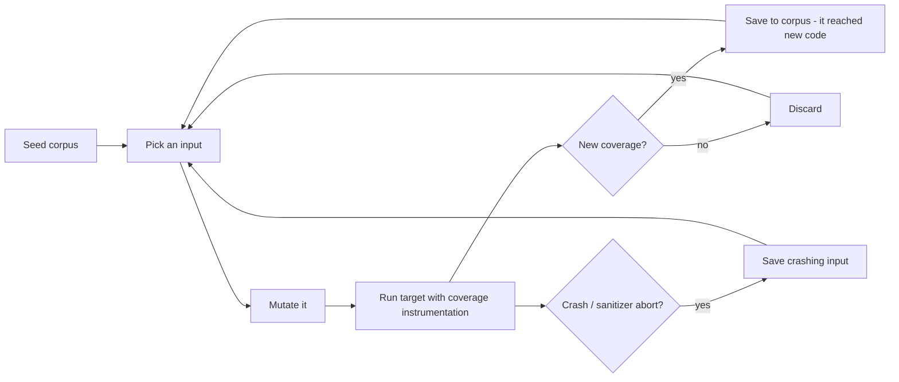
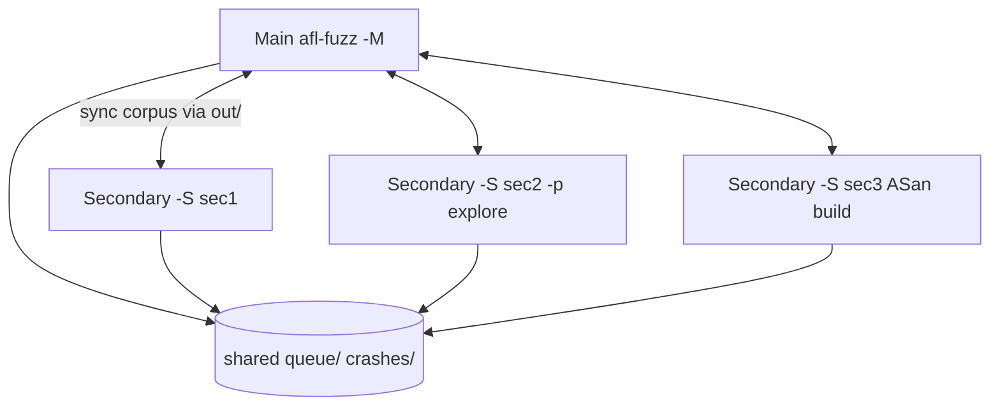
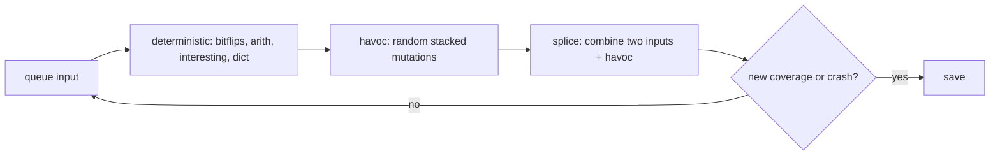
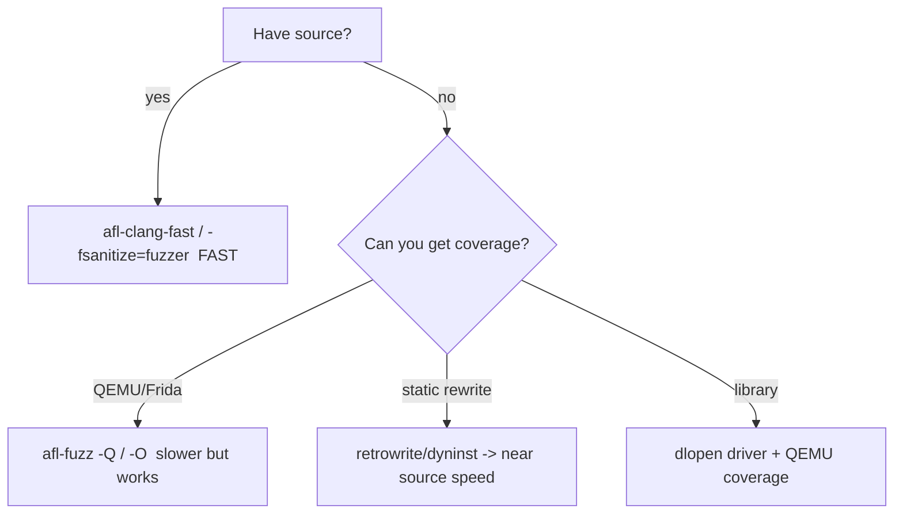
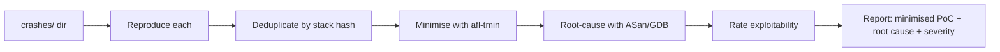
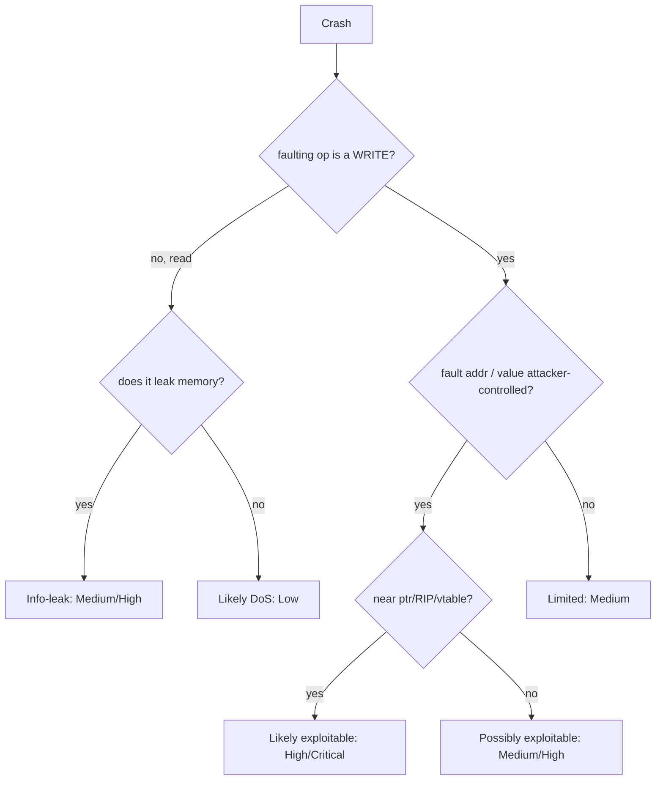
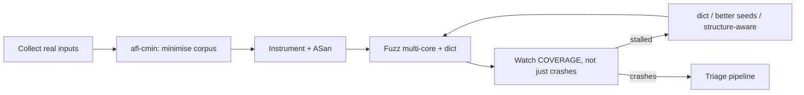
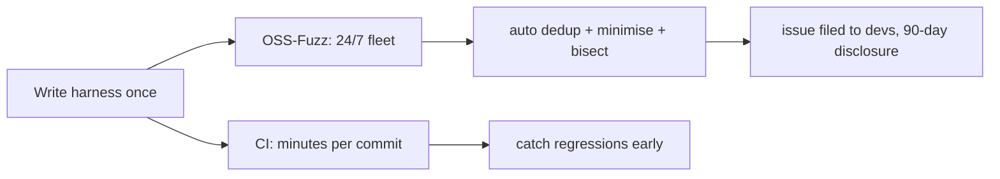

This is Chapter 8 of the Binary Exploitation notebook and the one that closes the loop. Chapters 2–7 assumed you already *had* a bug — a stack overflow, a format string, a UAF — and taught you to weaponise it. This chapter is about the step that comes first and matters most in real vulnerability research: **finding** those bugs at scale. The dominant technique, responsible for the overwhelming majority of memory-safety CVEs discovered in the last decade, is **fuzzing**: automatically feeding a program a torrent of malformed inputs and watching for crashes.

Naïve fuzzing (throw random bytes at a program) finds shallow bugs and then stalls. The breakthrough that made fuzzing the industry-standard bug-finding method is **coverage-guided fuzzing** — the fuzzer instruments the target to observe which code paths each input exercises, and *evolves* its inputs toward ones that reach new code. It's a feedback loop that, given a trivial starting input, teaches itself the target's input format well enough to find deep bugs. AFL and its successor **AFL++**, plus **libFuzzer**, made this accessible to everyone, and **OSS-Fuzz** now runs it continuously against thousands of open-source projects.

This chapter teaches the mental model, then AFL++ and libFuzzer end to end, then the underrated other half of the job — **crash triage**: turning a pile of crashing inputs into a minimised, deduplicated, root-caused, exploitability-rated bug report. Everything targets software you own or are authorised to test; fuzzing is the canonical *defensive* and *research* activity, and finding a bug before an adversary does is the whole point.

---

## Part 1: What a Fuzzer Is and Why Coverage Changes Everything

A **fuzzer** is a program that generates inputs for a target program, runs the target on each, and detects when the target misbehaves (crash, hang, sanitizer abort). The three parts:

1. **Input generation** — produce a candidate input (by mutating existing inputs, or generating from a grammar).
2. **Execution** — run the target on the input.
3. **Observation** — detect a bug (signal like `SIGSEGV`/`SIGABRT`, a sanitizer report, a timeout) and decide whether the input is "interesting" enough to keep.

The difference between a toy and a bug-finder is step 3's feedback. Consider a target with `if (input[0]=='F' && input[1]=='U' && input[2]=='Z' && input[3]=='Z') crash();`. Random fuzzing needs ~2^32 tries to hit `FUZZ`. A **coverage-guided** fuzzer notices that an input starting with `F` reaches a *new branch* (the second `if`), saves it, and mutates *from it* — solving each byte in turn, reaching the crash in seconds. Coverage feedback turns an exponential search into a guided, incremental one.



**Coverage** is measured as *edges* (transitions between basic blocks), not just lines — an edge-coverage bitmap. Instrumentation inserted at compile time (or via binary rewriting/QEMU for closed source) records, for each execution, which edges fired. The fuzzer keeps any input that lights up an edge not seen before; that growing corpus is the fuzzer's evolving understanding of the program.

The taxonomy you should know:

| Axis | Options | Notes |
|---|---|---|
| Feedback | coverage-guided vs blackbox | coverage-guided (AFL++, libFuzzer) is the default; blackbox only when you can't instrument |
| Generation | mutation-based vs generation-based | mutation flips bytes in a corpus; generation builds from a grammar/model |
| Placement | out-of-process (AFL++) vs in-process (libFuzzer) | in-process is faster but needs a harness and crash-resilience |
| Source | source-available (compile-time instr) vs binary-only (QEMU/Frida/dyninst) | source is faster & richer; binary-only for closed targets |

---

## Part 1b: A Short History (and Why It Matters)

Knowing the lineage explains the modern tooling. Fuzzing began in 1988–1990 with Barton Miller's University of Wisconsin experiment — feeding random input to UNIX utilities and finding that ~25–33% crashed. That was **blackbox** fuzzing: effective but shallow. The field then split into:

- **Mutation vs generation:** flip bytes in real inputs (mutation) vs build inputs from a model (generation, e.g. SPIKE for protocols, PROTOS for formats).
- **The coverage revolution (2013–2014):** **AFL** (Michal Zalewski) introduced lightweight compile-time edge instrumentation + a genetic loop, and **libFuzzer** brought in-process coverage fuzzing to LLVM. Suddenly a fuzzer could *learn* an input format from a trivial seed.
- **Sanitizers (2012+):** **AddressSanitizer** made silent corruption loud, multiplying the bug yield of every fuzzer.
- **Scale (2016+):** **OSS-Fuzz** put continuous coverage-guided fuzzing behind thousands of open-source projects, finding tens of thousands of bugs; **AFL++** consolidated the community's research (CmpLog/redqueen, QEMU/Frida modes, custom mutators) into one maintained tool.

The lesson embedded in that history: **each leap came from better *feedback*, not more brute force.** Blackbox → coverage → sanitizer-assisted → structure-aware is a progression of giving the fuzzer more insight into the target. When your campaign stalls, the fix is almost always "add feedback/structure", echoing the whole field's evolution.

Famous fuzzing finds — Heartbleed (OpenSSL, found post-hoc trivially by fuzzers), Shellshock-adjacent parser bugs, Cloudbleed, and a large fraction of every browser/kernel/media-codec CVE list — underline the stakes: if it parses untrusted input and isn't fuzzed, it has bugs waiting.

---

## Part 2: AFL++ — The Coverage-Guided Workhorse

**AFL++** (American Fuzzy Lop plus plus) is the community-maintained, feature-rich successor to Michal Zalewski's original AFL. It is the default choice for fuzzing a program that reads a file or stdin. **What it is:** an out-of-process, mutation-based, coverage-guided fuzzer with compile-time instrumentation. **Why it exists:** to make coverage-guided fuzzing turnkey — you instrument your target, give it a seed, and it evolves crashes.

Install on Kali/Ubuntu:

```bash
$ sudo apt install afl++            # or build from source: github.com/AFLplusplus/AFLplusplus
$ afl-fuzz --version
afl-fuzz++4.x
$ which afl-cc afl-clang-fast afl-fuzz afl-tmin afl-cmin afl-showmap
```

The tools you'll use:

| Tool | Purpose |
|---|---|
| `afl-cc` / `afl-clang-fast` / `afl-gcc-fast` | compiler wrappers that insert coverage instrumentation |
| `afl-fuzz` | the fuzzer itself (the main loop) |
| `afl-cmin` | corpus minimisation (drop redundant seeds, keep coverage) |
| `afl-tmin` | test-case minimisation (shrink one crashing input to essentials) |
| `afl-showmap` | show which edges one input covers (triage/dedup) |
| `afl-whatsup` | summarise a multi-core fuzzing campaign |

### 2.1 Instrumenting a target

The first step is always to compile the target with AFL's instrumentation so `afl-fuzz` gets coverage feedback:

```bash
# source-available target: swap the compiler for afl-clang-fast
$ CC=afl-clang-fast CXX=afl-clang-fast++ ./configure && make
# or directly:
$ afl-clang-fast -O2 -o target_afl target.c
# add sanitizers to catch bugs that don't crash on their own (HIGHLY recommended):
$ AFL_USE_ASAN=1 afl-clang-fast -g -O1 -o target_asan target.c
```

`AFL_USE_ASAN=1` compiles in **AddressSanitizer**, so heap overflows, UAFs, and OOB reads that wouldn't otherwise segfault become loud aborts the fuzzer detects — this dramatically increases bug yield and is the single most important flag to remember.

### 2.2 The corpus and dictionary

Fuzzing starts from a **seed corpus** — a directory of valid (or near-valid) example inputs. A good seed that already parses deeply lets the fuzzer explore from a rich starting point instead of rediscovering the file format:

```bash
$ mkdir in && cp samples/*.png in/          # real valid inputs as seeds
$ echo "hello" > in/seed1                    # even one tiny seed works for simple targets
```

A **dictionary** gives the fuzzer known-meaningful tokens (magic bytes, keywords) to splice in, hugely speeding up formats with fixed strings:

```bash
# dict.txt with tokens the format uses
$ cat dict.txt
magic="\x89PNG"
kw_ihdr="IHDR"
kw_idat="IDAT"
```

### 2.3 Running afl-fuzz

```bash
$ afl-fuzz -i in -o out -x dict.txt -- ./target_asan @@
```

- `-i in` — seed corpus directory.
- `-o out` — output directory (holds `queue/`, `crashes/`, `hangs/`, stats).
- `-x dict.txt` — optional dictionary.
- `-- ./target_asan @@` — the target command; **`@@`** is replaced with the path to each generated input file (omit `@@` if the target reads stdin).

AFL++ presents a live status screen you must be able to read:

```
      american fuzzy lop ++4.10c
┌─ process timing ─────────────────────┬─ overall results ────┐
│        run time : 0 days, 2 hrs       │  cycles done : 14    │
│   last new find : 0 days, 0 hrs, 3 min│ corpus count : 1874  │
│ last saved crash: 0 days, 0 hrs, 8 min│ saved crashes: 3     │
│  last saved hang: none seen yet       │  saved hangs : 0     │
├─ cycle progress ─────────┬─ map coverage┤────────────────────┤
│  now processing : 812    │    map density : 12.4% / 38.9%    │
│  paths timed out : 0     │ count coverage : 3.1 bits/tuple   │
├─ stage progress ─────────┼─ findings in depth ───────────────┤
│  now trying : havoc      │ favored items : 214               │
│ stage execs : 44.1k/98k  │ new edges on : 640                │
│ total execs : 21.7M      │ total crashes : 88 (3 saved)      │
│  exec speed : 3120/sec   │ total tmouts : 12                 │
└──────────────────────────┴───────────────────────────────────┘
```

Key fields: **saved crashes** (unique crashing inputs — your bugs), **corpus count** (inputs the fuzzer keeps, a proxy for explored paths), **map density/coverage** (how much of the instrumented code you've reached), **exec speed** (executions/sec — below ~500/s means something's wrong, e.g. slow target or no persistent mode), and **cycles done** (a full pass over the corpus; many cycles with no new finds suggests diminishing returns). Crashing inputs land in `out/default/crashes/`.

---

## Part 3: Making AFL++ Fast — Persistent Mode and Parallelism

Fuzzing throughput is everything: 100× more executions per second finds bugs 100× faster. Two levers dominate.

### Persistent mode

By default AFL++ `fork()`s the target for every input (fork+exec overhead). **Persistent mode** wraps the target's parsing in a loop so a single process handles thousands of inputs without re-forking — often a 10–20× speedup. You add a small harness loop:

```c
#include <unistd.h>
__AFL_FUZZ_INIT();                        // AFL++ persistent-mode macros
int main(void) {
    unsigned char *buf = __AFL_FUZZ_TESTCASE_BUF;   // shared-memory input buffer
    while (__AFL_LOOP(10000)) {                       // run up to 10000 iterations per process
        int len = __AFL_FUZZ_TESTCASE_LEN;           // length of this input
        parse_input(buf, len);                        // the function under test
    }
    return 0;
}
```

Compile with `afl-clang-fast` and the `__AFL_LOOP` intrinsic makes each loop iteration a fresh test case delivered via shared memory — no fork, no file I/O. This is the standard way to fuzz a library function directly.

### Parallel / multi-core fuzzing

One `afl-fuzz` uses one core. Real campaigns run one **main** instance and many **secondary** instances that share findings via the output directory:

```bash
# terminal 1 (main): deterministic + havoc, is the coordinator
$ afl-fuzz -i in -o out -M main -- ./target @@
# terminals 2..N (secondaries): different strategies, feed off the shared corpus
$ afl-fuzz -i in -o out -S sec1 -- ./target @@
$ afl-fuzz -i in -o out -S sec2 -p explore -- ./target @@   # different power schedule
# monitor the whole fleet:
$ afl-whatsup out
```

`-M`/`-S` designate main/secondary; they synchronise interesting inputs through `out/`. Vary strategies (`-p explore/exploit/fast`, different dictionaries, some with ASan and some without for speed) so the fleet covers the search space from multiple angles. On an 8-core box, 1 main + 7 secondaries is a typical layout.



---

## Part 3b: How the Mutations Actually Work

To reason about *why* a fuzzer does or doesn't make progress, you need to know the mutation strategies AFL++ applies. It runs an input through stages, roughly in order:

- **Deterministic stages** (optional, `-D`): systematic single-bit/byte flips, arithmetic increments/decrements of integers, interesting-value insertion (`0`, `-1`, `INT_MAX`, `0x7fffffff`), and dictionary-token insertion. Thorough but slow; often disabled on secondaries.
- **Havoc:** the workhorse — a random *stack* of many mutations applied at once (flip bits, overwrite with interesting values, insert/delete/duplicate chunks, splice dictionary tokens). This finds most bugs.
- **Splice:** take two corpus inputs and glue halves together, then havoc — helps combine structural fragments the fuzzer discovered separately.



Two consequences for the operator:

- **Interesting values** (`0`, `MAX_INT`, boundary numbers) are tried automatically — this is why fuzzers are so good at finding integer-overflow-to-buffer-overflow bugs (a length field set to `0xffffffff`). The `tlv.c` bug in Lab B is exactly this shape.
- **Byte flips solve comparisons one byte at a time** *only* if coverage rewards partial progress. A single monolithic `memcmp(input, "SECRETKEY", 9)` gives no partial coverage credit (it's one branch), so byte-flipping stalls on it. AFL++'s **`laf-intel`/`CmpLog` (`-c`)** splits such comparisons into byte-wise branches at compile time so the fuzzer gets incremental feedback:

```bash
# build a CmpLog binary to defeat magic-value comparisons
$ AFL_LLVM_CMPLOG=1 afl-clang-fast -o t_cmplog t.c
$ afl-fuzz -i in -o out -c ./t_cmplog -- ./t_asan @@   # -c gives the CmpLog helper
```

`CmpLog` (redqueen-style input-to-state) is often the difference between a fuzzer that's stuck on a checksum/magic and one that sails past it — reach for it when coverage stalls at an obvious comparison.

---

## Part 3c: Hangs, Timeouts, and Stability

Crashes aren't the only findings. AFL++ also flags **hangs** (inputs that exceed the timeout) and tracks **stability** (whether the same input produces the same coverage each run).

- **Hangs** (`out/default/hangs/`) can be real bugs — an infinite loop or algorithmic-complexity DoS (a "billion laughs" XML, a pathological regex, quadratic parsing). Triage them like crashes; a controlled hang is a denial-of-service finding.
- **Timeout tuning (`-t`):** too low a timeout mislabels slow-but-valid inputs as hangs; too high wastes time on genuine loops. AFL++ auto-calibrates, but set `-t` explicitly for slow targets.
- **Stability** (shown as a percentage on the status screen): low stability (< ~90%) means the target's coverage is nondeterministic across identical inputs — caused by uninitialised memory, time/PRNG use, threads, or global state carried across persistent-mode iterations. Low stability *degrades the coverage signal* (the fuzzer can't tell if new coverage came from the input or from noise), so fix it: stub randomness/time, reset global state each iteration, or drop persistent mode for that target.

| Finding | Directory / signal | Meaning | Action |
|---|---|---|---|
| Crash | `crashes/` | signal/sanitizer abort | triage → bug |
| Hang | `hangs/` | exceeded timeout | possible DoS; triage |
| Low stability | status screen % | nondeterministic coverage | stub nondeterminism, reset state |
| Timeouts (transient) | `total tmouts` | slow inputs | tune `-t`, speed up target |

---

## Part 4: libFuzzer and the Sanitizer Stack

**libFuzzer** is an *in-process*, coverage-guided fuzzing engine built into LLVM/Clang. **What it is:** instead of a separate fuzzer process feeding files, you write a small function — `LLVMFuzzerTestOneInput` — that takes a byte buffer, and libFuzzer calls it millions of times in the same process with mutated inputs, using Clang's `-fsanitize=fuzzer` coverage. **Why it exists:** in-process fuzzing is extremely fast (no fork/exec) and integrates natively with sanitizers, making it the standard for fuzzing *libraries* and the engine behind OSS-Fuzz.

### 4.1 Writing a harness

```c
// fuzz_parse.c — the harness IS the fuzz target
#include <stdint.h>
#include <stddef.h>
extern int parse_input(const uint8_t *data, size_t size);   // function under test

int LLVMFuzzerTestOneInput(const uint8_t *data, size_t size) {
    parse_input(data, size);     // feed fuzzer bytes straight into the API
    return 0;                    // non-zero is reserved; always return 0
}
```

Build and run — one command compiles the harness, the target, the fuzzer engine, and sanitizers together:

```bash
$ clang -g -O1 -fsanitize=fuzzer,address,undefined fuzz_parse.c parser.c -o fuzz_parse
$ ./fuzz_parse -max_len=4096 corpus/          # runs forever, saving crashes as crash-<hash>
```

`-fsanitize=fuzzer` adds the engine + coverage; `address` (ASan) and `undefined` (UBSan) catch memory and UB bugs. libFuzzer prints a live counter and, on a crash, writes the reproducing input to `crash-<sha1>` and prints the sanitizer report immediately.

### 4.2 The sanitizers — your bug detectors

Sanitizers are the reason modern fuzzing finds *so many* bugs: they turn silent corruption into immediate, precisely-located aborts.

| Sanitizer | Flag | Catches |
|---|---|---|
| **ASan** (Address) | `-fsanitize=address` | heap/stack/global buffer overflow, use-after-free, double-free, use-after-return |
| **UBSan** (Undefined Behavior) | `-fsanitize=undefined` | integer overflow, invalid shifts, null deref, misaligned access, bad casts |
| **MSan** (Memory) | `-fsanitize=memory` | reads of *uninitialised* memory (can't combine with ASan) |
| **TSan** (Thread) | `-fsanitize=thread` | data races |
| **LSan** (Leak) | `-fsanitize=leak` (in ASan) | memory leaks |

A typical ASan report on a heap overflow — read this fluently, it's how you triage:

```
==12345==ERROR: AddressSanitizer: heap-buffer-overflow on address 0x60200000eff4
WRITE of size 4 at 0x60200000eff4 thread T0
    #0 0x4a1b2c in parse_input parser.c:42:14
    #1 0x4a2d3e in LLVMFuzzerTestOneInput fuzz_parse.c:7:5
0x60200000eff4 is located 0 bytes to the right of 20-byte region [0x60200000efe0,0x60200000eff4)
allocated by thread T0 here:
    #0 0x49f00a in malloc
    #1 0x4a1a80 in parse_input parser.c:39:18
SUMMARY: AddressSanitizer: heap-buffer-overflow parser.c:42:14
```

That report hands you the **bug type** (heap-buffer-overflow), the **exact source line** (`parser.c:42`), the **allocation site** (`parser.c:39`, a 20-byte buffer), and that it's a 4-byte **write** 0 bytes past the end — a textbook off-by-one that Chapter 6's techniques could exploit. This is why fuzzing + sanitizers is the research goldmine: it doesn't just crash, it *root-causes*.

---

## Part 5: Structure-Aware and Grammar-Based Fuzzing

Byte-level mutation struggles with **highly structured inputs** (checksummed formats, ASN.1, programming languages, protocols with length fields) because most random mutations are rejected by the parser's front-end before reaching interesting code. Two remedies:

- **Dictionaries** (Part 2.2) — cheap; splice in known tokens/magic values.
- **Structure-aware fuzzing** — teach the fuzzer the input grammar so it mutates *valid* structures. With libFuzzer, `LLVMFuzzerCustomMutator` or the `libprotobuf-mutator` library lets you fuzz over a protobuf schema that models the format; the fuzzer mutates the *structured* message and you serialise it to the wire format (recomputing checksums/lengths) in the harness:

```c
// with libprotobuf-mutator: fuzz over a schema, not raw bytes
DEFINE_PROTO_FUZZER(const MyFormat &input) {
    std::string wire = Serialize(input);   // valid structure -> bytes (fix checksums here)
    parse_input((const uint8_t*)wire.data(), wire.size());
}
```

- **Generation-based fuzzers** (e.g. grammar fuzzers, or tools like Domato for browsers) *generate* inputs from a grammar rather than mutating — best for languages/JS engines.

### Generating dictionaries automatically

You don't have to write dictionaries by hand. Several sources produce them cheaply:

```bash
# extract string/const tokens from the binary itself
$ strings -n 4 ./target | sort -u | sed 's/.*/"&"/' > auto.dict
# AFL++ can auto-extract comparison tokens during a short run (CmpLog/autodict)
$ AFL_LLVM_DICT2FILE=$PWD/auto.dict afl-clang-fast -o t t.c   # emit tokens at compile time
# for known formats, reuse curated dictionaries shipped with AFL++
$ ls /usr/share/afl*/dictionaries/    # png.dict, xml.dict, json.dict, sql.dict, ...
```

The compile-time `AFL_LLVM_DICT2FILE` autodict is especially good: it harvests the exact string/integer constants the code compares against, so the fuzzer gets the target's own magic values for free. Combine an autodict with a curated format dictionary for the best of both.

The decision rule: if your target rejects >90% of mutated inputs at the parser boundary (visible as low coverage growth), invest in a dictionary first, then structure-aware fuzzing. For a plain byte-blob parser (image, archive), mutation + a good corpus is usually enough.

---

## Part 5b: Choosing an Engine — AFL++ vs libFuzzer vs honggfuzz

Three engines dominate; picking the right one saves setup pain. They share the coverage-guided core but differ in placement and ergonomics.

| Feature | AFL++ | libFuzzer | honggfuzz |
|---|---|---|---|
| Placement | out-of-process (file/stdin) | in-process (harness fn) | both (persistent + external) |
| Best for | whole programs, CLIs, file parsers, closed source (QEMU) | libraries/APIs, OSS-Fuzz | servers, hard-to-harness, hardware feedback |
| Harness needed | no (uses `@@`/stdin) | yes (`LLVMFuzzerTestOneInput`) | optional |
| Speed | high (persistent), very flexible | highest (no IPC) | high |
| Closed-source | yes (QEMU/Frida/rewrite) | no (needs source) | yes (via `HFUZZ` / Intel PT) |
| Sanitizer integration | via build flags | native (`-fsanitize=fuzzer`) | native |
| Killer feature | CmpLog, QEMU mode, mutators | trivial setup, OSS-Fuzz standard | Intel PT hw coverage, threads |

Rules of thumb:

- **Fuzzing a whole binary or a file format, or no source?** → **AFL++** (with QEMU mode if closed).
- **Fuzzing a library API with source?** → **libFuzzer** (and submit to OSS-Fuzz for continuous runs).
- **Fuzzing a multi-threaded server or want hardware (Intel PT) coverage on a binary?** → **honggfuzz**.

They interoperate: a libFuzzer harness (`LLVMFuzzerTestOneInput`) can also be driven by AFL++ (via `afl-clang-fast` + `AFL_LLVM_INSTRUMENT` and the libFuzzer-compat shim) — so writing the harness once lets you run it under multiple engines, which is exactly what OSS-Fuzz does to maximise bug yield.

---

## Part 6: Fuzzing Closed-Source Binaries

No source? You can still fuzz, at lower speed, using **binary instrumentation**:

- **AFL++ QEMU mode (`-Q`):** runs the target under a patched user-mode QEMU that inserts coverage instrumentation at translation time. No recompilation needed:

```bash
$ afl-fuzz -Q -i in -o out -- ./closed_source_binary @@
```

- **AFL++ Frida mode (`-O`):** uses Frida's Stalker for coverage on binaries (also works on some platforms QEMU doesn't).
- **Static rewriting (e.g. `afl-dyninst`, `retrowrite`, `ZAFL`):** rewrite the binary to add instrumentation, recovering near-source speed for x86-64 ELFs.
- **Harnessing a library:** if the closed component is a `.so`/`.dll`, write a small driver that `dlopen`s it and calls the target function, then fuzz the driver (with QEMU coverage on the library).

QEMU mode is typically 2–5× slower than source instrumentation but requires nothing from the vendor. For proprietary parsers and firmware this is the standard approach; pair it with a good corpus of real inputs to compensate for the speed hit.



---

## Part 7: Lab A — Fuzz a C Parser with AFL++, Triage to a Stack Overflow

End to end: instrument a vulnerable parser, fuzz it, and triage the first crash into an exploitable stack overflow (connecting to Chapter 2).

### 7.1 The target

```c
// conf.c — a toy config parser with a stack overflow
#include <stdio.h>
#include <string.h>
void parse_line(const char *line) {
    char key[64];
    const char *eq = strchr(line, '=');
    if (eq) {
        size_t klen = eq - line;
        memcpy(key, line, klen);     // BUG: klen unbounded -> stack overflow if key part > 64
        key[klen] = 0;
        printf("key=%s\n", key);
    }
}
int main(int argc, char **argv) {
    FILE *f = fopen(argv[1], "r");
    char buf[512];
    while (fgets(buf, sizeof buf, f)) parse_line(buf);
    return 0;
}
```

### 7.2 Instrument, seed, fuzz

```bash
# 1) instrument (with ASan so the overflow is caught precisely)
$ AFL_USE_ASAN=1 afl-clang-fast -g -O1 -o conf_asan conf.c

# 2) seed corpus: one valid config line
$ mkdir in && printf 'name=value\n' > in/seed

# 3) fuzz (ASan builds need more memory, so raise the memory limit)
$ afl-fuzz -i in -o out -m none -- ./conf_asan @@
```

Within seconds AFL++ mutates `name=value` into a line with a very long key (`AAAA...=value`) that overflows `key[64]`, and ASan aborts. The status screen shows `saved crashes : 1`, and `out/default/crashes/` holds the input:

```bash
$ ls out/default/crashes/
id:000000,sig:06,src:000000,op:havoc,rep:4
$ cat out/default/crashes/id:000000*
AAAAAAAAAAAAAAAAAAAAAAAAAAAAAAAAAAAAAAAAAAAAAAAAAAAAAAAAAAAAAAAAAAAAAAAAAAA=value
```

### 7.3 Reproduce and root-cause

```bash
$ ./conf_asan out/default/crashes/id:000000*
==7788==ERROR: AddressSanitizer: stack-buffer-overflow on address 0x7ffe...
WRITE of size 75 at 0x7ffe... thread T0
    #0 ... in parse_line conf.c:9        <- the memcpy line
    #1 ... in main conf.c:16
Address 0x7ffe... is located in stack of thread T0 at offset 96 in frame
  #0 ... in parse_line   'key' <== overflowed variable
SUMMARY: AddressSanitizer: stack-buffer-overflow conf.c:9
```

ASan names the bug (**stack-buffer-overflow**), the line (`conf.c:9`, the `memcpy`), and the overflowed variable (`key`). This is exactly the Chapter 2 primitive: a linear stack overflow of a fixed buffer via unbounded `memcpy`. From here Chapters 2–4 take over — check `checksec`, find the offset to the saved return address, and build the exploit. **VR takeaway:** the fuzzer found in seconds what could take hours of manual review, and ASan handed you the root cause for free.

---

## Part 8: Lab B — libFuzzer Harness Catching a Heap Overflow

Now in-process fuzzing of a library function, with ASan catching a heap bug (connecting to Chapter 6).

### 8.1 The vulnerable library function

```c
// tlv.c — parse a length-prefixed value (a TLV: type, length, value)
#include <stdlib.h>
#include <string.h>
int parse_tlv(const unsigned char *data, size_t size) {
    if (size < 2) return -1;
    unsigned char type = data[0];
    unsigned char len  = data[1];          // attacker-controlled length
    unsigned char *val = malloc(len);      // allocate 'len' bytes
    memcpy(val, data + 2, len);            // BUG: copies 'len' bytes but input may be shorter
                                           //      -> heap-buffer-overflow READ past 'data'
    free(val);
    return type;
}
```

The bug: `len` (from the input) drives the `memcpy` size, but the actual input `size` may be smaller than `2 + len`, so `memcpy` reads past the end of `data` — a heap-buffer-overflow read.

### 8.2 Harness and build

```c
// fuzz_tlv.c
#include <stdint.h>
#include <stddef.h>
int parse_tlv(const unsigned char *data, size_t size);
int LLVMFuzzerTestOneInput(const uint8_t *data, size_t size) {
    parse_tlv(data, size);
    return 0;
}
```

```bash
$ clang -g -O1 -fsanitize=fuzzer,address fuzz_tlv.c tlv.c -o fuzz_tlv
$ mkdir corpus && printf '\x01\x02AB' > corpus/seed     # type=1,len=2,value="AB" (valid)
$ ./fuzz_tlv -max_len=64 corpus/
```

libFuzzer quickly discovers an input where `len` exceeds the remaining bytes (e.g. `\x01\xff` — claims 255 bytes of value but provides none), and ASan aborts:

```
INFO: Running with entropic power schedule (0xFF, 100).
#2      INITED cov: 8 ft: 9 corp: 1/4b
#128    NEW    cov: 11 ft: 14 corp: 2/6b
==9911==ERROR: AddressSanitizer: heap-buffer-overflow on address 0x602000000012
READ of size 255 at 0x602000000012 thread T0
    #0 ... in parse_tlv tlv.c:9
    #1 ... in LLVMFuzzerTestOneInput fuzz_tlv.c:6
allocated by thread T0 here:  ... tlv.c:8 (malloc of 255)
SUMMARY: AddressSanitizer: heap-buffer-overflow tlv.c:9
artifact_written: crash-<sha1>
Test unit written to ./crash-2f8a...
```

Reproduce deterministically by passing the artifact back in:

```bash
$ ./fuzz_tlv crash-2f8a...        # replays exactly, re-prints the ASan report
```

**Why in-process shines here:** we fuzzed a single library function directly, millions of times per minute, with no file I/O — and ASan pinpointed the `memcpy` at `tlv.c:9` reading past a 255-byte allocation. The fix (validate `size >= 2 + len` before `memcpy`) is obvious from the report. This is the exact workflow OSS-Fuzz runs continuously on real libraries.

---

## Part 9: Crash Triage — From a Pile of Crashes to a Bug Report

A campaign produces dozens or hundreds of crashing inputs, most of which are duplicates of a few underlying bugs. Triage turns that pile into actionable findings. The pipeline:



### 9.1 Reproduce

Confirm each crash reproduces deterministically outside the fuzzer (ASan builds make this reliable). Flaky crashes often indicate uninitialised memory (fuzz with MSan) or nondeterminism (time, threads).

### 9.2 Deduplicate

Many crashing inputs hit the *same* bug. Group them by the **crash signature** — typically a hash of the top N stack frames from the sanitizer/GDB backtrace. AFL++'s `afl-showmap` and tools like `casr`/`crashwalk`/`exploitable` automate this:

```bash
# quick dedup by ASan's SUMMARY line + top frame
$ for c in out/default/crashes/id:*; do ./target_asan "$c" 2>&1 | grep -m1 SUMMARY; done | sort -u
```

Dedup is essential: 200 crashes might be 3 bugs. Report the 3, not the 200. More robust dedup tools (CASR, `crashwalk`) hash the top *N* frames (ignoring libc/asan frames) so two inputs that reach the same faulting line via the same call path collapse to one bucket, while genuinely different bugs stay separate — tune N so you neither over-merge (distinct bugs sharing a leaf frame) nor under-merge (same bug via slightly different mutation paths).

### 9.3 Minimise

A raw crashing input is often large and noisy. **`afl-tmin`** shrinks it to the minimal bytes that still trigger the same crash — far easier to root-cause and to include in a report:

```bash
$ afl-tmin -i out/default/crashes/id:000000* -o min_crash -- ./conf_asan @@
# min_crash is now the smallest input that reproduces the stack overflow
$ wc -c out/default/crashes/id:000000*  min_crash
   82 id:000000...
   65 min_crash          # trimmed to the essential overflow
```

libFuzzer minimises with `-minimize_crash=1`:

```bash
$ ./fuzz_tlv -minimize_crash=1 -runs=100000 crash-2f8a...
```

### 9.4 Root-cause

Run the minimised input under ASan (source line + allocation site, as in the labs) and/or GDB for register/stack state at the fault. Identify: what memory operation, what buffer, what's the attacker's control over size/offset/value. This is where Chapters 2–7 knowledge classifies the bug — is it a linear stack smash, a heap OOB, a UAF, an integer overflow feeding a size?

---

## Part 9b: Measuring Coverage Properly

"Am I actually testing the code?" is answered by a coverage report, not a feeling. Generate one with LLVM source-based coverage and inspect which functions/lines the corpus reaches:

```bash
# build the target with coverage instrumentation (separate from the fuzzing build)
$ clang -fprofile-instr-generate -fcoverage-mapping -o t_cov t.c parser.c
# replay the whole corpus through it
$ for f in out/default/queue/*; do LLVM_PROFILE_FILE="p-%p.profraw" ./t_cov "$f"; done
$ llvm-profdata merge -sparse p-*.profraw -o cov.profdata
$ llvm-cov report ./t_cov -instr-profile=cov.profdata
Filename        Regions   Missed  Cover   Functions  Missed  Cover
parser.c        420       58      86.2%   31         2       93.5%
```

`llvm-cov show ./t_cov -instr-profile=cov.profdata parser.c` prints the source with per-line hit counts, so you can *see* the unreached branches. If a whole feature (say, the compression path) shows 0% coverage, your corpus lacks compressed inputs — add seeds or a dictionary that reaches it. libFuzzer exposes coverage directly (`-print_coverage=1`), and there are AFL++ plugins (`afl-cov`, `llvm-cov` integration) for the same.

**The discipline:** treat a coverage plateau as a bug in your *fuzzing setup*, not the target. Diagnose *which* code is unreached, then attack that specific barrier (seed, dictionary, CmpLog, structure-aware harness). A campaign at 30% coverage has 70% of the code untested — no number of executions in the covered 30% will find bugs in the rest.

---

## Part 9c: A Bug Class Fuzzers Excel At — Integer Issues Feeding Memory Ops

Beyond direct overflows, fuzzers are exceptionally good at finding **integer bugs that become memory-safety bugs** — because "interesting values" (`0`, `-1`, `MAX`) are tried automatically and sanitizers (UBSan/ASan) catch the downstream effect. The canonical shapes:

```c
// 1) integer overflow in a size calculation -> undersized allocation -> heap overflow
uint32_t n = read_u32(input);
char *p = malloc(n * sizeof(elem));     // n * 16 overflows uint32 -> tiny alloc
for (i=0;i<n;i++) p[i] = ...;           // writes n elements -> heap overflow (ASan)

// 2) signed/unsigned confusion -> negative length -> huge memcpy
int len = read_i32(input);              // attacker sends -1
if (len < MAX) memcpy(dst, src, len);   // len promoted to size_t = 0xffffffff.. -> overflow

// 3) truncation -> length check on wide type, use on narrow type
size_t big = read_u64(input);
uint16_t small = big;                    // truncated
if (big < cap) copy(small);              // check passed on big, copy uses small -> mismatch
```

Each is trivially found once the fuzzer sends the boundary value, and **UBSan** flags the integer overflow *at the arithmetic* while **ASan** flags the resulting OOB *at the copy* — often you get both, pinpointing cause and effect. This is why compiling fuzz targets with `-fsanitize=undefined` alongside `address` is standard: many "heap overflows" are really integer bugs one line earlier, and UBSan names that line. When you triage such a crash, trace the size back to the arithmetic — the fix is usually a checked-multiply or a signedness correction, and the exploitability (per Chapter 6) depends on how much of the undersized allocation's neighbourhood you then control.

---

## Part 10: Exploitability Triage — Which Crashes Matter

Not every crash is a vulnerability, and not every vulnerability is exploitable. Rating exploitability prioritises the report and is a core VR skill.

A pragmatic rubric (aligned with the old `!exploitable`/`CASR` classes):

| Class | Examples | Typical severity |
|---|---|---|
| **Likely exploitable** | write to controlled address, PC/RIP control, heap/stack overflow with controlled size+data, UAF with reallocation control | High/Critical |
| **Possibly exploitable** | OOB write with limited control, wild read that leaks memory (info-leak), null-deref in privileged path | Medium/High |
| **Probably not** | null-pointer read, div-by-zero, controlled `abort()`, OOM | Low (often DoS only) |



Signals that push a crash toward "exploitable": the faulting instruction is a **write**; the fault address or a register is **attacker-controlled**; the corrupted object is near a **pointer/return address/vtable**; the size or offset of a copy is attacker-controlled. Signals toward "not": read-only fault, fixed offset, crash in an assertion.

**Bug-bounty / disclosure relevance:** a fuzzing-found bug becomes a credible report when you supply (1) a **minimised** reproducer, (2) the **ASan root-cause** (type + line + allocation), and (3) an **exploitability assessment** — ideally a PoC that demonstrates control (e.g. RIP=0x4141... using Chapter 2–4 techniques) rather than a bare crash. Vendors and bounty triagers routinely downgrade "it crashes" to "DoS"; a demonstrated write-what-where or RIP control (per this notebook's earlier chapters) is what earns critical severity. **Blue-team/defensive framing:** the same report tells developers exactly what to fix (bounds check at line N) — fuzzing is simultaneously offense (find it first) and defense (fix it fast).

---

## Part 11: Running Fuzzing Well — Corpus, Coverage, Continuous

A few operational practices separate a productive campaign from a stalled one.

- **Start from a rich corpus and minimise it.** Collect many real inputs, then `afl-cmin` to keep only those that add coverage — a lean, diverse corpus fuzzes faster and explores better.

```bash
$ afl-cmin -i raw_samples -o in_min -- ./target_afl @@   # keep minimal coverage-preserving set
```

- **Measure coverage, not just crashes.** Use `afl-showmap`/`llvm-cov`/`lcov` to see *what code you're reaching*. Flat coverage after hours means you're stuck at a parser boundary — add a dictionary, better seeds, or structure-aware fuzzing (Part 5). A fuzzer that explores 5% of the code will never find bugs in the other 95%.
- **Fuzz with sanitizers on** (ASan/UBSan) for bug detection, and optionally keep one non-ASan instance for raw speed/coverage.
- **Run continuously.** Bugs surface over days/weeks as coverage deepens. **OSS-Fuzz** (Google) runs libFuzzer/AFL++ harnesses against thousands of open-source projects 24/7 with automatic triage and disclosure — integrating your project is the gold standard for sustained coverage. For your own targets, a CI job that fuzzes each build for N minutes catches regressions.
- **Fix the front-end blockers.** Disable checksums/CRCs in a fuzzing build (or fix them in the harness), stub out randomness/time, and provide a dictionary — each removes a barrier that wastes executions.



---

## Part 11b: Sanitizer Options Worth Knowing

Sanitizers are configured at runtime via environment variables; a few options materially change triage quality:

```bash
# ASan
export ASAN_OPTIONS=abort_on_error=1:symbolize=1:detect_leaks=1:\
strict_string_checks=1:detect_stack_use_after_return=1:halt_on_error=1
# UBSan: make UB fatal & printed with a trace
export UBSAN_OPTIONS=print_stacktrace=1:halt_on_error=1
# symbolized traces need llvm-symbolizer on PATH
export ASAN_SYMBOLIZER_PATH=$(which llvm-symbolizer)
```

| Option | Effect | Why it helps triage |
|---|---|---|
| `abort_on_error=1` | `SIGABRT` on report (not just exit) | fuzzers detect the crash reliably |
| `symbolize=1` + symbolizer | function/line in the trace | root-cause without extra steps |
| `detect_stack_use_after_return=1` | catches UAR | finds a subtle class ASan misses by default |
| `detect_leaks=1` (LSan) | reports leaks at exit | memory-leak DoS findings |
| `strict_string_checks=1` | strict `str*` bounds | catches off-by-ones in string ops |

For fuzzing specifically, `abort_on_error=1:halt_on_error=1` ensures the engine sees each bug as a clean, reproducible abort. When a report is *un-symbolized* (raw addresses), you forgot `llvm-symbolizer` on PATH — fix that before triaging, or every frame is a hex address you'd have to resolve by hand.

---

## Part 11c: Continuous Fuzzing and OSS-Fuzz

A one-off run finds shallow bugs; sustained fuzzing finds deep ones as coverage compounds over days. Two ways to make it continuous:

- **CI fuzzing:** add a job that builds the fuzz harnesses and runs each for a few minutes on every commit (regression fuzzing), replaying the accumulated corpus first so known-deep paths are re-tested immediately. ClusterFuzzLite packages this for GitHub Actions/GitLab CI.
- **OSS-Fuzz:** for open-source projects, Google's OSS-Fuzz runs your libFuzzer/AFL++ harnesses on a large fleet 24/7, with **automatic** corpus management, crash deduplication, minimisation, regression bisection, and coordinated disclosure (90-day). Integration is a small `Dockerfile` + `build.sh` + `project.yaml`:

```yaml
# project.yaml (sketch)
homepage: "https://example.org/mylib"
language: c
primary_contact: "security@example.org"
sanitizers: [address, undefined, memory]
fuzzing_engines: [libfuzzer, afl, honggfuzz]
```

```bash
# build.sh (sketch): compile each harness with the provided $CC/$CFLAGS
$CC $CFLAGS -c parser.c -o parser.o
$CXX $CXXFLAGS fuzz_parse.c parser.o $LIB_FUZZING_ENGINE -o $OUT/fuzz_parse
```

The strategic point: **fuzzing is a background process, not an event.** The same harness you wrote for Lab B, submitted to OSS-Fuzz, keeps finding regressions for years with zero further effort — and every bug it reports is one an attacker doesn't get to find first. This is the operational embodiment of "fuzz first" from the defense angle.



---

## Part 12: Detection & Defense Angle

Fuzzing *is* the defensive activity, so the "defense angle" here is about using it to harden software and about the mitigations that make fuzzing find more.

**Build fuzzing into the SDLC.** The highest-leverage practice is continuous, sanitizer-enabled fuzzing of every parser and untrusted-input boundary:

- **Write harnesses for every attack-surface API** (parsers, decoders, deserialisers, protocol handlers) and run them under **ASan + UBSan** in CI and on OSS-Fuzz. Every bug found here is a CVE an attacker didn't get.
- **Ship with the mitigations from Chapters 4 and 7** (`-fstack-protector-strong`, Full RELRO, `-D_FORTIFY_SOURCE=3`, NX, PIE, CET, `seccomp`) so that any bug fuzzing *missed* is harder to exploit — fuzzing and mitigations are complementary, not alternatives.
- **Use sanitizers in testing, not production** (ASan doubles memory and slows execution); for production, **GWP-ASan** (sampling ASan) and **hardware MTE** catch a fraction of bugs live with low overhead.

**Detection framing.** **Blue-team usage:** sanitizer aborts in CI/staging are pre-production "detections" — treat an ASan report like a security incident and fix before ship. In production, the same corruption manifests as the crash signatures from earlier chapters (`*** stack smashing detected ***`, glibc `malloc(): ... detected`, `SIGSEGV` in a parser) — alert on them; a spike may be an attacker fuzzing *you* in production or exploiting a bug you didn't find first. **IR use case:** if you see repeated malformed-input crashes of a service, extract the inputs (logs/pcap/cores), run them through your *own* fuzzer's triage pipeline (minimise, root-cause with ASan), and you'll often reproduce and fix the bug faster than the attacker can weaponise it — the defender can fuzz too. **Red-team usage:** fuzzing a target you're authorised to assess is a legitimate discovery method; the deliverable is the minimised PoC + exploitability rating from Part 10.

**A note on adversarial fuzzing:** attackers fuzz the same open-source components you depend on. The defensive implication is stark — if a bug is findable by fuzzing, assume an adversary will find it, so *you must fuzz first*. This is the entire premise of OSS-Fuzz and of "shift-left" security: the cheapest place to catch a memory-safety bug is a sanitizer abort in CI, not an incident in production.

---

## Part 13: Common Pitfalls

- **Fuzzing without sanitizers.** A heap overflow that doesn't happen to segfault is *invisible* without ASan. Always build a sanitizer instance; it multiplies bug yield.
- **Bad or empty corpus.** Starting from junk (or a single trivial seed on a complex format) leaves the fuzzer stuck at the parser boundary. Seed with real, diverse inputs and `afl-cmin` them.
- **Ignoring coverage.** Chasing crash counts while coverage is flat means you're re-finding the same shallow bug. Measure and grow coverage.
- **No dictionary on a tokenised format.** Formats with magic bytes/keywords barely progress without a dictionary; add one.
- **Slow target, low exec/s.** File I/O per input, no persistent mode, huge inputs, or debug prints tank throughput. Use persistent/in-process mode, cap `-max_len`, silence the target.
- **Reporting duplicates.** 200 crashes are usually a few bugs; dedup by stack hash before reporting or you bury the signal.
- **Un-minimised PoCs.** A 4 KB crashing file is much harder to root-cause than the 12 bytes that matter; always `afl-tmin`/`-minimize_crash`.
- **Assuming every crash is exploitable (or not).** A null-deref is usually DoS; a controlled OOB write is critical. Rate honestly (Part 10) rather than over- or under-claiming.
- **Non-reproducible crashes.** Nondeterminism (time, PRNG, threads, uninitialised memory) causes flaky crashes; stub randomness, and use MSan for uninitialised-memory bugs.
- **Fuzzing the wrong layer.** Fuzzing a whole CLI when the bug is in a library wastes cycles on argument parsing; write a focused harness for the target function.
- **Persistent-mode state leakage.** In `__AFL_LOOP`/libFuzzer, global/static state carried between iterations causes false crashes or low stability; reset it each iteration or the "bug" is an artifact of your harness.
- **Un-symbolized reports.** Without `llvm-symbolizer` on PATH, every ASan frame is a hex address; set `ASAN_SYMBOLIZER_PATH` before triaging.
- **Fuzzing over a checksum you didn't disable.** If the format has a CRC the parser checks first, ~all inputs are rejected; disable the check in a fuzz build or recompute it in the harness.

---

## Part 14: Final Revision / Summary

- **Fuzzing** = generate inputs → execute → observe; **coverage-guided** feedback (edge bitmap) evolves inputs toward new code, turning exponential search into guided search. This is why AFL++/libFuzzer find deep bugs.
- **AFL++:** out-of-process, mutation-based. Instrument with `afl-clang-fast` (+`AFL_USE_ASAN=1`), seed a corpus, `afl-fuzz -i in -o out -- ./target @@`. Read the status screen (saved crashes, coverage, exec/s). Speed via **persistent mode** (`__AFL_LOOP`) and **multi-core** (`-M`/`-S`).
- **libFuzzer:** in-process; write `LLVMFuzzerTestOneInput`, build with `-fsanitize=fuzzer,address,undefined`. Fast, ideal for libraries, the OSS-Fuzz engine.
- **Sanitizers** (ASan/UBSan/MSan) are the detectors — they turn silent corruption into precise, root-caused aborts (bug type + source line + allocation site).
- **Structured inputs:** dictionaries → structure-aware (libprotobuf-mutator) → generation-based, as rejection rates rise.
- **Closed source:** AFL++ QEMU (`-Q`)/Frida (`-O`) mode or static rewriting; slower but no source needed.
- **Triage pipeline:** reproduce → dedup (stack hash) → minimise (`afl-tmin`/`-minimize_crash`) → root-cause (ASan/GDB) → rate exploitability (write + attacker-controlled address ⇒ likely exploitable).
- **Operate well:** rich minimised corpus, measure coverage (not just crashes), sanitizers on, run continuously (OSS-Fuzz/CI).
- **Engine choice:** AFL++ for whole programs/closed source, libFuzzer for library APIs/OSS-Fuzz, honggfuzz for servers/hardware coverage — and a libFuzzer harness can be driven by all three.
- **Break plateaus with feedback, not brute force:** dictionaries (incl. autodict), CmpLog/redqueen for magic values, and structure-aware harnesses for checksummed/grammar formats.

Memory hook: **"Coverage guides, sanitizers catch, tmin shrinks, and a controlled write is what makes a crash a critical."**

And the notebook-spanning takeaway: **fuzzing finds the bug; Chapters 2–7 prove it matters.** A researcher who can do both — discover a memory-safety flaw at scale and demonstrate reliable code execution despite modern mitigations — has the complete skill set this entire Binary Exploitation notebook set out to build.

---

## Part 15: Cheat Sheet / Quick Reference

```text
INSTRUMENT
  afl-clang-fast -O2 -o t_afl t.c                 # AFL++ coverage
  AFL_USE_ASAN=1 afl-clang-fast -g -O1 -o t_asan t.c   # + AddressSanitizer
  clang -fsanitize=fuzzer,address,undefined h.c t.c -o fz  # libFuzzer + ASan/UBSan

RUN AFL++
  afl-fuzz -i in -o out -x dict.txt -- ./t_asan @@   (@@ = input file; omit for stdin)
  -m none         no mem limit (ASan)      -M main / -S sec   multi-core
  status: saved crashes, corpus count, map coverage, exec/sec, cycles done
  crashes -> out/default/crashes/          hangs -> .../hangs/

RUN libFuzzer
  ./fz -max_len=4096 corpus/               ./fz crash-<hash>   # reproduce
  -minimize_crash=1 -runs=100000 crash-<h>  # minimise

PERSISTENT MODE (fast)
  __AFL_FUZZ_INIT(); while(__AFL_LOOP(10000)){ parse(__AFL_FUZZ_TESTCASE_BUF, len); }

CORPUS / TRIAGE
  afl-cmin -i raw -o in_min -- ./t @@       # minimise corpus (keep coverage)
  afl-tmin -i crash -o min  -- ./t @@       # minimise one crash
  afl-showmap -o map -- ./t @@              # edges hit by one input (dedup)
  dedup: sort -u of ASan SUMMARY + top frame

CLOSED SOURCE
  afl-fuzz -Q ...   (QEMU)    afl-fuzz -O ... (Frida)

BREAK PLATEAUS
  autodict:  AFL_LLVM_DICT2FILE=out.dict afl-clang-fast ...
  magic vals: AFL_LLVM_CMPLOG=1 build -> afl-fuzz -c ./cmplog_bin ...
  coverage:  clang -fprofile-instr-generate -fcoverage-mapping ; llvm-cov report

SANITIZER ENV
  ASAN_OPTIONS=abort_on_error=1:symbolize=1:detect_stack_use_after_return=1
  ASAN_SYMBOLIZER_PATH=$(which llvm-symbolizer)   # or frames are hex

EXPLOITABILITY (quick rubric)
  write + controlled addr/PC        -> likely exploitable (High/Critical)
  limited OOB write / info-leak     -> possibly (Medium/High)
  null read / div0 / assert         -> probably DoS (Low)
```

---

## Part 16: Practice Labs & Resources

- **Google "Fuzzing 101" / AFL++ tutorials (the AFLplusplus repo `docs/` + `fuzzing_in_depth.md`):** the authoritative, hands-on walkthrough of instrumentation, persistent mode, and parallel fuzzing — do it against a real library (libpng, libxml2).
- **`fuzzing-101` (Antonio Morales, GitHub):** a graded series that fuzzes real CVEs in xpdf, libexif, tcpdump, etc. with AFL++ and triages the crash — the single best end-to-end practice for this whole chapter.
- **LLVM libFuzzer tutorial + the "Fuzzer Test Suite":** write harnesses and watch ASan catch seeded bugs; then integrate a project into **OSS-Fuzz** (its `getting-started` docs) for continuous fuzzing.
- **Google/Trail of Bits fuzzing courses & `sanitizers` wiki:** deep references on ASan/MSan/UBSan output and options (`ASAN_OPTIONS`, `symbolize`, `abort_on_error`).
- **pwn.college "Program Interaction" / fuzzing modules and HackTheBox "fuzzing" tracks:** guided environments to build harnesses and triage.
- **CASR / crashwalk / `exploitable` GDB plugin:** practise automated dedup + exploitability rating on a `crashes/` directory.
- **`fuzzbench` (Google) results and papers:** compare engines/mutators empirically — useful for understanding *why* CmpLog/entropic scheduling help, backed by data.
- **"The Fuzzing Book" (fuzzingbook.org):** a free, interactive textbook covering mutation, grammar, coverage, and reduction with runnable Python — the best conceptual grounding for the ideas in Parts 1–5.
- **Real targets to cut your teeth on:** `libpng`, `libjpeg-turbo`, `libxml2`, `tcpdump`, `binutils` (objdump/readelf) — all have rich history and build easily with sanitizers; fuzzing an old version reliably reproduces known CVEs.
- **Build-your-own:** take any small C parser you wrote, add a `LLVMFuzzerTestOneInput` harness, build with `-fsanitize=fuzzer,address`, and fuzz it for 10 minutes — you will almost certainly find a bug, then run the full triage pipeline (minimise, root-cause, rate) and, using Chapters 2–7, write a PoC that proves exploitability.

Practice question set:

1. Explain, with the `FUZZ`-magic example, why coverage-guided fuzzing finds a bug that random fuzzing effectively never will.
2. You compile a target with `afl-clang-fast` but not ASan, fuzz for a day, and find only one shallow crash while a known heap overflow exists. Why did you miss it, and what one change fixes this?
3. Your `exec/sec` is 200 and coverage is flat after hours on a checksummed binary format. Give three concrete changes to improve bug yield and explain each.
4. Walk through the full triage of a `crashes/` directory containing 150 files: what steps, in what order, and what does each produce?
5. A fuzzer-found crash is a 4-byte OOB *write* at a heap-chunk boundary where both the offset and the written value are attacker-controlled. Rate its exploitability and justify using the techniques from Chapter 6.
6. Your fuzzer is stuck at a `if (memcmp(input, "MAGIC123", 8))` gate — coverage flat for hours. Explain why plain byte-flipping stalls here and which AFL++ feature fixes it and how.
7. Coverage is 34% and not rising. Describe how you'd find *which* code is unreached and three distinct ways to break through, matched to likely causes.
8. Distinguish a "hang" finding from a "crash" finding. Give an example of a hang that is a legitimate security bug and how you'd report it.

**Memory hooks (mnemonics):**

- **"The fuzzer learns the format from a seed if you give it coverage."** — why coverage-guided wins.
- **"No sanitizer, no bug — the overflow was there, you just couldn't see it."** — always build with ASan.
- **"Reproduce, dedup, tmin, root-cause, rate."** — the five-step triage pipeline.
- **"Coverage flat? Fix your setup, not the target — seed, dict, CmpLog, structure."** — the plateau reflex.
- **"A controlled write turns a crash into a critical."** — exploitability in one line.

### CTF and bug-bounty relevance (woven)

Fuzzing shows up in **CTF** as "pwn/rev with a provided source or binary and a hint that it parses input" — a quick AFL++/libFuzzer run often finds the intended bug faster than manual review, and QEMU mode handles binary-only challenges. In **bug bounty and real VR**, fuzzing is *the* discovery engine for native targets (parsers, media codecs, VPN/protocol stacks, firmware): the winning report is a minimised PoC + ASan root-cause + an exploitability demonstration built with Chapters 2–7. Many six-figure bounties and browser/kernel CVEs began as a fuzzer crash triaged exactly the way Part 9 describes. The reason this chapter closes the notebook is that it *feeds* every earlier chapter: fuzzing finds the stack overflow (Ch2), the format string (Ch5), the UAF (Ch6) — and those chapters turn the crash into an exploit.

This chapter closes the Binary Exploitation notebook's core arc: you can now **find** memory-safety bugs with coverage-guided fuzzing and sanitizers, **triage and root-cause** them, and — using the stack, format-string, heap, mitigation-bypass, and shellcoding chapters that preceded it — **prove their exploitability**. The next notebook moves up the stack to a new domain, but the discipline is the same: understand the system deeply, find where its assumptions break, and demonstrate the impact responsibly.
