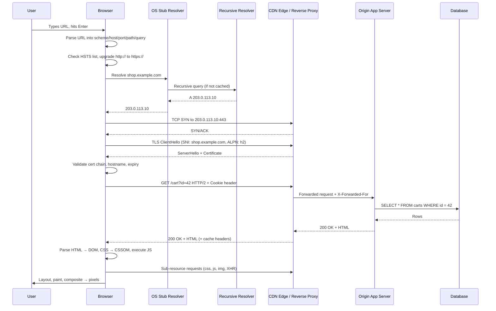
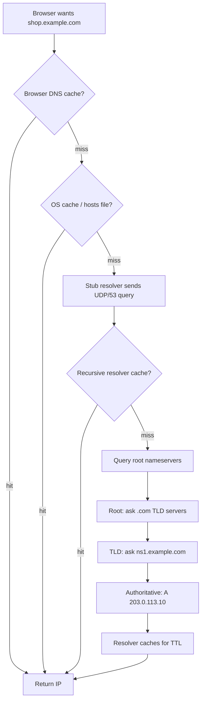
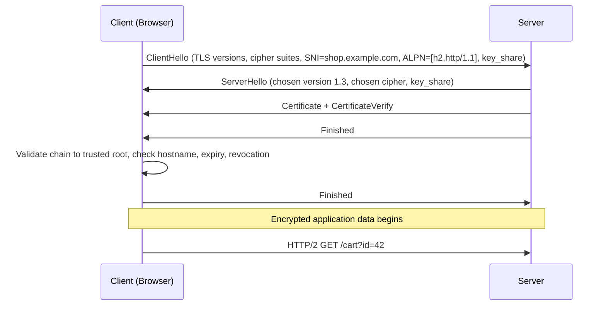
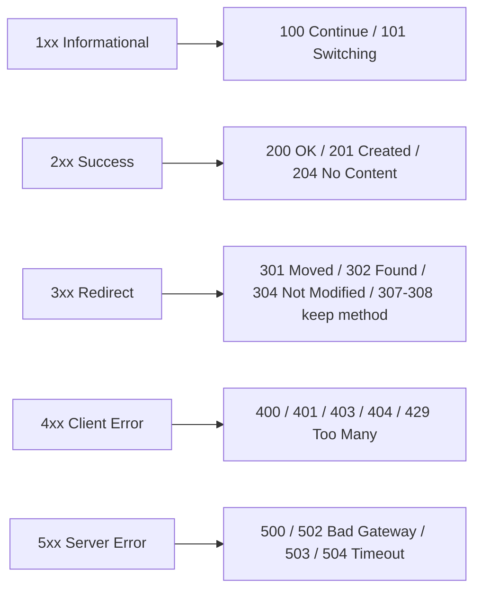
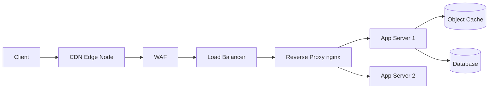
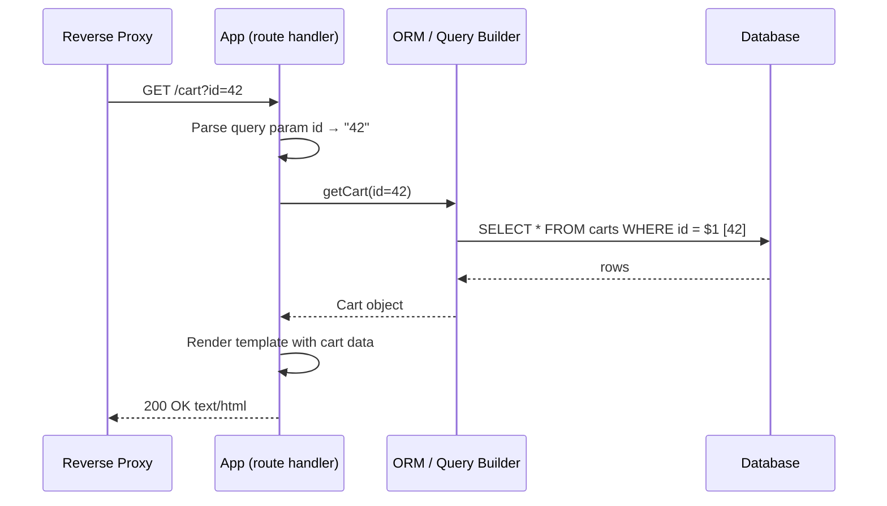
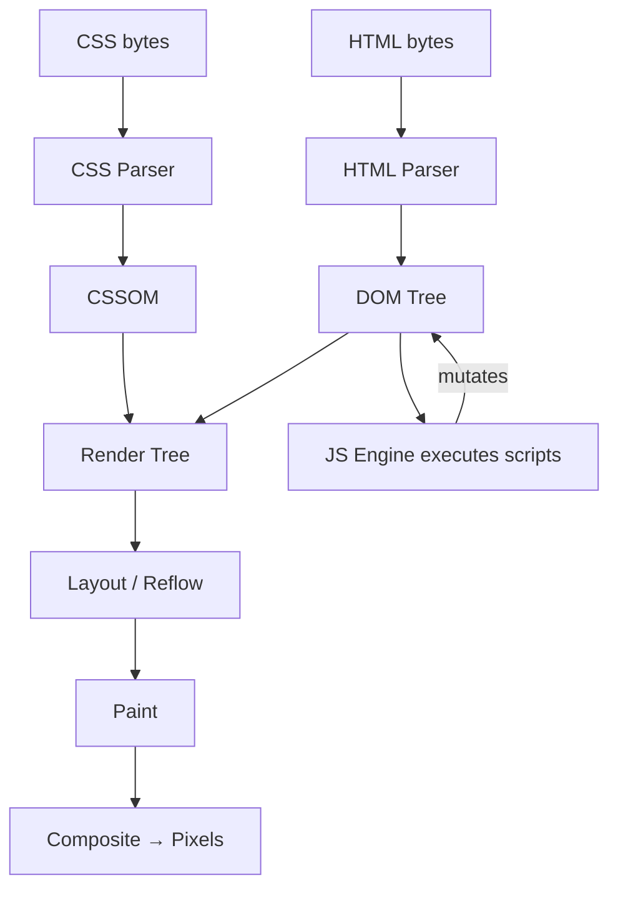
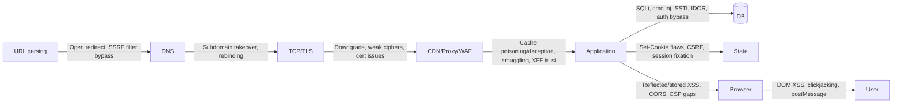

**Level:** Beginner · **Track:** Foundations · **Read time:** 160 min

This is Chapter 1 of the Web Fundamentals series — Notebook 6. The Networking notebook
gave you packets, TCP, DNS and TLS as protocols in isolation. This notebook stacks the
web on top of them, and this first chapter is the map: one single request, followed from
the keystroke in the address bar all the way to pixels on screen, with every hop named,
every header explained, and every place a bug can hide flagged as we pass it.

Almost every web vulnerability you will ever find is a disagreement between two of the
components in this chain. SQL injection is a disagreement between the application and
the database about where data ends and code begins. Request smuggling is a disagreement
between a front-end proxy and a back-end server about where one request ends and the
next begins. Cross-site scripting is a disagreement between the server and the browser's
HTML parser. Cache poisoning is a disagreement about which parts of a request identify a
response. **You cannot find disagreements between components you cannot name.** So we
name all of them, precisely, before touching a single payload.

---

## Part 1: The Whole Journey in One Picture

Type `https://shop.example.com/cart?id=42` and press Enter. Between that keypress and
the rendered page, roughly fifteen distinct things happen, spread across your machine,
your ISP, the DNS hierarchy, a CDN edge node, a load balancer, an application server and
a database — often in three different countries.



Every arrow in that diagram is an attack surface. Every box is a parser, and every parser
is a place where two implementations can disagree. Keep this picture in your head — the
rest of this chapter is a slow walk through it, and every later chapter in this notebook
zooms into one of these boxes.

**How to use this chapter.** Read it once end to end for the mental model. Then do the
lab in Part 11, which reproduces every single step above on your own machine with real
tooling. Then come back and reread Part 12, which maps the vulnerability classes onto the
diagram — that mapping is the thing that turns "I know HTTP" into "I know where to look".

---

## Part 2: The URL — The Most Under-Studied String in Security

Everything starts with a URL, and almost nobody reads the spec. URLs are governed by
RFC 3986 (generic syntax) and, for browsers, by the WHATWG URL Standard — and those two
documents **do not agree**, which is exactly why URL parsing is a rich vulnerability
class (SSRF filter bypasses, open redirects, CORS origin confusion).

The full generic form:

```
 scheme://userinfo@host:port/path;params?query#fragment
 \____/   \______/ \__/ \__/ \___/        \___/ \______/
   |         |      |    |     |            |      |
   |         |      |    |     |            |      +-- Fragment: NEVER sent to server
   |         |      |    |     |            +--------- Query string: sent, logged
   |         |      |    |     +---------------------- Path: sent, routed on
   |         |      |    +---------------------------- Port: default 80/443
   |         |      +--------------------------------- Host: what DNS resolves
   |         +---------------------------------------- Credentials (deprecated, dangerous)
   +-------------------------------------------------- Protocol handler
```

### 2.1 Component-by-component

| Component | Example | Sent to server? | Security relevance |
|---|---|---|---|
| Scheme | `https` | No (implied) | `javascript:`, `data:`, `file:` schemes are XSS/exfil sinks in redirect and link sinks |
| Userinfo | `admin:pw@` | Yes, as `Authorization` if the browser chooses | The `@` trick: `https://trusted.com@evil.com` — humans read the left, parsers read the right |
| Host | `shop.example.com` | Yes, as `Host`/`:authority` | SSRF filter bypasses (`127.1`, `0177.0.0.1`, `[::1]`, `2130706433`), DNS rebinding |
| Port | `:8443` | Yes, in `Host` if non-default | Port scanning via SSRF; internal services on high ports |
| Path | `/cart` | Yes | Path traversal, path normalisation differences between proxy and app |
| Query | `?id=42` | Yes | Parameter injection of every kind; **written to access logs in plaintext** |
| Fragment | `#section` | **No** | Client-side only — DOM XSS sink, and the reason `#` truncates open-redirect payloads |

**Security relevance — the fragment rule is load-bearing.** The fragment is never
transmitted. That single fact explains why DOM-based XSS via `location.hash` is invisible
in server access logs, why OAuth implicit-flow tokens in the fragment don't leak to the
server via `Referer`, and why appending `#` to an open-redirect payload can neutralise a
server-side check while still redirecting the browser.

### 2.2 Percent-encoding and where parsers diverge

Reserved characters must be percent-encoded: `%2F` is `/`, `%3F` is `?`, `%23` is `#`,
`%00` is a NUL byte. The interesting question is never "what does `%2F` mean" — it's
**"who decodes it, and how many times?"**

```
Request:      GET /files/..%252f..%252fetc/passwd
Front proxy:  sees literal "..%252f.." — no traversal, forwards as-is
App server:   decodes once  → "..%2f.."  — still no traversal by its check
Framework:    decodes again → "../../"   — traversal succeeds
```

That double-decode gap is a real, recurring bug class. The rule to internalise: **every
component in the chain that decodes is a component that can disagree with its neighbour.**

**Red team usage:** when a WAF blocks a payload, your first three moves are alternate
encodings (`%2e%2e%2f`), double encoding (`%252e%252e%252f`), and overlong/unicode
variants (`%c0%ae`). You are not "bypassing the WAF" — you are exploiting the fact that
the WAF and the app decode differently.

**Blue team usage:** normalise once, at the edge, and reject anything that changes when
decoded a second time. If `decode(x) != decode(decode(x))`, the request is hostile or
malformed; either way, drop it.

### 2.3 The `@` and backslash tricks

```
https://expected.com@attacker.com/       → connects to attacker.com
https://expected.com\@attacker.com/      → browsers vary; some treat \ as /
https://attacker.com#@expected.com/      → connects to attacker.com
https://expected.com%2f@attacker.com/    → depends on decode order
```

These appear constantly in open-redirect and SSRF reports on HackerOne. The lesson is the
same as everywhere else in this chapter: **never validate a URL with a regex or a
`startsWith` check.** Parse it with a real URL parser, then compare the parsed `host`
field against an allow-list of exact strings.

---

## Part 3: DNS — Turning a Name Into an Address

The browser now has a hostname. It needs an IP. This is DNS, and there are more cache
layers between you and an authoritative nameserver than most people expect.



### 3.1 The cache layers, in order

1. **Browser cache** — Chrome keeps its own DNS cache (`chrome://net-internals/#dns`),
   typically ~60s, independent of the OS.
2. **OS cache** — `systemd-resolved` / `nscd` / `dnsmasq` on Linux, `mDNSResponder` on
   macOS, the DNS Client service on Windows (`ipconfig /displaydns`).
3. **`/etc/hosts`** — checked before any network query on most systems (order set by
   `/etc/nsswitch.conf`). This file is the single most useful pentesting artefact on a
   test machine: it is how you reach a vhost that has no public DNS record.
4. **Recursive resolver** — your ISP, or `1.1.1.1` / `8.8.8.8`, or your corporate DNS.
5. **Root → TLD → authoritative** — the actual hierarchy, walked only on a full cache miss.

### 3.2 Record types that matter for web work

| Record | Purpose | Why an attacker cares |
|---|---|---|
| `A` | Hostname → IPv4 | The target. Also reveals CDN vs origin hosting |
| `AAAA` | Hostname → IPv6 | Often forgotten by firewall rules — the v6 address may be unfiltered |
| `CNAME` | Alias to another name | **Subdomain takeover**: CNAME points at a deprovisioned S3/Heroku/Azure resource |
| `MX` | Mail servers | Reveals mail provider; phishing and SPF/DMARC assessment |
| `TXT` | Arbitrary text | SPF, DKIM, DMARC, and domain-verification tokens that leak SaaS vendors in use |
| `NS` | Delegated nameservers | Zone-transfer targets; misconfigured `AXFR` dumps the whole zone |
| `SOA` | Zone metadata | Admin email, serial number, TTL defaults |
| `CAA` | Which CAs may issue certs | Tells you whether cert-issuance abuse is constrained |
| `SRV` | Service location | Huge in Active Directory recon (`_ldap._tcp.dc._msdcs.<domain>`) |

**Bug bounty relevance:** the `CNAME` row is one of the highest-yield lines in this whole
chapter. A `CNAME` pointing to `something.s3.amazonaws.com` where the bucket no longer
exists is a subdomain takeover — you register the bucket, and you now serve content on
the target's subdomain, with all the cookie and CORS trust that implies. Enumerating
subdomains and checking every dangling `CNAME` is a standard first-hour bounty workflow.

### 3.3 Learning `dig` from scratch

`dig` (Domain Information Groper) is the standard DNS query tool, shipped in
`dnsutils`/`bind-utils`. Unlike `nslookup` it shows you the raw protocol response, which
is what you want.

```bash
sudo apt update && sudo apt install -y dnsutils   # Debian/Kali
dig example.com A
```

Anatomy of the command:

- `dig` — the tool.
- `example.com` — the name to query.
- `A` — the record type (defaults to `A` if omitted).

Useful flags, each explained:

| Flag | Meaning |
|---|---|
| `+short` | Print only the answer data, no headers — good for scripting |
| `+trace` | Walk the delegation from the root yourself, showing every step |
| `+noall +answer` | Suppress all sections, then re-enable only the ANSWER section |
| `@1.1.1.1` | Query a specific resolver instead of the system one |
| `-x <ip>` | Reverse lookup (PTR) |
| `+dnssec` | Request DNSSEC records (`RRSIG`) to check signing |
| `+tcp` | Force TCP instead of UDP (needed for large responses, and for `AXFR`) |
| `axfr` | Attempt a full zone transfer — try it, it still works surprisingly often |

Real output, annotated:

```bash
$ dig example.com A

; <<>> DiG 9.18.24 <<>> example.com A
;; global options: +cmd
;; Got answer:
;; ->>HEADER<<- opcode: QUERY, status: NOERROR, id: 41232
;; flags: qr rd ra; QUERY: 1, ANSWER: 1, AUTHORITY: 0, ADDITIONAL: 1

;; QUESTION SECTION:
;example.com.                   IN      A

;; ANSWER SECTION:
example.com.            3600    IN      A       93.184.216.34

;; Query time: 24 msec
;; SERVER: 127.0.0.53#53(127.0.0.53) (UDP)
;; WHEN: Mon Jan 01 10:00:00 UTC 2024
;; MSG SIZE  rcvd: 56
```

Read it line by line:

- `status: NOERROR` — the query succeeded. `NXDOMAIN` means the name does not exist;
  `SERVFAIL` often means DNSSEC validation failed or the resolver could not reach the
  authority.
- `flags: qr rd ra` — `qr` = this is a response, `rd` = recursion was desired, `ra` =
  recursion is available. A missing `ra` on a resolver you expected to be recursive tells
  you it is authoritative-only.
- `3600` — the TTL in seconds. **Short TTLs (30–60s) are a strong hint of a CDN, a
  load-balanced fleet, or fast-flux malware infrastructure.**
- `SERVER: 127.0.0.53#53` — the answer came from the local `systemd-resolved` stub, not
  directly from the internet.

### 3.4 DNS over HTTPS/TLS and why it changes your job

Classic DNS is UDP port 53, **plaintext**. Anyone on-path sees every hostname you resolve.
DoH (DNS over HTTPS, RFC 8484) and DoT (DNS over TLS, RFC 7858) encrypt it.

- **Red team usage:** DoH is excellent C2 cover. Your beacon's DNS traffic becomes
  indistinguishable HTTPS to `cloudflare-dns.com`. It also bypasses naive
  block-by-DNS-sinkhole controls entirely.
- **Blue team usage:** this is why "block outbound 53 except to our resolvers" is no
  longer sufficient. You need to either block known DoH endpoints, force the browser's
  enterprise policy to disable DoH, or move detection to TLS SNI / JA3 fingerprinting.
  Note that Encrypted Client Hello (ECH) is progressively removing SNI visibility too.

**Pitfall to remember:** DNS answers can carry multiple A records, and the browser will
happily try a second one if the first connection fails. This is the mechanism behind
**DNS rebinding** — the resolver returns a public IP on the first lookup (passing your
SSRF allow-list check) and `127.0.0.1` on the second lookup (when the actual request is
made). Any SSRF defence that validates a hostname and *then* makes a separate request by
hostname is vulnerable. Resolve once, validate the resolved IP, and connect to that IP.

---

## Part 4: TCP and TLS — Building the Pipe

The browser has an IP. Now it needs a connection.

### 4.1 The TCP handshake, briefly

```
Client                          Server
  |------ SYN (seq=x) ------------>|
  |<----- SYN-ACK (seq=y, ack=x+1)-|
  |------ ACK (ack=y+1) ---------->|
  |          [connection open]     |
```

Three packets, one round trip before any data moves. On a 100 ms RTT link, that is 100 ms
spent before a single byte of HTTP exists. This latency cost is the entire reason HTTP/2
multiplexing and HTTP/3 (QUIC, which folds the transport and crypto handshakes together)
were invented.

**Security relevance:** connection reuse means that a single TCP connection often carries
dozens of HTTP requests, potentially from different users if a proxy pools connections to
the backend. That shared-connection assumption is the foundation of **HTTP request
smuggling** — covered in depth later in this notebook, but the seed is planted here.

### 4.2 The TLS handshake and what each part does for you



Four fields in the ClientHello matter enormously for security work:

| Field | What it does | Offensive/defensive angle |
|---|---|---|
| **SNI** | Tells the server which vhost you want, **in plaintext** | Network monitoring sees every site you visit even over HTTPS; also lets you reach a specific vhost on a shared IP. Blue teams alert on SNI to known-bad domains |
| **ALPN** | Negotiates the app protocol (`h2`, `http/1.1`, `h3`) | Downgrading ALPN to `http/1.1` is a step in several smuggling and desync techniques |
| **Cipher suite list** | Which crypto the client supports | The exact ordered list is the basis of **JA3/JA4 fingerprinting** — tooling like `curl` or Python `requests` has a distinctive fingerprint that differs from a real Chrome, which is how bot-detection catches naive scrapers |
| **key_share** | TLS 1.3 sends the key material speculatively | Enables 1-RTT handshakes; 0-RTT resumption exists but is **replayable**, which is why it must never carry state-changing requests |

**Certificate validation is three separate checks**, and tools fail differently on each:

1. **Chain of trust** — does the cert chain up to a root in the local trust store?
2. **Hostname match** — does the SAN (Subject Alternative Name) list contain the host you
   asked for? (The `CN` field has been ignored by browsers for years — always check SANs.)
3. **Validity window and revocation** — `notBefore`/`notAfter`, plus OCSP stapling or CRL.

**Bug bounty relevance:** Certificate Transparency logs are a free, complete subdomain
enumeration source. Every publicly-trusted certificate is logged, so `crt.sh` will tell
you about `internal-admin.staging.target.com` the moment someone issues a cert for it.
This is often the single highest-signal recon step against a new target.

### 4.3 Inspecting TLS with `openssl s_client`

`openssl` is the Swiss-army knife of TLS. `s_client` opens a raw TLS connection and dumps
everything about it.

```bash
openssl s_client -connect example.com:443 -servername example.com -showcerts < /dev/null
```

Flag by flag:

- `-connect host:port` — where to connect.
- `-servername <host>` — **sets SNI.** Omit this on a shared-hosting IP and you will get
  the default vhost's certificate and be confused. Always set it.
- `-showcerts` — print the full chain the server sent, not just the leaf.
- `< /dev/null` — closes stdin so the command exits instead of sitting in interactive mode.

Trimmed real output with annotations:

```
CONNECTED(00000003)
depth=2 C = US, O = DigiCert Inc, CN = DigiCert Global Root G2
verify return:1
depth=1 C = US, O = DigiCert Inc, CN = DigiCert Global G2 TLS RSA SHA256 2020 CA1
verify return:1
depth=0 C = US, ST = California, L = Los Angeles, O = Internet Corporation..., CN = www.example.org
verify return:1
---
Certificate chain
 0 s:CN = www.example.org
   i:CN = DigiCert Global G2 TLS RSA SHA256 2020 CA1
 1 s:CN = DigiCert Global G2 TLS RSA SHA256 2020 CA1
   i:CN = DigiCert Global Root G2
---
SSL handshake has read 5678 bytes and written 401 bytes
Verification: OK
---
New, TLSv1.3, Cipher is TLS_AES_256_GCM_SHA384
Server public key is 2048 bit
Verify return code: 0 (ok)
```

Things to read out of that:

- `depth=2` down to `depth=0` is the chain from root to leaf. If `depth=1` is missing,
  the server has an **incomplete chain** — browsers may paper over it via AIA fetching,
  but `curl` and mobile apps will fail. This is a real, reportable finding.
- `Verify return code: 0 (ok)` — full validation passed. Anything else (`21` unable to
  verify, `10` expired) tells you exactly what broke.
- `TLSv1.3` and an AEAD cipher — good. Seeing `TLSv1.0` or `CBC` ciphers is a finding.

Two more one-liners worth memorising:

```bash
# Extract just the SANs — instant subdomain intel from a single connection
openssl s_client -connect target.com:443 -servername target.com < /dev/null 2>/dev/null \
  | openssl x509 -noout -text | grep -A1 "Subject Alternative Name"

# Check expiry dates without any GUI
echo | openssl s_client -connect target.com:443 2>/dev/null | openssl x509 -noout -dates
```

---

## Part 5: HTTP — The Request/Response Cycle in Detail

The pipe is open and encrypted. Now the actual web protocol runs inside it. HTTP is a
plain-text, stateless, request/response protocol (HTTP/1.1 is literally text; HTTP/2 and
HTTP/3 encode the same semantics in binary frames). Understanding the wire format is
non-negotiable — every web attack is ultimately a crafted HTTP message.

### 5.1 Anatomy of a request

```http
GET /cart?id=42 HTTP/1.1
Host: shop.example.com
User-Agent: Mozilla/5.0 (X11; Linux x86_64) Chrome/120.0
Accept: text/html,application/xhtml+xml,*/*;q=0.8
Accept-Encoding: gzip, deflate, br
Accept-Language: en-US,en;q=0.9
Cookie: session=eyJ1c2VyIjoxMjN9; theme=dark
Referer: https://shop.example.com/products
Connection: keep-alive

```

Line by line:

- **Request line**: `METHOD SP request-target SP HTTP-version`. The method is the verb,
  the target is the path plus query, the version pins the semantics.
- **`Host` header**: mandatory since HTTP/1.1. One IP can serve thousands of sites; `Host`
  says which one. **This is attacker-controllable input** — Host header injection leads to
  password-reset poisoning, cache poisoning, and SSRF against internal routing.
- **`Cookie`**: the client's slice of session state, echoed back on every request (Part 8).
- **`Referer`** (misspelled in the spec, permanently): the page you came from. Leaks URLs;
  controlled by `Referrer-Policy`.
- **Blank line**: the CRLF that separates headers from body. **This delimiter is the heart
  of CRLF injection and response splitting** — inject a `\r\n` into a header value and you
  can forge new headers or a whole new response.

### 5.2 The methods and their real semantics

| Method | Semantics | Safe? | Idempotent? | Security note |
|---|---|---|---|---|
| `GET` | Retrieve; body ignored | Yes | Yes | Parameters land in logs, history, Referer — never put secrets in a GET |
| `POST` | Submit; not idempotent | No | No | The default for state change; CSRF's primary target |
| `PUT` | Replace resource at URI | No | Yes | If enabled unauthenticated, arbitrary file upload → RCE |
| `DELETE` | Remove resource | No | Yes | Broken-access-control classic |
| `PATCH` | Partial update | No | No | Mass-assignment bugs live here |
| `HEAD` | GET without body | Yes | Yes | Cheap existence/oracle checks |
| `OPTIONS` | Describe allowed methods | Yes | Yes | CORS preflight; also enumerates the method surface |
| `TRACE` | Echo the request back | Yes | Yes | Cross-Site Tracing (XST) — should be disabled everywhere |

**"Safe"** means no intended side effects. **"Idempotent"** means N identical requests
have the same effect as one. These aren't academic: a `GET` that changes state (a
"logout" or "delete" link) is both a spec violation and a CSRF vulnerability, because
browsers, prefetchers and crawlers fire GETs freely.

### 5.3 Status codes as a language



The security-relevant subtleties:

- **401 vs 403**: `401 Unauthorized` means "authenticate" (you have no valid identity);
  `403 Forbidden` means "authenticated but not allowed". A response that returns `403`
  where you expected `404` leaks that a resource exists — a **username/resource oracle**.
- **301/302 vs 307/308**: the older redirects historically let clients change `POST` to
  `GET`; `307`/`308` preserve the method and body. This matters for redirect-based CSRF
  and for smuggling.
- **304 Not Modified**: driven by `ETag`/`If-None-Match`. Cache behaviour built on these
  is where **web cache deception and poisoning** live.
- **429 / 503**: rate limiting and overload. During an attack, watching these tells you
  where the defensive thresholds sit.

### 5.4 Response headers that are pure security

| Header | Purpose | If missing/misconfigured |
|---|---|---|
| `Set-Cookie` | Issue session/state cookies | Missing `HttpOnly`/`Secure`/`SameSite` → theft, CSRF |
| `Content-Security-Policy` | Restrict script/resource origins | No CSP → XSS is far easier to exploit |
| `Strict-Transport-Security` | Force HTTPS for a duration | Missing → SSL-strip / downgrade on first visit |
| `X-Content-Type-Options: nosniff` | Stop MIME sniffing | Missing → browser guesses type, enabling content-sniffing XSS |
| `X-Frame-Options` / CSP `frame-ancestors` | Block framing | Missing → clickjacking |
| `Content-Type` | Declares body type + charset | Wrong type/charset → XSS, JSON hijacking |
| `Access-Control-Allow-Origin` | CORS trust | `*` with credentials, or reflected origin → cross-origin data theft |
| `Cache-Control` | Cacheability | Caching authenticated pages → data leak to other users |

This table is, in miniature, half of what a bug-bounty hunter checks on every response.
We spend whole later chapters on CSP, CORS and cookies; for now, know that **the response
headers are where the browser's security model is configured on a per-response basis.**

### 5.5 HTTP/1.1 vs HTTP/2 vs HTTP/3

| | HTTP/1.1 | HTTP/2 | HTTP/3 |
|---|---|---|---|
| Wire format | ASCII text | Binary frames | Binary frames over QUIC |
| Transport | TCP | TCP | UDP (QUIC) |
| Multiplexing | No (one req/resp at a time per conn) | Yes (streams) | Yes (no head-of-line blocking) |
| Header compression | None | HPACK | QPACK |
| Message length | `Content-Length` / `Transfer-Encoding` | Explicit frame lengths | Explicit frame lengths |

**Security relevance:** the last row is the whole ballgame for request smuggling.
HTTP/1.1's *two* ways to say how long a body is (`Content-Length` and chunked
`Transfer-Encoding`) let a front-end and back-end disagree — classic CL.TE / TE.CL
smuggling. HTTP/2 has one unambiguous length, but when a front-end speaks h2 to the
client and downgrades to h1 to the origin, it must *rewrite* the length, and bugs in that
rewrite create **H2.CL / H2.TE desync**. You cannot understand smuggling without first
understanding that these three protocols express the same semantics differently.

---

## Part 6: In Front of the App — Reverse Proxies, Load Balancers and CDNs

The IP the browser connected to almost never belongs to the application server. In front
of the origin sits a stack of intermediaries, and each one is a parser that can disagree
with the next.



### 6.1 What each layer is

- **CDN (Content Delivery Network)** — geographically distributed cache. Serves static
  assets from an edge node near the user, and often proxies dynamic requests to the origin.
  Cloudflare, Fastly, Akamai, CloudFront. It terminates TLS, so it sees your plaintext.
- **WAF (Web Application Firewall)** — pattern-matches requests against rules (OWASP CRS)
  and blocks or challenges. Lives at the CDN edge or as a reverse-proxy module.
- **Load balancer** — spreads requests across a backend fleet (round-robin, least-conn,
  IP-hash). Introduces the "which backend served me" question that matters for stateful
  attacks.
- **Reverse proxy** — nginx/HAProxy/Envoy terminating connections, adding headers,
  routing by path or host.
- **Origin/app server** — where your code actually runs.

### 6.2 The forwarding headers, and why they are dangerous

When a proxy forwards a request, the origin now sees the *proxy's* IP as the source. To
recover the real client, proxies add headers:

```http
X-Forwarded-For: 203.0.113.55, 70.41.3.18
X-Forwarded-Proto: https
X-Forwarded-Host: shop.example.com
X-Real-IP: 203.0.113.55
Forwarded: for=203.0.113.55;proto=https;host=shop.example.com   # RFC 7239 standard form
```

**Security relevance — these are attacker-forgeable by default.** If the application
trusts `X-Forwarded-For` for rate limiting, an attacker rotates the header value to reset
their bucket. If it trusts `X-Forwarded-For` for IP allow-listing an admin panel, an
attacker sets it to `127.0.0.1` and walks in. The correct posture: the *edge* strips any
inbound copies of these headers and sets its own; the app trusts them **only** if it knows
the request came through that trusted edge.

`X-Forwarded-Host` is especially nasty — many frameworks build absolute URLs (password
reset links!) from it, so poisoning it poisons the email that gets sent to the victim.

### 6.3 The origin-IP leak problem

A CDN only protects you if attackers must go through it. If the origin's real IP is
discoverable, an attacker connects **directly**, bypassing the WAF and rate limits
entirely. Origin IPs leak through: historical DNS records (SecurityTrails), certificate
Transparency logs, email headers (`Received:` from the origin mail server), SSRF, and
misconfigured `AAAA` records. This is why "we have a WAF" is not a complete answer —
Blue teams must firewall the origin to accept traffic *only* from the CDN's published IP
ranges.

---

## Part 7: The Application and the Database

Past the proxies, the request reaches your code: a route handler in Express, Django,
Rails, Spring, Laravel, ASP.NET. This is where the request's data gets *interpreted*, and
interpretation is where injection lives.



The single most important idea in web security appears here: **data must never be
concatenated into code.** The safe path binds `id` as a *parameter* (`$1`), so the
database treats it strictly as a value. The unsafe path builds
`"SELECT * FROM carts WHERE id = " + id` as a string, so the input `42 OR 1=1` becomes
part of the *query logic*. That confusion of data and code is SQL injection, and the
identical pattern — user data crossing into an interpreter — is command injection (shell),
XSS (HTML/JS), SSTI (template engine), LDAP injection, and XXE (XML parser). One mental
model, many interpreters.

**Every input source the handler reads is untrusted:** the path, the query string, the
body, every header (including `Host`, `User-Agent`, `Referer`, cookies), and the request
method. A recurring beginner mistake is trusting headers because "the user can't set
those" — the user controls the entire request. All of it.

---

## Part 8: State — Cookies, Sessions and Why the Web Forgets

HTTP is stateless: the server does not inherently remember you between requests. State is
bolted on with cookies.

### 8.1 The mechanism

```http
# Server, on login:
HTTP/1.1 200 OK
Set-Cookie: session=eyJ1aWQiOjEyM30; HttpOnly; Secure; SameSite=Lax; Path=/; Max-Age=3600

# Browser, on every subsequent request to that origin:
GET /account HTTP/1.1
Cookie: session=eyJ1aWQiOjEyM30
```

The server hands out a token; the browser stores it and replays it automatically. That
"automatically" is the root of **CSRF** — the browser attaches the cookie even when the
request was triggered by a malicious third-party site.

### 8.2 The cookie attributes, each a security control

| Attribute | Effect | Attack it prevents / enables |
|---|---|---|
| `HttpOnly` | JS cannot read the cookie via `document.cookie` | Blocks cookie theft via XSS |
| `Secure` | Cookie only sent over HTTPS | Blocks capture on plaintext HTTP |
| `SameSite=Strict` | Never sent on cross-site requests | Strong CSRF defence (but breaks some flows) |
| `SameSite=Lax` | Sent on top-level GET navigations only | Default in modern browsers; balanced CSRF defence |
| `SameSite=None` | Sent cross-site (requires `Secure`) | Needed for third-party contexts; re-opens CSRF surface |
| `Domain` | Scope to a domain + subdomains | Too-broad `Domain` leaks cookies to sibling subdomains |
| `Path` | Scope to a path prefix | Weak isolation — not a real security boundary |
| `Max-Age`/`Expires` | Lifetime | Long-lived session tokens widen the theft window |
| `__Host-` prefix | Forces `Secure`, `Path=/`, no `Domain` | Hardens against subdomain cookie-injection |

### 8.3 Server-side sessions vs stateless tokens

Two designs, both common:

1. **Opaque session ID** — the cookie is a random identifier; all real data
   (`{uid:123, role:admin}`) lives server-side in Redis/DB. Revocation is trivial (delete
   the server record). The cookie is meaningless if stolen only for its lifetime.
2. **Stateless token (JWT)** — the cookie/`Authorization` header *contains* the signed
   claims. No server lookup, but revocation is hard, and the entire security rests on
   signature verification. The infamous `alg: none` bypass and RS256→HS256 confusion
   attacks live here (a whole later chapter).

**Blue team usage:** whichever design, session fixation and session-token entropy are the
first things to test. Regenerate the session ID on privilege change (login), and ensure
tokens have ≥128 bits of CSPRNG entropy. **Red team usage:** if you can read a session
cookie (via XSS because `HttpOnly` was missing), you *are* that user — no password needed.

---

## Part 9: The Browser — Parsing and Rendering

The response HTML arrives. What the browser does with it is a security model unto itself.



### 9.1 The critical rendering path

1. **Parse HTML → DOM.** Tokenise bytes into a tree of nodes. A `<script>` with no
   `async`/`defer` **blocks** the parser — it must download and execute before parsing
   continues. This is why script placement affects both performance and the order in
   which DOM sinks become reachable.
2. **Parse CSS → CSSOM.** CSS is render-blocking: the browser will not paint until it has
   the CSSOM, to avoid a flash of unstyled content.
3. **Render tree** = DOM ∩ CSSOM (visible nodes with their computed styles).
4. **Layout / reflow**: compute the geometry (position and size) of every box.
5. **Paint**: fill in pixels (text, colours, images, borders) into layers.
6. **Composite**: assemble layers on the GPU into the final frame.

### 9.2 The browser's security boundaries

- **Same-Origin Policy (SOP)** — the foundational rule. An *origin* is the tuple
  `(scheme, host, port)`. Script from one origin cannot read the DOM, cookies, or
  responses of another origin. Nearly every browser-side security feature is either SOP
  itself or a controlled exception to it (CORS, `postMessage`, CSP).
- **CORS** — the sanctioned way to relax SOP for specific cross-origin reads, negotiated
  with `Access-Control-Allow-*` response headers and, for non-simple requests, an
  `OPTIONS` preflight.
- **CSP** — a response header that constrains where scripts, styles, images, frames and
  connections may come from, and can disable inline script entirely — turning many XSS
  bugs from "full compromise" into "blocked".
- **Sandboxing / site isolation** — each site runs in its own OS process, so a memory
  bug in one tab cannot trivially read another site's memory (the Spectre-era mitigation).

**Security relevance:** the DOM is a *sink*. When JavaScript writes untrusted data into
`innerHTML`, `document.write`, `eval`, or a `<script>`'s content, the HTML/JS parser runs
it — this is **DOM-based XSS**, and it is invisible server-side because (recall Part 2)
the payload can live in the fragment, which never reaches the server. The Web Fundamentals
notebook devotes multiple chapters to exactly these sinks and their defences.

---

## Part 10: Caching — The Layer That Serves the Wrong Person the Wrong Page

Caching sits at nearly every hop: browser cache, CDN edge cache, reverse-proxy cache,
application object cache. It is essential for performance and a rich, subtle source of
security bugs.

### 10.1 How a cache decides

A cache stores a response keyed by a **cache key** — normally the method + host + path
(+ some headers/query). On the next request with the same key, it serves the stored copy
without asking the origin. The `Cache-Control`, `Vary`, `Age` and `ETag` headers govern
this.

```http
Cache-Control: public, max-age=3600      # cacheable by shared caches for 1 hour
Cache-Control: private, no-store          # never store (use for authenticated pages)
Vary: Accept-Encoding, Cookie             # cache key also depends on these headers
```

### 10.2 Two attack classes born here

- **Web cache poisoning** — you get the cache to store a malicious response under a key
  that victims will request. It works when a request input (say, an unkeyed
  `X-Forwarded-Host` header) influences the response but is *not* part of the cache key.
  You send one request; every subsequent visitor is served your poisoned copy.
- **Web cache deception** — you trick the app into caching a victim's *private* page under
  a *public*, cacheable URL (e.g. `/account/profile.css` where the trailing `.css` makes
  the CDN cache it, but the app ignores the suffix and returns the profile). You then
  fetch that URL and read the victim's data from the cache.

**Blue team usage:** never let authenticated responses be stored by shared caches
(`Cache-Control: private, no-store`), keep the cache key aligned with everything that
affects the response, and normalise/strip the header inputs that shouldn't vary a response.

---

## Part 11: Hands-On Lab — Trace One Request With Your Own Tools

This lab reproduces the entire Part 1 diagram on your machine. Run it on Kali or any
Linux box. Everything here is a lawful query against your own connections and public
sites — no target authorisation issues.

### Step 0 — Tools

```bash
sudo apt update && sudo apt install -y dnsutils curl openssl tcpdump
# curl is your scriptable browser; --version shows which protocols/TLS it supports
curl --version
```

### Step 1 — Parse and resolve

```bash
# Resolve like the browser does, timing each part
dig +short example.com A
# 93.184.216.34

# See the whole delegation chain root → TLD → authoritative
dig +trace example.com | grep -E "NS|A" | head
```

**What you should see:** `+trace` prints each level handing you off — the root servers
name the `.com` servers, which name `example.com`'s authoritative servers, which finally
answer with the `A` record. That is the hierarchy from Part 3 made concrete.

### Step 2 — Watch the TCP handshake on the wire

In one terminal:

```bash
sudo tcpdump -n -i any "host example.com and tcp[tcpflags] & (tcp-syn|tcp-ack) != 0" -c 6
```

In another:

```bash
curl -s -o /dev/null https://example.com
```

**Expected tcpdump output:**

```
IP 192.168.1.20.51314 > 93.184.216.34.443: Flags [S], seq 1000, ...
IP 93.184.216.34.443 > 192.168.1.20.51314: Flags [S.], seq 5000, ack 1001, ...
IP 192.168.1.20.51314 > 93.184.216.34.443: Flags [.], ack 5001, ...
```

`[S]` = SYN, `[S.]` = SYN-ACK, `[.]` = ACK. There is the three-way handshake from Part 4,
captured live.

### Step 3 — Inspect the TLS handshake

```bash
openssl s_client -connect example.com:443 -servername example.com -tls1_3 < /dev/null 2>/dev/null \
  | grep -E "Protocol|Cipher|Verify return code"
```

**Expected:**

```
Verify return code: 0 (ok)
    Protocol  : TLSv1.3
    Cipher    : TLS_AES_256_GCM_SHA384
```

### Step 4 — The HTTP request/response, fully verbose

```bash
curl -v -s -o /dev/null https://example.com/ 2>&1 | grep -E "^[<>]|SSL connection"
```

Flags:

- `-v` — verbose; prints the request (`>`) and response (`<`) headers.
- `-s` — silent (hide the progress meter).
- `-o /dev/null` — discard the body, we only want headers here.

**Expected (trimmed):**

```
> GET / HTTP/2
> Host: example.com
> user-agent: curl/8.5.0
> accept: */*
>
< HTTP/2 200
< content-type: text/html; charset=UTF-8
< cache-control: max-age=604800
< date: Mon, 01 Jan 2024 10:00:00 GMT
< content-length: 1256
```

There is the request line, the mandatory `Host`, the blank-line delimiter, and the status
+ response headers from Part 5 — every field you read about, on your own screen.

### Step 5 — See caching and redirects

```bash
# Follow redirects and print each hop's status + Location
curl -sIL http://example.com | grep -E "HTTP/|location|cache-control"
```

- `-I` — `HEAD` request (headers only).
- `-L` — follow `Location` redirects.

You will typically see a `301` from `http://` to `https://` (that is HSTS/redirect in
action, Part 5.3), then a `200`.

### Step 6 — Prove the forwarding-header trust problem (safely, against a header echo)

```bash
curl -s https://httpbin.org/headers -H "X-Forwarded-For: 127.0.0.1" \
  -H "X-Forwarded-Host: evil.example"
```

The response echoes your forged headers back, demonstrating that **the client fully
controls them** — the exact fact that makes Part 6.2's IP-allow-list bypass possible.

### Step 7 — Certificate Transparency recon

```bash
curl -s "https://crt.sh/?q=%25.example.com&output=json" | \
  python3 -c "import sys,json;[print(r['name_value']) for r in json.load(sys.stdin)]" | sort -u | head
```

Every subdomain that ever got a public certificate, for free — the Part 4.2 recon step,
run for real.

**Lab wrap-up:** you have now executed URL parsing, DNS resolution, the TCP handshake,
the TLS handshake, the HTTP exchange, redirect/cache behaviour, forwarding-header
forgery, and CT-log recon — the entire Part 1 diagram, with real output at every hop.

---

## Part 12: The Vulnerability Map — Where Every Bug Lives on the Diagram

This is the payoff. Overlay the common web-vulnerability classes onto the request journey,
so that "where do I look?" has a structural answer instead of a checklist.



| Hop in the journey | Representative vulnerabilities | Root cause (the "disagreement") |
|---|---|---|
| URL parsing | Open redirect, SSRF bypass, host confusion | Parser vs validator disagree on `host` |
| DNS | Subdomain takeover, DNS rebinding | Name resolves to something no longer controlled / changes between checks |
| TCP/TLS | Downgrade, weak ciphers, missing HSTS, cert errors | Client accepts weaker crypto than intended |
| CDN / proxy / WAF | Cache poisoning, cache deception, request smuggling, forged `X-Forwarded-*` | Two intermediaries parse length/keys/headers differently |
| Application | SQLi, command injection, SSTI, XXE, IDOR, broken auth, mass assignment | Data crosses into code / missing authorization check |
| State (cookies) | CSRF, session fixation, weak tokens, cookie theft | Ambient authority + missing `SameSite`/`HttpOnly` |
| Browser | Reflected/stored/DOM XSS, clickjacking, CORS misconfig, CSP bypass | Server and browser parser disagree; SOP relaxed incorrectly |

Read that table as a **methodology**: when you approach a new target, you walk the journey
from top to bottom and interrogate each hop. Recon the DNS and CT logs, fingerprint the
edge, map the app's routes and inputs, inspect the cookies, and probe the browser-side
security headers. Every later chapter in this notebook drills into one row.

**IR use case:** the same map works in reverse during incident response. A defaced page
served only from certain regions points at the *cache/edge* row, not the app. A single
account's data leaking to others points at the *caching of authenticated responses* line.
A payload that fires with no server log entry points at the *browser/DOM* row via the
fragment. The map turns a vague "we got hacked" into a ranked list of hops to check.

---

## Part 13: Final Revision / Summary

- A web request is a **pipeline of parsers**: URL → DNS → TCP → TLS → HTTP → edge stack →
  app → DB → back through the edge → browser parse/render. Name every hop; you cannot
  audit what you cannot name.
- **The URL** has seven components; the **fragment never reaches the server**, and URL
  parsers disagree — the source of open-redirect and SSRF bypasses. Never validate a URL
  with a regex; parse it and compare the `host` against an allow-list.
- **DNS** has many cache layers; `CNAME`s enable subdomain takeover, multiple A records
  enable rebinding, and short TTLs signal CDNs. `dig` and CT logs are your recon workhorses.
- **TCP** is one round-trip; **TLS** adds SNI (plaintext, fingerprinted via JA3/JA4), ALPN
  (protocol negotiation, a smuggling lever), and a three-part certificate check
  (chain, hostname/SAN, validity).
- **HTTP** is a request line + headers + blank-line delimiter + optional body. Methods have
  safe/idempotent semantics that matter; status codes leak information; response headers
  configure the browser's security model.
- Three HTTP versions express the **same semantics differently** — and the length-encoding
  differences are the seed of request smuggling.
- **In front of the app**: CDN, WAF, LB, reverse proxy. `X-Forwarded-*` headers are
  attacker-forgeable; origin-IP leaks defeat the whole edge.
- **The app** interprets input; every place data crosses into an interpreter (SQL, shell,
  HTML, template) is an injection class. All request parts — including headers — are untrusted.
- **State** is cookies replayed automatically (hence CSRF); attributes
  (`HttpOnly`/`Secure`/`SameSite`/`__Host-`) are the controls.
- **The browser** enforces the Same-Origin Policy, relaxed carefully by CORS/CSP/postMessage;
  the DOM is an XSS sink.
- **Caching** at every hop enables poisoning and deception when the cache key and the
  response-influencing inputs diverge.

---

## Part 14: Cheat Sheet / Quick Reference

**Trace a request end-to-end**

```bash
dig +short host.com                      # resolve
dig +trace host.com                      # walk root→TLD→authoritative
openssl s_client -connect host.com:443 -servername host.com < /dev/null   # TLS + cert
curl -v https://host.com/                # request + response headers
curl -sIL http://host.com                # follow redirects, headers only
sudo tcpdump -n -i any host host.com     # watch the packets
```

**Recon one-liners**

```bash
# All SANs on the live cert
openssl s_client -connect t.com:443 -servername t.com </dev/null 2>/dev/null | openssl x509 -noout -text | grep -A1 "Subject Alternative Name"
# All subdomains from CT logs
curl -s "https://crt.sh/?q=%25.t.com&output=json" | jq -r '.[].name_value' | sort -u
# Reverse DNS
dig -x 93.184.216.34 +short
```

**URL component security quick-map**

| Component | Watch for |
|---|---|
| scheme | `javascript:`/`data:`/`file:` in sinks |
| userinfo `@` | `trusted.com@evil.com` confusion |
| host | SSRF encodings, rebinding, allow-list bypass |
| path | traversal, proxy/app normalisation gap |
| query | injection of every kind; logged in plaintext |
| fragment | DOM XSS; never sent to server |

**HTTP status quick-read**: `401`=authenticate, `403`=forbidden(oracle),
`301/302`=may drop method, `307/308`=keep method+body, `304`=cache validation,
`429`=rate limited, `502/504`=upstream broken.

**Cookie hardening**: `Set-Cookie: id=…; HttpOnly; Secure; SameSite=Lax; __Host- prefix`.

**Security response headers to always check**: `Content-Security-Policy`,
`Strict-Transport-Security`, `X-Content-Type-Options: nosniff`,
`X-Frame-Options`/`frame-ancestors`, correct `Content-Type` + charset, sane CORS.

**Common pitfalls**

- Validating a URL with `startsWith`/regex instead of a real parser.
- Trusting `X-Forwarded-For`/`X-Forwarded-Host` for auth, rate-limits, or link generation.
- Resolving a hostname, checking it, then connecting *again by hostname* (rebinding window).
- Caching authenticated responses in a shared cache.
- Forgetting the fragment is client-only (missing DOM-XSS and mis-scoping open-redirect checks).
- Assuming a WAF protects the origin whose IP has leaked via CT logs / historical DNS.
- Setting `SameSite=None` without understanding you just re-opened CSRF surface.

---

## Part 15: Practice Labs & Resources

Work these in roughly this order; each one drills a specific hop from the journey above.

- **PortSwigger Web Security Academy** (free) — the canonical training ground for this
  entire notebook. Start with the **HTTP Host header attacks** and **Information
  disclosure** paths, then the **SSRF**, **HTTP request smuggling**, and **Web cache
  poisoning / deception** labs — each maps directly to a hop in Part 12.
- **TryHackMe** — *How Websites Work*, *HTTP in Detail*, *DNS in Detail*, and *Web
  Fundamentals* rooms cover exactly Parts 2–9 interactively.
- **HackTheBox Academy** — *Web Requests* and *Introduction to Web Applications* modules
  reinforce the request/response cycle with graded exercises.
- **crt.sh** and **`dig`/`openssl`** on scope you own — repeat the Part 11 lab against a
  few different sites and note how CDN-fronted hosts (short TTLs, shared certs, edge
  headers like `cf-ray`) differ from single-origin hosts.
- **MDN Web Docs** — the *HTTP* and *URL* reference sections are the authoritative,
  free specification-level companion to Parts 2 and 5.
- **RFC 9110 (HTTP Semantics)** and **RFC 3986 / WHATWG URL Standard** — read the URL
  standards side by side and list the places they disagree; that list is a personal
  SSRF/open-redirect bypass cheat sheet.

**Practice questions**

1. A password-reset email arrives with a link to `https://evil.tld/reset?token=…` even
   though the site is `shop.example.com`. Which hop and which header explain this, and how
   would you fix it at the edge?
2. `dig target.com` returns a 30-second TTL and two different A records on repeated
   queries. What two things does that tell you, and which SSRF technique does the second
   fact enable?
3. You find `staging.target.com` has a `CNAME` to a `something.azurewebsites.net` that
   returns a 404 "app not found" page. What is the vulnerability class and what is the
   exploitation step?
4. A page returns `Cache-Control: public, max-age=300` but its body contains the
   logged-in user's email. Name the vulnerability, the hop it lives at, and the one-line fix.
5. Using only `curl` and `openssl`, list the exact commands you would run to (a) confirm a
   host redirects HTTP→HTTPS, (b) extract every subdomain from its certificate, and
   (c) prove the server trusts a forged `X-Forwarded-For`.

---

*Also on [Praneeth's portfolio](https://ping-praneeth.vercel.app/notebook/web-fundamentals/01-how-the-web-works-end-to-end-client), with comments and the latest edits.*
