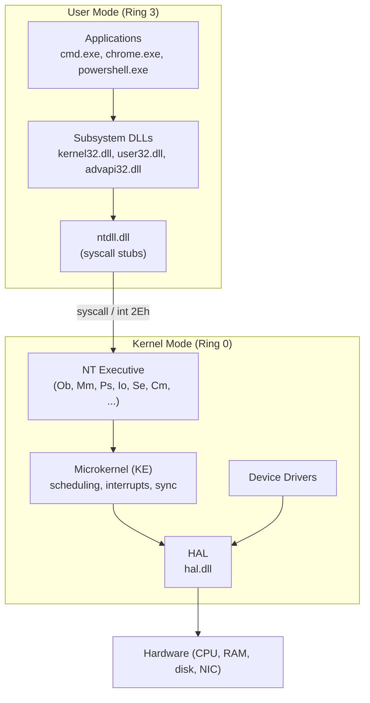
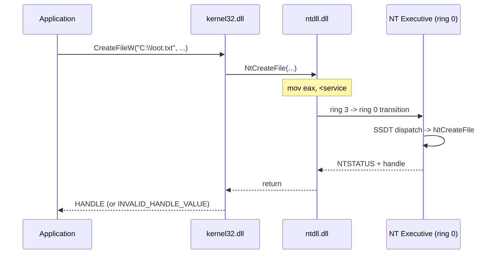
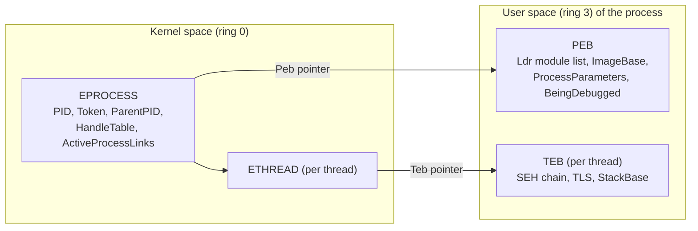
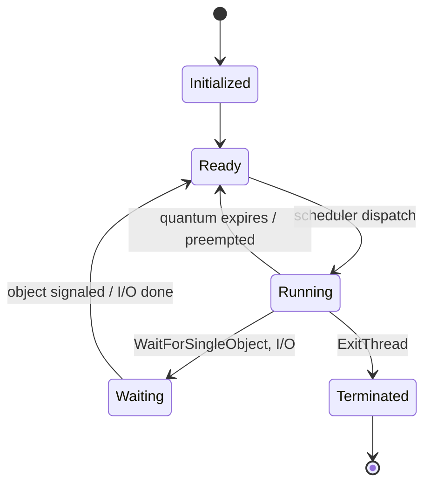
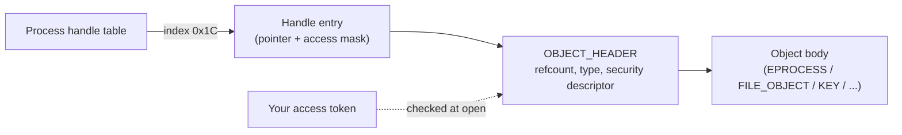
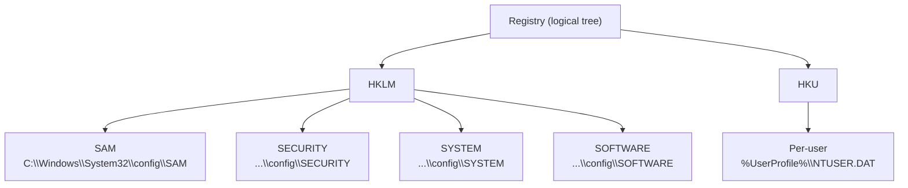
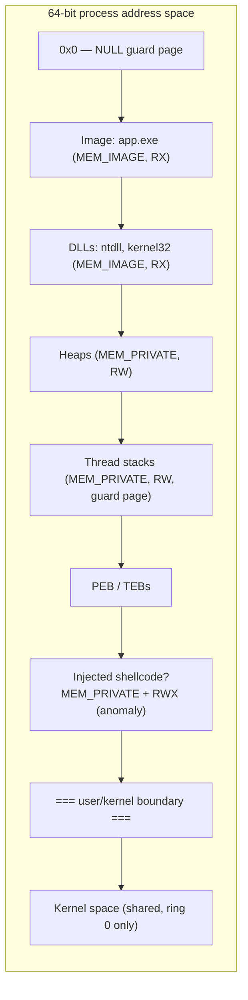
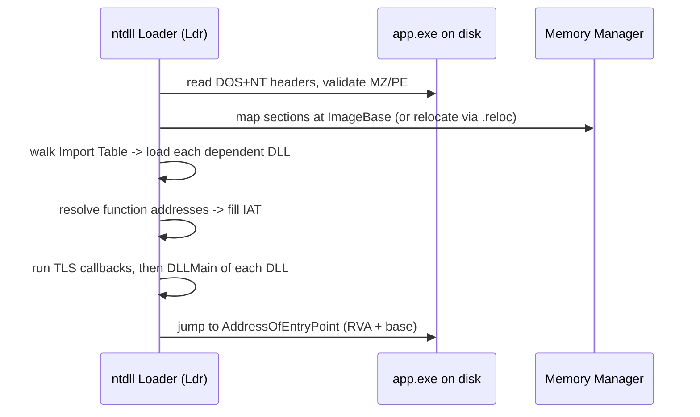

This is Chapter 1 of the Windows Internals series, and the first notebook after the Linux and Networking tracks. Everything you learned about Linux processes, permissions and the shell has a Windows counterpart — but Windows does it very differently, and those differences are exactly where attackers live. Credential theft from LSASS, token impersonation, process injection, registry persistence, UAC bypasses and living-off-the-land tradecraft all rely on a precise mental model of how the Windows kernel, processes, threads, handles, tokens and the registry fit together. This chapter builds that model from zero.

By the end you will understand what actually happens between pressing Enter and a program running, why `explorer.exe` spawning `powershell.exe` spawning `cmd.exe` is a red flag, what a handle and a token really are, how the registry is laid out on disk and in memory, and how to inspect all of it live with the Sysinternals suite, PowerShell and WinDbg. We stay lawful and lab-scoped throughout: everything here is done on a Windows VM you own.

---

## Who This Chapter Is For and Why It Matters

If you come from Linux, you already have the intuitions — you know a process has an address space, that the kernel mediates hardware access, that a file descriptor is a small integer indexing a kernel table. Windows has all of those concepts, but the names, the security model and the internals differ enough that Linux knowledge alone will actively mislead you. A "file descriptor" is a **handle**; the "effective UID" is roughly an **access token**; `/proc` is roughly the combination of the **registry**, WMI and the object-manager namespace; a setuid binary is roughly a service running as `SYSTEM`. Get these mappings wrong and you will misread every host you land on.

This chapter is written for the absolute beginner but does not stop there. We start with "what is an operating system doing at all" and end at the level a red-teamer needs to reason about LSASS memory, or a blue-teamer needs to write a Sysmon rule that catches process hollowing. Concretely, this chapter is foundational for:

- **Red team / pentest** — process injection, token theft, LSASS dumping, parent-PID spoofing, service abuse all require knowing what a process, thread, token and handle physically are.
- **Blue team / DFIR** — every EDR detection, every Sysmon config, every memory-forensics workflow (Volatility) is built on these same structures: `EPROCESS`, `ETHREAD`, the handle table, the PEB.
- **Bug bounty** — local privilege escalation on Windows (DLL hijacking, unquoted service paths, registry ACL weaknesses, writable `HKLM` keys) is almost entirely a game played on the structures in this chapter.
- **CTF** — Windows pwn, forensics and rev categories lean on PE loading, the PEB, handles and registry hives constantly.

A quick note on terminology: "Windows" here means the **Windows NT** family (Windows 10/11, Windows Server 2016–2025). The old DOS-based line (95/98/ME) is dead and shares almost nothing with modern internals. Everything below is NT.

---

## The Linux-to-Windows Concept Map

Before diving in, anchor the new vocabulary to what you already know from the Linux track. Keep this table mentally handy — most confusion when moving to Windows is just a naming mismatch for a concept you already understand. The mappings are approximate (the security models genuinely differ), but they get you oriented fast.

| Concept | Linux | Windows |
|---------|-------|---------|
| Kernel image | `vmlinuz` | `ntoskrnl.exe` |
| Privilege boundary | user vs kernel (ring 3/0) | user vs kernel (ring 3/0) — same idea |
| System-call interface | `syscall` via glibc | `syscall` via `ntdll.dll` |
| Process identity | UID/GID integers | access **token** (SIDs + privileges) |
| Superuser | `root` (UID 0) | `SYSTEM` (`S-1-5-18`) + admin/UAC |
| "Resource reference" | file descriptor | **handle** (for *every* object type) |
| Config store | text files in `/etc`, `~/.config` | the **registry** (one tree) |
| Live process info | `/proc/<pid>` | WMI/`Win32_Process`, EPROCESS, PEB |
| Set-uid escalation | `setuid` binary | service running as SYSTEM / token abuse |
| Autostart | `systemd` units, `cron`, `~/.bashrc` | Run keys, Services, Scheduled Tasks |
| Shared library | `.so` | `.dll` |
| Executable format | ELF | **PE** (Portable Executable) |
| Dynamic loader | `ld.so` | `ntdll.dll` loader (`Ldr`) |
| Permissions model | `rwx` bits + POSIX ACLs | **DACL** of ACEs + integrity levels |

The biggest conceptual jump is identity and permission. Linux packs "who you are" into a couple of integers and "what you may do" into nine `rwx` bits; Windows expands both enormously — identity becomes a token carrying dozens of SIDs and named privileges, and permission becomes an arbitrarily long access-control list evaluated per object. That expansion is the reason Windows privilege escalation has so many more distinct techniques than Linux, and why Parts 5–7 of this chapter get the most attention.

## Part 1: The Big Picture — User Mode vs Kernel Mode

The single most important architectural boundary in Windows is the line between **user mode** and **kernel mode**. This is not a Windows invention — it is enforced by the CPU itself. x86-64 processors define four privilege "rings" (0–3); Windows uses only two of them: **ring 3** for user mode and **ring 0** for kernel mode. Everything else in this chapter hangs off this one distinction.

In **user mode**, code runs with restricted privileges. Each process gets its own private virtual address space, cannot touch another process's memory directly, cannot talk to hardware, and cannot execute privileged CPU instructions. If user-mode code crashes, only that process dies. Your browser, `cmd.exe`, `explorer.exe`, a game, `powershell.exe` — all user mode.

In **kernel mode**, code runs with full privileges. It shares a single address space, can touch any physical memory, can talk to hardware, and can execute any instruction. The kernel, device drivers, and core OS services live here. If kernel-mode code crashes, the **whole machine** crashes — that is the Blue Screen of Death (a `KeBugCheckEx` call). This is why a malicious or buggy driver is so devastating: it runs at ring 0 with the same power as the kernel.



The transition from user mode to kernel mode happens through a **system call** (syscall). When your program calls `CreateFile`, that eventually funnels down to `ntdll.dll`, which executes the `syscall` instruction with a **service number** in the `EAX` register. The CPU switches to ring 0, jumps into the kernel's **System Service Dispatch Table (SSDT)**, runs the real `NtCreateFile`, and switches back. This boundary is the security perimeter of the entire OS. Every EDR product in existence is fundamentally trying to observe or intercept what crosses it.

> **Why attackers care about the boundary.** Most defensive telemetry (AV/EDR user-mode hooks) lives in user mode — a DLL loaded into your process that hooks functions like `NtAllocateVirtualMemory`. Attackers therefore try to get *below* the hooks: **direct syscalls** (invoking the `syscall` instruction themselves instead of calling the hooked `ntdll` stub), **syscall unhooking**, or dropping a malicious **kernel driver** (BYOVD — "bring your own vulnerable driver") to blind the EDR from ring 0. You cannot understand any of that tradecraft without first understanding this boundary.

### The core deliverable of the kernel

Strip away the detail and the kernel provides four things to every process: **an address space** (virtual memory, isolated per process), **the ability to run code** (threads that the scheduler time-slices onto CPUs), **access to resources** (files, registry keys, other processes — always via handles), and **a security identity** (a token that decides what it may touch). The rest of this chapter is those four ideas in depth.

---

## Part 2: The Windows Architecture Stack, Component by Component

Windows is layered. From the hardware up, the major components are the HAL, the microkernel, the Executive, the user-mode subsystems, and finally applications. Knowing which DLL does what is not trivia — it tells you what an unusual loaded module or an odd call stack means during an investigation.

### Hardware Abstraction Layer (HAL) — `hal.dll`

The HAL is a thin layer that hides differences between motherboards, interrupt controllers, timers and buses so the rest of the kernel does not need per-board special cases. You rarely interact with it directly, but it matters for forensics timelines and for understanding why the same kernel binary boots on wildly different hardware.

### The Kernel / Microkernel (KE) — inside `ntoskrnl.exe`

The lowest-level scheduler and synchronization primitives live here: thread dispatching, interrupt and exception dispatch, spinlocks, DPCs (Deferred Procedure Calls) and the low-level details of context switching. It is deliberately small and mechanism-only — policy lives one layer up in the Executive.

### The NT Executive — the heart of `ntoskrnl.exe`

The Executive is the collection of core kernel subsystems, each with a two-letter prefix you will see constantly in symbols, WinDbg output and crash dumps. Memorizing these prefixes pays off every time you read a stack trace.

| Prefix | Subsystem | Responsibility | Example routines |
|--------|-----------|----------------|------------------|
| `Ob` | Object Manager | Names, tracks and secures every kernel object (processes, files, keys) | `ObReferenceObjectByHandle` |
| `Mm` | Memory Manager | Virtual memory, paging, working sets, sections | `MmMapViewOfSection` |
| `Ps` | Process/Thread Manager | Creates and manages `EPROCESS`/`ETHREAD` | `PsCreateSystemThread`, `PsLookupProcessByProcessId` |
| `Io` | I/O Manager | Driver model, IRPs, device stacks | `IoCreateDevice`, `IoCallDriver` |
| `Se` | Security Reference Monitor | Access checks, tokens, privileges, auditing | `SeAccessCheck` |
| `Cm` | Configuration Manager | The **registry** — hives, keys, values | `CmRegisterCallback` |
| `Lpc`/`Alpc` | Local Procedure Call | Fast local IPC (used by RPC, LSASS) | `AlpcpReceiveMessage` |
| `Po` | Power Manager | Sleep, hibernate, device power states | `PoSetPowerState` |
| `Ke` | Kernel core | Scheduling & sync primitives | `KeWaitForSingleObject` |

The **Security Reference Monitor (`Se`)** and the **Object Manager (`Ob`)** together are the access-control engine: every time a handle is opened, `Ob` finds the object and `Se` checks your token against the object's security descriptor. That is the entire Windows authorization model in one sentence, and we return to it in Part 6.

### The subsystem — Win32 and `ntdll.dll`

Applications almost never call the kernel directly. They call the **Win32 API** exposed by a small set of user-mode DLLs:

- `kernel32.dll` / `kernelbase.dll` — process/thread/file/memory APIs (`CreateProcess`, `CreateFile`, `VirtualAlloc`).
- `user32.dll` — windows, messages, input.
- `gdi32.dll` — graphics.
- `advapi32.dll` — registry, services, security (`RegOpenKeyEx`, `OpenProcessToken`).
- `ntdll.dll` — the lowest user-mode layer; it holds the actual **syscall stubs** (`NtCreateFile`, `NtAllocateVirtualMemory`). Everything above eventually calls into `ntdll`, which makes the ring transition.



> **LOLBAS / living-off-the-land note.** Because the Win32 API is the sanctioned path, defenders watch it. "Living off the land" means using *already-trusted* binaries and the normal API surface so nothing new and suspicious touches disk — `rundll32.exe`, `regsvr32.exe`, `mshta.exe`, `wmic.exe`, `certutil.exe`. We cover this properly in Chapter 5; here just note that all of them are ordinary user-mode Win32 programs making ordinary syscalls. That is precisely what makes them stealthy.

---

## Part 3: What a Process Actually Is

A **process** on Windows is *not* a running program. It is a **container**: an address space plus the resources needed to run one or more threads. A process by itself executes nothing — **threads** execute; the process just holds the environment they run in. This is the single most common beginner misconception, and getting it right unlocks process injection, hollowing and most Windows malware technique.

Concretely, a process owns:

- A **private virtual address space** (on 64-bit Windows, up to 128 TB of user space per process, isolated from every other process).
- A set of **handles** to kernel objects (files, registry keys, other processes, events, mutexes) stored in a per-process **handle table**.
- An **access token** describing its security context (which user, which groups, which privileges).
- At least one **thread** (a process with zero threads is dead and gets torn down).
- A **PEB** (Process Environment Block) in user memory, and an **EPROCESS** structure in kernel memory.
- Loaded **modules** (the main `.exe` plus DLLs), an environment block, a current directory, and a working set of physical pages.

### EPROCESS vs PEB — kernel view vs user view

Every process is represented **twice**: once in the kernel and once in user mode. Understanding the split is essential for memory forensics and for evasion.

The **`EPROCESS`** structure lives in kernel (ring 0) memory. It is the authoritative record: the process ID, the token pointer, the handle table, the parent PID, the list entry that links it into the global process list, the pointer to the `PEB`, image file name, and much more. The Security Reference Monitor and the scheduler operate on `EPROCESS`. Malware that "unlinks" itself from the `ActiveProcessLinks` doubly-linked list to hide from `EPROCESS`-walking tools (Direct Kernel Object Manipulation, **DKOM**) is manipulating this structure.

The **`PEB`** (Process Environment Block) lives in the process's own **user-mode** address space. It holds things user code needs to reach cheaply without a syscall: the list of loaded modules (`Ldr`), the process parameters (command line, current directory, environment), the image base address, and the `BeingDebugged` byte. Because it is in user memory, the process (and malware inside it) can *read and modify its own PEB* — which is why anti-debug tricks (`BeingDebugged`, `NtGlobalFlag`) and module-list hiding both target the PEB.



### The life of a process: from `CreateProcess` to running code

When `explorer.exe` launches `notepad.exe`, a specific sequence unfolds. Knowing it tells you which artifacts to look for and where injection can hook in:

1. `CreateProcessW` opens the image file (`notepad.exe`) and creates a **section object** for it (memory-mapped executable).
2. The kernel creates the **`EPROCESS`** object, a new address space, and a token (normally inherited/copied from the parent).
3. `ntdll.dll` is mapped in — it is the *only* DLL guaranteed present in every process, because the loader itself lives in `ntdll`.
4. The initial **thread** is created (suspended), with a **`TEB`** and a stack.
5. The **`PEB`** is built: image base, process parameters (command line!), environment.
6. The kernel notifies **`csrss.exe`** (the Win32 subsystem process) about the new process/thread.
7. The initial thread resumes; `ntdll`'s **loader (`Ldr`)** maps the dependent DLLs (`kernel32`, etc.), runs their `DllMain`, and finally jumps to the exe's entry point.

That "create the thread **suspended**, then resume" step (4→7) is the exact seam abused by **process hollowing** and **thread hijacking**: create the process suspended, rewrite its memory or entry point, *then* resume. We look at the forensic signature of that in the Blue Team section.

### Key system processes you must recognize on sight

A huge fraction of Windows detection is just *knowing what normal looks like*. These processes have fixed, well-known parentage and identity. Anything deviating from this table is worth a second look.

| Process | Normal parent | Count | Runs as | Notes / red flags |
|---------|---------------|-------|---------|-------------------|
| `System` (PID 4) | — | 1 | `SYSTEM` | Kernel threads. Not a real image on disk. |
| `Registry` | `System` | 1 | `SYSTEM` | Backs the registry (Win10+). |
| `smss.exe` | `System` | 1 master | `SYSTEM` | Session Manager; spawns per-session copies then exits. |
| `csrss.exe` | `smss.exe` | 1 per session | `SYSTEM` | Win32 subsystem. **Never** has a visible parent tree oddity. |
| `wininit.exe` | `smss.exe` | 1 | `SYSTEM` | Starts services.exe, lsass.exe, lsm. |
| `services.exe` | `wininit.exe` | 1 | `SYSTEM` | The **Service Control Manager (SCM)**. Parent of most services. |
| `lsass.exe` | `wininit.exe` | 1 | `SYSTEM` | **Local Security Authority** — holds credentials in memory. Prime target. |
| `svchost.exe` | `services.exe` | many | various | Service host. Each hosts one or more services (`-k` group). |
| `winlogon.exe` | `smss.exe` | 1 per session | `SYSTEM` | Interactive logon. Parent of `userinit` → `explorer`. |
| `explorer.exe` | (userinit, then exits) | 1 per user | the user | The desktop shell. Parent of user apps. |

> **Read this table like a detective.** `lsass.exe` should have exactly **one** instance, parented by `wininit.exe`, running as `SYSTEM`, from `C:\Windows\System32\lsass.exe`. A *second* `lsass.exe`, or one parented by `explorer.exe`, or one spelled `1sass.exe`/`lsass .exe`, is almost certainly malware masquerading. Likewise `svchost.exe` must be a child of `services.exe` — a `svchost.exe` whose parent is `winword.exe` is a textbook injection/spoofing indicator.

---

## Part 4: Threads, Scheduling and Context

A **thread** is the unit of execution. It has its own **stack**, its own **register context** (saved in the `CONTEXT` structure when not running), a **thread ID (TID)**, a scheduling **priority**, and a **`TEB`** (Thread Environment Block) in user space mirroring the process's `PEB`. All threads in a process share the same address space, handles and token — which is why one thread can trivially read another thread's data, and why injecting a thread into a process gives you full run of that process.

### The scheduler

Windows uses a **priority-driven, preemptive** scheduler with 32 priority levels (0–31). Level 0 is the zero-page thread; 1–15 are the "dynamic" range for normal user work; 16–31 are "real-time". The scheduler always runs the highest-priority ready thread, time-slicing (a *quantum*) among threads of equal priority. It also applies **priority boosts** (e.g. after I/O completion, or for the foreground window) to keep the UI responsive. You do not need to memorize the algorithm, but you should know that priority and quantum exist because malware sometimes lowers its own priority to stay quiet, and some detections key on unusual priority.

### Thread states



A thread sitting in **Waiting** on a synchronization object (an event, a mutex, an I/O completion) consumes no CPU — this is the normal state for most threads most of the time. A thread that is **Running** or endlessly **Ready** and burning CPU is either doing real work or, occasionally, is a cryptominer or a spin-loop implant.

### Why threads matter to attackers and defenders

The classic remote code injection primitive is `CreateRemoteThread`: open a handle to a target process, allocate memory in it (`VirtualAllocEx`), write your shellcode (`WriteProcessMemory`), then start a thread there (`CreateRemoteThread`). Every one of those four calls is a well-known detection point. Subtler variants avoid `CreateRemoteThread` — **APC injection** (`QueueUserAPC` onto an existing alertable thread), **thread hijacking** (`SetThreadContext` to redirect an existing thread's RIP), or **thread-pool abuse**. The common thread (pun intended): they all need a thread to run their code, because *processes do not execute — threads do*.

> **Blue Team — thread start address is gold.** A legitimately loaded thread's start address falls inside a *named, backed* module (e.g. inside `kernel32.dll`). Injected shellcode usually runs from **unbacked** private memory (`RX` region with no associated file on disk). EDRs and tools like `Get-InjectedThread` flag exactly this: a thread whose start address does not map to any module on disk. Volatility's `malfind` finds the same thing in a memory image.

---

## Part 5: Handles and the Object Manager

Nearly everything the kernel manages is an **object**: processes, threads, files, registry keys, events, mutexes, semaphores, sections, tokens, ALPC ports, symbolic links. The **Object Manager (`Ob`)** creates, names, secures and reference-counts them. When a process wants to use an object it does not get a raw pointer — it gets a **handle**: an opaque index into the process's private **handle table**. This is the direct analog of a Linux file descriptor, but generalized to *every* resource type, not just files.

A handle carries an **access mask** — the specific rights you were granted when you opened it (e.g. `PROCESS_VM_READ`, `PROCESS_VM_WRITE`, `PROCESS_CREATE_THREAD`, `KEY_SET_VALUE`). This is checked once, at open time, by the Security Reference Monitor against the object's security descriptor and your token. After that, operations reuse the handle. So the security-critical moment is the **open**, not each use.



### Why handles are an offensive goldmine

Handles leak capability. If a privileged process holds an **inheritable, writable handle** to a securable object, and you can get that handle duplicated into your context, you inherit its access. Real techniques built on this:

- **Handle duplication / theft** — `DuplicateHandle` a `PROCESS_ALL_ACCESS` handle out of a privileged process to get full control of a target you could not open directly.
- **Leaked LSASS handle** — if any accessible process holds a read handle to `lsass.exe`, you may be able to dump credentials via that handle instead of opening LSASS yourself (which EDR watches closely).
- **Object-name squatting** — creating a well-known named object (mutex, section, symbolic link) before the legit code does, to hijack or DoS it. Many malware families create a unique named **mutex** as an "am I already running?" check; those mutex names become superb IOCs.

> **CTF Angle.** Windows privesc and pwn challenges love handles. A common pattern: a SYSTEM service opens a resource and carelessly leaves an inheritable handle, or a challenge binary hands you a handle with more rights than intended. Enumerate with **`handle.exe`** (Sysinternals) or Process Hacker's handle view; look for `Process`, `Token`, `File` or `Key` handles with juicy access masks held by high-privilege processes. On HackTheBox/THM Windows boxes, `SeDebugPrivilege` + an open handle to a SYSTEM process is a frequent path to `nt authority\system`.

---

## Part 6: Security — Tokens, SIDs, Privileges and Access Checks

This is where Windows diverges hardest from Linux, and where most Windows privilege escalation lives. In Linux, identity is a handful of integers (UID/GID) and permission is `rwx` bits. In Windows, identity is a **token**, principals are **SIDs**, and permission is a full **ACL** evaluated by the Security Reference Monitor.

### SIDs — Security Identifiers

A **SID** uniquely identifies a security principal (user, group, computer, service). It looks like `S-1-5-21-3623811015-3361044348-30300820-1013`. The trailing number is the **RID** (Relative Identifier). Some RIDs are famous and worth memorizing:

| SID / RID | Principal | Meaning |
|-----------|-----------|---------|
| `S-1-5-18` | `SYSTEM` (LocalSystem) | The most powerful local account. |
| `S-1-5-19` | `LOCAL SERVICE` | Low-priv service identity. |
| `S-1-5-20` | `NETWORK SERVICE` | Service identity that authenticates to network as the machine. |
| `S-1-5-32-544` | `BUILTIN\Administrators` | Local admins group. |
| `...-500` (RID) | Built-in `Administrator` | The domain/local admin account. |
| `...-512` (RID) | `Domain Admins` | Full domain control (in AD). |
| `S-1-5-21-...` | Domain/local users | The `-21-` prefix marks a machine or domain issuing authority. |

### Access tokens

An **access token** is the kernel object that represents a security context. Every process (and optionally every thread) has one. It contains: the **user SID**, the list of **group SIDs** (with attributes like enabled/deny), the list of **privileges** (see below), the **integrity level**, and default DACL/owner info. When a thread tries to open an object, the SRM compares the token's SIDs and integrity level against the object's **security descriptor** (owner + DACL of ACEs).

There are two token types:

- **Primary token** — attached to a process; defines its baseline identity.
- **Impersonation token** — a thread can temporarily *wear* another identity (e.g. a service impersonating a connecting client). Impersonation has levels: `Anonymous`, `Identification`, `Impersonation`, `Delegation`. This mechanism is legitimate (that's how a file server checks *your* access, not its own) — and it is exactly what token-theft attacks abuse.

> **Red Team — token impersonation / theft.** With `SeImpersonatePrivilege` (held by many service accounts) an attacker can capture a privileged token and impersonate it to run code as `SYSTEM`. This is the whole "Potato" family (`RottenPotato`, `JuicyPotato`, `PrintSpoofer`, `GodPotato`) — coerce a SYSTEM service to authenticate, grab its token, impersonate. Tools: `incognito`, Meterpreter `steal_token`, `Invoke-TokenManipulation`. All of it is legal token machinery used against its intent.

### Privileges

Beyond group membership, a token carries a list of **privileges** — named rights that gate powerful operations. These are the crown jewels of local privesc. Learn to read the output of `whoami /priv` on any host you own:

| Privilege | What it grants | Abuse |
|-----------|----------------|-------|
| `SeDebugPrivilege` | Open *any* process (incl. SYSTEM) with full access | Read LSASS, inject anywhere. |
| `SeImpersonatePrivilege` | Impersonate a client after authentication | Potato attacks → SYSTEM. |
| `SeAssignPrimaryTokenPrivilege` | Assign a primary token to a new process | Spawn a process as another user. |
| `SeBackupPrivilege` | Read any file bypassing DACL | Copy `SAM`/`SYSTEM` hives, NTDS.dit. |
| `SeRestorePrivilege` | Write any file/key bypassing DACL | Overwrite protected files/keys. |
| `SeLoadDriverPrivilege` | Load a kernel driver | BYOVD → ring 0. |
| `SeTakeOwnershipPrivilege` | Take ownership of any object | Grant yourself access to anything. |

### Integrity levels and UAC

Layered on top of tokens is **Mandatory Integrity Control (MIC)**: every process has an **integrity level** — `Untrusted`, `Low`, `Medium`, `High`, `System`. A lower-integrity process cannot write to a higher-integrity object even if the DACL would allow it. This is why sandboxed browser tabs run at **Low** integrity, and why a normal admin's Explorer runs at **Medium** until elevated.

**UAC (User Account Control)** is built on this. When you log in as an administrator, you actually get **two** tokens: a **filtered** medium-integrity token for everyday use, and a **full** high-integrity token that is only activated when you click "Yes" on the consent prompt (the elevated process). This "split token" is why `whoami /groups` can show you as an Administrator while your current process still can't write to `C:\Windows`. **UAC bypasses** (auto-elevating binaries, `fodhelper.exe`, `eventvwr.exe` + registry hijack) are all about getting a high-integrity process *without* the prompt — and several of them (as we'll see) work through the **registry**.

---

## Part 7: The Windows Registry, Explained Properly

The **registry** is a hierarchical database that stores configuration for the OS, drivers, services, security policy, installed software and per-user settings. If Linux keeps configuration in scattered text files under `/etc` and `~`, Windows centralizes almost all of it into this one tree managed by the **Configuration Manager (`Cm`)**. For an attacker it is simultaneously a **treasure map** (credentials, autoruns, config) and a **persistence playground**; for a defender it is one of the richest sources of forensic evidence on the box.

### The five root keys (hives)

At the top are five predefined root keys. Two are "real" and stored on disk; the other three are **links/views** synthesized at runtime:

| Root key | Short | Real or view | Contents |
|----------|-------|--------------|----------|
| `HKEY_LOCAL_MACHINE` | `HKLM` | real (multiple hives) | System-wide config: hardware, services, security, software. |
| `HKEY_USERS` | `HKU` | real | One subkey per loaded user profile (by SID). |
| `HKEY_CURRENT_USER` | `HKCU` | view of `HKU\<your SID>` | The current user's settings. |
| `HKEY_CLASSES_ROOT` | `HKCR` | merged view | File associations & COM: merge of `HKLM\Software\Classes` + `HKCU\Software\Classes`. |
| `HKEY_CURRENT_CONFIG` | `HKCC` | view | Current hardware profile. |

Inside `HKLM` the important subkeys are `SAM` (local account password hashes), `SECURITY` (LSA secrets, cached domain creds), `SYSTEM` (services, drivers, current control set), `SOFTWARE` (installed software, lots of autoruns), and `HARDWARE` (volatile, rebuilt each boot).

### Keys, values, and value types

A **key** is like a folder; a **value** is a named data item inside a key with a type. The types you'll meet:

- `REG_SZ` — a string.
- `REG_EXPAND_SZ` — a string with `%ENV%` variables to expand.
- `REG_DWORD` / `REG_QWORD` — 32/64-bit integers (used for flags, toggles).
- `REG_BINARY` — arbitrary bytes.
- `REG_MULTI_SZ` — an array of strings.

### Where the hives live on disk

The registry is not one file. `HKLM` hives are files under `C:\Windows\System32\config\` — `SYSTEM`, `SOFTWARE`, `SAM`, `SECURITY`, `DEFAULT`. Per-user hives are `NTUSER.DAT` (in each user's profile) and `UsrClass.dat`. Each hive has transaction logs (`.LOG1`/`.LOG2`) for crash consistency. In **memory forensics**, these same hives are reconstructed from RAM by Volatility's registry plugins — so knowing the on-disk names tells you what to carve.



### Registry as attack surface

The registry is one of the most abused persistence and privesc mechanisms on Windows. A non-exhaustive map:

- **Autostart (ASEP) persistence** — `HKLM\...\CurrentVersion\Run`, `...\RunOnce`, `HKCU\...\Run`, Winlogon `Shell`/`Userinit`, `Image File Execution Options` (a "Debugger" value hijacks a target exe), services in `HKLM\SYSTEM\CurrentControlSet\Services`.
- **Credential theft** — the `SAM` and `SECURITY` hives (offline hash dumping with `secretsdump.py`, `reg save`), autologon plaintext creds under `Winlogon` (`DefaultPassword`), PuTTY/WinSCP/VNC saved secrets.
- **UAC bypass** — hijacking `HKCU\Software\Classes\...\shell\open\command` for `fodhelper.exe`/`ms-settings`, since some auto-elevating binaries read that per-user (writable!) key.
- **Config weakening** — disabling Defender, enabling `RDP`, enabling `WDigest` (`UseLogonCredential=1`) to force plaintext creds back into LSASS memory.

We do a hands-on registry-persistence lab below. Everything is on a VM you own.

---

## Part 8: The Sysinternals Toolkit — From Scratch

To *see* everything above live, we use the **Sysinternals Suite** — a free set of tools originally by Mark Russinovich (now Microsoft). If you inspect Windows for a living, these are your stethoscope. We teach the four you'll use daily from zero.

### Getting the suite

Download from Microsoft (`https://learn.microsoft.com/sysinternals`) or run tools directly from `https://live.sysinternals.com`. Unzip anywhere; the tools are standalone `.exe`s, no install. The first launch of any tool prompts you to accept the EULA (suppress with `-accepteula`).

### Process Explorer (`procexp64.exe`) — a supercharged Task Manager

**What it is:** a live process viewer showing the full parent/child tree, per-process handles, loaded DLLs, threads, the token, the command line, and (with VirusTotal integration) reputation. **Why it exists:** Task Manager hides parentage, handles and DLLs — the exact things you need for detection.

Core workflow:

- The top pane is the **process tree** — indentation shows parent→child. Enable columns *Command Line*, *Integrity Level*, *User Name*, *Verified Signer* (`View → Select Columns`).
- Select a process, press **Ctrl+H** for its **handle** view, **Ctrl+D** for its **DLL** view.
- **`View → Lower Pane`** toggles handles/DLLs.
- **Colours:** purple = packed/possibly-obfuscated image (heuristic); this is a quick "look here" for malware triage.
- **`Options → VirusTotal.com → Check VirusTotal`** hashes every image and shows detections inline.
- Double-click a process → **Security** tab shows the token (groups, privileges, integrity).

### Process Monitor (`procmon64.exe`) — every file/registry/process/network event

**What it is:** a real-time capture of process, file system, registry and network activity with full stack traces. **Why it exists:** when something "just fails" (a service won't start, a DLL won't load, a registry key is being read), Procmon shows the *exact* operation, path and result (`NAME NOT FOUND`, `ACCESS DENIED`). It is how you find **DLL hijacking** and **missing-key privesc**.

Core workflow: launch, and **filter immediately** (it captures thousands of events/sec). `Filter → Filter…`, add e.g. `Process Name is target.exe` → *Include*. The killer columns are *Operation*, *Path*, *Result*, *Detail*. To hunt DLL hijacking, filter `Result is NAME NOT FOUND` and `Path ends with .dll` — every hit is a DLL the process looked for and did not find (a potential plant location).

### Autoruns (`autoruns64.exe`) — every auto-start entry point

**What it is:** the definitive enumerator of **ASEPs** (Auto-Start Extensibility Points) — Run keys, services, drivers, scheduled tasks, Winlogon, Office add-ins, browser helpers, and dozens more. **Why it exists:** persistence hides in obscure locations; Autoruns knows them all. Tick `Options → Hide Microsoft Entries` and `Verify Code Signatures` to make attacker persistence jump out. Right-click → *Check VirusTotal*, or *Jump to Entry* to open the backing registry key/file.

### `handle.exe`, `PsExec`, `tcpview`

- **`handle.exe`** — CLI listing of open handles system-wide; `handle -a lsass` finds who holds handles to LSASS.
- **`PsExec`** — run a process on a local/remote host, optionally as `SYSTEM` (`psexec -s -i cmd.exe`). Legitimate admin tool; also a classic lateral-movement / privesc primitive, so it is heavily monitored.
- **`tcpview`** — live TCP/UDP endpoints per process (Windows `netstat` with a GUI).

> **Bug Bounty Angle.** For desktop-app and thick-client bug bounty (and VDP scopes that include installed software), Procmon + Autoruns are your first two moves. Run the target installer and app under Procmon and watch for: DLLs loaded from writable, user-controllable directories (**DLL hijacking / search-order abuse**), config or update files written to world-writable paths, registry keys under `HKLM` with weak ACLs that a low-priv user can modify, and unquoted service paths (`services.msc` → any `ImagePath` with spaces and no quotes). These map directly to *local privilege escalation* reports, which many vendors pay for. Chain a writable `HKLM\...\Run` or a hijackable DLL into code execution as another user and you have a payable finding.

---

## Part 9: Hands-On Lab — Dissecting a Process and Planting Registry Persistence

This lab is fully reproducible on a **Windows 10/11 VM you own** (or a THM/HTB Windows box). It has three parts: inspect a live process end-to-end, watch a syscall path, and plant + detect a registry autostart. Nothing here touches a machine you do not control.

### Lab setup

```powershell
# Run PowerShell as Administrator in your VM.
# Confirm the build and that you are elevated:
[System.Environment]::OSVersion.Version
whoami /groups | findstr /i "High Mandatory"   # expect "High Mandatory Level" when elevated

# Create a harmless target we can inspect
notepad.exe
```

### Part A — Inspect the notepad process with PowerShell

PowerShell is itself a first-class inspection tool. Every flag below is explained.

```powershell
# Get the process object. -Name matches without the .exe extension.
$p = Get-Process -Name notepad

# Core identity: PID, session, start time, and the on-disk image path.
$p | Select-Object Id, SessionId, StartTime, Path

# Parent PID — CIM/WMI carries ParentProcessId; Get-Process does not, so use CIM.
#   Win32_Process is the WMI class describing every process.
Get-CimInstance Win32_Process -Filter "Name='notepad.exe'" |
    Select-Object ProcessId, ParentProcessId, CommandLine

# Loaded modules (DLLs). Every process has ntdll + kernel32 at minimum.
$p.Modules | Select-Object ModuleName, FileName, @{n='Base';e={'0x{0:X}' -f $_.BaseAddress.ToInt64()}} |
    Select-Object -First 8

# Threads and their start addresses (the injected-thread tell lives here).
$p.Threads | Select-Object Id, ThreadState, PriorityCurrent, StartTime | Select-Object -First 5
```

Realistic output (yours will differ in PIDs/paths):

```text
  Id SessionId StartTime            Path
  -- --------- ---------            ----
7312         1 8/14/2026 9:04:11 AM C:\Windows\System32\notepad.exe

ProcessId ParentProcessId CommandLine
--------- --------------- -----------
     7312            6820 "C:\Windows\System32\notepad.exe"

ModuleName    FileName                                   Base
----------    --------                                   ----
notepad.exe   C:\Windows\System32\notepad.exe            0x7FF6A1230000
ntdll.dll     C:\Windows\System32\ntdll.dll              0x7FFDF0A00000
KERNEL32.DLL  C:\Windows\System32\KERNEL32.DLL           0x7FFDEE9C0000
KERNELBASE.dll C:\Windows\System32\KERNELBASE.dll        0x7FFDECFF0000
```

Note `ParentProcessId 6820`. Resolve it — if it is `explorer.exe`, this notepad was launched interactively from the desktop, which is normal:

```powershell
Get-CimInstance Win32_Process -Filter "ProcessId=6820" | Select-Object Name, ProcessId
# Name        ProcessId
# ----        ---------
# explorer.exe     6820
```

### Part B — Look at the token and privileges

```powershell
# Your own token's privileges. /priv lists every privilege and whether it is Enabled.
whoami /priv

# The critical ones for privesc, filtered:
whoami /priv | findstr /i "SeDebugPrivilege SeImpersonatePrivilege SeBackupPrivilege"

# Your SID and group SIDs:
whoami /user
whoami /groups
```

Realistic snippet:

```text
PRIVILEGES INFORMATION
----------------------
Privilege Name                Description                          State
============================= ==================================== ========
SeDebugPrivilege              Debug programs                       Enabled
SeImpersonatePrivilege        Impersonate a client after auth      Enabled
SeBackupPrivilege             Back up files and directories        Disabled
```

If you see `SeDebugPrivilege: Enabled` and `SeImpersonatePrivilege: Enabled` on a service account you have landed on, you are one step from `SYSTEM` — the former lets you open LSASS, the latter enables Potato-style token attacks. (Reminder: only on hosts you are authorized to test.)

### Part C — Watch the syscall path in Process Monitor

1. Launch **Procmon**. Immediately `Filter → Filter…` → `Process Name is notepad.exe` → *Include* → OK.
2. In Notepad, `File → Open`, browse to `C:\Windows\win.ini`, open it.
3. In Procmon you'll see the sequence: `CreateFile C:\Windows\win.ini` → `SUCCESS` (this is the user-mode `CreateFileW` → `ntdll!NtCreateFile` → kernel `NtCreateFile` we diagrammed in Part 2), then `ReadFile`, `CloseFile`.
4. Right-click any `CreateFile` row → **Properties → Stack**. The stack shows the exact frames: `notepad.exe` → `kernelbase.dll!CreateFileW` → `ntdll.dll!NtCreateFile` → (kernel frames). You are looking at the user→kernel boundary from Part 1, live.

### Part D — Plant and then detect registry persistence

We add a classic `Run`-key autostart, observe it in Autoruns, then remove it. This is the exact technique used by countless commodity malware families — doing it yourself teaches both the offense and the detection.

```powershell
# ---- OFFENSE: user-level persistence (no admin needed): HKCU Run key ----
# This runs calc.exe every time THIS user logs in. Harmless payload for the lab.
$runKey = 'HKCU:\Software\Microsoft\Windows\CurrentVersion\Run'
New-ItemProperty -Path $runKey -Name 'LabPersist' -Value 'calc.exe' -PropertyType String -Force

# Verify it landed:
Get-ItemProperty -Path $runKey -Name 'LabPersist'

# ---- Registry-native view with reg.exe (know both tools) ----
reg query "HKCU\Software\Microsoft\Windows\CurrentVersion\Run" /v LabPersist
```

Expected:

```text
LabPersist   : calc.exe
...
HKEY_CURRENT_USER\Software\Microsoft\Windows\CurrentVersion\Run
    LabPersist    REG_SZ    calc.exe
```

Now **detect** it the way a defender would:

```powershell
# 1) Enumerate common Run keys directly (fast triage)
'HKCU:\Software\Microsoft\Windows\CurrentVersion\Run',
'HKLM:\Software\Microsoft\Windows\CurrentVersion\Run' |
    ForEach-Object { Get-Item $_ | Select-Object -ExpandProperty Property |
        ForEach-Object { "$_ = $((Get-ItemProperty $args[0]).$_)" } }
```

Then open **Autoruns**, go to the **Logon** tab, tick `Options → Hide Microsoft Entries`. Your `LabPersist → calc.exe` entry appears, *unsigned*, jumping out from the signed noise. Right-click → *Jump to Entry* opens the exact registry key. This is precisely how an analyst spots real persistence.

Clean up:

```powershell
Remove-ItemProperty -Path $runKey -Name 'LabPersist' -Force
# Confirm removal (should error / return nothing):
Get-ItemProperty -Path $runKey -Name 'LabPersist' -ErrorAction SilentlyContinue
```

> **What you just proved.** An unprivileged user can persist via `HKCU\...\Run` with no admin rights — which is why EDRs and Autoruns watch these keys, and why `HKCU` autostarts are a MITRE ATT&CK **T1547.001** staple. `HKLM` Run keys need admin (they persist for *all* users) and are even higher-signal.

---

### Part E — Enumerate services for privilege escalation

Services are just registry entries under `HKLM\SYSTEM\CurrentControlSet\Services`, each pointing to an `ImagePath` and running under a defined account (often `LocalSystem` = SYSTEM). Two classic misconfigurations turn that into privesc: an **unquoted service path** with spaces, and a **weak ACL** on the service or its binary. Enumerate them the way `winPEAS` does, but by hand so you understand each check.

```powershell
# 1) Unquoted service paths: ImagePath has a space but no surrounding quotes.
#    Windows then tries C:\Program.exe, C:\Program Files\App.exe, etc. in order —
#    a writable earlier segment lets you plant a binary that runs as the service account.
Get-CimInstance Win32_Service |
    Where-Object { $_.PathName -match ' ' -and $_.PathName -notmatch '^"' -and $_.StartMode -ne 'Disabled' } |
    Select-Object Name, StartName, PathName

# 2) Services running as SYSTEM (StartName = LocalSystem) are the high-value targets.
Get-CimInstance Win32_Service |
    Where-Object { $_.StartName -eq 'LocalSystem' } |
    Select-Object Name, State, PathName -First 10

# 3) Check whether YOU can modify a service's config (SERVICE_CHANGE_CONFIG).
#    sc.exe sdshow prints the service's security descriptor in SDDL.
sc.exe sdshow Spooler
```

Realistic output for check 1 on a poorly packaged app:

```text
Name        StartName    PathName
----        ---------    --------
VulnSvc     LocalSystem  C:\Program Files\Vuln App\service host\svc.exe
```

Because the path is unquoted and contains spaces, Windows probes `C:\Program.exe`, then `C:\Program Files\Vuln.exe`, then `...\Vuln App\service.exe` before the real target. If any of those parent directories is user-writable, planting a matching binary yields code execution **as SYSTEM** at next service start. The fix a defender applies is simply quoting the `ImagePath` and tightening directory ACLs.

Interpreting `sc sdshow` SDDL: entries like `(A;;CCLCSWRPWPDTLOCRRC;;;WD)` grant rights to `WD` (Everyone). The key right to fear is `WP`/`DC`/`RP` combos that let a non-admin reconfigure the service (`SERVICE_CHANGE_CONFIG`) — that lets you repoint `binPath` to your payload without touching disk ACLs at all:

```powershell
# If (and ONLY on a host you own / are authorized on) you have SERVICE_CHANGE_CONFIG:
sc.exe config VulnSvc binPath= "C:\Windows\Temp\payload.exe"
sc.exe stop VulnSvc ; sc.exe start VulnSvc     # payload runs as StartName (often SYSTEM)
```

> **Blue Team.** Baseline service configuration and alert on changes: Sysmon **Event ID 13** on `HKLM\SYSTEM\CurrentControlSet\Services\*\ImagePath`, and Windows Security **Event ID 7045** (a new service was installed) / **4697**. New service, or a changed `ImagePath` pointing at `Temp`/a user profile, is a strong lateral-movement/persistence signal (ATT&CK T1543.003). Autoruns' **Services** tab plus `Verify signatures` surfaces the same thing during triage.

## Part 10: Kernel Debugging a Live Structure with WinDbg (Optional Deep Dive)

To make `EPROCESS` and the token concrete rather than abstract, we peek at them with **WinDbg**, Microsoft's debugger. This is optional and expert-level, but nothing cements internals like seeing the real bytes.

**Setup:** install *WinDbg* (from the Microsoft Store or the Windows SDK). For live kernel exploration on a VM, configure a kernel-debug connection, or use **LiveKD** (Sysinternals) which lets you run WinDbg-style commands against the live kernel without a second machine:

```text
livekd64.exe -w      # launches WinDbg against the live system
```

Useful commands once attached (symbols set to `srv*C:\symbols*https://msdl.microsoft.com/download/symbols`):

```text
# List active processes (walks the EPROCESS ActiveProcessLinks list):
!process 0 0

# Detail for one process by name — shows PEB address, token, image, threads:
!process 0 7 lsass.exe

# Show the layout/fields of the EPROCESS structure:
dt nt!_EPROCESS

# Follow a pointer: dump the token object for a process:
!token <address>

# Show loaded kernel modules (drivers) — hunt for unsigned/odd drivers:
lm k
```

`dt nt!_EPROCESS` prints the field offsets — `UniqueProcessId`, `ActiveProcessLinks`, `Token`, `Peb`, `ImageFileName`, `InheritedFromUniqueProcessId` — the very fields DKOM rootkits tamper with and Volatility parses from a memory image. Seeing that `Token` is just a pointer at a fixed offset makes **token stealing** intuitive: swap that pointer for a SYSTEM process's token pointer and the process *is* SYSTEM. (This "token swap" is a real kernel-exploit privesc primitive; here we only *observe* it.)

---

## Part 11: Virtual Memory and the Process Address Space

Every process believes it owns the entire machine's memory. That illusion is **virtual memory**, maintained by the **Memory Manager (`Mm`)** and the CPU's **MMU** using **page tables**. Virtual addresses your code uses are translated to physical RAM addresses (or to disk, if paged out) transparently. Understanding this layout is essential for injection, shellcode and memory forensics, because "where in the address space does this code live, and is it backed by a file?" is the core detection question.

On 64-bit Windows the address space splits at the canonical boundary: the lower half is **user space** (per-process, private) and the upper half is **kernel space** (shared across all processes, only reachable from ring 0). Within user space a process holds its image (`.exe`), its DLLs, its thread **stacks**, its **heaps**, the **PEB/TEB**, and any memory it explicitly allocates.

Memory is managed in **pages** (normally 4 KB, with large-page support). Each region of virtual memory has:

- A **state**: `MEM_FREE` (unused), `MEM_RESERVE` (address range claimed but no physical backing), or `MEM_COMMIT` (backed by RAM or pagefile).
- A **type**: `MEM_IMAGE` (mapped from a PE file — "backed"), `MEM_MAPPED` (a mapped data file/section), or `MEM_PRIVATE` (anonymous private memory — the classic home of injected shellcode).
- **Protection** flags: `PAGE_NOACCESS`, `PAGE_READONLY`, `PAGE_READWRITE`, `PAGE_EXECUTE_READ`, `PAGE_EXECUTE_READWRITE` (`RWX` — a giant red flag in modern code).



The **allocation API** is where offense and defense meet. `VirtualAlloc` (self) and `VirtualAllocEx` (another process) reserve/commit pages; `VirtualProtect`/`VirtualProtectEx` change protection. A textbook shellcode loader does `VirtualAlloc(..., MEM_COMMIT, PAGE_EXECUTE_READWRITE)` then copies bytes and jumps — producing exactly the `MEM_PRIVATE` + `RWX` region the diagram flags. Mature malware avoids the tell by allocating `RW`, writing, then flipping to `RX` with `VirtualProtect` (never simultaneously writable+executable), or by using module-backed memory (hollowing) so the region looks like a legitimate image.

You can list a process's memory regions with the same PowerShell/Win32 surface, but the cleanest live view is **Process Hacker** or **VMMap** (Sysinternals), which colour regions by type. In memory forensics, **Volatility's `malfind`** automates the hunt: it lists committed, executable, `MEM_PRIVATE` regions with no mapped file and disassembles the first bytes — catching most injected payloads.

| Region property | Legit code | Injected shellcode (typical) |
|-----------------|-----------|------------------------------|
| Type | `MEM_IMAGE` (file-backed) | `MEM_PRIVATE` (no file) |
| Protection | `RX` (execute+read) | `RWX`, or flipped `RW`→`RX` |
| Backing file | a DLL/EXE on disk | none |
| Thread start addr | inside a named module | inside the private region |

> **Blue Team.** "Unbacked executable memory" is one of the highest-fidelity memory signals there is. EDRs periodically scan for `MEM_PRIVATE` `RX/RWX` pages and for threads whose start address is not inside a module. You can reproduce the idea offline with `malfind` on a captured image, or live with Moneta/PE-sieve. This is the concrete, structural reason process injection is detectable at all.

## Part 12: PE Files, the Loader, and WOW64

The last internals piece is how an executable becomes a running image. Windows executables and DLLs use the **Portable Executable (PE)** format — the direct descendant of DOS MZ (which is why every PE still starts with the bytes `MZ` and a stub that prints "This program cannot be run in DOS mode"). Reversers, malware analysts and CTF rev players read PE structures constantly.

A PE is a header describing how to map the file into memory plus the sections themselves:

- **DOS header** (`MZ`) → **NT headers** (`PE\0\0` signature) → **File header** (machine type, number of sections) → **Optional header** (entry point RVA, image base, subsystem, data directories).
- **Section table**, then sections: `.text` (executable code, `RX`), `.data` (initialized read/write data), `.rdata` (read-only, includes the import table), `.rsrc` (resources — icons, manifests, embedded payloads), `.reloc` (base relocations for when the image can't load at its preferred base).
- The **Import Address Table (IAT)** lists the DLLs and functions the image needs (`kernel32!CreateFileW`, etc.); the loader fills it in at load time. The **Export table** (in DLLs) lists functions others can import.



Inspect a PE without running it:

```powershell
# Signing status and basic file identity
Get-AuthenticodeSignature C:\Windows\System32\notepad.exe | fl Status, SignerCertificate
# Quick header peek with dumpbin (ships with Visual Studio Build Tools):
dumpbin /headers C:\Windows\System32\notepad.exe
dumpbin /imports C:\Windows\System32\notepad.exe   # the IAT: which DLLs/functions it needs
```

`dumpbin /imports` revealing an unexpected import (say a benign-looking utility importing `WriteProcessMemory` + `CreateRemoteThread`) is a strong static tell for injection capability — the same reasoning threat hunters and CTF rev challenges use. On Linux/CTF hosts you'd use `pefile` (Python), `PE-bear`, or CFF Explorer for the same job.

### WOW64 — running 32-bit on 64-bit

**WOW64** ("Windows-on-Windows 64-bit") lets 32-bit apps run on 64-bit Windows. A 32-bit process gets a translation layer (`wow64.dll`, `wow64cpu.dll`) and, crucially, a **redirected view** of the file system and registry. This trips up analysts constantly:

- **File redirection:** a 32-bit process asking for `C:\Windows\System32` is silently redirected to `C:\Windows\SysWOW64` (the *32-bit* system directory — the naming is famously backwards). The real 64-bit dir is reachable via the alias `C:\Windows\Sysnative`.
- **Registry redirection:** 32-bit access to `HKLM\Software` is redirected under `HKLM\Software\WOW6432Node`. So the "same" Run key exists twice, and malware/persistence sometimes hides in the `WOW6432Node` copy that a 64-bit-only sweep misses.

| Concern | 64-bit process sees | 32-bit (WOW64) process sees |
|---------|--------------------|-----------------------------|
| System dir | `C:\Windows\System32` | redirected to `C:\Windows\SysWOW64` |
| Escape hatch | — | `C:\Windows\Sysnative` reaches real System32 |
| `HKLM\Software\...\Run` | the 64-bit key | redirected to `...\WOW6432Node\...\Run` |

> **Bug Bounty / CTF Angle.** WOW64 redirection is a recurring source of *missed* findings and *hidden* flags. When auditing an installed app for privesc, check **both** `HKLM\Software\...\Run` and `HKLM\Software\WOW6432Node\...\Run`, and both `System32` and `SysWOW64` for hijackable DLLs — a weak ACL frequently exists in only one of the pair. In forensics/CTF, persistence deliberately planted in `WOW6432Node` evades a naive `reg query` of the 64-bit path; always enumerate both.

## Part 13: The Four Dimensions — Red, Blue, Bug Bounty, CTF

Every chapter in this notebook ties the topic to all four practical lenses. Here they are consolidated for Windows internals.

### Red Team (offense)

The internals in this chapter are the vocabulary of Windows offense. Injection needs `VirtualAllocEx`/`WriteProcessMemory`/`CreateRemoteThread` (Part 4) and a handle with the right access mask (Part 5). Credential theft targets `lsass.exe` memory (Part 3) or the `SAM`/`SECURITY` hives (Part 7). Privilege escalation reads `whoami /priv` and hunts `SeImpersonate`/`SeDebug` (Part 6). Persistence writes `Run` keys, services and IFEO debuggers in the registry (Part 7/9). Living-off-the-land uses trusted Win32 binaries (Part 2). None of it makes sense without the structures here. *Lawful use only: these techniques belong on systems you are explicitly authorized to test.*

### Blue Team (detection & defence)

Detection is pattern-matching against "normal" from Part 3's process table. High-value rules:

- **Anomalous parentage:** `winword.exe`/`excel.exe`/`outlook.exe` spawning `powershell.exe`, `cmd.exe`, `wscript.exe`, or `mshta.exe` (macro → shell). Sysmon **Event ID 1** (process create) records parent image + command line; a Sysmon rule alerting on Office→shell catches a huge fraction of phishing payloads.
- **LSASS access:** any process opening `lsass.exe` with `PROCESS_VM_READ` is suspicious. Sysmon **Event ID 10** (ProcessAccess) with `TargetImage` = `lsass.exe` and a `GrantedAccess` like `0x1010`/`0x1410` is the classic Mimikatz signature.
- **Injected threads:** Sysmon **Event ID 8** (CreateRemoteThread) and unbacked executable memory (`Get-InjectedThread`, EDR memory scans).
- **Registry autoruns:** Sysmon **Event ID 12/13** (registry key/value set) on `...\CurrentVersion\Run`, Winlogon, IFEO. Baseline with Autoruns, alert on new unsigned entries.

Example Sysmon rule fragment (config XML) that flags Office spawning a shell:

```xml
<RuleGroup name="Office spawns shell" groupRelation="or">
  <ProcessCreate onmatch="include">
    <ParentImage condition="end with">WINWORD.EXE</ParentImage>
    <Image condition="end with">powershell.exe</Image>
  </ProcessCreate>
</RuleGroup>
```

And the LSASS-access signal expressed as a hunting idea (Sysmon EID 10):

```text
EventID=10 TargetImage="C:\Windows\System32\lsass.exe"
  AND GrantedAccess IN (0x1010,0x1410,0x1438,0x143a,0x1fffff)
  AND SourceImage NOT IN (known AV/EDR/backup agents)
```

### Bug Bounty Angle

On Windows, the payable class is usually **local privilege escalation** in installed software (in scope for many VDPs and thick-client programs). The internals map directly: a service with an **unquoted `ImagePath`** containing spaces (Part 7 registry `Services`), a **DLL loaded from a writable directory** (Part 8 Procmon), a **writable `HKLM` key** that feeds a SYSTEM process, or an **insecure named object/handle** (Part 5). Method: run the app under Procmon + Autoruns, look for `NAME NOT FOUND` DLL probes in user-writable paths and weak-ACL registry keys, then demonstrate code execution as a higher-privileged account. HackerOne and Bugcrowd programs for desktop agents (VPN clients, updaters, EDR agents themselves) regularly pay for these.

### CTF Angle

Windows CTF categories that lean on this chapter: **forensics** (parse `NTUSER.DAT`/`SYSTEM` hives with RegRipper, carve `Run` keys, extract SAM hashes), **rev/pwn** (PE loading, the PEB, TEB, handles), and **privesc rooms** (THM *Windows PrivEsc*, HTB *Access/Optimum/Devel*, and the `SeImpersonate`/`SeBackup`/`SeDebug` playgrounds). Fast wins: `whoami /priv` first on any Windows foothold; `reg save hklm\sam sam.hive` + `reg save hklm\system system.hive` then `secretsdump.py -sam sam.hive -system system.hive LOCAL`; enumerate autoruns and unquoted services with `winPEAS`. Typical flag lives behind a SYSTEM shell you obtain by abusing exactly one privilege or one weak registry ACL from Part 6/7.

> **Bug Bounty Angle (recap callout)** — the single most reliable Windows-desktop finding is *DLL search-order hijacking*: an app in a user-writable folder loads a DLL by name without a full path, and you plant your DLL earlier in the search order. Find it with one Procmon filter (`Result is NAME NOT FOUND`, `Path ends with .dll`).
>
> **CTF Angle (recap callout)** — memorize the privesc triage triad: `whoami /priv`, `Get-CimInstance Win32_Service | ? { $_.PathName -notmatch '"' -and $_.PathName -match ' ' }` (unquoted paths), and an Autoruns/winPEAS sweep. One of the three almost always yields the box.

---

## Part 14: Common Pitfalls and Misconceptions

- **"A process runs code."** No — *threads* run code. A process is a container. This one correction prevents a dozen downstream confusions about injection.
- **"Admin means SYSTEM."** No. An interactive admin runs at **Medium** integrity with a *filtered* token (UAC split token). SYSTEM (`S-1-5-18`) is higher still and is what services run as. Getting from admin→SYSTEM is a real, separate step.
- **"The registry is one file."** No — it is many hives (`SAM`, `SYSTEM`, `SOFTWARE`, per-user `NTUSER.DAT`) under `System32\config` and profiles, unified into one logical tree at runtime.
- **"`HKCR` is a real hive."** No — it is a *merged view* of `HKLM\Software\Classes` and `HKCU\Software\Classes`. This matters for UAC bypasses that write the per-user side.
- **"Handles are pointers."** No — they are opaque indices into a *per-process* handle table. The same numeric handle value means different things in different processes.
- **"`svchost.exe` running many copies is malware."** No — that is normal; each hosts service groups. The anomaly is `svchost.exe` with the *wrong parent* (not `services.exe`) or wrong `-k` group.
- **"Killing `lsass.exe` is a good idea."** No — it bugchecks/logs you out and destroys evidence. In DFIR you *dump* it (carefully, and only when authorized), you do not kill it.
- **"Case matters like Linux."** The registry and Win32 paths are **case-insensitive** (though case-preserving). Don't rely on case to distinguish keys.

---

## Part 15: Final Revision — The One-Page Mental Model

Read this back until it is automatic. If only one paragraph from this chapter sticks, make it this one — every later Windows chapter (authentication, Active Directory, PowerShell, event logs) assumes you already carry this model in your head:

- Windows splits the world into **user mode (ring 3)** and **kernel mode (ring 0)**; the boundary is crossed by a **syscall** through `ntdll.dll`. Defensive hooks live in user mode; attackers try to go below them.
- The kernel (`ntoskrnl.exe`) is organized as the **Executive** subsystems with two-letter prefixes: `Ob` (objects), `Mm` (memory), `Ps` (processes), `Io`, `Se` (security), `Cm` (registry).
- A **process** is a container: address space + handles + token + ≥1 thread + PEB(user)/EPROCESS(kernel). A **thread** is the unit of execution with a stack, register context and TEB.
- Resources are reached through **handles** (per-process indices with an access mask), created and secured by the **Object Manager** + **Security Reference Monitor**.
- Identity is a **token** (user SID + group SIDs + privileges + integrity level); permission is an **ACL** checked at handle-open time. Privileges like `SeDebug`/`SeImpersonate` and the UAC split token are the heart of local privesc.
- The **registry** is the central config database — five roots, real hives on disk under `System32\config` and per-user `NTUSER.DAT` — and a top persistence/credential/UAC-bypass surface.
- **Sysinternals** (Process Explorer, Procmon, Autoruns, handle) plus **PowerShell/WMI** and **WinDbg/LiveKD** are how you observe all of it live.

Memory hooks: **"processes hold, threads run"**, **"handle = fd for everything"**, **"token = who you are, ACL = what you may touch, checked at open"**, **"registry = /etc + /proc + persistence, all in one tree"**.

---

## Part 16: Cheat Sheet

**Process / thread / token inspection (PowerShell + built-ins)**

```powershell
Get-Process -Name notepad | fl Id,Path,StartTime
Get-CimInstance Win32_Process -Filter "Name='notepad.exe'" | select ProcessId,ParentProcessId,CommandLine
(Get-Process notepad).Modules | select ModuleName,FileName
whoami /priv          # privileges (SeDebug, SeImpersonate, SeBackup...)
whoami /groups        # group SIDs + integrity level
whoami /user          # your SID
tasklist /v ; tasklist /svc   # processes; services per svchost
```

**Registry (reg.exe + PowerShell)**

```powershell
reg query "HKLM\SOFTWARE\Microsoft\Windows\CurrentVersion\Run"
reg query "HKCU\Software\Microsoft\Windows\CurrentVersion\Run"
reg save HKLM\SAM sam.hive ; reg save HKLM\SYSTEM system.hive   # needs SeBackup/admin
Get-ItemProperty 'HKLM:\SYSTEM\CurrentControlSet\Services\*' | select PSChildName,ImagePath,Start
New-ItemProperty 'HKCU:\...\Run' -Name X -Value calc.exe -PropertyType String -Force
```

**Sysinternals quick reference**

| Tool | Purpose | First move |
|------|---------|-----------|
| `procexp64` | Process tree, handles, DLLs, token | Add Command Line + Integrity columns; Ctrl+H for handles |
| `procmon64` | File/registry/process/net events | Filter by Process Name; `Result is NAME NOT FOUND` for DLL hijack |
| `autoruns64` | All autostart entries | Hide Microsoft entries + Verify signatures |
| `handle` | Open handles system-wide | `handle -a lsass` |
| `psexec` | Run local/remote/as SYSTEM | `psexec -s -i cmd.exe` |
| `tcpview` | Per-process network endpoints | Watch for beaconing |

**Key SIDs**: `S-1-5-18` SYSTEM · `S-1-5-19` LocalService · `S-1-5-20` NetworkService · `S-1-5-32-544` Administrators · RID `500` Administrator · RID `512` Domain Admins.

**Key privileges to grab on sight**: `SeDebugPrivilege` (open any process → LSASS/inject) · `SeImpersonatePrivilege` (Potato → SYSTEM) · `SeBackupPrivilege` (read SAM/SYSTEM/NTDS) · `SeLoadDriverPrivilege` (BYOVD → ring 0).

**Registry persistence/hunting hotspots**: `HKLM|HKCU\...\CurrentVersion\Run`, `...\RunOnce`, `HKLM\...\Winlogon` (`Shell`,`Userinit`), `HKLM\...\Image File Execution Options\<exe>\Debugger`, `HKLM\SYSTEM\CurrentControlSet\Services`.

---

## Part 17: Practice Labs & Resources

Train these skills on real, legal targets:

- **TryHackMe — "Windows Fundamentals 1/2/3"** and **"Windows Internals"** rooms: guided tours of the process/registry/services model you just learned.
- **TryHackMe — "Windows PrivEsc"** and **"Windows PrivEsc Arena"**: hands-on `SeImpersonate`, unquoted services, weak registry ACLs, autoruns — every abuse from Parts 6–7.
- **HackTheBox — Optimum, Devel, Access, Jerry, Grandpa**: classic Windows footholds and privesc chains that reward `whoami /priv` + registry/service enumeration.
- **HackTheBox Academy — "Windows Fundamentals" & "Windows Privilege Escalation"** modules: structured coverage matching this chapter.
- **Sysinternals** hands-on: run Process Explorer, Procmon and Autoruns on your own VM daily until the "normal" process tree from Part 3 is second nature.
- **Book — *Windows Internals, 7th ed.* (Russinovich, Solomon, Ionescu)**: the definitive reference; Part 1 covers exactly the architecture, processes, threads and objects here.
- **MITRE ATT&CK** techniques to read alongside this chapter: T1055 (Process Injection), T1547.001 (Registry Run Keys), T1003.001 (LSASS Memory), T1134 (Access Token Manipulation), T1543.003 (Windows Service).
- **Volatility 3** on a memory image (`pslist`, `pstree`, `handles`, `malfind`, `hivelist`, `printkey`): see every structure from this chapter reconstructed from RAM.

**Practice questions:**

1. Explain why creating a process *suspended* is a prerequisite for process hollowing, referencing the create→resume sequence in Part 3.
2. A host shows two `lsass.exe` processes; one is parented by `explorer.exe`. Which fields would you check (Part 3 table) and why is this an indicator of compromise?
3. You have a foothold with `SeImpersonatePrivilege: Enabled` but not `SeDebugPrivilege`. Which escalation family applies, and which does not — and why (Part 6)?
4. Write the one Procmon filter that finds DLL search-order hijacking opportunities, and explain what each hit means (Part 8).
5. Distinguish `HKCU\...\Run` from `HKLM\...\Run` persistence in terms of required privilege, scope of effect, and detection signal (Parts 7 & 9).

6. Your 32-bit tooling reports no suspicious `Run` key on a 64-bit host, yet the machine re-infects on logon. Which redirection from Part 12 explains this, and exactly which two registry paths must you check to be sure?
