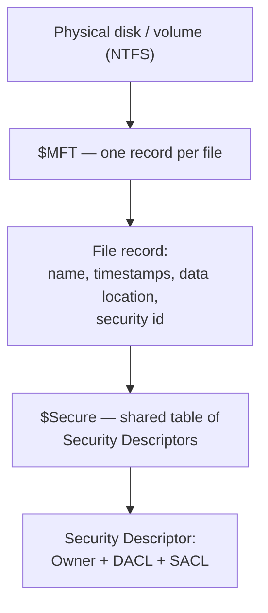
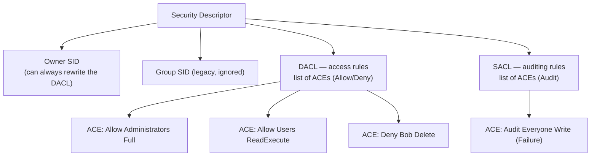
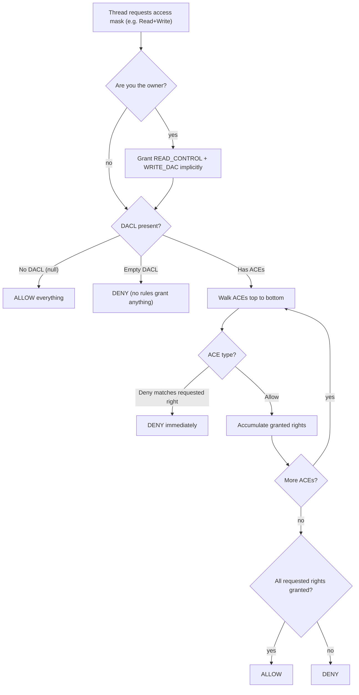
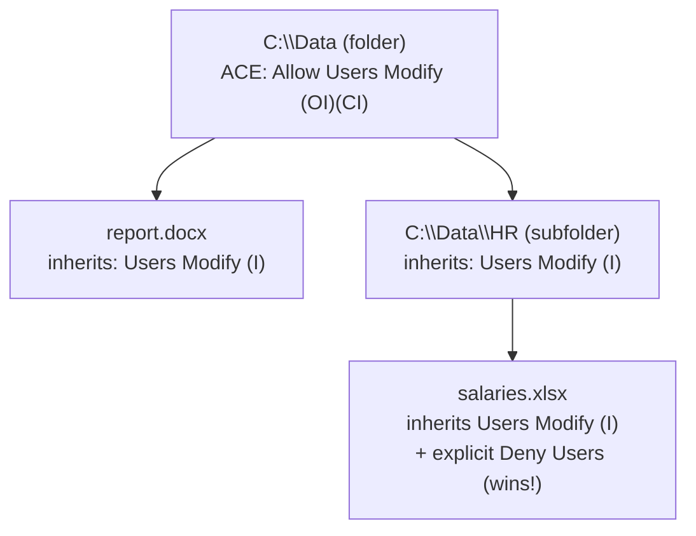
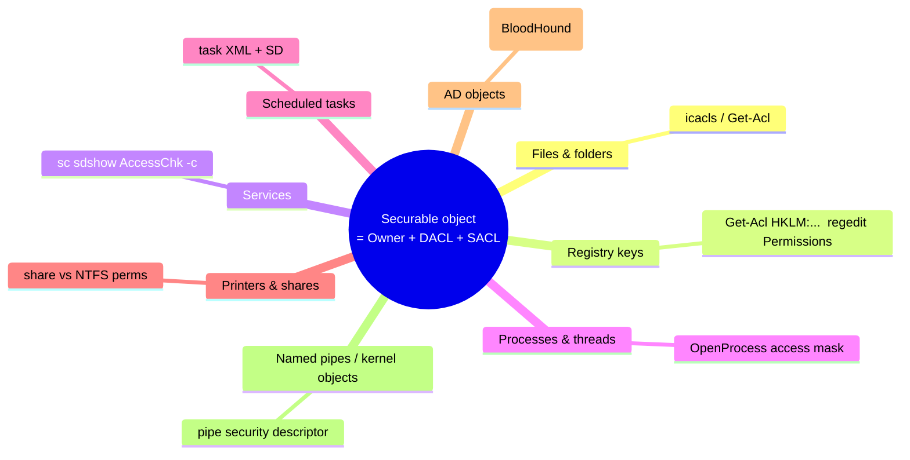

**Level:** Beginner · **Track:** Foundations · **Read time:** 120 min

This is Chapter 2 of the Windows Internals series. In Chapter 1 we sketched the Windows security model in one sentence: *your identity is a token, and permission is an ACL checked when you open something.* This chapter turns that one sentence into a complete, working understanding, using the most tangible thing on any computer — **files and folders** — as the teaching ground. By the end you will be able to look at any file on any Windows machine and answer, precisely: who can read it, who can change it, who owns it, where those rights came from, and how an attacker might abuse a mistake in them.

We start deliberately slowly, in plain English, so a complete newcomer can follow every step. Then we climb — layer by layer — to the level a security engineer at a large tech company needs: NTFS internals, the exact byte-layout intuition of a security descriptor, SDDL, inheritance rules, effective-access auditing, alternate data streams, and the ACL misconfigurations that turn an ordinary user into `SYSTEM`. Nothing here requires you to have memorized Chapter 1; we re-introduce each idea as we need it.

---

## Start Here: The Nightclub Analogy (Plain English)

Forget computers for a moment. Imagine a nightclub.

- Every **guest** has an **ID card** that says who they are and which groups they belong to ("staff", "VIP", "over-21").
- Every **door** has a **guest list** taped to it. Each line on the list says something like *"VIPs: allowed in"* or *"Under-21s: not allowed"*.
- A **bouncer** stands at each door. When you try to walk in, the bouncer looks at your ID card, reads down the guest list line by line, and decides: let you in, or turn you away.

That is the entire Windows permission model. Translating the analogy:

- Your **ID card** is your **access token** (from Chapter 1) — it names you and lists your groups.
- The **guest list** on each door is an **ACL** (Access Control List). It belongs to the file or folder.
- Each **line** on the guest list is an **ACE** (Access Control Entry) — one rule, like "the Administrators group may do anything" or "the user *bob* may not delete this".
- The **bouncer** is the **Security Reference Monitor**, the part of the Windows kernel that actually makes the decision.

Everything else in this chapter is just detail added onto this picture: what exactly is on the ID card, how the guest list is stored, the order the bouncer reads the lines in, and where the lists come from when nobody wrote them by hand. Keep the nightclub in your head — we will keep pointing back to it.

> **One-line summary to memorize now:** *An **ACL** is a list of **ACEs**; each **ACE** grants or denies specific rights to one **SID** (person/group); the bouncer checks your **token** against that list when you **open** the object.*

---

## Part 1: What Is a File System, and Why NTFS?

Before we can talk about *permissions on files*, we need to know what a "file" even is to Windows. A **file system** is the scheme the operating system uses to organize bytes on a disk into named files and folders, and to remember facts *about* each file (its size, its dates, and — crucially for us — *who is allowed to touch it*). Those "facts about a file" are called **metadata**.

Windows has used several file systems over the years, but modern Windows runs on **NTFS** (New Technology File System). Here is why NTFS matters for security specifically, compared to the older **FAT32** / **exFAT** you might see on a USB stick:

| Capability | FAT32 / exFAT | NTFS |
|-----------|---------------|------|
| Per-file permissions (ACLs) | ❌ none | ✅ full ACLs |
| Ownership | ❌ | ✅ every object has an owner |
| Auditing (log who accessed what) | ❌ | ✅ via SACLs |
| Journaling (crash recovery) | ❌ | ✅ `$LogFile` |
| Encryption (EFS) / compression | ❌ | ✅ |
| Alternate Data Streams | ❌ | ✅ (a security-relevant quirk) |
| Max file size | 4 GB (FAT32) | 16 EB (practically unlimited) |

The single most important row for us is the first one: **FAT32 has no concept of permissions at all.** Anyone who can reach the disk can read every file. This is why plugging a locked laptop's drive into another machine can bypass "permissions" if the data isn't *encrypted* — the permissions live in NTFS metadata, and another OS can choose to ignore them. Permissions are an **access-control** mechanism enforced by a running Windows kernel, **not** a confidentiality guarantee against someone with raw disk access. Hold onto that distinction; it is a common beginner (and interview) trap.

### How NTFS stores everything: the $MFT

NTFS keeps a master index called the **Master File Table (`$MFT`)**. Think of it as the library's card catalog: one record per file and folder. Each `$MFT` record stores the file's name, its timestamps, where its data lives on disk, and a block of security information (the ACL, or a reference to one). You do not edit the `$MFT` by hand, but you should know it exists for two reasons:

1. **Forensics/DFIR:** the `$MFT` is a goldmine — it can reveal files that were deleted, renamed, or time-stomped, because old records and timestamps linger. Tools like `MFTECmd` parse it.
2. **Performance of ACLs:** identical security descriptors are stored *once* in a shared metadata file (`$Secure`) and referenced by many files, so setting the same permissions on a million files does not store a million copies.



That "Security Descriptor" box is the heart of this chapter. Parts 3–6 open it up completely. But first, permissions the way you will actually meet them: in the file's Properties dialog.

---

## Part 2: Permissions as a Newcomer First Meets Them

Right-click any file in Windows Explorer, choose **Properties → Security**, and you are looking at the ACL — the guest list — in a friendly form. Let's read it the way a beginner should, then connect each word to the precise concept.

You will see two panes. The top pane lists **"Group or user names"** — these are the SIDs (people and groups) that have some rule about this file. The bottom pane shows, for whichever name you select, a set of checkboxes: **Full control, Modify, Read & execute, List folder contents, Read, Write**. Those six are **not** the real, low-level permissions — they are friendly *bundles* Microsoft groups together so humans don't have to think in raw bits. Here is what each bundle actually means:

| Friendly permission | Plain meaning | Roughly includes |
|--------------------|---------------|------------------|
| **Read** | Look at the file's contents and attributes | `ReadData`, `ReadAttributes`, `ReadEA`, `ReadPermissions` |
| **Write** | Change contents / create files in a folder | `WriteData`, `AppendData`, `WriteAttributes` |
| **Read & execute** | Read, plus run it if it's a program | Read + `Execute/Traverse` |
| **List folder contents** | See the names inside a folder | `ListDirectory` (folders only) |
| **Modify** | Read, write, and **delete** the file | Read & execute + Write + `Delete` |
| **Full control** | Everything, including **changing the permissions** and taking **ownership** | Modify + `WriteDAC` + `WriteOwner` |

The two rows that should make a security person sit up are the last two abilities inside **Full control**: **`WriteDAC`** (change the guest list itself) and **`WriteOwner`** (make yourself the owner). If you can do either, you can grant yourself anything else — so "Full control" is really "I own the door and can rewrite its guest list." We return to why that is an attacker's dream in Part 8.

> **Newcomer checkpoint.** If all you remember so far is: *Read = look, Write = change, Modify = change + delete, Full control = also rewrite the rules* — you already understand 80% of day-to-day Windows permissions. Everything below is making that precise and showing where it breaks.

### The command-line view: `icacls`

The Properties dialog is fine for one file, but professionals use the command line so they can inspect thousands of files and script fixes. The core tool is **`icacls`** (Improved Change ACLs). It ships with every Windows install. We will teach it from scratch and use it throughout. First, just *read* a file's ACL:

```cmd
icacls C:\Windows\System32\drivers\etc\hosts
```

Typical output:

```text
C:\Windows\System32\drivers\etc\hosts BUILTIN\Administrators:(F)
                                      NT AUTHORITY\SYSTEM:(F)
                                      BUILTIN\Users:(RX)
                                      APPLICATION PACKAGES...:(RX)

Successfully processed 1 files; Failed processing 0 files.
```

Read it like the nightclub guest list. Each line is one **ACE**: a principal (`BUILTIN\Administrators`), then its rights in parentheses. The letters are `icacls` shorthand — `(F)` = Full control, `(M)` = Modify, `(RX)` = Read & execute, `(R)` = Read, `(W)` = Write. So this says: *admins and SYSTEM can do anything; ordinary Users can only read and run it.* That is exactly what you want for a sensitive system file — and if you ever see `BUILTIN\Users:(F)` or `Everyone:(F)` on a system file, that is a misconfiguration and possibly a privilege-escalation path.

Here is the full `icacls` letter cheat, which we'll lean on all chapter:

| Code | Meaning | Code | Meaning |
|------|---------|------|---------|
| `F` | Full control | `RX` | Read & execute |
| `M` | Modify | `R` | Read-only |
| `W` | Write-only | `D` | Delete |
| `(OI)` | Object Inherit (files) | `(CI)` | Container Inherit (subfolders) |
| `(IO)` | Inherit Only (rule not applied here) | `(I)` | Inherited from parent |
| `(NP)` | No Propagate | `(N)` | No access |

---

## Part 3: SIDs — How Windows Names People and Groups

The nightclub bouncer needs to match your ID card against names on the list. But Windows never matches by *username text* like "bob" — usernames can be renamed and reused. Internally it matches by a permanent number called a **SID** (Security Identifier). Understanding SIDs is essential because ACLs store SIDs, not names, and because certain SIDs are the keys to the kingdom.

A SID looks like this:

```text
S-1-5-21-3623811015-3361044348-30300820-1013
│ │ │  └──────────── domain/machine identifier ───────────┘ └RID┘
│ │ └ authority (5 = NT Authority)
│ └ revision (always 1)
└ literally the letter S
```

The last chunk, the **RID** (Relative Identifier), distinguishes principals within the same machine or domain. Some SIDs and RIDs are universal and worth memorizing because you will see them in every ACL:

| SID / RID | Who it is | Why it matters |
|-----------|-----------|----------------|
| `S-1-5-18` | **SYSTEM** (LocalSystem) | The OS itself; most powerful local identity. |
| `S-1-5-32-544` | **BUILTIN\Administrators** | Local admins group. |
| `S-1-5-32-545` | **BUILTIN\Users** | All normal interactive users. |
| `S-1-1-0` | **Everyone** | Literally everyone, including guests. `Everyone:(F)` is a red flag. |
| `S-1-5-11` | **Authenticated Users** | Anyone who logged in (not anonymous). |
| `S-1-3-0` | **Creator Owner** | Placeholder that becomes whoever creates a child object. |
| RID `500` | Built-in **Administrator** account | The classic target account. |
| RID `512` | **Domain Admins** | Full control of an AD domain (later notebook). |

Translate SIDs to names and back on any host:

```powershell
# Name -> SID
$sid = (New-Object System.Security.Principal.NTAccount("BUILTIN\Users")).Translate([System.Security.Principal.SecurityIdentifier])
$sid.Value        # S-1-5-32-545

# SID -> Name
([System.Security.Principal.SecurityIdentifier]"S-1-5-18").Translate([System.Security.Principal.NTAccount]).Value  # NT AUTHORITY\SYSTEM

# Your own identity and groups
whoami /user
whoami /groups
```

> **Why attackers care about SIDs.** Because ACLs are written in SIDs, an attacker who can get their SID onto a powerful ACL — or who controls a group SID that is already on many ACLs — inherits all that access. In Active Directory this becomes *SID History* abuse and ACL-based attacks (BloodHound maps exactly these edges). Even locally, adding your user's SID to a service's ACL is a persistence and privesc trick. The name on the door doesn't matter; the SID does.

---

## Part 4: The Security Descriptor — Opening the Box

Every securable object in Windows — a file, folder, registry key, service, process, printer — carries a **Security Descriptor (SD)**. This is the real data structure behind the friendly Properties dialog. It has four parts, and once you know them, the whole model clicks:

1. **Owner** — the SID of who owns the object. The owner *always* has an implicit right to change the object's permissions, even if the DACL says otherwise. (This is why "take ownership" is so powerful.)
2. **Group** — a mostly-legacy POSIX-compatibility field; largely ignored on modern Windows. Don't worry about it.
3. **DACL** (Discretionary Access Control List) — the guest list that grants/denies access. This is what 99% of "permissions" work touches.
4. **SACL** (System Access Control List) — the *auditing* list: it doesn't grant access, it says "log it when someone does X." Used for security monitoring and compliance.



The distinction to nail down: **DACL controls access; SACL controls auditing.** A blank (null) DACL means "no rules present" which Windows treats as *everyone gets everything* — a dangerous state that sometimes appears through bugs and is worth flagging when you see it. A blank SACL just means "nothing is being logged," which is common.

### Anatomy of a single ACE

Each ACE (one line on the guest list) contains:

- **Type** — `Allow` or `Deny` (or `Audit` for SACLs).
- **Trustee SID** — who the rule is about.
- **Access mask** — a 32-bit set of flags naming the exact rights (ReadData, WriteData, Delete, WriteDAC, WriteOwner, etc.).
- **Inheritance flags** — whether and how this rule flows down to child files/folders (`OI`, `CI`, `IO`, `NP`).

The **access mask** is where the friendly bundles from Part 2 dissolve into their real bits. For files, the notable specific rights are:

| Right | Meaning | Abuse relevance |
|-------|---------|-----------------|
| `FILE_READ_DATA` | Read contents | Read secrets/config |
| `FILE_WRITE_DATA` | Overwrite contents | Plant payloads, poison config |
| `FILE_APPEND_DATA` | Add to end | Log injection |
| `FILE_EXECUTE` | Run as program | Execute planted binary |
| `DELETE` | Delete the object | Remove evidence / enable replace |
| `WRITE_DAC` | Change the ACL | Grant yourself anything |
| `WRITE_OWNER` | Take ownership | Then change the ACL |
| `READ_CONTROL` | Read the ACL | Recon of who has access |

`WRITE_DAC` and `WRITE_OWNER` are the "meta" rights: they let you edit the rules themselves. In privilege escalation, finding a low-privileged user who holds `WRITE_DAC` or `WRITE_OWNER` on a file, service, or registry key that a *high-privileged* process trusts is often the whole game.

---

## Part 5: How the Bouncer Decides — The Access-Check Algorithm

Now the crucial mechanics: given your token and an object's DACL, exactly how does Windows decide yes or no? The Security Reference Monitor runs a specific, ordered algorithm. Getting the **order** right is what separates someone who guesses at permissions from someone who can reason about them.

The rules, in order:

1. **Owner shortcut:** if you are the **owner**, you implicitly get `READ_CONTROL` and `WRITE_DAC` no matter what the DACL says. (You can always read and rewrite your own object's rules.)
2. **Null DACL:** if there is no DACL at all, access is **granted** (everyone, everything). An *empty* DACL (present but zero ACEs) means the opposite — **deny everyone**. This present-but-empty vs absent distinction trips up even experienced people.
3. **Walk the ACEs in order.** Collect the rights you requested. For each ACE that applies to a SID in your token:
   - If it's an **Access-Denied** ACE matching a right you asked for → **immediate DENY**, stop.
   - If it's an **Access-Allowed** ACE → accumulate those granted rights.
4. After the walk: if **every** right you requested has been granted by Allow ACEs and none was denied → **ALLOW**. Otherwise → **DENY**.



### Why ACE order matters: the canonical order

Because a **Deny** ACE stops the walk immediately, the *order* of ACEs changes the outcome. To make behavior predictable, Windows enforces a **canonical order** when tools write ACLs:

1. **Explicit Deny** ACEs (set directly on this object)
2. **Explicit Allow** ACEs
3. **Inherited Deny** ACEs (from the parent)
4. **Inherited Allow** ACEs

So *explicit* rules beat *inherited* ones, and within each group, *deny* beats *allow*. This is why you can grant broad access to a folder (inherited Allow) but carve out one user with an explicit Deny on a specific file — the explicit Deny is evaluated first and wins. If ACEs are out of canonical order (which malware or sloppy tooling can create), the effective access can be surprising — a real detection and audit concern.

> **Interview-level nuance (FAANG).** A common misconception is "Deny always beats Allow." Not quite — an **explicit Allow** beats an **inherited Deny**, because explicit ACEs are ordered before inherited ones. The precise statement is: *earlier ACE in canonical order wins, and canonical order puts explicit-deny first, then explicit-allow, then inherited-deny, then inherited-allow.* Being able to state this correctly is a genuine differentiator.

---

## Part 6: Inheritance — Where Permissions Actually Come From

Nobody sets permissions on every file by hand. Instead, folders pass rules down to the files and subfolders inside them. This is **inheritance**, and misunderstandings about it cause a huge share of real-world permission bugs.

When you set an ACE on a folder, its **inheritance flags** decide how it propagates:

- **`OI` (Object Inherit):** applies to **files** created inside.
- **`CI` (Container Inherit):** applies to **subfolders** created inside.
- **`IO` (Inherit Only):** the ACE does **not** apply to the folder itself, only flows to children.
- **`NP` (No Propagate):** children inherit it, but grandchildren do not.

A child object's DACL is therefore usually a mix of **inherited** ACEs (marked `(I)` in `icacls`) and **explicit** ACEs set directly on it. You can **break inheritance** on a child (the "Disable inheritance" button, or `icacls /inheritance:d`), which either copies the inherited rules in as explicit ones or removes them.



See inheritance in action with `icacls`:

```cmd
icacls C:\Data
```

```text
C:\Data BUILTIN\Administrators:(OI)(CI)(F)
        NT AUTHORITY\SYSTEM:(OI)(CI)(F)
        BUILTIN\Users:(OI)(CI)(RX)
```

The `(OI)(CI)` means these rules flow to both files (`OI`) and subfolders (`CI`). Now look at a file inside — its rules carry `(I)` to show they were inherited:

```text
C:\Data\report.docx BUILTIN\Administrators:(I)(F)
                    NT AUTHORITY\SYSTEM:(I)(F)
                    BUILTIN\Users:(I)(RX)
```

> **Common real-world bug.** An admin grants a service account `Modify` on `C:\App` with inheritance, intending it for a `logs` subfolder — but `(OI)(CI)` flows it to **every** file and folder underneath, including the app's binaries. Now the service account (often reachable by an attacker) can overwrite the app's `.exe`. This is the single most common way "convenience" ACLs become privilege escalation. Inheritance is powerful; scope it deliberately.

---

## Part 7: Integrity Levels — A Second Fence Around Every Object

Even if the DACL says "yes," there is a second check: **Mandatory Integrity Control (MIC)**. Introduced with UAC, MIC labels every process *and* every securable object with an **integrity level**: `Untrusted < Low < Medium < High < System`. The rule is simple and one-directional: **a lower-integrity process cannot write to a higher-integrity object**, even if the DACL would allow it. (Reads and executes are generally allowed; the default policy is "no write-up.")

This is why:

- A web browser's sandboxed renderer runs at **Low** integrity, so even if it's compromised it cannot modify your **Medium**-integrity documents or system files.
- A normal admin's Explorer runs at **Medium** until you approve a UAC prompt, which launches the process at **High** — only then can it write to `C:\Windows`.

You can see and set integrity labels with `icacls`:

```cmd
icacls C:\some\file.txt /setintegritylevel High
icacls C:\some\file.txt          # a Mandatory Label line appears for non-default levels
```

A file marked `Mandatory Label\High Mandatory Level:(NW)` means "no lower-integrity process may write here." MIC is the layer that makes browser sandboxes and UAC meaningful. Attackers care because **UAC bypasses** and **sandbox escapes** are fundamentally about getting a higher integrity level than you were given — and some do it by finding a High-integrity process that carelessly reads a Medium-integrity, user-writable file or registry key.

---

## Part 8: The Offensive View — Weak ACLs Are Privilege Escalation

Everything above becomes an attack surface the moment a permission is *too generous*. On Windows, local privilege escalation is very often "find the one object with a weak ACL and abuse it." Here is the map, tied back to the rights from Part 4. *All of this is for systems you own or are authorized to test.*

- **Writable service binary or folder.** If a service runs as `SYSTEM` but its `.exe` (or a folder in its path) is writable by your user, replace/plant the binary and it runs as SYSTEM at next start. (Rights: `FILE_WRITE_DATA`/`WRITE_OWNER` on the file or `FILE_ADD_FILE` on the dir.)
- **`WRITE_DAC`/`WRITE_OWNER` on a privileged object.** You can rewrite the ACL to grant yourself Full control, then do whatever you like. This is why those "meta" rights are so dangerous.
- **Weak registry ACLs.** A service's configuration key (`HKLM\SYSTEM\CurrentControlSet\Services\<svc>`) writable by a normal user lets you repoint its `ImagePath` — same idea, registry edition (Chapter 1, Part 7).
- **`SeBackupPrivilege`/`SeRestorePrivilege` tokens** bypass DACLs entirely for read/write — a token, not an ACL, but it defeats every ACL in this chapter, so it belongs on the map.
- **Alternate Data Streams (ADS)** for hiding payloads (next part).

The standard way to *find* these is to enumerate ACLs looking for your own low-privileged identity (or broad groups like `Users`/`Authenticated Users`/`Everyone`) holding write-class rights on sensitive targets. The tools that automate it — `AccessChk` (Sysinternals), `winPEAS`, `PowerUp`'s `Invoke-AllChecks` — are all just walking DACLs and comparing SIDs to your token, exactly as you now understand.

```cmd
:: AccessChk (Sysinternals): does 'Users' have write to anything under Program Files?
accesschk.exe -uwqs Users "C:\Program Files\*"
:: -w write access, -u suppress errors, -q no banner, -s recurse
```

```text
RW C:\Program Files\SloppyApp\service.exe
    MEDIUM MANDATORY LEVEL [No-Write-Up]
    RW BUILTIN\Users
        FILE_ALL_ACCESS
```

That output — ordinary **Users** holding `FILE_ALL_ACCESS` on a service binary — is a textbook SYSTEM-privilege-escalation finding.

> **Red Team** — the ACL-weakness playbook, in order of reliability: (1) writable **service binary** or its folder → replace it, restart the service → SYSTEM; (2) `WRITE_DAC`/`WRITE_OWNER` on a privileged file/key → rewrite the ACL, then own it; (3) writable **`.lnk`/scheduled-task action** that a higher-priv user runs → swap the target; (4) writable **`%PATH%` directory** earlier than a system one → DLL/exe hijack (Chapter 1). Enumerate with `PowerUp`'s `Invoke-AllChecks`, `accesschk -uwqs Users`, and `winPEAS`; weaponize by planting a *benign* proof (a file drop as SYSTEM), never real malware, and only where you are authorized. The mechanism in every case is a low-priv SID sitting on an ACL where a write-class or meta right (Part 4) shouldn't be.

> **Bug Bounty Angle.** For installed desktop software (in scope for many vendor VDPs and thick-client programs), weak filesystem/registry ACLs are among the most reliably payable bugs, reported as **local privilege escalation**. Method: install the app, then run `accesschk.exe -uwqs Users "C:\Program Files\Vendor\*"` and `accesschk.exe -uwqs Users "C:\ProgramData\Vendor\*"`, plus the registry (`accesschk -kwqs Users HKLM\SOFTWARE\Vendor`). Any `RW` for `Users`/`Authenticated Users`/`Everyone` on an executable, DLL, scheduled-task action, or service config that a higher-privileged process runs is a finding. Demonstrate impact by planting a benign proof (e.g. a file drop as SYSTEM) — never real malware — and document the exact ACL. Updater services and always-on agents are especially fruitful because they run as SYSTEM and are often installed to weakly-permissioned `ProgramData` paths.

---

## Part 9: Alternate Data Streams, Links, and NTFS Tricks

NTFS has a few features that are invisible in everyday use but matter enormously for security. A newcomer can skip nothing here — these show up constantly in CTFs and real incidents.

### Alternate Data Streams (ADS)

On NTFS, a file can carry **extra, hidden streams** of data besides its main content. The main content is technically the stream named `$DATA`; you can attach others like `file.txt:secret`. Explorer and a normal `dir` do not show them, which is exactly why malware and CTF authors love them.

```cmd
:: Hide data in a stream on an innocent-looking file
echo you found the flag > report.txt:hidden.txt

:: The file still looks 0-ish/normal size; the stream is invisible to plain dir
dir report.txt

:: Reveal streams with /r, and read one back
dir /r report.txt
more < report.txt:hidden.txt
```

```text
report.txt
    report.txt:hidden.txt:$DATA        <-- the hidden stream, only shown with /r
```

PowerShell reads them natively:

```powershell
Get-Item .\report.txt -Stream *              # list all streams
Get-Content .\report.txt -Stream hidden.txt  # read the hidden one
```

The most famous benign ADS is **`Zone.Identifier`** — the "Mark of the Web" (MOTW). When you download a file, Windows tags it with a `Zone.Identifier` stream noting it came from the internet, which is why you get "protected view" and SmartScreen warnings. Attackers try to **strip MOTW** (extract from certain archive types, or copy to FAT) to make a downloaded payload run without warnings — and defenders hunt for MOTW-stripping.

```powershell
Get-Content .\installer.exe -Stream Zone.Identifier   # ZoneId=3 means "Internet"
```

### Hard links, junctions, and symbolic links

NTFS supports several kinds of "this path points at that content" objects. They matter because they enable **link-following attacks** (redirecting a privileged write to a target the attacker couldn't otherwise touch):

| Type | Command | Points to | Security note |
|------|---------|-----------|---------------|
| Hard link | `mklink /H` | another file (same volume) | Two names, one data; deleting one keeps the other. |
| Symbolic link | `mklink` | any file/path | Creating them needs privilege or Dev Mode — because they enable attacks. |
| Junction | `mklink /J` | a folder | Classic in privesc: redirect a folder a SYSTEM process writes into. |

One more NTFS detail that pairs with the `$MFT` from Part 1: every file carries **two** sets of timestamps — the `$STANDARD_INFORMATION` set (what Explorer and `dir` show, and what apps can change) and the `$FILE_NAME` set (harder to alter). Attackers **time-stomp** — backdate a dropped file's `$STANDARD_INFORMATION` times to blend in — but the `$FILE_NAME` times often stay honest, so a mismatch between the two is a classic tampering tell. You can view the visible set and note the concept:

```powershell
Get-Item C:\lab\service.exe | Select-Object CreationTime, LastWriteTime, LastAccessTime
# Forensics tools (MFTECmd) parse BOTH $SI and $FN times; a $SI earlier than $FN = stomped
```

> **CTF Angle.** Windows privesc and forensics challenges lean on this part constantly. Fast checklist when you get a Windows foothold or a challenge file: (1) `dir /r` and `Get-Item -Stream *` on suspicious files — flags and second-stage payloads hide in ADS; (2) check `Zone.Identifier` to prove where a file came from; (3) enumerate weak ACLs with `accesschk -uwqs Users` and `PowerUp`; (4) look for writable service binaries and unquoted paths (Chapter 1). On HackTheBox/TryHackMe, an ADS-hidden flag or a `Users`-writable SYSTEM binary is an extremely common intended path. Tooling: `accesschk`, `icacls`, `PowerUp.ps1`, `winPEAS`; flag format usually `flag{...}` or `HTB{...}`.

---

## Part 10: Hands-On Lab — Reading, Fixing, and Abusing an ACL (Safely)

This lab runs entirely on a **Windows VM you own**. It has four parts: read an ACL properly, create a deliberately weak one and detect it, fix it, and demonstrate the hidden-stream trick. Every command is explained.

### Setup

```powershell
# Run as a NORMAL user first (we'll note when admin is needed).
mkdir C:\lab 2>$null
"top secret budget" | Out-File C:\lab\budget.txt
whoami        # note your username; we'll refer to it as <you>
```

### Part A — Read the ACL three ways

```powershell
# 1) icacls — the quick professional view
icacls C:\lab\budget.txt

# 2) PowerShell object view — structured, scriptable
Get-Acl C:\lab\budget.txt | Format-List
(Get-Acl C:\lab\budget.txt).Access   # one row per ACE: rights, type, SID, inheritance

# 3) Owner specifically
(Get-Acl C:\lab\budget.txt).Owner
```

Realistic `(Get-Acl ...).Access` row:

```text
FileSystemRights  : ReadAndExecute, Synchronize
AccessControlType : Allow
IdentityReference : BUILTIN\Users
IsInherited       : True
InheritanceFlags  : None
```

Read it as an ACE: *Allow — BUILTIN\Users — ReadAndExecute — inherited from the parent folder.* You are now reading raw ACLs fluently.

### Part B — Create a weak ACL and detect it (the mistake)

```powershell
# Grant the broad 'Users' group Modify on a "service binary" we simulate.
"fake service" | Out-File C:\lab\service.exe
icacls C:\lab\service.exe /grant "Users:(M)"     # <-- the misconfiguration

# Now detect it exactly as an auditor/attacker would:
icacls C:\lab\service.exe
# Look for BUILTIN\Users:(M) or (F) on an executable -> privesc risk

# AccessChk phrasing (install Sysinternals AccessChk first):
# accesschk.exe -uwq Users C:\lab\service.exe   -> prints RW if Users can write
```

Expected `icacls` after the grant:

```text
C:\lab\service.exe BUILTIN\Administrators:(I)(F)
                   NT AUTHORITY\SYSTEM:(I)(F)
                   BUILTIN\Users:(M)          <-- explicit, dangerous on an .exe
```

The absence of `(I)` on the `Users:(M)` line tells you it was set **explicitly** here (not inherited) — a deliberate, and in this case unsafe, grant.

### Part C — Fix it (least privilege)

```powershell
# Remove the over-broad grant; keep only what's needed.
icacls C:\lab\service.exe /remove:g "Users"
icacls C:\lab\service.exe            # confirm Users no longer has write

# If inheritance had pushed a bad rule down, you could reset to the parent's intent:
icacls C:\lab\service.exe /reset     # re-inherit from parent, dropping explicit ACEs
```

### Part D — Ownership and the "take ownership" power

```powershell
# See the owner, then (as admin) take ownership and note you can now rewrite the DACL.
takeown /f C:\lab\service.exe        # makes YOU the owner (needs admin or SeTakeOwnership)
icacls C:\lab\service.exe /setowner "<you>"
# Because the OWNER always has implicit WRITE_DAC, you can now grant anything:
icacls C:\lab\service.exe /grant "<you>:(F)"
```

This is the concrete demonstration of Part 4's warning: **owner ⇒ can rewrite the guest list ⇒ effectively full control.** In privesc, `SeTakeOwnershipPrivilege` + this sequence turns "I can't touch that file" into "I own it."

### Part E — The hidden stream

```powershell
# Attach and read a hidden ADS, then prove dir hides it.
Set-Content C:\lab\budget.txt -Stream note -Value "raise everyone's pay"
Get-Item C:\lab\budget.txt -Stream *          # shows :note and :$DATA
Get-Content C:\lab\budget.txt -Stream note
cmd /c "dir C:\lab\budget.txt"                # note: stream not shown
cmd /c "dir /r C:\lab\budget.txt"             # /r reveals :note
```

Clean up:

```powershell
Remove-Item C:\lab -Recurse -Force
```

### Part F — The same skill on a registry key

ACLs aren't just for files — Part 14 promised the identical model secures registry keys, so let's prove it. PowerShell exposes the registry as a drive, so `Get-Acl`/`Set-Acl` work exactly as they did on files. This is the literal mechanism behind a whole class of privilege escalations (a normal user who can write a service's config key).

```powershell
# Create a lab key and inspect its ACL just like a file:
New-Item -Path 'HKCU:\Software\lab' -Force | Out-Null
Get-Acl 'HKCU:\Software\lab' | Format-List

# Grant a broad right (simulating the misconfig) and read it back:
$acl = Get-Acl 'HKCU:\Software\lab'
$rule = New-Object System.Security.AccessControl.RegistryAccessRule(
    "Everyone","SetValue","Allow")
$acl.AddAccessRule($rule); Set-Acl 'HKCU:\Software\lab' $acl
(Get-Acl 'HKCU:\Software\lab').Access |
    Where-Object IdentityReference -match 'Everyone' |
    Select-Object RegistryRights, AccessControlType

# AccessChk phrasing for registry (note -k for keys):
# accesschk.exe -kwqs Users HKLM\SYSTEM\CurrentControlSet\Services
```

Expected:

```text
RegistryRights AccessControlType
-------------- -----------------
      SetValue             Allow
```

If that `Everyone: SetValue` were on `HKLM\SYSTEM\CurrentControlSet\Services\<svc>` instead of a harmless `HKCU` test key, a normal user could rewrite the service's `ImagePath` and gain SYSTEM at next start (Chapter 1, Part 9). Same descriptor, same access check, higher stakes. Clean up: `Remove-Item 'HKCU:\Software\lab' -Recurse -Force`.

> **What you proved.** You read ACLs three ways, created and detected the most common privesc misconfiguration (broad group with write on an executable), fixed it with least privilege, saw why ownership equals control, and hid/recovered data in an alternate stream — the exact skills used in Windows hardening, pentest privesc, and DFIR triage.

---

## Part 11: The Defensive View — Auditing, SACLs, and Detection

For a blue-teamer or a security engineer hardening a fleet, this chapter's structures are what you monitor and enforce. Four concrete practices:

**1. Turn on object-access auditing (SACLs).** The SACL from Part 4 is how you log access. Set a SACL to audit, then enable the category, and Windows writes **Event ID 4663** ("An attempt was made to access an object") to the Security log whenever the audited access happens.

```powershell
# Audit successful writes to a sensitive file by Everyone:
$acl = Get-Acl C:\Data\salaries.xlsx
$rule = New-Object System.Security.AccessControl.FileSystemAuditRule(
    "Everyone","Write","Success")
$acl.AddAuditRule($rule); Set-Acl C:\Data\salaries.xlsx $acl
# Enable the audit category so the SACL actually produces events:
auditpol /set /subcategory:"File System" /success:enable
```

Relevant Security-log events: **4663** (object access), **4670** (permissions changed), **4907** (auditing settings changed), **4720/4732** (account/group changes that alter who's on ACLs).

A resulting **Event ID 4663** looks like this (trimmed) — learn to read it, since it's the primary "who touched the file" record:

```text
An attempt was made to access an object.
  Subject:
    Account Name:   bob
    Account Domain: CORP
  Object:
    Object Type:    File
    Object Name:    C:\Data\salaries.xlsx
  Process Information:
    Process Name:   C:\Program Files\Microsoft Office\...\EXCEL.EXE
  Access Request Information:
    Accesses:       WriteData (or AddFile)
    Access Mask:    0x2
```

That single event ties a **SID** (bob) to an **access mask** (`0x2` = WriteData) on a specific **object** via a named **process** — the four nouns of this entire chapter, captured at the moment the bouncer said yes.

**2. Baseline and diff ACLs.** Export ACLs across a system and compare over time; unexpected new write grants for broad groups are a strong signal (persistence, privesc setup, or ransomware prep).

```powershell
Get-ChildItem C:\ -Recurse -File -EA SilentlyContinue |
  Get-Acl | Select-Object Path, Owner, @{n='Access';e={$_.AccessToString}} |
  Export-Csv acl-baseline.csv -NoTypeInformation
```

**3. Hunt for the danger patterns.** Alert on: `Everyone`/`Users`/`Authenticated Users` with write-class rights on `Program Files`, `Windows`, service binaries, or scheduled-task actions; ACLs in **non-canonical order**; null DACLs; and new `WRITE_DAC`/`WRITE_OWNER` grants.

**4. Watch Mark-of-the-Web and ADS.** Alert when downloaded executables lose their `Zone.Identifier`, or when uncommon ADS appear on user files — both are evasion signals.

> **Blue Team — the detection mindset.** Access control is prevention; SACL auditing is detection; ACL baselining is *change* detection. A mature environment uses all three. Sysmon complements the built-in log (e.g. **Event ID 2** for file-creation-time changes catches "time-stomping," a common `$MFT` anti-forensics move tied to Part 1). The through-line: every alert here is just noticing when the structures in Parts 3–7 change in a way legitimate administration wouldn't.

---

## Part 12: Linux Contrast — So the Model Sticks

If you know Linux permissions, contrasting the two cements both. Linux uses a compact model; Windows uses an expressive one, and the trade-offs matter.

| Question | Linux | Windows |
|----------|-------|---------|
| Who can act? | owner / group / others (3 classes) | any number of users **and** groups, via ACEs |
| What rights? | `r w x` (3 bits ×3) | ~14 specific rights per object (Read/Write/Delete/WriteDAC/...) |
| Explicit deny? | not in classic mode (POSIX ACLs add it) | yes — first-class **Deny** ACEs |
| Inheritance | umask at create; setgid dirs; POSIX-ACL `default` | rich `OI`/`CI`/`IO`/`NP` inheritance flags |
| Ownership power | owner can `chmod`; root overrides all | owner implicitly gets `WRITE_DAC`; `SeBackup`/`SeRestore` override |
| "Superuser" bypass | `root` (UID 0) ignores permission bits | `SYSTEM` + `SeBackup/SeRestore/SeTakeOwnership` bypass DACLs |
| Auditing built in? | via `auditd` (separate) | via **SACLs** in the same descriptor |

The key insight: Linux answers "who" with three fixed classes and "what" with three bits, which is simple but coarse. Windows answers "who" with an unbounded list of SIDs and "what" with a dozen-plus precise rights, which is powerful but far easier to misconfigure. **More expressiveness means more ways to make a dangerous mistake** — which is exactly why Windows privilege escalation so often comes down to one over-permissive ACE, and why the enumeration tools in Part 8 exist.

---

## Part 13: SDDL — The Text Language of Security Descriptors

So far we've read ACLs in the friendly `icacls` letters and in PowerShell objects. But Windows also has a compact **string** representation of an entire security descriptor called **SDDL** (Security Descriptor Definition Language). You will meet SDDL whenever you look at services (`sc sdshow`), Group Policy, PowerShell remoting endpoints, scheduled tasks, and event-log channel permissions — so learning to decode it is a real professional skill, and it forces the Part 4–5 concepts to become concrete.

An SDDL string looks intimidating but is just the four parts of a security descriptor written out:

```text
O:BAG:BAD:(A;;FA;;;BA)(A;;0x1200a9;;;BU)(D;;WD;;;S-1-5-...)S:(AU;SAFA;FA;;;WD)
│    │   │ └────────── DACL: a run of ACEs ──────────┘        └── SACL ──┘
│    │   └ D: introduces the DACL
│    └ G:BA  = primary group (Built-in Administrators) — legacy
└ O:BA       = Owner = Built-in Administrators
```

Each ACE inside is itself a semicolon-delimited tuple: `(type;flags;rights;object_guid;inherit_object_guid;trustee)`. You mostly care about three fields — **type**, **rights**, and **trustee**:

| Field | Example values | Meaning |
|-------|---------------|---------|
| ACE type | `A` Allow · `D` Deny · `AU` Audit | Same Allow/Deny/Audit from Part 4 |
| Rights | `FA` Full · `FR` read · `FW` write · `FX` execute · or hex `0x1200a9` | The access mask |
| Trustee | `BA` Admins · `SY` SYSTEM · `BU` Users · `WD` Everyone · `AU` Auth Users · or a raw SID | Who the ACE applies to |

Those two-letter trustee/right codes are **SID/rights abbreviations** ("SDDL well-known strings"). The handful you'll actually reuse:

| Code | Trustee | Code | Right |
|------|---------|------|-------|
| `SY` | SYSTEM | `FA` | Full access |
| `BA` | Builtin Administrators | `FR` | Generic read |
| `BU` | Builtin Users | `FW` | Generic write |
| `WD` | Everyone (World) | `FX` | Generic execute |
| `AU` | Authenticated Users | `CC/DC/LC/SW/RP/WP` | granular (create/delete/list/…) |

So `(A;;FA;;;BA)` reads as *"Allow — Full Access — to Builtin Administrators."* And a dangerous service ACE like `(A;;RPWPCR;;;BU)` reads as *"Allow — start/stop/reconfigure — to ordinary Users,"* which is a privilege-escalation red flag because `WP` on a service is `SERVICE_CHANGE_CONFIG` (repoint the binary — Chapter 1, Part 9).

Generate and parse SDDL yourself:

```powershell
# Convert a file's descriptor to SDDL:
(Get-Acl C:\Windows\System32\drivers\etc\hosts).Sddl

# Turn an SDDL string back into a readable object (great for auditing service ACLs):
ConvertFrom-SddlString "O:BAG:BAD:(A;;FA;;;BA)(A;;FA;;;SY)(A;;0x1200a9;;;BU)"
# -> lists Owner, Group, and each DiscretionaryAcl entry in plain English
```

```text
:: A service's live descriptor, as you'd see it in the wild:
C:\> sc.exe sdshow Spooler
D:(A;;CCLCSWRPWPDTLOCRRC;;;SY)(A;;CCDCLCSWRPWPDTLOCRSDRCWDWO;;;BA)(A;;CCLCSWLOCRRC;;;IU)(A;;CCLCSWLOCRRC;;;SU)
```

Reading that last line: SYSTEM (`SY`) and Admins (`BA`) get broad rights; Interactive/Service users (`IU`/`SU`) get only query/enumerate. If you ever saw `WP` (change config) granted to `BU` or `WD` there, that service is a local-privesc vector — this is exactly what `AccessChk -c` and `PowerUp`'s `Get-ModifiableService` check, now demystified.

> **FAANG-level takeaway.** SDDL is how security descriptors travel through configuration systems (GPO, DSC, IaC templates, service manifests). Being able to eyeball an SDDL string and spot `WP`/`FA` granted to `WD`/`BU`/`AU` is a fast, high-value audit skill — you can review hundreds of service and task ACLs from their SDDL without opening a single GUI.

## Part 14: Beyond Files — Everything Securable Uses the Same Model

The reason we spent a whole chapter on *files* is that **the exact same security descriptor + token + access-check machinery secures every other object type in Windows.** Once you can read a file's ACL, you can read them all — only the specific rights in the access mask change per object type. This generalization is what makes this chapter a foundation rather than a one-off.



The same DACL you now understand secures each of these, with object-specific rights:

| Object | Inspect with | Dangerous grant to a low-priv SID |
|--------|-------------|-----------------------------------|
| Registry key | `Get-Acl HKLM:\SOFTWARE\...` | `SetValue`/`WriteDAC` on a service/Run key |
| Service | `sc sdshow`, `accesschk -c` | `SERVICE_CHANGE_CONFIG` (`WP`) → repoint binary |
| Process | opened via `OpenProcess` | `PROCESS_VM_WRITE`/`CREATE_THREAD` → injection |
| Scheduled task | task folder ACL + XML | write to the action target → run as task's user |
| File share | share perms **and** NTFS perms | the *more restrictive* of the two wins |

That last row is a frequent real-world gotcha worth calling out for newcomers: a network **share** has *two* independent permission layers — the **share permissions** and the underlying **NTFS permissions** — and the **effective** access is the **intersection** (the more restrictive). A folder shared with "Everyone: Full" at the share layer but "Users: Read" at the NTFS layer is still only Read over the network. Both the offensive (why can't I write?) and defensive (why is this exposed?) sides depend on remembering there are two gates.

### A worked access-check, end to end

Tie Parts 5, 6 and 13 together with one concrete example. Suppose `salaries.xlsx` has this DACL (in canonical order), and user **bob** (a member of `Users`, not an Admin) requests **Write**:

```text
1. (D) Deny   bob            Write        <- explicit deny
2. (A) Allow  Administrators FullControl  <- explicit allow
3. (A) Allow  Users          Read (I)     <- inherited allow
```

The bouncer walks top-down. ACE 1 is an explicit **Deny** for a right bob requested (Write) and bob *is* the trustee → **immediate DENY, stop.** Bob cannot write, even though he's in `Users` and even if a later ACE would allow it — because a matching Deny appears first in canonical order. Now flip it: bob requests **Read**. ACE 1 (Deny Write) doesn't match the requested right (Read), so it's skipped; ACE 2 doesn't apply (bob isn't an Admin); ACE 3 grants `Users: Read` and bob is in `Users` → the requested right is satisfied → **ALLOW**. Same file, same user, different answer depending only on *which right* was requested and *the order* of ACEs. That is the whole model, working exactly as Part 5 described.

## Part 15: Effective Access — Answering "Can This User Actually Touch It?"

Reading a DACL tells you the *rules*; it does not directly tell you the *answer* for a specific person, because a user's real access is the combination of every group they're in, minus every Deny, filtered by integrity level. Computing that by hand across a dozen inherited ACEs is error-prone — so Windows gives you an **Effective Access** calculator, and it's a skill worth having because "who can *really* write here?" is the question that matters in both hardening and privesc.

In the GUI: **Properties → Security → Advanced → Effective Access** tab, pick a user or group, click "View effective access," and Windows simulates the full access check (including group membership and inheritance) and shows a per-right ✔/�’ grid. This is the authoritative "what would the bouncer decide" answer without needing to log in as that user.

From code, reason about it the way the tools do — resolve the token's groups, then evaluate the DACL:

```powershell
# List every ACE and whether it's inherited, then think in terms of the requesting token's SIDs
(Get-Acl C:\Data\salaries.xlsx).Access |
    Select-Object IdentityReference, FileSystemRights, AccessControlType, IsInherited |
    Format-Table -Auto

# AccessChk answers effective access directly for a principal:
#   does user 'bob' have write to this tree?
accesschk.exe -w "bob" -s "C:\Data"      # prints each object bob can write
```

Realistic `accesschk` answer:

```text
RW C:\Data\logs
  bob  FILE_ALL_ACCESS
R  C:\Data\salaries.xlsx
  bob  FILE_GENERIC_READ
```

That output resolves the whole puzzle: bob can *write* the `logs` folder (inherited Modify) but only *read* `salaries.xlsx` (the explicit Deny from Part 14's example stripped his write). You just watched inheritance, explicit-deny precedence, and group resolution combine into a single real answer — which is exactly the reasoning an auditor documents and an attacker exploits.

> **Bug Bounty / hardening tip.** When auditing an installed app, run `accesschk.exe -w "Authenticated Users" -s "C:\Program Files\Vendor"` (and the `ProgramData` and `HKLM\SOFTWARE\Vendor` equivalents). Effective-access output for a broad group directly enumerates every writable object a normal user could abuse — no manual ACE math, no false positives from Deny ACEs you missed.

## Part 16: Encryption vs Permissions — Closing the Confidentiality Gap

Part 1 warned that NTFS permissions are an *access-control* mechanism enforced by a running kernel, not a guarantee against someone with raw disk access. This part makes the fix explicit, because conflating the two is one of the most consequential mistakes a newcomer (or an org) can make.

Two encryption controls close the gap, and they solve different threats:

| Control | Protects against | Scope | Key tied to |
|---------|-----------------|-------|-------------|
| **BitLocker** | Whole-disk theft (stolen/discarded drive, offline attack) | Entire volume | TPM + optionally PIN/USB |
| **EFS** (Encrypting File System) | Other *users* on the same running machine reading your files | Per file/folder | The user's certificate/keys |

**BitLocker** encrypts the whole volume, so pulling the drive and reading it in another machine yields ciphertext — it defeats exactly the "ignore the ACLs by using another OS" attack from Part 1. It's transparent once the volume is unlocked at boot (via the TPM). The residual risks are things like DMA/cold-boot attacks and, historically, unattended unlocked machines — but for lost-laptop confidentiality it is the correct control, and permissions alone are not.

**EFS** encrypts individual files with a per-user key, so even another administrator on the same box can't read them without the user's private key (barring the configured recovery agent). It shows up as green filenames in Explorer. EFS is niche in modern deployments (BitLocker covers most needs) but appears in CTFs and DFIR: recovering EFS-encrypted files hinges on possessing the user's key material, and `cipher.exe` manages it.

```cmd
cipher /e /s:C:\secret         :: EFS-encrypt a folder tree
cipher /c C:\secret\file.txt    :: show which certificates/keys can decrypt it
manage-bde -status C:           :: BitLocker state of the volume
```

The mental model to carry forward: **permissions decide who the *running OS* lets in; encryption decides who can read the *bytes* at all.** Defense in depth uses both — ACLs for day-to-day least privilege on a live system, BitLocker for the drive-theft/offline threat, and EFS (or app-layer encryption) for per-user confidentiality where required. An interview answer that cleanly separates "access control" from "confidentiality at rest" signals real understanding.

## Part 17: Common Pitfalls and Misconceptions

- **"Permissions protect my data from anyone."** No — they are enforced by a *running Windows kernel*. Someone with raw disk access (another OS, a pulled drive) can ignore NTFS ACLs. Confidentiality needs **encryption** (BitLocker/EFS), not just permissions.
- **"Deny always wins over Allow."** Only within canonical order. An **explicit Allow** beats an **inherited Deny** (Part 5). State it precisely.
- **"An empty DACL means locked down."** Backwards for the *null* case: **no DACL = everyone gets everything**; an **empty (present) DACL = nobody gets anything**. Two very different states.
- **"Full control is just a lot of read/write."** No — Full control includes `WRITE_DAC` and `WRITE_OWNER`, i.e. the power to rewrite the rules and take ownership. That's a categorical jump, not a bigger quantity.
- **"The owner is whoever created it, and that's cosmetic."** The owner has an *implicit* right to change the DACL forever. Ownership is power, not a label.
- **"`icacls` and Explorer show the same thing."** Explorer hides specific rights inside friendly bundles and hides some inheritance detail. For security work, trust `icacls`/`Get-Acl`/`accesschk`.
- **"ADS is exotic and rare."** `Zone.Identifier` is on nearly every file you download. ADS is everyday NTFS, and a routine hiding spot.
- **"Integrity levels are the same as permissions."** They're a *separate* gate (MIC) layered on top: a Low process can't write up even with an allowing DACL.
- **"Timestamps are trustworthy."** The times Explorer shows (`$STANDARD_INFORMATION`) are app-writable and routinely **time-stomped**; corroborate with `$FILE_NAME` times via `$MFT` parsing before trusting a file's age (Part 9).

---

## Part 18: Final Revision — The One-Page Mental Model

Read this until it's automatic. Every later Windows chapter (authentication, Active Directory ACLs, GPO, service hardening) builds on it:

- A file lives in **NTFS**, indexed by the **`$MFT`**; its permissions ride in a **Security Descriptor** (Owner + DACL + SACL).
- **Identity** is a **token** of **SIDs**; **permission** is a **DACL** of **ACEs**; each ACE = (Allow/Deny, SID, access mask, inheritance flags).
- The **access check** walks ACEs in **canonical order** (explicit-deny → explicit-allow → inherited-deny → inherited-allow); first match that resolves your requested rights wins; the **owner** can always rewrite the DACL; **null DACL = open, empty DACL = closed**.
- **Inheritance** (`OI`/`CI`/`IO`/`NP`) is where most real ACLs come from — and where the most common dangerous mistakes happen.
- **Integrity levels (MIC)** add a "no write-up" fence independent of the DACL; it's what makes UAC and sandboxes real.
- **Weak ACLs = privilege escalation**: broad groups (`Users`/`Everyone`) with write on service binaries/config, or `WRITE_DAC`/`WRITE_OWNER` on privileged objects. Find them with `accesschk`/`PowerUp`/`icacls`.
- **NTFS extras** — **ADS** (hidden streams, Mark-of-the-Web) and **links/junctions** — are everyday features with big security implications.
- **Defense** = DACLs (prevent) + **SACL auditing / Event 4663** (detect) + ACL baselining (detect change).
- **Encryption ≠ permissions**: BitLocker defeats drive theft/offline reads; EFS gives per-user confidentiality; ACLs alone protect neither against raw-disk access.

Memory hooks: **"permissions gatekeep the live OS; encryption gatekeeps the bytes"** · **"token vs ACL, checked at open"** · **"owner rewrites the door"** · **"explicit beats inherited, deny beats allow — in that order"** · **"null open, empty closed"** · **"broad group + write on an .exe = SYSTEM."**

---

## Part 19: Cheat Sheet

**Reading ACLs**

```powershell
icacls C:\path\file                       # quick view (F/M/RX/R/W, (I) inherited)
Get-Acl C:\path\file | Format-List        # structured
(Get-Acl C:\path\file).Access             # one row per ACE
(Get-Acl C:\path\file).Owner              # owner SID/name
accesschk.exe -uwqs Users "C:\Program Files\*"   # who-can-write hunt (Sysinternals)
```

**Changing ACLs**

```powershell
icacls file /grant "User:(M)"             # grant Modify
icacls file /remove:g "User"              # remove all granted ACEs for User
icacls file /deny "User:(W)"              # explicit deny write
icacls folder /grant "User:(OI)(CI)(RX)"  # grant with inheritance to files+subfolders
icacls file /inheritance:d                # disable inheritance (copy or remove)
icacls file /reset                        # re-inherit from parent (drop explicit ACEs)
icacls file /setowner "User"              # set owner (needs privilege)
takeown /f file                           # take ownership (admin/SeTakeOwnership)
icacls file /setintegritylevel High       # set MIC label
```

**Alternate Data Streams**

```powershell
dir /r file                               # reveal streams (cmd)
Get-Item file -Stream *                   # list streams (PowerShell)
Get-Content file -Stream name             # read a stream
Get-Content file -Stream Zone.Identifier  # Mark-of-the-Web (ZoneId=3 = Internet)
```

**Key SIDs:** `S-1-5-18` SYSTEM · `S-1-5-32-544` Administrators · `S-1-5-32-545` Users · `S-1-1-0` Everyone · `S-1-5-11` Authenticated Users · `S-1-3-0` Creator Owner.

**`icacls` letters:** `F`=Full · `M`=Modify · `RX`=Read+Execute · `R`=Read · `W`=Write · `D`=Delete · `(I)`=inherited · `(OI)`=object-inherit · `(CI)`=container-inherit · `(IO)`=inherit-only · `(NP)`=no-propagate.

**Access-check order (canonical):** explicit Deny → explicit Allow → inherited Deny → inherited Allow. Owner always gets implicit `WRITE_DAC`. Null DACL = allow-all; empty DACL = deny-all.

**Audit events:** 4663 (object access) · 4670 (perms changed) · 4907 (audit settings changed) · 4720/4732 (account/group changes).

---

## Part 20: Practice Labs & Resources

Train these skills on real, legal targets:

- **TryHackMe — "Windows PrivEsc" and "Windows PrivEsc Arena":** weak service ACLs, writable binaries, registry ACLs — the entire Part 8 skill set, hands-on.
- **TryHackMe — "Windows Fundamentals 2":** NTFS, permissions, and the Properties/Security dialog for absolute beginners.
- **HackTheBox — Optimum, Devel, Access, Bastard:** classic footholds where an ACL or writable path is the intended escalation.
- **HackTheBox Academy — "Windows Privilege Escalation" module:** structured coverage of ACL-based privesc matching Parts 4–8.
- **PortSwigger / general:** not web-focused here, but pair with **Sysinternals `AccessChk` and `icacls`** practice on your own VM until reading an ACL is instant.
- **Tools to learn by using:** `icacls`, `Get-Acl`/`Set-Acl`, Sysinternals **AccessChk**, **PowerUp.ps1** (`Invoke-AllChecks`), **winPEAS**, **MFTECmd** (Eric Zimmerman) for `$MFT` forensics.
- **MITRE ATT&CK to read alongside:** T1222 (File and Directory Permissions Modification), T1564.004 (Hide Artifacts: NTFS ADS), T1548 (Abuse Elevation Control Mechanism), T1553.005 (Subvert Trust Controls: Mark-of-the-Web).
- **Reference:** *Windows Internals, 7th ed.* (Russinovich et al.), the "Security" chapter, for the authoritative treatment of tokens, SIDs, ACLs and the access check.

**Practice questions:**

1. In plain English, then in precise terms, explain why an **explicit Allow** can beat an **inherited Deny**. Reference the canonical order.
2. You find `BUILTIN\Users:(M)` (not inherited) on `C:\Program Files\App\updater.exe`, and the updater runs as SYSTEM. Describe the escalation and the exact `icacls`/`accesschk` commands you'd use to confirm it.
3. What is the difference between a **null** DACL and an **empty** DACL, and why is one dangerous?
4. A downloaded `.exe` runs with no SmartScreen warning even though it came from the internet. Which NTFS feature was likely stripped, and how would you check for it?
5. Give two reasons NTFS permissions do **not** protect data against an attacker who removes the disk, and name the correct control that does.

6. Decode this service SDDL ACE and say whether it's a privesc risk for a normal user: `(A;;RPWPCR;;;BU)`. Which single right makes it dangerous, and what would you do with it?

---

*Also on [Praneeth's portfolio](https://ping-praneeth.vercel.app/notebook/windows-fundamentals/02-windows-file-system-permissions-acls-and-security-descriptors), with comments and the latest edits.*
