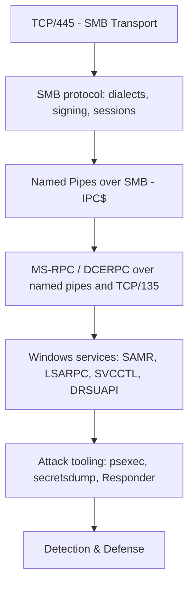
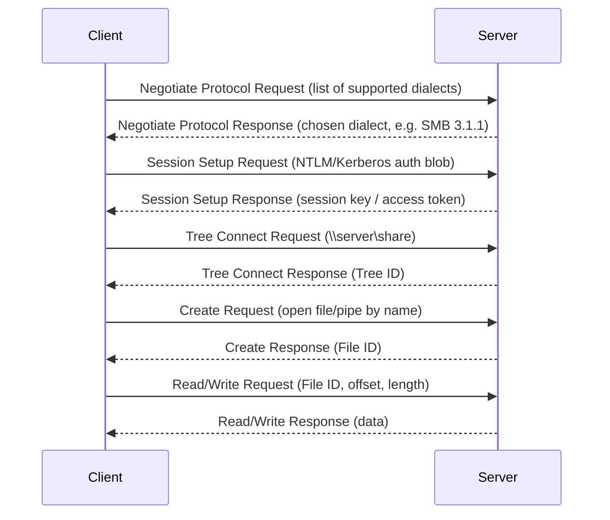
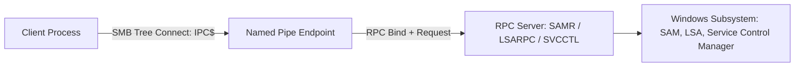
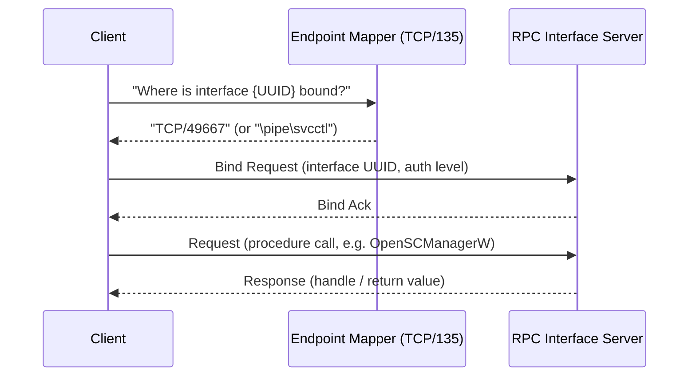

This is Chapter 6 of the Windows Internals series. Chapter 5 covered how PowerShell and WMI reach across the network. This chapter goes one layer deeper, into the actual protocols carrying that traffic and file access: **SMB** (Server Message Block), **named pipes**, and **MS-RPC/DCERPC**. If you've ever wondered how `psexec` actually starts a service remotely, how `secretsdump.py` pulls password hashes without ever touching disk on the target, or why "SMB signing" appears in every hardening checklist you've ever read, this chapter answers it from the wire up.

---

## Who This Chapter Is For (and the Map Ahead)

You don't need any networking background beyond "TCP/IP exists." We start with what a file share actually is at the protocol level, build up through SMB's history and dialects, introduce named pipes as the transport that lets RPC ride on top of SMB, and finish with the MS-RPC framework that quietly runs almost every remote Windows management operation you've already used in Chapters 4 and 5.



By the end, you'll be able to read a Wireshark SMB capture and explain what's happening at each stage, understand exactly why SMB signing and SMBv1 deprecation matter, and connect the dots between "port 445 is open" and "an attacker can dump domain password hashes."

---

## 1. SMB: The Protocol Behind Every Windows File Share

**SMB** (Server Message Block) is the application-layer protocol Windows uses for shared access to files, printers, and named pipes over a network. When you type `\\fileserver\share` in Explorer, or `net use Z: \\fileserver\share`, SMB is what carries that request.

### A brief, essential history (why dialects matter)

| Version | Introduced | Key facts |
|---|---|---|
| **SMB1 / CIFS** | Windows NT 4 era | Chatty, insecure by modern standards, still vulnerable to relay/downgrade attacks; **EternalBlue (MS17-010)** exploited an SMBv1 kernel buffer overflow and powered WannaCry/NotPetya |
| **SMB2** | Windows Vista/Server 2008 | Reduced protocol chatter (fewer commands), improved performance, added `compounding` (batching requests) |
| **SMB2.1** | Windows 7/Server 2008 R2 | Added opportunistic lock leasing improvements, large MTU support |
| **SMB3.0** | Windows 8/Server 2012 | Added **SMB encryption**, multichannel, transparent failover — designed for datacenter/cluster use |
| **SMB3.1.1** | Windows 10/Server 2016 | Added **pre-authentication integrity** (defeats a class of downgrade/MITM attacks) and mandates stronger signing negotiation |

> **Pitfall:** SMBv1 is still enabled by default on some legacy installations and many embedded/NAS devices. Any modern security assessment should explicitly check for it — `Get-SmbServerConfiguration | Select EnableSMB1Protocol` — because its continued presence is itself a finding, independent of whether MS17-010 is patched.

### Default ports and the transport story

- **TCP/445** — "SMB direct" (native SMB over TCP, no NetBIOS wrapper) — the modern default since Windows 2000.
- **TCP/139** — legacy **NetBIOS Session Service**, used to carry SMB before native TCP transport existed, and still negotiated as a fallback on many networks.
- **UDP/137, UDP/138** — NetBIOS Name Service and Datagram Service, used for name resolution before DNS became universal (and still abused today — see Responder, below).

### The SMB negotiation and session setup



Each stage matters for security analysis:

- **Negotiate Protocol** reveals the dialects a server will accept — if SMB1 is still in the offered list, that's visible on the wire even before authentication.
- **Session Setup** carries the actual authentication exchange — this is where NTLM relay attacks intercept and forward the challenge-response.
- **Tree Connect** is where share-level permissions get enforced (in addition to NTFS file-level ACLs from Chapter 2).

### SMB signing: what it actually does and why it matters

**SMB signing** adds a cryptographic signature (HMAC, derived from the session key) to every SMB message, so a man-in-the-middle can't tamper with or replay packets. Without signing, an attacker positioned on the network (e.g., via ARP spoofing or LLMNR/NBT-NS poisoning) can perform an **NTLM relay attack**: capture an authentication attempt from Victim A, and relay it live to Server B before it expires, authenticating as Victim A without ever knowing the password.

```powershell
# Check current SMB signing requirement (server side)
Get-SmbServerConfiguration | Select-Object RequireSecuritySignature, EnableSecuritySignature

# Enforce SMB signing (recommended hardening — GPO equivalent: "Microsoft network server: Digitally sign communications (always)")
Set-SmbServerConfiguration -RequireSecuritySignature $true -Force
```

> **Why this is one of the highest-value hardening controls in Windows:** relay attacks against unsigned SMB were the backbone of tools like Responder + `ntlmrelayx.py` for years, and remain extremely common on internal penetration tests and real intrusions because SMB signing is **not enabled by default on workstations** (only enforced by default on Domain Controllers). Enabling it organization-wide via GPO closes an entire attack class in one change.

---

## 2. Named Pipes: SMB's Other Payload

A **named pipe** is an inter-process communication (IPC) mechanism — a named, bidirectional channel that one process creates and others connect to, exactly like a Unix named FIFO but with richer semantics (message-mode framing, impersonation of the calling client's security context, and both local and *remote* access).

The critical fact for this chapter: **named pipes can be accessed remotely over SMB**, via the special administrative share `\\<host>\IPC$` — a share that exists specifically to carry named-pipe and RPC traffic, not regular files. This is what turns SMB from "just file sharing" into the transport for an enormous amount of Windows remote management.

```powershell
# List named pipes visible on the local system (via Sysinternals PipeList, or natively)
[System.IO.Directory]::GetFiles("\\.\pipe\")

# Connect to IPC$ manually (illustrates that IPC$ isn't a "real" file share)
net use \\SRV01\IPC$ "" /user:LABDOMAIN\labuser
```

Sample output from listing pipes on a domain controller — the names alone tell you which services are active:

```
\\.\pipe\lsass
\\.\pipe\netlogon
\\.\pipe\samr
\\.\pipe\lsarpc
\\.\pipe\srvsvc
\\.\pipe\wkssvc
\\.\pipe\spoolss
```

Each of those pipe names corresponds directly to an RPC interface (`samr`, `lsarpc`, `srvsvc`, `netlogon`) — which is exactly the topic of the next section.



---

## 3. MS-RPC / DCERPC: The Framework Underneath Almost Everything

**MS-RPC** is Microsoft's implementation of **DCERPC** (Distributed Computing Environment / Remote Procedure Call), an open standard from the Open Software Foundation. It's the mechanism that lets a client call a function that actually executes on a remote server, with parameters marshaled across the network — conceptually similar to gRPC or SOAP, but far older and baked deep into Windows internals.

### The core building blocks

- **Interface** — a defined set of remotely callable functions, identified by a **UUID** (e.g., SAMR's interface UUID is `12345778-1234-abcd-ef00-0123456789ac`).
- **Endpoint** — where a client actually connects to reach an interface: either a **named pipe** (`\pipe\samr`) or a **dynamic TCP port** (negotiated via the **endpoint mapper**, RPC's own service registry).
- **Endpoint Mapper (EPM)** — a well-known RPC service that always listens on **TCP/135**; clients ask it "which port is interface X currently bound to?" and get back a dynamic port (typically in the 49152–65535 range on modern Windows), which is exactly the "port 135 + dynamic RPC" transport referenced back in Chapter 5's WMI-over-DCOM discussion.
- **Binding** — the client establishes a connection to the resolved endpoint and performs an RPC **bind** operation, negotiating the interface version and authentication level before making actual procedure calls.



### The RPC interfaces every security engineer should recognize

| Interface | Named pipe | Purpose | Why attackers/assessors care |
|---|---|---|---|
| **SAMR** (Security Account Manager Remote) | `\pipe\samr` | Query/manage local and domain user accounts | Enumerate users, groups, password policy remotely — `rpcclient`, `net rpc`, `enum4linux` all use this |
| **LSARPC** (Local Security Authority) | `\pipe\lsarpc` | Query security policy, SID↔name lookups | **SID brute-forcing/lookup** (`LookupSids`/`LookupNames`) to enumerate domain users even with RID cycling |
| **SVCCTL** (Service Control Manager) | `\pipe\svcctl` | Create, start, stop, delete Windows services remotely | This is literally what `psexec`-style tools use to gain remote code execution |
| **NETLOGON** | `\pipe\netlogon` | Secure channel setup between domain members and DCs | Target of **Zerologon (CVE-2020-1472)**, a critical netlogon authentication bypass |
| **DRSUAPI** (Directory Replication Service) | dynamic TCP | Active Directory replication | Abused by **DCSync** to request password hashes as if the requester were a replicating DC — covered in depth in the AD notebook |
| **WKSSVC** (Workstation Service) | `\pipe\wkssvc` | Query workstation info, logged-on users | Basic recon — `NetWkstaGetInfo` |
| **SRVSVC** (Server Service) | `\pipe\srvsvc` | Enumerate shares (`NetShareEnum`), server info | Share enumeration — the RPC call behind `net view \\host` |

### rpcclient: teaching the tool from scratch

`rpcclient` (from the Samba suite, present on Kali and most pentest distros) is a direct, interactive client for these RPC interfaces — invaluable for understanding what's actually happening under tools like `enum4linux` or `crackmapexec`.

```bash
# Null-session connection (works only if the target allows anonymous RPC — increasingly rare, but still found)
rpcclient -U "" -N 10.10.10.20

# Authenticated connection
rpcclient -U "labdomain/labuser%Password123!" 10.10.10.20

# Once connected, interactive commands:
rpcclient $> enumdomusers          # list domain users via SAMR
rpcclient $> querydominfo          # domain password policy, lockout threshold
rpcclient $> lsaenumsid            # enumerate SIDs via LSARPC
rpcclient $> netshareenum          # list shares via SRVSVC
```

Sample `enumdomusers` output:

```
user:[Administrator] rid:[0x1f4]
user:[Guest] rid:[0x1f5]
user:[krbtgt] rid:[0x1f6]
user:[jdoe] rid:[0x450]
user:[svc_backup] rid:[0x451]
```

Every RID (relative identifier) here is exactly the kind of enumeration that feeds into password-spraying target lists and later Kerberos/AD attacks covered in the Active Directory notebook.

---

## 4. Hands-On Lab: Enumerating and Abusing SMB/RPC End to End

**Scenario:** you have network access to `10.10.10.20` in an isolated lab and no credentials yet. Goal: fingerprint SMB, find a foothold via null-session/guest enumeration, then escalate to service-based remote code execution once you obtain valid credentials — using only the protocol layers covered in this chapter.

**Step 1 — SMB dialect and OS fingerprinting**

```bash
nmap -p445 --script smb-protocols,smb-os-discovery 10.10.10.20
```

```
PORT    STATE SERVICE
445/tcp open  microsoft-ds

Host script results:
| smb-protocols:
|   dialects:
|     2.0.2
|     2.1
|     3.0
|     3.0.2
|_    3.1.1
| smb-os-discovery:
|   OS: Windows Server 2019 Standard 17763
|   Computer name: SRV01
|   Domain name: lab.local
|_  System time: 2026-01-01T09:00:00+00:00
```

Note: no SMB1 offered — this target already has SMBv1 disabled, a good sign for the defenders and a hint the attacker will need valid creds rather than an EternalBlue-style exploit.

**Step 2 — anonymous share and RPC enumeration**

```bash
smbclient -L //10.10.10.20/ -N
```

```
Sharename       Type      Comment
---------       ----      -------
ADMIN$          Disk      Remote Admin
C$              Disk      Default share
IPC$            IPC       Remote IPC
Backups         Disk      Backup staging
```

```bash
rpcclient -U "" -N 10.10.10.20 -c "enumdomusers"
```

```
result was NT_STATUS_ACCESS_DENIED
```

Anonymous RPC is locked down — expected on a reasonably hardened host — so the "Backups" share (visible even without credentials, since ADMIN$/C$/IPC$ are default and Backups is custom) becomes the next lead.

**Step 3 — accessing the discovered share anonymously**

```bash
smbclient //10.10.10.20/Backups -N
smb: \> ls
```

```
  web.config                          A     3204  Mon Jan  1 08:00:00 2026
  db_backup_creds.txt                 A       58  Mon Jan  1 08:00:00 2026
```

```bash
smb: \> get db_backup_creds.txt
cat db_backup_creds.txt
```

```
svc_backup:B4ckupP@ss2026!
```

**Step 4 — validating the credential and enumerating with authenticated RPC**

```bash
crackmapexec smb 10.10.10.20 -u svc_backup -p 'B4ckupP@ss2026!'
```

```
SMB   10.10.10.20   445   SRV01   [*] Windows Server 2019 Standard 17763 x64 (name:SRV01) (domain:lab.local)
SMB   10.10.10.20   445   SRV01   [+] lab.local\svc_backup:B4ckupP@ss2026!
```

```bash
rpcclient -U "lab.local/svc_backup%B4ckupP@ss2026!" 10.10.10.20 -c "enumdomusers"
```

```
user:[Administrator] rid:[0x1f4]
user:[svc_backup] rid:[0x451]
user:[svc_sql] rid:[0x452]
```

**Step 5 — confirming local admin rights and executing code via SVCCTL (the psexec primitive)**

```bash
crackmapexec smb 10.10.10.20 -u svc_backup -p 'B4ckupP@ss2026!' --local-auth -x "whoami"
```

```
SMB   10.10.10.20   445   SRV01   [+] Executed command via wmiexec
SMB   10.10.10.20   445   SRV01   nt authority\system
```

`SYSTEM` confirms the service account has local administrative rights — enough for a full `psexec.py`/`smbexec.py`-style shell, which under the hood: uploads a binary to `ADMIN$` (or writes a temporary service binary), calls `SVCCTL`'s `CreateServiceW` and `StartServiceW` over the `\pipe\svcctl` named pipe to register and launch it as a Windows service running as SYSTEM, then reads output and calls `DeleteService` to clean up.

---

## 5. Red Team: Offensive Use of SMB/RPC

> **Red Team Angle** — SMB and RPC show up in nearly every phase of an internal engagement:
>
> - **NTLM relay** (`ntlmrelayx.py` from Impacket) captures authentication attempts triggered by LLMNR/NBT-NS poisoning (Responder) or forced authentication (PetitPotam, PrinterBug) and relays them to a target that doesn't enforce SMB signing — turning "someone's workstation tried to browse a fake share" into "I have a shell or a set of NTLM hashes."
> - **Share enumeration and credential hunting** — unauthenticated or low-priv `smbclient`/`crackmapexec` share crawls routinely surface plaintext credentials in config files, scripts, and backup files, as simulated in the lab above.
> - **Service-based lateral movement** (`psexec.py`, `smbexec.py`, `atexec.py`) all use SVCCTL/task-scheduler RPC interfaces over the same `ADMIN$`/`IPC$` foundation.
> - **Zerologon (CVE-2020-1472)** exploited a cryptographic flaw in the NETLOGON secure channel setup to reset a Domain Controller's machine account password to an empty value with zero authentication — a stark example of why RPC interface security matters at the protocol level, not just "is SMB signed."
> - **DCSync via DRSUAPI** impersonates a Domain Controller's replication request to pull password hashes for any account, including `krbtgt` — covered fully in the Active Directory notebook, but the RPC interface (`DRSUAPI`) is exactly the mechanism introduced here.

---

## 6. Blue Team: Detecting SMB/RPC Abuse

> **Blue Team Angle** — SMB/RPC activity is extremely high-volume in any real environment, so effective detection is about baselining *expected* administrative sources and flagging *unexpected* ones, not alerting on every SMB connection.

Key signals and Event IDs:

| Event ID / Signal | Source | What it means |
|---|---|---|
| **5140 / 5145** | Security log | Network share object access / detailed file share access — pair with share name filters to catch access to `ADMIN$`/`C$` from unexpected source hosts |
| **7045** | System log | A new service was installed — the direct fingerprint of `psexec`/`smbexec`-style execution via SVCCTL; look for random/generated service names |
| **4697** | Security log | A service was installed (Security log equivalent, requires "Audit security system extension") |
| **4624 Logon Type 3** | Security log | Network logon — correlate volume/source of SMB logons against a baseline of known admin jump hosts |
| **LLMNR/NBT-NS poisoning responses** | Network IDS/Zeek | Watch for a single host answering many NetBIOS name queries — signature of Responder running on the network |
| **Zerologon exploitation attempts** | Netlogon debug logging | Repeated `NetrServerAuthenticate3` calls with all-zero client credentials |

Concrete hardening, in priority order:

1. **Disable SMBv1 everywhere** (`Disable-WindowsOptionalFeature -Online -FeatureName SMB1Protocol`) — removes an entire legacy attack surface including EternalBlue-class exploits.
2. **Enforce SMB signing** on all workstations and servers, not just Domain Controllers (`Set-SmbServerConfiguration -RequireSecuritySignature $true`) — the single biggest mitigation against NTLM relay.
3. **Disable LLMNR and NBT-NS** via GPO where legacy name resolution isn't required — removes Responder's primary poisoning vector.
4. **Patch for Zerologon (CVE-2020-1472)** and enforce `FullSecureChannelProtection` — Microsoft made enforcement mandatory in later updates, but verify explicitly.
5. **Monitor and alert on Event ID 7045** for service names that don't match your organization's naming conventions or software inventory — this single signal catches an enormous share of `psexec`-family lateral movement.
6. **Restrict anonymous/null-session access** to SAMR and LSARPC (`restrictremotesam` registry setting / `Network access: Restrict clients allowed to make remote calls to SAM`) to prevent unauthenticated user enumeration.

---

## Bug Bounty Angle

> **Bug Bounty Angle** — pure SMB/RPC findings are rare in typical web-focused bug bounty programs (most are out of scope, since they're internal-network protocols), but they matter directly in a few situations:
>
> - **Programs that explicitly include internal/VPN-accessible infrastructure** (some enterprise VDR/bug-bounty programs do) treat exposed SMB (445), null-session RPC enumeration, or unsigned SMB as valid, reportable findings — frame them using the same CVSS network-vector reasoning as any other exposed service.
> - **Cloud and SaaS products with an embedded Windows/SMB component** (backup appliances, storage gateways, hybrid file-sync products) have had real, paid vulnerabilities where a web-facing management interface passed attacker input into an internal SVCCTL/SMB call, leading to file-share traversal or remote command execution — worth testing for if the product architecture includes an SMB backend.
> - **Exposed SMB directly to the internet** (still found via Shodan searches for port 445) is one of the most consistently reported "low-hanging fruit" findings across bug bounty programs that include perimeter infrastructure, given the EternalBlue history — even a patched host is often flagged for the exposure itself.

## CTF Angle

> **CTF Angle** — SMB/RPC enumeration is one of the very first things to try on almost any Windows-flavored CTF box, HackTheBox and TryHackMe especially.
>
> - **Standard opening move:** `nmap -p445 --script smb-* <target>` followed by `smbclient -L //<target>/ -N` and `enum4linux -a <target>` to check for anonymous share/RPC access — this alone solves a surprising number of "easy" boxes by turning up a readable share with credentials or a flag directly.
> - **Common pattern:** a share with anonymous/guest read access contains a config file, script, or backup with embedded credentials (exactly as simulated in the lab above) — the "solve" is reading the share, not exploiting anything.
> - **Common pattern 2:** once credentials are obtained, `psexec.py`/`crackmapexec --local-auth -x` or `evil-winrm` (Chapter 5) provide the actual shell to grab `user.txt`/`root.txt`.
> - **EternalBlue-specific boxes** (legacy HTB machines, dedicated "MS17-010" rooms on THM) use Metasploit's `exploit/windows/smb/ms17_010_eternalblue` module directly — know the module's `RHOSTS`/`LHOST`/`payload` options cold, since it's a near-guaranteed early box on beginner tracks.
> - **rpcclient challenges:** some CTFs specifically test raw RPC interaction — `rpcclient -U "" -N <target>` then `enumdomusers`/`queryuser`/`lsaenumsid` to manually recover a username or RID that's the actual flag or the next pivot point.

---

## Common Pitfalls

- **Treating "port 445 open" as automatically exploitable.** Modern Windows disables SMBv1 by default and enforces signing on Domain Controllers; confirm the actual dialect and signing requirement before assuming EternalBlue or relay will work.
- **Forgetting that IPC$ isn't a real file share.** Attempting to browse it like a normal share ("why is it empty?") misunderstands its purpose — it exists purely to carry named-pipe/RPC traffic, not user files.
- **Confusing the Endpoint Mapper port (135) with the actual RPC interface port.** TCP/135 only ever answers "where is interface X" — the real traffic lands on a dynamically assigned high port (or a named pipe), which is why blocking only 135 doesn't stop RPC traffic that's already resolved its endpoint.
- **Assuming null-session RPC enumeration still works everywhere.** It was the default in Windows NT4/2000-era systems; modern Windows restricts anonymous SAMR/LSARPC access by default (`RestrictAnonymous`), though misconfigurations and legacy environments still allow it — always test, don't assume.
- **Ignoring Event ID 7045 as "just service installs."** Because legitimate software installs services too, teams sometimes suppress this event entirely — the fix is filtering/alerting on anomalous service names and binary paths, not disabling the signal.
- **Enabling SMB signing only on servers, not workstations.** NTLM relay attacks frequently target *workstations* (via forced authentication techniques like PetitPotam), so signing needs to be enforced fleet-wide, not just on servers/DCs.

---

## Final Revision — Recap

- **SMB** carries file sharing, and — via the special **IPC$** share — **named pipes**, which in turn carry **RPC** traffic. Dialects evolved SMB1 (CIFS, insecure, EternalBlue) → SMB2/2.1 → SMB3.x (encryption, pre-auth integrity).
- **SMB signing** (HMAC per message) defeats NTLM relay attacks; it's off by default on workstations and a top hardening priority.
- **Named pipes** are IPC channels accessible locally and remotely over SMB; pipe names (`\pipe\samr`, `\pipe\svcctl`, `\pipe\netlogon`) map directly to specific RPC interfaces.
- **MS-RPC/DCERPC** is the framework underneath: interfaces identified by UUID, resolved via the **Endpoint Mapper (TCP/135)** to either a dynamic TCP port or a named pipe, then bound and called.
- Key interfaces to know: **SAMR** (account enum), **LSARPC** (SID lookups), **SVCCTL** (remote service control — the `psexec` primitive), **NETLOGON** (secure channel — Zerologon), **DRSUAPI** (AD replication — DCSync).
- **rpcclient** is the direct, from-scratch tool for interacting with these interfaces manually.
- Detection centers on **Event ID 7045** (new service — the psexec fingerprint), **5140/5145** (share access), and baselining expected SMB/RPC administrative sources.

---

## Cheat Sheet

```
# --- Fingerprinting ---
nmap -p445 --script smb-protocols,smb-os-discovery,smb-security-mode <target>
Get-SmbServerConfiguration | Select EnableSMB1Protocol, RequireSecuritySignature

# --- Anonymous / low-priv enumeration ---
smbclient -L //<target>/ -N
enum4linux -a <target>
rpcclient -U "" -N <target>

# --- rpcclient interactive commands ---
enumdomusers      # SAMR: list domain users
querydominfo      # SAMR: domain/password policy
lsaenumsid        # LSARPC: enumerate SIDs
netshareenum      # SRVSVC: list shares

# --- Authenticated enumeration & execution ---
crackmapexec smb <target> -u <user> -p <pass>
crackmapexec smb <target> -u <user> -p <pass> --local-auth -x "whoami"
psexec.py <domain>/<user>:<pass>@<target>
smbexec.py <domain>/<user>:<pass>@<target>

# --- Hardening ---
Disable-WindowsOptionalFeature -Online -FeatureName SMB1Protocol
Set-SmbServerConfiguration -RequireSecuritySignature $true -Force

# --- Detection: key Event IDs ---
7045        New service installed (psexec/smbexec fingerprint)
5140/5145   Network share / detailed file share access
4624 (T3)   Network logon
4697        Service installed (Security log)
```

---

## Practice Labs & Resources

1. **TryHackMe — "Blue"** — the canonical EternalBlue (MS17-010) walkthrough box; confirm the vulnerability with `nmap --script smb-vuln-ms17-010` before exploiting.
2. **HackTheBox — any Windows box tagged SMB/enum4linux** — practice the full chain from anonymous share enumeration to authenticated RPC to service-based shell.
3. **rpcclient manual-enumeration exercise:** in your own lab domain, disable all higher-level tools and manually recover the full user list, password policy, and share list using only `rpcclient` interactive commands.
4. **Responder + ntlmrelayx lab (isolated network only):** stand up Responder to capture a poisoned LLMNR authentication attempt, then relay it with `ntlmrelayx.py` to a target with SMB signing disabled — then re-run with signing enabled and confirm the relay fails.
5. **Zerologon lab (patched vs. unpatched VM pair):** run a Zerologon proof-of-concept against a deliberately unpatched Server 2019 domain controller in an isolated lab, observe the NETLOGON secure-channel reset, then repeat against a patched DC and confirm it's blocked.
