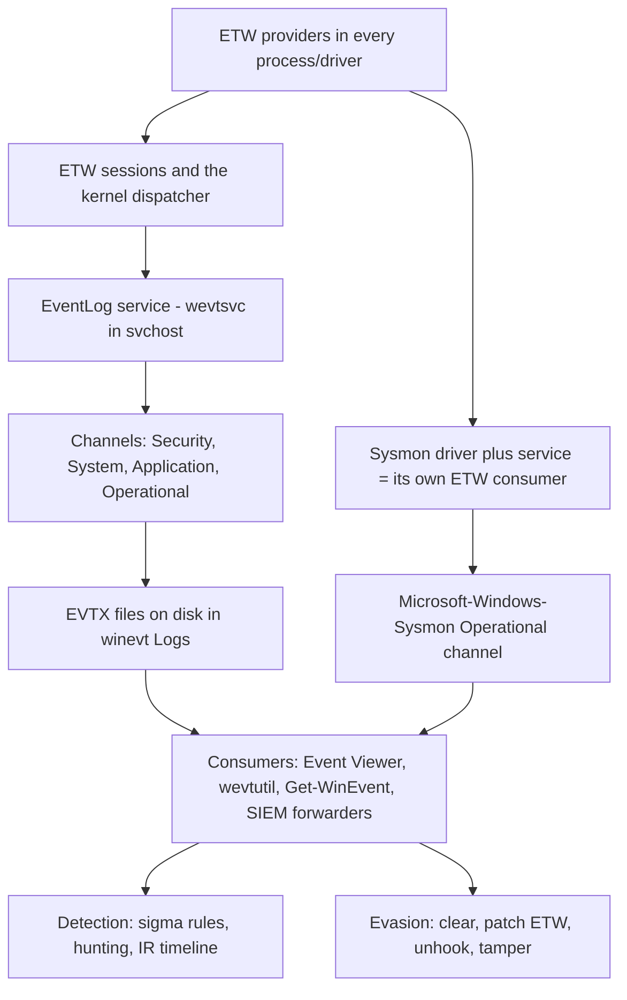
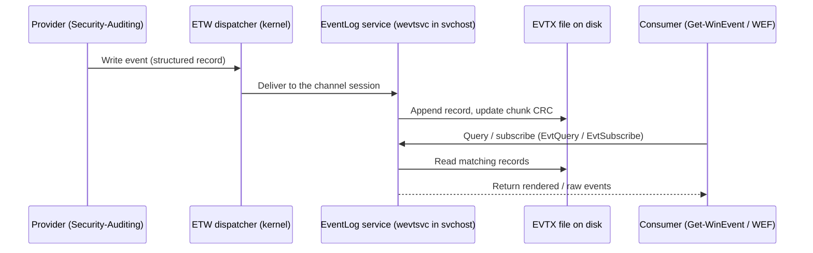
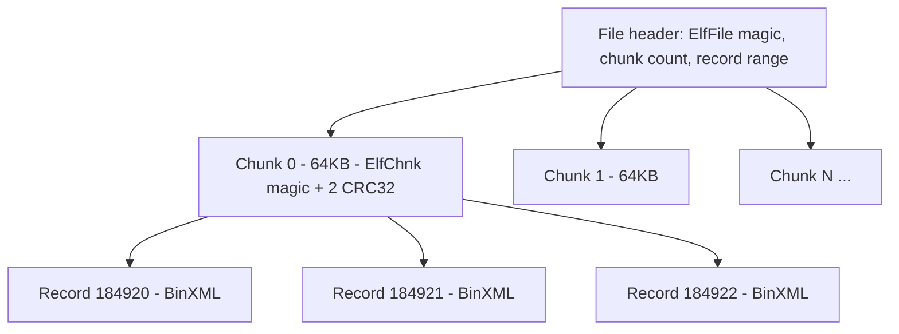
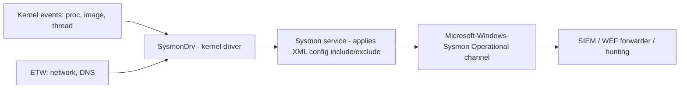
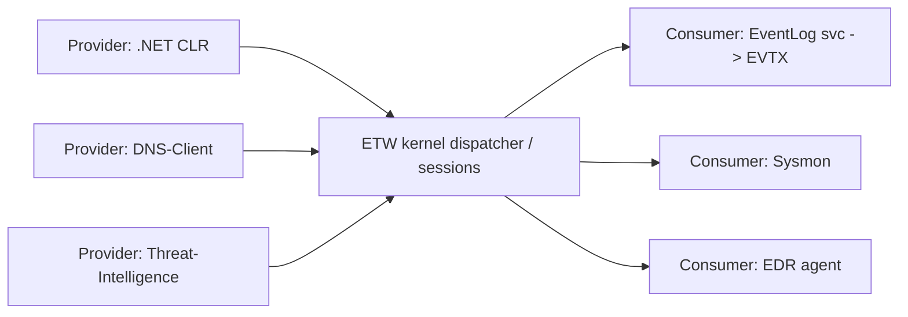
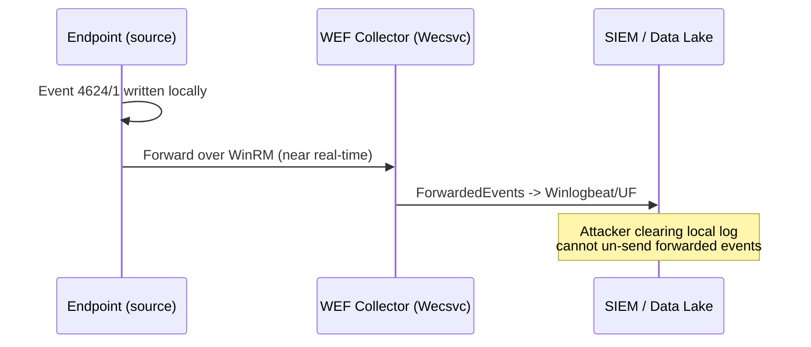
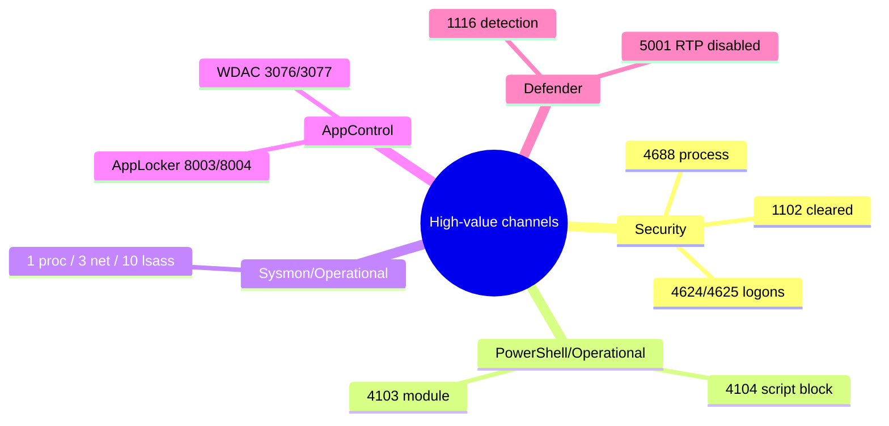
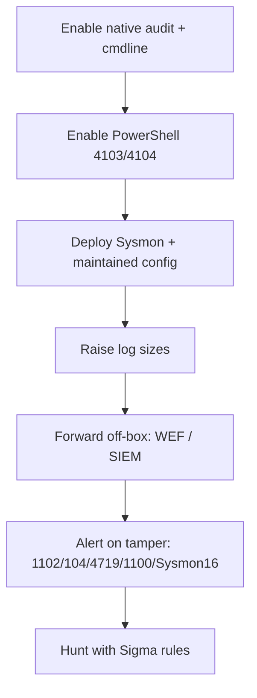

**Level:** Intermediate · **Track:** Foundations · **Read time:** 150 min

This is Chapter 7 of the Windows Internals series. Chapter 6 took you down to the wire — SMB, named pipes, and MS-RPC — and showed how tools like `psexec` and `secretsdump` move across a network. Every one of those actions leaves a trail. This chapter is about that trail: **where Windows records what happened, how complete those records are, how to read them, how to enrich them with Sysmon, and how both attackers and defenders fight over them.**

If you only ever learn one "blue" topic deeply as an offensive operator, make it this one — because you cannot evade what you don't understand, and you cannot investigate what you can't read. Event logs are simultaneously the defender's primary evidence source and the attacker's biggest liability. By the end of this chapter you will know exactly which Event ID fires when someone runs `whoami`, why "clearing the logs" is both possible and self-incriminating, and how a well-tuned Sysmon config turns a quiet box into a glass house.

---

## Who This Chapter Is For (and the Map Ahead)

You need nothing beyond the earlier Windows chapters: you should be comfortable with processes and the registry (Chapter 1), tokens and authentication (Chapter 3), and PowerShell (Chapter 4). We start from "what is a log, physically," build up through the Event Log service architecture and the EVTX file format, tour the channels and the Event IDs that actually matter, then install and tune Sysmon from zero, drop below both of them into **ETW** (Event Tracing for Windows — the plumbing under all of it), and finish with the full offense/defense fight over telemetry: clearing, tampering, unhooking, and detecting each of those.



Keep that diagram in mind. Almost everything in this chapter is a stop on one of those arrows.

---

## Part 1: What a Windows Event Log Actually Is

On Linux you were used to logs being plain text: `/var/log/auth.log` is lines you can `grep`. Windows made a different design choice decades ago. Windows events are **structured records**, not free text. Each event is a small blob with a fixed set of fields — a numeric **Event ID**, a **provider** (the component that emitted it), a **level** (Information/Warning/Error), a **timestamp**, the **computer** and **user (SID)**, and a set of named **EventData** fields specific to that Event ID. The human-readable sentence you see in Event Viewer ("An account was successfully logged on...") is not stored in the log at all — it is a *template* pulled from the provider's message DLL at display time and filled in with the stored EventData.

This matters enormously in practice:

- **Two machines can render the same event differently** if their provider message files differ in language or version, but the underlying EventData is identical. When you hunt at scale, you match on Event ID + EventData fields, never on the English sentence.
- **You can lose the pretty rendering entirely.** Copy an `.evtx` file to a box that lacks the emitting provider, and Event Viewer shows "The description for Event ID X cannot be found." The evidence is still there — the raw fields — you just don't get the sentence. Tools like `python-evtx`, Chainsaw, and EvtxECmd parse the raw record regardless.

A single event record looks like this when dumped as XML (this is the *actual* on-disk structure, exposed by `wevtutil` or `Get-WinEvent`):

```xml
<Event xmlns="http://schemas.microsoft.com/win/2004/08/events/event">
  <System>
    <Provider Name="Microsoft-Windows-Security-Auditing" Guid="{54849625-5478-4994-a5ba-3e3b0328c30d}" />
    <EventID>4624</EventID>
    <Version>2</Version>
    <Level>0</Level>
    <Task>12544</Task>
    <Opcode>0</Opcode>
    <Keywords>0x8020000000000000</Keywords>
    <TimeCreated SystemTime="2026-08-20T09:14:07.123456700Z" />
    <EventRecordID>184922</EventRecordID>
    <Correlation ActivityID="{2e...}" />
    <Execution ProcessID="712" ThreadID="4820" />
    <Channel>Security</Channel>
    <Computer>WS01.corp.local</Computer>
    <Security />
  </System>
  <EventData>
    <Data Name="SubjectUserSid">S-1-5-18</Data>
    <Data Name="TargetUserName">jdoe</Data>
    <Data Name="TargetDomainName">CORP</Data>
    <Data Name="LogonType">3</Data>
    <Data Name="IpAddress">10.10.5.42</Data>
    <Data Name="LogonProcessName">NtLmSsp</Data>
    <Data Name="AuthenticationPackageName">NTLM</Data>
  </EventData>
</Event>
```

The `<System>` block is the same schema for every event on every Windows box. The `<EventData>` block is the payload and is entirely specific to Event ID 4624 (a successful logon). Learn to read this XML — it is the ground truth, and it is what SIEM parsers and Sigma rules operate on.

**Security relevance:** notice `LogonType 3` (network) and `AuthenticationPackageName NTLM` above. That single event, read correctly, tells a defender this was a *remote NTLM* logon — exactly the fingerprint of pass-the-hash and `secretsdump` from Chapter 6. The English sentence buries that; the fields expose it.

---

## Part 2: The Event Log Service Architecture

Where do these records live and who writes them? The **Windows Event Log service** (service name `EventLog`, DisplayName "Windows Event Log", implemented in `wevtsvc.dll` and hosted inside a shared `svchost.exe`) is the central broker. Providers throughout the OS — the kernel, the Security Reference Monitor, services, drivers, and applications — hand events to this service, which serializes them into per-channel `.evtx` files on disk.



Key facts an operator must internalize:

- **The service runs inside a shared `svchost` process.** You cannot cleanly "kill the log service" without killing a `svchost` that may host other services, and stopping the `EventLog` service *itself* generates event **1100** ("The event logging service has shut down") in the Security channel plus **7040/7036** service-state events in System. Stopping logging is loud.
- **The service, not the provider, owns the file.** That is why you cannot just open the `.evtx` and delete a line — the file is held open with a lock by `svchost`. Attackers who want to tamper must either go through the service API (which audits the action) or manipulate the file at a lower level (far harder, and itself detectable).
- **Channels map to files.** The channel name in the XML (`Security`, `System`, `Application`, or an operational channel like `Microsoft-Windows-Sysmon/Operational`) corresponds to a physical file under `%SystemRoot%\System32\winevt\Logs\`. `Security` becomes `Security.evtx`; slashes in operational channel names become `%4` in the filename, e.g. `Microsoft-Windows-Sysmon%4Operational.evtx`.

You can inspect every configured log and its backing file with `wevtutil`:

```powershell
# List every log channel on the system (hundreds exist)
wevtutil el

# Show config for the Security log: path, size cap, retention policy
wevtutil gl Security
```

Sample output of `wevtutil gl Security`:

```
name: Security
enabled: true
type: Admin
owningPublisher:
isolation: Custom
channelAccess: O:BAG:SYD:(A;;0xf0005;;;SY)(A;;0x5;;;BA)(A;;0x1;;;S-1-5-32-573)
logging:
  logFileName: %SystemRoot%\System32\winevt\Logs\Security.evtx
  retention: false
  autoBackup: false
  maxSize: 20971520
publishing:
  ...
```

`maxSize: 20971520` is 20 MB — the *default* Security log cap on many builds, which is comically small for a busy server and is the #1 reason evidence is missing during IR: the log wrapped and overwrote the interesting hour. `retention: false` means "overwrite oldest events when full" (circular). **Blue team baseline:** raising these caps (256 MB–1 GB+) and forwarding events off-box is the single highest-value logging change most orgs can make.

---

## Part 3: The EVTX File Format on Disk

For forensics and anti-forensics you need to know what an `.evtx` file *is*, not just that it exists. EVTX is a binary format introduced with Windows Vista/Server 2008 (the old pre-Vista `.evt` format is different and largely gone). Understanding its layout tells you why some tampering leaves obvious scars and why some deleted events are still recoverable.

An EVTX file is:

- A **file header** (magic bytes `ElfFile\0`) containing the number of chunks, the oldest and current record IDs, and flags.
- A sequence of **chunks**, each 64 KB, each starting with the magic `ElfChnk\0`. A chunk holds many event records plus its own header with first/last record numbers and **two CRC32 checksums** (one for the header, one for the event data region).
- Within a chunk, individual **event records** (magic `\x2a\x2a\x00\x00`), each carrying a record identifier, a timestamp, a size prefix *and a duplicate size suffix*, and the event content encoded in **Binary XML** (a token-compressed form of the XML you saw in Part 1).



Why this structure is a gift to forensic analysts:

- **CRCs make silent edits detectable.** If an attacker patches bytes inside a record to hide their username, the chunk's data CRC no longer matches. Tools such as EvtxECmd flag chunk CRC mismatches, and analysts treat them as strong tampering indicators.
- **Record IDs are monotonic.** Every record gets an ever-increasing `EventRecordID`. If an attacker deletes records to remove a gap, the surviving record IDs jump — 184920, 184921, **187002** — and a missing-ID gap is itself suspicious.
- **Slack space holds ghosts.** Because chunks are fixed 64 KB and records are variable, freed record bytes are not immediately zeroed. Carving tools recover "deleted" events from chunk slack and from unallocated disk. This is why `wevtutil cl` (which resets the whole file) is far cleaner from the attacker's perspective than trying to surgically remove one record — and also why forensic imaging of the raw disk beats trusting the live file.

**Red team usage:** the practical takeaway is that EVTX cannot be edited surgically without leaving CRC and record-ID scars. Every credible "log manipulation" technique either clears an entire log (loud, event 1102) or attacks the *pipeline before disk* (ETW patching, provider suppression — Part 9), not the file itself.

You can parse EVTX off-host without Windows at all, which is exactly what an incident responder does with a triage image:

```bash
# python-evtx: pure-Python EVTX parser (pip install python-evtx)
evtx_dump.py Security.evtx | less        # dump every record as XML

# Zimmerman's EvtxECmd (Windows/.NET) — the IR standard
EvtxECmd.exe -f Security.evtx --csv . --csvf sec.csv
```

---

## Part 4: The Channels That Matter

Modern Windows has *hundreds* of channels. You will never memorize them all, and you do not need to. There are three "classic" logs plus a handful of operational channels that carry 95% of investigative value.

| Channel | Backing file | What it carries | Why you care |
|---|---|---|---|
| **Security** | `Security.evtx` | Audit policy results: logons, privilege use, object access, account/group changes, process creation (4688), log clears (1102) | The #1 source for auth, lateral movement, and privilege abuse |
| **System** | `System.evtx` | Service installs/state (7045/7040/7036), driver loads, time changes, EventLog service stop (6005/6006) | Malicious services, boot/shutdown, log-tampering side effects |
| **Application** | `Application.evtx` | App crashes, MSI installs, WER, some AV product events | Crash-based exploitation clues, install activity |
| **Windows PowerShell** | `Windows PowerShell.evtx` | Engine lifecycle (400/403), legacy PS logging | Older-style PS activity |
| **PowerShell/Operational** | `Microsoft-Windows-PowerShell%4Operational.evtx` | **Script Block Logging (4104)**, module logging (4103) | The best view into what PowerShell actually *ran*, incl. deobfuscated blocks |
| **Sysmon/Operational** | `Microsoft-Windows-Sysmon%4Operational.evtx` | Rich process/network/registry/image-load telemetry (Part 6) | The single richest endpoint source once installed |
| **TerminalServices / RDP channels** | several | RDP session connect/disconnect/reconnect | Interactive lateral movement over 3389 |
| **TaskScheduler/Operational** | `...TaskScheduler%4Operational.evtx` | Scheduled-task register/update/delete/run (106/140/141/200/201) | Persistence and execution via `schtasks` |
| **WMI-Activity/Operational** | `...WMI-Activity%4Operational.evtx` | WMI event-consumer activity (5857–5861) | WMI persistence and lateral movement (Chapter 5) |

**IR use case:** when you land on a suspected-compromised host, you do not "open Event Viewer and scroll." You pull these specific channels, run a known set of Event ID queries against them (Part 5), and build a timeline. Everything else is noise until a lead points you there.

The **type** of a channel matters too. `wevtutil gl` shows `type: Admin`, `Operational`, `Analytic`, or `Debug`. Admin/Operational are enabled and persisted by default; Analytic/Debug channels are high-volume, disabled by default, and must be explicitly turned on (and often are, deliberately, for deep hunting).

---

## Part 5: The Security Log Event IDs You Must Know Cold

This is the memory-hook core of the chapter. These are the Security-channel Event IDs that appear in virtually every real investigation. Learn the number, the trigger, and the key EventData fields.

| Event ID | Meaning | Fire when | Key fields to read |
|---|---|---|---|
| **4624** | Successful logon | Any successful auth to the box | `LogonType`, `TargetUserName`, `IpAddress`, `AuthenticationPackageName`, `LogonId` |
| **4625** | Failed logon | Bad creds / lockout / spray | `TargetUserName`, `IpAddress`, `Status`/`SubStatus`, `LogonType` |
| **4634 / 4647** | Logoff / user-initiated logoff | Session ends | `LogonId` (correlate to 4624) |
| **4648** | Logon with explicit creds | `runas`, `psexec -u`, overpass-the-hash | `SubjectUserName`, `TargetUserName`, `TargetServerName` |
| **4672** | Special privileges assigned | Admin/high-priv logon | `SubjectUserName`, `PrivilegeList` |
| **4688** | Process creation | Every new process (if audited) | `NewProcessName`, `ProcessCommandLine`, `ParentProcessName`, `TokenElevationType` |
| **4689** | Process exit | Process ends | `ProcessName`, `ProcessId` |
| **4720 / 4726** | User account created / deleted | Account lifecycle | `TargetUserName`, `SubjectUserName` |
| **4728 / 4732 / 4756** | Member added to security-enabled global / local / universal group | Privilege escalation via group | `MemberSid`, `TargetUserName` (group) |
| **4768 / 4769 / 4771** | Kerberos TGT requested / service ticket requested / pre-auth failed | DC-side Kerberos (Chapter 3) | `TargetUserName`, `ServiceName`, `TicketEncryptionType`, `IpAddress` |
| **4776** | NTLM credential validation | DC validates NTLM | `TargetUserName`, `Workstation`, `Status` |
| **4698 / 4699 / 4702** | Scheduled task created / deleted / updated | Persistence | `TaskName`, `SubjectUserName` |
| **5140 / 5145** | Network share accessed / detailed file share check | SMB access (Chapter 6) | `ShareName`, `IpAddress`, `AccessMask` |
| **1102** | **Audit log was cleared** | Someone cleared the Security log | `SubjectUserName`, `SubjectDomainName` |

### Logon types — the table that unlocks 4624/4625

`LogonType` is the field that turns a generic "logon" into a story. Memorize these:

| LogonType | Name | Real-world meaning |
|---|---|---|
| 2 | Interactive | At the physical console (or `runas`) |
| 3 | Network | SMB, WinRM, `secretsdump`, share access, pass-the-hash |
| 4 | Batch | Scheduled task running |
| 5 | Service | A service starting under its account |
| 7 | Unlock | Workstation unlock |
| 8 | NetworkCleartext | Creds sent in cleartext (e.g. IIS basic auth) |
| 9 | NewCredentials | `runas /netonly` — classic for overpass-the-hash |
| 10 | RemoteInteractive | RDP |
| 11 | CachedInteractive | Logon using cached domain creds (offline) |

**Detection example woven in:** a burst of **4625** with `LogonType 3` and many different `TargetUserName` values from one `IpAddress` is a **password spray**. The same 4625 with one username and many attempts is **brute force / lockout**. A **4624 LogonType 9** followed immediately by outbound network auth is the signature of `runas /netonly` used for **pass-the-ticket / overpass-the-hash**. You are not memorizing trivia — each row is a detection.

### Reading 4688 process creation properly

Event 4688 is the blue team's process-execution record — but it is **off by default** and, even when on, does **not** include the command line unless a second policy is enabled:

```powershell
# Enable process-creation auditing (Security 4688)
auditpol /set /subcategory:"Process Creation" /success:enable

# Enable command-line capture inside 4688 (huge value add)
reg add "HKLM\SOFTWARE\Microsoft\Windows\CurrentVersion\Policies\System\Audit" `
  /v ProcessCreationIncludeCmdLine_Enabled /t REG_DWORD /d 1 /f
```

With both on, a single 4688 gives you `NewProcessName`, the full `ProcessCommandLine`, and `ParentProcessName` — enough to catch `powershell.exe -enc <base64>` spawned by `winword.exe` (a macro), which is a canonical initial-access pattern. **This is the poor-org substitute for Sysmon Event ID 1** — weaker (no hashes, no image-load, no parent GUID correlation), but free and built in.

### Kerberos events — reading 4768/4769/4771 for roasting and abuse

The Kerberos IDs (logged on the **Domain Controller**, not the workstation) are where Active Directory attacks surface. They build directly on Chapter 3's authentication material.

- **4768** — a **TGT** was requested (`AS-REQ`). The `PreAuthType` and `TicketEncryptionType` fields matter. A 4768 with **no pre-auth** for an account is the fingerprint of **AS-REP roasting** (the account has "do not require Kerberos preauthentication" set), because the attacker can request a TGT and crack the reply offline.
- **4769** — a **service ticket** was requested (`TGS-REQ`). The lethal field is **`TicketEncryptionType`**: value **`0x17` (RC4-HMAC)** on a service ticket for a user-account SPN is the classic **Kerberoasting** signature — tools like Rubeus deliberately downgrade to RC4 because it cracks faster than AES. A burst of 4769s for many SPNs from one account in seconds is Kerberoasting in progress.
- **4771** — **Kerberos pre-authentication failed**. The `Status`/`FailureCode` field decodes to reasons: `0x18` = bad password (Kerberos brute force), `0x12` = account disabled/locked/expired. A spray of 4771 `0x18` is AS-based password guessing that bypasses NTLM-focused detections.

| Field value | Where | Means |
|---|---|---|
| `TicketEncryptionType 0x12` | 4768/4769 | AES256 — normal, healthy |
| `TicketEncryptionType 0x17` | 4769 | RC4-HMAC — **Kerberoasting downgrade red flag** |
| `PreAuthType 0` | 4768 | No pre-auth — **AS-REP roastable account** |
| `FailureCode 0x18` | 4771 | Bad password — **Kerberos brute force** |
| `FailureCode 0x6` | 4768 | Bad username — **user enumeration** |

```powershell
# Hunt Kerberoasting: service-ticket requests using weak RC4 encryption
Get-WinEvent -FilterHashtable @{LogName='Security';Id=4769} |
  Where-Object { $_.Properties[8].Value -eq '0x17' -and $_.Properties[4].Value -notmatch '\$$' } |
  Select-Object TimeCreated,
    @{n='Account';e={$_.Properties[0].Value}},
    @{n='SPN';e={$_.Properties[2].Value}}
```

The `-notmatch '\$$'` excludes machine accounts (which legitimately end in `$`), isolating *user*-account SPN requests — the ones worth roasting. **Detection woven in:** on a healthy AES-only domain, seeing `0x17` at all is anomalous; many detection stacks alert on any `4769 TicketEncryptionType=0x17` outright.

---

## Part 6: Reading Logs — wevtutil, Get-WinEvent, and Event Viewer

You have three primary interfaces to the same underlying store. Know all three; each wins in a different situation.

### Event Viewer (GUI)

`eventvwr.msc` is fine for eyeballing a single box, following a correlation, or building a **Custom View** with a filter you can save. Its filter dialog is really just a front-end for **XPath queries**, and its "Filter Current Log → XML" tab lets you copy the XPath out to reuse in scripts. Its weakness is scale: it is painful across many events and useless across many machines.

### wevtutil (built-in CLI, everywhere)

`wevtutil.exe` ships on every Windows box including minimal Server Core. It is your friend when PowerShell is constrained.

```cmd
:: Enumerate logs
wevtutil el

:: Query the 5 most recent Security events as text
wevtutil qe Security /c:5 /rd:true /f:text

:: Query with XPath: all 4625 failed logons
wevtutil qe Security /q:"*[System[EventID=4625]]" /f:text /rd:true

:: Export a whole channel to a portable file for offline analysis
wevtutil epl Security C:\triage\Security.evtx

:: Show/get log config, and (danger) clear a log
wevtutil gl Security
wevtutil cl Security          :: clears the Security log -> generates 1102
```

Flags explained: `el` = enumerate-logs; `qe` = query-events; `/c:N` = count; `/rd:true` = read direction reverse (newest first); `/f:text|xml|renderedxml` = output format; `/q:"<xpath>"` = filter; `epl` = export-log (portable copy); `gl` = get-log config; `cl` = clear-log. `epl` is the one you use constantly in IR — it snapshots a channel so you can carry it off-box.

### Get-WinEvent (PowerShell — the power tool)

`Get-WinEvent` is the analyst's workhorse. It reads live logs *and* `.evtx` files, understands XPath and structured hash-table filters, and returns objects you can pipe, group, and export.

```powershell
# Last 20 failed logons, formatted
Get-WinEvent -FilterHashtable @{LogName='Security'; Id=4625} -MaxEvents 20 |
  Format-Table TimeCreated, @{n='User';e={$_.Properties[5].Value}},
                            @{n='SrcIP';e={$_.Properties[19].Value}} -Auto

# All logons in a time window (server-side filtered = fast)
Get-WinEvent -FilterHashtable @{
    LogName   = 'Security'
    Id        = 4624
    StartTime = (Get-Date).AddHours(-6)
} | Where-Object { $_.Properties[8].Value -eq 3 }   # LogonType 3 = network

# Read an offline evtx captured from another host
Get-WinEvent -Path C:\triage\Security.evtx -FilterXPath "*[System[EventID=1102]]"

# Turn any event into its raw XML for field-accurate parsing
$e = Get-WinEvent -FilterHashtable @{LogName='Security';Id=4624} -MaxEvents 1
[xml]$x = $e.ToXml(); $x.Event.EventData.Data
```

**Critical performance point:** always filter *server-side* with `-FilterHashtable` or `-FilterXPath`, never `Get-WinEvent -LogName Security | Where-Object {...}`. The former pushes the filter into the log service and reads only matching records; the latter deserializes *every* record into a .NET object first and will hang for minutes on a large log. This one habit separates people who can hunt at scale from people who can't.

`$_.Properties[N].Value` indexes into the ordered EventData array — the indices differ per Event ID, which is why serious tooling maps them to names. For 4624, index 5 is `TargetUserName`, 8 is `LogonType`, 18/19 relate to the source. When in doubt, dump `.ToXml()` and read the `Name=` attributes.

---

## Part 7: Sysmon From Scratch — Install, Architecture, Core Config

Native Windows auditing is broad but shallow: 4688 gives you a command line if you enabled it, but no file hashes, no image loads, no DNS, no proper parent-child correlation, no network-to-process mapping. **Sysmon** (System Monitor), from the Sysinternals suite (Mark Russinovich / Thomas Garnier), fills exactly those gaps. It is the single highest-value free endpoint telemetry tool in existence, and it is on nearly every serious blue-team lab and many production estates.

### What Sysmon is

Sysmon is two pieces:

1. A **kernel-mode driver** (`SysmonDrv`) that registers callbacks for process creation, image loads, and — via a minifilter and ETW — network, file, registry, and other events, capturing data the driver sees *before* user-mode tampering.
2. A **user-mode service** (`Sysmon` / `Sysmon64`) that reads the driver's data, applies your XML config's include/exclude rules, and writes matching events to its own channel: **`Microsoft-Windows-Sysmon/Operational`**.

Because the driver sits in the kernel, Sysmon sees things a user-mode-only tool misses, and its events are harder (though not impossible) for an unprivileged attacker to blind.



### Installing Sysmon

```powershell
# Download Sysmon from Sysinternals (live.sysinternals.com or the ZIP)
# Install with a config in one step (-accepteula required first run):
Sysmon64.exe -accepteula -i sysmonconfig.xml

# Update the running config later without reinstalling:
Sysmon64.exe -c sysmonconfig.xml

# Check current config / uninstall
Sysmon64.exe -c            # dump active config
Sysmon64.exe -u force      # uninstall driver + service
```

Flags: `-accepteula` accepts the EULA non-interactively; `-i <cfg>` installs driver+service and applies config; `-c <cfg>` reconfigures a running install; `-c` with no file prints the active config; `-u [force]` uninstalls. **You never run Sysmon with no config in production** — the default with no config logs almost nothing useful and floods with a little of everything. The config *is* the product.

### The config file — the thing that actually matters

A Sysmon config is XML with per-event-type `<RuleGroup>` blocks that **include** or **exclude** events based on field matches. The universally recommended starting point is **SwiftOnSecurity's sysmon-config** or the more modern **Olaf Hartong sysmonmodular** (composable, MITRE ATT&CK-mapped). You almost never write one from scratch; you fork one and tune.

A minimal, readable slice:

```xml
<Sysmon schemaversion="4.90">
  <HashAlgorithms>SHA256,IMPHASH</HashAlgorithms>
  <EventFiltering>

    <!-- Event ID 1: Process creation. Log everything, exclude known noise. -->
    <RuleGroup name="proc-create" groupRelation="or">
      <ProcessCreate onmatch="exclude">
        <Image condition="is">C:\Program Files\Windows Defender\MsMpEng.exe</Image>
      </ProcessCreate>
    </RuleGroup>

    <!-- Event ID 3: Network connection. Log powershell/cmd/rundll32 talking out. -->
    <RuleGroup name="net-connect" groupRelation="or">
      <NetworkConnect onmatch="include">
        <Image condition="end with">powershell.exe</Image>
        <Image condition="end with">rundll32.exe</Image>
        <DestinationPort condition="is">4444</DestinationPort>
      </NetworkConnect>
    </RuleGroup>

    <!-- Event ID 11: File create. Watch startup + tasks folders. -->
    <RuleGroup name="file-create" groupRelation="or">
      <FileCreate onmatch="include">
        <TargetFilename condition="contains">\Start Menu\Programs\Startup\</TargetFilename>
        <TargetFilename condition="contains">C:\Windows\System32\Tasks\</TargetFilename>
      </FileCreate>
    </RuleGroup>

  </EventFiltering>
</Sysmon>
```

The crucial mental model: `onmatch="include"` means "log ONLY events matching a rule; drop the rest," while `onmatch="exclude"` means "log everything EXCEPT matches." Getting these backwards is the classic beginner mistake that either drowns you in noise or silently logs nothing. Condition operators include `is`, `is not`, `contains`, `begin with`, `end with`, `image` (matches on filename), and regex via `contains any`.

---

## Part 8: The Sysmon Event IDs Worth Knowing

Sysmon emits its own numbering (1–29+ depending on version). These are the high-value ones:

| Sysmon ID | Event | Why it is gold |
|---|---|---|
| **1** | Process create | Full command line, **hashes**, `ParentImage`, `ParentCommandLine`, and a unique `ProcessGuid` for correlation. Superior to 4688. |
| **2** | File creation time changed | **Timestomping** detection (attackers backdate files) |
| **3** | Network connection | Maps a connection to the exact **process + user + GUID** — no more "which process opened 4444?" |
| **5** | Process terminated | Close out process timelines |
| **6** | Driver loaded | Malicious/vulnerable driver loads (BYOVD) |
| **7** | Image (DLL) loaded | DLL hijacking, unsigned modules in signed processes |
| **8** | CreateRemoteThread | Classic **process injection** primitive |
| **9** | RawAccessRead | Reading disk with `\\.\` — used by credential/NTDS theft tools |
| **10** | ProcessAccess | One process opening a handle to another — **LSASS access = credential dumping** |
| **11** | File create | Dropped payloads, persistence in Startup/Tasks |
| **12/13/14** | Registry create/set/rename | Run-key persistence, config tampering |
| **15** | FileCreateStreamHash | **Alternate Data Streams** / Mark-of-the-Web tracking |
| **17/18** | Named pipe created / connected | C2 over named pipes, Cobalt Strike default pipes (Chapter 6) |
| **19/20/21** | WMI event filter / consumer / binding | **WMI persistence** (Chapter 5) |
| **22** | DNS query | Process-attributed DNS — catches DNS C2 and beaconing domains |
| **23/26** | File delete (archived / logged) | Anti-forensic file deletion |
| **25** | Process tampering | **Process hollowing / herpaderping / doppelgänging** |

**The single most valuable rule most people add** is watching **Sysmon Event 10 (ProcessAccess) where `TargetImage` ends with `lsass.exe`** and `GrantedAccess` includes `0x1010`/`0x1410`/`0x1438` (read-memory rights). That is Mimikatz / `procdump -ma lsass` / comsvcs.dll MiniDump — the highest-signal credential-theft detection you can deploy, and it is why mature configs always cover it:

```xml
<RuleGroup name="lsass-access" groupRelation="or">
  <ProcessAccess onmatch="include">
    <TargetImage condition="image">lsass.exe</TargetImage>
  </ProcessAccess>
</RuleGroup>
```

**Red team usage:** every row above is also a *list of things not to do carelessly*. Reading LSASS raises Sysmon 10; injecting raises 8/25; a C2 named pipe raises 17; DNS beaconing raises 22. Modern tradecraft is largely about accomplishing objectives *without* tripping these, which is why "bring your own LSASS-dumping technique" and syscall-based tooling exist — see Part 9.

---

## Part 9: ETW — The Plumbing Under Everything (and How Attackers Blind It)

Both the Event Log and Sysmon are, ultimately, **consumers of ETW — Event Tracing for Windows**. ETW is a high-performance, kernel-mediated tracing framework baked into Windows since 2000. Understanding it is what separates "I read logs" from "I understand telemetry."

ETW has three roles:

- **Providers** — components (the CLR, .NET, DNS client, WinINet, Threat-Intelligence provider, thousands more) that emit events. Each has a GUID.
- **Sessions / Controllers** — who decides which providers are enabled and where their events go (a real-time consumer or an `.etl` file).
- **Consumers** — who reads the stream. The EventLog service is a consumer; so is Sysmon; so are EDR agents, which lean heavily on ETW (especially the **Microsoft-Windows-Threat-Intelligence** provider, which reports syscalls like `NtReadVirtualMemory` that user-mode hooks miss).



You can watch this live with `logman` and `wevtutil ep` (enumerate publishers):

```powershell
wevtutil ep                                   # list every ETW publisher/provider
logman query -ets                             # list running trace sessions
logman query providers "Microsoft-Windows-DNS-Client"
```

### How attackers blind ETW (and why it is loud in its own way)

Because so much telemetry rides ETW, attackers target the pipeline instead of the disk:

- **ETW patching / "ETW blinding."** A process patches `ntdll!EtwEventWrite` (or `EtwEventWriteFull`) in its *own* memory to `ret` immediately, so events it would emit — famously .NET CLR/AMSI events during in-memory `Assembly.Load` — never reach any consumer. This is per-process and user-mode; it does not affect the kernel Threat-Intelligence provider or Sysmon's driver-sourced events. **Detection:** EDRs watch for writes to `ntdll` .text; Sysmon Event 25/8 and image-integrity checks can catch the surrounding activity.
- **Provider disable via `logman`/PowerShell.** Stopping or reconfiguring the `EventLog-Security` or autologger sessions requires admin and touches the registry autologgers — which is itself auditable (registry writes under `HKLM\SYSTEM\CurrentControlSet\Control\WMI\Autologger`).
- **AMSI + ETW combo.** Offensive .NET tooling frequently patches *both* AMSI (`amsi.dll!AmsiScanBuffer`) and ETW (`EtwEventWrite`) at load, because both feed detection. This pairing is now itself a detection signature.

**Blue team usage:** the defensive counter to user-mode ETW patching is to rely on **kernel-sourced telemetry** (Sysmon driver, the Threat-Intelligence ETW provider consumed by EDR) that a user-mode patch cannot reach, and to alert on the *act* of patching `ntdll`. You do not try to make ETW un-patchable; you make patching it noisy.

---

## Part 10: Getting Logs Off the Box — WEF, Autologgers, and SIEM

A log that only exists on a compromised host is a log the attacker can delete. The entire discipline of enterprise logging is about **shipping events off-host in near-real-time**, so that clearing the local copy no longer destroys the evidence.

- **Windows Event Forwarding (WEF)** is the built-in, agentless mechanism. Source machines are configured (by GPO) to forward selected events to a **collector** via WinRM (WS-Management). The collector runs the `Wecsvc` service and aggregates into a `ForwardedEvents` channel. It is free, scales to tens of thousands of endpoints, and — crucially — an attacker who clears `Security.evtx` locally has *already lost*, because the interesting events were forwarded seconds after they occurred.
- **SIEM agents** (Splunk Universal Forwarder, Elastic Winlogbeat/Agent, Microsoft Sentinel's AMA) do the same job with richer transforms and are the norm where a SIEM already exists.



**Detection design principle:** forward the *right* things. Forwarding everything overwhelms storage; forwarding a curated set — 4624/4625/4648/4672, 4688 with cmdline, 1102, 7045, Sysmon 1/3/7/8/10/11/22, PowerShell 4104, TaskScheduler 106/140/200 — gives you the coverage that catches real intrusions. This curated list is essentially the open-source **Palantir WEF subscriptions** and Microsoft's baseline, and it is what a Sigma-driven detection stack expects to receive.

---

## Part 11: Hands-On Lab — From Clean Box to Full Kill-Chain Timeline

This lab is fully reproducible in a small VM lab (one Windows 10/11 or Server 2022 VM is enough; a second attacker box or Kali is optional). Everything here is lab-scoped; run it only on systems you own.

### Lab setup

```powershell
# 1. Enable the free native telemetry that is off by default
auditpol /set /category:"Logon/Logoff","Detailed Tracking","Account Management" /success:enable /failure:enable
reg add "HKLM\SOFTWARE\Microsoft\Windows\CurrentVersion\Policies\System\Audit" `
  /v ProcessCreationIncludeCmdLine_Enabled /t REG_DWORD /d 1 /f

# 2. Turn on PowerShell Script Block Logging (Event 4104)
reg add "HKLM\SOFTWARE\Policies\Microsoft\Windows\PowerShell\ScriptBlockLogging" `
  /v EnableScriptBlockLogging /t REG_DWORD /d 1 /f

# 3. Install Sysmon with a good config
.\Sysmon64.exe -accepteula -i .\sysmonconfig.xml

# 4. Raise the Security log size so nothing wraps during the lab
wevtutil sl Security /ms:1073741824    # 1 GB
```

### Simulate benign-looking malicious activity

```powershell
# a) Spawn an encoded PowerShell from an "office app" parent (simulated)
$cmd = "Write-Host 'pwned'; whoami"
$b64 = [Convert]::ToBase64String([Text.Encoding]::Unicode.GetBytes($cmd))
Start-Process powershell.exe "-nop -w hidden -enc $b64"

# b) Create a scheduled-task persistence
schtasks /create /tn "UpdaterSvc" /tr "powershell -w hidden -c whoami" /sc onlogon /f

# c) Touch LSASS (read handle) to trigger the crown-jewel detection
#    (Task Manager -> Details -> lsass.exe -> Create dump file  simulates procdump)
```

### Investigate — reconstruct the timeline

```powershell
# 1. The encoded PowerShell — Sysmon Event 1 with full cmdline + parent
Get-WinEvent -FilterHashtable @{LogName='Microsoft-Windows-Sysmon/Operational';Id=1} |
  Where-Object { $_.Message -match 'enc ' } |
  Select-Object TimeCreated,
    @{n='Cmd';e={($_.Properties | ?{$_.Value -match 'powershell'}).Value }} -First 5

# 2. The deobfuscated script block — PowerShell 4104 shows the DECODED command
Get-WinEvent -FilterHashtable @{LogName='Microsoft-Windows-PowerShell/Operational';Id=4104} -MaxEvents 5 |
  Select-Object TimeCreated, Message

# 3. The scheduled task persistence — Security 4698 (or TaskScheduler 106)
Get-WinEvent -FilterHashtable @{LogName='Security';Id=4698} |
  Select-Object TimeCreated, @{n='Task';e={$_.Properties[4].Value}}

# 4. The LSASS access — Sysmon 10 with GrantedAccess
Get-WinEvent -FilterHashtable @{LogName='Microsoft-Windows-Sysmon/Operational';Id=10} |
  Where-Object { $_.Message -match 'lsass\.exe' } |
  Select-Object TimeCreated, @{n='Grabber';e={($_.Properties | ?{$_.Value -match '\.exe'})[0].Value}}
```

Expected result: a clean four-event story — encoded PowerShell spawned, its plaintext recovered by 4104, a persistence task registered, and LSASS accessed. **That is a textbook initial-access-to-cred-theft chain, fully reconstructed from free + Sysmon telemetry.** Note especially that Event 4104 defeats the base64/`-enc` obfuscation entirely: the engine logs the *deobfuscated* script block, which is why script-block logging is the bane of PowerShell-based tradecraft.

### Now watch the attacker try to hide — and fail loudly

```powershell
# Attacker clears the Security log to destroy the above
wevtutil cl Security

# Investigate the clear itself:
Get-WinEvent -FilterHashtable @{LogName='Security';Id=1102} -MaxEvents 1 | Format-List
Get-WinEvent -FilterHashtable @{LogName='System';Id=104} -MaxEvents 5   # non-Security log clears
```

The clear destroys the old records — but **generates Event 1102** as the *first* new record in the freshly-emptied log, stamped with the SID and account that did it. And if WEF/SIEM forwarding (Part 10) was on, the *original* events were already off-box and the clear accomplished nothing except adding a giant "I was here" flag. **This is the central irony of anti-forensics on Windows: the act of hiding is itself high-signal evidence.**

---

## Part 12: XPath Query Mastery for Event Logs

Everything that filters Windows events — Event Viewer custom views, WEF subscriptions, `wevtutil qe /q:`, and `Get-WinEvent -FilterXPath` — speaks the **same XPath 1.0 dialect** scoped to the event schema. Learning it once pays off in all four places. This is the query language that lets you ask precise questions instead of scrolling.

The two node-sets you filter on map directly to the XML from Part 1:

- `System[...]` — the universal fields: `EventID`, `Level`, `Computer`, `TimeCreated`, `Provider`, `EventRecordID`.
- `EventData[Data[@Name='X']=...]` — the per-Event-ID payload fields.

```powershell
# Simple: one Event ID
Get-WinEvent -LogName Security -FilterXPath "*[System[EventID=4624]]"

# Boolean logic: failed logons OR explicit-cred logons
Get-WinEvent -LogName Security -FilterXPath "*[System[(EventID=4625 or EventID=4648)]]"

# Time-bounded (last 1 hour) using the timediff function
Get-WinEvent -LogName Security -FilterXPath `
  "*[System[EventID=4625 and TimeCreated[timediff(@SystemTime) <= 3600000]]]"

# Filter on an EventData field: only network logons (LogonType 3)
Get-WinEvent -LogName Security -FilterXPath `
  "*[System[EventID=4624]] and *[EventData[Data[@Name='LogonType']='3']]"

# Filter on a source IP inside EventData
Get-WinEvent -LogName Security -FilterXPath `
  "*[EventData[Data[@Name='IpAddress']='10.10.5.42']]"

# Level filter: only Warnings+Errors from a provider (System log)
Get-WinEvent -LogName System -FilterXPath `
  "*[System[Provider[@Name='Service Control Manager'] and (Level=2 or Level=3)]]"
```

Things that trip people up, spelled out:

- **`timediff(@SystemTime)`** returns milliseconds *since* the referenced time, so `<= 3600000` means "within the last hour." It is one of the very few functions the Windows XPath engine supports.
- **EventData filters live in a separate predicate** joined with `and` at the top level (`*[System[...]] and *[EventData[...]]`), not nested inside `System`.
- **The engine is XPath 1.0 and deliberately limited** — no `contains()` on arbitrary nodes, no regex. For substring/regex matching you fall back to `-FilterHashtable` plus a client-side `-match` on `.Message`, accepting the performance cost, or you pre-filter by Event ID server-side and only regex the small result set.
- **`Suppress`** is a bonus: WEF subscriptions and custom views support a `<Suppress>` block that subtracts noise (e.g. "all 4624 except LogonType 5 service logons"), which is how you keep a forwarded stream signal-dense.

**Blue team usage:** the WEF subscription XML that big detection stacks ship (Palantir's WEF, Microsoft's baseline) is *nothing but* a large curated set of these XPath queries choosing which events to forward. Being fluent here means you can read, audit, and extend those subscriptions directly instead of treating them as a black box.

A worked WEF-style selector, exactly as it appears in a subscription's `<Select>` node, forwarding process-creation and log-clear events while suppressing a noisy known-good parent:

```xml
<QueryList>
  <Query Id="0" Path="Security">
    <Select Path="Security">*[System[(EventID=4688 or EventID=1102)]]</Select>
    <Suppress Path="Security">
      *[EventData[Data[@Name='ParentProcessName']='C:\Windows\System32\CompatTelRunner.exe']]
    </Suppress>
  </Query>
</QueryList>
```

That single block is a production pattern: collect the high-value IDs, subtract a specific benign generator. Multiply it across a dozen channels and you have an enterprise collection policy.

---

## Part 13: The Other Channels — PowerShell, AppLocker/WDAC, Defender, and Firewall

The Security channel gets the glory, but four other operational channels carry disproportionate investigative value and are worth a dedicated pass.

### PowerShell logging (three layers)

PowerShell is the most-abused living-off-the-land binary on Windows, so its telemetry is layered:

| Layer | Where | Event IDs | What it captures |
|---|---|---|---|
| **Module logging** | `PowerShell/Operational` | 4103 | Pipeline execution details per module |
| **Script Block Logging** | `PowerShell/Operational` | 4104 | The **deobfuscated** script text actually compiled — defeats `-enc`/obfuscation |
| **Transcription** | text files (path you set) | n/a | Full input/output transcript to disk |
| **Engine lifecycle (legacy)** | `Windows PowerShell` | 400/403/600 | Engine start/stop, provider start |

The killer detail: **Event 4104 logs the script block *after* PowerShell decodes and de-obfuscates it**, because the engine has to compile plaintext to run it. Base64, string concatenation, `-EncodedCommand`, Invoke-Obfuscation — all of it is recovered. There is also **automatic (warning-level) 4104 logging** even without the policy enabled for blocks the engine deems suspicious (it matches an internal list of risky method names like `AmsiScanBuffer`, `VirtualAlloc`), which catches attackers who never enabled logging.

```powershell
# Recover every deobfuscated script block from the last day
Get-WinEvent -FilterHashtable @{
    LogName='Microsoft-Windows-PowerShell/Operational'; Id=4104
    StartTime=(Get-Date).AddDays(-1)
} | Select-Object TimeCreated, @{n='Script';e={$_.Properties[2].Value}}
```

**Red team usage:** this is exactly why serious PowerShell tradecraft patches AMSI/ETW *before* running payloads, or abandons PowerShell for C#/BOFs — 4104 makes raw PowerShell payloads self-documenting for the defender.

### AppLocker and WDAC (application control)

Application-control telemetry tells you what was *allowed to run* and, more usefully, what was **blocked or would-have-been-blocked**:

- **AppLocker:** `Microsoft-Windows-AppLocker/EXE and DLL` (and MSI/Script) channels. **8004** = blocked (enforce), **8003** = would-be-blocked (audit mode), **8002** = allowed. Running AppLocker in *audit* mode as a pure sensor is a well-known trick: you get 8003 telemetry on every unusual binary without breaking anything.
- **WDAC / Windows Defender Application Control:** `Microsoft-Windows-CodeIntegrity/Operational`. **3076** = would-block (audit), **3077** = blocked (enforce). Also surfaces driver-signing violations — the first line against **BYOVD** (bring-your-own-vulnerable-driver) attacks.

### Microsoft Defender

`Microsoft-Windows-Windows Defender/Operational`: **1116/1117** = malware detected/action taken, **1006/1007** = detection & remediation, **5001** = real-time protection disabled, **5007** = configuration changed. An attacker running `Set-MpPreference -DisableRealtimeMonitoring $true` generates **5001/5007** — turning off AV is itself an alertable event.

### Windows Filtering Platform (host firewall)

`Security` channel **5156** (allowed connection) / **5157** (blocked connection) come from the Windows Filtering Platform when you enable "Filtering Platform Connection" auditing. These are verbose but give host-level, process-attributed connection records that complement Sysmon Event 3 — valuable when Sysmon isn't deployed but WFP auditing is on.



**IR use case:** when Sysmon isn't present, this quartet — PowerShell 4104, AppLocker 8003, Defender 1116/5001, WFP 5156/5157 — recovers a surprising amount of the same picture from purely built-in sources. Knowing they exist is the difference between "we had no visibility" and "we had visibility, we just weren't looking at these channels."

---
## Part 14: The Anti-Forensics Landscape — What Actually Works, What Just Looks Cool

Because telemetry is the attacker's biggest problem, a whole family of "log evasion" techniques exists. Ranking them honestly by real-world viability and by how loud they are is more useful than a list of tool names.

| Technique | What it does | Viability | Noise it makes |
|---|---|---|---|
| **Clear the log** (`wevtutil cl`, `Clear-EventLog`, PowerShell) | Wipes an entire channel | Trivial; requires admin | Very loud: **1102** (Security) / **104** (others), and forwarded events survive |
| **Stop the EventLog service** | Halts logging while running | Requires admin; brittle | Loud: 1100/6005/6006, service-state 7040/7036, and the *gap* is itself an IoC |
| **Selective record deletion** (e.g. tools that unload EVTX, remove records, reload) | Surgically remove specific events | Hard; requires the service handle or raw file surgery | CRC mismatches + record-ID gaps flag tampering; imaging recovers slack |
| **Suppress at source — disable an audit subcategory** (`auditpol /set ... /disable`) | Future events of that type never generate | Requires admin; quiet going forward | `auditpol` change itself audits as **4719** (audit policy changed) |
| **ETW patching** (`EtwEventWrite` -> ret) | Blind *user-mode* provider output in own process | Common in offensive .NET tooling | Kernel providers unaffected; patching ntdll is EDR-detectable |
| **Sysmon config manipulation** (`Sysmon -c evil.xml` or unload driver) | Turn off specific Sysmon rules | Requires admin | Config change + driver unload are auditable; Sysmon logs its own config changes (Event 16) |
| **Timestomping** (backdate a dropped file) | Confuse file-time timelines | Easy | Sysmon **Event 2** catches file-create-time changes; MFT `$STANDARD_INFORMATION` vs `$FILE_NAME` mismatch reveals it |

The honest summary: **there is no quiet, complete way to erase your tracks on a well-instrumented, forwarding Windows estate.** Everything either requires admin, generates its own event, leaves a structural scar, or is defeated by off-box forwarding. Mature tradecraft therefore focuses on *not generating* the events in the first place (living off the land, in-memory execution, minimal footprint) rather than cleaning up afterward. And that reality is *why* this chapter is as valuable to red teams as to blue: knowing precisely which action lights up which Event ID is the map you use to move quietly.

**Sysmon Event 16** deserves a callout: whenever the Sysmon config changes or the service state changes, Sysmon itself logs it. An attacker who runs `Sysmon -c minimal.xml` to blind detection *announces the blinding* in the very channel they are trying to neuter. Defenders alert on Sysmon 16 aggressively.

---

## Part 15: Detection & Defense Angle (Consolidated)

Pulling the defensive thread together into a deployable baseline. If you own a Windows estate, this is the prioritized checklist.

**1. Turn on the free stuff first.** Enable, at minimum, these audit subcategories for success+failure: Logon/Logoff, Account Logon, Account Management, Detailed Tracking (Process Creation), Object Access → File Share, Policy Change. Enable `ProcessCreationIncludeCmdLine`. These cost nothing and produce 4624/4625/4648/4672/4688/4720/4732/5140.

**2. Enable PowerShell Script Block Logging (4104) and Module Logging (4103).** Base64/`-enc` obfuscation is defeated by 4104 because the engine logs the deobfuscated block. This is one registry key of ROI.

**3. Deploy Sysmon with a maintained config** (SwiftOnSecurity or Olaf Hartong sysmonmodular). Prioritize rules for: Event 1 (proc+cmdline+hash), 3 (network), 7 (image load), 8 (remote thread), 10 (LSASS access), 11 (file create in startup/tasks), 22 (DNS), 17/18 (named pipes). Alert on Event 16 (config change) as tamper detection.

**4. Raise log sizes and forward off-box.** Bump Security/System/Sysmon/PowerShell channels to 512 MB–1 GB and stand up **WEF** or a SIEM forwarder. Off-box forwarding is what turns "attacker cleared the logs" from a disaster into an alert.

**5. Alert on the tamper signatures themselves:** Event **1102** (Security cleared), **104** (other log cleared), **4719** (audit policy changed), **1100** (log service shutdown), Sysmon **16** (Sysmon config change), and unexpected `EventLog` service stops.

**6. Hunt with Sigma.** The open **Sigma** rule format is the lingua franca of detection; thousands of community rules map directly to the Event IDs above. Convert them to your SIEM's query language with `sigma convert` and you inherit a huge detection library for free.



**Detection example — pass-the-hash from Chapter 6:** `secretsdump`/`psexec` over SMB produces, on the target, Security **4624 LogonType 3** with `AuthenticationPackageName NTLM` from a workstation that never normally authenticates that account, often paired with **4672** (special privileges), **5140** (IPC$/ADMIN$ share access), **7045** (a service install for psexec-style tools), and Sysmon **17/18** (named pipe). No single event is damning; the *cluster* is. That is what correlation-based detection buys you.

---

## Part 16: Real-World Cases and Pitfalls

**Real-world: the "cleared logs" tell.** In countless intrusion reports (and in the MITRE ATT&CK technique **T1070.001 — Indicator Removal: Clear Windows Event Logs**), the presence of Event 1102 with a gap immediately *before* dwell-time activity is the pivot that lets responders bound the incident. Attackers who clear logs frequently make the investigation *easier* by marking the exact window they care about hiding.

**Real-world: Sysmon vs. living-off-the-land.** After Sysmon LSASS-access alerting (Event 10) became widespread, offensive tooling shifted to techniques that avoid opening a classic read handle to `lsass.exe` — using `MiniDumpWriteDump` via signed `comsvcs.dll`, cloning the process, or callback-based dumping — precisely to dodge that one detection. The cat-and-mouse is *driven by* which Event IDs defenders watch, which is why you learn the IDs, not just the tools.

**Pitfalls to avoid:**

- **Filtering client-side in Get-WinEvent.** `Get-WinEvent -LogName Security | Where {...}` deserializes every record and will hang. Always use `-FilterHashtable`/`-FilterXPath`.
- **Trusting the English message across hosts/locales.** Match on Event ID + EventData field names, never on the rendered sentence.
- **Forgetting 4688 has no command line by default.** Many "we have process auditing" claims are useless because `ProcessCreationIncludeCmdLine` was never set.
- **`onmatch` include/exclude inversion in Sysmon.** The #1 config bug: either logging nothing or drowning. Test in a lab and count events after any config change.
- **Default 20 MB Security log.** On a busy DC this wraps in minutes, destroying evidence before anyone looks. Raise it and forward.
- **Assuming ETW patching hides everything.** It is user-mode and per-process; kernel providers (Sysmon driver, Threat-Intelligence) and off-box-forwarded events are unaffected.
- **Relying on local timestamps only.** Clock skew and timestomping mislead timelines; corroborate with off-box forwarder receive-times and multiple event sources.

---

## Part 17: Final Revision — Recap

- Windows events are **structured records**, not text: `<System>` (universal schema) + `<EventData>` (per-Event-ID fields). Hunt on IDs and field names, never the rendered sentence.
- The **EventLog service** (`wevtsvc.dll` in `svchost`) brokers events into per-channel **`.evtx`** files under `winevt\Logs\`. It owns the file lock, which is why surgical edits are hard.
- **EVTX** = file header + 64 KB chunks (with CRC32s) + Binary-XML records with monotonic record IDs. CRC mismatches and record-ID gaps expose tampering; slack space preserves "deleted" events.
- The channels that matter: **Security, System, Application, PowerShell/Operational, Sysmon/Operational**, plus TaskScheduler/WMI-Activity/TerminalServices operational channels.
- Memorize the Security IDs: **4624/4625** (logon±`LogonType`), **4648** (explicit creds), **4672** (special privs), **4688** (process+cmdline), **4720/4732** (account/group), **4768/4769/4776** (Kerberos/NTLM), **4698** (task), **5140** (share), **1102** (log cleared).
- **Get-WinEvent** with server-side `-FilterHashtable` is the analyst power tool; `wevtutil` is the everywhere-CLI; Event Viewer is for single-box eyeballing.
- **Sysmon** = kernel driver + service writing to its own channel; the **config** is the product. Key IDs: **1** (proc), **3** (net), **7** (image), **8** (remote thread), **10** (LSASS access = cred theft), **11** (file), **22** (DNS), **16** (config change = tamper alert).
- **ETW** underlies all of it (providers → sessions → consumers). User-mode ETW patching blinds a process's own events but not kernel providers or forwarded events.
- **Forward off-box (WEF/SIEM).** It defeats log clearing outright.
- Every anti-forensic move (clear, stop service, disable audit, config change) generates its own high-signal event — hiding is loud.

### Memory hooks

A few anchors that make the numbers stick:

- **46xx = a person doing something.** The 46xx Security block is the "human activity" band: **4624** in, **4625** denied, **4634** out, **4648** "as someone else," **4672** "as an admin," **4688** "ran a program." If you remember only the 46xx band you can reconstruct most intrusions.
- **"Eleven-oh-two, they're onto you."** **1102** = Security log cleared. It is the loudest self-report an attacker can make, and it is always the *first* record in the emptied log.
- **Sysmon 10 = ten fingers in LSASS.** Event **10** (ProcessAccess) on `lsass.exe` is the credential-theft tripwire; picture ten fingers reaching into the vault.
- **4104 sees through the mask.** Encoded/obfuscated PowerShell is unmasked by **4104** because the engine must decode it to run it.
- **RC4 = roast.** `TicketEncryptionType 0x17` on a 4769 means someone chose weak encryption on purpose — roasting.

---

## Part 18: Cheat Sheet / Quick Reference

```text
# --- Enumerate & configure logs ---
wevtutil el                              # list all channels
wevtutil gl Security                     # get log config (size, retention, path)
wevtutil sl Security /ms:1073741824      # set Security log to 1 GB
wevtutil epl Security C:\t\Security.evtx # export channel to portable file
wevtutil cl Security                     # CLEAR log (generates 1102!)

# --- Native audit enable ---
auditpol /get /category:*                                    # show current policy
auditpol /set /subcategory:"Process Creation" /success:enable
reg add "HKLM\SOFTWARE\Microsoft\Windows\CurrentVersion\Policies\System\Audit" \
  /v ProcessCreationIncludeCmdLine_Enabled /t REG_DWORD /d 1 /f
reg add "HKLM\SOFTWARE\Policies\Microsoft\Windows\PowerShell\ScriptBlockLogging" \
  /v EnableScriptBlockLogging /t REG_DWORD /d 1 /f

# --- Query with PowerShell (ALWAYS server-side filter) ---
Get-WinEvent -FilterHashtable @{LogName='Security';Id=4624;StartTime=(Get-Date).AddHours(-6)}
Get-WinEvent -Path C:\t\Security.evtx -FilterXPath "*[System[EventID=1102]]"
$e.ToXml()                               # get raw XML for accurate field parsing

# --- Sysmon ---
Sysmon64.exe -accepteula -i sysmonconfig.xml   # install + config
Sysmon64.exe -c sysmonconfig.xml               # update config on running install
Sysmon64.exe -c                                # dump active config
Sysmon64.exe -u force                          # uninstall

# --- ETW recon ---
wevtutil ep                              # list ETW publishers
logman query -ets                        # list active trace sessions

# --- Must-know Security Event IDs ---
4624 logon | 4625 fail | 4648 explicit creds | 4672 special privs
4688 proc(+cmdline) | 4720/4726 acct | 4728/4732 group add
4768/4769/4771 kerberos | 4776 ntlm | 4698 task | 5140 share
1102 SECURITY LOG CLEARED | 4719 audit policy changed

# --- Must-know Sysmon Event IDs ---
1 proc | 3 net | 7 image | 8 remote-thread | 10 LSASS access
11 file | 12/13 registry | 17/18 named pipe | 22 DNS | 16 config change

# --- LogonType decoder ---
2 interactive | 3 network(PtH/SMB/WinRM) | 4 batch | 5 service
7 unlock | 9 newcreds(runas /netonly) | 10 RDP | 11 cached
```

---

## Part 19: Practice Labs & Resources

Hands-on practice that trains *this* chapter's skills specifically:

- **TryHackMe — "Windows Event Logs"** and **"Sysmon"** rooms: guided Get-WinEvent, XPath, and Sysmon-config exercises with real hunt questions. Start here if you're new.
- **TryHackMe — "Investigating Windows"** and **"Benign"**: timeline reconstruction from real evidence, exactly the Part 11 skill.
- **Blue Team Labs Online (BTLO)** — the EVTX/Sysmon investigation challenges (e.g. "PowerShell Analysis," "Sysmon" challenges): parse provided `.evtx` and answer forensic questions.
- **CyberDefenders.org** — "Sysinternals"/EVTX-based DFIR challenges: download real triage packages and hunt with EvtxECmd/Chainsaw.
- **DetectionLab (clong)** or **GOAD (Game of Active Directory)**: stand up an instrumented lab (Sysmon + WEF + Splunk/ELK preconfigured), run attacks, watch the telemetry light up — the fastest way to internalize which action = which Event ID.
- **Zimmerman Tools (EvtxECmd)** + **Chainsaw** (WithSecure) + **Hayabusa** (Yamato Security): practice parsing and Sigma-based triage of EVTX offline. Run Hayabusa against your lab's exported logs to see hundreds of Sigma detections applied at once.
- **SwiftOnSecurity/sysmon-config** and **Olaf Hartong/sysmonmodular** repos: read the configs line by line — they are, in effect, a curated encyclopedia of attacker behaviors expressed as detection rules.
- **MITRE ATT&CK** techniques to map as you go: **T1070.001** (Clear Windows Event Logs), **T1562.002** (Disable Windows Event Logging), **T1562.006** (Indicator Blocking — ETW), **T1003.001** (LSASS Memory), **T1059.001** (PowerShell).

### Practice questions

1. A host shows Security **4624 LogonType 3**, `AuthenticationPackageName=NTLM`, immediately followed by **5140** on `ADMIN$` and **7045** installing a randomly-named service. Name the technique and the tool family, and state which Chapter 6 mechanism it uses.
2. You are handed an offline `Security.evtx`. Write the exact `Get-WinEvent` one-liner that returns only log-clear events (**1102**) and lists the account that performed each clear.
3. An attacker ran `powershell -enc <base64>`. Which single Event ID recovers the *plaintext* command despite the encoding, and which registry key must have been set for it to exist?
4. Explain why patching `ntdll!EtwEventWrite` in a process does **not** stop Sysmon Event 10 (LSASS ProcessAccess) from firing when that process reads LSASS.
5. A junior analyst says "the logs are clean, nothing happened." The Security log is 20 MB, circular, and on a busy DC. Give two concrete reasons this conclusion may be wrong and the two configuration changes that fix it.

---

*Also on [Praneeth's portfolio](https://ping-praneeth.vercel.app/notebook/windows-fundamentals/07-windows-event-logs-sysmon-and-telemetry), with comments and the latest edits.*
